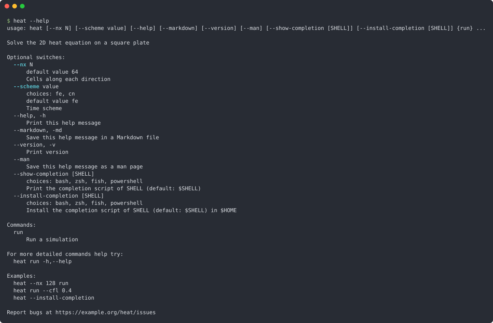

<div align="center">

# FLAP
#### Fortran command Line Arguments Parser

[](https://github.com/szaghi/FLAP/tags)
[](https://github.com/szaghi/FLAP/issues)
[](https://github.com/szaghi/FLAP/actions/workflows/ci.yml)
[](https://github.com/szaghi/FLAP/actions/workflows/ci.yml)
[](#copyrights)

> Describe your command line once, in pure Fortran 2018: FLAP parses it, reads the environment and the configuration files,
> checks every value, and writes the help, the errors, the man page and the shell completions.
> From three options to git-style commands, with a handful of calls.


<sub>A real session of the short program of the <a href="#quick-start">quick start</a> below: help, values and errors all come from FLAP.</sub>

<div>
<table>
<tr>
<td width="50%"><b>🧩 Every kind of argument</b><br><sub>Options with abbreviations, positionals, flags and <code>--x/--no-x</code> pairs, counters (<code>-vvv</code>), repeatable options, optional values, inline <code>--opt=value</code>, hidden arguments, value placeholders. <a href="https://szaghi.github.io/FLAP/guide/arguments">Defining arguments</a></sub></td>
<td width="50%"><b>🔢 Typed values, lists and maps</b><br><sub>One <code>get</code> for every integer and real kind, logicals and strings; fixed-size lists (<code>nargs='3'</code>), runtime-sized ones (<code>'+'</code>, <code>'*'</code>) into allocatable arrays, <code>KEY=VALUE</code> maps. <a href="https://szaghi.github.io/FLAP/guide/parsing">Parsing &amp; getting values</a> · <a href="https://szaghi.github.io/FLAP/guide/arguments#key-value-options-map">Maps</a></sub></td>
</tr>
<tr>
<td width="50%"><b>✅ Validation built in</b><br><sub>Required options, choices, numeric ranges with open bounds or clamping, path checks (exists, readable, writable), mutually exclusive sets, deprecation warnings: declared in the definition, checked for you. <a href="https://szaghi.github.io/FLAP/guide/advanced#numeric-ranges">Ranges</a> · <a href="https://szaghi.github.io/FLAP/guide/advanced#path-checks">Paths</a> · <a href="https://szaghi.github.io/FLAP/guide/advanced#mutually-exclusive-sets">Exclusive sets</a></sub></td>
<td width="50%"><b>💬 Errors that help</b><br><sub><code>switch "--tiems" is unknown! Did you mean "--times"?</code> Suggestions, a hint line, the usage after an error, a named constant for every code, and your own errors printed in the same style. <a href="https://szaghi.github.io/FLAP/guide/errors">Errors</a></sub></td>
</tr>
<tr>
<td width="50%"><b>🔀 Commands</b><br><sub>git-style commands, each with its options and its help; aliases, option sets shared between commands, mutually exclusive commands, several commands on one command line. <a href="https://szaghi.github.io/FLAP/guide/subcommands">Subcommands</a></sub></td>
<td width="50%"><b>🌱 Values from everywhere</b><br><sub>Command line, environment variables (named or generated from a prefix), INI configuration files and defaults, in a fixed precedence; the source of every value reported, for reproducible runs. <a href="https://szaghi.github.io/FLAP/guide/advanced#value-sources">Value sources</a> · <a href="https://szaghi.github.io/FLAP/guide/advanced#configuration-files">Configuration files</a></sub></td>
</tr>
<tr>
<td width="50%"><b>📄 Help, man page, Markdown</b><br><sub>The help and the usage are generated from the definitions, with colours, examples and an epilog; <code>--man</code> and <code>--markdown</code> save the same content as a man page and a Markdown file. <a href="https://szaghi.github.io/FLAP/guide/output">Output formats</a></sub></td>
<td width="50%"><b>⌨️ Shell completion</b><br><sub>Completion scripts for bash, zsh, fish and PowerShell, which the program prints or installs by itself: <code>--show-completion</code>, <code>--install-completion</code>. <a href="https://szaghi.github.io/FLAP/guide/output#shell-completion">Shell completion</a></sub></td>
</tr>
<tr>
<td width="50%"><b>🧪 Testable command lines</b><br><sub>Parse a string instead of the real command line, parse again, get statuses back instead of stops, send the messages to the units you choose: your CLI can be unit tested. <a href="https://szaghi.github.io/FLAP/manual/tutorial/08-testing">Testing</a></sub></td>
<td width="50%"><b>🙋 Interactive menus</b><br><sub>An opt-in module asks for what is missing: single or multiple choice, defaults, yes/no questions, retries; it never blocks a batch job. <a href="https://szaghi.github.io/FLAP/guide/menu">Interactive menus</a></sub></td>
</tr>
<tr>
<td width="50%"><b>🛠️ Standard Fortran, any build</b><br><sub>Fortran 2018, tested with gfortran 13 to 16, nvfortran and Intel ifx; built with FoBiS, fpm, CMake or Make. Two small dependencies, fetched for you. <a href="https://szaghi.github.io/FLAP/guide/install">Installation</a></sub></td>
<td width="50%"><b>🔓 Multi-licensed</b><br><sub>GPL v3 for FOSS projects; BSD 2-Clause, BSD 3-Clause or MIT for closed source and commercial ones: pick the license that fits. <a href="#copyrights">Copyrights</a></sub></td>
</tr>
</table>
</div>

**[Full documentation](https://szaghi.github.io/FLAP/)** · [Tutorial](https://szaghi.github.io/FLAP/manual/tutorial/01-first-cli) · [Cookbook](https://szaghi.github.io/FLAP/manual/cookbook) · [API reference](https://szaghi.github.io/FLAP/api/)

</div>

## Quick start

Four steps: initialise, define, parse, get. This is the whole program behind the session above.

```fortran
program greet
!< Quick start: a positional, a ranged integer, a choice read from the environment too, a flag.
use flap
implicit none
type(command_line_interface) :: cli
character(32)                :: name, lang, hello
integer                      :: times, i, error
logical                      :: shout

call cli%init(progname='greet', version='v1.0', description='Greet someone, in a few languages', &
              error_color='red', error_style='bold_on')
call cli%add(positional=.true., position=1, help='Who to greet', required=.true., metavar='NAME')
call cli%add(switch='--times', switch_ab='-t', help='How many times', def='1', min='1', max='5', metavar='N', &
             help_color='cyan', help_style='bold_on')
call cli%add(switch='--lang', help='Language', def='en', choices='en,it,fr', envvar='GREET_LANG', metavar='LANG', &
             help_color='cyan', help_style='bold_on')
call cli%add(switch='--shout', help='Say it louder', act='store_true', def='.false.', &
             help_color='cyan', help_style='bold_on')
call cli%parse(error=error)                 ! prints the help, the version or the error by itself
if (error /= 0) stop 1, quiet=.true.
call cli%get(position=1, val=name, error=error)       ; if (error /= 0) stop 1, quiet=.true.
call cli%get(switch='--times', val=times, error=error) ; if (error /= 0) stop 1, quiet=.true.
call cli%get(switch='--lang', val=lang, error=error)   ; if (error /= 0) stop 1, quiet=.true.
call cli%get(switch='--shout', val=shout, error=error) ; if (error /= 0) stop 1, quiet=.true.

select case(trim(lang))
case('it') ; hello = 'Ciao'
case('fr') ; hello = 'Salut'
case default ; hello = 'Hello'
endselect
do i = 1, times
  print '(A)', trim(hello)//' '//trim(name)//merge('!', '.', shout)
enddo
endprogram greet
```

That buys a typed positional, a ranged integer, a choice that can also come from `GREET_LANG`, a flag, a coloured
`--help`, `--version`, and errors that say what to fix:

```console
$ greet World --times 3 --shout
Hello World!
Hello World!
Hello World!
```

## Grows with your program

The same calls scale to commands, configuration files, a man page and shell completion. This help is generated from
the definitions of the `heat` solver built step by step in the
[tutorial](https://szaghi.github.io/FLAP/manual/tutorial/01-first-cli):

<p align="center"></p>

New to FLAP? The [tutorial](https://szaghi.github.io/FLAP/manual/tutorial/01-first-cli) builds a complete program
step by step; the [cookbook](https://szaghi.github.io/FLAP/manual/cookbook) has short recipes. Every feature has a
compiled, runnable example in [`docs/examples/src`](docs/examples/src), shown with its real output in the
[guide](https://szaghi.github.io/FLAP/guide/).

## Install

### FoBiS

**Standalone** — clone, fetch dependencies, and build:

```bash
git clone https://github.com/szaghi/FLAP && cd FLAP
fobis fetch                           # fetch PENF, FACE
fobis build --mode static-gnu         # build static library
```

**As a project dependency** — declare FLAP in your `fobos` and run `fetch`:

```ini
[dependencies]
deps_dir = src/third_party
FLAP = https://github.com/szaghi/FLAP
```

```bash
fobis fetch              # fetch and build
fobis fetch --update     # re-fetch and rebuild
```

### fpm

Add to your `fpm.toml`:

```toml
[dependencies]
FLAP = { git = "https://github.com/szaghi/FLAP", tag = "v2.5.0" }
```

### CMake

```bash
fobis fetch                            # PENF and FACE into src/third_party
cmake -B build && cmake --build build
```

### GNU Make

```bash
fobis fetch
make STATIC=yes                        # exe/libflap.a
```

A Fortran 2018 compiler is required: tested with gfortran 13 to 16, nvfortran 26.5 and Intel ifx 2025.3 (see
[Installation](https://szaghi.github.io/FLAP/guide/install)).

## Authors

- Stefano Zaghi — [@szaghi](https://github.com/szaghi)

Contributions are welcome — see the [Contributing](https://szaghi.github.io/FLAP/guide/contributing) page.

## Copyrights

This project is distributed under a multi-licensing system:

- **FOSS projects**: [GPL v3](http://www.gnu.org/licenses/gpl-3.0.html)
- **Closed source / commercial**: [BSD 2-Clause](http://opensource.org/licenses/BSD-2-Clause), [BSD 3-Clause](http://opensource.org/licenses/BSD-3-Clause), or [MIT](http://opensource.org/licenses/MIT)

> Anyone interested in using, developing, or contributing to this project is welcome — pick the license that best fits your needs.
