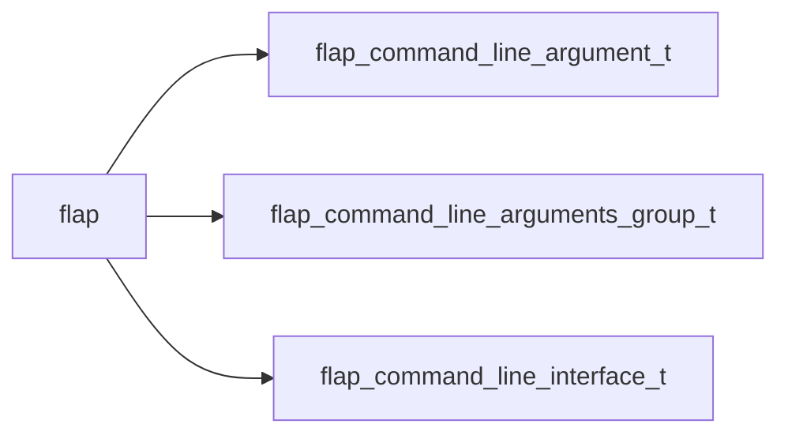

# flap

> FLAP, Fortran command Line Arguments Parser for poor people
{!README-FLAP.md!}

**Source**: `src/lib/flap.f90`

**Dependencies**

```mermaid
graph LR
  flap["flap"] --> flap_command_line_argument_t["flap_command_line_argument_t"]
  flap["flap"] --> flap_command_line_arguments_group_t["flap_command_line_arguments_group_t"]
  flap["flap"] --> flap_command_line_interface_t["flap_command_line_interface_t"]
```
