# flap_command_line_argument_t

> Command Line Argument (CLA) class.

**Source**: `src/lib/flap_command_line_argument_t.F90`

**Dependencies**

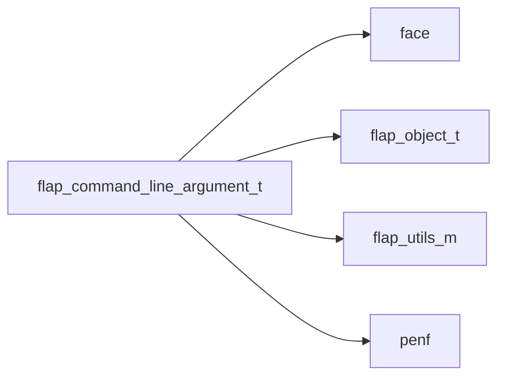

## Contents

- [command_line_argument](#command-line-argument)
- [free](#free)
- [check](#check)
- [raise_error_m_exclude](#raise-error-m-exclude)
- [raise_error_nargs_insufficient](#raise-error-nargs-insufficient)
- [raise_error_value_missing](#raise-error-value-missing)
- [raise_error_switch_unknown](#raise-error-switch-unknown)
- [raise_error_duplicated_clas](#raise-error-duplicated-clas)
- [sanitize_defaults](#sanitize-defaults)
- [errored](#errored)
- [check_envvar_consistency](#check-envvar-consistency)
- [check_action_consistency](#check-action-consistency)
- [check_optional_consistency](#check-optional-consistency)
- [check_m_exclude_consistency](#check-m-exclude-consistency)
- [check_named_consistency](#check-named-consistency)
- [check_positional_consistency](#check-positional-consistency)
- [check_choices](#check-choices)
- [get_cla](#get-cla)
- [get_cla_from_buffer](#get-cla-from-buffer)
- [get_cla_list](#get-cla-list)
- [get_cla_list_from_buffer](#get-cla-list-from-buffer)
- [get_cla_list_varying_R16P](#get-cla-list-varying-r16p)
- [get_cla_list_varying_R8P](#get-cla-list-varying-r8p)
- [get_cla_list_varying_R4P](#get-cla-list-varying-r4p)
- [get_cla_list_varying_I8P](#get-cla-list-varying-i8p)
- [get_cla_list_varying_I4P](#get-cla-list-varying-i4p)
- [get_cla_list_varying_I2P](#get-cla-list-varying-i2p)
- [get_cla_list_varying_I1P](#get-cla-list-varying-i1p)
- [get_cla_list_varying_logical](#get-cla-list-varying-logical)
- [get_cla_list_varying_char](#get-cla-list-varying-char)
- [cla_assign_cla](#cla-assign-cla)
- [finalize](#finalize)
- [is_required_passed](#is-required-passed)
- [is_required_val_passed](#is-required-val-passed)
- [usage](#usage)
- [signature](#signature)
- [has_choices](#has-choices)
- [check_list_size](#check-list-size)

## Variables

| Name | Type | Attributes | Description |
|------|------|------------|-------------|
| `ACTION_STORE` | character(len=*) | parameter | Store value (if invoked a value must be passed). |
| `ACTION_STORE_STAR` | character(len=*) | parameter | Store value or revert on default if invoked alone. |
| `ACTION_STORE_TRUE` | character(len=*) | parameter | Store .true. without the necessity of a value. |
| `ACTION_STORE_FALSE` | character(len=*) | parameter | Store .false. without the necessity of a value. |
| `ACTION_PRINT_HELP` | character(len=*) | parameter | Print help message. |
| `ACTION_PRINT_MARK` | character(len=*) | parameter | Print help to Markdown file. |
| `ACTION_PRINT_VERS` | character(len=*) | parameter | Print version. |
| `ARGS_SEP` | character(len=*) | parameter | Arguments separator for multiple valued (list) CLA. |
| `ERROR_OPTIONAL_NO_DEF` | integer(kind=[I4P](/api/src/third_party/PENF/src/lib/penf_global_parameters_variables)) | parameter | Optional CLA without default value. |
| `ERROR_REQUIRED_M_EXCLUDE` | integer(kind=[I4P](/api/src/third_party/PENF/src/lib/penf_global_parameters_variables)) | parameter | Required CLA cannot exclude others. |
| `ERROR_POSITIONAL_M_EXCLUDE` | integer(kind=[I4P](/api/src/third_party/PENF/src/lib/penf_global_parameters_variables)) | parameter | Positional CLA cannot exclude others. |
| `ERROR_NAMED_NO_NAME` | integer(kind=[I4P](/api/src/third_party/PENF/src/lib/penf_global_parameters_variables)) | parameter | Named CLA without switch name. |
| `ERROR_POSITIONAL_NO_POSITION` | integer(kind=[I4P](/api/src/third_party/PENF/src/lib/penf_global_parameters_variables)) | parameter | Positional CLA without position. |
| `ERROR_POSITIONAL_NO_STORE` | integer(kind=[I4P](/api/src/third_party/PENF/src/lib/penf_global_parameters_variables)) | parameter | Positional CLA without action_store. |
| `ERROR_NOT_IN_CHOICES` | integer(kind=[I4P](/api/src/third_party/PENF/src/lib/penf_global_parameters_variables)) | parameter | CLA value out of a specified choices. |
| `ERROR_MISSING_REQUIRED` | integer(kind=[I4P](/api/src/third_party/PENF/src/lib/penf_global_parameters_variables)) | parameter | Missing required CLA. |
| `ERROR_M_EXCLUDE` | integer(kind=[I4P](/api/src/third_party/PENF/src/lib/penf_global_parameters_variables)) | parameter | Two mutually exclusive CLAs have been passed. |
| `ERROR_CASTING_LOGICAL` | integer(kind=[I4P](/api/src/third_party/PENF/src/lib/penf_global_parameters_variables)) | parameter | Error casting CLA value to logical type. |
| `ERROR_CHOICES_LOGICAL` | integer(kind=[I4P](/api/src/third_party/PENF/src/lib/penf_global_parameters_variables)) | parameter | Error adding choices check for CLA val of logical type. |
| `ERROR_NO_LIST` | integer(kind=[I4P](/api/src/third_party/PENF/src/lib/penf_global_parameters_variables)) | parameter | Actual CLA is not list-values. |
| `ERROR_NARGS_INSUFFICIENT` | integer(kind=[I4P](/api/src/third_party/PENF/src/lib/penf_global_parameters_variables)) | parameter | Multi-valued CLA with insufficient arguments. |
| `ERROR_VALUE_MISSING` | integer(kind=[I4P](/api/src/third_party/PENF/src/lib/penf_global_parameters_variables)) | parameter | Missing value of CLA. |
| `ERROR_UNKNOWN` | integer(kind=[I4P](/api/src/third_party/PENF/src/lib/penf_global_parameters_variables)) | parameter | Unknown CLA (switch name). |
| `ERROR_ENVVAR_POSITIONAL` | integer(kind=[I4P](/api/src/third_party/PENF/src/lib/penf_global_parameters_variables)) | parameter | Envvar not allowed for positional CLA. |
| `ERROR_ENVVAR_NOT_STORE` | integer(kind=[I4P](/api/src/third_party/PENF/src/lib/penf_global_parameters_variables)) | parameter | Envvar not allowed action different from store; |
| `ERROR_ENVVAR_NARGS` | integer(kind=[I4P](/api/src/third_party/PENF/src/lib/penf_global_parameters_variables)) | parameter | Envvar not allowed for list-values CLA. |
| `ERROR_STORE_STAR_POSITIONAL` | integer(kind=[I4P](/api/src/third_party/PENF/src/lib/penf_global_parameters_variables)) | parameter | Action store* not allowed for positional CLA. |
| `ERROR_STORE_STAR_NARGS` | integer(kind=[I4P](/api/src/third_party/PENF/src/lib/penf_global_parameters_variables)) | parameter | Action store* not allowed for list-values CLA. |
| `ERROR_STORE_STAR_ENVVAR` | integer(kind=[I4P](/api/src/third_party/PENF/src/lib/penf_global_parameters_variables)) | parameter | Action store* not allowed for environment variable CLA. |
| `ERROR_ACTION_UNKNOWN` | integer(kind=[I4P](/api/src/third_party/PENF/src/lib/penf_global_parameters_variables)) | parameter | Unknown CLA (switch name). |
| `ERROR_DUPLICATED_CLAS` | integer(kind=[I4P](/api/src/third_party/PENF/src/lib/penf_global_parameters_variables)) | parameter | Duplicated CLAs passed, passed multiple instance of the same CLA. |
| `ERROR_MISSING_REQUIRED_VAL` | integer(kind=[I4P](/api/src/third_party/PENF/src/lib/penf_global_parameters_variables)) | parameter | Missing required value of CLA. |

## Derived Types

### command_line_argument

Command Line Argument (CLA) class.

 @note If not otherwise declared the action on CLA value is set to "store" a value.

**Inheritance**

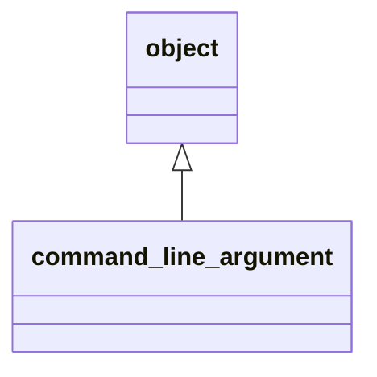

**Extends**: [`object`](/api/src/lib/flap_object_t#object)

#### Components

| Name | Type | Attributes | Description |
|------|------|------------|-------------|
| `progname` | character(len=:) | allocatable | Program name. |
| `version` | character(len=:) | allocatable | Program version. |
| `help` | character(len=:) | allocatable | Help message. |
| `help_color` | character(len=:) | allocatable | ANSI color of help messages. |
| `help_style` | character(len=:) | allocatable | ANSI style of help messages. |
| `help_markdown` | character(len=:) | allocatable | Longer help message, markdown formatted. |
| `description` | character(len=:) | allocatable | Detailed description. |
| `license` | character(len=:) | allocatable | License description. |
| `authors` | character(len=:) | allocatable | Authors list. |
| `epilog` | character(len=:) | allocatable | Epilogue message. |
| `m_exclude` | character(len=:) | allocatable | Mutually exclude other CLA(s group). |
| `error_message` | character(len=:) | allocatable | Meaningful error message to standard-error. |
| `error_color` | character(len=:) | allocatable | ANSI color of error messages. |
| `error_style` | character(len=:) | allocatable | ANSI style of error messages. |
| `examples` | character(len=512) | allocatable | Examples of correct usage. |
| `error` | integer(kind=[I4P](/api/src/third_party/PENF/src/lib/penf_global_parameters_variables)) |  | Error trapping flag. |
| `usage_lun` | integer(kind=[I4P](/api/src/third_party/PENF/src/lib/penf_global_parameters_variables)) |  | Output unit to print help/usage messages |
| `version_lun` | integer(kind=[I4P](/api/src/third_party/PENF/src/lib/penf_global_parameters_variables)) |  | Output unit to print version message |
| `error_lun` | integer(kind=[I4P](/api/src/third_party/PENF/src/lib/penf_global_parameters_variables)) |  | Error unit to print error messages |
| `switch` | character(len=:) | allocatable | Switch name. |
| `switch_ab` | character(len=:) | allocatable | Abbreviated switch name. |
| `act` | character(len=:) | allocatable | CLA value action. |
| `def` | character(len=:) | allocatable | Default value. |
| `nargs` | character(len=:) | allocatable | Number of arguments consumed by CLA. |
| `choices` | character(len=:) | allocatable | List (comma separated) of allowable values for the argument. |
| `val` | character(len=:) | allocatable | CLA value. |
| `envvar` | character(len=:) | allocatable | Environment variable from which take value. |
| `is_required` | logical |  | Flag for set required argument. |
| `is_positional` | logical |  | Flag for checking if CLA is a positional or a named CLA. |
| `position` | integer(kind=[I4P](/api/src/third_party/PENF/src/lib/penf_global_parameters_variables)) |  | Position of positional CLA. |
| `is_passed` | logical |  | Flag for checking if CLA has been passed to CLI. |
| `is_hidden` | logical |  | Flag for hiding CLA, thus it does not compare into help. |
| `is_val_required` | logical |  | Flag for set required value for not required (optional) CLA. |

#### Type-Bound Procedures

| Name | Attributes | Description |
|------|------------|-------------|
| `free_object` | pass(self) | Free dynamic memory. |
| `print_version` | pass(self) | Print version. |
| `print_error_message` | pass(self) | Print meaningful error message. |
| `set_examples` | pass(self) | Set examples of correct usage. |
| `assign_object` | pass(lhs ) | Assignment overloading. |
| `free` |  | Free dynamic memory. |
| `check` |  | Check data consistency. |
| `is_required_passed` |  | Check if required CLA is passed. |
| `raise_error_m_exclude` |  | Raise error mutually exclusive CLAs passed. |
| `raise_error_nargs_insufficient` |  | Raise error insufficient number of argument values passed. |
| `raise_error_value_missing` |  | Raise error missing value. |
| `raise_error_switch_unknown` |  | Raise error switch_unknown. |
| `raise_error_duplicated_clas` |  | Raise error duplicated CLAs passed. |
| `get` |  | Get CLA value(s). |
| `get_varying` |  | Get CLA value(s) from varying size list. |
| `has_choices` |  | Return true if CLA has defined choices. |
| `sanitize_defaults` |  | Sanitize default values. |
| `signature` |  | Get signature. |
| `usage` |  | Get correct usage. |
| `errored` |  | Trig error occurence and print meaningful message. |
| `check_envvar_consistency` |  | Check data consistency for envvar CLA. |
| `check_action_consistency` |  | Check CLA action consistency. |
| `check_optional_consistency` |  | Check optional CLA consistency. |
| `check_m_exclude_consistency` |  | Check mutually exclusion consistency. |
| `check_named_consistency` |  | Check named CLA consistency. |
| `check_positional_consistency` |  | Check positional CLA consistency. |
| `check_choices` |  | Check if CLA value is in allowed choices. |
| `check_list_size` |  | Check CLA multiple values list size consistency. |
| `get_cla` |  | Get CLA (single) value. |
| `get_cla_from_buffer` |  | Get CLA (single) value from a buffer. |
| `get_cla_list` |  | Get CLA multiple values. |
| `get_cla_list_from_buffer` |  | Get CLA (single) value from a buffer. |
| `get_cla_list_varying_R16P` |  | Get CLA multiple values, varying size, R16P. |
| `get_cla_list_varying_R8P` |  | Get CLA multiple values, varying size, R8P. |
| `get_cla_list_varying_R4P` |  | Get CLA multiple values, varying size, R4P. |
| `get_cla_list_varying_I8P` |  | Get CLA multiple values, varying size, I8P. |
| `get_cla_list_varying_I4P` |  | Get CLA multiple values, varying size, I4P. |
| `get_cla_list_varying_I2P` |  | Get CLA multiple values, varying size, I2P. |
| `get_cla_list_varying_I1P` |  | Get CLA multiple values, varying size, I1P. |
| `get_cla_list_varying_logical` |  | Get CLA multiple values, varying size, bool. |
| `get_cla_list_varying_char` |  | Get CLA multiple values, varying size, char. |
| `cla_assign_cla` |  | Assignment operator. |
| `assignment(=)` |  | Assignment operator overloading. |

## Subroutines

### free

Free dynamic memory.

**Attributes**: elemental

```fortran
subroutine free(self)
```

**Arguments**

| Name | Type | Intent | Attributes | Description |
|------|------|--------|------------|-------------|
| `self` | class([command_line_argument](/api/src/lib/flap_command_line_argument_t#command-line-argument)) | inout |  | CLA data. |

**Call graph**

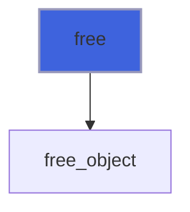

### check

Check data consistency.

```fortran
subroutine check(self, pref)
```

**Arguments**

| Name | Type | Intent | Attributes | Description |
|------|------|--------|------------|-------------|
| `self` | class([command_line_argument](/api/src/lib/flap_command_line_argument_t#command-line-argument)) | inout |  | CLA data. |
| `pref` | character(len=*) | in | optional | Prefixing string. |

**Call graph**

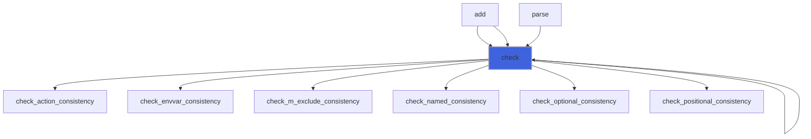

### raise_error_m_exclude

Raise error mutually exclusive CLAs passed.

```fortran
subroutine raise_error_m_exclude(self, pref)
```

**Arguments**

| Name | Type | Intent | Attributes | Description |
|------|------|--------|------------|-------------|
| `self` | class([command_line_argument](/api/src/lib/flap_command_line_argument_t#command-line-argument)) | inout |  | CLA data. |
| `pref` | character(len=*) | in | optional | Prefixing string. |

**Call graph**

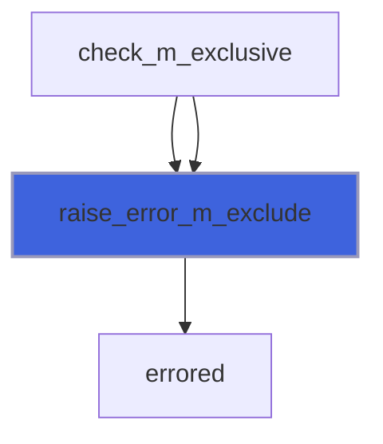

### raise_error_nargs_insufficient

Raise error insufficient number of argument values passed.

```fortran
subroutine raise_error_nargs_insufficient(self, pref)
```

**Arguments**

| Name | Type | Intent | Attributes | Description |
|------|------|--------|------------|-------------|
| `self` | class([command_line_argument](/api/src/lib/flap_command_line_argument_t#command-line-argument)) | inout |  | CLA data. |
| `pref` | character(len=*) | in | optional | Prefixing string. |

**Call graph**


### raise_error_value_missing

Raise error missing value.

```fortran
subroutine raise_error_value_missing(self, pref)
```

**Arguments**

| Name | Type | Intent | Attributes | Description |
|------|------|--------|------------|-------------|
| `self` | class([command_line_argument](/api/src/lib/flap_command_line_argument_t#command-line-argument)) | inout |  | CLA data. |
| `pref` | character(len=*) | in | optional | Prefixing string. |

**Call graph**


### raise_error_switch_unknown

Raise error switch_unknown.

```fortran
subroutine raise_error_switch_unknown(self, switch, pref)
```

**Arguments**

| Name | Type | Intent | Attributes | Description |
|------|------|--------|------------|-------------|
| `self` | class([command_line_argument](/api/src/lib/flap_command_line_argument_t#command-line-argument)) | inout |  | CLA data. |
| `switch` | character(len=*) | in | optional | CLA switch name. |
| `pref` | character(len=*) | in | optional | Prefixing string. |

**Call graph**

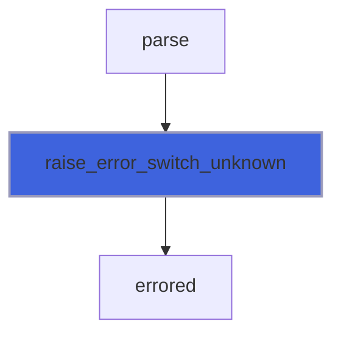

### raise_error_duplicated_clas

Raise error duplicated CLAs passed.

```fortran
subroutine raise_error_duplicated_clas(self, switch, pref)
```

**Arguments**

| Name | Type | Intent | Attributes | Description |
|------|------|--------|------------|-------------|
| `self` | class([command_line_argument](/api/src/lib/flap_command_line_argument_t#command-line-argument)) | inout |  | CLA data. |
| `switch` | character(len=*) | in | optional | CLA switch name. |
| `pref` | character(len=*) | in | optional | Prefixing string. |

**Call graph**

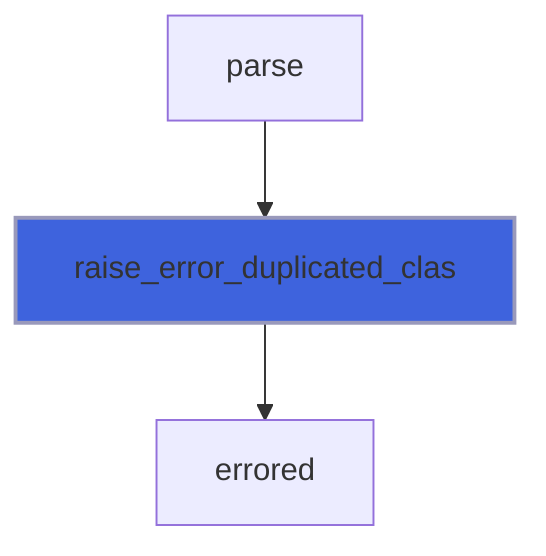

### sanitize_defaults

Sanitize defaults values.

 It is necessary to *sanitize* the default values of non-passed, optional CLA.

```fortran
subroutine sanitize_defaults(self)
```

**Arguments**

| Name | Type | Intent | Attributes | Description |
|------|------|--------|------------|-------------|
| `self` | class([command_line_argument](/api/src/lib/flap_command_line_argument_t#command-line-argument)) | inout |  | CLAsG data. |

**Call graph**

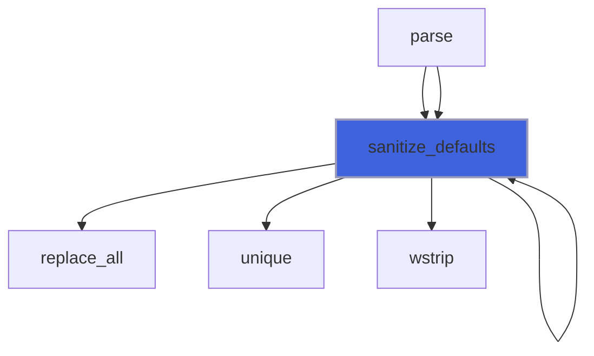

### errored

Trig error occurence and print meaningful message.

```fortran
subroutine errored(self, error, pref, switch, val_str, log_value)
```

**Arguments**

| Name | Type | Intent | Attributes | Description |
|------|------|--------|------------|-------------|
| `self` | class([command_line_argument](/api/src/lib/flap_command_line_argument_t#command-line-argument)) | inout |  | CLA data. |
| `error` | integer(kind=[I4P](/api/src/third_party/PENF/src/lib/penf_global_parameters_variables)) | in |  | Error occurred. |
| `pref` | character(len=*) | in | optional | Prefixing string. |
| `switch` | character(len=*) | in | optional | CLA switch name. |
| `val_str` | character(len=*) | in | optional | Value string. |
| `log_value` | character(len=*) | in | optional | Logical value to be casted. |

**Call graph**

```mermaid
flowchart TD
  check["check"] --> errored["errored"]
  check_action_consistency["check_action_consistency"] --> errored["errored"]
  check_choices["check_choices"] --> errored["errored"]
  check_envvar_consistency["check_envvar_consistency"] --> errored["errored"]
  check_list_size["check_list_size"] --> errored["errored"]
  check_m_exclude_consistency["check_m_exclude_consistency"] --> errored["errored"]
  check_named_consistency["check_named_consistency"] --> errored["errored"]
  check_optional_consistency["check_optional_consistency"] --> errored["errored"]
  check_positional_consistency["check_positional_consistency"] --> errored["errored"]
  get_cla["get_cla"] --> errored["errored"]
  get_cla["get_cla"] --> errored["errored"]
  get_cla_from_buffer["get_cla_from_buffer"] --> errored["errored"]
  get_cla_list["get_cla_list"] --> errored["errored"]
  get_cla_list["get_cla_list"] --> errored["errored"]
  get_cla_list_from_buffer["get_cla_list_from_buffer"] --> errored["errored"]
  get_cla_list_varying_I1P["get_cla_list_varying_I1P"] --> errored["errored"]
  get_cla_list_varying_I1P["get_cla_list_varying_I1P"] --> errored["errored"]
  get_cla_list_varying_I2P["get_cla_list_varying_I2P"] --> errored["errored"]
  get_cla_list_varying_I2P["get_cla_list_varying_I2P"] --> errored["errored"]
  get_cla_list_varying_I4P["get_cla_list_varying_I4P"] --> errored["errored"]
  get_cla_list_varying_I4P["get_cla_list_varying_I4P"] --> errored["errored"]
  get_cla_list_varying_I8P["get_cla_list_varying_I8P"] --> errored["errored"]
  get_cla_list_varying_I8P["get_cla_list_varying_I8P"] --> errored["errored"]
  get_cla_list_varying_R16P["get_cla_list_varying_R16P"] --> errored["errored"]
  get_cla_list_varying_R16P["get_cla_list_varying_R16P"] --> errored["errored"]
  get_cla_list_varying_R4P["get_cla_list_varying_R4P"] --> errored["errored"]
  get_cla_list_varying_R4P["get_cla_list_varying_R4P"] --> errored["errored"]
  get_cla_list_varying_R8P["get_cla_list_varying_R8P"] --> errored["errored"]
  get_cla_list_varying_R8P["get_cla_list_varying_R8P"] --> errored["errored"]
  get_cla_list_varying_char["get_cla_list_varying_char"] --> errored["errored"]
  get_cla_list_varying_char["get_cla_list_varying_char"] --> errored["errored"]
  get_cla_list_varying_logical["get_cla_list_varying_logical"] --> errored["errored"]
  get_cla_list_varying_logical["get_cla_list_varying_logical"] --> errored["errored"]
  is_required_passed["is_required_passed"] --> errored["errored"]
  is_required_val_passed["is_required_val_passed"] --> errored["errored"]
  raise_error_duplicated_clas["raise_error_duplicated_clas"] --> errored["errored"]
  raise_error_m_exclude["raise_error_m_exclude"] --> errored["errored"]
  raise_error_m_exclude["raise_error_m_exclude"] --> errored["errored"]
  raise_error_nargs_insufficient["raise_error_nargs_insufficient"] --> errored["errored"]
  raise_error_switch_unknown["raise_error_switch_unknown"] --> errored["errored"]
  raise_error_value_missing["raise_error_value_missing"] --> errored["errored"]
  errored["errored"] --> colorize["colorize"]
  errored["errored"] --> print_error_message["print_error_message"]
  errored["errored"] --> str["str"]
  style errored fill:#3e63dd,stroke:#99b,stroke-width:2px
```

### check_envvar_consistency

Check data consistency for envvar CLA.

```fortran
subroutine check_envvar_consistency(self, pref)
```

**Arguments**

| Name | Type | Intent | Attributes | Description |
|------|------|--------|------------|-------------|
| `self` | class([command_line_argument](/api/src/lib/flap_command_line_argument_t#command-line-argument)) | inout |  | CLA data. |
| `pref` | character(len=*) | in | optional | Prefixing string. |

**Call graph**

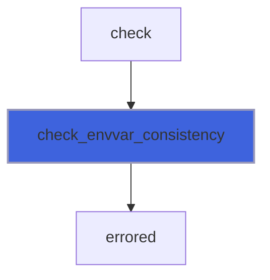

### check_action_consistency

Check CLA action consistency.

```fortran
subroutine check_action_consistency(self, pref)
```

**Arguments**

| Name | Type | Intent | Attributes | Description |
|------|------|--------|------------|-------------|
| `self` | class([command_line_argument](/api/src/lib/flap_command_line_argument_t#command-line-argument)) | inout |  | CLA data. |
| `pref` | character(len=*) | in | optional | Prefixing string. |

**Call graph**


### check_optional_consistency

Check optional CLA consistency.

```fortran
subroutine check_optional_consistency(self, pref)
```

**Arguments**

| Name | Type | Intent | Attributes | Description |
|------|------|--------|------------|-------------|
| `self` | class([command_line_argument](/api/src/lib/flap_command_line_argument_t#command-line-argument)) | inout |  | CLA data. |
| `pref` | character(len=*) | in | optional | Prefixing string. |

**Call graph**


### check_m_exclude_consistency

Check mutually exclusion consistency.

```fortran
subroutine check_m_exclude_consistency(self, pref)
```

**Arguments**

| Name | Type | Intent | Attributes | Description |
|------|------|--------|------------|-------------|
| `self` | class([command_line_argument](/api/src/lib/flap_command_line_argument_t#command-line-argument)) | inout |  | CLA data. |
| `pref` | character(len=*) | in | optional | Prefixing string. |

**Call graph**

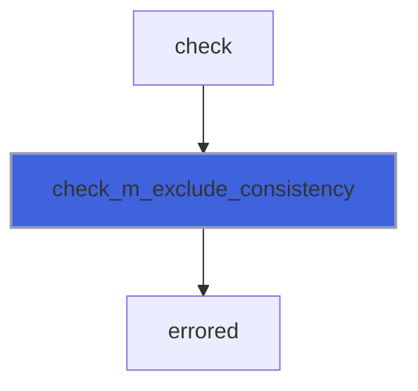

### check_named_consistency

Check named CLA consistency.

```fortran
subroutine check_named_consistency(self, pref)
```

**Arguments**

| Name | Type | Intent | Attributes | Description |
|------|------|--------|------------|-------------|
| `self` | class([command_line_argument](/api/src/lib/flap_command_line_argument_t#command-line-argument)) | inout |  | CLA data. |
| `pref` | character(len=*) | in | optional | Prefixing string. |

**Call graph**


### check_positional_consistency

Check positional CLA consistency.

```fortran
subroutine check_positional_consistency(self, pref)
```

**Arguments**

| Name | Type | Intent | Attributes | Description |
|------|------|--------|------------|-------------|
| `self` | class([command_line_argument](/api/src/lib/flap_command_line_argument_t#command-line-argument)) | inout |  | CLA data. |
| `pref` | character(len=*) | in | optional | Prefixing string. |

**Call graph**


### check_choices

Check if CLA value is in allowed choices.

 @note This procedure can be called if and only if cla%choices has been allocated.

```fortran
subroutine check_choices(self, val, pref)
```

**Arguments**

| Name | Type | Intent | Attributes | Description |
|------|------|--------|------------|-------------|
| `self` | class([command_line_argument](/api/src/lib/flap_command_line_argument_t#command-line-argument)) | inout |  | CLA data. |
| `val` | class(*) | in |  | CLA value. |
| `pref` | character(len=*) | in | optional | Prefixing string. |

**Call graph**

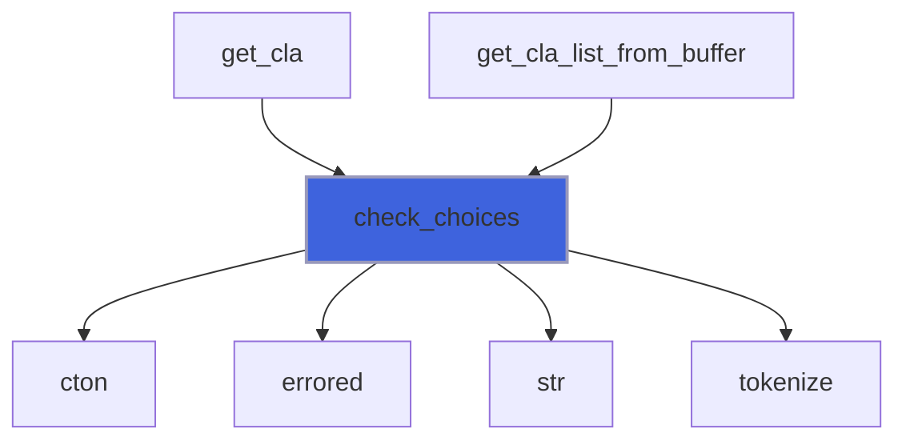

### get_cla

Get CLA (single) value.

```fortran
subroutine get_cla(self, val, pref)
```

**Arguments**

| Name | Type | Intent | Attributes | Description |
|------|------|--------|------------|-------------|
| `self` | class([command_line_argument](/api/src/lib/flap_command_line_argument_t#command-line-argument)) | inout |  | CLA data. |
| `val` | class(*) | inout |  | CLA value. |
| `pref` | character(len=*) | in | optional | Prefixing string. |

**Call graph**

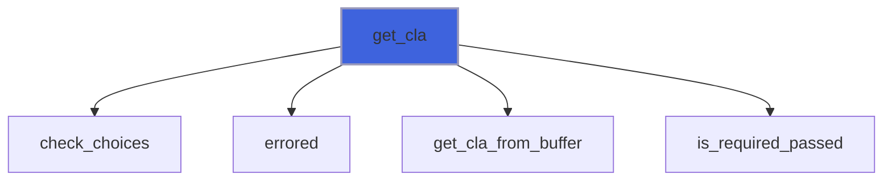

### get_cla_from_buffer

Get CLA (single) value from parsed value.

```fortran
subroutine get_cla_from_buffer(self, buffer, val, pref)
```

**Arguments**

| Name | Type | Intent | Attributes | Description |
|------|------|--------|------------|-------------|
| `self` | class([command_line_argument](/api/src/lib/flap_command_line_argument_t#command-line-argument)) | inout |  | CLA data. |
| `buffer` | character(len=*) | in |  | Buffer containing values (parsed or default CLA value). |
| `val` | class(*) | inout |  | CLA value. |
| `pref` | character(len=*) | in | optional | Prefixing string. |

**Call graph**

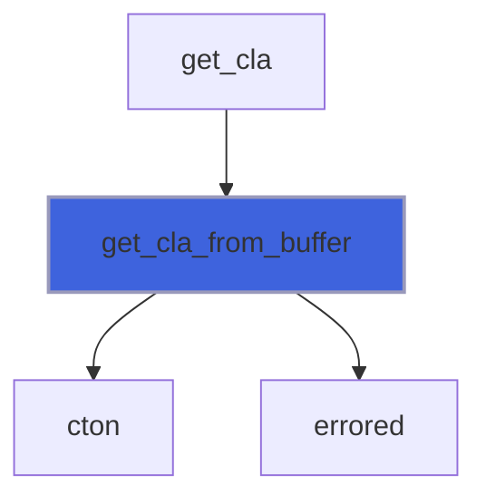

### get_cla_list

Get CLA multiple values.

```fortran
subroutine get_cla_list(self, pref, val)
```

**Arguments**

| Name | Type | Intent | Attributes | Description |
|------|------|--------|------------|-------------|
| `self` | class([command_line_argument](/api/src/lib/flap_command_line_argument_t#command-line-argument)) | inout |  | CLA data. |
| `pref` | character(len=*) | in | optional | Prefixing string. |
| `val` | class(*) | inout |  | CLA values. |

**Call graph**

```mermaid
flowchart TD
  get_cla_list["get_cla_list"] --> errored["errored"]
  get_cla_list["get_cla_list"] --> get_cla_list_from_buffer["get_cla_list_from_buffer"]
  get_cla_list["get_cla_list"] --> is_required_passed["is_required_passed"]
  get_cla_list["get_cla_list"] --> tokenize["tokenize"]
  style get_cla_list fill:#3e63dd,stroke:#99b,stroke-width:2px
```

### get_cla_list_from_buffer

Get CLA multiple values from a buffer.

```fortran
subroutine get_cla_list_from_buffer(self, buffer, val, pref)
```

**Arguments**

| Name | Type | Intent | Attributes | Description |
|------|------|--------|------------|-------------|
| `self` | class([command_line_argument](/api/src/lib/flap_command_line_argument_t#command-line-argument)) | inout |  | CLA data. |
| `buffer` | character(len=*) | in |  | Buffer containing values (parsed or default CLA value). |
| `val` | class(*) | inout |  | CLA value. |
| `pref` | character(len=*) | in | optional | Prefixing string. |

**Call graph**

```mermaid
flowchart TD
  get_cla_list["get_cla_list"] --> get_cla_list_from_buffer["get_cla_list_from_buffer"]
  get_cla_list_from_buffer["get_cla_list_from_buffer"] --> check_choices["check_choices"]
  get_cla_list_from_buffer["get_cla_list_from_buffer"] --> cton["cton"]
  get_cla_list_from_buffer["get_cla_list_from_buffer"] --> errored["errored"]
  get_cla_list_from_buffer["get_cla_list_from_buffer"] --> tokenize["tokenize"]
  style get_cla_list_from_buffer fill:#3e63dd,stroke:#99b,stroke-width:2px
```

### get_cla_list_varying_R16P

Get CLA (multiple) value with varying size, real(R16P).

```fortran
subroutine get_cla_list_varying_R16P(self, val, pref)
```

**Arguments**

| Name | Type | Intent | Attributes | Description |
|------|------|--------|------------|-------------|
| `self` | class([command_line_argument](/api/src/lib/flap_command_line_argument_t#command-line-argument)) | inout |  | CLA data. |
| `val` | real(kind=[R16P](/api/src/third_party/PENF/src/lib/penf_global_parameters_variables)) | out | allocatable | CLA values. |
| `pref` | character(len=*) | in | optional | Prefixing string. |

**Call graph**

```mermaid
flowchart TD
  get_cla_list_varying_R16P["get_cla_list_varying_R16P"] --> check_list_size["check_list_size"]
  get_cla_list_varying_R16P["get_cla_list_varying_R16P"] --> cton["cton"]
  get_cla_list_varying_R16P["get_cla_list_varying_R16P"] --> errored["errored"]
  get_cla_list_varying_R16P["get_cla_list_varying_R16P"] --> is_required_passed["is_required_passed"]
  get_cla_list_varying_R16P["get_cla_list_varying_R16P"] --> tokenize["tokenize"]
  style get_cla_list_varying_R16P fill:#3e63dd,stroke:#99b,stroke-width:2px
```

### get_cla_list_varying_R8P

Get CLA (multiple) value with varying size, real(R8P).

```fortran
subroutine get_cla_list_varying_R8P(self, val, pref)
```

**Arguments**

| Name | Type | Intent | Attributes | Description |
|------|------|--------|------------|-------------|
| `self` | class([command_line_argument](/api/src/lib/flap_command_line_argument_t#command-line-argument)) | inout |  | CLA data. |
| `val` | real(kind=[R8P](/api/src/third_party/PENF/src/lib/penf_global_parameters_variables)) | out | allocatable | CLA values. |
| `pref` | character(len=*) | in | optional | Prefixing string. |

**Call graph**

```mermaid
flowchart TD
  get_cla_list_varying_R8P["get_cla_list_varying_R8P"] --> check_list_size["check_list_size"]
  get_cla_list_varying_R8P["get_cla_list_varying_R8P"] --> cton["cton"]
  get_cla_list_varying_R8P["get_cla_list_varying_R8P"] --> errored["errored"]
  get_cla_list_varying_R8P["get_cla_list_varying_R8P"] --> is_required_passed["is_required_passed"]
  get_cla_list_varying_R8P["get_cla_list_varying_R8P"] --> tokenize["tokenize"]
  style get_cla_list_varying_R8P fill:#3e63dd,stroke:#99b,stroke-width:2px
```

### get_cla_list_varying_R4P

Get CLA (multiple) value with varying size, real(R4P).

```fortran
subroutine get_cla_list_varying_R4P(self, val, pref)
```

**Arguments**

| Name | Type | Intent | Attributes | Description |
|------|------|--------|------------|-------------|
| `self` | class([command_line_argument](/api/src/lib/flap_command_line_argument_t#command-line-argument)) | inout |  | CLA data. |
| `val` | real(kind=[R4P](/api/src/third_party/PENF/src/lib/penf_global_parameters_variables)) | out | allocatable | CLA values. |
| `pref` | character(len=*) | in | optional | Prefixing string. |

**Call graph**

```mermaid
flowchart TD
  get_cla_list_varying_R4P["get_cla_list_varying_R4P"] --> check_list_size["check_list_size"]
  get_cla_list_varying_R4P["get_cla_list_varying_R4P"] --> cton["cton"]
  get_cla_list_varying_R4P["get_cla_list_varying_R4P"] --> errored["errored"]
  get_cla_list_varying_R4P["get_cla_list_varying_R4P"] --> is_required_passed["is_required_passed"]
  get_cla_list_varying_R4P["get_cla_list_varying_R4P"] --> tokenize["tokenize"]
  style get_cla_list_varying_R4P fill:#3e63dd,stroke:#99b,stroke-width:2px
```

### get_cla_list_varying_I8P

Get CLA (multiple) value with varying size, integer(I8P).

```fortran
subroutine get_cla_list_varying_I8P(self, val, pref)
```

**Arguments**

| Name | Type | Intent | Attributes | Description |
|------|------|--------|------------|-------------|
| `self` | class([command_line_argument](/api/src/lib/flap_command_line_argument_t#command-line-argument)) | inout |  | CLA data. |
| `val` | integer(kind=[I8P](/api/src/third_party/PENF/src/lib/penf_global_parameters_variables)) | out | allocatable | CLA values. |
| `pref` | character(len=*) | in | optional | Prefixing string. |

**Call graph**

```mermaid
flowchart TD
  get_cla_list_varying_I8P["get_cla_list_varying_I8P"] --> check_list_size["check_list_size"]
  get_cla_list_varying_I8P["get_cla_list_varying_I8P"] --> cton["cton"]
  get_cla_list_varying_I8P["get_cla_list_varying_I8P"] --> errored["errored"]
  get_cla_list_varying_I8P["get_cla_list_varying_I8P"] --> is_required_passed["is_required_passed"]
  get_cla_list_varying_I8P["get_cla_list_varying_I8P"] --> tokenize["tokenize"]
  style get_cla_list_varying_I8P fill:#3e63dd,stroke:#99b,stroke-width:2px
```

### get_cla_list_varying_I4P

Get CLA (multiple) value with varying size, integer(I4P).

```fortran
subroutine get_cla_list_varying_I4P(self, val, pref)
```

**Arguments**

| Name | Type | Intent | Attributes | Description |
|------|------|--------|------------|-------------|
| `self` | class([command_line_argument](/api/src/lib/flap_command_line_argument_t#command-line-argument)) | inout |  | CLA data. |
| `val` | integer(kind=[I4P](/api/src/third_party/PENF/src/lib/penf_global_parameters_variables)) | out | allocatable | CLA values. |
| `pref` | character(len=*) | in | optional | Prefixing string. |

**Call graph**

```mermaid
flowchart TD
  get_cla_list_varying_I4P["get_cla_list_varying_I4P"] --> check_list_size["check_list_size"]
  get_cla_list_varying_I4P["get_cla_list_varying_I4P"] --> cton["cton"]
  get_cla_list_varying_I4P["get_cla_list_varying_I4P"] --> errored["errored"]
  get_cla_list_varying_I4P["get_cla_list_varying_I4P"] --> is_required_passed["is_required_passed"]
  get_cla_list_varying_I4P["get_cla_list_varying_I4P"] --> tokenize["tokenize"]
  style get_cla_list_varying_I4P fill:#3e63dd,stroke:#99b,stroke-width:2px
```

### get_cla_list_varying_I2P

Get CLA (multiple) value with varying size, integer(I2P).

```fortran
subroutine get_cla_list_varying_I2P(self, val, pref)
```

**Arguments**

| Name | Type | Intent | Attributes | Description |
|------|------|--------|------------|-------------|
| `self` | class([command_line_argument](/api/src/lib/flap_command_line_argument_t#command-line-argument)) | inout |  | CLA data. |
| `val` | integer(kind=[I2P](/api/src/third_party/PENF/src/lib/penf_global_parameters_variables)) | out | allocatable | CLA values. |
| `pref` | character(len=*) | in | optional | Prefixing string. |

**Call graph**

```mermaid
flowchart TD
  get_cla_list_varying_I2P["get_cla_list_varying_I2P"] --> check_list_size["check_list_size"]
  get_cla_list_varying_I2P["get_cla_list_varying_I2P"] --> cton["cton"]
  get_cla_list_varying_I2P["get_cla_list_varying_I2P"] --> errored["errored"]
  get_cla_list_varying_I2P["get_cla_list_varying_I2P"] --> is_required_passed["is_required_passed"]
  get_cla_list_varying_I2P["get_cla_list_varying_I2P"] --> tokenize["tokenize"]
  style get_cla_list_varying_I2P fill:#3e63dd,stroke:#99b,stroke-width:2px
```

### get_cla_list_varying_I1P

Get CLA (multiple) value with varying size, integer(I1P).

```fortran
subroutine get_cla_list_varying_I1P(self, val, pref)
```

**Arguments**

| Name | Type | Intent | Attributes | Description |
|------|------|--------|------------|-------------|
| `self` | class([command_line_argument](/api/src/lib/flap_command_line_argument_t#command-line-argument)) | inout |  | CLA data. |
| `val` | integer(kind=[I1P](/api/src/third_party/PENF/src/lib/penf_global_parameters_variables)) | out | allocatable | CLA values. |
| `pref` | character(len=*) | in | optional | Prefixing string. |

**Call graph**

```mermaid
flowchart TD
  get_cla_list_varying_I1P["get_cla_list_varying_I1P"] --> check_list_size["check_list_size"]
  get_cla_list_varying_I1P["get_cla_list_varying_I1P"] --> cton["cton"]
  get_cla_list_varying_I1P["get_cla_list_varying_I1P"] --> errored["errored"]
  get_cla_list_varying_I1P["get_cla_list_varying_I1P"] --> is_required_passed["is_required_passed"]
  get_cla_list_varying_I1P["get_cla_list_varying_I1P"] --> tokenize["tokenize"]
  style get_cla_list_varying_I1P fill:#3e63dd,stroke:#99b,stroke-width:2px
```

### get_cla_list_varying_logical

Get CLA (multiple) value with varying size, logical.

```fortran
subroutine get_cla_list_varying_logical(self, val, pref)
```

**Arguments**

| Name | Type | Intent | Attributes | Description |
|------|------|--------|------------|-------------|
| `self` | class([command_line_argument](/api/src/lib/flap_command_line_argument_t#command-line-argument)) | inout |  | CLA data. |
| `val` | logical | out | allocatable | CLA values. |
| `pref` | character(len=*) | in | optional | Prefixing string. |

**Call graph**

```mermaid
flowchart TD
  get_cla_list_varying_logical["get_cla_list_varying_logical"] --> check_list_size["check_list_size"]
  get_cla_list_varying_logical["get_cla_list_varying_logical"] --> errored["errored"]
  get_cla_list_varying_logical["get_cla_list_varying_logical"] --> is_required_passed["is_required_passed"]
  get_cla_list_varying_logical["get_cla_list_varying_logical"] --> tokenize["tokenize"]
  style get_cla_list_varying_logical fill:#3e63dd,stroke:#99b,stroke-width:2px
```

### get_cla_list_varying_char

Get CLA (multiple) value with varying size, character.

```fortran
subroutine get_cla_list_varying_char(self, val, pref)
```

**Arguments**

| Name | Type | Intent | Attributes | Description |
|------|------|--------|------------|-------------|
| `self` | class([command_line_argument](/api/src/lib/flap_command_line_argument_t#command-line-argument)) | inout |  | CLA data. |
| `val` | character(len=*) | out | allocatable | CLA values. |
| `pref` | character(len=*) | in | optional | Prefixing string. |

**Call graph**

```mermaid
flowchart TD
  get_cla_list_varying_char["get_cla_list_varying_char"] --> check_list_size["check_list_size"]
  get_cla_list_varying_char["get_cla_list_varying_char"] --> errored["errored"]
  get_cla_list_varying_char["get_cla_list_varying_char"] --> is_required_passed["is_required_passed"]
  get_cla_list_varying_char["get_cla_list_varying_char"] --> tokenize["tokenize"]
  style get_cla_list_varying_char fill:#3e63dd,stroke:#99b,stroke-width:2px
```

### cla_assign_cla

Assignment operator.

**Attributes**: elemental

```fortran
subroutine cla_assign_cla(lhs, rhs)
```

**Arguments**

| Name | Type | Intent | Attributes | Description |
|------|------|--------|------------|-------------|
| `lhs` | class([command_line_argument](/api/src/lib/flap_command_line_argument_t#command-line-argument)) | inout |  | Left hand side. |
| `rhs` | type([command_line_argument](/api/src/lib/flap_command_line_argument_t#command-line-argument)) | in |  | Rigth hand side. |

**Call graph**

```mermaid
flowchart TD
  cla_assign_cla["cla_assign_cla"] --> assign_object["assign_object"]
  style cla_assign_cla fill:#3e63dd,stroke:#99b,stroke-width:2px
```

### finalize

Free dynamic memory when finalizing.

**Attributes**: elemental

```fortran
subroutine finalize(self)
```

**Arguments**

| Name | Type | Intent | Attributes | Description |
|------|------|--------|------------|-------------|
| `self` | type([command_line_argument](/api/src/lib/flap_command_line_argument_t#command-line-argument)) | inout |  | CLA data. |

## Functions

### is_required_passed

Check if required CLA is passed.

**Returns**: `logical`

```fortran
function is_required_passed(self, pref) result(is_ok)
```

**Arguments**

| Name | Type | Intent | Attributes | Description |
|------|------|--------|------------|-------------|
| `self` | class([command_line_argument](/api/src/lib/flap_command_line_argument_t#command-line-argument)) | inout |  | CLA data. |
| `pref` | character(len=*) | in | optional | Prefixing string. |

**Call graph**

```mermaid
flowchart TD
  get_cla["get_cla"] --> is_required_passed["is_required_passed"]
  get_cla_list["get_cla_list"] --> is_required_passed["is_required_passed"]
  get_cla_list_varying_I1P["get_cla_list_varying_I1P"] --> is_required_passed["is_required_passed"]
  get_cla_list_varying_I2P["get_cla_list_varying_I2P"] --> is_required_passed["is_required_passed"]
  get_cla_list_varying_I4P["get_cla_list_varying_I4P"] --> is_required_passed["is_required_passed"]
  get_cla_list_varying_I8P["get_cla_list_varying_I8P"] --> is_required_passed["is_required_passed"]
  get_cla_list_varying_R16P["get_cla_list_varying_R16P"] --> is_required_passed["is_required_passed"]
  get_cla_list_varying_R4P["get_cla_list_varying_R4P"] --> is_required_passed["is_required_passed"]
  get_cla_list_varying_R8P["get_cla_list_varying_R8P"] --> is_required_passed["is_required_passed"]
  get_cla_list_varying_char["get_cla_list_varying_char"] --> is_required_passed["is_required_passed"]
  get_cla_list_varying_logical["get_cla_list_varying_logical"] --> is_required_passed["is_required_passed"]
  is_required_passed["is_required_passed"] --> is_required_passed["is_required_passed"]
  parse["parse"] --> is_required_passed["is_required_passed"]
  is_required_passed["is_required_passed"] --> errored["errored"]
  style is_required_passed fill:#3e63dd,stroke:#99b,stroke-width:2px
```

### is_required_val_passed

Check if required value of CLA is passed.

**Returns**: `logical`

```fortran
function is_required_val_passed(self, pref) result(is_ok)
```

**Arguments**

| Name | Type | Intent | Attributes | Description |
|------|------|--------|------------|-------------|
| `self` | class([command_line_argument](/api/src/lib/flap_command_line_argument_t#command-line-argument)) | inout |  | CLA data. |
| `pref` | character(len=*) | in | optional | Prefixing string. |

**Call graph**

```mermaid
flowchart TD
  is_required_val_passed["is_required_val_passed"] --> errored["errored"]
  style is_required_val_passed fill:#3e63dd,stroke:#99b,stroke-width:2px
```

### usage

Get correct usage.

**Returns**: `character(len=:)`

```fortran
function usage(self, pref, markdown)
```

**Arguments**

| Name | Type | Intent | Attributes | Description |
|------|------|--------|------------|-------------|
| `self` | class([command_line_argument](/api/src/lib/flap_command_line_argument_t#command-line-argument)) | in |  | CLAs group data. |
| `pref` | character(len=*) | in | optional | Prefixing string. |
| `markdown` | logical | in | optional | Format for markdown |

**Call graph**

```mermaid
flowchart TD
  is_required_passed["is_required_passed"] --> usage["usage"]
  parse["parse"] --> usage["usage"]
  print_usage["print_usage"] --> usage["usage"]
  save_man_page["save_man_page"] --> usage["usage"]
  save_usage_to_markdown["save_usage_to_markdown"] --> usage["usage"]
  usage["usage"] --> usage["usage"]
  usage["usage"] --> usage["usage"]
  usage["usage"] --> colorize["colorize"]
  usage["usage"] --> cton["cton"]
  usage["usage"] --> replace_all["replace_all"]
  usage["usage"] --> str["str"]
  style usage fill:#3e63dd,stroke:#99b,stroke-width:2px
```

### signature

Get signature.

**Returns**: `character(len=:)`

```fortran
function signature(self, bash_completion, plain)
```

**Arguments**

| Name | Type | Intent | Attributes | Description |
|------|------|--------|------------|-------------|
| `self` | class([command_line_argument](/api/src/lib/flap_command_line_argument_t#command-line-argument)) | in |  | CLA data. |
| `bash_completion` | logical | in | optional | Return the signature for bash completion. |
| `plain` | logical | in | optional | Return the signature as plain switches list. |

**Call graph**

```mermaid
flowchart TD
  save_bash_completion["save_bash_completion"] --> signature["signature"]
  save_man_page["save_man_page"] --> signature["signature"]
  save_usage_to_markdown["save_usage_to_markdown"] --> signature["signature"]
  signature["signature"] --> signature["signature"]
  signature["signature"] --> signature["signature"]
  usage["usage"] --> signature["signature"]
  usage["usage"] --> signature["signature"]
  signature["signature"] --> choices["choices"]
  signature["signature"] --> cton["cton"]
  signature["signature"] --> has_choices["has_choices"]
  signature["signature"] --> str["str"]
  style signature fill:#3e63dd,stroke:#99b,stroke-width:2px
```

### has_choices

Return true if CLA has choices.

**Attributes**: pure

**Returns**: `logical`

```fortran
function has_choices(self)
```

**Arguments**

| Name | Type | Intent | Attributes | Description |
|------|------|--------|------------|-------------|
| `self` | class([command_line_argument](/api/src/lib/flap_command_line_argument_t#command-line-argument)) | in |  | CLA data. |

**Call graph**

```mermaid
flowchart TD
  signature["signature"] --> has_choices["has_choices"]
  style has_choices fill:#3e63dd,stroke:#99b,stroke-width:2px
```

### check_list_size

Check CLA multiple values list size consistency.

**Returns**: `logical`

```fortran
function check_list_size(self, Nv, val, pref) result(is_ok)
```

**Arguments**

| Name | Type | Intent | Attributes | Description |
|------|------|--------|------------|-------------|
| `self` | class([command_line_argument](/api/src/lib/flap_command_line_argument_t#command-line-argument)) | inout |  | CLA data. |
| `Nv` | integer(kind=[I4P](/api/src/third_party/PENF/src/lib/penf_global_parameters_variables)) | in |  | Number of values. |
| `val` | character(len=*) | in |  | First value. |
| `pref` | character(len=*) | in | optional | Prefixing string. |

**Call graph**

```mermaid
flowchart TD
  get_cla_list_varying_I1P["get_cla_list_varying_I1P"] --> check_list_size["check_list_size"]
  get_cla_list_varying_I2P["get_cla_list_varying_I2P"] --> check_list_size["check_list_size"]
  get_cla_list_varying_I4P["get_cla_list_varying_I4P"] --> check_list_size["check_list_size"]
  get_cla_list_varying_I8P["get_cla_list_varying_I8P"] --> check_list_size["check_list_size"]
  get_cla_list_varying_R16P["get_cla_list_varying_R16P"] --> check_list_size["check_list_size"]
  get_cla_list_varying_R4P["get_cla_list_varying_R4P"] --> check_list_size["check_list_size"]
  get_cla_list_varying_R8P["get_cla_list_varying_R8P"] --> check_list_size["check_list_size"]
  get_cla_list_varying_char["get_cla_list_varying_char"] --> check_list_size["check_list_size"]
  get_cla_list_varying_logical["get_cla_list_varying_logical"] --> check_list_size["check_list_size"]
  check_list_size["check_list_size"] --> errored["errored"]
  style check_list_size fill:#3e63dd,stroke:#99b,stroke-width:2px
```
