# flap_command_line_argument_t

> Command Line Argument (CLA) class.

**Source**: `src/lib/flap_command_line_argument_t.F90`

**Dependencies**

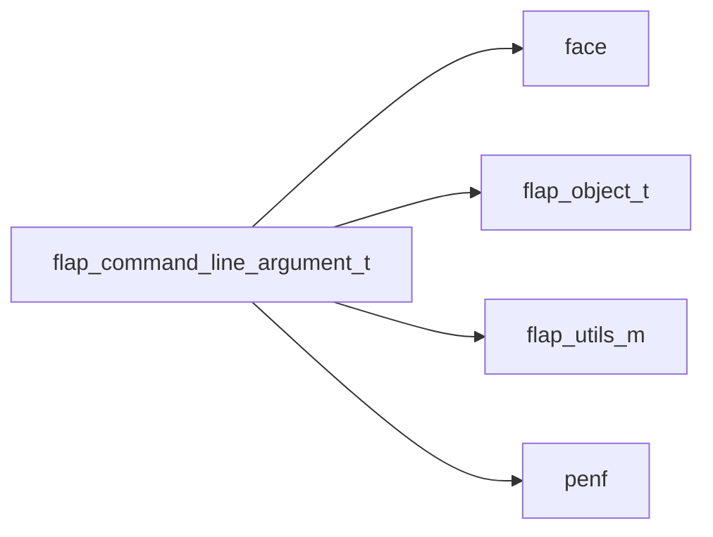
```mermaid
graph LR
  flap_command_line_argument_t["flap_command_line_argument_t"] --> face["face"]
  flap_command_line_argument_t["flap_command_line_argument_t"] --> flap_object_t["flap_object_t"]
  flap_command_line_argument_t["flap_command_line_argument_t"] --> flap_utils_m["flap_utils_m"]
  flap_command_line_argument_t["flap_command_line_argument_t"] --> penf["penf"]
```

## Contents

- [command_line_argument](#command-line-argument)
- [free](#free)
- [check](#check)
- [set_source_value](#set-source-value)
- [check_paths](#check-paths)
- [match_inline_token](#match-inline-token)
- [append_value](#append-value)
- [count_occurrences](#count-occurrences)
- [set_inline_value](#set-inline-value)
- [raise_error_m_exclude](#raise-error-m-exclude)
- [raise_error_nargs_insufficient](#raise-error-nargs-insufficient)
- [raise_error_value_missing](#raise-error-value-missing)
- [raise_error_switch_unknown](#raise-error-switch-unknown)
- [raise_error_duplicated_clas](#raise-error-duplicated-clas)
- [sanitize_defaults](#sanitize-defaults)
- [errored](#errored)
- [check_count_consistency](#check-count-consistency)
- [check_append_consistency](#check-append-consistency)
- [check_envvar_consistency](#check-envvar-consistency)
- [check_action_consistency](#check-action-consistency)
- [check_def_nargs_consistency](#check-def-nargs-consistency)
- [check_optional_consistency](#check-optional-consistency)
- [check_range_consistency](#check-range-consistency)
- [check_range](#check-range)
- [check_alternate_consistency](#check-alternate-consistency)
- [check_switch_neg_consistency](#check-switch-neg-consistency)
- [check_map_consistency](#check-map-consistency)
- [check_map](#check-map)
- [check_map_list](#check-map-list)
- [get_map](#get-map)
- [get_map_value](#get-map-value)
- [check_path_consistency](#check-path-consistency)
- [check_m_exclude_consistency](#check-m-exclude-consistency)
- [check_named_consistency](#check-named-consistency)
- [check_positional_consistency](#check-positional-consistency)
- [check_choices](#check-choices)
- [get_cla](#get-cla)
- [get_cla_from_buffer](#get-cla-from-buffer)
- [get_cla_list](#get-cla-list)
- [get_cla_list_from_buffer](#get-cla-list-from-buffer)
- [get_cla_list_character](#get-cla-list-character)
- [get_cla_list_varying_R16P](#get-cla-list-varying-r16p)
- [get_cla_list_varying_R8P](#get-cla-list-varying-r8p)
- [get_cla_list_varying_R4P](#get-cla-list-varying-r4p)
- [get_cla_list_varying_I8P](#get-cla-list-varying-i8p)
- [get_cla_list_varying_I4P](#get-cla-list-varying-i4p)
- [get_cla_list_varying_I2P](#get-cla-list-varying-i2p)
- [get_cla_list_varying_I1P](#get-cla-list-varying-i1p)
- [get_cla_list_varying_logical](#get-cla-list-varying-logical)
- [get_cla_list_varying_char](#get-cla-list-varying-char)
- [finalize](#finalize)
- [read_real](#read-real)
- [read_integer](#read-integer)
- [is_required_passed](#is-required-passed)
- [has_value](#has-value)
- [config_key](#config-key)
- [value_text](#value-text)
- [deprecation_note](#deprecation-note)
- [has_range](#has-range)
- [range_text](#range-text)
- [has_path_checks](#has-path-checks)
- [takes_config_value](#takes-config-value)
- [match_token](#match-token)
- [match_negation](#match-negation)
- [same_name](#same-name)
- [is_pair_override](#is-pair-override)
- [names](#names)
- [placeholder](#placeholder)
- [flag_value](#flag-value)
- [is_repeatable](#is-repeatable)
- [is_list](#is-list)
- [is_required_val_passed](#is-required-val-passed)
- [usage](#usage)
- [signature](#signature)
- [signature_usage](#signature-usage)
- [completion_words](#completion-words)
- [completion_fish](#completion-fish)
- [completion_powershell](#completion-powershell)
- [completion_values](#completion-values)
- [has_choices](#has-choices)
- [check_list_size](#check-list-size)
- [stored_list](#stored-list)

## Variables

| Name | Type | Attributes | Description |
|------|------|------------|-------------|
| `SOURCE_COMMANDLINE` | integer(kind=[I4P](/api/src/third_party/PENF/src/lib/penf_global_parameters_variables)) | parameter | Value passed on the command line. |
| `SOURCE_ENVIRONMENT` | integer(kind=[I4P](/api/src/third_party/PENF/src/lib/penf_global_parameters_variables)) | parameter | Value read from the environment variable. |
| `SOURCE_CONFIG` | integer(kind=[I4P](/api/src/third_party/PENF/src/lib/penf_global_parameters_variables)) | parameter | Value read from a configuration file. |
| `SOURCE_DEFAULT` | integer(kind=[I4P](/api/src/third_party/PENF/src/lib/penf_global_parameters_variables)) | parameter | Default value. |
| `SOURCE_NONE` | integer(kind=[I4P](/api/src/third_party/PENF/src/lib/penf_global_parameters_variables)) | parameter | No value. |
| `ACTION_STORE` | character(len=*) | parameter | Store value (if invoked a value must be passed). |
| `ACTION_CONFIG` | character(len=*) | parameter | Name the configuration file (stored as a store CLA). |
| `ACTION_ALTERNATE` | character(len=*) | parameter | Alternate action: bypass the value validation (F16). |
| `ACTION_STORE_STAR` | character(len=*) | parameter | Store value or revert on default if invoked alone. |
| `ACTION_STORE_TRUE` | character(len=*) | parameter | Store .true. without the necessity of a value. |
| `ACTION_STORE_FALSE` | character(len=*) | parameter | Store .false. without the necessity of a value. |
| `ACTION_PRINT_HELP` | character(len=*) | parameter | Print help message. |
| `ACTION_PRINT_MARK` | character(len=*) | parameter | Print help to Markdown file. |
| `ACTION_PRINT_VERS` | character(len=*) | parameter | Print version. |
| `ACTION_COUNT` | character(len=*) | parameter | Count the occurrences (repeatable, no value). |
| `ACTION_APPEND` | character(len=*) | parameter | Collect one value per occurrence (repeatable). |
| `ARGS_SEP` | character(len=*) | parameter | Arguments separator for multiple valued (list) CLA. |
| `ERROR_OPTIONAL_NO_DEF` | integer(kind=[I4P](/api/src/third_party/PENF/src/lib/penf_global_parameters_variables)) | parameter | Optional CLA without default value. |
| `ERROR_REQUIRED_M_EXCLUDE` | integer(kind=[I4P](/api/src/third_party/PENF/src/lib/penf_global_parameters_variables)) | parameter | Required CLA cannot exclude others. |
| `ERROR_POSITIONAL_M_EXCLUDE` | integer(kind=[I4P](/api/src/third_party/PENF/src/lib/penf_global_parameters_variables)) | parameter | Positional CLA cannot exclude others. |
| `ERROR_NAMED_NO_NAME` | integer(kind=[I4P](/api/src/third_party/PENF/src/lib/penf_global_parameters_variables)) | parameter | Named CLA without switch name. |
| `ERROR_POSITIONAL_NO_POSITION` | integer(kind=[I4P](/api/src/third_party/PENF/src/lib/penf_global_parameters_variables)) | parameter | Positional CLA without position. |
| `ERROR_POSITIONAL_NO_STORE` | integer(kind=[I4P](/api/src/third_party/PENF/src/lib/penf_global_parameters_variables)) | parameter | Positional CLA without action_store. |
| `ERROR_NOT_IN_CHOICES` | integer(kind=[I4P](/api/src/third_party/PENF/src/lib/penf_global_parameters_variables)) | parameter | CLA value out of a specified choices. |
| `ERROR_MISSING_REQUIRED` | integer(kind=[I4P](/api/src/third_party/PENF/src/lib/penf_global_parameters_variables)) | parameter | Missing required CLA. |
| `ERROR_M_EXCLUDE` | integer(kind=[I4P](/api/src/third_party/PENF/src/lib/penf_global_parameters_variables)) | parameter | Two mutually exclusive CLAs have been passed. |
| `ERROR_CASTING_LOGICAL` | integer(kind=[I4P](/api/src/third_party/PENF/src/lib/penf_global_parameters_variables)) | parameter | Error casting CLA value to logical type. |
| `ERROR_CHOICES_LOGICAL` | integer(kind=[I4P](/api/src/third_party/PENF/src/lib/penf_global_parameters_variables)) | parameter | Error adding choices check for CLA val of logical type. |
| `ERROR_NO_LIST` | integer(kind=[I4P](/api/src/third_party/PENF/src/lib/penf_global_parameters_variables)) | parameter | Actual CLA is not list-values. |
| `ERROR_NARGS_INSUFFICIENT` | integer(kind=[I4P](/api/src/third_party/PENF/src/lib/penf_global_parameters_variables)) | parameter | Multi-valued CLA with insufficient arguments. |
| `ERROR_VALUE_MISSING` | integer(kind=[I4P](/api/src/third_party/PENF/src/lib/penf_global_parameters_variables)) | parameter | Missing value of CLA. |
| `ERROR_UNKNOWN` | integer(kind=[I4P](/api/src/third_party/PENF/src/lib/penf_global_parameters_variables)) | parameter | Unknown CLA (switch name). |
| `ERROR_ENVVAR_POSITIONAL` | integer(kind=[I4P](/api/src/third_party/PENF/src/lib/penf_global_parameters_variables)) | parameter | Envvar not allowed for positional CLA. |
| `ERROR_ENVVAR_NOT_STORE` | integer(kind=[I4P](/api/src/third_party/PENF/src/lib/penf_global_parameters_variables)) | parameter | Envvar not allowed action different from store; |
| `ERROR_ENVVAR_NARGS` | integer(kind=[I4P](/api/src/third_party/PENF/src/lib/penf_global_parameters_variables)) | parameter | Envvar not allowed for list-values CLA. |
| `ERROR_STORE_STAR_POSITIONAL` | integer(kind=[I4P](/api/src/third_party/PENF/src/lib/penf_global_parameters_variables)) | parameter | Action store* not allowed for positional CLA. |
| `ERROR_STORE_STAR_NARGS` | integer(kind=[I4P](/api/src/third_party/PENF/src/lib/penf_global_parameters_variables)) | parameter | Action store* not allowed for list-values CLA. |
| `ERROR_STORE_STAR_ENVVAR` | integer(kind=[I4P](/api/src/third_party/PENF/src/lib/penf_global_parameters_variables)) | parameter | Action store* not allowed for environment variable CLA. |
| `ERROR_ACTION_UNKNOWN` | integer(kind=[I4P](/api/src/third_party/PENF/src/lib/penf_global_parameters_variables)) | parameter | Unknown CLA (switch name). |
| `ERROR_DUPLICATED_CLAS` | integer(kind=[I4P](/api/src/third_party/PENF/src/lib/penf_global_parameters_variables)) | parameter | Duplicated CLAs passed, passed multiple instance of the same CLA. |
| `ERROR_MISSING_REQUIRED_VAL` | integer(kind=[I4P](/api/src/third_party/PENF/src/lib/penf_global_parameters_variables)) | parameter | Missing required value of CLA. |
| `ERROR_INLINE_VALUE_NOT_ALLOWED` | integer(kind=[I4P](/api/src/third_party/PENF/src/lib/penf_global_parameters_variables)) | parameter | Inline value (NAME=VALUE) for a CLA that takes no value. |
| `ERROR_INLINE_VALUE_NARGS` | integer(kind=[I4P](/api/src/third_party/PENF/src/lib/penf_global_parameters_variables)) | parameter | Inline value (NAME=VALUE) for a list CLA. |
| `ERROR_COUNT_INCONSISTENT` | integer(kind=[I4P](/api/src/third_party/PENF/src/lib/penf_global_parameters_variables)) | parameter | Count CLA with positional, nargs, envvar or choices. |
| `ERROR_APPEND_INCONSISTENT` | integer(kind=[I4P](/api/src/third_party/PENF/src/lib/penf_global_parameters_variables)) | parameter | Append CLA with positional, nargs or envvar. |
| `ERROR_APPEND_SCALAR_GET` | integer(kind=[I4P](/api/src/third_party/PENF/src/lib/penf_global_parameters_variables)) | parameter | Scalar get of an append CLA (a list). |
| `ERROR_POSITIONAL_NARGS` | integer(kind=[I4P](/api/src/third_party/PENF/src/lib/penf_global_parameters_variables)) | parameter | Positional CLA with nargs (positionals are scalar). |
| `ERROR_UNSUPPORTED_TYPE` | integer(kind=[I4P](/api/src/third_party/PENF/src/lib/penf_global_parameters_variables)) | parameter | Value requested into a variable of an unsupported type. |
| `ERROR_LIST_SIZE` | integer(kind=[I4P](/api/src/third_party/PENF/src/lib/penf_global_parameters_variables)) | parameter | List requested into a fixed-size array of another size. |
| `ERROR_DEF_NARGS` | integer(kind=[I4P](/api/src/third_party/PENF/src/lib/penf_global_parameters_variables)) | parameter | List default whose count differs from an integer nargs. |
| `ERROR_ENVVAR_CSV` | integer(kind=[I4P](/api/src/third_party/PENF/src/lib/penf_global_parameters_variables)) | parameter | List value of an environment variable: unterminated quote. |
| `ERROR_PATH_NOT_FOUND` | integer(kind=[I4P](/api/src/third_party/PENF/src/lib/penf_global_parameters_variables)) | parameter | Path value that does not exist (must_exist, readable). |
| `ERROR_PATH_NOT_READABLE` | integer(kind=[I4P](/api/src/third_party/PENF/src/lib/penf_global_parameters_variables)) | parameter | Path value that cannot be opened for reading (readable). |
| `ERROR_PATH_NOT_WRITABLE` | integer(kind=[I4P](/api/src/third_party/PENF/src/lib/penf_global_parameters_variables)) | parameter | Existing path value that cannot be opened for writing. |
| `ERROR_PATH_INCONSISTENT` | integer(kind=[I4P](/api/src/third_party/PENF/src/lib/penf_global_parameters_variables)) | parameter | Path checks on an option taking no value. |
| `ERROR_DEPRECATED_REQUIRED` | integer(kind=[I4P](/api/src/third_party/PENF/src/lib/penf_global_parameters_variables)) | parameter | A required option cannot be deprecated. |
| `ERROR_ALTERNATE_INCONSISTENT` | integer(kind=[I4P](/api/src/third_party/PENF/src/lib/penf_global_parameters_variables)) | parameter | An alternate action with an attribute of a value. |
| `ERROR_SWITCH_NEG_INCONSISTENT` | integer(kind=[I4P](/api/src/third_party/PENF/src/lib/penf_global_parameters_variables)) | parameter | A negation (switch_neg) of a CLA that is not a named flag. |
| `ERROR_MAP_FORMAT` | integer(kind=[I4P](/api/src/third_party/PENF/src/lib/penf_global_parameters_variables)) | parameter | A map item that is not KEY=VALUE (empty KEY included). |
| `ERROR_MAP_DUPLICATE_KEY` | integer(kind=[I4P](/api/src/third_party/PENF/src/lib/penf_global_parameters_variables)) | parameter | A map key given twice. |
| `ERROR_MAP_UNKNOWN_KEY` | integer(kind=[I4P](/api/src/third_party/PENF/src/lib/penf_global_parameters_variables)) | parameter | A map key outside map_keys. |
| `ERROR_MAP_KEY_MISSING` | integer(kind=[I4P](/api/src/third_party/PENF/src/lib/penf_global_parameters_variables)) | parameter | A map key not given, looked up without found. |
| `ERROR_MAP_INCONSISTENT` | integer(kind=[I4P](/api/src/third_party/PENF/src/lib/penf_global_parameters_variables)) | parameter | A map on a CLA that is not a named list, or not a map. |
| `ERROR_RANGE_DEFINITION` | integer(kind=[I4P](/api/src/third_party/PENF/src/lib/penf_global_parameters_variables)) | parameter | Invalid range (bounds, clamp to an open real bound). |
| `ERROR_OUT_OF_RANGE` | integer(kind=[I4P](/api/src/third_party/PENF/src/lib/penf_global_parameters_variables)) | parameter | Value out of its range. |
| `ERROR_RANGE_TYPE` | integer(kind=[I4P](/api/src/third_party/PENF/src/lib/penf_global_parameters_variables)) | parameter | Range with a character or logical get. |

## Derived Types

### command_line_argument

Command Line Argument (CLA) class.

 @note If not otherwise declared the action on CLA value is set to "store" a value.

**Inheritance**

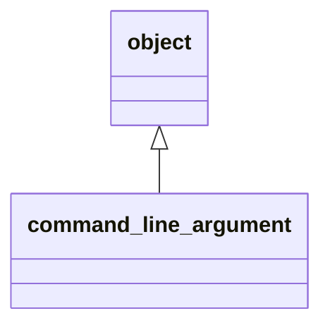
```mermaid
classDiagram
  object <|-- command_line_argument
```

**Extends**: [`object`](/api/src/lib/flap_object_t#object)

#### Components

| Name | Type | Attributes | Description |
|------|------|------------|-------------|
| `progname` | character(len=:) | allocatable | Program name. |
| `version` | character(len=:) | allocatable | Program version. |
| `help` | character(len=:) | allocatable | Help message. |
| `help_color` | character(len=:) | allocatable | ANSI color of help messages. |
| `help_style` | character(len=:) | allocatable | ANSI style of help messages. |
| `help_markdown` | character(len=:) | allocatable | Longer help message, markdown formatted. |
| `description` | character(len=:) | allocatable | Detailed description. |
| `license` | character(len=:) | allocatable | License description. |
| `authors` | character(len=:) | allocatable | Authors list. |
| `epilog` | character(len=:) | allocatable | Epilogue message. |
| `m_exclude` | character(len=:) | allocatable | Mutually exclude other CLA(s group). |
| `error_message` | character(len=:) | allocatable | Meaningful error message to standard-error. |
| `error_color` | character(len=:) | allocatable | ANSI color of error messages. |
| `error_style` | character(len=:) | allocatable | ANSI style of error messages. |
| `examples` | type([flap_string](/api/src/lib/flap_utils_m#flap-string)) | allocatable | Examples of correct usage (examples(i)%s). |
| `error` | integer(kind=[I4P](/api/src/third_party/PENF/src/lib/penf_global_parameters_variables)) |  | Error trapping flag. |
| `usage_lun` | integer(kind=[I4P](/api/src/third_party/PENF/src/lib/penf_global_parameters_variables)) |  | Output unit to print help/usage messages |
| `version_lun` | integer(kind=[I4P](/api/src/third_party/PENF/src/lib/penf_global_parameters_variables)) |  | Output unit to print version message |
| `error_lun` | integer(kind=[I4P](/api/src/third_party/PENF/src/lib/penf_global_parameters_variables)) |  | Error unit to print error messages |
| `case_insensitive` | logical |  | Match switches and command names in any case (F14). |
| `switch` | character(len=:) | allocatable | Switch name. |
| `switch_ab` | character(len=:) | allocatable | Abbreviated switch name. |
| `switch_neg` | character(len=:) | allocatable | Negation of a flag, --no-x (F11); allocated if any. |
| `act` | character(len=:) | allocatable | CLA value action. |
| `def` | character(len=:) | allocatable | Default value. |
| `nargs` | character(len=:) | allocatable | Number of arguments consumed by CLA. |
| `choices` | character(len=:) | allocatable | List (comma separated) of allowable values for the argument. |
| `val` | character(len=:) | allocatable | CLA value. |
| `envvar` | character(len=:) | allocatable | Environment variable from which take value. |
| `is_required` | logical |  | Flag for set required argument. |
| `is_positional` | logical |  | Flag for checking if CLA is a positional or a named CLA. |
| `position` | integer(kind=[I4P](/api/src/third_party/PENF/src/lib/penf_global_parameters_variables)) |  | Position of positional CLA. |
| `is_passed` | logical |  | Flag for checking if CLA has been passed to CLI. |
| `is_hidden` | logical |  | Flag for hiding CLA, thus it does not compare into help. |
| `is_val_required` | logical |  | Flag for set required value for not required (optional) CLA. |
| `source` | integer(kind=[I4P](/api/src/third_party/PENF/src/lib/penf_global_parameters_variables)) |  | Source of the value (SOURCE_*). |
| `is_config` | logical |  | The CLA names the configuration file (act='config'). |
| `must_exist` | logical |  | The value is a path that must exist. |
| `readable` | logical |  | The value is a path that must be readable (and exist). |
| `writable` | logical |  | The value is a path writable if it exists. |
| `allow_dash` | logical |  | '-' passes the path checks (standard input/output). |
| `deprecated` | character(len=:) | allocatable | Deprecation message; allocated means deprecated (F13). |
| `range_min` | character(len=:) | allocatable | Minimum of the value (F05), as given. |
| `range_max` | character(len=:) | allocatable | Maximum of the value (F05), as given. |
| `min_open` | logical |  | The minimum is excluded. |
| `max_open` | logical |  | The maximum is excluded. |
| `clamp` | logical |  | An out-of-range value becomes the bound. |
| `case_sensitive` | logical |  | Character choices match only in their case (F14). |
| `is_map` | logical |  | The values are KEY=VALUE pairs (F18). |
| `is_auto_envvar` | logical |  | The envvar is generated by auto_envvar_prefix (F07). |
| `metavar` | character(len=:) | allocatable | Placeholder of the value in the help (F12). |
| `map_keys` | character(len=:) | allocatable | Allowed keys of a map, comma separated (F18). |
| `is_negated` | logical |  | The last spelling of a flag pair passed is the negation. |
| `pair_passed` | logical |  | Both spellings of a flag pair passed (D5: once each). |

#### Type-Bound Procedures

| Name | Attributes | Description |
|------|------------|-------------|
| `error_prefix` | pass(self) | Prefix of error messages. |
| `free_object` | pass(self) | Free dynamic memory. |
| `print_version` | pass(self) | Print version. |
| `print_error_message` | pass(self) | Print meaningful error message. |
| `set_examples` | pass(self) | Set examples of correct usage. |
| `assign_object` | pass(lhs ) | Assignment overloading. |
| `free` |  | Free dynamic memory. |
| `check` |  | Check data consistency. |
| `is_required_passed` |  | Check if required CLA is passed. |
| `has_value` |  | Check if the value is given by the user (explicit source). |
| `set_source_value` |  | Set a value read from the environment or a configuration file. |
| `config_key` |  | Key of the CLA in a configuration file. |
| `takes_config_value` |  | Check if the CLA takes a value from a configuration file. |
| `value_text` |  | Resolved value as text (provenance report). |
| `has_path_checks` |  | Check if the value is a path to check. |
| `deprecation_note` |  | Marker of a deprecated CLA in the help. |
| `has_range` |  | Check if the value has a range. |
| `range_text` |  | Range as text, e.g. (0, 1]. |
| `check_paths` |  | Check the path value(s): existence and permissions. |
| `match_token` |  | Check if a command line token names this CLA. |
| `match_negation` |  | Check if a command line token is the negation of this flag. |
| `same_name` |  | Compare a switch name with a token (case rule of F14). |
| `is_pair_override` |  | Check if a flag passed may be passed again by its other spelling. |
| `flag_value` |  | Value of a flag passed on the command line. |
| `names` |  | Visible switch names, for suggestions. |
| `placeholder` |  | Placeholder of the value in the help (metavar). |
| `check_map` |  | Check the KEY=VALUE pairs of a map. |
| `get_map` |  | Get the keys and values of a map. |
| `get_map_value` |  | Get the value of a key of a map. |
| `match_inline_token` |  | Check a token also as NAME=VALUE. |
| `set_inline_value` |  | Set the value given inline (NAME=VALUE). |
| `is_repeatable` |  | Check if the CLA may be passed more than once. |
| `count_occurrences` |  | Count occurrences of a count CLA. |
| `append_value` |  | Collect a value of an append CLA. |
| `is_list` |  | Check if the CLA holds a list (nargs or append). |
| `raise_error_m_exclude` |  | Raise error mutually exclusive CLAs passed. |
| `raise_error_nargs_insufficient` |  | Raise error insufficient number of argument values passed. |
| `raise_error_value_missing` |  | Raise error missing value. |
| `raise_error_switch_unknown` |  | Raise error switch_unknown. |
| `raise_error_duplicated_clas` |  | Raise error duplicated CLAs passed. |
| `get` |  | Get CLA value(s). |
| `get_varying` |  | Get CLA value(s) from varying size list. |
| `has_choices` |  | Return true if CLA has defined choices. |
| `sanitize_defaults` |  | Sanitize default values. |
| `signature` |  | Get signature. |
| `signature_usage` |  | Get the signature for the usage text. |
| `completion_words` |  | Get the bash completion words (switches). |
| `completion_values` |  | Get the bash completion of the value. |
| `completion_fish` |  | Get the fish completion lines. |
| `completion_powershell` |  | Get the PowerShell completion entries. |
| `usage` |  | Get correct usage. |
| `errored` |  | Trig error occurence and print meaningful message. |
| `check_count_consistency` |  | Check data consistency for count CLA. |
| `check_append_consistency` |  | Check data consistency for append CLA. |
| `check_envvar_consistency` |  | Check data consistency for envvar CLA. |
| `check_action_consistency` |  | Check CLA action consistency. |
| `check_optional_consistency` |  | Check optional CLA consistency. |
| `check_def_nargs_consistency` |  | Check the count of a list default against nargs. |
| `check_m_exclude_consistency` |  | Check mutually exclusion consistency. |
| `check_path_consistency` |  | Check that the path checks are on an option taking a value. |
| `check_alternate_consistency` |  | Check that an alternate action has no attribute of a value. |
| `check_switch_neg_consistency` |  | Check that a negation belongs to a named scalar flag. |
| `check_map_consistency` |  | Check that a map is a named list, its default included. |
| `check_map_list` |  | Check the KEY=VALUE pairs of a stored list. |
| `check_range_consistency` |  | Check the range definition. |
| `check_range` |  | Check (or clamp) a value against the range. |
| `check_named_consistency` |  | Check named CLA consistency. |
| `check_positional_consistency` |  | Check positional CLA consistency. |
| `check_choices` |  | Check if CLA value is in allowed choices. |
| `check_list_size` |  | Check CLA multiple values list size consistency. |
| `stored_list` |  | Stored list of values (parsed or default). |
| `get_cla` |  | Get CLA (single) value. |
| `get_cla_from_buffer` |  | Get CLA (single) value from a buffer. |
| `get_cla_list` |  | Get CLA multiple values. |
| `get_cla_list_from_buffer` |  | Get CLA (single) value from a buffer. |
| `get_cla_list_varying_R16P` |  | Get CLA multiple values, varying size, R16P. |
| `get_cla_list_varying_R8P` |  | Get CLA multiple values, varying size, R8P. |
| `get_cla_list_varying_R4P` |  | Get CLA multiple values, varying size, R4P. |
| `get_cla_list_varying_I8P` |  | Get CLA multiple values, varying size, I8P. |
| `get_cla_list_varying_I4P` |  | Get CLA multiple values, varying size, I4P. |
| `get_cla_list_varying_I2P` |  | Get CLA multiple values, varying size, I2P. |
| `get_cla_list_varying_I1P` |  | Get CLA multiple values, varying size, I1P. |
| `get_cla_list_varying_logical` |  | Get CLA multiple values, varying size, bool. |
| `get_cla_list_varying_char` |  | Get CLA multiple values, varying size, char. |

## Subroutines

### free

Free dynamic memory.

**Attributes**: elemental

```fortran
subroutine free(self)
```

**Arguments**

| Name | Type | Intent | Attributes | Description |
|------|------|--------|------------|-------------|
| `self` | class([command_line_argument](/api/src/lib/flap_command_line_argument_t#command-line-argument)) | inout |  | CLA data. |

**Call graph**

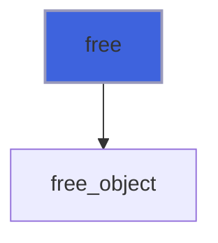
```mermaid
flowchart TD
  free["free"] --> free_object["free_object"]
  style free fill:#3e63dd,stroke:#99b,stroke-width:2px
```

### check

Check data consistency.

```fortran
subroutine check(self, pref)
```

**Arguments**

| Name | Type | Intent | Attributes | Description |
|------|------|--------|------------|-------------|
| `self` | class([command_line_argument](/api/src/lib/flap_command_line_argument_t#command-line-argument)) | inout |  | CLA data. |
| `pref` | character(len=*) | in | optional | Prefixing string. |

**Call graph**


```mermaid
flowchart TD
  add["add"] --> check["check"]
  add["add"] --> check["check"]
  check["check"] --> check["check"]
  parse_core["parse_core"] --> check["check"]
  check["check"] --> check_action_consistency["check_action_consistency"]
  check["check"] --> check_alternate_consistency["check_alternate_consistency"]
  check["check"] --> check_append_consistency["check_append_consistency"]
  check["check"] --> check_count_consistency["check_count_consistency"]
  check["check"] --> check_def_nargs_consistency["check_def_nargs_consistency"]
  check["check"] --> check_envvar_consistency["check_envvar_consistency"]
  check["check"] --> check_m_exclude_consistency["check_m_exclude_consistency"]
  check["check"] --> check_map_consistency["check_map_consistency"]
  check["check"] --> check_named_consistency["check_named_consistency"]
  check["check"] --> check_optional_consistency["check_optional_consistency"]
  check["check"] --> check_path_consistency["check_path_consistency"]
  check["check"] --> check_positional_consistency["check_positional_consistency"]
  check["check"] --> check_range_consistency["check_range_consistency"]
  check["check"] --> check_switch_neg_consistency["check_switch_neg_consistency"]
  check["check"] --> errored["errored"]
  style check fill:#3e63dd,stroke:#99b,stroke-width:2px
```

### set_source_value

Set a value read from the environment variable (F07 of #125) or from a configuration file (F08), with its source.

 A flag (store_true/store_false) takes it as its value: 1/0, true/false, t/f, yes/no, y/n, on/off, in any case (click's
 set); anything else is kept, so that get reports ERROR_CASTING_LOGICAL. A list (nargs) reads an environment variable
 as one CSV record (F22: an unterminated quote is ERROR_ENVVAR_CSV), a configuration value as blank separated values
 (as def).

```fortran
subroutine set_source_value(self, value, source)
```

**Arguments**

| Name | Type | Intent | Attributes | Description |
|------|------|--------|------------|-------------|
| `self` | class([command_line_argument](/api/src/lib/flap_command_line_argument_t#command-line-argument)) | inout |  | CLA data. |
| `value` | character(len=*) | in |  | Value. |
| `source` | integer(kind=[I4P](/api/src/third_party/PENF/src/lib/penf_global_parameters_variables)) | in |  | SOURCE_ENVIRONMENT or SOURCE_CONFIG. |

**Call graph**

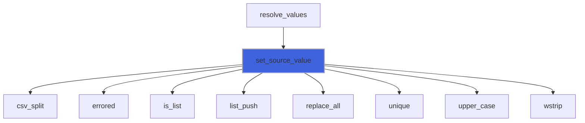
```mermaid
flowchart TD
  resolve_values["resolve_values"] --> set_source_value["set_source_value"]
  set_source_value["set_source_value"] --> csv_split["csv_split"]
  set_source_value["set_source_value"] --> errored["errored"]
  set_source_value["set_source_value"] --> is_list["is_list"]
  set_source_value["set_source_value"] --> list_push["list_push"]
  set_source_value["set_source_value"] --> replace_all["replace_all"]
  set_source_value["set_source_value"] --> unique["unique"]
  set_source_value["set_source_value"] --> upper_case["upper_case"]
  set_source_value["set_source_value"] --> wstrip["wstrip"]
  style set_source_value fill:#3e63dd,stroke:#99b,stroke-width:2px
```

### check_paths

Check the path value(s), whatever their source (F09 of #125): every item of a list; an empty value, and '-' with
 allow_dash, are not checked. Standard Fortran only: inquire for existence, an open for reading (readable) or for
 appending, writing nothing (writable, only if the file exists); the message carries the reason of the processor.
 Directories are not told apart: a directory exists and opens for reading.

```fortran
subroutine check_paths(self, pref)
```

**Arguments**

| Name | Type | Intent | Attributes | Description |
|------|------|--------|------------|-------------|
| `self` | class([command_line_argument](/api/src/lib/flap_command_line_argument_t#command-line-argument)) | inout |  | CLA data. |
| `pref` | character(len=*) | in | optional | Prefixing string. |

**Call graph**

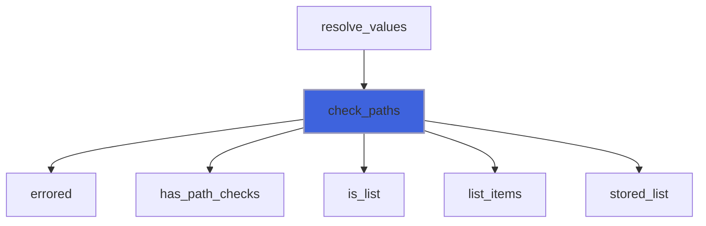
```mermaid
flowchart TD
  resolve_values["resolve_values"] --> check_paths["check_paths"]
  check_paths["check_paths"] --> errored["errored"]
  check_paths["check_paths"] --> has_path_checks["has_path_checks"]
  check_paths["check_paths"] --> is_list["is_list"]
  check_paths["check_paths"] --> list_items["list_items"]
  check_paths["check_paths"] --> stored_list["stored_list"]
  style check_paths fill:#3e63dd,stroke:#99b,stroke-width:2px
```

### match_inline_token

Check if a command line token names this CLA by rule 1 (match_token) or rule 2 of decision D1: NAME=VALUE, split at
 the first '=', with NAME matching by rule 1 (inline values, F01).

**Attributes**: pure

```fortran
subroutine match_inline_token(self, token, match, inline_val, has_inline)
```

**Arguments**

| Name | Type | Intent | Attributes | Description |
|------|------|--------|------------|-------------|
| `self` | class([command_line_argument](/api/src/lib/flap_command_line_argument_t#command-line-argument)) | in |  | CLA data. |
| `token` | character(len=*) | in |  | Command line token. |
| `match` | logical | out |  | Check result. |
| `inline_val` | character(len=:) | out | allocatable | VALUE of NAME=VALUE ('' otherwise). |
| `has_inline` | logical | out |  | The token is NAME=VALUE. |

**Call graph**

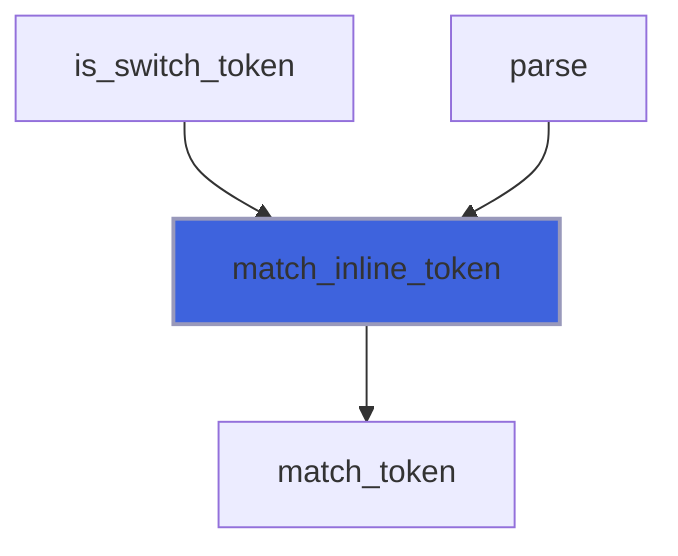
```mermaid
flowchart TD
  is_switch_token["is_switch_token"] --> match_inline_token["match_inline_token"]
  parse["parse"] --> match_inline_token["match_inline_token"]
  match_inline_token["match_inline_token"] --> match_token["match_token"]
  style match_inline_token fill:#3e63dd,stroke:#99b,stroke-width:2px
```

### append_value

Collect one value of an append CLA; the first occurrence replaces the default (D9 of #125). An empty value is an
 empty item (D17, reversed in step 2.11).

```fortran
subroutine append_value(self, value, first, pref)
```

**Arguments**

| Name | Type | Intent | Attributes | Description |
|------|------|--------|------------|-------------|
| `self` | class([command_line_argument](/api/src/lib/flap_command_line_argument_t#command-line-argument)) | inout |  | CLA data. |
| `value` | character(len=*) | in |  | Value. |
| `first` | logical | in |  | First occurrence on the command line. |
| `pref` | character(len=*) | in | optional | Prefixing string. |

**Call graph**

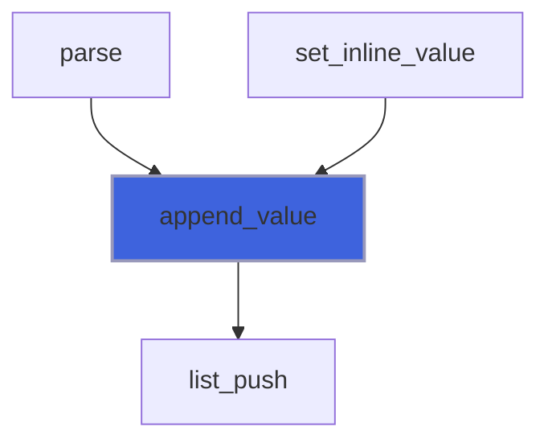
```mermaid
flowchart TD
  parse["parse"] --> append_value["append_value"]
  set_inline_value["set_inline_value"] --> append_value["append_value"]
  append_value["append_value"] --> list_push["list_push"]
  style append_value fill:#3e63dd,stroke:#99b,stroke-width:2px
```

### count_occurrences

Add n occurrences to a count CLA; the first occurrence starts from 0 (the default applies only when not passed).

```fortran
subroutine count_occurrences(self, n, first)
```

**Arguments**

| Name | Type | Intent | Attributes | Description |
|------|------|--------|------------|-------------|
| `self` | class([command_line_argument](/api/src/lib/flap_command_line_argument_t#command-line-argument)) | inout |  | CLA data. |
| `n` | integer(kind=[I4P](/api/src/third_party/PENF/src/lib/penf_global_parameters_variables)) | in |  | Occurrences to add. |
| `first` | logical | in |  | First occurrence on the command line. |

**Call graph**

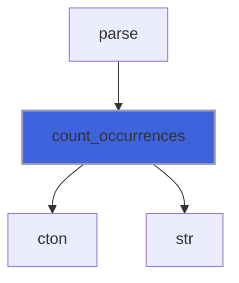
```mermaid
flowchart TD
  parse["parse"] --> count_occurrences["count_occurrences"]
  count_occurrences["count_occurrences"] --> cton["cton"]
  count_occurrences["count_occurrences"] --> str["str"]
  style count_occurrences fill:#3e63dd,stroke:#99b,stroke-width:2px
```

### set_inline_value

Set the value given inline (NAME=VALUE, F01): only a scalar store takes one; the next argument is not consumed.

 An empty value (NAME=) is the empty string, as a separate empty value (D17 of #125, reversed in step 2.11).

```fortran
subroutine set_inline_value(self, value, pref, first)
```

**Arguments**

| Name | Type | Intent | Attributes | Description |
|------|------|--------|------------|-------------|
| `self` | class([command_line_argument](/api/src/lib/flap_command_line_argument_t#command-line-argument)) | inout |  | CLA data. |
| `value` | character(len=*) | in |  | Inline value. |
| `pref` | character(len=*) | in | optional | Prefixing string. |
| `first` | logical | in | optional | First occurrence on the command line (append, default .true.). |

**Call graph**

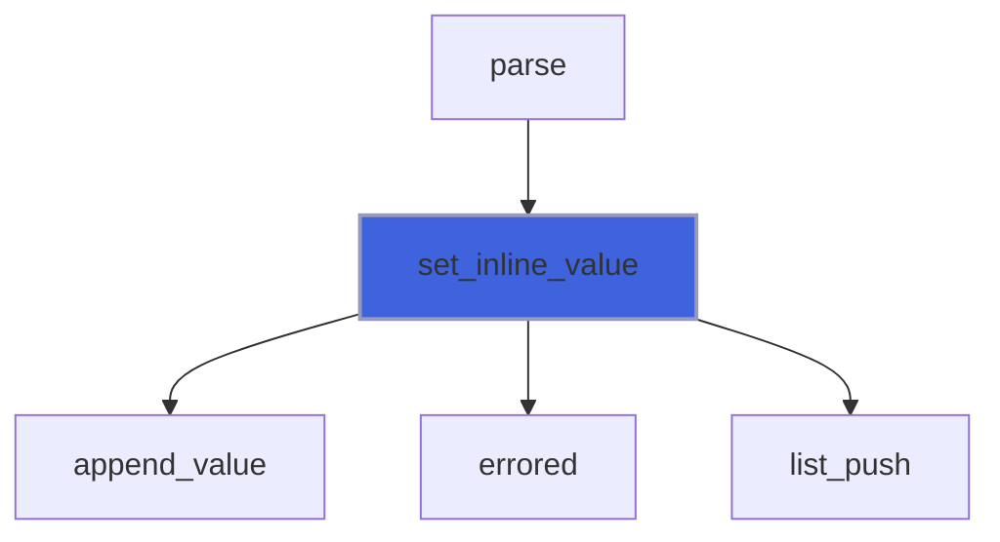
```mermaid
flowchart TD
  parse["parse"] --> set_inline_value["set_inline_value"]
  set_inline_value["set_inline_value"] --> append_value["append_value"]
  set_inline_value["set_inline_value"] --> errored["errored"]
  set_inline_value["set_inline_value"] --> list_push["list_push"]
  style set_inline_value fill:#3e63dd,stroke:#99b,stroke-width:2px
```

### raise_error_m_exclude

Raise error mutually exclusive CLAs passed.

```fortran
subroutine raise_error_m_exclude(self, pref)
```

**Arguments**

| Name | Type | Intent | Attributes | Description |
|------|------|--------|------------|-------------|
| `self` | class([command_line_argument](/api/src/lib/flap_command_line_argument_t#command-line-argument)) | inout |  | CLA data. |
| `pref` | character(len=*) | in | optional | Prefixing string. |

**Call graph**

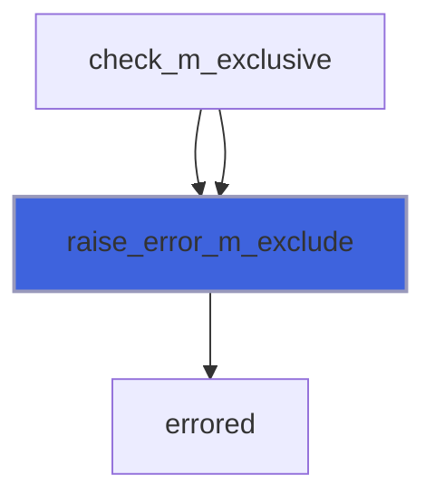
```mermaid
flowchart TD
  check_m_exclusive["check_m_exclusive"] --> raise_error_m_exclude["raise_error_m_exclude"]
  check_m_exclusive["check_m_exclusive"] --> raise_error_m_exclude["raise_error_m_exclude"]
  raise_error_m_exclude["raise_error_m_exclude"] --> errored["errored"]
  style raise_error_m_exclude fill:#3e63dd,stroke:#99b,stroke-width:2px
```

### raise_error_nargs_insufficient

Raise error insufficient number of argument values passed.

```fortran
subroutine raise_error_nargs_insufficient(self, pref)
```

**Arguments**

| Name | Type | Intent | Attributes | Description |
|------|------|--------|------------|-------------|
| `self` | class([command_line_argument](/api/src/lib/flap_command_line_argument_t#command-line-argument)) | inout |  | CLA data. |
| `pref` | character(len=*) | in | optional | Prefixing string. |

**Call graph**


```mermaid
flowchart TD
  parse["parse"] --> raise_error_nargs_insufficient["raise_error_nargs_insufficient"]
  raise_error_nargs_insufficient["raise_error_nargs_insufficient"] --> errored["errored"]
  style raise_error_nargs_insufficient fill:#3e63dd,stroke:#99b,stroke-width:2px
```

### raise_error_value_missing

Raise error missing value.

```fortran
subroutine raise_error_value_missing(self, pref)
```

**Arguments**

| Name | Type | Intent | Attributes | Description |
|------|------|--------|------------|-------------|
| `self` | class([command_line_argument](/api/src/lib/flap_command_line_argument_t#command-line-argument)) | inout |  | CLA data. |
| `pref` | character(len=*) | in | optional | Prefixing string. |

**Call graph**


```mermaid
flowchart TD
  parse["parse"] --> raise_error_value_missing["raise_error_value_missing"]
  raise_error_value_missing["raise_error_value_missing"] --> errored["errored"]
  style raise_error_value_missing fill:#3e63dd,stroke:#99b,stroke-width:2px
```

### raise_error_switch_unknown

Raise error switch_unknown.

```fortran
subroutine raise_error_switch_unknown(self, switch, pref, hint)
```

**Arguments**

| Name | Type | Intent | Attributes | Description |
|------|------|--------|------------|-------------|
| `self` | class([command_line_argument](/api/src/lib/flap_command_line_argument_t#command-line-argument)) | inout |  | CLA data. |
| `switch` | character(len=*) | in | optional | CLA switch name. |
| `pref` | character(len=*) | in | optional | Prefixing string. |
| `hint` | character(len=*) | in | optional | "Did you mean" hint, appended to the message (F10). |

**Call graph**

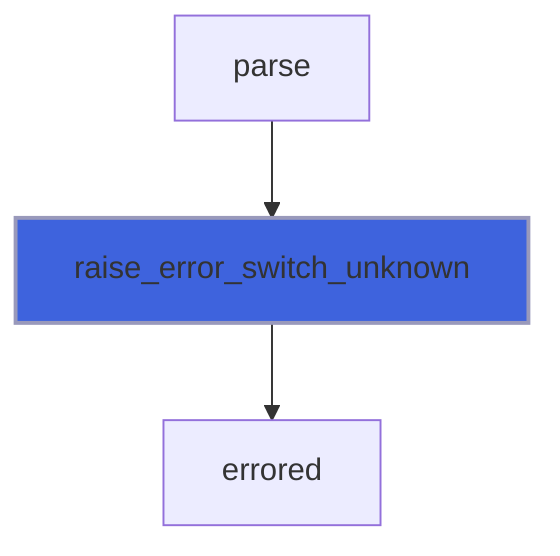
```mermaid
flowchart TD
  parse["parse"] --> raise_error_switch_unknown["raise_error_switch_unknown"]
  raise_error_switch_unknown["raise_error_switch_unknown"] --> errored["errored"]
  style raise_error_switch_unknown fill:#3e63dd,stroke:#99b,stroke-width:2px
```

### raise_error_duplicated_clas

Raise error duplicated CLAs passed.

```fortran
subroutine raise_error_duplicated_clas(self, switch, pref)
```

**Arguments**

| Name | Type | Intent | Attributes | Description |
|------|------|--------|------------|-------------|
| `self` | class([command_line_argument](/api/src/lib/flap_command_line_argument_t#command-line-argument)) | inout |  | CLA data. |
| `switch` | character(len=*) | in | optional | CLA switch name. |
| `pref` | character(len=*) | in | optional | Prefixing string. |

**Call graph**

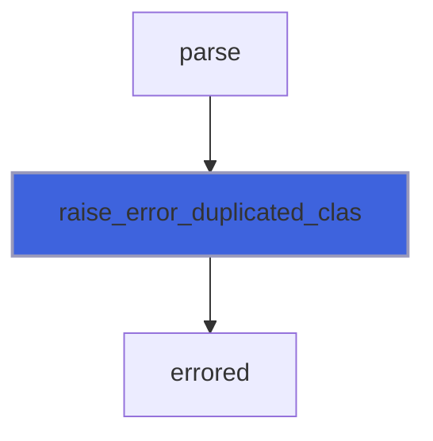
```mermaid
flowchart TD
  parse["parse"] --> raise_error_duplicated_clas["raise_error_duplicated_clas"]
  raise_error_duplicated_clas["raise_error_duplicated_clas"] --> errored["errored"]
  style raise_error_duplicated_clas fill:#3e63dd,stroke:#99b,stroke-width:2px
```

### sanitize_defaults

Sanitize defaults values.

 It is necessary to *sanitize* the default values of non-passed, optional CLA.

```fortran
subroutine sanitize_defaults(self)
```

**Arguments**

| Name | Type | Intent | Attributes | Description |
|------|------|--------|------------|-------------|
| `self` | class([command_line_argument](/api/src/lib/flap_command_line_argument_t#command-line-argument)) | inout |  | CLAsG data. |

**Call graph**

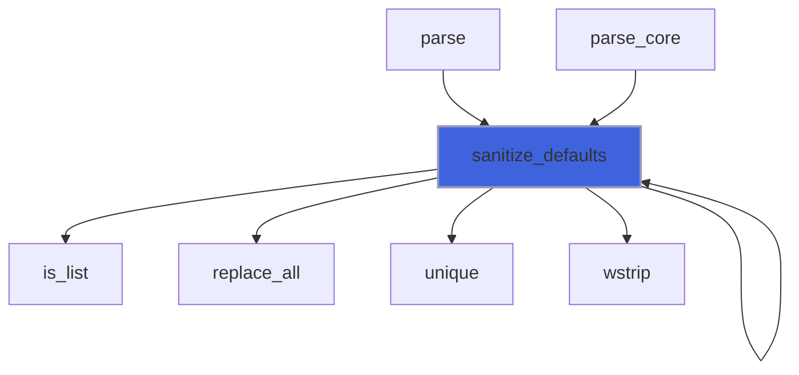
```mermaid
flowchart TD
  parse["parse"] --> sanitize_defaults["sanitize_defaults"]
  parse_core["parse_core"] --> sanitize_defaults["sanitize_defaults"]
  sanitize_defaults["sanitize_defaults"] --> sanitize_defaults["sanitize_defaults"]
  sanitize_defaults["sanitize_defaults"] --> is_list["is_list"]
  sanitize_defaults["sanitize_defaults"] --> replace_all["replace_all"]
  sanitize_defaults["sanitize_defaults"] --> unique["unique"]
  sanitize_defaults["sanitize_defaults"] --> wstrip["wstrip"]
  style sanitize_defaults fill:#3e63dd,stroke:#99b,stroke-width:2px
```

### errored

Trig error occurence and print meaningful message.

```fortran
subroutine errored(self, error, pref, switch, val_str, log_value, hint)
```

**Arguments**

| Name | Type | Intent | Attributes | Description |
|------|------|--------|------------|-------------|
| `self` | class([command_line_argument](/api/src/lib/flap_command_line_argument_t#command-line-argument)) | inout |  | CLA data. |
| `error` | integer(kind=[I4P](/api/src/third_party/PENF/src/lib/penf_global_parameters_variables)) | in |  | Error occurred. |
| `pref` | character(len=*) | in | optional | Prefixing string. |
| `switch` | character(len=*) | in | optional | CLA switch name. |
| `val_str` | character(len=*) | in | optional | Value string. |
| `log_value` | character(len=*) | in | optional | Logical value to be casted. |
| `hint` | character(len=*) | in | optional | Hint appended to the message (unknown switch, F10). |

**Call graph**


```mermaid
flowchart TD
  add_exclusive_set["add_exclusive_set"] --> errored["errored"]
  check["check"] --> errored["errored"]
  check["check"] --> errored["errored"]
  check_action_consistency["check_action_consistency"] --> errored["errored"]
  check_alternate_consistency["check_alternate_consistency"] --> errored["errored"]
  check_append_consistency["check_append_consistency"] --> errored["errored"]
  check_choices["check_choices"] --> errored["errored"]
  check_count_consistency["check_count_consistency"] --> errored["errored"]
  check_def_nargs_consistency["check_def_nargs_consistency"] --> errored["errored"]
  check_envvar_consistency["check_envvar_consistency"] --> errored["errored"]
  check_exclusive_sets["check_exclusive_sets"] --> errored["errored"]
  check_list_size["check_list_size"] --> errored["errored"]
  check_m_exclude_consistency["check_m_exclude_consistency"] --> errored["errored"]
  check_map_consistency["check_map_consistency"] --> errored["errored"]
  check_map_list["check_map_list"] --> errored["errored"]
  check_named_consistency["check_named_consistency"] --> errored["errored"]
  check_optional_consistency["check_optional_consistency"] --> errored["errored"]
  check_path_consistency["check_path_consistency"] --> errored["errored"]
  check_paths["check_paths"] --> errored["errored"]
  check_position_gaps["check_position_gaps"] --> errored["errored"]
  check_positional_consistency["check_positional_consistency"] --> errored["errored"]
  check_range["check_range"] --> errored["errored"]
  check_range_consistency["check_range_consistency"] --> errored["errored"]
  check_switch_neg_consistency["check_switch_neg_consistency"] --> errored["errored"]
  copy_options["copy_options"] --> errored["errored"]
  get_args_from_invocation["get_args_from_invocation"] --> errored["errored"]
  get_cla["get_cla"] --> errored["errored"]
  get_cla["get_cla"] --> errored["errored"]
  get_cla_from_buffer["get_cla_from_buffer"] --> errored["errored"]
  get_cla_list["get_cla_list"] --> errored["errored"]
  get_cla_list["get_cla_list"] --> errored["errored"]
  get_cla_list_from_buffer["get_cla_list_from_buffer"] --> errored["errored"]
  get_cla_list_varying_I1P["get_cla_list_varying_I1P"] --> errored["errored"]
  get_cla_list_varying_I1P["get_cla_list_varying_I1P"] --> errored["errored"]
  get_cla_list_varying_I2P["get_cla_list_varying_I2P"] --> errored["errored"]
  get_cla_list_varying_I2P["get_cla_list_varying_I2P"] --> errored["errored"]
  get_cla_list_varying_I4P["get_cla_list_varying_I4P"] --> errored["errored"]
  get_cla_list_varying_I4P["get_cla_list_varying_I4P"] --> errored["errored"]
  get_cla_list_varying_I8P["get_cla_list_varying_I8P"] --> errored["errored"]
  get_cla_list_varying_I8P["get_cla_list_varying_I8P"] --> errored["errored"]
  get_cla_list_varying_R16P["get_cla_list_varying_R16P"] --> errored["errored"]
  get_cla_list_varying_R16P["get_cla_list_varying_R16P"] --> errored["errored"]
  get_cla_list_varying_R4P["get_cla_list_varying_R4P"] --> errored["errored"]
  get_cla_list_varying_R4P["get_cla_list_varying_R4P"] --> errored["errored"]
  get_cla_list_varying_R8P["get_cla_list_varying_R8P"] --> errored["errored"]
  get_cla_list_varying_R8P["get_cla_list_varying_R8P"] --> errored["errored"]
  get_cla_list_varying_char["get_cla_list_varying_char"] --> errored["errored"]
  get_cla_list_varying_char["get_cla_list_varying_char"] --> errored["errored"]
  get_cla_list_varying_logical["get_cla_list_varying_logical"] --> errored["errored"]
  get_cla_list_varying_logical["get_cla_list_varying_logical"] --> errored["errored"]
  get_map["get_map"] --> errored["errored"]
  get_map_value["get_map_value"] --> errored["errored"]
  get_source["get_source"] --> errored["errored"]
  is_required_passed["is_required_passed"] --> errored["errored"]
  is_required_val_passed["is_required_val_passed"] --> errored["errored"]
  map_cla["map_cla"] --> errored["errored"]
  raise_error_duplicated_clas["raise_error_duplicated_clas"] --> errored["errored"]
  raise_error_m_exclude["raise_error_m_exclude"] --> errored["errored"]
  raise_error_m_exclude["raise_error_m_exclude"] --> errored["errored"]
  raise_error_nargs_insufficient["raise_error_nargs_insufficient"] --> errored["errored"]
  raise_error_switch_unknown["raise_error_switch_unknown"] --> errored["errored"]
  raise_error_value_missing["raise_error_value_missing"] --> errored["errored"]
  set_inline_value["set_inline_value"] --> errored["errored"]
  set_source_value["set_source_value"] --> errored["errored"]
  errored["errored"] --> error_prefix["error_prefix"]
  errored["errored"] --> print_error_message["print_error_message"]
  errored["errored"] --> range_text["range_text"]
  errored["errored"] --> str["str"]
  style errored fill:#3e63dd,stroke:#99b,stroke-width:2px
```

### check_count_consistency

Check count CLA consistency: a named flag without nargs, envvar or choices (F02 of #125).

```fortran
subroutine check_count_consistency(self, pref)
```

**Arguments**

| Name | Type | Intent | Attributes | Description |
|------|------|--------|------------|-------------|
| `self` | class([command_line_argument](/api/src/lib/flap_command_line_argument_t#command-line-argument)) | inout |  | CLA data. |
| `pref` | character(len=*) | in | optional | Prefixing string. |

**Call graph**


```mermaid
flowchart TD
  check["check"] --> check_count_consistency["check_count_consistency"]
  check_count_consistency["check_count_consistency"] --> errored["errored"]
  style check_count_consistency fill:#3e63dd,stroke:#99b,stroke-width:2px
```

### check_append_consistency

Check append CLA consistency: a named option collecting one value per occurrence, without nargs or envvar (F02).

```fortran
subroutine check_append_consistency(self, pref)
```

**Arguments**

| Name | Type | Intent | Attributes | Description |
|------|------|--------|------------|-------------|
| `self` | class([command_line_argument](/api/src/lib/flap_command_line_argument_t#command-line-argument)) | inout |  | CLA data. |
| `pref` | character(len=*) | in | optional | Prefixing string. |

**Call graph**


```mermaid
flowchart TD
  check["check"] --> check_append_consistency["check_append_consistency"]
  check_append_consistency["check_append_consistency"] --> errored["errored"]
  style check_append_consistency fill:#3e63dd,stroke:#99b,stroke-width:2px
```

### check_envvar_consistency

Check data consistency for envvar CLA.

```fortran
subroutine check_envvar_consistency(self, pref)
```

**Arguments**

| Name | Type | Intent | Attributes | Description |
|------|------|--------|------------|-------------|
| `self` | class([command_line_argument](/api/src/lib/flap_command_line_argument_t#command-line-argument)) | inout |  | CLA data. |
| `pref` | character(len=*) | in | optional | Prefixing string. |

**Call graph**

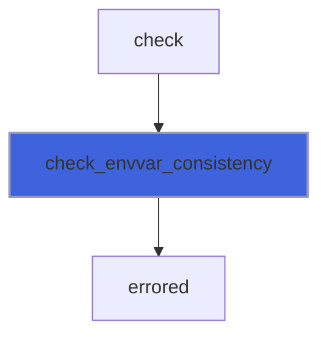
```mermaid
flowchart TD
  check["check"] --> check_envvar_consistency["check_envvar_consistency"]
  check_envvar_consistency["check_envvar_consistency"] --> errored["errored"]
  style check_envvar_consistency fill:#3e63dd,stroke:#99b,stroke-width:2px
```

### check_action_consistency

Check CLA action consistency.

```fortran
subroutine check_action_consistency(self, pref)
```

**Arguments**

| Name | Type | Intent | Attributes | Description |
|------|------|--------|------------|-------------|
| `self` | class([command_line_argument](/api/src/lib/flap_command_line_argument_t#command-line-argument)) | inout |  | CLA data. |
| `pref` | character(len=*) | in | optional | Prefixing string. |

**Call graph**

```mermaid
flowchart TD
  check["check"] --> check_action_consistency["check_action_consistency"]
  check_action_consistency["check_action_consistency"] --> errored["errored"]
  style check_action_consistency fill:#3e63dd,stroke:#99b,stroke-width:2px
```

### check_def_nargs_consistency

Check that a list default has as many values as an integer nargs (B28 of #125); '+' and '*' take any count.

```fortran
subroutine check_def_nargs_consistency(self, pref)
```

**Arguments**

| Name | Type | Intent | Attributes | Description |
|------|------|--------|------------|-------------|
| `self` | class([command_line_argument](/api/src/lib/flap_command_line_argument_t#command-line-argument)) | inout |  | CLA data. |
| `pref` | character(len=*) | in | optional | Prefixing string. |

**Call graph**

```mermaid
flowchart TD
  check["check"] --> check_def_nargs_consistency["check_def_nargs_consistency"]
  check_def_nargs_consistency["check_def_nargs_consistency"] --> errored["errored"]
  check_def_nargs_consistency["check_def_nargs_consistency"] --> list_count["list_count"]
  check_def_nargs_consistency["check_def_nargs_consistency"] --> str["str"]
  style check_def_nargs_consistency fill:#3e63dd,stroke:#99b,stroke-width:2px
```

### check_optional_consistency

Check optional CLA consistency.

```fortran
subroutine check_optional_consistency(self, pref)
```

**Arguments**

| Name | Type | Intent | Attributes | Description |
|------|------|--------|------------|-------------|
| `self` | class([command_line_argument](/api/src/lib/flap_command_line_argument_t#command-line-argument)) | inout |  | CLA data. |
| `pref` | character(len=*) | in | optional | Prefixing string. |

**Call graph**

```mermaid
flowchart TD
  check["check"] --> check_optional_consistency["check_optional_consistency"]
  check_optional_consistency["check_optional_consistency"] --> errored["errored"]
  style check_optional_consistency fill:#3e63dd,stroke:#99b,stroke-width:2px
```

### check_range_consistency

Check the range (F05 of #125): an option taking a value (store, store*, append, count), numeric bounds, min <= max
 (min < max when a bound is open).

```fortran
subroutine check_range_consistency(self, pref)
```

**Arguments**

| Name | Type | Intent | Attributes | Description |
|------|------|--------|------------|-------------|
| `self` | class([command_line_argument](/api/src/lib/flap_command_line_argument_t#command-line-argument)) | inout |  | CLA data. |
| `pref` | character(len=*) | in | optional | Prefixing string. |

**Call graph**

```mermaid
flowchart TD
  check["check"] --> check_range_consistency["check_range_consistency"]
  check_range_consistency["check_range_consistency"] --> errored["errored"]
  check_range_consistency["check_range_consistency"] --> has_range["has_range"]
  check_range_consistency["check_range_consistency"] --> range_text["range_text"]
  check_range_consistency["check_range_consistency"] --> read_real["read_real"]
  style check_range_consistency fill:#3e63dd,stroke:#99b,stroke-width:2px
```

### check_range

Check a value against the range (F05 of #125), in its kind: out of range is ERROR_OUT_OF_RANGE, or, with clamp, the
 value becomes the bound (an open integer bound: bound +/- 1; a real cannot clamp to an open bound, ERROR_RANGE_DEFINITION).
 A character or logical get is ERROR_RANGE_TYPE.

```fortran
subroutine check_range(self, val, text, pref)
```

**Arguments**

| Name | Type | Intent | Attributes | Description |
|------|------|--------|------------|-------------|
| `self` | class([command_line_argument](/api/src/lib/flap_command_line_argument_t#command-line-argument)) | inout |  | CLA data. |
| `val` | class(*) | inout |  | Value. |
| `text` | character(len=*) | in |  | Value as given, for the messages. |
| `pref` | character(len=*) | in | optional | Prefixing string. |

**Call graph**

```mermaid
flowchart TD
  get_cla["get_cla"] --> check_range["check_range"]
  get_cla_list_character["get_cla_list_character"] --> check_range["check_range"]
  get_cla_list_from_buffer["get_cla_list_from_buffer"] --> check_range["check_range"]
  get_cla_list_varying_I1P["get_cla_list_varying_I1P"] --> check_range["check_range"]
  get_cla_list_varying_I2P["get_cla_list_varying_I2P"] --> check_range["check_range"]
  get_cla_list_varying_I4P["get_cla_list_varying_I4P"] --> check_range["check_range"]
  get_cla_list_varying_I8P["get_cla_list_varying_I8P"] --> check_range["check_range"]
  get_cla_list_varying_R16P["get_cla_list_varying_R16P"] --> check_range["check_range"]
  get_cla_list_varying_R4P["get_cla_list_varying_R4P"] --> check_range["check_range"]
  get_cla_list_varying_R8P["get_cla_list_varying_R8P"] --> check_range["check_range"]
  get_cla_list_varying_char["get_cla_list_varying_char"] --> check_range["check_range"]
  check_range["check_range"] --> errored["errored"]
  check_range["check_range"] --> integer_range["integer_range"]
  check_range["check_range"] --> real_range["real_range"]
  style check_range fill:#3e63dd,stroke:#99b,stroke-width:2px
```

### check_alternate_consistency

Check that an alternate action (F16 of #125) is a plain flag: no nargs, envvar, positional, choices, required, exclude.

```fortran
subroutine check_alternate_consistency(self, pref)
```

**Arguments**

| Name | Type | Intent | Attributes | Description |
|------|------|--------|------------|-------------|
| `self` | class([command_line_argument](/api/src/lib/flap_command_line_argument_t#command-line-argument)) | inout |  | CLA data. |
| `pref` | character(len=*) | in | optional | Prefixing string. |

**Call graph**

```mermaid
flowchart TD
  check["check"] --> check_alternate_consistency["check_alternate_consistency"]
  check_alternate_consistency["check_alternate_consistency"] --> errored["errored"]
  style check_alternate_consistency fill:#3e63dd,stroke:#99b,stroke-width:2px
```

### check_switch_neg_consistency

Check that a negation (switch_neg, F11 of #125) belongs to a named scalar flag and differs from its own names.

```fortran
subroutine check_switch_neg_consistency(self, pref)
```

**Arguments**

| Name | Type | Intent | Attributes | Description |
|------|------|--------|------------|-------------|
| `self` | class([command_line_argument](/api/src/lib/flap_command_line_argument_t#command-line-argument)) | inout |  | CLA data. |
| `pref` | character(len=*) | in | optional | Prefixing string. |

**Call graph**

```mermaid
flowchart TD
  check["check"] --> check_switch_neg_consistency["check_switch_neg_consistency"]
  check_switch_neg_consistency["check_switch_neg_consistency"] --> errored["errored"]
  style check_switch_neg_consistency fill:#3e63dd,stroke:#99b,stroke-width:2px
```

### check_map_consistency

Check a map (F18 of #125): a named store list (nargs) or append, without choices, not the configuration file; map_keys
 only on a map. The default pairs are checked as passed ones.

```fortran
subroutine check_map_consistency(self, pref)
```

**Arguments**

| Name | Type | Intent | Attributes | Description |
|------|------|--------|------------|-------------|
| `self` | class([command_line_argument](/api/src/lib/flap_command_line_argument_t#command-line-argument)) | inout |  | CLA data. |
| `pref` | character(len=*) | in | optional | Prefixing string. |

**Call graph**

```mermaid
flowchart TD
  check["check"] --> check_map_consistency["check_map_consistency"]
  check_map_consistency["check_map_consistency"] --> check_map_list["check_map_list"]
  check_map_consistency["check_map_consistency"] --> errored["errored"]
  check_map_consistency["check_map_consistency"] --> replace_all["replace_all"]
  check_map_consistency["check_map_consistency"] --> unique["unique"]
  check_map_consistency["check_map_consistency"] --> wstrip["wstrip"]
  style check_map_consistency fill:#3e63dd,stroke:#99b,stroke-width:2px
```

### check_map

Check the KEY=VALUE pairs of a map, whatever their source (F18 of #125): called by parse after the values are settled.

```fortran
subroutine check_map(self, pref)
```

**Arguments**

| Name | Type | Intent | Attributes | Description |
|------|------|--------|------------|-------------|
| `self` | class([command_line_argument](/api/src/lib/flap_command_line_argument_t#command-line-argument)) | inout |  | CLA data. |
| `pref` | character(len=*) | in | optional | Prefixing string. |

**Call graph**

```mermaid
flowchart TD
  check_maps["check_maps"] --> check_map["check_map"]
  check_map["check_map"] --> check_map_list["check_map_list"]
  check_map["check_map"] --> stored_list["stored_list"]
  style check_map fill:#3e63dd,stroke:#99b,stroke-width:2px
```

### check_map_list

Check the items of a stored list as KEY=VALUE pairs: format (a non-empty KEY before the first '='), repeated keys, and
 the map_keys whitelist (with a "Did you mean" hint).

```fortran
subroutine check_map_list(self, list, pref)
```

**Arguments**

| Name | Type | Intent | Attributes | Description |
|------|------|--------|------------|-------------|
| `self` | class([command_line_argument](/api/src/lib/flap_command_line_argument_t#command-line-argument)) | inout |  | CLA data. |
| `list` | character(len=*) | in |  | Stored list. |
| `pref` | character(len=*) | in | optional | Prefixing string. |

**Call graph**

```mermaid
flowchart TD
  check_map["check_map"] --> check_map_list["check_map_list"]
  check_map_consistency["check_map_consistency"] --> check_map_list["check_map_list"]
  check_map_list["check_map_list"] --> errored["errored"]
  check_map_list["check_map_list"] --> key_list["key_list"]
  check_map_list["check_map_list"] --> list_items["list_items"]
  check_map_list["check_map_list"] --> suggestions["suggestions"]
  style check_map_list fill:#3e63dd,stroke:#99b,stroke-width:2px
```

### get_map

Get the keys and values of a map (F18 of #125), in the order given; ERROR_MAP_INCONSISTENT if the CLA is not a map.

```fortran
subroutine get_map(self, keys, values, pref)
```

**Arguments**

| Name | Type | Intent | Attributes | Description |
|------|------|--------|------------|-------------|
| `self` | class([command_line_argument](/api/src/lib/flap_command_line_argument_t#command-line-argument)) | inout |  | CLA data. |
| `keys` | character(len=*) | out | allocatable | Keys. |
| `values` | character(len=*) | out | allocatable | Values. |
| `pref` | character(len=*) | in | optional | Prefixing string. |

**Call graph**

```mermaid
flowchart TD
  get_map["get_map"] --> get_map["get_map"]
  get_map["get_map"] --> errored["errored"]
  get_map["get_map"] --> list_items["list_items"]
  get_map["get_map"] --> stored_list["stored_list"]
  style get_map fill:#3e63dd,stroke:#99b,stroke-width:2px
```

### get_map_value

Get the value of a key of a map, converted to the type of val (F18 of #125). A missing key leaves val untouched:
 found=.false., or ERROR_MAP_KEY_MISSING without found. A conversion error keeps its code and names the key.

```fortran
subroutine get_map_value(self, key, val, found, pref)
```

**Arguments**

| Name | Type | Intent | Attributes | Description |
|------|------|--------|------------|-------------|
| `self` | class([command_line_argument](/api/src/lib/flap_command_line_argument_t#command-line-argument)) | inout |  | CLA data. |
| `key` | character(len=*) | in |  | Key. |
| `val` | class(*) | inout |  | Value. |
| `found` | logical | out | optional | The key is in the map. |
| `pref` | character(len=*) | in | optional | Prefixing string. |

**Call graph**

```mermaid
flowchart TD
  get_map_value["get_map_value"] --> get_map_value["get_map_value"]
  get_map_value["get_map_value"] --> error_prefix["error_prefix"]
  get_map_value["get_map_value"] --> errored["errored"]
  get_map_value["get_map_value"] --> get_cla_from_buffer["get_cla_from_buffer"]
  get_map_value["get_map_value"] --> list_items["list_items"]
  get_map_value["get_map_value"] --> print_error_message["print_error_message"]
  get_map_value["get_map_value"] --> stored_list["stored_list"]
  style get_map_value fill:#3e63dd,stroke:#99b,stroke-width:2px
```

### check_path_consistency

Check that the path checks (must_exist, readable, writable, allow_dash) are on an option taking a value: store,
 store* or append (F09 of #125).

```fortran
subroutine check_path_consistency(self, pref)
```

**Arguments**

| Name | Type | Intent | Attributes | Description |
|------|------|--------|------------|-------------|
| `self` | class([command_line_argument](/api/src/lib/flap_command_line_argument_t#command-line-argument)) | inout |  | CLA data. |
| `pref` | character(len=*) | in | optional | Prefixing string. |

**Call graph**

```mermaid
flowchart TD
  check["check"] --> check_path_consistency["check_path_consistency"]
  check_path_consistency["check_path_consistency"] --> errored["errored"]
  check_path_consistency["check_path_consistency"] --> has_path_checks["has_path_checks"]
  style check_path_consistency fill:#3e63dd,stroke:#99b,stroke-width:2px
```

### check_m_exclude_consistency

Check mutually exclusion consistency.

```fortran
subroutine check_m_exclude_consistency(self, pref)
```

**Arguments**

| Name | Type | Intent | Attributes | Description |
|------|------|--------|------------|-------------|
| `self` | class([command_line_argument](/api/src/lib/flap_command_line_argument_t#command-line-argument)) | inout |  | CLA data. |
| `pref` | character(len=*) | in | optional | Prefixing string. |

**Call graph**

```mermaid
flowchart TD
  check["check"] --> check_m_exclude_consistency["check_m_exclude_consistency"]
  check_m_exclude_consistency["check_m_exclude_consistency"] --> errored["errored"]
  style check_m_exclude_consistency fill:#3e63dd,stroke:#99b,stroke-width:2px
```

### check_named_consistency

Check named CLA consistency.

```fortran
subroutine check_named_consistency(self, pref)
```

**Arguments**

| Name | Type | Intent | Attributes | Description |
|------|------|--------|------------|-------------|
| `self` | class([command_line_argument](/api/src/lib/flap_command_line_argument_t#command-line-argument)) | inout |  | CLA data. |
| `pref` | character(len=*) | in | optional | Prefixing string. |

**Call graph**

```mermaid
flowchart TD
  check["check"] --> check_named_consistency["check_named_consistency"]
  check_named_consistency["check_named_consistency"] --> errored["errored"]
  style check_named_consistency fill:#3e63dd,stroke:#99b,stroke-width:2px
```

### check_positional_consistency

Check positional CLA consistency.

```fortran
subroutine check_positional_consistency(self, pref)
```

**Arguments**

| Name | Type | Intent | Attributes | Description |
|------|------|--------|------------|-------------|
| `self` | class([command_line_argument](/api/src/lib/flap_command_line_argument_t#command-line-argument)) | inout |  | CLA data. |
| `pref` | character(len=*) | in | optional | Prefixing string. |

**Call graph**

```mermaid
flowchart TD
  check["check"] --> check_positional_consistency["check_positional_consistency"]
  check_positional_consistency["check_positional_consistency"] --> errored["errored"]
  style check_positional_consistency fill:#3e63dd,stroke:#99b,stroke-width:2px
```

### check_choices

Check if CLA value is in allowed choices.

 @note This procedure can be called if and only if cla%choices has been allocated.

```fortran
subroutine check_choices(self, val, pref)
```

**Arguments**

| Name | Type | Intent | Attributes | Description |
|------|------|--------|------------|-------------|
| `self` | class([command_line_argument](/api/src/lib/flap_command_line_argument_t#command-line-argument)) | inout |  | CLA data. |
| `val` | class(*) | inout |  | CLA value; a character one becomes the declared spelling. |
| `pref` | character(len=*) | in | optional | Prefixing string. |

**Call graph**

```mermaid
flowchart TD
  get_cla["get_cla"] --> check_choices["check_choices"]
  get_cla_list_character["get_cla_list_character"] --> check_choices["check_choices"]
  get_cla_list_from_buffer["get_cla_list_from_buffer"] --> check_choices["check_choices"]
  get_cla_list_varying_I1P["get_cla_list_varying_I1P"] --> check_choices["check_choices"]
  get_cla_list_varying_I2P["get_cla_list_varying_I2P"] --> check_choices["check_choices"]
  get_cla_list_varying_I4P["get_cla_list_varying_I4P"] --> check_choices["check_choices"]
  get_cla_list_varying_I8P["get_cla_list_varying_I8P"] --> check_choices["check_choices"]
  get_cla_list_varying_R16P["get_cla_list_varying_R16P"] --> check_choices["check_choices"]
  get_cla_list_varying_R4P["get_cla_list_varying_R4P"] --> check_choices["check_choices"]
  get_cla_list_varying_R8P["get_cla_list_varying_R8P"] --> check_choices["check_choices"]
  get_cla_list_varying_char["get_cla_list_varying_char"] --> check_choices["check_choices"]
  check_choices["check_choices"] --> cton["cton"]
  check_choices["check_choices"] --> errored["errored"]
  check_choices["check_choices"] --> str["str"]
  check_choices["check_choices"] --> tokenize["tokenize"]
  check_choices["check_choices"] --> upper_case["upper_case"]
  style check_choices fill:#3e63dd,stroke:#99b,stroke-width:2px
```

### get_cla

Get CLA (single) value.

```fortran
subroutine get_cla(self, val, pref)
```

**Arguments**

| Name | Type | Intent | Attributes | Description |
|------|------|--------|------------|-------------|
| `self` | class([command_line_argument](/api/src/lib/flap_command_line_argument_t#command-line-argument)) | inout |  | CLA data. |
| `val` | class(*) | inout |  | CLA value. |
| `pref` | character(len=*) | in | optional | Prefixing string. |

**Call graph**

```mermaid
flowchart TD
  get_cla["get_cla"] --> check_choices["check_choices"]
  get_cla["get_cla"] --> check_range["check_range"]
  get_cla["get_cla"] --> errored["errored"]
  get_cla["get_cla"] --> flag_value["flag_value"]
  get_cla["get_cla"] --> get_cla_from_buffer["get_cla_from_buffer"]
  get_cla["get_cla"] --> has_range["has_range"]
  get_cla["get_cla"] --> has_value["has_value"]
  get_cla["get_cla"] --> is_required_passed["is_required_passed"]
  get_cla["get_cla"] --> stored_list["stored_list"]
  style get_cla fill:#3e63dd,stroke:#99b,stroke-width:2px
```

### get_cla_from_buffer

Get CLA (single) value from parsed value.

```fortran
subroutine get_cla_from_buffer(self, buffer, val, pref)
```

**Arguments**

| Name | Type | Intent | Attributes | Description |
|------|------|--------|------------|-------------|
| `self` | class([command_line_argument](/api/src/lib/flap_command_line_argument_t#command-line-argument)) | inout |  | CLA data. |
| `buffer` | character(len=*) | in |  | Buffer containing values (parsed or default CLA value). |
| `val` | class(*) | inout |  | CLA value. |
| `pref` | character(len=*) | in | optional | Prefixing string. |

**Call graph**

```mermaid
flowchart TD
  get_cla["get_cla"] --> get_cla_from_buffer["get_cla_from_buffer"]
  get_map_value["get_map_value"] --> get_cla_from_buffer["get_cla_from_buffer"]
  get_cla_from_buffer["get_cla_from_buffer"] --> cton["cton"]
  get_cla_from_buffer["get_cla_from_buffer"] --> errored["errored"]
  style get_cla_from_buffer fill:#3e63dd,stroke:#99b,stroke-width:2px
```

### get_cla_list

Get CLA multiple values.

```fortran
subroutine get_cla_list(self, pref, val)
```

**Arguments**

| Name | Type | Intent | Attributes | Description |
|------|------|--------|------------|-------------|
| `self` | class([command_line_argument](/api/src/lib/flap_command_line_argument_t#command-line-argument)) | inout |  | CLA data. |
| `pref` | character(len=*) | in | optional | Prefixing string. |
| `val` | class(*) | inout |  | CLA values. |

**Call graph**

```mermaid
flowchart TD
  get_cla_list["get_cla_list"] --> errored["errored"]
  get_cla_list["get_cla_list"] --> get_cla_list_from_buffer["get_cla_list_from_buffer"]
  get_cla_list["get_cla_list"] --> is_list["is_list"]
  get_cla_list["get_cla_list"] --> is_required_passed["is_required_passed"]
  get_cla_list["get_cla_list"] --> stored_list["stored_list"]
  style get_cla_list fill:#3e63dd,stroke:#99b,stroke-width:2px
```

### get_cla_list_from_buffer

Get CLA multiple values from a buffer.

```fortran
subroutine get_cla_list_from_buffer(self, buffer, val, pref)
```

**Arguments**

| Name | Type | Intent | Attributes | Description |
|------|------|--------|------------|-------------|
| `self` | class([command_line_argument](/api/src/lib/flap_command_line_argument_t#command-line-argument)) | inout |  | CLA data. |
| `buffer` | character(len=*) | in |  | Buffer containing values (parsed or default CLA value). |
| `val` | class(*) | inout |  | CLA value. |
| `pref` | character(len=*) | in | optional | Prefixing string. |

**Call graph**

```mermaid
flowchart TD
  get_cla_list["get_cla_list"] --> get_cla_list_from_buffer["get_cla_list_from_buffer"]
  get_cla_list_from_buffer["get_cla_list_from_buffer"] --> check_choices["check_choices"]
  get_cla_list_from_buffer["get_cla_list_from_buffer"] --> check_range["check_range"]
  get_cla_list_from_buffer["get_cla_list_from_buffer"] --> cton["cton"]
  get_cla_list_from_buffer["get_cla_list_from_buffer"] --> errored["errored"]
  get_cla_list_from_buffer["get_cla_list_from_buffer"] --> get_cla_list_character["get_cla_list_character"]
  get_cla_list_from_buffer["get_cla_list_from_buffer"] --> has_range["has_range"]
  get_cla_list_from_buffer["get_cla_list_from_buffer"] --> list_items["list_items"]
  get_cla_list_from_buffer["get_cla_list_from_buffer"] --> str["str"]
  style get_cla_list_from_buffer fill:#3e63dd,stroke:#99b,stroke-width:2px
```

### get_cla_list_character

Get CLA multiple values into a character array, checking the choices of each value.

```fortran
subroutine get_cla_list_character(self, val, vals, pref)
```

**Arguments**

| Name | Type | Intent | Attributes | Description |
|------|------|--------|------------|-------------|
| `self` | class([command_line_argument](/api/src/lib/flap_command_line_argument_t#command-line-argument)) | inout |  | CLA data. |
| `val` | character(len=*) | inout |  | CLA values. |
| `vals` | character(len=*) | in |  | Values to store. |
| `pref` | character(len=*) | in | optional | Prefixing string. |

**Call graph**

```mermaid
flowchart TD
  get_cla_list_from_buffer["get_cla_list_from_buffer"] --> get_cla_list_character["get_cla_list_character"]
  get_cla_list_character["get_cla_list_character"] --> check_choices["check_choices"]
  get_cla_list_character["get_cla_list_character"] --> check_range["check_range"]
  get_cla_list_character["get_cla_list_character"] --> has_range["has_range"]
  style get_cla_list_character fill:#3e63dd,stroke:#99b,stroke-width:2px
```

### get_cla_list_varying_R16P

Get CLA (multiple) value with varying size, real(R16P).

```fortran
subroutine get_cla_list_varying_R16P(self, val, pref)
```

**Arguments**

| Name | Type | Intent | Attributes | Description |
|------|------|--------|------------|-------------|
| `self` | class([command_line_argument](/api/src/lib/flap_command_line_argument_t#command-line-argument)) | inout |  | CLA data. |
| `val` | real(kind=[R16P](/api/src/third_party/PENF/src/lib/penf_global_parameters_variables)) | out | allocatable | CLA values. |
| `pref` | character(len=*) | in | optional | Prefixing string. |

**Call graph**

```mermaid
flowchart TD
  get_cla_list_varying_R16P["get_cla_list_varying_R16P"] --> check_choices["check_choices"]
  get_cla_list_varying_R16P["get_cla_list_varying_R16P"] --> check_list_size["check_list_size"]
  get_cla_list_varying_R16P["get_cla_list_varying_R16P"] --> check_range["check_range"]
  get_cla_list_varying_R16P["get_cla_list_varying_R16P"] --> cton["cton"]
  get_cla_list_varying_R16P["get_cla_list_varying_R16P"] --> errored["errored"]
  get_cla_list_varying_R16P["get_cla_list_varying_R16P"] --> has_range["has_range"]
  get_cla_list_varying_R16P["get_cla_list_varying_R16P"] --> is_list["is_list"]
  get_cla_list_varying_R16P["get_cla_list_varying_R16P"] --> is_required_passed["is_required_passed"]
  get_cla_list_varying_R16P["get_cla_list_varying_R16P"] --> list_items["list_items"]
  get_cla_list_varying_R16P["get_cla_list_varying_R16P"] --> stored_list["stored_list"]
  style get_cla_list_varying_R16P fill:#3e63dd,stroke:#99b,stroke-width:2px
```

### get_cla_list_varying_R8P

Get CLA (multiple) value with varying size, real(R8P).

```fortran
subroutine get_cla_list_varying_R8P(self, val, pref)
```

**Arguments**

| Name | Type | Intent | Attributes | Description |
|------|------|--------|------------|-------------|
| `self` | class([command_line_argument](/api/src/lib/flap_command_line_argument_t#command-line-argument)) | inout |  | CLA data. |
| `val` | real(kind=[R8P](/api/src/third_party/PENF/src/lib/penf_global_parameters_variables)) | out | allocatable | CLA values. |
| `pref` | character(len=*) | in | optional | Prefixing string. |

**Call graph**

```mermaid
flowchart TD
  get_cla_list_varying_R8P["get_cla_list_varying_R8P"] --> check_choices["check_choices"]
  get_cla_list_varying_R8P["get_cla_list_varying_R8P"] --> check_list_size["check_list_size"]
  get_cla_list_varying_R8P["get_cla_list_varying_R8P"] --> check_range["check_range"]
  get_cla_list_varying_R8P["get_cla_list_varying_R8P"] --> cton["cton"]
  get_cla_list_varying_R8P["get_cla_list_varying_R8P"] --> errored["errored"]
  get_cla_list_varying_R8P["get_cla_list_varying_R8P"] --> has_range["has_range"]
  get_cla_list_varying_R8P["get_cla_list_varying_R8P"] --> is_list["is_list"]
  get_cla_list_varying_R8P["get_cla_list_varying_R8P"] --> is_required_passed["is_required_passed"]
  get_cla_list_varying_R8P["get_cla_list_varying_R8P"] --> list_items["list_items"]
  get_cla_list_varying_R8P["get_cla_list_varying_R8P"] --> stored_list["stored_list"]
  style get_cla_list_varying_R8P fill:#3e63dd,stroke:#99b,stroke-width:2px
```

### get_cla_list_varying_R4P

Get CLA (multiple) value with varying size, real(R4P).

```fortran
subroutine get_cla_list_varying_R4P(self, val, pref)
```

**Arguments**

| Name | Type | Intent | Attributes | Description |
|------|------|--------|------------|-------------|
| `self` | class([command_line_argument](/api/src/lib/flap_command_line_argument_t#command-line-argument)) | inout |  | CLA data. |
| `val` | real(kind=[R4P](/api/src/third_party/PENF/src/lib/penf_global_parameters_variables)) | out | allocatable | CLA values. |
| `pref` | character(len=*) | in | optional | Prefixing string. |

**Call graph**

```mermaid
flowchart TD
  get_cla_list_varying_R4P["get_cla_list_varying_R4P"] --> check_choices["check_choices"]
  get_cla_list_varying_R4P["get_cla_list_varying_R4P"] --> check_list_size["check_list_size"]
  get_cla_list_varying_R4P["get_cla_list_varying_R4P"] --> check_range["check_range"]
  get_cla_list_varying_R4P["get_cla_list_varying_R4P"] --> cton["cton"]
  get_cla_list_varying_R4P["get_cla_list_varying_R4P"] --> errored["errored"]
  get_cla_list_varying_R4P["get_cla_list_varying_R4P"] --> has_range["has_range"]
  get_cla_list_varying_R4P["get_cla_list_varying_R4P"] --> is_list["is_list"]
  get_cla_list_varying_R4P["get_cla_list_varying_R4P"] --> is_required_passed["is_required_passed"]
  get_cla_list_varying_R4P["get_cla_list_varying_R4P"] --> list_items["list_items"]
  get_cla_list_varying_R4P["get_cla_list_varying_R4P"] --> stored_list["stored_list"]
  style get_cla_list_varying_R4P fill:#3e63dd,stroke:#99b,stroke-width:2px
```

### get_cla_list_varying_I8P

Get CLA (multiple) value with varying size, integer(I8P).

```fortran
subroutine get_cla_list_varying_I8P(self, val, pref)
```

**Arguments**

| Name | Type | Intent | Attributes | Description |
|------|------|--------|------------|-------------|
| `self` | class([command_line_argument](/api/src/lib/flap_command_line_argument_t#command-line-argument)) | inout |  | CLA data. |
| `val` | integer(kind=[I8P](/api/src/third_party/PENF/src/lib/penf_global_parameters_variables)) | out | allocatable | CLA values. |
| `pref` | character(len=*) | in | optional | Prefixing string. |

**Call graph**

```mermaid
flowchart TD
  get_cla_list_varying_I8P["get_cla_list_varying_I8P"] --> check_choices["check_choices"]
  get_cla_list_varying_I8P["get_cla_list_varying_I8P"] --> check_list_size["check_list_size"]
  get_cla_list_varying_I8P["get_cla_list_varying_I8P"] --> check_range["check_range"]
  get_cla_list_varying_I8P["get_cla_list_varying_I8P"] --> cton["cton"]
  get_cla_list_varying_I8P["get_cla_list_varying_I8P"] --> errored["errored"]
  get_cla_list_varying_I8P["get_cla_list_varying_I8P"] --> has_range["has_range"]
  get_cla_list_varying_I8P["get_cla_list_varying_I8P"] --> is_list["is_list"]
  get_cla_list_varying_I8P["get_cla_list_varying_I8P"] --> is_required_passed["is_required_passed"]
  get_cla_list_varying_I8P["get_cla_list_varying_I8P"] --> list_items["list_items"]
  get_cla_list_varying_I8P["get_cla_list_varying_I8P"] --> stored_list["stored_list"]
  style get_cla_list_varying_I8P fill:#3e63dd,stroke:#99b,stroke-width:2px
```

### get_cla_list_varying_I4P

Get CLA (multiple) value with varying size, integer(I4P).

```fortran
subroutine get_cla_list_varying_I4P(self, val, pref)
```

**Arguments**

| Name | Type | Intent | Attributes | Description |
|------|------|--------|------------|-------------|
| `self` | class([command_line_argument](/api/src/lib/flap_command_line_argument_t#command-line-argument)) | inout |  | CLA data. |
| `val` | integer(kind=[I4P](/api/src/third_party/PENF/src/lib/penf_global_parameters_variables)) | out | allocatable | CLA values. |
| `pref` | character(len=*) | in | optional | Prefixing string. |

**Call graph**

```mermaid
flowchart TD
  get_cla_list_varying_I4P["get_cla_list_varying_I4P"] --> check_choices["check_choices"]
  get_cla_list_varying_I4P["get_cla_list_varying_I4P"] --> check_list_size["check_list_size"]
  get_cla_list_varying_I4P["get_cla_list_varying_I4P"] --> check_range["check_range"]
  get_cla_list_varying_I4P["get_cla_list_varying_I4P"] --> cton["cton"]
  get_cla_list_varying_I4P["get_cla_list_varying_I4P"] --> errored["errored"]
  get_cla_list_varying_I4P["get_cla_list_varying_I4P"] --> has_range["has_range"]
  get_cla_list_varying_I4P["get_cla_list_varying_I4P"] --> is_list["is_list"]
  get_cla_list_varying_I4P["get_cla_list_varying_I4P"] --> is_required_passed["is_required_passed"]
  get_cla_list_varying_I4P["get_cla_list_varying_I4P"] --> list_items["list_items"]
  get_cla_list_varying_I4P["get_cla_list_varying_I4P"] --> stored_list["stored_list"]
  style get_cla_list_varying_I4P fill:#3e63dd,stroke:#99b,stroke-width:2px
```

### get_cla_list_varying_I2P

Get CLA (multiple) value with varying size, integer(I2P).

```fortran
subroutine get_cla_list_varying_I2P(self, val, pref)
```

**Arguments**

| Name | Type | Intent | Attributes | Description |
|------|------|--------|------------|-------------|
| `self` | class([command_line_argument](/api/src/lib/flap_command_line_argument_t#command-line-argument)) | inout |  | CLA data. |
| `val` | integer(kind=[I2P](/api/src/third_party/PENF/src/lib/penf_global_parameters_variables)) | out | allocatable | CLA values. |
| `pref` | character(len=*) | in | optional | Prefixing string. |

**Call graph**

```mermaid
flowchart TD
  get_cla_list_varying_I2P["get_cla_list_varying_I2P"] --> check_choices["check_choices"]
  get_cla_list_varying_I2P["get_cla_list_varying_I2P"] --> check_list_size["check_list_size"]
  get_cla_list_varying_I2P["get_cla_list_varying_I2P"] --> check_range["check_range"]
  get_cla_list_varying_I2P["get_cla_list_varying_I2P"] --> cton["cton"]
  get_cla_list_varying_I2P["get_cla_list_varying_I2P"] --> errored["errored"]
  get_cla_list_varying_I2P["get_cla_list_varying_I2P"] --> has_range["has_range"]
  get_cla_list_varying_I2P["get_cla_list_varying_I2P"] --> is_list["is_list"]
  get_cla_list_varying_I2P["get_cla_list_varying_I2P"] --> is_required_passed["is_required_passed"]
  get_cla_list_varying_I2P["get_cla_list_varying_I2P"] --> list_items["list_items"]
  get_cla_list_varying_I2P["get_cla_list_varying_I2P"] --> stored_list["stored_list"]
  style get_cla_list_varying_I2P fill:#3e63dd,stroke:#99b,stroke-width:2px
```

### get_cla_list_varying_I1P

Get CLA (multiple) value with varying size, integer(I1P).

```fortran
subroutine get_cla_list_varying_I1P(self, val, pref)
```

**Arguments**

| Name | Type | Intent | Attributes | Description |
|------|------|--------|------------|-------------|
| `self` | class([command_line_argument](/api/src/lib/flap_command_line_argument_t#command-line-argument)) | inout |  | CLA data. |
| `val` | integer(kind=[I1P](/api/src/third_party/PENF/src/lib/penf_global_parameters_variables)) | out | allocatable | CLA values. |
| `pref` | character(len=*) | in | optional | Prefixing string. |

**Call graph**

```mermaid
flowchart TD
  get_cla_list_varying_I1P["get_cla_list_varying_I1P"] --> check_choices["check_choices"]
  get_cla_list_varying_I1P["get_cla_list_varying_I1P"] --> check_list_size["check_list_size"]
  get_cla_list_varying_I1P["get_cla_list_varying_I1P"] --> check_range["check_range"]
  get_cla_list_varying_I1P["get_cla_list_varying_I1P"] --> cton["cton"]
  get_cla_list_varying_I1P["get_cla_list_varying_I1P"] --> errored["errored"]
  get_cla_list_varying_I1P["get_cla_list_varying_I1P"] --> has_range["has_range"]
  get_cla_list_varying_I1P["get_cla_list_varying_I1P"] --> is_list["is_list"]
  get_cla_list_varying_I1P["get_cla_list_varying_I1P"] --> is_required_passed["is_required_passed"]
  get_cla_list_varying_I1P["get_cla_list_varying_I1P"] --> list_items["list_items"]
  get_cla_list_varying_I1P["get_cla_list_varying_I1P"] --> stored_list["stored_list"]
  style get_cla_list_varying_I1P fill:#3e63dd,stroke:#99b,stroke-width:2px
```

### get_cla_list_varying_logical

Get CLA (multiple) value with varying size, logical.

```fortran
subroutine get_cla_list_varying_logical(self, val, pref)
```

**Arguments**

| Name | Type | Intent | Attributes | Description |
|------|------|--------|------------|-------------|
| `self` | class([command_line_argument](/api/src/lib/flap_command_line_argument_t#command-line-argument)) | inout |  | CLA data. |
| `val` | logical | out | allocatable | CLA values. |
| `pref` | character(len=*) | in | optional | Prefixing string. |

**Call graph**

```mermaid
flowchart TD
  get_cla_list_varying_logical["get_cla_list_varying_logical"] --> check_list_size["check_list_size"]
  get_cla_list_varying_logical["get_cla_list_varying_logical"] --> errored["errored"]
  get_cla_list_varying_logical["get_cla_list_varying_logical"] --> is_list["is_list"]
  get_cla_list_varying_logical["get_cla_list_varying_logical"] --> is_required_passed["is_required_passed"]
  get_cla_list_varying_logical["get_cla_list_varying_logical"] --> list_items["list_items"]
  get_cla_list_varying_logical["get_cla_list_varying_logical"] --> stored_list["stored_list"]
  style get_cla_list_varying_logical fill:#3e63dd,stroke:#99b,stroke-width:2px
```

### get_cla_list_varying_char

Get CLA (multiple) value with varying size, character.

```fortran
subroutine get_cla_list_varying_char(self, val, pref)
```

**Arguments**

| Name | Type | Intent | Attributes | Description |
|------|------|--------|------------|-------------|
| `self` | class([command_line_argument](/api/src/lib/flap_command_line_argument_t#command-line-argument)) | inout |  | CLA data. |
| `val` | character(len=*) | out | allocatable | CLA values. |
| `pref` | character(len=*) | in | optional | Prefixing string. |

**Call graph**

```mermaid
flowchart TD
  get_cla_list_varying_char["get_cla_list_varying_char"] --> check_choices["check_choices"]
  get_cla_list_varying_char["get_cla_list_varying_char"] --> check_list_size["check_list_size"]
  get_cla_list_varying_char["get_cla_list_varying_char"] --> check_range["check_range"]
  get_cla_list_varying_char["get_cla_list_varying_char"] --> errored["errored"]
  get_cla_list_varying_char["get_cla_list_varying_char"] --> has_range["has_range"]
  get_cla_list_varying_char["get_cla_list_varying_char"] --> is_list["is_list"]
  get_cla_list_varying_char["get_cla_list_varying_char"] --> is_required_passed["is_required_passed"]
  get_cla_list_varying_char["get_cla_list_varying_char"] --> list_items["list_items"]
  get_cla_list_varying_char["get_cla_list_varying_char"] --> stored_list["stored_list"]
  style get_cla_list_varying_char fill:#3e63dd,stroke:#99b,stroke-width:2px
```

### finalize

Free dynamic memory when finalizing.

**Attributes**: elemental

```fortran
subroutine finalize(self)
```

**Arguments**

| Name | Type | Intent | Attributes | Description |
|------|------|--------|------------|-------------|
| `self` | type([command_line_argument](/api/src/lib/flap_command_line_argument_t#command-line-argument)) | inout |  | CLA data. |

### read_real

Read a real from a string, quietly (cton prints an error message).

```fortran
subroutine read_real(string, x, ok)
```

**Arguments**

| Name | Type | Intent | Attributes | Description |
|------|------|--------|------------|-------------|
| `string` | character(len=*) | in |  | String. |
| `x` | real(kind=[R8P](/api/src/third_party/PENF/src/lib/penf_global_parameters_variables)) | out |  | Value. |
| `ok` | logical | out |  | The string is a number. |

**Call graph**

```mermaid
flowchart TD
  check_range_consistency["check_range_consistency"] --> read_real["read_real"]
  style read_real fill:#3e63dd,stroke:#99b,stroke-width:2px
```

### read_integer

Read an integer from a string, quietly.

```fortran
subroutine read_integer(string, i, ok)
```

**Arguments**

| Name | Type | Intent | Attributes | Description |
|------|------|--------|------------|-------------|
| `string` | character(len=*) | in |  | String. |
| `i` | integer(kind=[I8P](/api/src/third_party/PENF/src/lib/penf_global_parameters_variables)) | out |  | Value. |
| `ok` | logical | out |  | The string is an integer. |

## Functions

### is_required_passed

Check if required CLA is passed: a required CLA, or one without default, needs a value from an explicit source (D2).

**Returns**: `logical`

```fortran
function is_required_passed(self, pref) result(is_ok)
```

**Arguments**

| Name | Type | Intent | Attributes | Description |
|------|------|--------|------------|-------------|
| `self` | class([command_line_argument](/api/src/lib/flap_command_line_argument_t#command-line-argument)) | inout |  | CLA data. |
| `pref` | character(len=*) | in | optional | Prefixing string. |

**Call graph**

```mermaid
flowchart TD
  get_cla["get_cla"] --> is_required_passed["is_required_passed"]
  get_cla_list["get_cla_list"] --> is_required_passed["is_required_passed"]
  get_cla_list_varying_I1P["get_cla_list_varying_I1P"] --> is_required_passed["is_required_passed"]
  get_cla_list_varying_I2P["get_cla_list_varying_I2P"] --> is_required_passed["is_required_passed"]
  get_cla_list_varying_I4P["get_cla_list_varying_I4P"] --> is_required_passed["is_required_passed"]
  get_cla_list_varying_I8P["get_cla_list_varying_I8P"] --> is_required_passed["is_required_passed"]
  get_cla_list_varying_R16P["get_cla_list_varying_R16P"] --> is_required_passed["is_required_passed"]
  get_cla_list_varying_R4P["get_cla_list_varying_R4P"] --> is_required_passed["is_required_passed"]
  get_cla_list_varying_R8P["get_cla_list_varying_R8P"] --> is_required_passed["is_required_passed"]
  get_cla_list_varying_char["get_cla_list_varying_char"] --> is_required_passed["is_required_passed"]
  get_cla_list_varying_logical["get_cla_list_varying_logical"] --> is_required_passed["is_required_passed"]
  is_required_passed["is_required_passed"] --> is_required_passed["is_required_passed"]
  parse_core["parse_core"] --> is_required_passed["is_required_passed"]
  is_required_passed["is_required_passed"] --> errored["errored"]
  is_required_passed["is_required_passed"] --> has_value["has_value"]
  style is_required_passed fill:#3e63dd,stroke:#99b,stroke-width:2px
```

### has_value

Check if the value is given by the user, from an explicit source (command line, environment, config): not the default.

 The getters read `val` when this is true and `def` otherwise; `is_passed` keeps its meaning, "seen on the command line".

**Attributes**: elemental

**Returns**: `logical`

```fortran
function has_value(self)
```

**Arguments**

| Name | Type | Intent | Attributes | Description |
|------|------|--------|------------|-------------|
| `self` | class([command_line_argument](/api/src/lib/flap_command_line_argument_t#command-line-argument)) | in |  | CLA data. |

**Call graph**

```mermaid
flowchart TD
  check_exclusive_sets["check_exclusive_sets"] --> has_value["has_value"]
  get_cla["get_cla"] --> has_value["has_value"]
  is_required_passed["is_required_passed"] --> has_value["has_value"]
  resolve_values["resolve_values"] --> has_value["has_value"]
  stored_list["stored_list"] --> has_value["has_value"]
  style has_value fill:#3e63dd,stroke:#99b,stroke-width:2px
```

### config_key

Return the key of the CLA in a configuration file: its switch without the leading dashes ('' for a positional).

**Attributes**: pure

**Returns**: `character(len=:)`

```fortran
function config_key(self) result(key)
```

**Arguments**

| Name | Type | Intent | Attributes | Description |
|------|------|--------|------------|-------------|
| `self` | class([command_line_argument](/api/src/lib/flap_command_line_argument_t#command-line-argument)) | in |  | CLA data. |

**Call graph**

```mermaid
flowchart TD
  config_key_index["config_key_index"] --> config_key["config_key"]
  resolve_values["resolve_values"] --> config_key["config_key"]
  style config_key fill:#3e63dd,stroke:#99b,stroke-width:2px
```

### value_text

Return the resolved value as text, for the provenance report: a list blank separated, a flag passed on the command
 line as .true./.false., otherwise the value from its source (or the default).

**Returns**: `character(len=:)`

```fortran
function value_text(self) result(text)
```

**Arguments**

| Name | Type | Intent | Attributes | Description |
|------|------|--------|------------|-------------|
| `self` | class([command_line_argument](/api/src/lib/flap_command_line_argument_t#command-line-argument)) | in |  | CLA data. |

**Call graph**

```mermaid
flowchart TD
  provenance["provenance"] --> value_text["value_text"]
  value_text["value_text"] --> flag_value["flag_value"]
  value_text["value_text"] --> is_list["is_list"]
  value_text["value_text"] --> list_join["list_join"]
  value_text["value_text"] --> stored_list["stored_list"]
  style value_text fill:#3e63dd,stroke:#99b,stroke-width:2px
```

### deprecation_note

Return the marker of a deprecated CLA in the help: ' (DEPRECATED: message)', ' (DEPRECATED)', or '' (F13 of #125).

**Attributes**: pure

**Returns**: `character(len=:)`

```fortran
function deprecation_note(self) result(note)
```

**Arguments**

| Name | Type | Intent | Attributes | Description |
|------|------|--------|------------|-------------|
| `self` | class([command_line_argument](/api/src/lib/flap_command_line_argument_t#command-line-argument)) | in |  | CLA data. |

**Call graph**

```mermaid
flowchart TD
  usage["usage"] --> deprecation_note["deprecation_note"]
  style deprecation_note fill:#3e63dd,stroke:#99b,stroke-width:2px
```

### has_range

Check if the value has a range (min or max).

**Attributes**: elemental

**Returns**: `logical`

```fortran
function has_range(self) result(ranged)
```

**Arguments**

| Name | Type | Intent | Attributes | Description |
|------|------|--------|------------|-------------|
| `self` | class([command_line_argument](/api/src/lib/flap_command_line_argument_t#command-line-argument)) | in |  | CLA data. |

**Call graph**

```mermaid
flowchart TD
  check_range_consistency["check_range_consistency"] --> has_range["has_range"]
  get_cla["get_cla"] --> has_range["has_range"]
  get_cla_list_character["get_cla_list_character"] --> has_range["has_range"]
  get_cla_list_from_buffer["get_cla_list_from_buffer"] --> has_range["has_range"]
  get_cla_list_varying_I1P["get_cla_list_varying_I1P"] --> has_range["has_range"]
  get_cla_list_varying_I2P["get_cla_list_varying_I2P"] --> has_range["has_range"]
  get_cla_list_varying_I4P["get_cla_list_varying_I4P"] --> has_range["has_range"]
  get_cla_list_varying_I8P["get_cla_list_varying_I8P"] --> has_range["has_range"]
  get_cla_list_varying_R16P["get_cla_list_varying_R16P"] --> has_range["has_range"]
  get_cla_list_varying_R4P["get_cla_list_varying_R4P"] --> has_range["has_range"]
  get_cla_list_varying_R8P["get_cla_list_varying_R8P"] --> has_range["has_range"]
  get_cla_list_varying_char["get_cla_list_varying_char"] --> has_range["has_range"]
  usage["usage"] --> has_range["has_range"]
  style has_range fill:#3e63dd,stroke:#99b,stroke-width:2px
```

### range_text

Return the range as text: (0, 1], [1, +inf), ...

**Attributes**: pure

**Returns**: `character(len=:)`

```fortran
function range_text(self) result(text)
```

**Arguments**

| Name | Type | Intent | Attributes | Description |
|------|------|--------|------------|-------------|
| `self` | class([command_line_argument](/api/src/lib/flap_command_line_argument_t#command-line-argument)) | in |  | CLA data. |

**Call graph**

```mermaid
flowchart TD
  check_range_consistency["check_range_consistency"] --> range_text["range_text"]
  errored["errored"] --> range_text["range_text"]
  usage["usage"] --> range_text["range_text"]
  style range_text fill:#3e63dd,stroke:#99b,stroke-width:2px
```

### has_path_checks

Check if the value is a path to check (must_exist, readable or writable).

**Attributes**: elemental

**Returns**: `logical`

```fortran
function has_path_checks(self) result(checks)
```

**Arguments**

| Name | Type | Intent | Attributes | Description |
|------|------|--------|------------|-------------|
| `self` | class([command_line_argument](/api/src/lib/flap_command_line_argument_t#command-line-argument)) | in |  | CLA data. |

**Call graph**

```mermaid
flowchart TD
  check_path_consistency["check_path_consistency"] --> has_path_checks["has_path_checks"]
  check_paths["check_paths"] --> has_path_checks["has_path_checks"]
  style has_path_checks fill:#3e63dd,stroke:#99b,stroke-width:2px
```

### takes_config_value

Check if the CLA takes a value from a configuration file: a named store (lists included), store_true or store_false.

**Attributes**: pure

**Returns**: `logical`

```fortran
function takes_config_value(self) result(takes)
```

**Arguments**

| Name | Type | Intent | Attributes | Description |
|------|------|--------|------------|-------------|
| `self` | class([command_line_argument](/api/src/lib/flap_command_line_argument_t#command-line-argument)) | in |  | CLA data. |

**Call graph**

```mermaid
flowchart TD
  load_config["load_config"] --> takes_config_value["takes_config_value"]
  resolve_values["resolve_values"] --> takes_config_value["takes_config_value"]
  style takes_config_value fill:#3e63dd,stroke:#99b,stroke-width:2px
```

### match_token

Check if a command line token names this CLA: the one matcher of switch names (decision D1 of #125).

 Rule 1: the token is the switch, its abbreviation or its negation (F11); blanks around both are not significant. A
 positional never matches. Rule 2 (NAME=VALUE) is match_inline_token, built on this one; match_negation tells which.
 With case_insensitive (F14, inherited from the CLI) the names match in any case.

**Attributes**: pure

**Returns**: `logical`

```fortran
function match_token(self, token) result(match)
```

**Arguments**

| Name | Type | Intent | Attributes | Description |
|------|------|--------|------------|-------------|
| `self` | class([command_line_argument](/api/src/lib/flap_command_line_argument_t#command-line-argument)) | in |  | CLA data. |
| `token` | character(len=*) | in |  | Command line token. |

**Call graph**

```mermaid
flowchart TD
  check["check"] --> match_token["match_token"]
  exclusive_set_of["exclusive_set_of"] --> match_token["match_token"]
  is_defined["is_defined"] --> match_token["match_token"]
  is_passed["is_passed"] --> match_token["match_token"]
  match_inline_token["match_inline_token"] --> match_token["match_token"]
  value_arity["value_arity"] --> match_token["match_token"]
  match_token["match_token"] --> match_negation["match_negation"]
  match_token["match_token"] --> same_name["same_name"]
  style match_token fill:#3e63dd,stroke:#99b,stroke-width:2px
```

### match_negation

Check if a command line token is the negation of this flag (switch_neg, F11 of #125), by rule 1 of match_token.

**Attributes**: pure

**Returns**: `logical`

```fortran
function match_negation(self, token) result(match)
```

**Arguments**

| Name | Type | Intent | Attributes | Description |
|------|------|--------|------------|-------------|
| `self` | class([command_line_argument](/api/src/lib/flap_command_line_argument_t#command-line-argument)) | in |  | CLA data. |
| `token` | character(len=*) | in |  | Command line token. |

**Call graph**

```mermaid
flowchart TD
  match_token["match_token"] --> match_negation["match_negation"]
  parse["parse"] --> match_negation["match_negation"]
  match_negation["match_negation"] --> same_name["same_name"]
  style match_negation fill:#3e63dd,stroke:#99b,stroke-width:2px
```

### same_name

Compare a switch name with a token, blanks around them not significant; in any case with case_insensitive (F14).

**Attributes**: pure

**Returns**: `logical`

```fortran
function same_name(self, name, token) result(same)
```

**Arguments**

| Name | Type | Intent | Attributes | Description |
|------|------|--------|------------|-------------|
| `self` | class([command_line_argument](/api/src/lib/flap_command_line_argument_t#command-line-argument)) | in |  | CLA data. |
| `name` | character(len=*) | in |  | Switch name. |
| `token` | character(len=*) | in |  | Command line token. |

**Call graph**

```mermaid
flowchart TD
  match_negation["match_negation"] --> same_name["same_name"]
  match_token["match_token"] --> same_name["same_name"]
  same_name["same_name"] --> upper_case["upper_case"]
  style same_name fill:#3e63dd,stroke:#99b,stroke-width:2px
```

### is_pair_override

Check if a flag already passed may be passed again: the other spelling of a flag pair, not yet passed (D5 of #125).

**Attributes**: pure

**Returns**: `logical`

```fortran
function is_pair_override(self, negated) result(override)
```

**Arguments**

| Name | Type | Intent | Attributes | Description |
|------|------|--------|------------|-------------|
| `self` | class([command_line_argument](/api/src/lib/flap_command_line_argument_t#command-line-argument)) | in |  | CLA data. |
| `negated` | logical | in |  | The token is the negation. |

**Call graph**

```mermaid
flowchart TD
  parse["parse"] --> is_pair_override["is_pair_override"]
  style is_pair_override fill:#3e63dd,stroke:#99b,stroke-width:2px
```

### names

Return the switch names of a visible named CLA (switch, abbreviation, negation), for the suggestions of F10.

**Attributes**: pure

**Returns**: type([flap_string](/api/src/lib/flap_utils_m#flap-string))

```fortran
function names(self) result(list)
```

**Arguments**

| Name | Type | Intent | Attributes | Description |
|------|------|--------|------------|-------------|
| `self` | class([command_line_argument](/api/src/lib/flap_command_line_argument_t#command-line-argument)) | in |  | CLA data. |

**Call graph**

```mermaid
flowchart TD
  completion_fish["completion_fish"] --> names["names"]
  save_bash_completion_core["save_bash_completion_core"] --> names["names"]
  signature_core["signature_core"] --> names["names"]
  usage_core["usage_core"] --> names["names"]
  style names fill:#3e63dd,stroke:#99b,stroke-width:2px
```

### placeholder

Return the placeholder of the value in the usage and help (F12 of #125): the metavar if given (not blank), otherwise
 'KEY=VALUE' for a map and 'value' for any other CLA.

**Attributes**: pure

**Returns**: `character(len=:)`

```fortran
function placeholder(self) result(ph)
```

**Arguments**

| Name | Type | Intent | Attributes | Description |
|------|------|--------|------------|-------------|
| `self` | class([command_line_argument](/api/src/lib/flap_command_line_argument_t#command-line-argument)) | in |  | CLA data. |

**Call graph**

```mermaid
flowchart TD
  signature_usage["signature_usage"] --> placeholder["placeholder"]
  usage["usage"] --> placeholder["placeholder"]
  style placeholder fill:#3e63dd,stroke:#99b,stroke-width:2px
```

### flag_value

Return the value of a flag passed on the command line: .true. for store_true (.false. for store_false), the opposite
 when the last spelling passed is the negation (F11 of #125).

**Attributes**: pure

**Returns**: `logical`

```fortran
function flag_value(self) result(val)
```

**Arguments**

| Name | Type | Intent | Attributes | Description |
|------|------|--------|------------|-------------|
| `self` | class([command_line_argument](/api/src/lib/flap_command_line_argument_t#command-line-argument)) | in |  | CLA data. |

**Call graph**

```mermaid
flowchart TD
  get_cla["get_cla"] --> flag_value["flag_value"]
  value_text["value_text"] --> flag_value["flag_value"]
  style flag_value fill:#3e63dd,stroke:#99b,stroke-width:2px
```

### is_repeatable

Check if the CLA may be passed more than once (count).

**Attributes**: pure

**Returns**: `logical`

```fortran
function is_repeatable(self) result(repeatable)
```

**Arguments**

| Name | Type | Intent | Attributes | Description |
|------|------|--------|------------|-------------|
| `self` | class([command_line_argument](/api/src/lib/flap_command_line_argument_t#command-line-argument)) | in |  | CLA data. |

**Call graph**

```mermaid
flowchart TD
  parse["parse"] --> is_repeatable["is_repeatable"]
  style is_repeatable fill:#3e63dd,stroke:#99b,stroke-width:2px
```

### is_list

Check if the CLA holds a list: nargs, or the append action.

**Attributes**: pure

**Returns**: `logical`

```fortran
function is_list(self) result(list)
```

**Arguments**

| Name | Type | Intent | Attributes | Description |
|------|------|--------|------------|-------------|
| `self` | class([command_line_argument](/api/src/lib/flap_command_line_argument_t#command-line-argument)) | in |  | CLA data. |

**Call graph**

```mermaid
flowchart TD
  check_paths["check_paths"] --> is_list["is_list"]
  get_cla_list["get_cla_list"] --> is_list["is_list"]
  get_cla_list_varying_I1P["get_cla_list_varying_I1P"] --> is_list["is_list"]
  get_cla_list_varying_I2P["get_cla_list_varying_I2P"] --> is_list["is_list"]
  get_cla_list_varying_I4P["get_cla_list_varying_I4P"] --> is_list["is_list"]
  get_cla_list_varying_I8P["get_cla_list_varying_I8P"] --> is_list["is_list"]
  get_cla_list_varying_R16P["get_cla_list_varying_R16P"] --> is_list["is_list"]
  get_cla_list_varying_R4P["get_cla_list_varying_R4P"] --> is_list["is_list"]
  get_cla_list_varying_R8P["get_cla_list_varying_R8P"] --> is_list["is_list"]
  get_cla_list_varying_char["get_cla_list_varying_char"] --> is_list["is_list"]
  get_cla_list_varying_logical["get_cla_list_varying_logical"] --> is_list["is_list"]
  sanitize_defaults["sanitize_defaults"] --> is_list["is_list"]
  set_source_value["set_source_value"] --> is_list["is_list"]
  value_text["value_text"] --> is_list["is_list"]
  style is_list fill:#3e63dd,stroke:#99b,stroke-width:2px
```

### is_required_val_passed

Check if required value of CLA is passed.

**Returns**: `logical`

```fortran
function is_required_val_passed(self, pref) result(is_ok)
```

**Arguments**

| Name | Type | Intent | Attributes | Description |
|------|------|--------|------------|-------------|
| `self` | class([command_line_argument](/api/src/lib/flap_command_line_argument_t#command-line-argument)) | inout |  | CLA data. |
| `pref` | character(len=*) | in | optional | Prefixing string. |

**Call graph**

```mermaid
flowchart TD
  is_required_val_passed["is_required_val_passed"] --> errored["errored"]
  style is_required_val_passed fill:#3e63dd,stroke:#99b,stroke-width:2px
```

### usage

Get correct usage.

**Returns**: `character(len=:)`

```fortran
function usage(self, pref, markdown)
```

**Arguments**

| Name | Type | Intent | Attributes | Description |
|------|------|--------|------------|-------------|
| `self` | class([command_line_argument](/api/src/lib/flap_command_line_argument_t#command-line-argument)) | in |  | CLAs group data. |
| `pref` | character(len=*) | in | optional | Prefixing string. |
| `markdown` | logical | in | optional | Format for markdown |

**Call graph**

```mermaid
flowchart TD
  check_exclusive_sets["check_exclusive_sets"] --> usage["usage"]
  dispatch_status["dispatch_status"] --> usage["usage"]
  is_required_passed["is_required_passed"] --> usage["usage"]
  no_args_help["no_args_help"] --> usage["usage"]
  print_usage["print_usage"] --> usage["usage"]
  raise_error["raise_error"] --> usage["usage"]
  save_man_page_core["save_man_page_core"] --> usage["usage"]
  save_usage_to_markdown_core["save_usage_to_markdown_core"] --> usage["usage"]
  usage["usage"] --> usage["usage"]
  usage_core["usage_core"] --> usage["usage"]
  usage["usage"] --> colorize["colorize"]
  usage["usage"] --> cton["cton"]
  usage["usage"] --> deprecation_note["deprecation_note"]
  usage["usage"] --> has_range["has_range"]
  usage["usage"] --> list_join["list_join"]
  usage["usage"] --> placeholder["placeholder"]
  usage["usage"] --> range_text["range_text"]
  usage["usage"] --> replace_all["replace_all"]
  usage["usage"] --> str["str"]
  usage["usage"] --> unique["unique"]
  style usage fill:#3e63dd,stroke:#99b,stroke-width:2px
```

### signature

Get signature: dispatch to the renderer of the requested output.

 Usage text: signature_usage; bash completion: completion_words (plain) or completion_values.

**Returns**: `character(len=:)`

```fortran
function signature(self, bash_completion, plain)
```

**Arguments**

| Name | Type | Intent | Attributes | Description |
|------|------|--------|------------|-------------|
| `self` | class([command_line_argument](/api/src/lib/flap_command_line_argument_t#command-line-argument)) | in |  | CLA data. |
| `bash_completion` | logical | in | optional | Return the signature for bash completion. |
| `plain` | logical | in | optional | Return the signature as plain switches list. |

**Call graph**

```mermaid
flowchart TD
  save_bash_completion_core["save_bash_completion_core"] --> signature["signature"]
  save_man_page_core["save_man_page_core"] --> signature["signature"]
  save_usage_to_markdown_core["save_usage_to_markdown_core"] --> signature["signature"]
  signature_core["signature_core"] --> signature["signature"]
  usage["usage"] --> signature["signature"]
  usage_core["usage_core"] --> signature["signature"]
  signature["signature"] --> completion_values["completion_values"]
  signature["signature"] --> completion_words["completion_words"]
  signature["signature"] --> signature_usage["signature_usage"]
  style signature fill:#3e63dd,stroke:#99b,stroke-width:2px
```

### signature_usage

Get the signature for the usage text (human readable): the only place for rendering changes such as metavars.

 A bare signature has no optional brackets, as a member of a mutually exclusive set, where the set is bracketed.

**Returns**: `character(len=:)`

```fortran
function signature_usage(self, bare) result(signature)
```

**Arguments**

| Name | Type | Intent | Attributes | Description |
|------|------|--------|------------|-------------|
| `self` | class([command_line_argument](/api/src/lib/flap_command_line_argument_t#command-line-argument)) | in |  | CLA data. |
| `bare` | logical | in | optional | Render without optional brackets. |

**Call graph**

```mermaid
flowchart TD
  exclusive_set_signature["exclusive_set_signature"] --> signature_usage["signature_usage"]
  signature["signature"] --> signature_usage["signature_usage"]
  signature["signature"] --> signature_usage["signature_usage"]
  signature_usage["signature_usage"] --> cton["cton"]
  signature_usage["signature_usage"] --> placeholder["placeholder"]
  signature_usage["signature_usage"] --> str["str"]
  style signature_usage fill:#3e63dd,stroke:#99b,stroke-width:2px
```

### completion_words

Get the bash completion words of a named CLA: its switches, blank separated (none for positional or hidden CLAs).

**Returns**: `character(len=:)`

```fortran
function completion_words(self) result(words)
```

**Arguments**

| Name | Type | Intent | Attributes | Description |
|------|------|--------|------------|-------------|
| `self` | class([command_line_argument](/api/src/lib/flap_command_line_argument_t#command-line-argument)) | in |  | CLA data. |

**Call graph**

```mermaid
flowchart TD
  signature["signature"] --> completion_words["completion_words"]
  signature["signature"] --> completion_words["completion_words"]
  style completion_words fill:#3e63dd,stroke:#99b,stroke-width:2px
```

### completion_fish

Get the fish completion lines of a named CLA (F15 of #125): each starts with a new line and head (`complete -c prog`
 and its condition). Long switches are -l, one-letter ones -s, multi-letter single-dash ones old-style -o; choices are
 offered exclusively (-x -a), a free value completes file names (-r -F), a flag takes none; a negation has its own line.
 None for positional or hidden CLAs.

**Returns**: `character(len=:)`

```fortran
function completion_fish(self, head) result(lines)
```

**Arguments**

| Name | Type | Intent | Attributes | Description |
|------|------|--------|------------|-------------|
| `self` | class([command_line_argument](/api/src/lib/flap_command_line_argument_t#command-line-argument)) | in |  | CLA data. |
| `head` | character(len=*) | in |  | Beginning of each line. |

**Call graph**

```mermaid
flowchart TD
  completion_fish["completion_fish"] --> completion_fish["completion_fish"]
  save_fish_completion["save_fish_completion"] --> completion_fish["completion_fish"]
  completion_fish["completion_fish"] --> fish_escape["fish_escape"]
  completion_fish["completion_fish"] --> fish_name["fish_name"]
  completion_fish["completion_fish"] --> has_choices["has_choices"]
  completion_fish["completion_fish"] --> replace_all["replace_all"]
  style completion_fish fill:#3e63dd,stroke:#99b,stroke-width:2px
```

### completion_powershell

Get the PowerShell completion entries of a named CLA (F15 of #125), one per switch name, each on its own line:
 @{ n = name; d = help; c = choices or $null; v = takes a value }. A negation takes no value. None for positional or
 hidden CLAs.

**Returns**: `character(len=:)`

```fortran
function completion_powershell(self) result(entries)
```

**Arguments**

| Name | Type | Intent | Attributes | Description |
|------|------|--------|------------|-------------|
| `self` | class([command_line_argument](/api/src/lib/flap_command_line_argument_t#command-line-argument)) | in |  | CLA data. |

**Call graph**

```mermaid
flowchart TD
  completion_powershell["completion_powershell"] --> completion_powershell["completion_powershell"]
  save_powershell_completion["save_powershell_completion"] --> completion_powershell["completion_powershell"]
  completion_powershell["completion_powershell"] --> has_choices["has_choices"]
  completion_powershell["completion_powershell"] --> ps_escape["ps_escape"]
  completion_powershell["completion_powershell"] --> replace_all["replace_all"]
  style completion_powershell fill:#3e63dd,stroke:#99b,stroke-width:2px
```

### completion_values

Get the bash completion of the value following a named CLA: a `prev` test offering its choices, or nothing for a value.

**Returns**: `character(len=:)`

```fortran
function completion_values(self) result(values)
```

**Arguments**

| Name | Type | Intent | Attributes | Description |
|------|------|--------|------------|-------------|
| `self` | class([command_line_argument](/api/src/lib/flap_command_line_argument_t#command-line-argument)) | in |  | CLA data. |

**Call graph**

```mermaid
flowchart TD
  signature["signature"] --> completion_values["completion_values"]
  signature["signature"] --> completion_values["completion_values"]
  completion_values["completion_values"] --> choices["choices"]
  completion_values["completion_values"] --> has_choices["has_choices"]
  style completion_values fill:#3e63dd,stroke:#99b,stroke-width:2px
```

### has_choices

Return true if CLA has choices.

**Attributes**: pure

**Returns**: `logical`

```fortran
function has_choices(self)
```

**Arguments**

| Name | Type | Intent | Attributes | Description |
|------|------|--------|------------|-------------|
| `self` | class([command_line_argument](/api/src/lib/flap_command_line_argument_t#command-line-argument)) | in |  | CLA data. |

**Call graph**

```mermaid
flowchart TD
  completion_fish["completion_fish"] --> has_choices["has_choices"]
  completion_powershell["completion_powershell"] --> has_choices["has_choices"]
  completion_values["completion_values"] --> has_choices["has_choices"]
  style has_choices fill:#3e63dd,stroke:#99b,stroke-width:2px
```

### check_list_size

Check CLA multiple values list size consistency: a list without values (or with a single blank one) is empty.

**Returns**: `logical`

```fortran
function check_list_size(self, vals, pref) result(is_ok)
```

**Arguments**

| Name | Type | Intent | Attributes | Description |
|------|------|--------|------------|-------------|
| `self` | class([command_line_argument](/api/src/lib/flap_command_line_argument_t#command-line-argument)) | inout |  | CLA data. |
| `vals` | character(len=*) | in |  | Stored values. |
| `pref` | character(len=*) | in | optional | Prefixing string. |

**Call graph**

```mermaid
flowchart TD
  get_cla_list_varying_I1P["get_cla_list_varying_I1P"] --> check_list_size["check_list_size"]
  get_cla_list_varying_I2P["get_cla_list_varying_I2P"] --> check_list_size["check_list_size"]
  get_cla_list_varying_I4P["get_cla_list_varying_I4P"] --> check_list_size["check_list_size"]
  get_cla_list_varying_I8P["get_cla_list_varying_I8P"] --> check_list_size["check_list_size"]
  get_cla_list_varying_R16P["get_cla_list_varying_R16P"] --> check_list_size["check_list_size"]
  get_cla_list_varying_R4P["get_cla_list_varying_R4P"] --> check_list_size["check_list_size"]
  get_cla_list_varying_R8P["get_cla_list_varying_R8P"] --> check_list_size["check_list_size"]
  get_cla_list_varying_char["get_cla_list_varying_char"] --> check_list_size["check_list_size"]
  get_cla_list_varying_logical["get_cla_list_varying_logical"] --> check_list_size["check_list_size"]
  check_list_size["check_list_size"] --> errored["errored"]
  style check_list_size fill:#3e63dd,stroke:#99b,stroke-width:2px
```

### stored_list

Return the stored list of values: the resolved one if given by the user (has_value), the default one otherwise.

**Returns**: `character(len=:)`

```fortran
function stored_list(self) result(list)
```

**Arguments**

| Name | Type | Intent | Attributes | Description |
|------|------|--------|------------|-------------|
| `self` | class([command_line_argument](/api/src/lib/flap_command_line_argument_t#command-line-argument)) | in |  | CLA data. |

**Call graph**

```mermaid
flowchart TD
  check_map["check_map"] --> stored_list["stored_list"]
  check_paths["check_paths"] --> stored_list["stored_list"]
  get_cla["get_cla"] --> stored_list["stored_list"]
  get_cla_list["get_cla_list"] --> stored_list["stored_list"]
  get_cla_list_varying_I1P["get_cla_list_varying_I1P"] --> stored_list["stored_list"]
  get_cla_list_varying_I2P["get_cla_list_varying_I2P"] --> stored_list["stored_list"]
  get_cla_list_varying_I4P["get_cla_list_varying_I4P"] --> stored_list["stored_list"]
  get_cla_list_varying_I8P["get_cla_list_varying_I8P"] --> stored_list["stored_list"]
  get_cla_list_varying_R16P["get_cla_list_varying_R16P"] --> stored_list["stored_list"]
  get_cla_list_varying_R4P["get_cla_list_varying_R4P"] --> stored_list["stored_list"]
  get_cla_list_varying_R8P["get_cla_list_varying_R8P"] --> stored_list["stored_list"]
  get_cla_list_varying_char["get_cla_list_varying_char"] --> stored_list["stored_list"]
  get_cla_list_varying_logical["get_cla_list_varying_logical"] --> stored_list["stored_list"]
  get_map["get_map"] --> stored_list["stored_list"]
  get_map_value["get_map_value"] --> stored_list["stored_list"]
  value_text["value_text"] --> stored_list["stored_list"]
  stored_list["stored_list"] --> has_value["has_value"]
  style stored_list fill:#3e63dd,stroke:#99b,stroke-width:2px
```
