# flap_command_line_arguments_group_t

> Command Line Arguments Group (CLAsG) class.

**Source**: `src/lib/flap_command_line_arguments_group_t.f90`

**Dependencies**

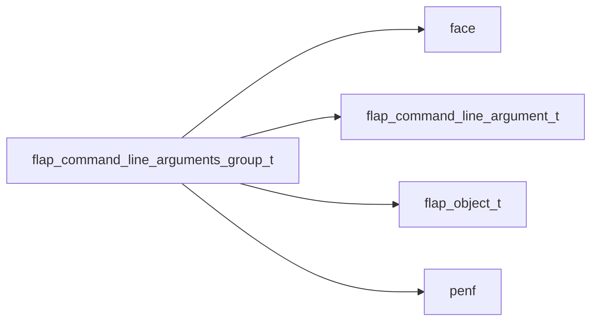

## Contents

- [command_line_arguments_group](#command-line-arguments-group)
- [free](#free)
- [check](#check)
- [is_required_passed](#is-required-passed)
- [raise_error_m_exclude](#raise-error-m-exclude)
- [add](#add)
- [parse](#parse)
- [errored](#errored)
- [check_m_exclusive](#check-m-exclusive)
- [sanitize_defaults](#sanitize-defaults)
- [clasg_assign_clasg](#clasg-assign-clasg)
- [finalize](#finalize)
- [is_passed](#is-passed)
- [is_defined](#is-defined)
- [usage](#usage)
- [signature](#signature)

## Variables

| Name | Type | Attributes | Description |
|------|------|------------|-------------|
| `STATUS_PRINT_V` | integer(kind=[I4P](/api/src/third_party/PENF/src/lib/penf_global_parameters_variables)) | parameter | Print version status. |
| `STATUS_PRINT_H` | integer(kind=[I4P](/api/src/third_party/PENF/src/lib/penf_global_parameters_variables)) | parameter | Print help status. |
| `STATUS_PRINT_M` | integer(kind=[I4P](/api/src/third_party/PENF/src/lib/penf_global_parameters_variables)) | parameter | Print help status to Markdown file. |
| `ERROR_CONSISTENCY` | integer(kind=[I4P](/api/src/third_party/PENF/src/lib/penf_global_parameters_variables)) | parameter | CLAs group consistency error. |
| `ERROR_M_EXCLUDE` | integer(kind=[I4P](/api/src/third_party/PENF/src/lib/penf_global_parameters_variables)) | parameter | Two mutually exclusive CLAs group have been called. |

## Derived Types

### command_line_arguments_group

Command Line Arguments Group (CLAsG) class.

 CLAsG are useful for building nested commands.

**Inheritance**

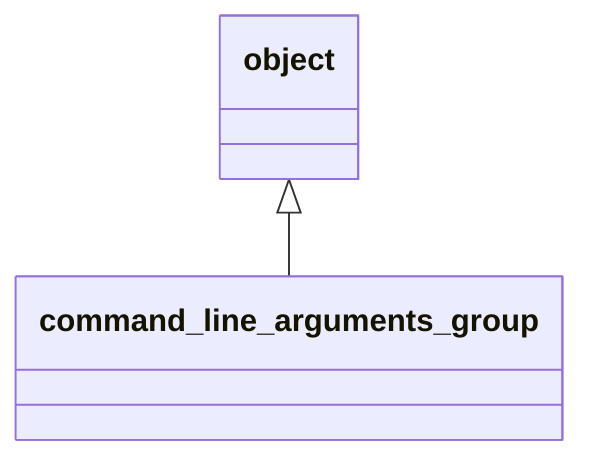

**Extends**: [`object`](/api/src/lib/flap_object_t#object)

#### Components

| Name | Type | Attributes | Description |
|------|------|------------|-------------|
| `progname` | character(len=:) | allocatable | Program name. |
| `version` | character(len=:) | allocatable | Program version. |
| `help` | character(len=:) | allocatable | Help message. |
| `help_color` | character(len=:) | allocatable | ANSI color of help messages. |
| `help_style` | character(len=:) | allocatable | ANSI style of help messages. |
| `help_markdown` | character(len=:) | allocatable | Longer help message, markdown formatted. |
| `description` | character(len=:) | allocatable | Detailed description. |
| `license` | character(len=:) | allocatable | License description. |
| `authors` | character(len=:) | allocatable | Authors list. |
| `epilog` | character(len=:) | allocatable | Epilogue message. |
| `m_exclude` | character(len=:) | allocatable | Mutually exclude other CLA(s group). |
| `error_message` | character(len=:) | allocatable | Meaningful error message to standard-error. |
| `error_color` | character(len=:) | allocatable | ANSI color of error messages. |
| `error_style` | character(len=:) | allocatable | ANSI style of error messages. |
| `examples` | character(len=512) | allocatable | Examples of correct usage. |
| `error` | integer(kind=[I4P](/api/src/third_party/PENF/src/lib/penf_global_parameters_variables)) |  | Error trapping flag. |
| `usage_lun` | integer(kind=[I4P](/api/src/third_party/PENF/src/lib/penf_global_parameters_variables)) |  | Output unit to print help/usage messages |
| `version_lun` | integer(kind=[I4P](/api/src/third_party/PENF/src/lib/penf_global_parameters_variables)) |  | Output unit to print version message |
| `error_lun` | integer(kind=[I4P](/api/src/third_party/PENF/src/lib/penf_global_parameters_variables)) |  | Error unit to print error messages |
| `group` | character(len=:) | allocatable | Group name (command). |
| `Na` | integer(kind=[I4P](/api/src/third_party/PENF/src/lib/penf_global_parameters_variables)) |  | Number of CLA. |
| `Na_required` | integer(kind=[I4P](/api/src/third_party/PENF/src/lib/penf_global_parameters_variables)) |  | Number of required command line arguments. |
| `Na_optional` | integer(kind=[I4P](/api/src/third_party/PENF/src/lib/penf_global_parameters_variables)) |  | Number of optional command line arguments. |
| `cla` | type([command_line_argument](/api/src/lib/flap_command_line_argument_t#command-line-argument)) | allocatable | CLA list [1:Na]. |
| `is_called` | logical |  | Flag for checking if CLAs group has been passed to CLI. |

#### Type-Bound Procedures

| Name | Attributes | Description |
|------|------------|-------------|
| `free_object` | pass(self) | Free dynamic memory. |
| `print_version` | pass(self) | Print version. |
| `print_error_message` | pass(self) | Print meaningful error message. |
| `set_examples` | pass(self) | Set examples of correct usage. |
| `assign_object` | pass(lhs ) | Assignment overloading. |
| `free` |  | Free dynamic memory. |
| `check` |  | Check data consistency. |
| `is_required_passed` |  | Check if required CLAs are passed. |
| `is_passed` |  | Check if a CLA has been passed. |
| `is_defined` |  | Check if a CLA has been defined. |
| `raise_error_m_exclude` |  | Raise error mutually exclusive CLAs passed. |
| `add` |  | Add CLA to CLAsG. |
| `parse` |  | Parse CLAsG arguments. |
| `usage` |  | Get correct CLAsG usage. |
| `signature` |  | Get CLAsG signature. |
| `sanitize_defaults` |  | Sanitize default values. |
| `errored` |  | Trig error occurrence and print meaningful message. |
| `check_m_exclusive` |  | Check if two mutually exclusive CLAs have been passed. |
| `clasg_assign_clasg` |  | Assignment operator. |
| `assignment(=)` |  | Assignment operator overloading. |

## Subroutines

### free

Free dynamic memory.

**Attributes**: elemental

```fortran
subroutine free(self)
```

**Arguments**

| Name | Type | Intent | Attributes | Description |
|------|------|--------|------------|-------------|
| `self` | class([command_line_arguments_group](/api/src/lib/flap_command_line_arguments_group_t#command-line-arguments-group)) | inout |  | CLAsG data. |

**Call graph**

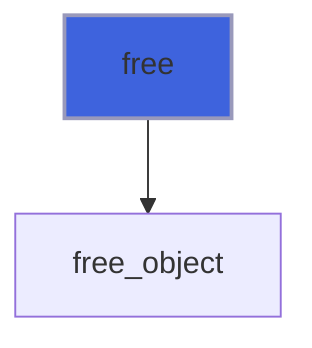

### check

Check data consistency.

```fortran
subroutine check(self, pref)
```

**Arguments**

| Name | Type | Intent | Attributes | Description |
|------|------|--------|------------|-------------|
| `self` | class([command_line_arguments_group](/api/src/lib/flap_command_line_arguments_group_t#command-line-arguments-group)) | inout |  | CLAsG data. |
| `pref` | character(len=*) | in | optional | Prefixing string. |

**Call graph**

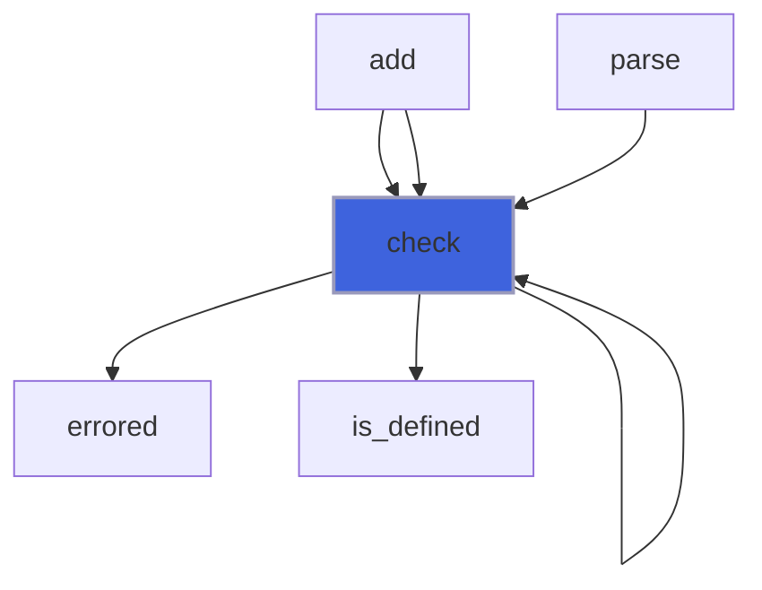

### is_required_passed

Check if required CLAs are passed.

```fortran
subroutine is_required_passed(self, pref)
```

**Arguments**

| Name | Type | Intent | Attributes | Description |
|------|------|--------|------------|-------------|
| `self` | class([command_line_arguments_group](/api/src/lib/flap_command_line_arguments_group_t#command-line-arguments-group)) | inout |  | CLAsG data. |
| `pref` | character(len=*) | in | optional | Prefixing string. |

**Call graph**

```mermaid
flowchart TD
  get_cla["get_cla"] --> is_required_passed["is_required_passed"]
  get_cla_list["get_cla_list"] --> is_required_passed["is_required_passed"]
  get_cla_list_varying_I1P["get_cla_list_varying_I1P"] --> is_required_passed["is_required_passed"]
  get_cla_list_varying_I2P["get_cla_list_varying_I2P"] --> is_required_passed["is_required_passed"]
  get_cla_list_varying_I4P["get_cla_list_varying_I4P"] --> is_required_passed["is_required_passed"]
  get_cla_list_varying_I8P["get_cla_list_varying_I8P"] --> is_required_passed["is_required_passed"]
  get_cla_list_varying_R16P["get_cla_list_varying_R16P"] --> is_required_passed["is_required_passed"]
  get_cla_list_varying_R4P["get_cla_list_varying_R4P"] --> is_required_passed["is_required_passed"]
  get_cla_list_varying_R8P["get_cla_list_varying_R8P"] --> is_required_passed["is_required_passed"]
  get_cla_list_varying_char["get_cla_list_varying_char"] --> is_required_passed["is_required_passed"]
  get_cla_list_varying_logical["get_cla_list_varying_logical"] --> is_required_passed["is_required_passed"]
  is_required_passed["is_required_passed"] --> is_required_passed["is_required_passed"]
  parse["parse"] --> is_required_passed["is_required_passed"]
  is_required_passed["is_required_passed"] --> is_required_passed["is_required_passed"]
  is_required_passed["is_required_passed"] --> usage["usage"]
  style is_required_passed fill:#3e63dd,stroke:#99b,stroke-width:2px
```

### raise_error_m_exclude

Raise error mutually exclusive CLAs passed.

```fortran
subroutine raise_error_m_exclude(self, pref)
```

**Arguments**

| Name | Type | Intent | Attributes | Description |
|------|------|--------|------------|-------------|
| `self` | class([command_line_arguments_group](/api/src/lib/flap_command_line_arguments_group_t#command-line-arguments-group)) | inout |  | CLA data. |
| `pref` | character(len=*) | in | optional | Prefixing string. |

**Call graph**

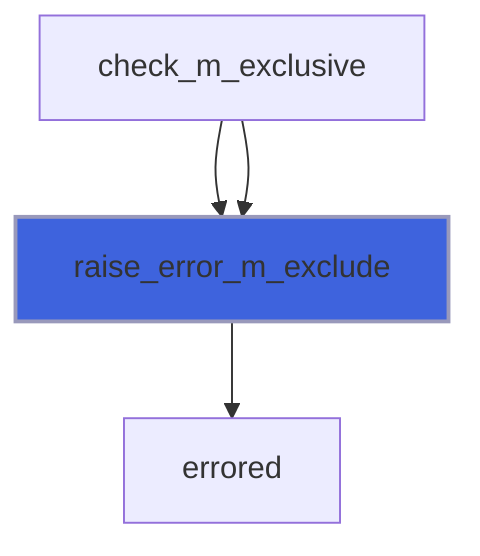

### add

Add CLA to CLAs list.

 @note If not otherwise declared the action on CLA value is set to "store" a value that must be passed after the switch name
 or directly passed in case of positional CLA.

```fortran
subroutine add(self, pref, cla)
```

**Arguments**

| Name | Type | Intent | Attributes | Description |
|------|------|--------|------------|-------------|
| `self` | class([command_line_arguments_group](/api/src/lib/flap_command_line_arguments_group_t#command-line-arguments-group)) | inout |  | CLAsG data. |
| `pref` | character(len=*) | in | optional | Prefixing string. |
| `cla` | type([command_line_argument](/api/src/lib/flap_command_line_argument_t#command-line-argument)) | in |  | CLA data. |

**Call graph**

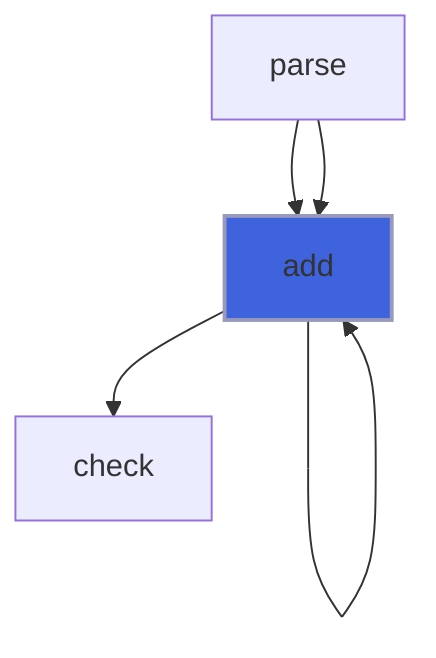

### parse

Parse CLAsG arguments.

```fortran
subroutine parse(self, args, ignore_unknown_clas, pref, error_unknown_clas)
```

**Arguments**

| Name | Type | Intent | Attributes | Description |
|------|------|--------|------------|-------------|
| `self` | class([command_line_arguments_group](/api/src/lib/flap_command_line_arguments_group_t#command-line-arguments-group)) | inout |  | CLAsG data. |
| `args` | character(len=*) | in |  | Command line arguments. |
| `ignore_unknown_clas` | logical | in |  | Disable errors-raising for passed unknown CLAs. |
| `pref` | character(len=*) | in | optional | Prefixing string. |
| `error_unknown_clas` | integer(kind=[I4P](/api/src/third_party/PENF/src/lib/penf_global_parameters_variables)) | out |  | Error flag for passed unknown CLAs. |

**Call graph**

```mermaid
flowchart TD
  get_cla["get_cla"] --> parse["parse"]
  get_cla_list["get_cla_list"] --> parse["parse"]
  get_cla_list_varying_I1P["get_cla_list_varying_I1P"] --> parse["parse"]
  get_cla_list_varying_I2P["get_cla_list_varying_I2P"] --> parse["parse"]
  get_cla_list_varying_I4P["get_cla_list_varying_I4P"] --> parse["parse"]
  get_cla_list_varying_I8P["get_cla_list_varying_I8P"] --> parse["parse"]
  get_cla_list_varying_R16P["get_cla_list_varying_R16P"] --> parse["parse"]
  get_cla_list_varying_R4P["get_cla_list_varying_R4P"] --> parse["parse"]
  get_cla_list_varying_R8P["get_cla_list_varying_R8P"] --> parse["parse"]
  get_cla_list_varying_char["get_cla_list_varying_char"] --> parse["parse"]
  get_cla_list_varying_logical["get_cla_list_varying_logical"] --> parse["parse"]
  parse["parse"] --> parse["parse"]
  parse["parse"] --> add["add"]
  parse["parse"] --> assign_object["assign_object"]
  parse["parse"] --> check_m_exclusive["check_m_exclusive"]
  parse["parse"] --> cton["cton"]
  parse["parse"] --> is_defined["is_defined"]
  parse["parse"] --> n_next_undef_args["n_next_undef_args"]
  parse["parse"] --> raise_error_duplicated_clas["raise_error_duplicated_clas"]
  parse["parse"] --> raise_error_nargs_insufficient["raise_error_nargs_insufficient"]
  parse["parse"] --> raise_error_switch_unknown["raise_error_switch_unknown"]
  parse["parse"] --> raise_error_value_missing["raise_error_value_missing"]
  parse["parse"] --> sanitize_defaults["sanitize_defaults"]
  style parse fill:#3e63dd,stroke:#99b,stroke-width:2px
```

### errored

Trig error occurrence and print meaningful message.

```fortran
subroutine errored(self, error, pref, a1, a2)
```

**Arguments**

| Name | Type | Intent | Attributes | Description |
|------|------|--------|------------|-------------|
| `self` | class([command_line_arguments_group](/api/src/lib/flap_command_line_arguments_group_t#command-line-arguments-group)) | inout |  | CLAsG data. |
| `error` | integer(kind=[I4P](/api/src/third_party/PENF/src/lib/penf_global_parameters_variables)) | in |  | Error occurred. |
| `pref` | character(len=*) | in | optional | Prefixing string. |
| `a1` | integer(kind=[I4P](/api/src/third_party/PENF/src/lib/penf_global_parameters_variables)) | in | optional | First index CLAs group inconsistent. |
| `a2` | integer(kind=[I4P](/api/src/third_party/PENF/src/lib/penf_global_parameters_variables)) | in | optional | Second index CLAs group inconsistent. |

**Call graph**

```mermaid
flowchart TD
  check["check"] --> errored["errored"]
  check_action_consistency["check_action_consistency"] --> errored["errored"]
  check_choices["check_choices"] --> errored["errored"]
  check_envvar_consistency["check_envvar_consistency"] --> errored["errored"]
  check_list_size["check_list_size"] --> errored["errored"]
  check_m_exclude_consistency["check_m_exclude_consistency"] --> errored["errored"]
  check_named_consistency["check_named_consistency"] --> errored["errored"]
  check_optional_consistency["check_optional_consistency"] --> errored["errored"]
  check_positional_consistency["check_positional_consistency"] --> errored["errored"]
  get_cla["get_cla"] --> errored["errored"]
  get_cla["get_cla"] --> errored["errored"]
  get_cla_from_buffer["get_cla_from_buffer"] --> errored["errored"]
  get_cla_list["get_cla_list"] --> errored["errored"]
  get_cla_list["get_cla_list"] --> errored["errored"]
  get_cla_list_from_buffer["get_cla_list_from_buffer"] --> errored["errored"]
  get_cla_list_varying_I1P["get_cla_list_varying_I1P"] --> errored["errored"]
  get_cla_list_varying_I1P["get_cla_list_varying_I1P"] --> errored["errored"]
  get_cla_list_varying_I2P["get_cla_list_varying_I2P"] --> errored["errored"]
  get_cla_list_varying_I2P["get_cla_list_varying_I2P"] --> errored["errored"]
  get_cla_list_varying_I4P["get_cla_list_varying_I4P"] --> errored["errored"]
  get_cla_list_varying_I4P["get_cla_list_varying_I4P"] --> errored["errored"]
  get_cla_list_varying_I8P["get_cla_list_varying_I8P"] --> errored["errored"]
  get_cla_list_varying_I8P["get_cla_list_varying_I8P"] --> errored["errored"]
  get_cla_list_varying_R16P["get_cla_list_varying_R16P"] --> errored["errored"]
  get_cla_list_varying_R16P["get_cla_list_varying_R16P"] --> errored["errored"]
  get_cla_list_varying_R4P["get_cla_list_varying_R4P"] --> errored["errored"]
  get_cla_list_varying_R4P["get_cla_list_varying_R4P"] --> errored["errored"]
  get_cla_list_varying_R8P["get_cla_list_varying_R8P"] --> errored["errored"]
  get_cla_list_varying_R8P["get_cla_list_varying_R8P"] --> errored["errored"]
  get_cla_list_varying_char["get_cla_list_varying_char"] --> errored["errored"]
  get_cla_list_varying_char["get_cla_list_varying_char"] --> errored["errored"]
  get_cla_list_varying_logical["get_cla_list_varying_logical"] --> errored["errored"]
  get_cla_list_varying_logical["get_cla_list_varying_logical"] --> errored["errored"]
  is_required_passed["is_required_passed"] --> errored["errored"]
  is_required_val_passed["is_required_val_passed"] --> errored["errored"]
  raise_error_duplicated_clas["raise_error_duplicated_clas"] --> errored["errored"]
  raise_error_m_exclude["raise_error_m_exclude"] --> errored["errored"]
  raise_error_m_exclude["raise_error_m_exclude"] --> errored["errored"]
  raise_error_nargs_insufficient["raise_error_nargs_insufficient"] --> errored["errored"]
  raise_error_switch_unknown["raise_error_switch_unknown"] --> errored["errored"]
  raise_error_value_missing["raise_error_value_missing"] --> errored["errored"]
  errored["errored"] --> colorize["colorize"]
  errored["errored"] --> print_error_message["print_error_message"]
  errored["errored"] --> str["str"]
  style errored fill:#3e63dd,stroke:#99b,stroke-width:2px
```

### check_m_exclusive

Check if two mutually exclusive CLAs have been passed.

```fortran
subroutine check_m_exclusive(self, pref)
```

**Arguments**

| Name | Type | Intent | Attributes | Description |
|------|------|--------|------------|-------------|
| `self` | class([command_line_arguments_group](/api/src/lib/flap_command_line_arguments_group_t#command-line-arguments-group)) | inout |  | CLAsG data. |
| `pref` | character(len=*) | in | optional | Prefixing string. |

**Call graph**

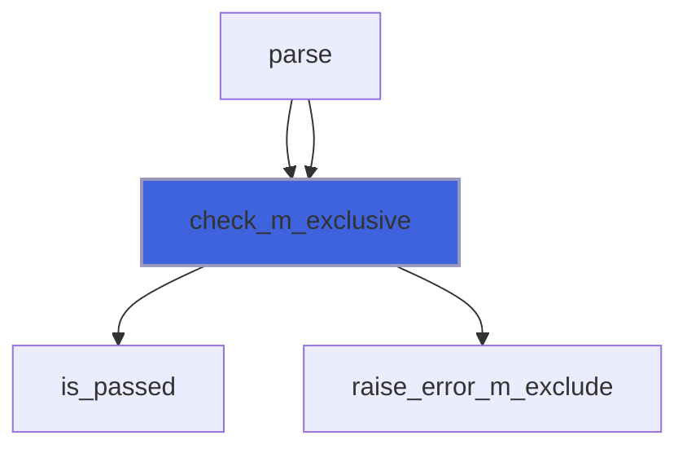

### sanitize_defaults

Sanitize defaults values.

 It is necessary to *sanitize* the default values of non-passed, optional CLAs.

```fortran
subroutine sanitize_defaults(self)
```

**Arguments**

| Name | Type | Intent | Attributes | Description |
|------|------|--------|------------|-------------|
| `self` | class([command_line_arguments_group](/api/src/lib/flap_command_line_arguments_group_t#command-line-arguments-group)) | inout |  | CLAsG data. |

**Call graph**

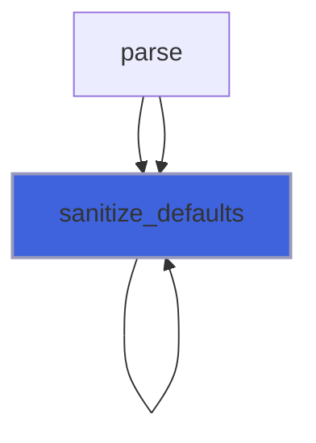

### clasg_assign_clasg

Assignment operator.

**Attributes**: elemental

```fortran
subroutine clasg_assign_clasg(lhs, rhs)
```

**Arguments**

| Name | Type | Intent | Attributes | Description |
|------|------|--------|------------|-------------|
| `lhs` | class([command_line_arguments_group](/api/src/lib/flap_command_line_arguments_group_t#command-line-arguments-group)) | inout |  | Left hand side. |
| `rhs` | type([command_line_arguments_group](/api/src/lib/flap_command_line_arguments_group_t#command-line-arguments-group)) | in |  | Right hand side. |

**Call graph**

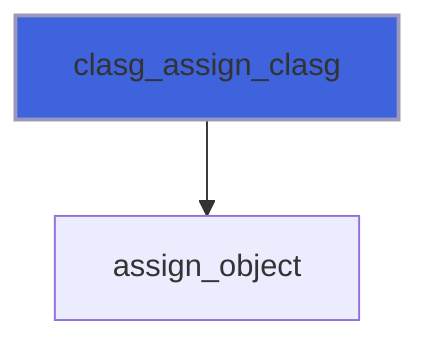

### finalize

Free dynamic memory when finalizing.

**Attributes**: elemental

```fortran
subroutine finalize(self)
```

**Arguments**

| Name | Type | Intent | Attributes | Description |
|------|------|--------|------------|-------------|
| `self` | type([command_line_arguments_group](/api/src/lib/flap_command_line_arguments_group_t#command-line-arguments-group)) | inout |  | CLAsG data. |

## Functions

### is_passed

Check if a CLA has been passed.

**Attributes**: pure

**Returns**: `logical`

```fortran
function is_passed(self, switch, position)
```

**Arguments**

| Name | Type | Intent | Attributes | Description |
|------|------|--------|------------|-------------|
| `self` | class([command_line_arguments_group](/api/src/lib/flap_command_line_arguments_group_t#command-line-arguments-group)) | in |  | CLAsG data. |
| `switch` | character(len=*) | in | optional | Switch name. |
| `position` | integer(kind=[I4P](/api/src/third_party/PENF/src/lib/penf_global_parameters_variables)) | in | optional | Position of positional CLA. |

**Call graph**

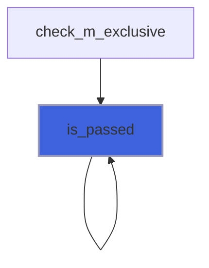

### is_defined

Check if a CLA has been defined.

**Returns**: `logical`

```fortran
function is_defined(self, switch, pos)
```

**Arguments**

| Name | Type | Intent | Attributes | Description |
|------|------|--------|------------|-------------|
| `self` | class([command_line_arguments_group](/api/src/lib/flap_command_line_arguments_group_t#command-line-arguments-group)) | in |  | CLAsG data. |
| `switch` | character(len=*) | in |  | Switch name. |
| `pos` | integer(kind=[I4P](/api/src/third_party/PENF/src/lib/penf_global_parameters_variables)) | out | optional | CLA position. |

**Call graph**

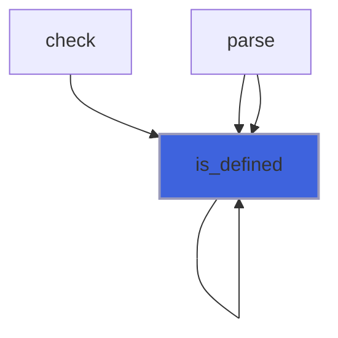

### usage

Get correct CLAsG usage.

**Returns**: `character(len=:)`

```fortran
function usage(self, pref, no_header, markdown)
```

**Arguments**

| Name | Type | Intent | Attributes | Description |
|------|------|--------|------------|-------------|
| `self` | class([command_line_arguments_group](/api/src/lib/flap_command_line_arguments_group_t#command-line-arguments-group)) | in |  | CLAsG data. |
| `pref` | character(len=*) | in | optional | Prefixing string. |
| `no_header` | logical | in | optional | Avoid insert header to usage. |
| `markdown` | logical | in | optional | Format things form markdown. |

**Call graph**

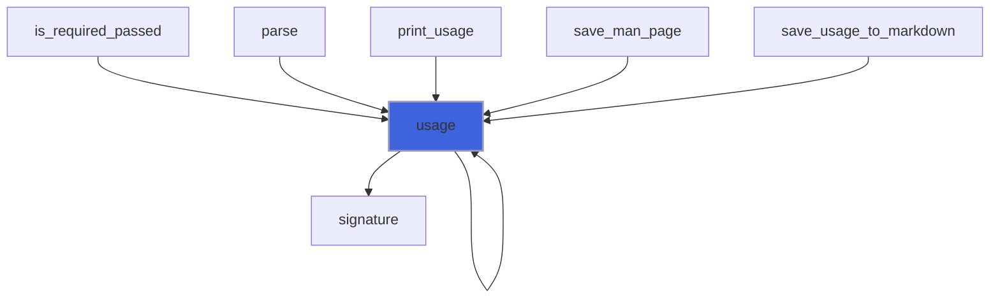

### signature

Get CLAsG signature.

**Returns**: `character(len=:)`

```fortran
function signature(self, bash_completion, plain)
```

**Arguments**

| Name | Type | Intent | Attributes | Description |
|------|------|--------|------------|-------------|
| `self` | class([command_line_arguments_group](/api/src/lib/flap_command_line_arguments_group_t#command-line-arguments-group)) | in |  | CLAsG data. |
| `bash_completion` | logical | in | optional | Return the signature for bash completion. |
| `plain` | logical | in | optional | Return the signature as plain switches list. |

**Call graph**

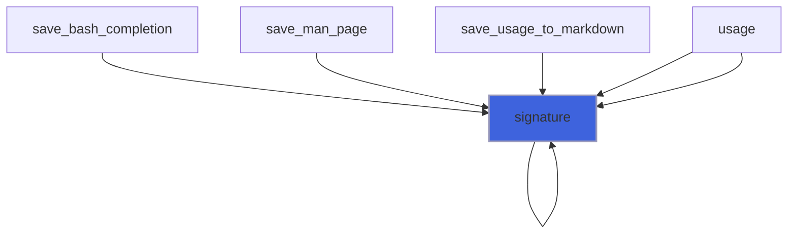
