# flap_command_line_arguments_group_t

> Command Line Arguments Group (CLAsG) class.

**Source**: `src/lib/flap_command_line_arguments_group_t.f90`

**Dependencies**

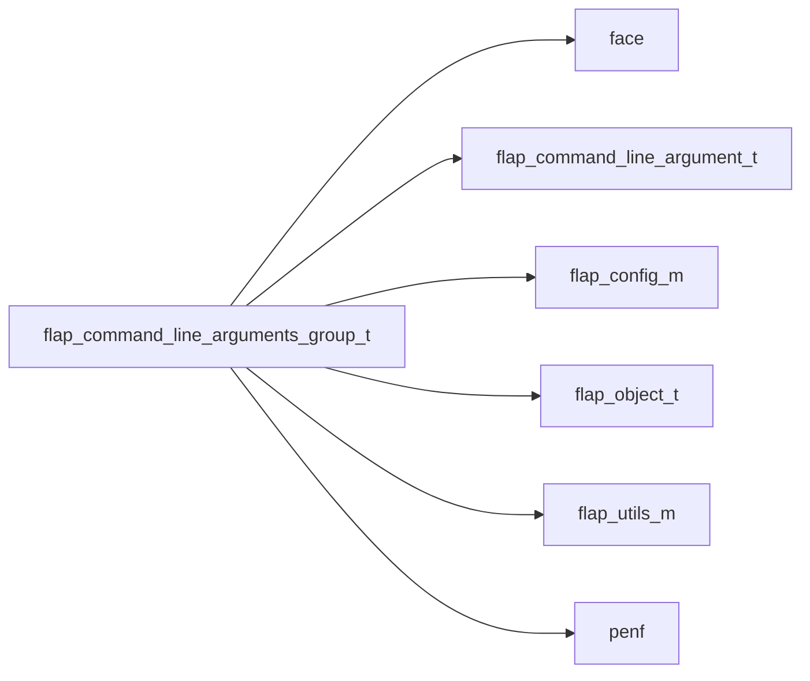
```mermaid
graph LR
  flap_command_line_arguments_group_t["flap_command_line_arguments_group_t"] --> face["face"]
  flap_command_line_arguments_group_t["flap_command_line_arguments_group_t"] --> flap_command_line_argument_t["flap_command_line_argument_t"]
  flap_command_line_arguments_group_t["flap_command_line_arguments_group_t"] --> flap_config_m["flap_config_m"]
  flap_command_line_arguments_group_t["flap_command_line_arguments_group_t"] --> flap_object_t["flap_object_t"]
  flap_command_line_arguments_group_t["flap_command_line_arguments_group_t"] --> flap_utils_m["flap_utils_m"]
  flap_command_line_arguments_group_t["flap_command_line_arguments_group_t"] --> penf["penf"]
```

## Contents

- [exclusive_set](#exclusive-set)
- [command_line_arguments_group](#command-line-arguments-group)
- [free](#free)
- [check](#check)
- [check_position_gaps](#check-position-gaps)
- [is_required_passed](#is-required-passed)
- [add_exclusive_set](#add-exclusive-set)
- [check_exclusive_sets](#check-exclusive-sets)
- [reset_parse](#reset-parse)
- [resolve_values](#resolve-values)
- [match_compact_count](#match-compact-count)
- [raise_error_m_exclude](#raise-error-m-exclude)
- [add](#add)
- [parse](#parse)
- [errored](#errored)
- [check_m_exclusive](#check-m-exclusive)
- [sanitize_defaults](#sanitize-defaults)
- [finalize](#finalize)
- [is_passed](#is-passed)
- [positional_index](#positional-index)
- [config_key_index](#config-key-index)
- [value_arity](#value-arity)
- [is_defined](#is-defined)
- [is_action_passed](#is-action-passed)
- [is_switch_token](#is-switch-token)
- [usage](#usage)
- [signature](#signature)
- [exclusive_set_of](#exclusive-set-of)
- [exclusive_set_signature](#exclusive-set-signature)

## Variables

| Name | Type | Attributes | Description |
|------|------|------------|-------------|
| `STATUS_PRINT_V` | integer(kind=[I4P](/api/src/third_party/PENF/src/lib/penf_global_parameters_variables)) | parameter | Print version status. |
| `STATUS_PRINT_H` | integer(kind=[I4P](/api/src/third_party/PENF/src/lib/penf_global_parameters_variables)) | parameter | Print help status. |
| `STATUS_PRINT_M` | integer(kind=[I4P](/api/src/third_party/PENF/src/lib/penf_global_parameters_variables)) | parameter | Print help status to Markdown file. |
| `STATUS_NO_ARGS` | integer(kind=[I4P](/api/src/third_party/PENF/src/lib/penf_global_parameters_variables)) | parameter | No arguments passed, help printed (no_args_is_help). |
| `STATUS_ALTERNATE` | integer(kind=[I4P](/api/src/third_party/PENF/src/lib/penf_global_parameters_variables)) | parameter | An alternate action passed: value validation bypassed (F16). |
| `ERROR_CONSISTENCY` | integer(kind=[I4P](/api/src/third_party/PENF/src/lib/penf_global_parameters_variables)) | parameter | CLAs group consistency error. |
| `ERROR_M_EXCLUDE` | integer(kind=[I4P](/api/src/third_party/PENF/src/lib/penf_global_parameters_variables)) | parameter | Two mutually exclusive CLAs group have been called. |
| `ERROR_M_EXCLUDE_SET` | integer(kind=[I4P](/api/src/third_party/PENF/src/lib/penf_global_parameters_variables)) | parameter | Two members of a mutually exclusive set have been passed. |
| `ERROR_M_EXCLUDE_SET_REQUIRED` | integer(kind=[I4P](/api/src/third_party/PENF/src/lib/penf_global_parameters_variables)) | parameter | No member of a required mutually exclusive set passed. |
| `ERROR_M_EXCLUDE_SET_DEFINITION` | integer(kind=[I4P](/api/src/third_party/PENF/src/lib/penf_global_parameters_variables)) | parameter | Invalid definition of a mutually exclusive set. |
| `ERROR_POSITION_DUPLICATE` | integer(kind=[I4P](/api/src/third_party/PENF/src/lib/penf_global_parameters_variables)) | parameter | Two positional CLAs declared at the same position. |
| `ERROR_POSITION_GAP` | integer(kind=[I4P](/api/src/third_party/PENF/src/lib/penf_global_parameters_variables)) | parameter | Declared positions are not 1..N: one is missing. |

## Derived Types

### exclusive_set

Mutually exclusive set of switches: at most one member may be passed, exactly one if required (F03 of #125).

#### Components

| Name | Type | Attributes | Description |
|------|------|------------|-------------|
| `switches` | character(len=:) | allocatable | Members, by their switch, as a stored list (LIST_SEP). |
| `is_required` | logical |  | Exactly one member must be passed. |

### command_line_arguments_group

Command Line Arguments Group (CLAsG) class.

 CLAsG are useful for building nested commands.

**Inheritance**

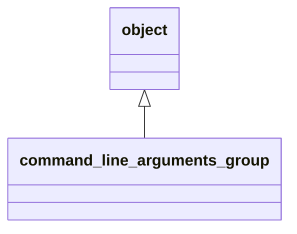
```mermaid
classDiagram
  object <|-- command_line_arguments_group
```

**Extends**: [`object`](/api/src/lib/flap_object_t#object)

#### Components

| Name | Type | Attributes | Description |
|------|------|------------|-------------|
| `progname` | character(len=:) | allocatable | Program name. |
| `version` | character(len=:) | allocatable | Program version. |
| `help` | character(len=:) | allocatable | Help message. |
| `help_color` | character(len=:) | allocatable | ANSI color of help messages. |
| `help_style` | character(len=:) | allocatable | ANSI style of help messages. |
| `help_markdown` | character(len=:) | allocatable | Longer help message, markdown formatted. |
| `description` | character(len=:) | allocatable | Detailed description. |
| `license` | character(len=:) | allocatable | License description. |
| `authors` | character(len=:) | allocatable | Authors list. |
| `epilog` | character(len=:) | allocatable | Epilogue message. |
| `m_exclude` | character(len=:) | allocatable | Mutually exclude other CLA(s group). |
| `error_message` | character(len=:) | allocatable | Meaningful error message to standard-error. |
| `error_color` | character(len=:) | allocatable | ANSI color of error messages. |
| `error_style` | character(len=:) | allocatable | ANSI style of error messages. |
| `examples` | type([flap_string](/api/src/lib/flap_utils_m#flap-string)) | allocatable | Examples of correct usage (examples(i)%s). |
| `error` | integer(kind=[I4P](/api/src/third_party/PENF/src/lib/penf_global_parameters_variables)) |  | Error trapping flag. |
| `usage_lun` | integer(kind=[I4P](/api/src/third_party/PENF/src/lib/penf_global_parameters_variables)) |  | Output unit to print help/usage messages |
| `version_lun` | integer(kind=[I4P](/api/src/third_party/PENF/src/lib/penf_global_parameters_variables)) |  | Output unit to print version message |
| `error_lun` | integer(kind=[I4P](/api/src/third_party/PENF/src/lib/penf_global_parameters_variables)) |  | Error unit to print error messages |
| `group` | character(len=:) | allocatable | Group name (command). |
| `Na` | integer(kind=[I4P](/api/src/third_party/PENF/src/lib/penf_global_parameters_variables)) |  | Number of CLA. |
| `Na_required` | integer(kind=[I4P](/api/src/third_party/PENF/src/lib/penf_global_parameters_variables)) |  | Number of required command line arguments. |
| `Na_optional` | integer(kind=[I4P](/api/src/third_party/PENF/src/lib/penf_global_parameters_variables)) |  | Number of optional command line arguments. |
| `cla` | type([command_line_argument](/api/src/lib/flap_command_line_argument_t#command-line-argument)) | allocatable | CLA list [1:Na]. |
| `is_called` | logical |  | Flag for checking if CLAs group has been passed to CLI. |
| `no_args_is_help` | logical |  | Print the help when invoked with no arguments. |
| `m_sets` | type([exclusive_set](/api/src/lib/flap_command_line_arguments_group_t#exclusive-set)) | allocatable | Mutually exclusive sets of switches. |
| `deprecated` | character(len=:) | allocatable | Deprecation message of the command (F13). |

#### Type-Bound Procedures

| Name | Attributes | Description |
|------|------------|-------------|
| `error_prefix` | pass(self) | Prefix of error messages. |
| `free_object` | pass(self) | Free dynamic memory. |
| `print_version` | pass(self) | Print version. |
| `print_error_message` | pass(self) | Print meaningful error message. |
| `set_examples` | pass(self) | Set examples of correct usage. |
| `assign_object` | pass(lhs ) | Assignment overloading. |
| `free` |  | Free dynamic memory. |
| `check` |  | Check data consistency. |
| `check_position_gaps` |  | Check that the declared positions have no gap. |
| `is_required_passed` |  | Check if required CLAs are passed. |
| `add_exclusive_set` |  | Add a mutually exclusive set of switches. |
| `check_exclusive_sets` |  | Check the mutually exclusive sets of switches. |
| `is_passed` |  | Check if a CLA has been passed. |
| `is_defined` |  | Check if a CLA has been defined. |
| `is_switch_token` |  | Check if a command line token names a CLA of the group. |
| `is_action_passed` |  | Check if a CLA with an action has been passed. |
| `match_compact_count` |  | Match the compact form -vvv of a count CLA. |
| `positional_index` |  | Index of the positional CLA declared at a position. |
| `value_arity` |  | Number of fixed value slots following a switch. |
| `reset_parse` |  | Forget the result of a parse, keeping the definitions. |
| `resolve_values` |  | Settle the source of the values not given on the command line. |
| `config_key_index` |  | Index of the CLA named by a configuration file key. |
| `raise_error_m_exclude` |  | Raise error mutually exclusive CLAs passed. |
| `add` |  | Add CLA to CLAsG. |
| `parse` |  | Parse CLAsG arguments. |
| `usage` |  | Get correct CLAsG usage. |
| `signature` |  | Get CLAsG signature. |
| `sanitize_defaults` |  | Sanitize default values. |
| `errored` |  | Trig error occurrence and print meaningful message. |
| `check_m_exclusive` |  | Check if two mutually exclusive CLAs have been passed. |
| `exclusive_set_of` |  | Index of the mutually exclusive set of a CLA. |
| `exclusive_set_signature` |  | Usage signature of a mutually exclusive set. |

## Subroutines

### free

Free dynamic memory.

**Attributes**: elemental

```fortran
subroutine free(self)
```

**Arguments**

| Name | Type | Intent | Attributes | Description |
|------|------|--------|------------|-------------|
| `self` | class([command_line_arguments_group](/api/src/lib/flap_command_line_arguments_group_t#command-line-arguments-group)) | inout |  | CLAsG data. |

**Call graph**

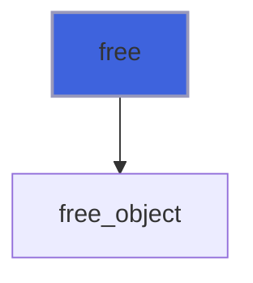
```mermaid
flowchart TD
  free["free"] --> free_object["free_object"]
  style free fill:#3e63dd,stroke:#99b,stroke-width:2px
```

### check

Check data consistency.

```fortran
subroutine check(self, pref)
```

**Arguments**

| Name | Type | Intent | Attributes | Description |
|------|------|--------|------------|-------------|
| `self` | class([command_line_arguments_group](/api/src/lib/flap_command_line_arguments_group_t#command-line-arguments-group)) | inout |  | CLAsG data. |
| `pref` | character(len=*) | in | optional | Prefixing string. |

**Call graph**

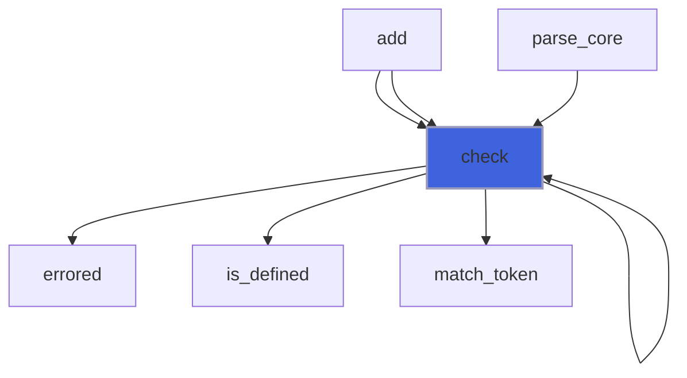
```mermaid
flowchart TD
  add["add"] --> check["check"]
  add["add"] --> check["check"]
  check["check"] --> check["check"]
  parse_core["parse_core"] --> check["check"]
  check["check"] --> errored["errored"]
  check["check"] --> is_defined["is_defined"]
  check["check"] --> match_token["match_token"]
  style check fill:#3e63dd,stroke:#99b,stroke-width:2px
```

### check_position_gaps

Check that the declared positions are 1..N without gaps (B29 of #125, D20).

 Checked when parsing starts, not in add: positionals may be declared in any order.

```fortran
subroutine check_position_gaps(self, pref)
```

**Arguments**

| Name | Type | Intent | Attributes | Description |
|------|------|--------|------------|-------------|
| `self` | class([command_line_arguments_group](/api/src/lib/flap_command_line_arguments_group_t#command-line-arguments-group)) | inout |  | CLAsG data. |
| `pref` | character(len=*) | in | optional | Prefixing string. |

**Call graph**

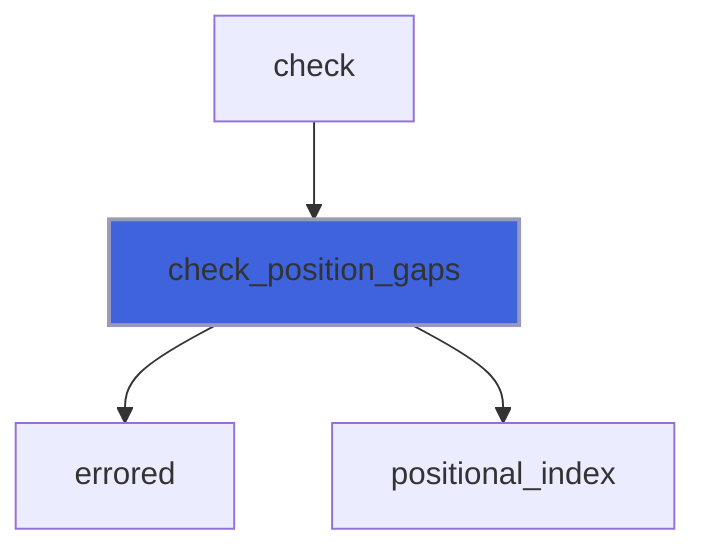
```mermaid
flowchart TD
  check["check"] --> check_position_gaps["check_position_gaps"]
  check_position_gaps["check_position_gaps"] --> errored["errored"]
  check_position_gaps["check_position_gaps"] --> positional_index["positional_index"]
  style check_position_gaps fill:#3e63dd,stroke:#99b,stroke-width:2px
```

### is_required_passed

Check if required CLAs are passed.

```fortran
subroutine is_required_passed(self, pref)
```

**Arguments**

| Name | Type | Intent | Attributes | Description |
|------|------|--------|------------|-------------|
| `self` | class([command_line_arguments_group](/api/src/lib/flap_command_line_arguments_group_t#command-line-arguments-group)) | inout |  | CLAsG data. |
| `pref` | character(len=*) | in | optional | Prefixing string. |

**Call graph**


```mermaid
flowchart TD
  get_cla["get_cla"] --> is_required_passed["is_required_passed"]
  get_cla_list["get_cla_list"] --> is_required_passed["is_required_passed"]
  get_cla_list_varying_I1P["get_cla_list_varying_I1P"] --> is_required_passed["is_required_passed"]
  get_cla_list_varying_I2P["get_cla_list_varying_I2P"] --> is_required_passed["is_required_passed"]
  get_cla_list_varying_I4P["get_cla_list_varying_I4P"] --> is_required_passed["is_required_passed"]
  get_cla_list_varying_I8P["get_cla_list_varying_I8P"] --> is_required_passed["is_required_passed"]
  get_cla_list_varying_R16P["get_cla_list_varying_R16P"] --> is_required_passed["is_required_passed"]
  get_cla_list_varying_R4P["get_cla_list_varying_R4P"] --> is_required_passed["is_required_passed"]
  get_cla_list_varying_R8P["get_cla_list_varying_R8P"] --> is_required_passed["is_required_passed"]
  get_cla_list_varying_char["get_cla_list_varying_char"] --> is_required_passed["is_required_passed"]
  get_cla_list_varying_logical["get_cla_list_varying_logical"] --> is_required_passed["is_required_passed"]
  is_required_passed["is_required_passed"] --> is_required_passed["is_required_passed"]
  parse_core["parse_core"] --> is_required_passed["is_required_passed"]
  is_required_passed["is_required_passed"] --> is_required_passed["is_required_passed"]
  is_required_passed["is_required_passed"] --> usage["usage"]
  is_required_passed["is_required_passed"] --> write_text["write_text"]
  style is_required_passed fill:#3e63dd,stroke:#99b,stroke-width:2px
```

### add_exclusive_set

Add a mutually exclusive set of switches (F03 of #125): at most one member may be passed, exactly one if required.

 The members are comma separated and must be already defined, named switches (by switch or abbreviation, stored by their
 switch), not individually required, distinct and in no other set. An invalid set is not added: the error is
 ERROR_M_EXCLUDE_SET_DEFINITION.

```fortran
subroutine add_exclusive_set(self, switches, required, pref)
```

**Arguments**

| Name | Type | Intent | Attributes | Description |
|------|------|--------|------------|-------------|
| `self` | class([command_line_arguments_group](/api/src/lib/flap_command_line_arguments_group_t#command-line-arguments-group)) | inout |  | CLAsG data. |
| `switches` | character(len=*) | in |  | Comma separated members. |
| `required` | logical | in | optional | Exactly one member must be passed (default .false.). |
| `pref` | character(len=*) | in | optional | Prefixing string. |

**Call graph**

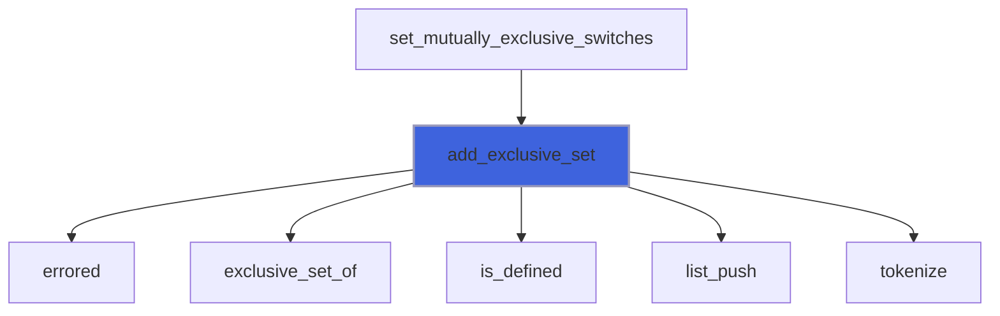
```mermaid
flowchart TD
  set_mutually_exclusive_switches["set_mutually_exclusive_switches"] --> add_exclusive_set["add_exclusive_set"]
  add_exclusive_set["add_exclusive_set"] --> errored["errored"]
  add_exclusive_set["add_exclusive_set"] --> exclusive_set_of["exclusive_set_of"]
  add_exclusive_set["add_exclusive_set"] --> is_defined["is_defined"]
  add_exclusive_set["add_exclusive_set"] --> list_push["list_push"]
  add_exclusive_set["add_exclusive_set"] --> tokenize["tokenize"]
  style add_exclusive_set fill:#3e63dd,stroke:#99b,stroke-width:2px
```

### check_exclusive_sets

Check the mutually exclusive sets of a called group: at most one member given, exactly one for a required set.

 Explicit sources count (command line, environment, configuration file; D2, E3 of #125), a default does not. When a
 member is on the command line, the environment and configuration values of the other members fall back to their
 defaults first, so that a value set for a batch job never makes a command line alternative a violation. Called after
 the statuses (help, version, markdown) and the value resolution, like the required check (E4 of #125).

```fortran
subroutine check_exclusive_sets(self, pref)
```

**Arguments**

| Name | Type | Intent | Attributes | Description |
|------|------|--------|------------|-------------|
| `self` | class([command_line_arguments_group](/api/src/lib/flap_command_line_arguments_group_t#command-line-arguments-group)) | inout |  | CLAsG data. |
| `pref` | character(len=*) | in | optional | Prefixing string. |

**Call graph**

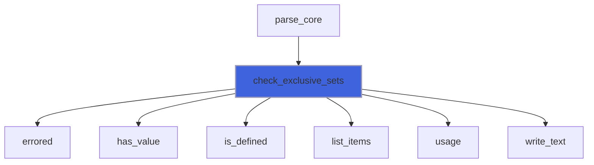
```mermaid
flowchart TD
  parse_core["parse_core"] --> check_exclusive_sets["check_exclusive_sets"]
  check_exclusive_sets["check_exclusive_sets"] --> errored["errored"]
  check_exclusive_sets["check_exclusive_sets"] --> has_value["has_value"]
  check_exclusive_sets["check_exclusive_sets"] --> is_defined["is_defined"]
  check_exclusive_sets["check_exclusive_sets"] --> list_items["list_items"]
  check_exclusive_sets["check_exclusive_sets"] --> usage["usage"]
  check_exclusive_sets["check_exclusive_sets"] --> write_text["write_text"]
  style check_exclusive_sets fill:#3e63dd,stroke:#99b,stroke-width:2px
```

### reset_parse

Forget the result of a parse (called status, passed values, errors), keeping the definitions.

```fortran
subroutine reset_parse(self)
```

**Arguments**

| Name | Type | Intent | Attributes | Description |
|------|------|--------|------------|-------------|
| `self` | class([command_line_arguments_group](/api/src/lib/flap_command_line_arguments_group_t#command-line-arguments-group)) | inout |  | CLAsG data. |

**Call graph**

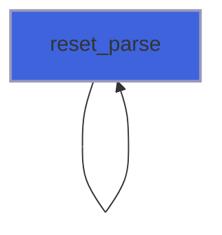
```mermaid
flowchart TD
  reset_parse["reset_parse"] --> reset_parse["reset_parse"]
  style reset_parse fill:#3e63dd,stroke:#99b,stroke-width:2px
```

### resolve_values

Settle the source of the values not given on the command line (the value-resolution chain R, F06 of #125).

 Called after all groups are parsed, before the required check. The source of a parsed value (command line, or the
 environment for a bare switch with envvar) is recorded while parsing, so that it survives a parse stopped by an error.
 The others take, in order, the environment variable if set and not blank (F07), the configuration file (section =
 group name, key = switch without dashes; F08) if the value is not blank, the default, or nothing.

```fortran
subroutine resolve_values(self, ignore_env, config, check_paths, lenient)
```

**Arguments**

| Name | Type | Intent | Attributes | Description |
|------|------|--------|------------|-------------|
| `self` | class([command_line_arguments_group](/api/src/lib/flap_command_line_arguments_group_t#command-line-arguments-group)) | inout |  | CLAsG data. |
| `ignore_env` | logical | in | optional | Turn every environment lookup off. |
| `config` | type([config_file](/api/src/lib/flap_config_m#config-file)) | in | optional | Configuration file. |
| `check_paths` | logical | in | optional | Check the path values (F09). |
| `lenient` | logical | in | optional | Ignore invalid environment lists (alternate, F16). |

**Call graph**

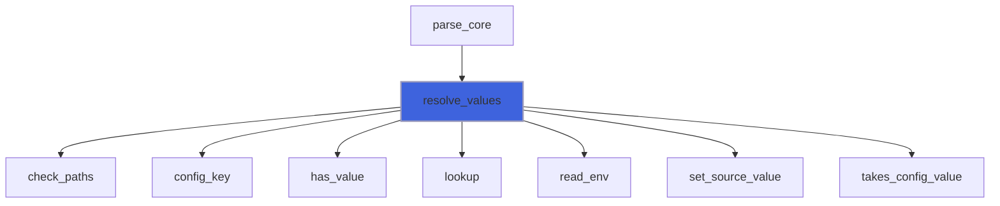
```mermaid
flowchart TD
  parse_core["parse_core"] --> resolve_values["resolve_values"]
  resolve_values["resolve_values"] --> check_paths["check_paths"]
  resolve_values["resolve_values"] --> config_key["config_key"]
  resolve_values["resolve_values"] --> has_value["has_value"]
  resolve_values["resolve_values"] --> lookup["lookup"]
  resolve_values["resolve_values"] --> read_env["read_env"]
  resolve_values["resolve_values"] --> set_source_value["set_source_value"]
  resolve_values["resolve_values"] --> takes_config_value["takes_config_value"]
  style resolve_values fill:#3e63dd,stroke:#99b,stroke-width:2px
```

### match_compact_count

Match the compact form of a count, -vvv (D1 rule 3): a dash and one letter repeated, the letter forming the switch_ab
 -v of a count CLA. The caller uses it only when no switch matches the whole token (an exact switch wins).

**Attributes**: pure

```fortran
subroutine match_compact_count(self, token, a, n)
```

**Arguments**

| Name | Type | Intent | Attributes | Description |
|------|------|--------|------------|-------------|
| `self` | class([command_line_arguments_group](/api/src/lib/flap_command_line_arguments_group_t#command-line-arguments-group)) | in |  | CLAsG data. |
| `token` | character(len=*) | in |  | Command line token. |
| `a` | integer(kind=[I4P](/api/src/third_party/PENF/src/lib/penf_global_parameters_variables)) | out |  | Index of the count CLA, 0 if no match. |
| `n` | integer(kind=[I4P](/api/src/third_party/PENF/src/lib/penf_global_parameters_variables)) | out |  | Occurrences (repetitions of the letter). |

**Call graph**

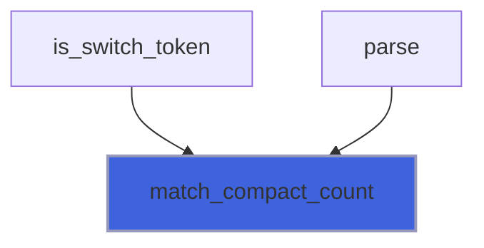
```mermaid
flowchart TD
  is_switch_token["is_switch_token"] --> match_compact_count["match_compact_count"]
  parse["parse"] --> match_compact_count["match_compact_count"]
  style match_compact_count fill:#3e63dd,stroke:#99b,stroke-width:2px
```

### raise_error_m_exclude

Raise error mutually exclusive CLAs passed.

```fortran
subroutine raise_error_m_exclude(self, pref)
```

**Arguments**

| Name | Type | Intent | Attributes | Description |
|------|------|--------|------------|-------------|
| `self` | class([command_line_arguments_group](/api/src/lib/flap_command_line_arguments_group_t#command-line-arguments-group)) | inout |  | CLA data. |
| `pref` | character(len=*) | in | optional | Prefixing string. |

**Call graph**

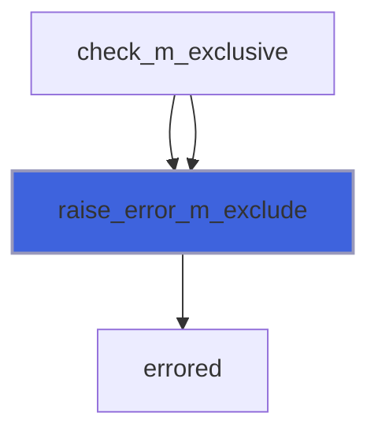
```mermaid
flowchart TD
  check_m_exclusive["check_m_exclusive"] --> raise_error_m_exclude["raise_error_m_exclude"]
  check_m_exclusive["check_m_exclusive"] --> raise_error_m_exclude["raise_error_m_exclude"]
  raise_error_m_exclude["raise_error_m_exclude"] --> errored["errored"]
  style raise_error_m_exclude fill:#3e63dd,stroke:#99b,stroke-width:2px
```

### add

Add CLA to CLAs list.

 @note If not otherwise declared the action on CLA value is set to "store" a value that must be passed after the switch name
 or directly passed in case of positional CLA.

```fortran
subroutine add(self, pref, cla)
```

**Arguments**

| Name | Type | Intent | Attributes | Description |
|------|------|--------|------------|-------------|
| `self` | class([command_line_arguments_group](/api/src/lib/flap_command_line_arguments_group_t#command-line-arguments-group)) | inout |  | CLAsG data. |
| `pref` | character(len=*) | in | optional | Prefixing string. |
| `cla` | type([command_line_argument](/api/src/lib/flap_command_line_argument_t#command-line-argument)) | in |  | CLA data. |

**Call graph**

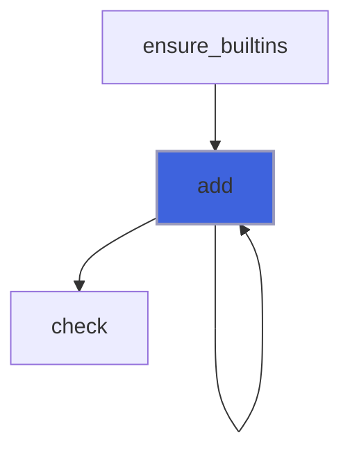
```mermaid
flowchart TD
  add["add"] --> add["add"]
  ensure_builtins["ensure_builtins"] --> add["add"]
  add["add"] --> check["check"]
  style add fill:#3e63dd,stroke:#99b,stroke-width:2px
```

### parse

Parse CLAsG arguments.

```fortran
subroutine parse(self, args, ignore_unknown_clas, pref, error_unknown_clas, ignore_env)
```

**Arguments**

| Name | Type | Intent | Attributes | Description |
|------|------|--------|------------|-------------|
| `self` | class([command_line_arguments_group](/api/src/lib/flap_command_line_arguments_group_t#command-line-arguments-group)) | inout |  | CLAsG data. |
| `args` | character(len=*) | in |  | Command line arguments. |
| `ignore_unknown_clas` | logical | in |  | Disable errors-raising for passed unknown CLAs. |
| `pref` | character(len=*) | in | optional | Prefixing string. |
| `error_unknown_clas` | integer(kind=[I4P](/api/src/third_party/PENF/src/lib/penf_global_parameters_variables)) | out |  | Error flag for passed unknown CLAs. |
| `ignore_env` | logical | in | optional | Turn every environment lookup off. |

**Call graph**


```mermaid
flowchart TD
  get_cla["get_cla"] --> parse["parse"]
  get_cla_list["get_cla_list"] --> parse["parse"]
  get_cla_list_varying_I1P["get_cla_list_varying_I1P"] --> parse["parse"]
  get_cla_list_varying_I2P["get_cla_list_varying_I2P"] --> parse["parse"]
  get_cla_list_varying_I4P["get_cla_list_varying_I4P"] --> parse["parse"]
  get_cla_list_varying_I8P["get_cla_list_varying_I8P"] --> parse["parse"]
  get_cla_list_varying_R16P["get_cla_list_varying_R16P"] --> parse["parse"]
  get_cla_list_varying_R4P["get_cla_list_varying_R4P"] --> parse["parse"]
  get_cla_list_varying_R8P["get_cla_list_varying_R8P"] --> parse["parse"]
  get_cla_list_varying_char["get_cla_list_varying_char"] --> parse["parse"]
  get_cla_list_varying_logical["get_cla_list_varying_logical"] --> parse["parse"]
  get_source["get_source"] --> parse["parse"]
  parse_core["parse_core"] --> parse["parse"]
  provenance["provenance"] --> parse["parse"]
  parse["parse"] --> append_value["append_value"]
  parse["parse"] --> assign_object["assign_object"]
  parse["parse"] --> count_occurrences["count_occurrences"]
  parse["parse"] --> cton["cton"]
  parse["parse"] --> is_repeatable["is_repeatable"]
  parse["parse"] --> is_switch_like["is_switch_like"]
  parse["parse"] --> is_switch_token["is_switch_token"]
  parse["parse"] --> list_push["list_push"]
  parse["parse"] --> match_compact_count["match_compact_count"]
  parse["parse"] --> match_inline_token["match_inline_token"]
  parse["parse"] --> n_next_undef_args["n_next_undef_args"]
  parse["parse"] --> positional_index["positional_index"]
  parse["parse"] --> raise_error_duplicated_clas["raise_error_duplicated_clas"]
  parse["parse"] --> raise_error_nargs_insufficient["raise_error_nargs_insufficient"]
  parse["parse"] --> raise_error_switch_unknown["raise_error_switch_unknown"]
  parse["parse"] --> raise_error_value_missing["raise_error_value_missing"]
  parse["parse"] --> read_env["read_env"]
  parse["parse"] --> sanitize_defaults["sanitize_defaults"]
  parse["parse"] --> set_inline_value["set_inline_value"]
  style parse fill:#3e63dd,stroke:#99b,stroke-width:2px
```

### errored

Trig error occurrence and print meaningful message.

```fortran
subroutine errored(self, error, pref, a1, a2, position, members, reason)
```

**Arguments**

| Name | Type | Intent | Attributes | Description |
|------|------|--------|------------|-------------|
| `self` | class([command_line_arguments_group](/api/src/lib/flap_command_line_arguments_group_t#command-line-arguments-group)) | inout |  | CLAsG data. |
| `error` | integer(kind=[I4P](/api/src/third_party/PENF/src/lib/penf_global_parameters_variables)) | in |  | Error occurred. |
| `pref` | character(len=*) | in | optional | Prefixing string. |
| `a1` | integer(kind=[I4P](/api/src/third_party/PENF/src/lib/penf_global_parameters_variables)) | in | optional | First index CLAs group inconsistent. |
| `a2` | integer(kind=[I4P](/api/src/third_party/PENF/src/lib/penf_global_parameters_variables)) | in | optional | Second index CLAs group inconsistent. |
| `position` | integer(kind=[I4P](/api/src/third_party/PENF/src/lib/penf_global_parameters_variables)) | in | optional | Position of positional CLAs. |
| `members` | character(len=*) | in | optional | Members of a mutually exclusive set. |
| `reason` | character(len=*) | in | optional | Why a mutually exclusive set is invalid. |

**Call graph**


```mermaid
flowchart TD
  add_exclusive_set["add_exclusive_set"] --> errored["errored"]
  check["check"] --> errored["errored"]
  check["check"] --> errored["errored"]
  check_action_consistency["check_action_consistency"] --> errored["errored"]
  check_alternate_consistency["check_alternate_consistency"] --> errored["errored"]
  check_append_consistency["check_append_consistency"] --> errored["errored"]
  check_choices["check_choices"] --> errored["errored"]
  check_count_consistency["check_count_consistency"] --> errored["errored"]
  check_def_nargs_consistency["check_def_nargs_consistency"] --> errored["errored"]
  check_envvar_consistency["check_envvar_consistency"] --> errored["errored"]
  check_exclusive_sets["check_exclusive_sets"] --> errored["errored"]
  check_list_size["check_list_size"] --> errored["errored"]
  check_m_exclude_consistency["check_m_exclude_consistency"] --> errored["errored"]
  check_named_consistency["check_named_consistency"] --> errored["errored"]
  check_optional_consistency["check_optional_consistency"] --> errored["errored"]
  check_path_consistency["check_path_consistency"] --> errored["errored"]
  check_paths["check_paths"] --> errored["errored"]
  check_position_gaps["check_position_gaps"] --> errored["errored"]
  check_positional_consistency["check_positional_consistency"] --> errored["errored"]
  check_range["check_range"] --> errored["errored"]
  check_range_consistency["check_range_consistency"] --> errored["errored"]
  get_args_from_invocation["get_args_from_invocation"] --> errored["errored"]
  get_cla["get_cla"] --> errored["errored"]
  get_cla["get_cla"] --> errored["errored"]
  get_cla_from_buffer["get_cla_from_buffer"] --> errored["errored"]
  get_cla_list["get_cla_list"] --> errored["errored"]
  get_cla_list["get_cla_list"] --> errored["errored"]
  get_cla_list_from_buffer["get_cla_list_from_buffer"] --> errored["errored"]
  get_cla_list_varying_I1P["get_cla_list_varying_I1P"] --> errored["errored"]
  get_cla_list_varying_I1P["get_cla_list_varying_I1P"] --> errored["errored"]
  get_cla_list_varying_I2P["get_cla_list_varying_I2P"] --> errored["errored"]
  get_cla_list_varying_I2P["get_cla_list_varying_I2P"] --> errored["errored"]
  get_cla_list_varying_I4P["get_cla_list_varying_I4P"] --> errored["errored"]
  get_cla_list_varying_I4P["get_cla_list_varying_I4P"] --> errored["errored"]
  get_cla_list_varying_I8P["get_cla_list_varying_I8P"] --> errored["errored"]
  get_cla_list_varying_I8P["get_cla_list_varying_I8P"] --> errored["errored"]
  get_cla_list_varying_R16P["get_cla_list_varying_R16P"] --> errored["errored"]
  get_cla_list_varying_R16P["get_cla_list_varying_R16P"] --> errored["errored"]
  get_cla_list_varying_R4P["get_cla_list_varying_R4P"] --> errored["errored"]
  get_cla_list_varying_R4P["get_cla_list_varying_R4P"] --> errored["errored"]
  get_cla_list_varying_R8P["get_cla_list_varying_R8P"] --> errored["errored"]
  get_cla_list_varying_R8P["get_cla_list_varying_R8P"] --> errored["errored"]
  get_cla_list_varying_char["get_cla_list_varying_char"] --> errored["errored"]
  get_cla_list_varying_char["get_cla_list_varying_char"] --> errored["errored"]
  get_cla_list_varying_logical["get_cla_list_varying_logical"] --> errored["errored"]
  get_cla_list_varying_logical["get_cla_list_varying_logical"] --> errored["errored"]
  get_source["get_source"] --> errored["errored"]
  is_required_passed["is_required_passed"] --> errored["errored"]
  is_required_val_passed["is_required_val_passed"] --> errored["errored"]
  raise_error_duplicated_clas["raise_error_duplicated_clas"] --> errored["errored"]
  raise_error_m_exclude["raise_error_m_exclude"] --> errored["errored"]
  raise_error_m_exclude["raise_error_m_exclude"] --> errored["errored"]
  raise_error_nargs_insufficient["raise_error_nargs_insufficient"] --> errored["errored"]
  raise_error_switch_unknown["raise_error_switch_unknown"] --> errored["errored"]
  raise_error_value_missing["raise_error_value_missing"] --> errored["errored"]
  set_inline_value["set_inline_value"] --> errored["errored"]
  set_source_value["set_source_value"] --> errored["errored"]
  errored["errored"] --> error_prefix["error_prefix"]
  errored["errored"] --> print_error_message["print_error_message"]
  errored["errored"] --> str["str"]
  style errored fill:#3e63dd,stroke:#99b,stroke-width:2px
```

### check_m_exclusive

Check if two mutually exclusive CLAs have been passed.

```fortran
subroutine check_m_exclusive(self, pref)
```

**Arguments**

| Name | Type | Intent | Attributes | Description |
|------|------|--------|------------|-------------|
| `self` | class([command_line_arguments_group](/api/src/lib/flap_command_line_arguments_group_t#command-line-arguments-group)) | inout |  | CLAsG data. |
| `pref` | character(len=*) | in | optional | Prefixing string. |

**Call graph**

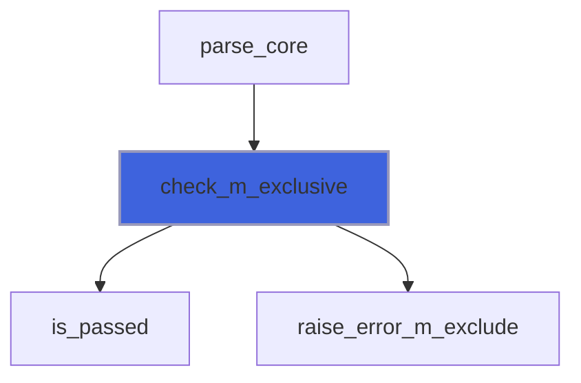
```mermaid
flowchart TD
  parse_core["parse_core"] --> check_m_exclusive["check_m_exclusive"]
  check_m_exclusive["check_m_exclusive"] --> is_passed["is_passed"]
  check_m_exclusive["check_m_exclusive"] --> raise_error_m_exclude["raise_error_m_exclude"]
  style check_m_exclusive fill:#3e63dd,stroke:#99b,stroke-width:2px
```

### sanitize_defaults

Sanitize defaults values.

 It is necessary to *sanitize* the default values of non-passed, optional CLAs.

```fortran
subroutine sanitize_defaults(self)
```

**Arguments**

| Name | Type | Intent | Attributes | Description |
|------|------|--------|------------|-------------|
| `self` | class([command_line_arguments_group](/api/src/lib/flap_command_line_arguments_group_t#command-line-arguments-group)) | inout |  | CLAsG data. |

**Call graph**

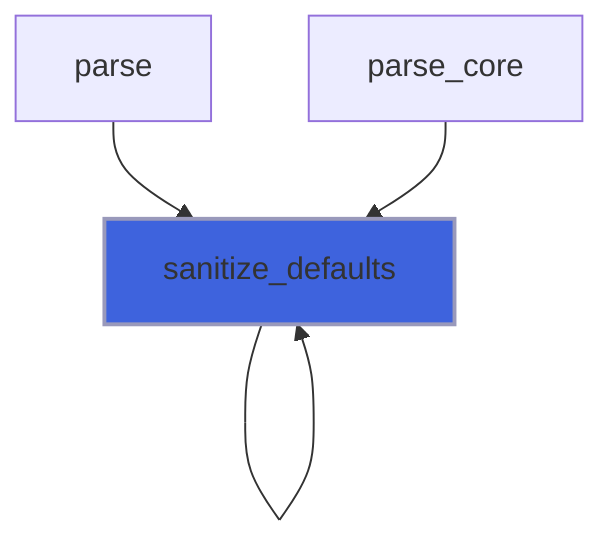
```mermaid
flowchart TD
  parse["parse"] --> sanitize_defaults["sanitize_defaults"]
  parse_core["parse_core"] --> sanitize_defaults["sanitize_defaults"]
  sanitize_defaults["sanitize_defaults"] --> sanitize_defaults["sanitize_defaults"]
  sanitize_defaults["sanitize_defaults"] --> sanitize_defaults["sanitize_defaults"]
  style sanitize_defaults fill:#3e63dd,stroke:#99b,stroke-width:2px
```

### finalize

Free dynamic memory when finalizing.

**Attributes**: elemental

```fortran
subroutine finalize(self)
```

**Arguments**

| Name | Type | Intent | Attributes | Description |
|------|------|--------|------------|-------------|
| `self` | type([command_line_arguments_group](/api/src/lib/flap_command_line_arguments_group_t#command-line-arguments-group)) | inout |  | CLAsG data. |

## Functions

### is_passed

Check if a CLA has been passed.

**Attributes**: pure

**Returns**: `logical`

```fortran
function is_passed(self, switch, position)
```

**Arguments**

| Name | Type | Intent | Attributes | Description |
|------|------|--------|------------|-------------|
| `self` | class([command_line_arguments_group](/api/src/lib/flap_command_line_arguments_group_t#command-line-arguments-group)) | in |  | CLAsG data. |
| `switch` | character(len=*) | in | optional | Switch name. |
| `position` | integer(kind=[I4P](/api/src/third_party/PENF/src/lib/penf_global_parameters_variables)) | in | optional | Position of positional CLA. |

**Call graph**

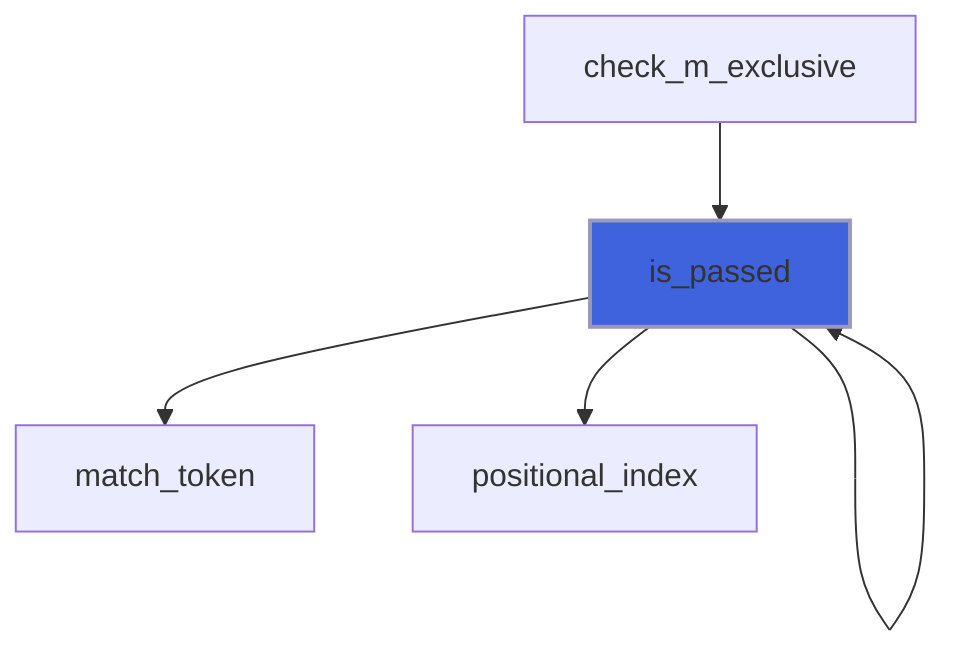
```mermaid
flowchart TD
  check_m_exclusive["check_m_exclusive"] --> is_passed["is_passed"]
  is_passed["is_passed"] --> is_passed["is_passed"]
  is_passed["is_passed"] --> match_token["match_token"]
  is_passed["is_passed"] --> positional_index["positional_index"]
  style is_passed fill:#3e63dd,stroke:#99b,stroke-width:2px
```

### positional_index

Return the index of the positional CLA declared at a position, 0 if there is none.

 Positionals are looked up by their declared position, never by their index in the CLA list.

**Attributes**: pure

**Returns**: integer(kind=[I4P](/api/src/third_party/PENF/src/lib/penf_global_parameters_variables))

```fortran
function positional_index(self, position) result(a)
```

**Arguments**

| Name | Type | Intent | Attributes | Description |
|------|------|--------|------------|-------------|
| `self` | class([command_line_arguments_group](/api/src/lib/flap_command_line_arguments_group_t#command-line-arguments-group)) | in |  | CLAsG data. |
| `position` | integer(kind=[I4P](/api/src/third_party/PENF/src/lib/penf_global_parameters_variables)) | in |  | Position of the positional CLA. |

**Call graph**


```mermaid
flowchart TD
  check_position_gaps["check_position_gaps"] --> positional_index["positional_index"]
  get_cla["get_cla"] --> positional_index["positional_index"]
  get_cla_list["get_cla_list"] --> positional_index["positional_index"]
  get_cla_list_varying_I1P["get_cla_list_varying_I1P"] --> positional_index["positional_index"]
  get_cla_list_varying_I2P["get_cla_list_varying_I2P"] --> positional_index["positional_index"]
  get_cla_list_varying_I4P["get_cla_list_varying_I4P"] --> positional_index["positional_index"]
  get_cla_list_varying_I8P["get_cla_list_varying_I8P"] --> positional_index["positional_index"]
  get_cla_list_varying_R16P["get_cla_list_varying_R16P"] --> positional_index["positional_index"]
  get_cla_list_varying_R4P["get_cla_list_varying_R4P"] --> positional_index["positional_index"]
  get_cla_list_varying_R8P["get_cla_list_varying_R8P"] --> positional_index["positional_index"]
  get_cla_list_varying_char["get_cla_list_varying_char"] --> positional_index["positional_index"]
  get_cla_list_varying_logical["get_cla_list_varying_logical"] --> positional_index["positional_index"]
  get_source["get_source"] --> positional_index["positional_index"]
  is_passed["is_passed"] --> positional_index["positional_index"]
  parse["parse"] --> positional_index["positional_index"]
  style positional_index fill:#3e63dd,stroke:#99b,stroke-width:2px
```

### config_key_index

Return the index of the CLA named by a configuration file key (its switch without dashes), 0 if none.

**Returns**: integer(kind=[I4P](/api/src/third_party/PENF/src/lib/penf_global_parameters_variables))

```fortran
function config_key_index(self, key) result(a)
```

**Arguments**

| Name | Type | Intent | Attributes | Description |
|------|------|--------|------------|-------------|
| `self` | class([command_line_arguments_group](/api/src/lib/flap_command_line_arguments_group_t#command-line-arguments-group)) | in |  | CLAsG data. |
| `key` | character(len=*) | in |  | Key. |

**Call graph**

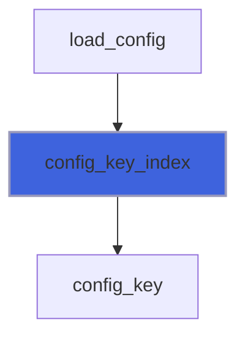
```mermaid
flowchart TD
  load_config["load_config"] --> config_key_index["config_key_index"]
  config_key_index["config_key_index"] --> config_key["config_key"]
  style config_key_index fill:#3e63dd,stroke:#99b,stroke-width:2px
```

### value_arity

Return the number of values that always follow a switch of this group, 0 if not fixed or not a switch.

 Fixed: `store` with a required value (1) or with an integer `nargs` (N). Not fixed: flags, optional values, environment
 variables and variadic lists (`nargs='+'/'*'`), whose extent is decided while parsing.

**Returns**: integer(kind=[I4P](/api/src/third_party/PENF/src/lib/penf_global_parameters_variables))

```fortran
function value_arity(self, switch) result(n)
```

**Arguments**

| Name | Type | Intent | Attributes | Description |
|------|------|--------|------------|-------------|
| `self` | class([command_line_arguments_group](/api/src/lib/flap_command_line_arguments_group_t#command-line-arguments-group)) | in |  | CLAsG data. |
| `switch` | character(len=*) | in |  | Command line argument, maybe a switch. |

**Call graph**

```mermaid
flowchart TD
  get_clasg_indexes["get_clasg_indexes"] --> value_arity["value_arity"]
  value_arity["value_arity"] --> match_token["match_token"]
  style value_arity fill:#3e63dd,stroke:#99b,stroke-width:2px
```

### is_defined

Check if a CLA has been defined.

**Returns**: `logical`

```fortran
function is_defined(self, switch, pos)
```

**Arguments**

| Name | Type | Intent | Attributes | Description |
|------|------|--------|------------|-------------|
| `self` | class([command_line_arguments_group](/api/src/lib/flap_command_line_arguments_group_t#command-line-arguments-group)) | in |  | CLAsG data. |
| `switch` | character(len=*) | in |  | Switch name. |
| `pos` | integer(kind=[I4P](/api/src/third_party/PENF/src/lib/penf_global_parameters_variables)) | out | optional | CLA position. |

**Call graph**

```mermaid
flowchart TD
  add_exclusive_set["add_exclusive_set"] --> is_defined["is_defined"]
  builtins_missing["builtins_missing"] --> is_defined["is_defined"]
  check["check"] --> is_defined["is_defined"]
  check_exclusive_sets["check_exclusive_sets"] --> is_defined["is_defined"]
  ensure_builtins["ensure_builtins"] --> is_defined["is_defined"]
  exclusive_set_signature["exclusive_set_signature"] --> is_defined["is_defined"]
  get_cla["get_cla"] --> is_defined["is_defined"]
  get_cla_list["get_cla_list"] --> is_defined["is_defined"]
  get_cla_list_varying_I1P["get_cla_list_varying_I1P"] --> is_defined["is_defined"]
  get_cla_list_varying_I2P["get_cla_list_varying_I2P"] --> is_defined["is_defined"]
  get_cla_list_varying_I4P["get_cla_list_varying_I4P"] --> is_defined["is_defined"]
  get_cla_list_varying_I8P["get_cla_list_varying_I8P"] --> is_defined["is_defined"]
  get_cla_list_varying_R16P["get_cla_list_varying_R16P"] --> is_defined["is_defined"]
  get_cla_list_varying_R4P["get_cla_list_varying_R4P"] --> is_defined["is_defined"]
  get_cla_list_varying_R8P["get_cla_list_varying_R8P"] --> is_defined["is_defined"]
  get_cla_list_varying_char["get_cla_list_varying_char"] --> is_defined["is_defined"]
  get_cla_list_varying_logical["get_cla_list_varying_logical"] --> is_defined["is_defined"]
  get_source["get_source"] --> is_defined["is_defined"]
  is_defined["is_defined"] --> is_defined["is_defined"]
  is_defined["is_defined"] --> match_token["match_token"]
  style is_defined fill:#3e63dd,stroke:#99b,stroke-width:2px
```

### is_action_passed

Check if a CLA with an action (e.g. print help) has been passed.

**Attributes**: pure

**Returns**: `logical`

```fortran
function is_action_passed(self, act) result(passed)
```

**Arguments**

| Name | Type | Intent | Attributes | Description |
|------|------|--------|------------|-------------|
| `self` | class([command_line_arguments_group](/api/src/lib/flap_command_line_arguments_group_t#command-line-arguments-group)) | in |  | CLAsG data. |
| `act` | character(len=*) | in |  | Action. |

**Call graph**

```mermaid
flowchart TD
  dispatch_status["dispatch_status"] --> is_action_passed["is_action_passed"]
  parse_core["parse_core"] --> is_action_passed["is_action_passed"]
  style is_action_passed fill:#3e63dd,stroke:#99b,stroke-width:2px
```

### is_switch_token

Check if a command line token names a CLA of the group, also as NAME=VALUE: the look-ahead test of the parser.

**Attributes**: pure

**Returns**: `logical`

```fortran
function is_switch_token(self, token)
```

**Arguments**

| Name | Type | Intent | Attributes | Description |
|------|------|--------|------------|-------------|
| `self` | class([command_line_arguments_group](/api/src/lib/flap_command_line_arguments_group_t#command-line-arguments-group)) | in |  | CLAsG data. |
| `token` | character(len=*) | in |  | Command line token. |

**Call graph**

```mermaid
flowchart TD
  parse["parse"] --> is_switch_token["is_switch_token"]
  is_switch_token["is_switch_token"] --> match_compact_count["match_compact_count"]
  is_switch_token["is_switch_token"] --> match_inline_token["match_inline_token"]
  style is_switch_token fill:#3e63dd,stroke:#99b,stroke-width:2px
```

### usage

Get correct CLAsG usage.

**Returns**: `character(len=:)`

```fortran
function usage(self, pref, no_header, markdown)
```

**Arguments**

| Name | Type | Intent | Attributes | Description |
|------|------|--------|------------|-------------|
| `self` | class([command_line_arguments_group](/api/src/lib/flap_command_line_arguments_group_t#command-line-arguments-group)) | in |  | CLAsG data. |
| `pref` | character(len=*) | in | optional | Prefixing string. |
| `no_header` | logical | in | optional | Avoid insert header to usage. |
| `markdown` | logical | in | optional | Format things form markdown. |

**Call graph**

```mermaid
flowchart TD
  check_exclusive_sets["check_exclusive_sets"] --> usage["usage"]
  dispatch_status["dispatch_status"] --> usage["usage"]
  is_required_passed["is_required_passed"] --> usage["usage"]
  no_args_help["no_args_help"] --> usage["usage"]
  print_usage["print_usage"] --> usage["usage"]
  raise_error["raise_error"] --> usage["usage"]
  save_man_page_core["save_man_page_core"] --> usage["usage"]
  save_usage_to_markdown_core["save_usage_to_markdown_core"] --> usage["usage"]
  usage["usage"] --> usage["usage"]
  usage_core["usage_core"] --> usage["usage"]
  usage["usage"] --> signature["signature"]
  usage["usage"] --> usage["usage"]
  style usage fill:#3e63dd,stroke:#99b,stroke-width:2px
```

### signature

Get CLAsG signature: the usage text, or the bash completion (a COMPREPLY line with the switches, then the value tests).

**Returns**: `character(len=:)`

```fortran
function signature(self, bash_completion, plain)
```

**Arguments**

| Name | Type | Intent | Attributes | Description |
|------|------|--------|------------|-------------|
| `self` | class([command_line_arguments_group](/api/src/lib/flap_command_line_arguments_group_t#command-line-arguments-group)) | in |  | CLAsG data. |
| `bash_completion` | logical | in | optional | Return the signature for bash completion. |
| `plain` | logical | in | optional | Return the value tests as plain switches lists. |

**Call graph**

```mermaid
flowchart TD
  save_bash_completion_core["save_bash_completion_core"] --> signature["signature"]
  save_man_page_core["save_man_page_core"] --> signature["signature"]
  save_usage_to_markdown_core["save_usage_to_markdown_core"] --> signature["signature"]
  signature_core["signature_core"] --> signature["signature"]
  usage["usage"] --> signature["signature"]
  usage_core["usage_core"] --> signature["signature"]
  signature["signature"] --> completion_values["completion_values"]
  signature["signature"] --> completion_words["completion_words"]
  signature["signature"] --> exclusive_set_of["exclusive_set_of"]
  signature["signature"] --> exclusive_set_signature["exclusive_set_signature"]
  signature["signature"] --> first_member["first_member"]
  signature["signature"] --> signature_usage["signature_usage"]
  style signature fill:#3e63dd,stroke:#99b,stroke-width:2px
```

### exclusive_set_of

Return the index of the mutually exclusive set of a CLA, 0 if it is in none.

**Attributes**: pure

**Returns**: integer(kind=[I4P](/api/src/third_party/PENF/src/lib/penf_global_parameters_variables))

```fortran
function exclusive_set_of(self, a) result(s)
```

**Arguments**

| Name | Type | Intent | Attributes | Description |
|------|------|--------|------------|-------------|
| `self` | class([command_line_arguments_group](/api/src/lib/flap_command_line_arguments_group_t#command-line-arguments-group)) | in |  | CLAsG data. |
| `a` | integer(kind=[I4P](/api/src/third_party/PENF/src/lib/penf_global_parameters_variables)) | in |  | Index of the CLA. |

**Call graph**

```mermaid
flowchart TD
  add_exclusive_set["add_exclusive_set"] --> exclusive_set_of["exclusive_set_of"]
  signature["signature"] --> exclusive_set_of["exclusive_set_of"]
  exclusive_set_of["exclusive_set_of"] --> list_items["list_items"]
  exclusive_set_of["exclusive_set_of"] --> match_token["match_token"]
  style exclusive_set_of fill:#3e63dd,stroke:#99b,stroke-width:2px
```

### exclusive_set_signature

Return the usage signature of a mutually exclusive set, docopt style: (a | b) if required, [a | b] otherwise.

**Returns**: `character(len=:)`

```fortran
function exclusive_set_signature(self, s) result(signature)
```

**Arguments**

| Name | Type | Intent | Attributes | Description |
|------|------|--------|------------|-------------|
| `self` | class([command_line_arguments_group](/api/src/lib/flap_command_line_arguments_group_t#command-line-arguments-group)) | in |  | CLAsG data. |
| `s` | integer(kind=[I4P](/api/src/third_party/PENF/src/lib/penf_global_parameters_variables)) | in |  | Index of the set. |

**Call graph**

```mermaid
flowchart TD
  signature["signature"] --> exclusive_set_signature["exclusive_set_signature"]
  exclusive_set_signature["exclusive_set_signature"] --> is_defined["is_defined"]
  exclusive_set_signature["exclusive_set_signature"] --> list_items["list_items"]
  exclusive_set_signature["exclusive_set_signature"] --> signature_usage["signature_usage"]
  style exclusive_set_signature fill:#3e63dd,stroke:#99b,stroke-width:2px
```
