# flap_command_line_interface_t

> Command Line Interface (CLI) class.

**Source**: `src/lib/flap_command_line_interface_t.F90`

**Dependencies**

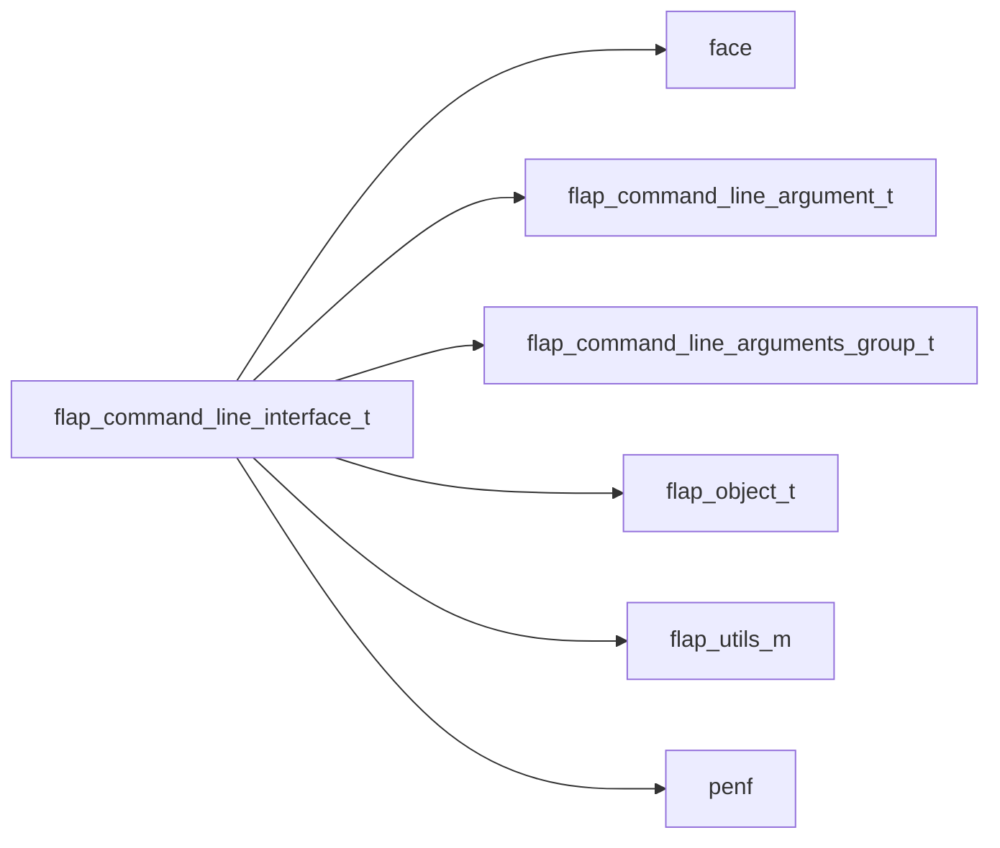

## Contents

- [command_line_interface](#command-line-interface)
- [free](#free)
- [init](#init)
- [add_group](#add-group)
- [set_mutually_exclusive_groups](#set-mutually-exclusive-groups)
- [add](#add)
- [check](#check)
- [check_m_exclusive](#check-m-exclusive)
- [parse](#parse)
- [get_clasg_indexes](#get-clasg-indexes)
- [get_args_from_string](#get-args-from-string)
- [get_args_from_invocation](#get-args-from-invocation)
- [get_cla](#get-cla)
- [get_cla_list](#get-cla-list)
- [get_cla_list_varying_R16P](#get-cla-list-varying-r16p)
- [get_cla_list_varying_R8P](#get-cla-list-varying-r8p)
- [get_cla_list_varying_R4P](#get-cla-list-varying-r4p)
- [get_cla_list_varying_I8P](#get-cla-list-varying-i8p)
- [get_cla_list_varying_I4P](#get-cla-list-varying-i4p)
- [get_cla_list_varying_I2P](#get-cla-list-varying-i2p)
- [get_cla_list_varying_I1P](#get-cla-list-varying-i1p)
- [get_cla_list_varying_logical](#get-cla-list-varying-logical)
- [get_cla_list_varying_char](#get-cla-list-varying-char)
- [print_usage](#print-usage)
- [save_bash_completion](#save-bash-completion)
- [save_man_page](#save-man-page)
- [save_usage_to_markdown](#save-usage-to-markdown)
- [errored](#errored)
- [cli_assign_cli](#cli-assign-cli)
- [finalize](#finalize)
- [is_passed](#is-passed)
- [is_defined_group](#is-defined-group)
- [is_called_group](#is-called-group)
- [is_defined](#is-defined)
- [is_parsed](#is-parsed)
- [usage](#usage)
- [signature](#signature)

## Variables

| Name | Type | Attributes | Description |
|------|------|------------|-------------|
| `MAX_VAL_LEN` | integer(kind=[I4P](/api/src/third_party/PENF/src/lib/penf_global_parameters_variables)) | parameter | Maximum number of characters of CLA value. |
| `ERROR_MISSING_CLA` | integer(kind=[I4P](/api/src/third_party/PENF/src/lib/penf_global_parameters_variables)) | parameter | CLA not found in CLI. |
| `ERROR_MISSING_GROUP` | integer(kind=[I4P](/api/src/third_party/PENF/src/lib/penf_global_parameters_variables)) | parameter | Group not found in CLI. |
| `ERROR_MISSING_SELECTION_CLA` | integer(kind=[I4P](/api/src/third_party/PENF/src/lib/penf_global_parameters_variables)) | parameter | CLA selection in CLI failing. |
| `ERROR_TOO_FEW_CLAS` | integer(kind=[I4P](/api/src/third_party/PENF/src/lib/penf_global_parameters_variables)) | parameter | Insufficient arguments for CLI. |
| `ERROR_UNKNOWN_CLAS_IGNORED` | integer(kind=[I4P](/api/src/third_party/PENF/src/lib/penf_global_parameters_variables)) | parameter | Unknown CLAs passed, but ignored. |

## Derived Types

### command_line_interface

Command Line Interface (CLI) class.

**Inheritance**

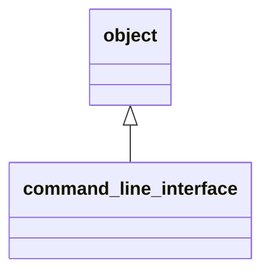

**Extends**: [`object`](/api/src/lib/flap_object_t#object)

#### Components

| Name | Type | Attributes | Description |
|------|------|------------|-------------|
| `progname` | character(len=:) | allocatable | Program name. |
| `version` | character(len=:) | allocatable | Program version. |
| `help` | character(len=:) | allocatable | Help message. |
| `help_color` | character(len=:) | allocatable | ANSI color of help messages. |
| `help_style` | character(len=:) | allocatable | ANSI style of help messages. |
| `help_markdown` | character(len=:) | allocatable | Longer help message, markdown formatted. |
| `description` | character(len=:) | allocatable | Detailed description. |
| `license` | character(len=:) | allocatable | License description. |
| `authors` | character(len=:) | allocatable | Authors list. |
| `epilog` | character(len=:) | allocatable | Epilogue message. |
| `m_exclude` | character(len=:) | allocatable | Mutually exclude other CLA(s group). |
| `error_message` | character(len=:) | allocatable | Meaningful error message to standard-error. |
| `error_color` | character(len=:) | allocatable | ANSI color of error messages. |
| `error_style` | character(len=:) | allocatable | ANSI style of error messages. |
| `examples` | character(len=512) | allocatable | Examples of correct usage. |
| `error` | integer(kind=[I4P](/api/src/third_party/PENF/src/lib/penf_global_parameters_variables)) |  | Error trapping flag. |
| `usage_lun` | integer(kind=[I4P](/api/src/third_party/PENF/src/lib/penf_global_parameters_variables)) |  | Output unit to print help/usage messages |
| `version_lun` | integer(kind=[I4P](/api/src/third_party/PENF/src/lib/penf_global_parameters_variables)) |  | Output unit to print version message |
| `error_lun` | integer(kind=[I4P](/api/src/third_party/PENF/src/lib/penf_global_parameters_variables)) |  | Error unit to print error messages |
| `clasg` | type([command_line_arguments_group](/api/src/lib/flap_command_line_arguments_group_t#command-line-arguments-group)) | allocatable | CLA list [1:Na]. |
| `args` | character(len=512) | allocatable | Actually passed command line arguments. |
| `disable_hv` | logical |  | Disable automatic 'help' and 'version' CLAs. |
| `is_parsed_` | logical |  | Parse status. |
| `ignore_unknown_clas` | logical |  | Disable errors-raising for passed unknown CLAs. |
| `error_unknown_clas` | integer(kind=[I4P](/api/src/third_party/PENF/src/lib/penf_global_parameters_variables)) |  | Error trapping flag for unknown CLAs. |

#### Type-Bound Procedures

| Name | Attributes | Description |
|------|------------|-------------|
| `free_object` | pass(self) | Free dynamic memory. |
| `print_version` | pass(self) | Print version. |
| `print_error_message` | pass(self) | Print meaningful error message. |
| `set_examples` | pass(self) | Set examples of correct usage. |
| `assign_object` | pass(lhs ) | Assignment overloading. |
| `free` |  | Free dynamic memory. |
| `init` |  | Initialize CLI. |
| `add_group` |  | Add CLAs group CLI. |
| `add` |  | Add CLA to CLI. |
| `is_passed` |  | Check if a CLA has been passed. |
| `is_defined_group` |  | Check if a CLAs group has been defined. |
| `is_defined` |  | Check if a CLA has been defined. |
| `is_parsed` |  | Check if CLI has been parsed. |
| `set_mutually_exclusive_groups` |  | Set two CLAs group as mutually exclusive. |
| `run_command` |  | Check if a CLAs group has been run. |
| `parse` |  | Parse Command Line Interfaces. |
| `get` |  | Get CLA value(s) from CLAs list parsed. |
| `get_varying` |  | Get CLA value(s) from CLAs list parsed, varying size list. |
| `usage` |  | Get CLI usage. |
| `signature` |  | Get CLI signature. |
| `print_usage` |  | Print correct usage of CLI. |
| `save_bash_completion` |  | Save bash completion script (for named CLAs only). |
| `save_man_page` |  | Save CLI usage as man page. |
| `save_usage_to_markdown` |  | Save CLI usage as markdown. |
| `errored` |  | Trig error occurence and print meaningful message. |
| `check` |  | Check data consistency. |
| `check_m_exclusive` |  | Check if two mutually exclusive CLAs group have been called. |
| `get_clasg_indexes` |  | Get CLAs groups indexes. |
| `get_args` |  | Get CLAs. |
| `get_args_from_string` |  | Get CLAs from string. |
| `get_args_from_invocation` |  | Get CLAs from CLI invocation. |
| `get_cla` |  | Get CLA (single) value from CLAs list parsed. |
| `get_cla_list` |  | Get CLA multiple values from CLAs list parsed. |
| `get_cla_list_varying_R16P` |  | Get CLA multiple values from CLAs list parsed, varying size, R16P. |
| `get_cla_list_varying_R8P` |  | Get CLA multiple values from CLAs list parsed, varying size, R8P. |
| `get_cla_list_varying_R4P` |  | Get CLA multiple values from CLAs list parsed, varying size, R4P. |
| `get_cla_list_varying_I8P` |  | Get CLA multiple values from CLAs list parsed, varying size, I8P. |
| `get_cla_list_varying_I4P` |  | Get CLA multiple values from CLAs list parsed, varying size, I4P. |
| `get_cla_list_varying_I2P` |  | Get CLA multiple values from CLAs list parsed, varying size, I2P. |
| `get_cla_list_varying_I1P` |  | Get CLA multiple values from CLAs list parsed, varying size, I1P. |
| `get_cla_list_varying_logical` |  | Get CLA multiple values from CLAs list parsed, varying size, bool. |
| `get_cla_list_varying_char` |  | Get CLA multiple values from CLAs list parsed, varying size, char. |
| `cli_assign_cli` |  | CLI assignment overloading. |
| `assignment(=)` |  | CLI assignment overloading. |

## Subroutines

### free

Free dynamic memory.

**Attributes**: elemental

```fortran
subroutine free(self)
```

**Arguments**

| Name | Type | Intent | Attributes | Description |
|------|------|--------|------------|-------------|
| `self` | class([command_line_interface](/api/src/lib/flap_command_line_interface_t#command-line-interface)) | inout |  | CLI data. |

**Call graph**

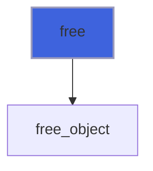

### init

Initialize CLI.

```fortran
subroutine init(self, progname, version, help, description, license, authors, examples, epilog, disable_hv, usage_lun, error_lun, version_lun, error_color, error_style, ignore_unknown_clas)
```

**Arguments**

| Name | Type | Intent | Attributes | Description |
|------|------|--------|------------|-------------|
| `self` | class([command_line_interface](/api/src/lib/flap_command_line_interface_t#command-line-interface)) | inout |  | CLI data. |
| `progname` | character(len=*) | in | optional | Program name. |
| `version` | character(len=*) | in | optional | Program version. |
| `help` | character(len=*) | in | optional | Help message introducing the CLI usage. |
| `description` | character(len=*) | in | optional | Detailed description message introducing the program. |
| `license` | character(len=*) | in | optional | License description. |
| `authors` | character(len=*) | in | optional | Authors list. |
| `examples` | character(len=*) | in | optional | Examples of correct usage. |
| `epilog` | character(len=*) | in | optional | Epilog message. |
| `disable_hv` | logical | in | optional | Disable automatic insert of 'help' and 'version' CLAs. |
| `usage_lun` | integer(kind=[I4P](/api/src/third_party/PENF/src/lib/penf_global_parameters_variables)) | in | optional | Unit number to print usage/help. |
| `error_lun` | integer(kind=[I4P](/api/src/third_party/PENF/src/lib/penf_global_parameters_variables)) | in | optional | Unit number to print error info. |
| `version_lun` | integer(kind=[I4P](/api/src/third_party/PENF/src/lib/penf_global_parameters_variables)) | in | optional | Unit number to print version/license info. |
| `error_color` | character(len=*) | in | optional | ANSI color of error messages. |
| `error_style` | character(len=*) | in | optional | ANSI style of error messages. |
| `ignore_unknown_clas` | logical | in | optional | Disable errors-raising for passed unknown CLAs. |

**Call graph**

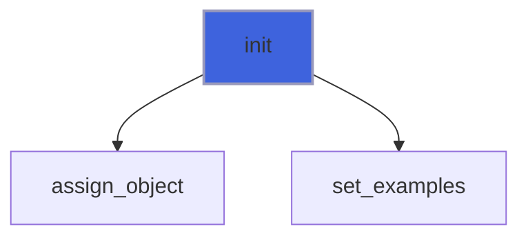

### add_group

Add CLAs group to CLI.

```fortran
subroutine add_group(self, help, description, exclude, examples, group)
```

**Arguments**

| Name | Type | Intent | Attributes | Description |
|------|------|--------|------------|-------------|
| `self` | class([command_line_interface](/api/src/lib/flap_command_line_interface_t#command-line-interface)) | inout |  | CLI data. |
| `help` | character(len=*) | in | optional | Help message. |
| `description` | character(len=*) | in | optional | Detailed description. |
| `exclude` | character(len=*) | in | optional | Group name of the mutually exclusive group. |
| `examples` | character(len=*) | in | optional | Examples of correct usage of the group. |
| `group` | character(len=*) | in |  | Name of the grouped CLAs. |

**Call graph**

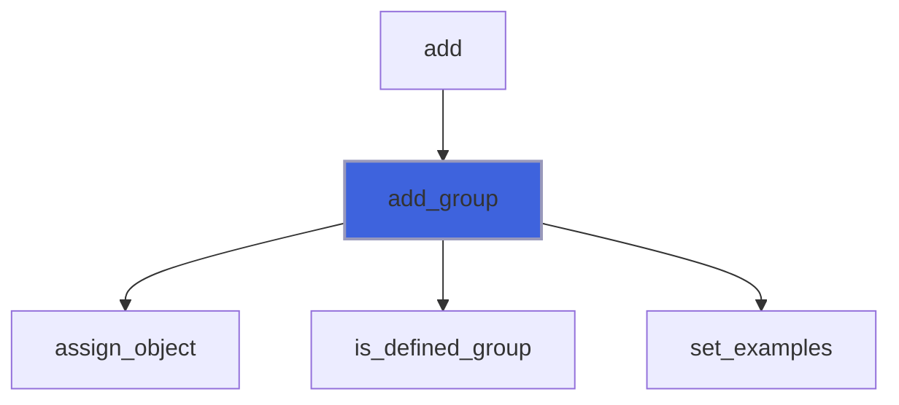

### set_mutually_exclusive_groups

Set two CLAs group ad mutually exclusive.

```fortran
subroutine set_mutually_exclusive_groups(self, group1, group2)
```

**Arguments**

| Name | Type | Intent | Attributes | Description |
|------|------|--------|------------|-------------|
| `self` | class([command_line_interface](/api/src/lib/flap_command_line_interface_t#command-line-interface)) | inout |  | CLI data. |
| `group1` | character(len=*) | in |  | Name of the first grouped CLAs. |
| `group2` | character(len=*) | in |  | Name of the second grouped CLAs. |

**Call graph**

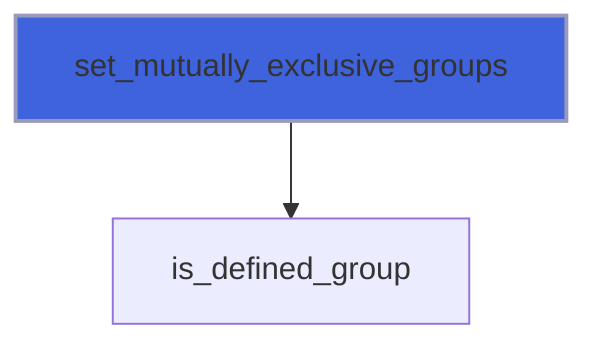

### add

Add CLA to CLI.

 @note If not otherwise declared the action on CLA value is set to "store" a value that must be passed after the switch name
 or directly passed in case of positional CLA.

 @note If not otherwise speficied the CLA belongs to the default group "zero" that is the group of non-grouped CLAs.

 @note If CLA belongs to a not yet present group it is created on the fly.

```fortran
subroutine add(self, pref, group, group_index, switch, switch_ab, help, help_markdown, help_color, help_style, required, val_required, positional, position, hidden, act, def, nargs, choices, exclude, envvar, error)
```

**Arguments**

| Name | Type | Intent | Attributes | Description |
|------|------|--------|------------|-------------|
| `self` | class([command_line_interface](/api/src/lib/flap_command_line_interface_t#command-line-interface)) | inout |  | CLI data. |
| `pref` | character(len=*) | in | optional | Prefixing string. |
| `group` | character(len=*) | in | optional | Name of the grouped CLAs. |
| `group_index` | integer(kind=[I4P](/api/src/third_party/PENF/src/lib/penf_global_parameters_variables)) | in | optional | Index of the grouped CLAs. |
| `switch` | character(len=*) | in | optional | Switch name. |
| `switch_ab` | character(len=*) | in | optional | Abbreviated switch name. |
| `help` | character(len=*) | in | optional | Help message describing the CLA. |
| `help_markdown` | character(len=*) | in | optional | Longer help message, markdown formatted. |
| `help_color` | character(len=*) | in | optional | ANSI color of help messages. |
| `help_style` | character(len=*) | in | optional | ANSI style of help messages. |
| `required` | logical | in | optional | Flag for set required argument. |
| `val_required` | logical | in | optional | Flag for set value required for optional argument. |
| `positional` | logical | in | optional | Flag for checking if CLA is a positional or a named CLA. |
| `position` | integer(kind=[I4P](/api/src/third_party/PENF/src/lib/penf_global_parameters_variables)) | in | optional | Position of positional CLA. |
| `hidden` | logical | in | optional | Flag for hiding CLA, thus it does not compare into help. |
| `act` | character(len=*) | in | optional | CLA value action. |
| `def` | character(len=*) | in | optional | Default value. |
| `nargs` | character(len=*) | in | optional | Number of arguments consumed by CLA. |
| `choices` | character(len=*) | in | optional | List of allowable values for the argument. |
| `exclude` | character(len=*) | in | optional | Switch name of the mutually exclusive CLA. |
| `envvar` | character(len=*) | in | optional | Environment variable from which take value. |
| `error` | integer(kind=[I4P](/api/src/third_party/PENF/src/lib/penf_global_parameters_variables)) | out | optional | Error trapping flag. |

**Call graph**

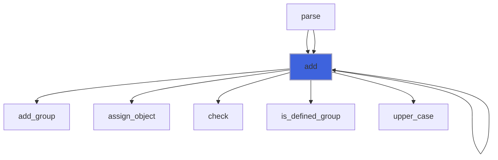

### check

Check data consistency.

```fortran
subroutine check(self, pref, error)
```

**Arguments**

| Name | Type | Intent | Attributes | Description |
|------|------|--------|------------|-------------|
| `self` | class([command_line_interface](/api/src/lib/flap_command_line_interface_t#command-line-interface)) | inout |  | CLI data. |
| `pref` | character(len=*) | in | optional | Prefixing string. |
| `error` | integer(kind=[I4P](/api/src/third_party/PENF/src/lib/penf_global_parameters_variables)) | out | optional | Error trapping flag. |

**Call graph**

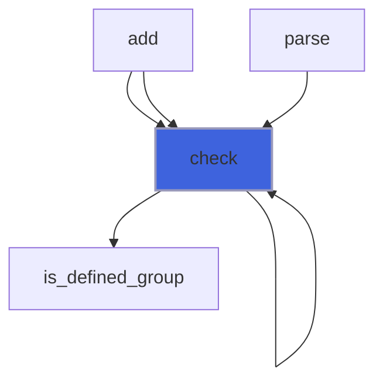

### check_m_exclusive

Check if two mutually exclusive CLAs group have been called.

```fortran
subroutine check_m_exclusive(self, pref)
```

**Arguments**

| Name | Type | Intent | Attributes | Description |
|------|------|--------|------------|-------------|
| `self` | class([command_line_interface](/api/src/lib/flap_command_line_interface_t#command-line-interface)) | inout |  | CLI data. |
| `pref` | character(len=*) | in | optional | Prefixing string. |

**Call graph**

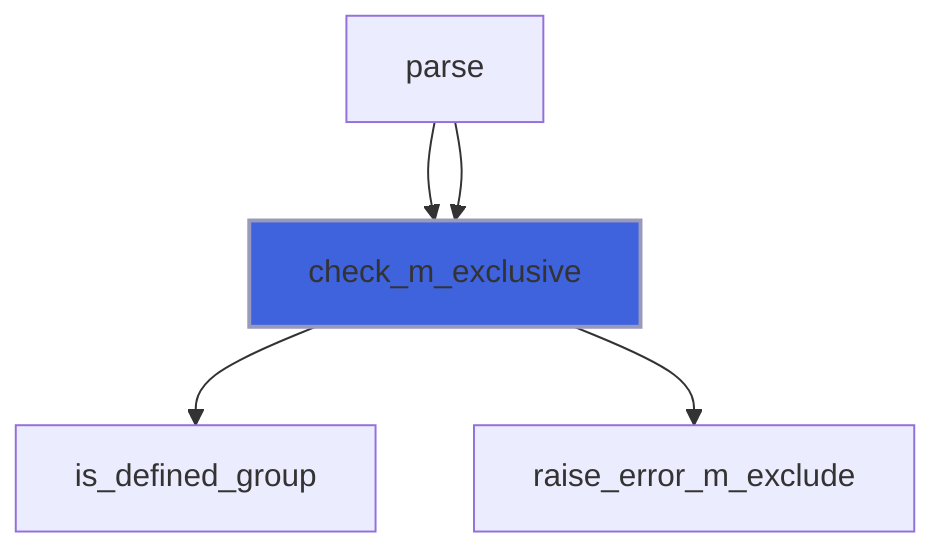

### parse

Parse Command Line Interfaces by means of a previously initialized CLAs groups list.

 @note The leading and trailing white spaces are removed from CLA values.

 @note If the *args* argument is passed the command line arguments are taken from it and not from the actual program CLI
 invocations.

```fortran
subroutine parse(self, pref, args, error)
```

**Arguments**

| Name | Type | Intent | Attributes | Description |
|------|------|--------|------------|-------------|
| `self` | class([command_line_interface](/api/src/lib/flap_command_line_interface_t#command-line-interface)) | inout |  | CLI data. |
| `pref` | character(len=*) | in | optional | Prefixing string. |
| `args` | character(len=*) | in | optional | String containing command line arguments. |
| `error` | integer(kind=[I4P](/api/src/third_party/PENF/src/lib/penf_global_parameters_variables)) | out | optional | Error trapping flag. |

**Call graph**

```mermaid
flowchart TD
  get_cla["get_cla"] --> parse["parse"]
  get_cla_list["get_cla_list"] --> parse["parse"]
  get_cla_list_varying_I1P["get_cla_list_varying_I1P"] --> parse["parse"]
  get_cla_list_varying_I2P["get_cla_list_varying_I2P"] --> parse["parse"]
  get_cla_list_varying_I4P["get_cla_list_varying_I4P"] --> parse["parse"]
  get_cla_list_varying_I8P["get_cla_list_varying_I8P"] --> parse["parse"]
  get_cla_list_varying_R16P["get_cla_list_varying_R16P"] --> parse["parse"]
  get_cla_list_varying_R4P["get_cla_list_varying_R4P"] --> parse["parse"]
  get_cla_list_varying_R8P["get_cla_list_varying_R8P"] --> parse["parse"]
  get_cla_list_varying_char["get_cla_list_varying_char"] --> parse["parse"]
  get_cla_list_varying_logical["get_cla_list_varying_logical"] --> parse["parse"]
  parse["parse"] --> parse["parse"]
  parse["parse"] --> add["add"]
  parse["parse"] --> check["check"]
  parse["parse"] --> check_m_exclusive["check_m_exclusive"]
  parse["parse"] --> get_args["get_args"]
  parse["parse"] --> is_defined["is_defined"]
  parse["parse"] --> is_required_passed["is_required_passed"]
  parse["parse"] --> parse["parse"]
  parse["parse"] --> print_version["print_version"]
  parse["parse"] --> sanitize_defaults["sanitize_defaults"]
  parse["parse"] --> save_usage_to_markdown["save_usage_to_markdown"]
  parse["parse"] --> usage["usage"]
  style parse fill:#3e63dd,stroke:#99b,stroke-width:2px
```

### get_clasg_indexes

Get the argument indexes of CLAs groups defined parsing the actual passed CLAs.

```fortran
subroutine get_clasg_indexes(self, ai)
```

**Arguments**

| Name | Type | Intent | Attributes | Description |
|------|------|--------|------------|-------------|
| `self` | class([command_line_interface](/api/src/lib/flap_command_line_interface_t#command-line-interface)) | inout |  | CLI data. |
| `ai` | integer(kind=[I4P](/api/src/third_party/PENF/src/lib/penf_global_parameters_variables)) | out | allocatable | CLAs grouped indexes. |

**Call graph**

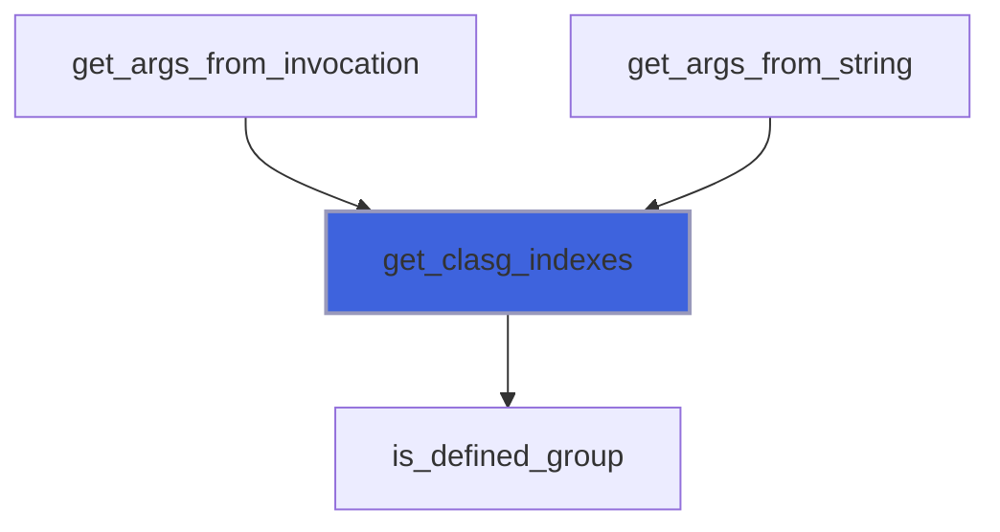

### get_args_from_string

Get CLAs from string.

```fortran
subroutine get_args_from_string(self, args, ai)
```

**Arguments**

| Name | Type | Intent | Attributes | Description |
|------|------|--------|------------|-------------|
| `self` | class([command_line_interface](/api/src/lib/flap_command_line_interface_t#command-line-interface)) | inout |  | CLI data. |
| `args` | character(len=*) | in |  | String containing command line arguments. |
| `ai` | integer(kind=[I4P](/api/src/third_party/PENF/src/lib/penf_global_parameters_variables)) | out | allocatable | CLAs grouped indexes. |

**Call graph**

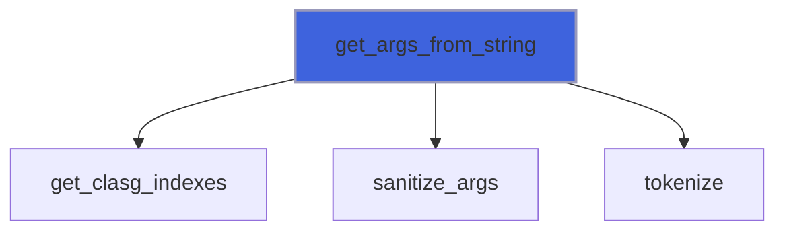

### get_args_from_invocation

Get CLAs from CLI invocation.

```fortran
subroutine get_args_from_invocation(self, ai)
```

**Arguments**

| Name | Type | Intent | Attributes | Description |
|------|------|--------|------------|-------------|
| `self` | class([command_line_interface](/api/src/lib/flap_command_line_interface_t#command-line-interface)) | inout |  | CLI data. |
| `ai` | integer(kind=[I4P](/api/src/third_party/PENF/src/lib/penf_global_parameters_variables)) | out | allocatable | CLAs grouped indexes. |

**Call graph**

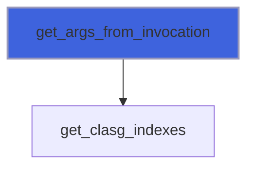

### get_cla

Get CLA (single) value from CLAs list parsed.

 @note For logical type CLA the value is directly read without any robust error trapping.

```fortran
subroutine get_cla(self, val, pref, args, group, switch, position, error)
```

**Arguments**

| Name | Type | Intent | Attributes | Description |
|------|------|--------|------------|-------------|
| `self` | class([command_line_interface](/api/src/lib/flap_command_line_interface_t#command-line-interface)) | inout |  | CLI data. |
| `val` | class(*) | inout |  | CLA value. |
| `pref` | character(len=*) | in | optional | Prefixing string. |
| `args` | character(len=*) | in | optional | String containing command line arguments. |
| `group` | character(len=*) | in | optional | Name of group (command) of CLA. |
| `switch` | character(len=*) | in | optional | Switch name. |
| `position` | integer(kind=[I4P](/api/src/third_party/PENF/src/lib/penf_global_parameters_variables)) | in | optional | Position of positional CLA. |
| `error` | integer(kind=[I4P](/api/src/third_party/PENF/src/lib/penf_global_parameters_variables)) | out | optional | Error trapping flag. |

**Call graph**

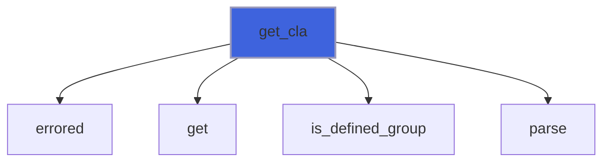

### get_cla_list

Get CLA multiple values from CLAs list parsed.

 @note For logical type CLA the value is directly read without any robust error trapping.

```fortran
subroutine get_cla_list(self, val, pref, args, group, switch, position, error)
```

**Arguments**

| Name | Type | Intent | Attributes | Description |
|------|------|--------|------------|-------------|
| `self` | class([command_line_interface](/api/src/lib/flap_command_line_interface_t#command-line-interface)) | inout |  | CLI data. |
| `val` | class(*) | inout |  | CLA values. |
| `pref` | character(len=*) | in | optional | Prefixing string. |
| `args` | character(len=*) | in | optional | String containing command line arguments. |
| `group` | character(len=*) | in | optional | Name of group (command) of CLA. |
| `switch` | character(len=*) | in | optional | Switch name. |
| `position` | integer(kind=[I4P](/api/src/third_party/PENF/src/lib/penf_global_parameters_variables)) | in | optional | Position of positional CLA. |
| `error` | integer(kind=[I4P](/api/src/third_party/PENF/src/lib/penf_global_parameters_variables)) | out | optional | Error trapping flag. |

**Call graph**

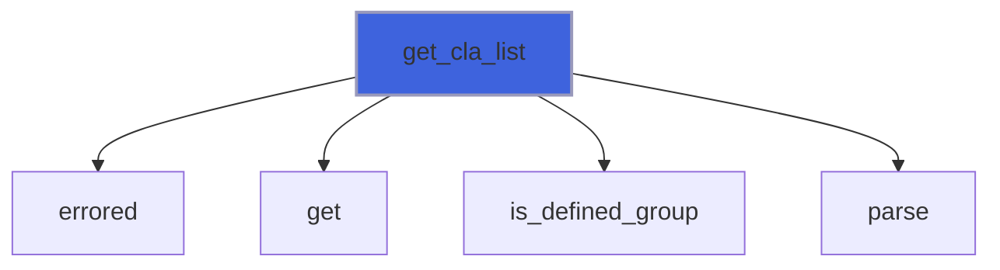

### get_cla_list_varying_R16P

Get CLA multiple values from CLAs list parsed with varying size list, real(R16P).

 @note The CLA list is returned deallocated if values are not correctly gotten.

 @note For logical type CLA the value is directly read without any robust error trapping.

```fortran
subroutine get_cla_list_varying_R16P(self, val, pref, args, group, switch, position, error)
```

**Arguments**

| Name | Type | Intent | Attributes | Description |
|------|------|--------|------------|-------------|
| `self` | class([command_line_interface](/api/src/lib/flap_command_line_interface_t#command-line-interface)) | inout |  | CLI data. |
| `val` | real(kind=[R16P](/api/src/third_party/PENF/src/lib/penf_global_parameters_variables)) | out | allocatable | CLA values. |
| `pref` | character(len=*) | in | optional | Prefixing string. |
| `args` | character(len=*) | in | optional | String containing command line arguments. |
| `group` | character(len=*) | in | optional | Name of group (command) of CLA. |
| `switch` | character(len=*) | in | optional | Switch name. |
| `position` | integer(kind=[I4P](/api/src/third_party/PENF/src/lib/penf_global_parameters_variables)) | in | optional | Position of positional CLA. |
| `error` | integer(kind=[I4P](/api/src/third_party/PENF/src/lib/penf_global_parameters_variables)) | out | optional | Error trapping flag. |

**Call graph**

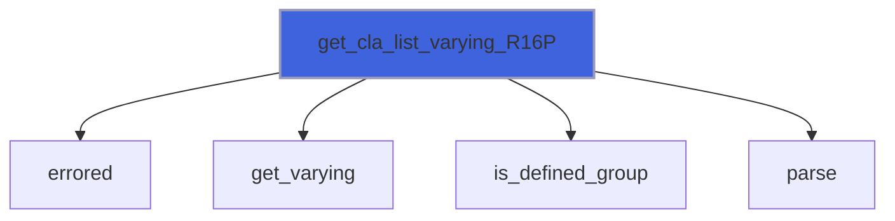

### get_cla_list_varying_R8P

Get CLA multiple values from CLAs list parsed with varying size list, real(R8P).

 @note The CLA list is returned deallocated if values are not correctly gotten.

 @note For logical type CLA the value is directly read without any robust error trapping.

```fortran
subroutine get_cla_list_varying_R8P(self, val, pref, args, group, switch, position, error)
```

**Arguments**

| Name | Type | Intent | Attributes | Description |
|------|------|--------|------------|-------------|
| `self` | class([command_line_interface](/api/src/lib/flap_command_line_interface_t#command-line-interface)) | inout |  | CLI data. |
| `val` | real(kind=[R8P](/api/src/third_party/PENF/src/lib/penf_global_parameters_variables)) | out | allocatable | CLA values. |
| `pref` | character(len=*) | in | optional | Prefixing string. |
| `args` | character(len=*) | in | optional | String containing command line arguments. |
| `group` | character(len=*) | in | optional | Name of group (command) of CLA. |
| `switch` | character(len=*) | in | optional | Switch name. |
| `position` | integer(kind=[I4P](/api/src/third_party/PENF/src/lib/penf_global_parameters_variables)) | in | optional | Position of positional CLA. |
| `error` | integer(kind=[I4P](/api/src/third_party/PENF/src/lib/penf_global_parameters_variables)) | out | optional | Error trapping flag. |

**Call graph**

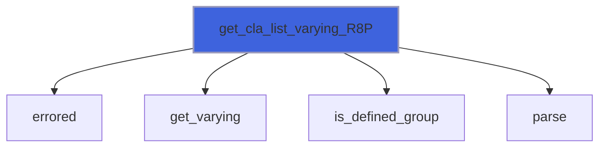

### get_cla_list_varying_R4P

Get CLA multiple values from CLAs list parsed with varying size list, real(R4P).

 @note The CLA list is returned deallocated if values are not correctly gotten.

 @note For logical type CLA the value is directly read without any robust error trapping.

```fortran
subroutine get_cla_list_varying_R4P(self, val, pref, args, group, switch, position, error)
```

**Arguments**

| Name | Type | Intent | Attributes | Description |
|------|------|--------|------------|-------------|
| `self` | class([command_line_interface](/api/src/lib/flap_command_line_interface_t#command-line-interface)) | inout |  | CLI data. |
| `val` | real(kind=[R4P](/api/src/third_party/PENF/src/lib/penf_global_parameters_variables)) | out | allocatable | CLA values. |
| `pref` | character(len=*) | in | optional | Prefixing string. |
| `args` | character(len=*) | in | optional | String containing command line arguments. |
| `group` | character(len=*) | in | optional | Name of group (command) of CLA. |
| `switch` | character(len=*) | in | optional | Switch name. |
| `position` | integer(kind=[I4P](/api/src/third_party/PENF/src/lib/penf_global_parameters_variables)) | in | optional | Position of positional CLA. |
| `error` | integer(kind=[I4P](/api/src/third_party/PENF/src/lib/penf_global_parameters_variables)) | out | optional | Error trapping flag. |

**Call graph**

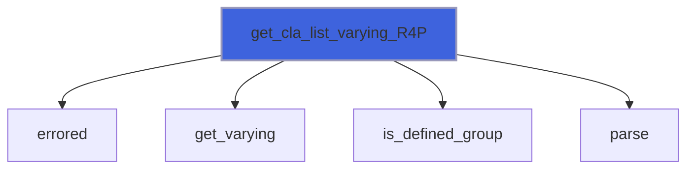

### get_cla_list_varying_I8P

Get CLA multiple values from CLAs list parsed with varying size list, integer(I8P).

 @note The CLA list is returned deallocated if values are not correctly gotten.

 @note For logical type CLA the value is directly read without any robust error trapping.

```fortran
subroutine get_cla_list_varying_I8P(self, val, pref, args, group, switch, position, error)
```

**Arguments**

| Name | Type | Intent | Attributes | Description |
|------|------|--------|------------|-------------|
| `self` | class([command_line_interface](/api/src/lib/flap_command_line_interface_t#command-line-interface)) | inout |  | CLI data. |
| `val` | integer(kind=[I8P](/api/src/third_party/PENF/src/lib/penf_global_parameters_variables)) | out | allocatable | CLA values. |
| `pref` | character(len=*) | in | optional | Prefixing string. |
| `args` | character(len=*) | in | optional | String containing command line arguments. |
| `group` | character(len=*) | in | optional | Name of group (command) of CLA. |
| `switch` | character(len=*) | in | optional | Switch name. |
| `position` | integer(kind=[I4P](/api/src/third_party/PENF/src/lib/penf_global_parameters_variables)) | in | optional | Position of positional CLA. |
| `error` | integer(kind=[I4P](/api/src/third_party/PENF/src/lib/penf_global_parameters_variables)) | out | optional | Error trapping flag. |

**Call graph**

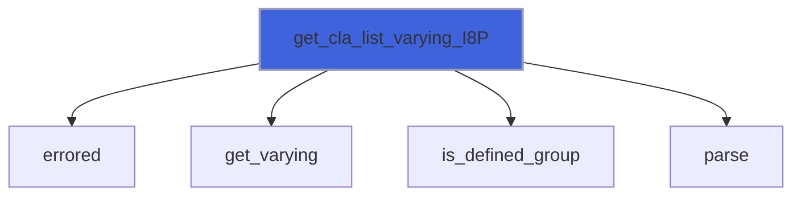

### get_cla_list_varying_I4P

Get CLA multiple values from CLAs list parsed with varying size list, integer(I4P).

 @note The CLA list is returned deallocated if values are not correctly gotten.

 @note For logical type CLA the value is directly read without any robust error trapping.

```fortran
subroutine get_cla_list_varying_I4P(self, val, pref, args, group, switch, position, error)
```

**Arguments**

| Name | Type | Intent | Attributes | Description |
|------|------|--------|------------|-------------|
| `self` | class([command_line_interface](/api/src/lib/flap_command_line_interface_t#command-line-interface)) | inout |  | CLI data. |
| `val` | integer(kind=[I4P](/api/src/third_party/PENF/src/lib/penf_global_parameters_variables)) | out | allocatable | CLA values. |
| `pref` | character(len=*) | in | optional | Prefixing string. |
| `args` | character(len=*) | in | optional | String containing command line arguments. |
| `group` | character(len=*) | in | optional | Name of group (command) of CLA. |
| `switch` | character(len=*) | in | optional | Switch name. |
| `position` | integer(kind=[I4P](/api/src/third_party/PENF/src/lib/penf_global_parameters_variables)) | in | optional | Position of positional CLA. |
| `error` | integer(kind=[I4P](/api/src/third_party/PENF/src/lib/penf_global_parameters_variables)) | out | optional | Error trapping flag. |

**Call graph**


### get_cla_list_varying_I2P

Get CLA multiple values from CLAs list parsed with varying size list, integer(I2P).

 @note The CLA list is returned deallocated if values are not correctly gotten.

 @note For logical type CLA the value is directly read without any robust error trapping.

```fortran
subroutine get_cla_list_varying_I2P(self, val, pref, args, group, switch, position, error)
```

**Arguments**

| Name | Type | Intent | Attributes | Description |
|------|------|--------|------------|-------------|
| `self` | class([command_line_interface](/api/src/lib/flap_command_line_interface_t#command-line-interface)) | inout |  | CLI data. |
| `val` | integer(kind=[I2P](/api/src/third_party/PENF/src/lib/penf_global_parameters_variables)) | out | allocatable | CLA values. |
| `pref` | character(len=*) | in | optional | Prefixing string. |
| `args` | character(len=*) | in | optional | String containing command line arguments. |
| `group` | character(len=*) | in | optional | Name of group (command) of CLA. |
| `switch` | character(len=*) | in | optional | Switch name. |
| `position` | integer(kind=[I4P](/api/src/third_party/PENF/src/lib/penf_global_parameters_variables)) | in | optional | Position of positional CLA. |
| `error` | integer(kind=[I4P](/api/src/third_party/PENF/src/lib/penf_global_parameters_variables)) | out | optional | Error trapping flag. |

**Call graph**

```mermaid
flowchart TD
  get_cla_list_varying_I2P["get_cla_list_varying_I2P"] --> errored["errored"]
  get_cla_list_varying_I2P["get_cla_list_varying_I2P"] --> get_varying["get_varying"]
  get_cla_list_varying_I2P["get_cla_list_varying_I2P"] --> is_defined_group["is_defined_group"]
  get_cla_list_varying_I2P["get_cla_list_varying_I2P"] --> parse["parse"]
  style get_cla_list_varying_I2P fill:#3e63dd,stroke:#99b,stroke-width:2px
```

### get_cla_list_varying_I1P

Get CLA multiple values from CLAs list parsed with varying size list, integer(I1P).

 @note The CLA list is returned deallocated if values are not correctly gotten.

 @note For logical type CLA the value is directly read without any robust error trapping.

```fortran
subroutine get_cla_list_varying_I1P(self, val, pref, args, group, switch, position, error)
```

**Arguments**

| Name | Type | Intent | Attributes | Description |
|------|------|--------|------------|-------------|
| `self` | class([command_line_interface](/api/src/lib/flap_command_line_interface_t#command-line-interface)) | inout |  | CLI data. |
| `val` | integer(kind=[I1P](/api/src/third_party/PENF/src/lib/penf_global_parameters_variables)) | out | allocatable | CLA values. |
| `pref` | character(len=*) | in | optional | Prefixing string. |
| `args` | character(len=*) | in | optional | String containing command line arguments. |
| `group` | character(len=*) | in | optional | Name of group (command) of CLA. |
| `switch` | character(len=*) | in | optional | Switch name. |
| `position` | integer(kind=[I4P](/api/src/third_party/PENF/src/lib/penf_global_parameters_variables)) | in | optional | Position of positional CLA. |
| `error` | integer(kind=[I4P](/api/src/third_party/PENF/src/lib/penf_global_parameters_variables)) | out | optional | Error trapping flag. |

**Call graph**

```mermaid
flowchart TD
  get_cla_list_varying_I1P["get_cla_list_varying_I1P"] --> errored["errored"]
  get_cla_list_varying_I1P["get_cla_list_varying_I1P"] --> get_varying["get_varying"]
  get_cla_list_varying_I1P["get_cla_list_varying_I1P"] --> is_defined_group["is_defined_group"]
  get_cla_list_varying_I1P["get_cla_list_varying_I1P"] --> parse["parse"]
  style get_cla_list_varying_I1P fill:#3e63dd,stroke:#99b,stroke-width:2px
```

### get_cla_list_varying_logical

Get CLA multiple values from CLAs list parsed with varying size list, logical.

 @note The CLA list is returned deallocated if values are not correctly gotten.

 @note For logical type CLA the value is directly read without any robust error trapping.

```fortran
subroutine get_cla_list_varying_logical(self, val, pref, args, group, switch, position, error)
```

**Arguments**

| Name | Type | Intent | Attributes | Description |
|------|------|--------|------------|-------------|
| `self` | class([command_line_interface](/api/src/lib/flap_command_line_interface_t#command-line-interface)) | inout |  | CLI data. |
| `val` | logical | out | allocatable | CLA values. |
| `pref` | character(len=*) | in | optional | Prefixing string. |
| `args` | character(len=*) | in | optional | String containing command line arguments. |
| `group` | character(len=*) | in | optional | Name of group (command) of CLA. |
| `switch` | character(len=*) | in | optional | Switch name. |
| `position` | integer(kind=[I4P](/api/src/third_party/PENF/src/lib/penf_global_parameters_variables)) | in | optional | Position of positional CLA. |
| `error` | integer(kind=[I4P](/api/src/third_party/PENF/src/lib/penf_global_parameters_variables)) | out | optional | Error trapping flag. |

**Call graph**

```mermaid
flowchart TD
  get_cla_list_varying_logical["get_cla_list_varying_logical"] --> errored["errored"]
  get_cla_list_varying_logical["get_cla_list_varying_logical"] --> get_varying["get_varying"]
  get_cla_list_varying_logical["get_cla_list_varying_logical"] --> is_defined_group["is_defined_group"]
  get_cla_list_varying_logical["get_cla_list_varying_logical"] --> parse["parse"]
  style get_cla_list_varying_logical fill:#3e63dd,stroke:#99b,stroke-width:2px
```

### get_cla_list_varying_char

Get CLA multiple values from CLAs list parsed with varying size list, character.

 @note The CLA list is returned deallocated if values are not correctly gotten.

 @note For logical type CLA the value is directly read without any robust error trapping.

```fortran
subroutine get_cla_list_varying_char(self, val, pref, args, group, switch, position, error)
```

**Arguments**

| Name | Type | Intent | Attributes | Description |
|------|------|--------|------------|-------------|
| `self` | class([command_line_interface](/api/src/lib/flap_command_line_interface_t#command-line-interface)) | inout |  | CLI data. |
| `val` | character(len=*) | out | allocatable | CLA values. |
| `pref` | character(len=*) | in | optional | Prefixing string. |
| `args` | character(len=*) | in | optional | String containing command line arguments. |
| `group` | character(len=*) | in | optional | Name of group (command) of CLA. |
| `switch` | character(len=*) | in | optional | Switch name. |
| `position` | integer(kind=[I4P](/api/src/third_party/PENF/src/lib/penf_global_parameters_variables)) | in | optional | Position of positional CLA. |
| `error` | integer(kind=[I4P](/api/src/third_party/PENF/src/lib/penf_global_parameters_variables)) | out | optional | Error trapping flag. |

**Call graph**

```mermaid
flowchart TD
  get_cla_list_varying_char["get_cla_list_varying_char"] --> errored["errored"]
  get_cla_list_varying_char["get_cla_list_varying_char"] --> get_varying["get_varying"]
  get_cla_list_varying_char["get_cla_list_varying_char"] --> is_defined_group["is_defined_group"]
  get_cla_list_varying_char["get_cla_list_varying_char"] --> parse["parse"]
  style get_cla_list_varying_char fill:#3e63dd,stroke:#99b,stroke-width:2px
```

### print_usage

Print correct usage.

```fortran
subroutine print_usage(self, pref)
```

**Arguments**

| Name | Type | Intent | Attributes | Description |
|------|------|--------|------------|-------------|
| `self` | class([command_line_interface](/api/src/lib/flap_command_line_interface_t#command-line-interface)) | in |  | CLI data. |
| `pref` | character(len=*) | in | optional | Prefixing string. |

**Call graph**

```mermaid
flowchart TD
  print_usage["print_usage"] --> usage["usage"]
  style print_usage fill:#3e63dd,stroke:#99b,stroke-width:2px
```

### save_bash_completion

Save bash completion script (for named CLAs only).

```fortran
subroutine save_bash_completion(self, bash_file, error)
```

**Arguments**

| Name | Type | Intent | Attributes | Description |
|------|------|--------|------------|-------------|
| `self` | class([command_line_interface](/api/src/lib/flap_command_line_interface_t#command-line-interface)) | in |  | CLI data. |
| `bash_file` | character(len=*) | in |  | Output file name of bash completion script. |
| `error` | integer(kind=[I4P](/api/src/third_party/PENF/src/lib/penf_global_parameters_variables)) | out | optional | Error trapping flag. |

**Call graph**

```mermaid
flowchart TD
  save_bash_completion["save_bash_completion"] --> basename["basename"]
  save_bash_completion["save_bash_completion"] --> signature["signature"]
  style save_bash_completion fill:#3e63dd,stroke:#99b,stroke-width:2px
```

### save_man_page

Save CLI usage as man page.

```fortran
subroutine save_man_page(self, man_file, error)
```

**Arguments**

| Name | Type | Intent | Attributes | Description |
|------|------|--------|------------|-------------|
| `self` | class([command_line_interface](/api/src/lib/flap_command_line_interface_t#command-line-interface)) | in |  | CLI data. |
| `man_file` | character(len=*) | in |  | Output file name for saving man page. |
| `error` | integer(kind=[I4P](/api/src/third_party/PENF/src/lib/penf_global_parameters_variables)) | out | optional | Error trapping flag. |

**Call graph**

```mermaid
flowchart TD
  save_man_page["save_man_page"] --> signature["signature"]
  save_man_page["save_man_page"] --> strz["strz"]
  save_man_page["save_man_page"] --> usage["usage"]
  style save_man_page fill:#3e63dd,stroke:#99b,stroke-width:2px
```

### save_usage_to_markdown

Save CLI usage as markdown.

```fortran
subroutine save_usage_to_markdown(self, markdown_file, error)
```

**Arguments**

| Name | Type | Intent | Attributes | Description |
|------|------|--------|------------|-------------|
| `self` | class([command_line_interface](/api/src/lib/flap_command_line_interface_t#command-line-interface)) | in |  | CLI data. |
| `markdown_file` | character(len=*) | in |  | Output file name for saving man page. |
| `error` | integer(kind=[I4P](/api/src/third_party/PENF/src/lib/penf_global_parameters_variables)) | out | optional | Error trapping flag. |

**Call graph**

```mermaid
flowchart TD
  parse["parse"] --> save_usage_to_markdown["save_usage_to_markdown"]
  save_usage_to_markdown["save_usage_to_markdown"] --> signature["signature"]
  save_usage_to_markdown["save_usage_to_markdown"] --> strz["strz"]
  save_usage_to_markdown["save_usage_to_markdown"] --> usage["usage"]
  style save_usage_to_markdown fill:#3e63dd,stroke:#99b,stroke-width:2px
```

### errored

Trig error occurrence and print meaningful message.

```fortran
subroutine errored(self, error, pref, group, switch)
```

**Arguments**

| Name | Type | Intent | Attributes | Description |
|------|------|--------|------------|-------------|
| `self` | class([command_line_interface](/api/src/lib/flap_command_line_interface_t#command-line-interface)) | inout |  | Object data. |
| `error` | integer(kind=[I4P](/api/src/third_party/PENF/src/lib/penf_global_parameters_variables)) | in |  | Error occurred. |
| `pref` | character(len=*) | in | optional | Prefixing string. |
| `group` | character(len=*) | in | optional | Group name. |
| `switch` | character(len=*) | in | optional | CLA switch name. |

**Call graph**

```mermaid
flowchart TD
  check["check"] --> errored["errored"]
  check_action_consistency["check_action_consistency"] --> errored["errored"]
  check_choices["check_choices"] --> errored["errored"]
  check_envvar_consistency["check_envvar_consistency"] --> errored["errored"]
  check_list_size["check_list_size"] --> errored["errored"]
  check_m_exclude_consistency["check_m_exclude_consistency"] --> errored["errored"]
  check_named_consistency["check_named_consistency"] --> errored["errored"]
  check_optional_consistency["check_optional_consistency"] --> errored["errored"]
  check_positional_consistency["check_positional_consistency"] --> errored["errored"]
  get_cla["get_cla"] --> errored["errored"]
  get_cla["get_cla"] --> errored["errored"]
  get_cla_from_buffer["get_cla_from_buffer"] --> errored["errored"]
  get_cla_list["get_cla_list"] --> errored["errored"]
  get_cla_list["get_cla_list"] --> errored["errored"]
  get_cla_list_from_buffer["get_cla_list_from_buffer"] --> errored["errored"]
  get_cla_list_varying_I1P["get_cla_list_varying_I1P"] --> errored["errored"]
  get_cla_list_varying_I1P["get_cla_list_varying_I1P"] --> errored["errored"]
  get_cla_list_varying_I2P["get_cla_list_varying_I2P"] --> errored["errored"]
  get_cla_list_varying_I2P["get_cla_list_varying_I2P"] --> errored["errored"]
  get_cla_list_varying_I4P["get_cla_list_varying_I4P"] --> errored["errored"]
  get_cla_list_varying_I4P["get_cla_list_varying_I4P"] --> errored["errored"]
  get_cla_list_varying_I8P["get_cla_list_varying_I8P"] --> errored["errored"]
  get_cla_list_varying_I8P["get_cla_list_varying_I8P"] --> errored["errored"]
  get_cla_list_varying_R16P["get_cla_list_varying_R16P"] --> errored["errored"]
  get_cla_list_varying_R16P["get_cla_list_varying_R16P"] --> errored["errored"]
  get_cla_list_varying_R4P["get_cla_list_varying_R4P"] --> errored["errored"]
  get_cla_list_varying_R4P["get_cla_list_varying_R4P"] --> errored["errored"]
  get_cla_list_varying_R8P["get_cla_list_varying_R8P"] --> errored["errored"]
  get_cla_list_varying_R8P["get_cla_list_varying_R8P"] --> errored["errored"]
  get_cla_list_varying_char["get_cla_list_varying_char"] --> errored["errored"]
  get_cla_list_varying_char["get_cla_list_varying_char"] --> errored["errored"]
  get_cla_list_varying_logical["get_cla_list_varying_logical"] --> errored["errored"]
  get_cla_list_varying_logical["get_cla_list_varying_logical"] --> errored["errored"]
  is_required_passed["is_required_passed"] --> errored["errored"]
  is_required_val_passed["is_required_val_passed"] --> errored["errored"]
  raise_error_duplicated_clas["raise_error_duplicated_clas"] --> errored["errored"]
  raise_error_m_exclude["raise_error_m_exclude"] --> errored["errored"]
  raise_error_m_exclude["raise_error_m_exclude"] --> errored["errored"]
  raise_error_nargs_insufficient["raise_error_nargs_insufficient"] --> errored["errored"]
  raise_error_switch_unknown["raise_error_switch_unknown"] --> errored["errored"]
  raise_error_value_missing["raise_error_value_missing"] --> errored["errored"]
  errored["errored"] --> colorize["colorize"]
  errored["errored"] --> print_error_message["print_error_message"]
  style errored fill:#3e63dd,stroke:#99b,stroke-width:2px
```

### cli_assign_cli

Assignment operator.

**Attributes**: elemental

```fortran
subroutine cli_assign_cli(lhs, rhs)
```

**Arguments**

| Name | Type | Intent | Attributes | Description |
|------|------|--------|------------|-------------|
| `lhs` | class([command_line_interface](/api/src/lib/flap_command_line_interface_t#command-line-interface)) | inout |  | Left hand side. |
| `rhs` | type([command_line_interface](/api/src/lib/flap_command_line_interface_t#command-line-interface)) | in |  | Right hand side. |

**Call graph**

```mermaid
flowchart TD
  cli_assign_cli["cli_assign_cli"] --> assign_object["assign_object"]
  style cli_assign_cli fill:#3e63dd,stroke:#99b,stroke-width:2px
```

### finalize

Free dynamic memory when finalizing.

**Attributes**: elemental

```fortran
subroutine finalize(self)
```

**Arguments**

| Name | Type | Intent | Attributes | Description |
|------|------|--------|------------|-------------|
| `self` | type([command_line_interface](/api/src/lib/flap_command_line_interface_t#command-line-interface)) | inout |  | CLI data. |

## Functions

### is_passed

Check if a CLA has been passed.

**Returns**: `logical`

```fortran
function is_passed(self, group, switch, position)
```

**Arguments**

| Name | Type | Intent | Attributes | Description |
|------|------|--------|------------|-------------|
| `self` | class([command_line_interface](/api/src/lib/flap_command_line_interface_t#command-line-interface)) | in |  | CLI data. |
| `group` | character(len=*) | in | optional | Name of group (command) of CLA. |
| `switch` | character(len=*) | in | optional | Switch name. |
| `position` | integer(kind=[I4P](/api/src/third_party/PENF/src/lib/penf_global_parameters_variables)) | in | optional | Position of positional CLA. |

**Call graph**

```mermaid
flowchart TD
  check_m_exclusive["check_m_exclusive"] --> is_passed["is_passed"]
  is_passed["is_passed"] --> is_passed["is_passed"]
  is_passed["is_passed"] --> is_defined_group["is_defined_group"]
  is_passed["is_passed"] --> is_passed["is_passed"]
  style is_passed fill:#3e63dd,stroke:#99b,stroke-width:2px
```

### is_defined_group

Check if a CLAs group has been defined.

**Returns**: `logical`

```fortran
function is_defined_group(self, group, g) result(defined)
```

**Arguments**

| Name | Type | Intent | Attributes | Description |
|------|------|--------|------------|-------------|
| `self` | class([command_line_interface](/api/src/lib/flap_command_line_interface_t#command-line-interface)) | in |  | CLI data. |
| `group` | character(len=*) | in |  | Name of group (command) of CLAs. |
| `g` | integer(kind=[I4P](/api/src/third_party/PENF/src/lib/penf_global_parameters_variables)) | out | optional | Index of group. |

**Call graph**

```mermaid
flowchart TD
  add["add"] --> is_defined_group["is_defined_group"]
  add_group["add_group"] --> is_defined_group["is_defined_group"]
  check["check"] --> is_defined_group["is_defined_group"]
  check_m_exclusive["check_m_exclusive"] --> is_defined_group["is_defined_group"]
  get_cla["get_cla"] --> is_defined_group["is_defined_group"]
  get_cla_list["get_cla_list"] --> is_defined_group["is_defined_group"]
  get_cla_list_varying_I1P["get_cla_list_varying_I1P"] --> is_defined_group["is_defined_group"]
  get_cla_list_varying_I2P["get_cla_list_varying_I2P"] --> is_defined_group["is_defined_group"]
  get_cla_list_varying_I4P["get_cla_list_varying_I4P"] --> is_defined_group["is_defined_group"]
  get_cla_list_varying_I8P["get_cla_list_varying_I8P"] --> is_defined_group["is_defined_group"]
  get_cla_list_varying_R16P["get_cla_list_varying_R16P"] --> is_defined_group["is_defined_group"]
  get_cla_list_varying_R4P["get_cla_list_varying_R4P"] --> is_defined_group["is_defined_group"]
  get_cla_list_varying_R8P["get_cla_list_varying_R8P"] --> is_defined_group["is_defined_group"]
  get_cla_list_varying_char["get_cla_list_varying_char"] --> is_defined_group["is_defined_group"]
  get_cla_list_varying_logical["get_cla_list_varying_logical"] --> is_defined_group["is_defined_group"]
  get_clasg_indexes["get_clasg_indexes"] --> is_defined_group["is_defined_group"]
  is_called_group["is_called_group"] --> is_defined_group["is_defined_group"]
  is_defined["is_defined"] --> is_defined_group["is_defined_group"]
  is_passed["is_passed"] --> is_defined_group["is_defined_group"]
  set_mutually_exclusive_groups["set_mutually_exclusive_groups"] --> is_defined_group["is_defined_group"]
  style is_defined_group fill:#3e63dd,stroke:#99b,stroke-width:2px
```

### is_called_group

Check if a CLAs group has been run.

**Returns**: `logical`

```fortran
function is_called_group(self, group) result(called)
```

**Arguments**

| Name | Type | Intent | Attributes | Description |
|------|------|--------|------------|-------------|
| `self` | class([command_line_interface](/api/src/lib/flap_command_line_interface_t#command-line-interface)) | in |  | CLI data. |
| `group` | character(len=*) | in |  | Name of group (command) of CLAs. |

**Call graph**

```mermaid
flowchart TD
  is_called_group["is_called_group"] --> is_defined_group["is_defined_group"]
  style is_called_group fill:#3e63dd,stroke:#99b,stroke-width:2px
```

### is_defined

Check if a CLA has been defined.

**Returns**: `logical`

```fortran
function is_defined(self, switch, group)
```

**Arguments**

| Name | Type | Intent | Attributes | Description |
|------|------|--------|------------|-------------|
| `self` | class([command_line_interface](/api/src/lib/flap_command_line_interface_t#command-line-interface)) | in |  | CLI data. |
| `switch` | character(len=*) | in |  | Switch name. |
| `group` | character(len=*) | in | optional | Name of group (command) of CLAs. |

**Call graph**

```mermaid
flowchart TD
  check["check"] --> is_defined["is_defined"]
  is_defined["is_defined"] --> is_defined["is_defined"]
  parse["parse"] --> is_defined["is_defined"]
  parse["parse"] --> is_defined["is_defined"]
  is_defined["is_defined"] --> is_defined["is_defined"]
  is_defined["is_defined"] --> is_defined_group["is_defined_group"]
  style is_defined fill:#3e63dd,stroke:#99b,stroke-width:2px
```

### is_parsed

Check if CLI has been parsed.

**Attributes**: elemental

**Returns**: `logical`

```fortran
function is_parsed(self)
```

**Arguments**

| Name | Type | Intent | Attributes | Description |
|------|------|--------|------------|-------------|
| `self` | class([command_line_interface](/api/src/lib/flap_command_line_interface_t#command-line-interface)) | in |  | CLI data. |

### usage

Print correct usage of CLI.

**Returns**: `character(len=:)`

```fortran
function usage(self, g, pref, no_header, no_examples, no_epilog, markdown) result(usaged)
```

**Arguments**

| Name | Type | Intent | Attributes | Description |
|------|------|--------|------------|-------------|
| `self` | class([command_line_interface](/api/src/lib/flap_command_line_interface_t#command-line-interface)) | in |  | CLI data. |
| `g` | integer(kind=[I4P](/api/src/third_party/PENF/src/lib/penf_global_parameters_variables)) | in |  | Group index. |
| `pref` | character(len=*) | in | optional | Prefixing string. |
| `no_header` | logical | in | optional | Avoid insert header to usage. |
| `no_examples` | logical | in | optional | Avoid insert examples to usage. |
| `no_epilog` | logical | in | optional | Avoid insert epilogue to usage. |
| `markdown` | logical | in | optional | Format things with markdown |

**Call graph**

```mermaid
flowchart TD
  is_required_passed["is_required_passed"] --> usage["usage"]
  parse["parse"] --> usage["usage"]
  print_usage["print_usage"] --> usage["usage"]
  save_man_page["save_man_page"] --> usage["usage"]
  save_usage_to_markdown["save_usage_to_markdown"] --> usage["usage"]
  usage["usage"] --> usage["usage"]
  usage["usage"] --> usage["usage"]
  usage["usage"] --> print_examples["print_examples"]
  usage["usage"] --> signature["signature"]
  usage["usage"] --> usage["usage"]
  style usage fill:#3e63dd,stroke:#99b,stroke-width:2px
```

### signature

Get signature.

**Returns**: `character(len=:)`

```fortran
function signature(self, bash_completion)
```

**Arguments**

| Name | Type | Intent | Attributes | Description |
|------|------|--------|------------|-------------|
| `self` | class([command_line_interface](/api/src/lib/flap_command_line_interface_t#command-line-interface)) | in |  | CLI data. |
| `bash_completion` | logical | in | optional | Return the signature for bash completion. |

**Call graph**

```mermaid
flowchart TD
  save_bash_completion["save_bash_completion"] --> signature["signature"]
  save_man_page["save_man_page"] --> signature["signature"]
  save_usage_to_markdown["save_usage_to_markdown"] --> signature["signature"]
  signature["signature"] --> signature["signature"]
  signature["signature"] --> signature["signature"]
  usage["usage"] --> signature["signature"]
  usage["usage"] --> signature["signature"]
  signature["signature"] --> signature["signature"]
  style signature fill:#3e63dd,stroke:#99b,stroke-width:2px
```
