# flap_command_line_interface_t

> Command Line Interface (CLI) class.

**Source**: `src/lib/flap_command_line_interface_t.F90`

**Dependencies**

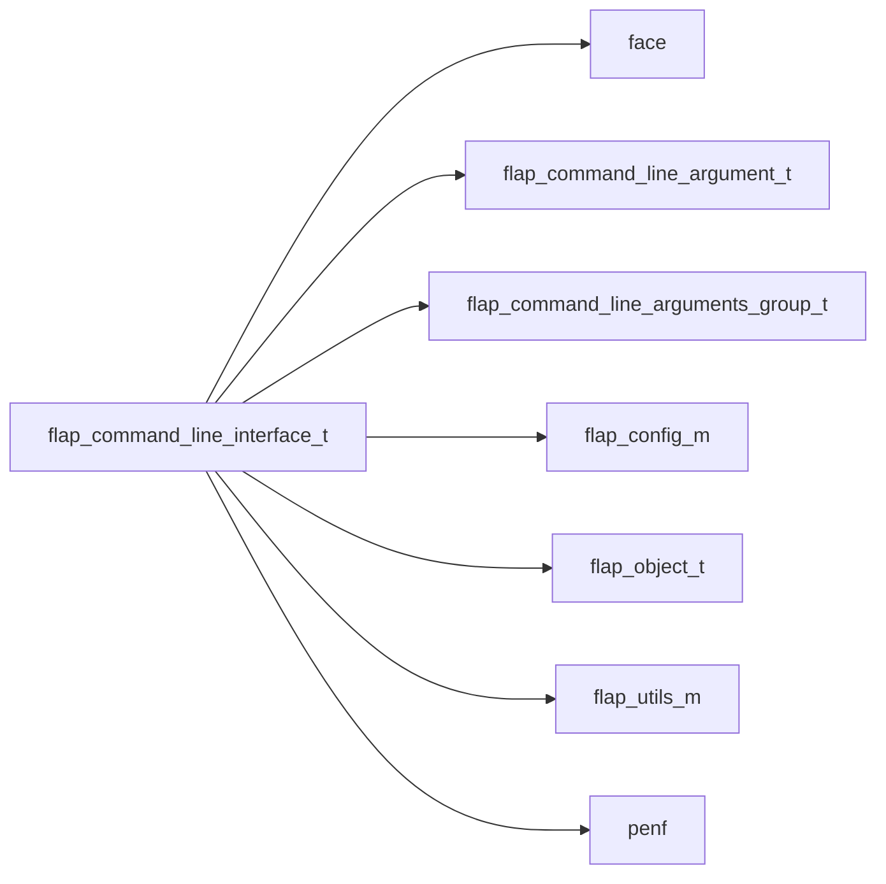
```mermaid
graph LR
  flap_command_line_interface_t["flap_command_line_interface_t"] --> face["face"]
  flap_command_line_interface_t["flap_command_line_interface_t"] --> flap_command_line_argument_t["flap_command_line_argument_t"]
  flap_command_line_interface_t["flap_command_line_interface_t"] --> flap_command_line_arguments_group_t["flap_command_line_arguments_group_t"]
  flap_command_line_interface_t["flap_command_line_interface_t"] --> flap_config_m["flap_config_m"]
  flap_command_line_interface_t["flap_command_line_interface_t"] --> flap_object_t["flap_object_t"]
  flap_command_line_interface_t["flap_command_line_interface_t"] --> flap_utils_m["flap_utils_m"]
  flap_command_line_interface_t["flap_command_line_interface_t"] --> penf["penf"]
```

## Contents

- [command_line_interface](#command-line-interface)
- [free](#free)
- [init](#init)
- [add_group](#add-group)
- [set_mutually_exclusive_groups](#set-mutually-exclusive-groups)
- [set_config](#set-config)
- [warn_deprecated](#warn-deprecated)
- [load_config](#load-config)
- [set_mutually_exclusive_switches](#set-mutually-exclusive-switches)
- [add](#add)
- [check](#check)
- [check_m_exclusive](#check-m-exclusive)
- [reset_parse](#reset-parse)
- [parse](#parse)
- [print_error_hint](#print-error-hint)
- [parse_core](#parse-core)
- [get_clasg_indexes](#get-clasg-indexes)
- [get_args_from_string](#get-args-from-string)
- [get_args_from_invocation](#get-args-from-invocation)
- [get_cla](#get-cla)
- [get_cla_list](#get-cla-list)
- [get_cla_list_varying_R16P](#get-cla-list-varying-r16p)
- [get_cla_list_varying_R8P](#get-cla-list-varying-r8p)
- [get_cla_list_varying_R4P](#get-cla-list-varying-r4p)
- [get_cla_list_varying_I8P](#get-cla-list-varying-i8p)
- [get_cla_list_varying_I4P](#get-cla-list-varying-i4p)
- [get_cla_list_varying_I2P](#get-cla-list-varying-i2p)
- [get_cla_list_varying_I1P](#get-cla-list-varying-i1p)
- [get_cla_list_varying_logical](#get-cla-list-varying-logical)
- [copy_options](#copy-options)
- [get_map](#get-map)
- [get_map_value](#get-map-value)
- [get_cla_list_varying_char](#get-cla-list-varying-char)
- [ensure_builtins](#ensure-builtins)
- [save_bash_completion](#save-bash-completion)
- [save_zsh_completion](#save-zsh-completion)
- [save_man_page](#save-man-page)
- [save_usage_to_markdown](#save-usage-to-markdown)
- [print_usage](#print-usage)
- [save_bash_completion_core](#save-bash-completion-core)
- [save_man_page_core](#save-man-page-core)
- [save_usage_to_markdown_core](#save-usage-to-markdown-core)
- [errored](#errored)
- [finalize](#finalize)
- [quiet_stop](#quiet-stop)
- [get_source](#get-source)
- [provenance](#provenance)
- [envvar_name](#envvar-name)
- [is_passed](#is-passed)
- [is_defined_group](#is-defined-group)
- [group_index](#group-index)
- [raise_error](#raise-error)
- [is_called_group](#is-called-group)
- [is_defined](#is-defined)
- [is_parsed](#is-parsed)
- [no_args_help](#no-args-help)
- [dispatch_status](#dispatch-status)
- [is_fatal](#is-fatal)
- [map_cla](#map-cla)
- [builtins_missing](#builtins-missing)
- [usage](#usage)
- [signature](#signature)
- [usage_core](#usage-core)
- [signature_core](#signature-core)

## Variables

| Name | Type | Attributes | Description |
|------|------|------------|-------------|
| `ERROR_MISSING_CLA` | integer(kind=[I4P](/api/src/third_party/PENF/src/lib/penf_global_parameters_variables)) | parameter | CLA not found in CLI. |
| `ERROR_MISSING_GROUP` | integer(kind=[I4P](/api/src/third_party/PENF/src/lib/penf_global_parameters_variables)) | parameter | Group not found in CLI. |
| `ERROR_MISSING_SELECTION_CLA` | integer(kind=[I4P](/api/src/third_party/PENF/src/lib/penf_global_parameters_variables)) | parameter | CLA selection in CLI failing. |
| `ERROR_TOO_FEW_CLAS` | integer(kind=[I4P](/api/src/third_party/PENF/src/lib/penf_global_parameters_variables)) | parameter | Insufficient arguments for CLI. |
| `ERROR_UNKNOWN_CLAS_IGNORED` | integer(kind=[I4P](/api/src/third_party/PENF/src/lib/penf_global_parameters_variables)) | parameter | Unknown CLAs passed, but ignored. |
| `ERROR_USER` | integer(kind=[I4P](/api/src/third_party/PENF/src/lib/penf_global_parameters_variables)) | parameter | Application error reported by raise_error. |
| `ERROR_CONFIG_NOT_FOUND` | integer(kind=[I4P](/api/src/third_party/PENF/src/lib/penf_global_parameters_variables)) | parameter | Required configuration file not found. |
| `ERROR_CONFIG_UNKNOWN_KEY` | integer(kind=[I4P](/api/src/third_party/PENF/src/lib/penf_global_parameters_variables)) | parameter | Configuration file: unknown key or malformed line. |
| `ERROR_GROUP_ALIAS` | integer(kind=[I4P](/api/src/third_party/PENF/src/lib/penf_global_parameters_variables)) | parameter | Alias of a command equal to a command or an alias. |
| `ERROR_COPY_POSITIONAL` | integer(kind=[I4P](/api/src/third_party/PENF/src/lib/penf_global_parameters_variables)) | parameter | copy_options asked to copy a positional CLA. |
| `ERROR_ARGUMENT_RETRIEVAL` | integer(kind=[I4P](/api/src/third_party/PENF/src/lib/penf_global_parameters_variables)) | parameter | A command line argument cannot be retrieved. |

## Derived Types

### command_line_interface

Command Line Interface (CLI) class.

**Inheritance**

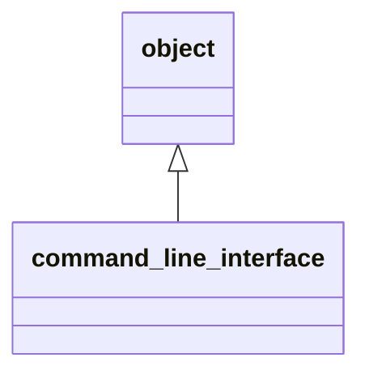
```mermaid
classDiagram
  object <|-- command_line_interface
```

**Extends**: [`object`](/api/src/lib/flap_object_t#object)

#### Components

| Name | Type | Attributes | Description |
|------|------|------------|-------------|
| `progname` | character(len=:) | allocatable | Program name. |
| `version` | character(len=:) | allocatable | Program version. |
| `help` | character(len=:) | allocatable | Help message. |
| `help_color` | character(len=:) | allocatable | ANSI color of help messages. |
| `help_style` | character(len=:) | allocatable | ANSI style of help messages. |
| `help_markdown` | character(len=:) | allocatable | Longer help message, markdown formatted. |
| `description` | character(len=:) | allocatable | Detailed description. |
| `license` | character(len=:) | allocatable | License description. |
| `authors` | character(len=:) | allocatable | Authors list. |
| `epilog` | character(len=:) | allocatable | Epilogue message. |
| `m_exclude` | character(len=:) | allocatable | Mutually exclude other CLA(s group). |
| `error_message` | character(len=:) | allocatable | Meaningful error message to standard-error. |
| `error_color` | character(len=:) | allocatable | ANSI color of error messages. |
| `error_style` | character(len=:) | allocatable | ANSI style of error messages. |
| `examples` | type([flap_string](/api/src/lib/flap_utils_m#flap-string)) | allocatable | Examples of correct usage (examples(i)%s). |
| `error` | integer(kind=[I4P](/api/src/third_party/PENF/src/lib/penf_global_parameters_variables)) |  | Error trapping flag. |
| `usage_lun` | integer(kind=[I4P](/api/src/third_party/PENF/src/lib/penf_global_parameters_variables)) |  | Output unit to print help/usage messages |
| `version_lun` | integer(kind=[I4P](/api/src/third_party/PENF/src/lib/penf_global_parameters_variables)) |  | Output unit to print version message |
| `error_lun` | integer(kind=[I4P](/api/src/third_party/PENF/src/lib/penf_global_parameters_variables)) |  | Error unit to print error messages |
| `case_insensitive` | logical |  | Match switches and command names in any case (F14). |
| `clasg` | type([command_line_arguments_group](/api/src/lib/flap_command_line_arguments_group_t#command-line-arguments-group)) | allocatable | CLA list [1:Na]. |
| `args` | type([flap_string](/api/src/lib/flap_utils_m#flap-string)) | allocatable | Actually passed command line arguments. |
| `disable_hv` | logical |  | Disable automatic 'help' and 'version' CLAs. |
| `is_parsed_` | logical |  | Parse status. |
| `ignore_unknown_clas` | logical |  | Disable errors-raising for passed unknown CLAs. |
| `standalone` | logical |  | Stop after help/version/markdown. |
| `error_hint` | logical |  | Print a hint after a failed parse. |
| `no_args_is_help` | logical |  | Print the help when no arguments are passed. |
| `ignore_env` | logical |  | Turn every environment lookup off. |
| `auto_envvar_prefix` | character(len=:) | allocatable | Prefix of the generated envvar names. |
| `config_path` | character(len=:) | allocatable | Configuration file (F08). |
| `config_required` | logical |  | The configuration file must exist. |
| `config_used` | character(len=:) | allocatable | Configuration file read by parse. |
| `error_unknown_clas` | integer(kind=[I4P](/api/src/third_party/PENF/src/lib/penf_global_parameters_variables)) |  | Error trapping flag for unknown CLAs. |

#### Type-Bound Procedures

| Name | Attributes | Description |
|------|------------|-------------|
| `error_prefix` | pass(self) | Prefix of error messages. |
| `free_object` | pass(self) | Free dynamic memory. |
| `print_version` | pass(self) | Print version. |
| `print_error_message` | pass(self) | Print meaningful error message. |
| `set_examples` | pass(self) | Set examples of correct usage. |
| `assign_object` | pass(lhs ) | Assignment overloading. |
| `free` |  | Free dynamic memory. |
| `init` |  | Initialize CLI. |
| `add_group` |  | Add CLAs group CLI. |
| `add` |  | Add CLA to CLI. |
| `is_passed` |  | Check if a CLA has been passed. |
| `is_defined_group` |  | Check if a CLAs group has been defined. |
| `raise_error` |  | Report an application error in FLAP's style. |
| `is_defined` |  | Check if a CLA has been defined. |
| `is_parsed` |  | Check if CLI has been parsed. |
| `set_mutually_exclusive_groups` |  | Set two CLAs group as mutually exclusive. |
| `set_mutually_exclusive_switches` |  | Set a mutually exclusive set of switches. |
| `set_config` |  | Set the configuration file. |
| `get_source` |  | Source of the value of a CLA. |
| `provenance` |  | Report of every value with its source. |
| `run_command` |  | Check if a CLAs group has been run. |
| `parse` |  | Parse Command Line Interfaces. |
| `reset_parse` |  | Forget the result of a parse, keeping the definitions. |
| `get_map` |  | Get the keys and values of a map option (F18). |
| `copy_options` |  | Copy the named options of a group into another (F21). |
| `get_map_value` |  | Get the value of a key of a map option (F18). |
| `get` |  | Get CLA value(s) from CLAs list parsed. |
| `get_varying` |  | Get CLA value(s) from CLAs list parsed, varying size list. |
| `usage` |  | Get CLI usage. |
| `signature` |  | Get CLI signature. |
| `print_usage` |  | Print correct usage of CLI. |
| `save_bash_completion` |  | Save bash completion script (for named CLAs only). |
| `save_zsh_completion` |  | Save zsh completion script (bash script via bashcompinit). |
| `save_man_page` |  | Save CLI usage as man page. |
| `save_usage_to_markdown` |  | Save CLI usage as markdown. |
| `ensure_builtins` |  | Add the builtin CLAs (help, markdown, version, --) if missing. |
| `builtins_missing` |  | Check if the builtin CLAs still have to be added. |
| `usage_core` |  | Get CLI usage (builtins already present). |
| `signature_core` |  | Get CLI signature (builtins already present). |
| `save_bash_completion_core` |  | Save bash completion script (builtins already present). |
| `save_man_page_core` |  | Save CLI usage as man page (builtins already present). |
| `save_usage_to_markdown_core` |  | Save CLI usage as markdown (builtins already present). |
| `parse_core` |  | Parse the command line (body of parse). |
| `group_index` |  | Index of the group with a name, -1 if none. |
| `is_fatal` |  | Check if the current error stops parsing. |
| `dispatch_status` |  | Print help/version/markdown in the D3 order. |
| `no_args_help` |  | Print the help when no arguments are passed. |
| `print_error_hint` |  | Print the hint after a failed parse. |
| `errored` |  | Trig error occurence and print meaningful message. |
| `check` |  | Check data consistency. |
| `check_m_exclusive` |  | Check if two mutually exclusive CLAs group have been called. |
| `load_config` |  | Load and check the configuration file. |
| `warn_deprecated` |  | Warn about the deprecated options and commands used. |
| `get_clasg_indexes` |  | Get CLAs groups indexes. |
| `get_args` |  | Get CLAs. |
| `get_args_from_string` |  | Get CLAs from string. |
| `get_args_from_invocation` |  | Get CLAs from CLI invocation. |
| `get_cla` |  | Get CLA (single) value from CLAs list parsed. |
| `get_cla_list` |  | Get CLA multiple values from CLAs list parsed. |
| `get_cla_list_varying_R16P` |  | Get CLA multiple values from CLAs list parsed, varying size, R16P. |
| `get_cla_list_varying_R8P` |  | Get CLA multiple values from CLAs list parsed, varying size, R8P. |
| `get_cla_list_varying_R4P` |  | Get CLA multiple values from CLAs list parsed, varying size, R4P. |
| `get_cla_list_varying_I8P` |  | Get CLA multiple values from CLAs list parsed, varying size, I8P. |
| `get_cla_list_varying_I4P` |  | Get CLA multiple values from CLAs list parsed, varying size, I4P. |
| `get_cla_list_varying_I2P` |  | Get CLA multiple values from CLAs list parsed, varying size, I2P. |
| `get_cla_list_varying_I1P` |  | Get CLA multiple values from CLAs list parsed, varying size, I1P. |
| `get_cla_list_varying_logical` |  | Get CLA multiple values from CLAs list parsed, varying size, bool. |
| `get_cla_list_varying_char` |  | Get CLA multiple values from CLAs list parsed, varying size, char. |
| `map_cla` |  | Locate the CLA of a map getter. |

## Subroutines

### free

Free dynamic memory.

**Attributes**: elemental

```fortran
subroutine free(self)
```

**Arguments**

| Name | Type | Intent | Attributes | Description |
|------|------|--------|------------|-------------|
| `self` | class([command_line_interface](/api/src/lib/flap_command_line_interface_t#command-line-interface)) | inout |  | CLI data. |

**Call graph**

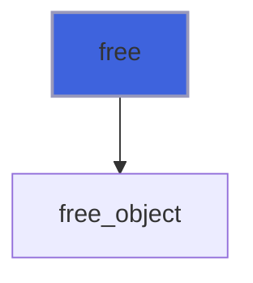
```mermaid
flowchart TD
  free["free"] --> free_object["free_object"]
  style free fill:#3e63dd,stroke:#99b,stroke-width:2px
```

### init

Initialize CLI.

```fortran
subroutine init(self, progname, version, help, description, license, authors, examples, epilog, disable_hv, usage_lun, error_lun, version_lun, error_color, error_style, ignore_unknown_clas, standalone, error_hint, no_args_is_help, ignore_env, auto_envvar_prefix, case_insensitive)
```

**Arguments**

| Name | Type | Intent | Attributes | Description |
|------|------|--------|------------|-------------|
| `self` | class([command_line_interface](/api/src/lib/flap_command_line_interface_t#command-line-interface)) | inout |  | CLI data. |
| `progname` | character(len=*) | in | optional | Program name. |
| `version` | character(len=*) | in | optional | Program version. |
| `help` | character(len=*) | in | optional | Help message introducing the CLI usage. |
| `description` | character(len=*) | in | optional | Detailed description message introducing the program. |
| `license` | character(len=*) | in | optional | License description. |
| `authors` | character(len=*) | in | optional | Authors list. |
| `examples` | character(len=*) | in | optional | Examples of correct usage. |
| `epilog` | character(len=*) | in | optional | Epilog message. |
| `disable_hv` | logical | in | optional | Disable automatic insert of 'help' and 'version' CLAs. |
| `usage_lun` | integer(kind=[I4P](/api/src/third_party/PENF/src/lib/penf_global_parameters_variables)) | in | optional | Unit number to print usage/help. |
| `error_lun` | integer(kind=[I4P](/api/src/third_party/PENF/src/lib/penf_global_parameters_variables)) | in | optional | Unit number to print error info. |
| `version_lun` | integer(kind=[I4P](/api/src/third_party/PENF/src/lib/penf_global_parameters_variables)) | in | optional | Unit number to print version/license info. |
| `error_color` | character(len=*) | in | optional | ANSI color of error messages. |
| `error_style` | character(len=*) | in | optional | ANSI style of error messages. |
| `ignore_unknown_clas` | logical | in | optional | Disable errors-raising for passed unknown CLAs. |
| `standalone` | logical | in | optional | Stop after help/version/markdown (default); if |
| `error_hint` | logical | in | optional | Print "Try 'prog --help' for help." after a failed |
| `no_args_is_help` | logical | in | optional | Print the help (STATUS_NO_ARGS) when no arguments |
| `ignore_env` | logical | in | optional | Turn every environment lookup off (F20): envvar |
| `auto_envvar_prefix` | character(len=*) | in | optional | Generate the envvar of the options without one: |
| `case_insensitive` | logical | in | optional | Match switches and command names in any case (F14); |

**Call graph**

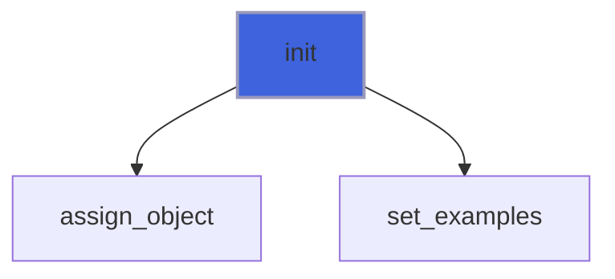
```mermaid
flowchart TD
  init["init"] --> assign_object["assign_object"]
  init["init"] --> set_examples["set_examples"]
  style init fill:#3e63dd,stroke:#99b,stroke-width:2px
```

### add_group

Add CLAs group to CLI.

 The aliases (F19 of #125) are comma separated: invoking an alias is invoking the command. An alias equal to a command
 name, to another alias, to the command itself, or blank, and a command name equal to an alias, are ERROR_GROUP_ALIAS:
 printed, returned, and kept on the command, so that parse fails too (as an invalid exclusive set).

```fortran
subroutine add_group(self, help, description, exclude, examples, group, no_args_is_help, deprecated, aliases, error)
```

**Arguments**

| Name | Type | Intent | Attributes | Description |
|------|------|--------|------------|-------------|
| `self` | class([command_line_interface](/api/src/lib/flap_command_line_interface_t#command-line-interface)) | inout |  | CLI data. |
| `help` | character(len=*) | in | optional | Help message. |
| `description` | character(len=*) | in | optional | Detailed description. |
| `exclude` | character(len=*) | in | optional | Group name of the mutually exclusive group. |
| `examples` | character(len=*) | in | optional | Examples of correct usage of the group. |
| `group` | character(len=*) | in |  | Name of the grouped CLAs. |
| `no_args_is_help` | logical | in | optional | Print the help of the group when invoked alone. |
| `deprecated` | character(len=*) | in | optional | Deprecation message ('' for none): warn when called. |
| `aliases` | character(len=*) | in | optional | Aliases of the command, comma separated (F19). |
| `error` | integer(kind=[I4P](/api/src/third_party/PENF/src/lib/penf_global_parameters_variables)) | out | optional | Error trapping flag. |

**Call graph**

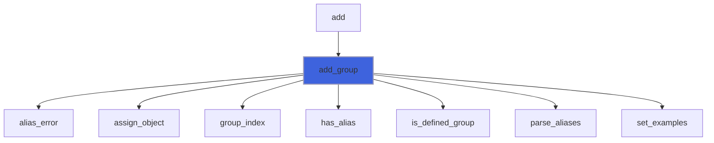
```mermaid
flowchart TD
  add["add"] --> add_group["add_group"]
  add_group["add_group"] --> alias_error["alias_error"]
  add_group["add_group"] --> assign_object["assign_object"]
  add_group["add_group"] --> group_index["group_index"]
  add_group["add_group"] --> has_alias["has_alias"]
  add_group["add_group"] --> is_defined_group["is_defined_group"]
  add_group["add_group"] --> parse_aliases["parse_aliases"]
  add_group["add_group"] --> set_examples["set_examples"]
  style add_group fill:#3e63dd,stroke:#99b,stroke-width:2px
```

### set_mutually_exclusive_groups

Set two CLAs group ad mutually exclusive.

```fortran
subroutine set_mutually_exclusive_groups(self, group1, group2)
```

**Arguments**

| Name | Type | Intent | Attributes | Description |
|------|------|--------|------------|-------------|
| `self` | class([command_line_interface](/api/src/lib/flap_command_line_interface_t#command-line-interface)) | inout |  | CLI data. |
| `group1` | character(len=*) | in |  | Name of the first grouped CLAs. |
| `group2` | character(len=*) | in |  | Name of the second grouped CLAs. |

**Call graph**

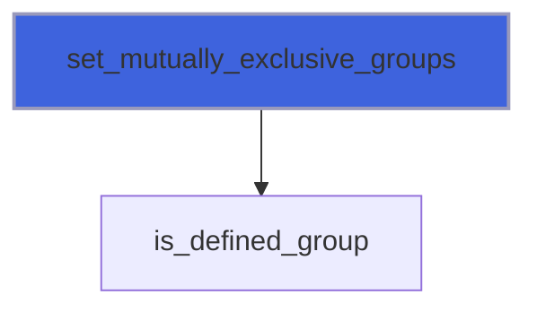
```mermaid
flowchart TD
  set_mutually_exclusive_groups["set_mutually_exclusive_groups"] --> is_defined_group["is_defined_group"]
  style set_mutually_exclusive_groups fill:#3e63dd,stroke:#99b,stroke-width:2px
```

### set_config

Set the configuration file (F08 of #125): an INI file whose values come below the environment and above the defaults.

 Read by parse, after help/version: keys are long switches without the dashes, sections are groups (commands). A
 missing file is skipped, unless required (ERROR_CONFIG_NOT_FOUND); an unknown key or a malformed line is
 ERROR_CONFIG_UNKNOWN_KEY, unless ignore_unknown_clas.

```fortran
subroutine set_config(self, file, required, error)
```

**Arguments**

| Name | Type | Intent | Attributes | Description |
|------|------|--------|------------|-------------|
| `self` | class([command_line_interface](/api/src/lib/flap_command_line_interface_t#command-line-interface)) | inout |  | CLI data. |
| `file` | character(len=*) | in |  | File name. |
| `required` | logical | in | optional | The file must exist (default .false.). |
| `error` | integer(kind=[I4P](/api/src/third_party/PENF/src/lib/penf_global_parameters_variables)) | out | optional | Error trapping flag. |

### warn_deprecated

Warn about the deprecated options and commands used (F13 of #125), on error_lun: a called command, an option whose
 value comes from the command line or the environment (not from a configuration file or the default, as in click).

```fortran
subroutine warn_deprecated(self, pref)
```

**Arguments**

| Name | Type | Intent | Attributes | Description |
|------|------|--------|------------|-------------|
| `self` | class([command_line_interface](/api/src/lib/flap_command_line_interface_t#command-line-interface)) | in |  | CLI data. |
| `pref` | character(len=*) | in | optional | Prefixing string. |

**Call graph**

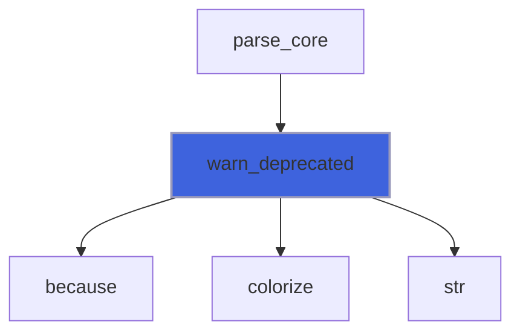
```mermaid
flowchart TD
  parse_core["parse_core"] --> warn_deprecated["warn_deprecated"]
  warn_deprecated["warn_deprecated"] --> because["because"]
  warn_deprecated["warn_deprecated"] --> colorize["colorize"]
  warn_deprecated["warn_deprecated"] --> str["str"]
  style warn_deprecated fill:#3e63dd,stroke:#99b,stroke-width:2px
```

### load_config

Load the configuration file, if any, and check it: every key must name an option taking a value (D18 of #125).

 The file is named by the top-level act='config' option when given on the command line or in its environment variable
 (then it must exist), else by set_config (which says if it must exist), else by the default of that option (skipped
 when missing).

```fortran
subroutine load_config(self, config, pref, check)
```

**Arguments**

| Name | Type | Intent | Attributes | Description |
|------|------|--------|------------|-------------|
| `self` | class([command_line_interface](/api/src/lib/flap_command_line_interface_t#command-line-interface)) | inout |  | CLI data. |
| `config` | type([config_file](/api/src/lib/flap_config_m#config-file)) | inout |  | Configuration file. |
| `pref` | character(len=*) | in | optional | Prefixing string. |
| `check` | logical | in | optional | Report a missing or invalid file (default .true.; off for an |

**Call graph**

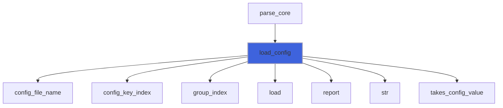
```mermaid
flowchart TD
  parse_core["parse_core"] --> load_config["load_config"]
  load_config["load_config"] --> config_file_name["config_file_name"]
  load_config["load_config"] --> config_key_index["config_key_index"]
  load_config["load_config"] --> group_index["group_index"]
  load_config["load_config"] --> load["load"]
  load_config["load_config"] --> report["report"]
  load_config["load_config"] --> str["str"]
  load_config["load_config"] --> takes_config_value["takes_config_value"]
  style load_config fill:#3e63dd,stroke:#99b,stroke-width:2px
```

### set_mutually_exclusive_switches

Set a mutually exclusive set of switches (F03 of #125): at most one member may be passed, exactly one if required.

 The members (comma separated, by switch or abbreviation) must be already added to the group, not required, and in no
 other set; otherwise the set is not added and the error is ERROR_M_EXCLUDE_SET_DEFINITION. Only passed members count:
 a default neither satisfies nor violates a set.

```fortran
subroutine set_mutually_exclusive_switches(self, switches, required, group, pref, error)
```

**Arguments**

| Name | Type | Intent | Attributes | Description |
|------|------|--------|------------|-------------|
| `self` | class([command_line_interface](/api/src/lib/flap_command_line_interface_t#command-line-interface)) | inout |  | CLI data. |
| `switches` | character(len=*) | in |  | Comma separated members, e.g. '--mesh,--restart'. |
| `required` | logical | in | optional | Exactly one member must be passed (default .false.). |
| `group` | character(len=*) | in | optional | Group (command) of the members (default: the top level). |
| `pref` | character(len=*) | in | optional | Prefixing string. |
| `error` | integer(kind=[I4P](/api/src/third_party/PENF/src/lib/penf_global_parameters_variables)) | out | optional | Error trapping flag. |

**Call graph**

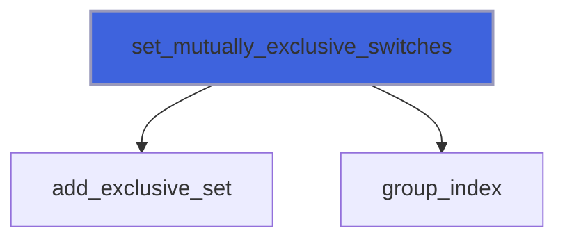
```mermaid
flowchart TD
  set_mutually_exclusive_switches["set_mutually_exclusive_switches"] --> add_exclusive_set["add_exclusive_set"]
  set_mutually_exclusive_switches["set_mutually_exclusive_switches"] --> group_index["group_index"]
  style set_mutually_exclusive_switches fill:#3e63dd,stroke:#99b,stroke-width:2px
```

### add

Add CLA to CLI.

 @note If not otherwise declared the action on CLA value is set to "store" a value that must be passed after the switch name
 or directly passed in case of positional CLA.

 @note If not otherwise speficied the CLA belongs to the default group "zero" that is the group of non-grouped CLAs.

 @note If CLA belongs to a not yet present group it is created on the fly.

```fortran
subroutine add(self, pref, group, group_index, switch, switch_ab, switch_neg, help, help_markdown, help_color, help_style, required, val_required, positional, position, hidden, act, def, nargs, choices, exclude, envvar, must_exist, readable, writable, allow_dash, deprecated, min, max, min_open, max_open, clamp, case_sensitive, map, map_keys, metavar, error)
```

**Arguments**

| Name | Type | Intent | Attributes | Description |
|------|------|--------|------------|-------------|
| `self` | class([command_line_interface](/api/src/lib/flap_command_line_interface_t#command-line-interface)) | inout |  | CLI data. |
| `pref` | character(len=*) | in | optional | Prefixing string. |
| `group` | character(len=*) | in | optional | Name of the grouped CLAs. |
| `group_index` | integer(kind=[I4P](/api/src/third_party/PENF/src/lib/penf_global_parameters_variables)) | in | optional | Index of the grouped CLAs. |
| `switch` | character(len=*) | in | optional | Switch name. |
| `switch_ab` | character(len=*) | in | optional | Abbreviated switch name. |
| `switch_neg` | character(len=*) | in | optional | Negation of a flag, --no-x (F11): the opposite value. |
| `help` | character(len=*) | in | optional | Help message describing the CLA. |
| `help_markdown` | character(len=*) | in | optional | Longer help message, markdown formatted. |
| `help_color` | character(len=*) | in | optional | ANSI color of help messages. |
| `help_style` | character(len=*) | in | optional | ANSI style of help messages. |
| `required` | logical | in | optional | Flag for set required argument. |
| `val_required` | logical | in | optional | Flag for set value required for optional argument. |
| `positional` | logical | in | optional | Flag for checking if CLA is a positional or a named CLA. |
| `position` | integer(kind=[I4P](/api/src/third_party/PENF/src/lib/penf_global_parameters_variables)) | in | optional | Position of positional CLA. |
| `hidden` | logical | in | optional | Flag for hiding CLA, thus it does not compare into help. |
| `act` | character(len=*) | in | optional | CLA value action. |
| `def` | character(len=*) | in | optional | Default value. |
| `nargs` | character(len=*) | in | optional | Number of arguments consumed by CLA. |
| `choices` | character(len=*) | in | optional | List of allowable values for the argument. |
| `exclude` | character(len=*) | in | optional | Switch name of the mutually exclusive CLA. |
| `envvar` | character(len=*) | in | optional | Environment variable from which take value. |
| `must_exist` | logical | in | optional | The value is a path that must exist (F09). |
| `readable` | logical | in | optional | The value is a path that must be readable (and exist). |
| `writable` | logical | in | optional | The value is a path writable if it exists. |
| `allow_dash` | logical | in | optional | '-' passes the path checks (standard input/output). |
| `deprecated` | character(len=*) | in | optional | Deprecation message ('' for none): warn when used (F13). |
| `min` | character(len=*) | in | optional | Minimum of the value (F05), checked by get. |
| `max` | character(len=*) | in | optional | Maximum of the value (F05), checked by get. |
| `min_open` | logical | in | optional | The minimum is excluded (default .false.). |
| `max_open` | logical | in | optional | The maximum is excluded (default .false.). |
| `clamp` | logical | in | optional | An out-of-range value becomes the bound (default .false.). |
| `case_sensitive` | logical | in | optional | Character choices match only in their case (default |
| `map` | logical | in | optional | The values are KEY=VALUE pairs (F18). |
| `map_keys` | character(len=*) | in | optional | Allowed keys of a map, comma separated (F18). |
| `metavar` | character(len=*) | in | optional | Placeholder of the value in the help (F12), default 'value'. |
| `error` | integer(kind=[I4P](/api/src/third_party/PENF/src/lib/penf_global_parameters_variables)) | out | optional | Error trapping flag. |

**Call graph**

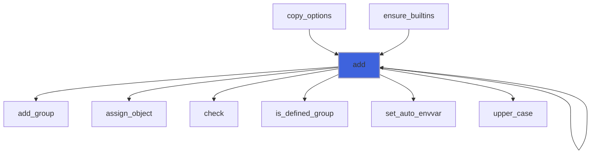
```mermaid
flowchart TD
  add["add"] --> add["add"]
  copy_options["copy_options"] --> add["add"]
  ensure_builtins["ensure_builtins"] --> add["add"]
  add["add"] --> add["add"]
  add["add"] --> add_group["add_group"]
  add["add"] --> assign_object["assign_object"]
  add["add"] --> check["check"]
  add["add"] --> is_defined_group["is_defined_group"]
  add["add"] --> set_auto_envvar["set_auto_envvar"]
  add["add"] --> upper_case["upper_case"]
  style add fill:#3e63dd,stroke:#99b,stroke-width:2px
```

### check

Check data consistency.

```fortran
subroutine check(self, pref, error)
```

**Arguments**

| Name | Type | Intent | Attributes | Description |
|------|------|--------|------------|-------------|
| `self` | class([command_line_interface](/api/src/lib/flap_command_line_interface_t#command-line-interface)) | inout |  | CLI data. |
| `pref` | character(len=*) | in | optional | Prefixing string. |
| `error` | integer(kind=[I4P](/api/src/third_party/PENF/src/lib/penf_global_parameters_variables)) | out | optional | Error trapping flag. |

**Call graph**

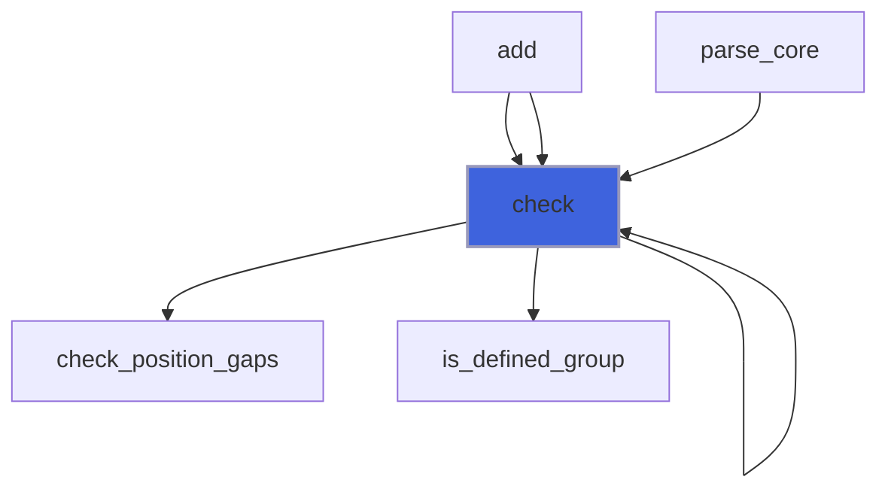
```mermaid
flowchart TD
  add["add"] --> check["check"]
  add["add"] --> check["check"]
  check["check"] --> check["check"]
  parse_core["parse_core"] --> check["check"]
  check["check"] --> check["check"]
  check["check"] --> check_position_gaps["check_position_gaps"]
  check["check"] --> is_defined_group["is_defined_group"]
  style check fill:#3e63dd,stroke:#99b,stroke-width:2px
```

### check_m_exclusive

Check if two mutually exclusive CLAs group have been called.

```fortran
subroutine check_m_exclusive(self, pref)
```

**Arguments**

| Name | Type | Intent | Attributes | Description |
|------|------|--------|------------|-------------|
| `self` | class([command_line_interface](/api/src/lib/flap_command_line_interface_t#command-line-interface)) | inout |  | CLI data. |
| `pref` | character(len=*) | in | optional | Prefixing string. |

**Call graph**

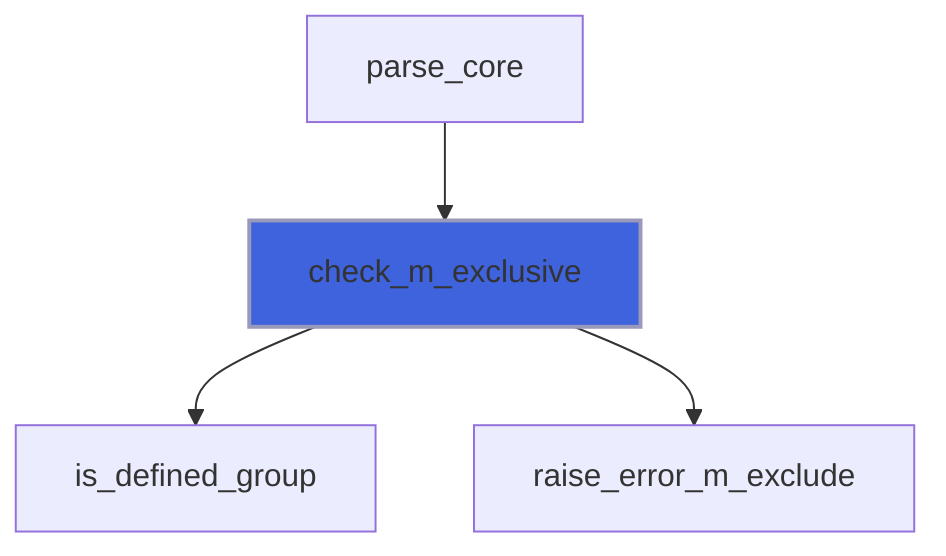
```mermaid
flowchart TD
  parse_core["parse_core"] --> check_m_exclusive["check_m_exclusive"]
  check_m_exclusive["check_m_exclusive"] --> is_defined_group["is_defined_group"]
  check_m_exclusive["check_m_exclusive"] --> raise_error_m_exclude["raise_error_m_exclude"]
  style check_m_exclusive fill:#3e63dd,stroke:#99b,stroke-width:2px
```

### reset_parse

Forget the result of a parse, keeping the definitions (options, commands, builtins): the next parse (or get) parses
 again. Without it, a second call of parse is ignored and the first result is kept.

```fortran
subroutine reset_parse(self)
```

**Arguments**

| Name | Type | Intent | Attributes | Description |
|------|------|--------|------------|-------------|
| `self` | class([command_line_interface](/api/src/lib/flap_command_line_interface_t#command-line-interface)) | inout |  | CLI data. |

**Call graph**

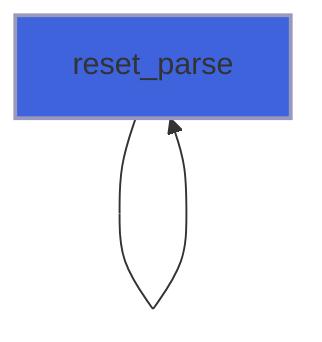
```mermaid
flowchart TD
  reset_parse["reset_parse"] --> reset_parse["reset_parse"]
  reset_parse["reset_parse"] --> reset_parse["reset_parse"]
  style reset_parse fill:#3e63dd,stroke:#99b,stroke-width:2px
```

### parse

Parse Command Line Interfaces by means of a previously initialized CLAs groups list.

 @note The leading and trailing white spaces are removed from CLA values.

 @note If the *args* argument is passed the command line arguments are taken from it and not from the actual program CLI
 invocations.

```fortran
subroutine parse(self, pref, args, error)
```

**Arguments**

| Name | Type | Intent | Attributes | Description |
|------|------|--------|------------|-------------|
| `self` | class([command_line_interface](/api/src/lib/flap_command_line_interface_t#command-line-interface)) | inout |  | CLI data. |
| `pref` | character(len=*) | in | optional | Prefixing string. |
| `args` | character(len=*) | in | optional | String containing command line arguments. |
| `error` | integer(kind=[I4P](/api/src/third_party/PENF/src/lib/penf_global_parameters_variables)) | out | optional | Error trapping flag. |

**Call graph**


```mermaid
flowchart TD
  get_cla["get_cla"] --> parse["parse"]
  get_cla_list["get_cla_list"] --> parse["parse"]
  get_cla_list_varying_I1P["get_cla_list_varying_I1P"] --> parse["parse"]
  get_cla_list_varying_I2P["get_cla_list_varying_I2P"] --> parse["parse"]
  get_cla_list_varying_I4P["get_cla_list_varying_I4P"] --> parse["parse"]
  get_cla_list_varying_I8P["get_cla_list_varying_I8P"] --> parse["parse"]
  get_cla_list_varying_R16P["get_cla_list_varying_R16P"] --> parse["parse"]
  get_cla_list_varying_R4P["get_cla_list_varying_R4P"] --> parse["parse"]
  get_cla_list_varying_R8P["get_cla_list_varying_R8P"] --> parse["parse"]
  get_cla_list_varying_char["get_cla_list_varying_char"] --> parse["parse"]
  get_cla_list_varying_logical["get_cla_list_varying_logical"] --> parse["parse"]
  get_source["get_source"] --> parse["parse"]
  map_cla["map_cla"] --> parse["parse"]
  parse_core["parse_core"] --> parse["parse"]
  provenance["provenance"] --> parse["parse"]
  parse["parse"] --> parse_core["parse_core"]
  parse["parse"] --> print_error_hint["print_error_hint"]
  style parse fill:#3e63dd,stroke:#99b,stroke-width:2px
```

### print_error_hint

Print the last line after a failed parse: "Try 'prog [command] --help' for help." (F26 of #125).

 Only when enabled (error_hint) and when there is a help option to suggest (not disable_hv); the command is the first
 called one with an error.

```fortran
subroutine print_error_hint(self)
```

**Arguments**

| Name | Type | Intent | Attributes | Description |
|------|------|--------|------------|-------------|
| `self` | class([command_line_interface](/api/src/lib/flap_command_line_interface_t#command-line-interface)) | in |  | CLI data. |

**Call graph**

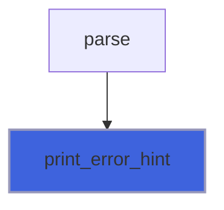
```mermaid
flowchart TD
  parse["parse"] --> print_error_hint["print_error_hint"]
  style print_error_hint fill:#3e63dd,stroke:#99b,stroke-width:2px
```

### parse_core

Parse the command line (the body of parse, which returns early once parsed and hands the error back).

```fortran
subroutine parse_core(self, pref, args)
```

**Arguments**

| Name | Type | Intent | Attributes | Description |
|------|------|--------|------------|-------------|
| `self` | class([command_line_interface](/api/src/lib/flap_command_line_interface_t#command-line-interface)) | inout |  | CLI data. |
| `pref` | character(len=*) | in | optional | Prefixing string. |
| `args` | character(len=*) | in | optional | String containing command line arguments. |

**Call graph**


```mermaid
flowchart TD
  parse["parse"] --> parse_core["parse_core"]
  parse_core["parse_core"] --> check["check"]
  parse_core["parse_core"] --> check_exclusive_sets["check_exclusive_sets"]
  parse_core["parse_core"] --> check_m_exclusive["check_m_exclusive"]
  parse_core["parse_core"] --> check_maps["check_maps"]
  parse_core["parse_core"] --> dispatch_status["dispatch_status"]
  parse_core["parse_core"] --> ensure_builtins["ensure_builtins"]
  parse_core["parse_core"] --> get_args["get_args"]
  parse_core["parse_core"] --> is_action_passed["is_action_passed"]
  parse_core["parse_core"] --> is_fatal["is_fatal"]
  parse_core["parse_core"] --> is_required_passed["is_required_passed"]
  parse_core["parse_core"] --> load_config["load_config"]
  parse_core["parse_core"] --> name_count["name_count"]
  parse_core["parse_core"] --> name_of["name_of"]
  parse_core["parse_core"] --> no_args_help["no_args_help"]
  parse_core["parse_core"] --> parse["parse"]
  parse_core["parse_core"] --> resolve_values["resolve_values"]
  parse_core["parse_core"] --> sanitize_defaults["sanitize_defaults"]
  parse_core["parse_core"] --> to_characters["to_characters"]
  parse_core["parse_core"] --> warn_deprecated["warn_deprecated"]
  style parse_core fill:#3e63dd,stroke:#99b,stroke-width:2px
```

### get_clasg_indexes

Get the argument indexes of each CLAs group (command): ai(g,1:2) is the slice of self%args belonging to group g.

 Arguments before the first command name belong to group 0; the arguments after a command name belong to that command.
 The fixed value slots of a switch (`value_arity`) are skipped before testing for a command name, so a value equal to a
 command name stays a value (B04); a variadic list is ended by a command name.

```fortran
subroutine get_clasg_indexes(self, ai)
```

**Arguments**

| Name | Type | Intent | Attributes | Description |
|------|------|--------|------------|-------------|
| `self` | class([command_line_interface](/api/src/lib/flap_command_line_interface_t#command-line-interface)) | inout |  | CLI data. |
| `ai` | integer(kind=[I4P](/api/src/third_party/PENF/src/lib/penf_global_parameters_variables)) | out | allocatable | CLAs grouped indexes. |

**Call graph**

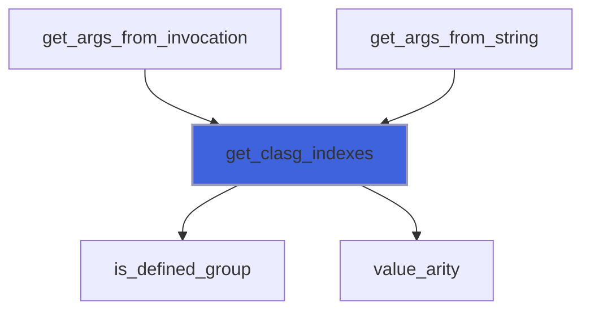
```mermaid
flowchart TD
  get_args_from_invocation["get_args_from_invocation"] --> get_clasg_indexes["get_clasg_indexes"]
  get_args_from_string["get_args_from_string"] --> get_clasg_indexes["get_clasg_indexes"]
  get_clasg_indexes["get_clasg_indexes"] --> is_defined_group["is_defined_group"]
  get_clasg_indexes["get_clasg_indexes"] --> value_arity["value_arity"]
  style get_clasg_indexes fill:#3e63dd,stroke:#99b,stroke-width:2px
```

### get_args_from_string

Get CLAs from string.

 The string is split as a shell would split a command line: see `split_command_line`.

```fortran
subroutine get_args_from_string(self, args, ai)
```

**Arguments**

| Name | Type | Intent | Attributes | Description |
|------|------|--------|------------|-------------|
| `self` | class([command_line_interface](/api/src/lib/flap_command_line_interface_t#command-line-interface)) | inout |  | CLI data. |
| `args` | character(len=*) | in |  | String containing command line arguments. |
| `ai` | integer(kind=[I4P](/api/src/third_party/PENF/src/lib/penf_global_parameters_variables)) | out | allocatable | CLAs grouped indexes. |

**Call graph**

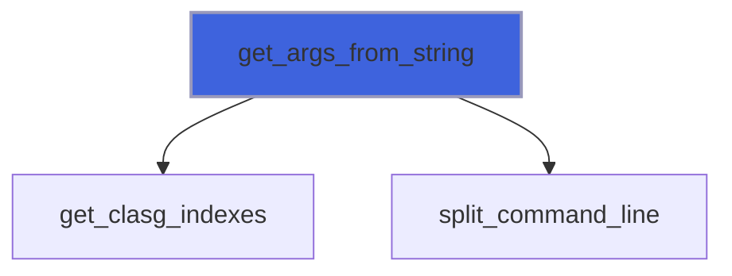
```mermaid
flowchart TD
  get_args_from_string["get_args_from_string"] --> get_clasg_indexes["get_clasg_indexes"]
  get_args_from_string["get_args_from_string"] --> split_command_line["split_command_line"]
  style get_args_from_string fill:#3e63dd,stroke:#99b,stroke-width:2px
```

### get_args_from_invocation

Get CLAs from CLI invocation.

 Every argument is read whole: its length is queried first, and a failed retrieval raises ERROR_ARGUMENT_RETRIEVAL.

```fortran
subroutine get_args_from_invocation(self, ai)
```

**Arguments**

| Name | Type | Intent | Attributes | Description |
|------|------|--------|------------|-------------|
| `self` | class([command_line_interface](/api/src/lib/flap_command_line_interface_t#command-line-interface)) | inout |  | CLI data. |
| `ai` | integer(kind=[I4P](/api/src/third_party/PENF/src/lib/penf_global_parameters_variables)) | out | allocatable | CLAs grouped indexes. |

**Call graph**

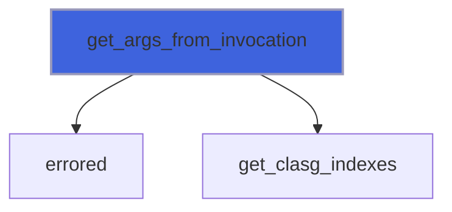
```mermaid
flowchart TD
  get_args_from_invocation["get_args_from_invocation"] --> errored["errored"]
  get_args_from_invocation["get_args_from_invocation"] --> get_clasg_indexes["get_clasg_indexes"]
  style get_args_from_invocation fill:#3e63dd,stroke:#99b,stroke-width:2px
```

### get_cla

Get CLA (single) value from CLAs list parsed.

 @note For logical type CLA the value is directly read without any robust error trapping.

```fortran
subroutine get_cla(self, val, pref, args, group, switch, position, error)
```

**Arguments**

| Name | Type | Intent | Attributes | Description |
|------|------|--------|------------|-------------|
| `self` | class([command_line_interface](/api/src/lib/flap_command_line_interface_t#command-line-interface)) | inout |  | CLI data. |
| `val` | class(*) | inout |  | CLA value. |
| `pref` | character(len=*) | in | optional | Prefixing string. |
| `args` | character(len=*) | in | optional | String containing command line arguments. |
| `group` | character(len=*) | in | optional | Name of group (command) of CLA. |
| `switch` | character(len=*) | in | optional | Switch name. |
| `position` | integer(kind=[I4P](/api/src/third_party/PENF/src/lib/penf_global_parameters_variables)) | in | optional | Position of positional CLA. |
| `error` | integer(kind=[I4P](/api/src/third_party/PENF/src/lib/penf_global_parameters_variables)) | out | optional | Error trapping flag. |

**Call graph**

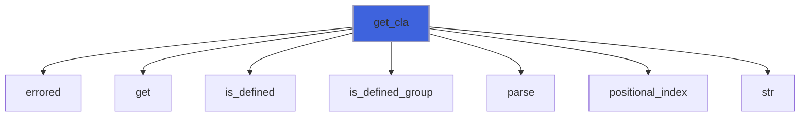
```mermaid
flowchart TD
  get_cla["get_cla"] --> errored["errored"]
  get_cla["get_cla"] --> get["get"]
  get_cla["get_cla"] --> is_defined["is_defined"]
  get_cla["get_cla"] --> is_defined_group["is_defined_group"]
  get_cla["get_cla"] --> parse["parse"]
  get_cla["get_cla"] --> positional_index["positional_index"]
  get_cla["get_cla"] --> str["str"]
  style get_cla fill:#3e63dd,stroke:#99b,stroke-width:2px
```

### get_cla_list

Get CLA multiple values from CLAs list parsed.

 @note For logical type CLA the value is directly read without any robust error trapping.

```fortran
subroutine get_cla_list(self, val, pref, args, group, switch, position, error)
```

**Arguments**

| Name | Type | Intent | Attributes | Description |
|------|------|--------|------------|-------------|
| `self` | class([command_line_interface](/api/src/lib/flap_command_line_interface_t#command-line-interface)) | inout |  | CLI data. |
| `val` | class(*) | inout |  | CLA values. |
| `pref` | character(len=*) | in | optional | Prefixing string. |
| `args` | character(len=*) | in | optional | String containing command line arguments. |
| `group` | character(len=*) | in | optional | Name of group (command) of CLA. |
| `switch` | character(len=*) | in | optional | Switch name. |
| `position` | integer(kind=[I4P](/api/src/third_party/PENF/src/lib/penf_global_parameters_variables)) | in | optional | Position of positional CLA. |
| `error` | integer(kind=[I4P](/api/src/third_party/PENF/src/lib/penf_global_parameters_variables)) | out | optional | Error trapping flag. |

**Call graph**

```mermaid
flowchart TD
  get_cla_list["get_cla_list"] --> errored["errored"]
  get_cla_list["get_cla_list"] --> get["get"]
  get_cla_list["get_cla_list"] --> is_defined["is_defined"]
  get_cla_list["get_cla_list"] --> is_defined_group["is_defined_group"]
  get_cla_list["get_cla_list"] --> parse["parse"]
  get_cla_list["get_cla_list"] --> positional_index["positional_index"]
  get_cla_list["get_cla_list"] --> str["str"]
  style get_cla_list fill:#3e63dd,stroke:#99b,stroke-width:2px
```

### get_cla_list_varying_R16P

Get CLA multiple values from CLAs list parsed with varying size list, real(R16P).

 @note The CLA list is returned deallocated if values are not correctly gotten.

 @note For logical type CLA the value is directly read without any robust error trapping.

```fortran
subroutine get_cla_list_varying_R16P(self, val, pref, args, group, switch, position, error)
```

**Arguments**

| Name | Type | Intent | Attributes | Description |
|------|------|--------|------------|-------------|
| `self` | class([command_line_interface](/api/src/lib/flap_command_line_interface_t#command-line-interface)) | inout |  | CLI data. |
| `val` | real(kind=[R16P](/api/src/third_party/PENF/src/lib/penf_global_parameters_variables)) | out | allocatable | CLA values. |
| `pref` | character(len=*) | in | optional | Prefixing string. |
| `args` | character(len=*) | in | optional | String containing command line arguments. |
| `group` | character(len=*) | in | optional | Name of group (command) of CLA. |
| `switch` | character(len=*) | in | optional | Switch name. |
| `position` | integer(kind=[I4P](/api/src/third_party/PENF/src/lib/penf_global_parameters_variables)) | in | optional | Position of positional CLA. |
| `error` | integer(kind=[I4P](/api/src/third_party/PENF/src/lib/penf_global_parameters_variables)) | out | optional | Error trapping flag. |

**Call graph**

```mermaid
flowchart TD
  get_cla_list_varying_R16P["get_cla_list_varying_R16P"] --> errored["errored"]
  get_cla_list_varying_R16P["get_cla_list_varying_R16P"] --> get_varying["get_varying"]
  get_cla_list_varying_R16P["get_cla_list_varying_R16P"] --> is_defined["is_defined"]
  get_cla_list_varying_R16P["get_cla_list_varying_R16P"] --> is_defined_group["is_defined_group"]
  get_cla_list_varying_R16P["get_cla_list_varying_R16P"] --> parse["parse"]
  get_cla_list_varying_R16P["get_cla_list_varying_R16P"] --> positional_index["positional_index"]
  get_cla_list_varying_R16P["get_cla_list_varying_R16P"] --> str["str"]
  style get_cla_list_varying_R16P fill:#3e63dd,stroke:#99b,stroke-width:2px
```

### get_cla_list_varying_R8P

Get CLA multiple values from CLAs list parsed with varying size list, real(R8P).

 @note The CLA list is returned deallocated if values are not correctly gotten.

 @note For logical type CLA the value is directly read without any robust error trapping.

```fortran
subroutine get_cla_list_varying_R8P(self, val, pref, args, group, switch, position, error)
```

**Arguments**

| Name | Type | Intent | Attributes | Description |
|------|------|--------|------------|-------------|
| `self` | class([command_line_interface](/api/src/lib/flap_command_line_interface_t#command-line-interface)) | inout |  | CLI data. |
| `val` | real(kind=[R8P](/api/src/third_party/PENF/src/lib/penf_global_parameters_variables)) | out | allocatable | CLA values. |
| `pref` | character(len=*) | in | optional | Prefixing string. |
| `args` | character(len=*) | in | optional | String containing command line arguments. |
| `group` | character(len=*) | in | optional | Name of group (command) of CLA. |
| `switch` | character(len=*) | in | optional | Switch name. |
| `position` | integer(kind=[I4P](/api/src/third_party/PENF/src/lib/penf_global_parameters_variables)) | in | optional | Position of positional CLA. |
| `error` | integer(kind=[I4P](/api/src/third_party/PENF/src/lib/penf_global_parameters_variables)) | out | optional | Error trapping flag. |

**Call graph**

```mermaid
flowchart TD
  get_cla_list_varying_R8P["get_cla_list_varying_R8P"] --> errored["errored"]
  get_cla_list_varying_R8P["get_cla_list_varying_R8P"] --> get_varying["get_varying"]
  get_cla_list_varying_R8P["get_cla_list_varying_R8P"] --> is_defined["is_defined"]
  get_cla_list_varying_R8P["get_cla_list_varying_R8P"] --> is_defined_group["is_defined_group"]
  get_cla_list_varying_R8P["get_cla_list_varying_R8P"] --> parse["parse"]
  get_cla_list_varying_R8P["get_cla_list_varying_R8P"] --> positional_index["positional_index"]
  get_cla_list_varying_R8P["get_cla_list_varying_R8P"] --> str["str"]
  style get_cla_list_varying_R8P fill:#3e63dd,stroke:#99b,stroke-width:2px
```

### get_cla_list_varying_R4P

Get CLA multiple values from CLAs list parsed with varying size list, real(R4P).

 @note The CLA list is returned deallocated if values are not correctly gotten.

 @note For logical type CLA the value is directly read without any robust error trapping.

```fortran
subroutine get_cla_list_varying_R4P(self, val, pref, args, group, switch, position, error)
```

**Arguments**

| Name | Type | Intent | Attributes | Description |
|------|------|--------|------------|-------------|
| `self` | class([command_line_interface](/api/src/lib/flap_command_line_interface_t#command-line-interface)) | inout |  | CLI data. |
| `val` | real(kind=[R4P](/api/src/third_party/PENF/src/lib/penf_global_parameters_variables)) | out | allocatable | CLA values. |
| `pref` | character(len=*) | in | optional | Prefixing string. |
| `args` | character(len=*) | in | optional | String containing command line arguments. |
| `group` | character(len=*) | in | optional | Name of group (command) of CLA. |
| `switch` | character(len=*) | in | optional | Switch name. |
| `position` | integer(kind=[I4P](/api/src/third_party/PENF/src/lib/penf_global_parameters_variables)) | in | optional | Position of positional CLA. |
| `error` | integer(kind=[I4P](/api/src/third_party/PENF/src/lib/penf_global_parameters_variables)) | out | optional | Error trapping flag. |

**Call graph**

```mermaid
flowchart TD
  get_cla_list_varying_R4P["get_cla_list_varying_R4P"] --> errored["errored"]
  get_cla_list_varying_R4P["get_cla_list_varying_R4P"] --> get_varying["get_varying"]
  get_cla_list_varying_R4P["get_cla_list_varying_R4P"] --> is_defined["is_defined"]
  get_cla_list_varying_R4P["get_cla_list_varying_R4P"] --> is_defined_group["is_defined_group"]
  get_cla_list_varying_R4P["get_cla_list_varying_R4P"] --> parse["parse"]
  get_cla_list_varying_R4P["get_cla_list_varying_R4P"] --> positional_index["positional_index"]
  get_cla_list_varying_R4P["get_cla_list_varying_R4P"] --> str["str"]
  style get_cla_list_varying_R4P fill:#3e63dd,stroke:#99b,stroke-width:2px
```

### get_cla_list_varying_I8P

Get CLA multiple values from CLAs list parsed with varying size list, integer(I8P).

 @note The CLA list is returned deallocated if values are not correctly gotten.

 @note For logical type CLA the value is directly read without any robust error trapping.

```fortran
subroutine get_cla_list_varying_I8P(self, val, pref, args, group, switch, position, error)
```

**Arguments**

| Name | Type | Intent | Attributes | Description |
|------|------|--------|------------|-------------|
| `self` | class([command_line_interface](/api/src/lib/flap_command_line_interface_t#command-line-interface)) | inout |  | CLI data. |
| `val` | integer(kind=[I8P](/api/src/third_party/PENF/src/lib/penf_global_parameters_variables)) | out | allocatable | CLA values. |
| `pref` | character(len=*) | in | optional | Prefixing string. |
| `args` | character(len=*) | in | optional | String containing command line arguments. |
| `group` | character(len=*) | in | optional | Name of group (command) of CLA. |
| `switch` | character(len=*) | in | optional | Switch name. |
| `position` | integer(kind=[I4P](/api/src/third_party/PENF/src/lib/penf_global_parameters_variables)) | in | optional | Position of positional CLA. |
| `error` | integer(kind=[I4P](/api/src/third_party/PENF/src/lib/penf_global_parameters_variables)) | out | optional | Error trapping flag. |

**Call graph**

```mermaid
flowchart TD
  get_cla_list_varying_I8P["get_cla_list_varying_I8P"] --> errored["errored"]
  get_cla_list_varying_I8P["get_cla_list_varying_I8P"] --> get_varying["get_varying"]
  get_cla_list_varying_I8P["get_cla_list_varying_I8P"] --> is_defined["is_defined"]
  get_cla_list_varying_I8P["get_cla_list_varying_I8P"] --> is_defined_group["is_defined_group"]
  get_cla_list_varying_I8P["get_cla_list_varying_I8P"] --> parse["parse"]
  get_cla_list_varying_I8P["get_cla_list_varying_I8P"] --> positional_index["positional_index"]
  get_cla_list_varying_I8P["get_cla_list_varying_I8P"] --> str["str"]
  style get_cla_list_varying_I8P fill:#3e63dd,stroke:#99b,stroke-width:2px
```

### get_cla_list_varying_I4P

Get CLA multiple values from CLAs list parsed with varying size list, integer(I4P).

 @note The CLA list is returned deallocated if values are not correctly gotten.

 @note For logical type CLA the value is directly read without any robust error trapping.

```fortran
subroutine get_cla_list_varying_I4P(self, val, pref, args, group, switch, position, error)
```

**Arguments**

| Name | Type | Intent | Attributes | Description |
|------|------|--------|------------|-------------|
| `self` | class([command_line_interface](/api/src/lib/flap_command_line_interface_t#command-line-interface)) | inout |  | CLI data. |
| `val` | integer(kind=[I4P](/api/src/third_party/PENF/src/lib/penf_global_parameters_variables)) | out | allocatable | CLA values. |
| `pref` | character(len=*) | in | optional | Prefixing string. |
| `args` | character(len=*) | in | optional | String containing command line arguments. |
| `group` | character(len=*) | in | optional | Name of group (command) of CLA. |
| `switch` | character(len=*) | in | optional | Switch name. |
| `position` | integer(kind=[I4P](/api/src/third_party/PENF/src/lib/penf_global_parameters_variables)) | in | optional | Position of positional CLA. |
| `error` | integer(kind=[I4P](/api/src/third_party/PENF/src/lib/penf_global_parameters_variables)) | out | optional | Error trapping flag. |

**Call graph**

```mermaid
flowchart TD
  get_cla_list_varying_I4P["get_cla_list_varying_I4P"] --> errored["errored"]
  get_cla_list_varying_I4P["get_cla_list_varying_I4P"] --> get_varying["get_varying"]
  get_cla_list_varying_I4P["get_cla_list_varying_I4P"] --> is_defined["is_defined"]
  get_cla_list_varying_I4P["get_cla_list_varying_I4P"] --> is_defined_group["is_defined_group"]
  get_cla_list_varying_I4P["get_cla_list_varying_I4P"] --> parse["parse"]
  get_cla_list_varying_I4P["get_cla_list_varying_I4P"] --> positional_index["positional_index"]
  get_cla_list_varying_I4P["get_cla_list_varying_I4P"] --> str["str"]
  style get_cla_list_varying_I4P fill:#3e63dd,stroke:#99b,stroke-width:2px
```

### get_cla_list_varying_I2P

Get CLA multiple values from CLAs list parsed with varying size list, integer(I2P).

 @note The CLA list is returned deallocated if values are not correctly gotten.

 @note For logical type CLA the value is directly read without any robust error trapping.

```fortran
subroutine get_cla_list_varying_I2P(self, val, pref, args, group, switch, position, error)
```

**Arguments**

| Name | Type | Intent | Attributes | Description |
|------|------|--------|------------|-------------|
| `self` | class([command_line_interface](/api/src/lib/flap_command_line_interface_t#command-line-interface)) | inout |  | CLI data. |
| `val` | integer(kind=[I2P](/api/src/third_party/PENF/src/lib/penf_global_parameters_variables)) | out | allocatable | CLA values. |
| `pref` | character(len=*) | in | optional | Prefixing string. |
| `args` | character(len=*) | in | optional | String containing command line arguments. |
| `group` | character(len=*) | in | optional | Name of group (command) of CLA. |
| `switch` | character(len=*) | in | optional | Switch name. |
| `position` | integer(kind=[I4P](/api/src/third_party/PENF/src/lib/penf_global_parameters_variables)) | in | optional | Position of positional CLA. |
| `error` | integer(kind=[I4P](/api/src/third_party/PENF/src/lib/penf_global_parameters_variables)) | out | optional | Error trapping flag. |

**Call graph**

```mermaid
flowchart TD
  get_cla_list_varying_I2P["get_cla_list_varying_I2P"] --> errored["errored"]
  get_cla_list_varying_I2P["get_cla_list_varying_I2P"] --> get_varying["get_varying"]
  get_cla_list_varying_I2P["get_cla_list_varying_I2P"] --> is_defined["is_defined"]
  get_cla_list_varying_I2P["get_cla_list_varying_I2P"] --> is_defined_group["is_defined_group"]
  get_cla_list_varying_I2P["get_cla_list_varying_I2P"] --> parse["parse"]
  get_cla_list_varying_I2P["get_cla_list_varying_I2P"] --> positional_index["positional_index"]
  get_cla_list_varying_I2P["get_cla_list_varying_I2P"] --> str["str"]
  style get_cla_list_varying_I2P fill:#3e63dd,stroke:#99b,stroke-width:2px
```

### get_cla_list_varying_I1P

Get CLA multiple values from CLAs list parsed with varying size list, integer(I1P).

 @note The CLA list is returned deallocated if values are not correctly gotten.

 @note For logical type CLA the value is directly read without any robust error trapping.

```fortran
subroutine get_cla_list_varying_I1P(self, val, pref, args, group, switch, position, error)
```

**Arguments**

| Name | Type | Intent | Attributes | Description |
|------|------|--------|------------|-------------|
| `self` | class([command_line_interface](/api/src/lib/flap_command_line_interface_t#command-line-interface)) | inout |  | CLI data. |
| `val` | integer(kind=[I1P](/api/src/third_party/PENF/src/lib/penf_global_parameters_variables)) | out | allocatable | CLA values. |
| `pref` | character(len=*) | in | optional | Prefixing string. |
| `args` | character(len=*) | in | optional | String containing command line arguments. |
| `group` | character(len=*) | in | optional | Name of group (command) of CLA. |
| `switch` | character(len=*) | in | optional | Switch name. |
| `position` | integer(kind=[I4P](/api/src/third_party/PENF/src/lib/penf_global_parameters_variables)) | in | optional | Position of positional CLA. |
| `error` | integer(kind=[I4P](/api/src/third_party/PENF/src/lib/penf_global_parameters_variables)) | out | optional | Error trapping flag. |

**Call graph**

```mermaid
flowchart TD
  get_cla_list_varying_I1P["get_cla_list_varying_I1P"] --> errored["errored"]
  get_cla_list_varying_I1P["get_cla_list_varying_I1P"] --> get_varying["get_varying"]
  get_cla_list_varying_I1P["get_cla_list_varying_I1P"] --> is_defined["is_defined"]
  get_cla_list_varying_I1P["get_cla_list_varying_I1P"] --> is_defined_group["is_defined_group"]
  get_cla_list_varying_I1P["get_cla_list_varying_I1P"] --> parse["parse"]
  get_cla_list_varying_I1P["get_cla_list_varying_I1P"] --> positional_index["positional_index"]
  get_cla_list_varying_I1P["get_cla_list_varying_I1P"] --> str["str"]
  style get_cla_list_varying_I1P fill:#3e63dd,stroke:#99b,stroke-width:2px
```

### get_cla_list_varying_logical

Get CLA multiple values from CLAs list parsed with varying size list, logical.

 @note The CLA list is returned deallocated if values are not correctly gotten.

 @note For logical type CLA the value is directly read without any robust error trapping.

```fortran
subroutine get_cla_list_varying_logical(self, val, pref, args, group, switch, position, error)
```

**Arguments**

| Name | Type | Intent | Attributes | Description |
|------|------|--------|------------|-------------|
| `self` | class([command_line_interface](/api/src/lib/flap_command_line_interface_t#command-line-interface)) | inout |  | CLI data. |
| `val` | logical | out | allocatable | CLA values. |
| `pref` | character(len=*) | in | optional | Prefixing string. |
| `args` | character(len=*) | in | optional | String containing command line arguments. |
| `group` | character(len=*) | in | optional | Name of group (command) of CLA. |
| `switch` | character(len=*) | in | optional | Switch name. |
| `position` | integer(kind=[I4P](/api/src/third_party/PENF/src/lib/penf_global_parameters_variables)) | in | optional | Position of positional CLA. |
| `error` | integer(kind=[I4P](/api/src/third_party/PENF/src/lib/penf_global_parameters_variables)) | out | optional | Error trapping flag. |

**Call graph**

```mermaid
flowchart TD
  get_cla_list_varying_logical["get_cla_list_varying_logical"] --> errored["errored"]
  get_cla_list_varying_logical["get_cla_list_varying_logical"] --> get_varying["get_varying"]
  get_cla_list_varying_logical["get_cla_list_varying_logical"] --> is_defined["is_defined"]
  get_cla_list_varying_logical["get_cla_list_varying_logical"] --> is_defined_group["is_defined_group"]
  get_cla_list_varying_logical["get_cla_list_varying_logical"] --> parse["parse"]
  get_cla_list_varying_logical["get_cla_list_varying_logical"] --> positional_index["positional_index"]
  get_cla_list_varying_logical["get_cla_list_varying_logical"] --> str["str"]
  style get_cla_list_varying_logical fill:#3e63dd,stroke:#99b,stroke-width:2px
```

### copy_options

Copy named options of a group (default the top level) into another group (F21 of #125): by value, every definition and
 none of the runtime state, so each copy has its own value. Without switches, every named option but the builtins;
 with switches (comma separated), those, all checked before any copy. A generated envvar (auto_envvar_prefix) is
 generated again for the target group, an explicit one is copied verbatim. Errors: ERROR_MISSING_GROUP,
 ERROR_MISSING_CLA, ERROR_COPY_POSITIONAL, and the consistency error of the target group (a switch it defines).

```fortran
subroutine copy_options(self, to_group, from_group, switches, pref, error)
```

**Arguments**

| Name | Type | Intent | Attributes | Description |
|------|------|--------|------------|-------------|
| `self` | class([command_line_interface](/api/src/lib/flap_command_line_interface_t#command-line-interface)) | inout |  | CLI data. |
| `to_group` | character(len=*) | in |  | Target group (command). |
| `from_group` | character(len=*) | in | optional | Source group (command), default the top level. |
| `switches` | character(len=*) | in | optional | Switches to copy, comma separated (default all). |
| `pref` | character(len=*) | in | optional | Prefixing string. |
| `error` | integer(kind=[I4P](/api/src/third_party/PENF/src/lib/penf_global_parameters_variables)) | out | optional | Error trapping flag. |

**Call graph**

```mermaid
flowchart TD
  copy_options["copy_options"] --> add["add"]
  copy_options["copy_options"] --> envvar_name["envvar_name"]
  copy_options["copy_options"] --> errored["errored"]
  copy_options["copy_options"] --> group_index["group_index"]
  copy_options["copy_options"] --> is_builtin["is_builtin"]
  copy_options["copy_options"] --> is_defined["is_defined"]
  copy_options["copy_options"] --> is_positional_name["is_positional_name"]
  style copy_options fill:#3e63dd,stroke:#99b,stroke-width:2px
```

### get_map

Get the keys and values of a map option (F18 of #125), in the order given; passed pairs replace the default ones.

```fortran
subroutine get_map(self, switch, keys, values, group, pref, args, error)
```

**Arguments**

| Name | Type | Intent | Attributes | Description |
|------|------|--------|------------|-------------|
| `self` | class([command_line_interface](/api/src/lib/flap_command_line_interface_t#command-line-interface)) | inout |  | CLI data. |
| `switch` | character(len=*) | in |  | Switch name. |
| `keys` | character(len=*) | out | allocatable | Keys. |
| `values` | character(len=*) | out | allocatable | Values. |
| `group` | character(len=*) | in | optional | Name of group (command) of CLA. |
| `pref` | character(len=*) | in | optional | Prefixing string. |
| `args` | character(len=*) | in | optional | String containing command line arguments. |
| `error` | integer(kind=[I4P](/api/src/third_party/PENF/src/lib/penf_global_parameters_variables)) | out | optional | Error trapping flag. |

**Call graph**

```mermaid
flowchart TD
  get_map["get_map"] --> get_map["get_map"]
  get_map["get_map"] --> get_map["get_map"]
  get_map["get_map"] --> map_cla["map_cla"]
  style get_map fill:#3e63dd,stroke:#99b,stroke-width:2px
```

### get_map_value

Get the value of a key of a map option, converted to the type of val (F18 of #125). A missing key leaves val untouched:
 found=.false., or ERROR_MAP_KEY_MISSING when found is absent.

```fortran
subroutine get_map_value(self, switch, key, val, found, group, pref, args, error)
```

**Arguments**

| Name | Type | Intent | Attributes | Description |
|------|------|--------|------------|-------------|
| `self` | class([command_line_interface](/api/src/lib/flap_command_line_interface_t#command-line-interface)) | inout |  | CLI data. |
| `switch` | character(len=*) | in |  | Switch name. |
| `key` | character(len=*) | in |  | Key. |
| `val` | class(*) | inout |  | Value. |
| `found` | logical | out | optional | The key is in the map. |
| `group` | character(len=*) | in | optional | Name of group (command) of CLA. |
| `pref` | character(len=*) | in | optional | Prefixing string. |
| `args` | character(len=*) | in | optional | String containing command line arguments. |
| `error` | integer(kind=[I4P](/api/src/third_party/PENF/src/lib/penf_global_parameters_variables)) | out | optional | Error trapping flag. |

**Call graph**

```mermaid
flowchart TD
  get_map_value["get_map_value"] --> get_map_value["get_map_value"]
  get_map_value["get_map_value"] --> get_map_value["get_map_value"]
  get_map_value["get_map_value"] --> map_cla["map_cla"]
  style get_map_value fill:#3e63dd,stroke:#99b,stroke-width:2px
```

### get_cla_list_varying_char

Get CLA multiple values from CLAs list parsed with varying size list, character.

 @note The CLA list is returned deallocated if values are not correctly gotten.

 @note For logical type CLA the value is directly read without any robust error trapping.

```fortran
subroutine get_cla_list_varying_char(self, val, pref, args, group, switch, position, error)
```

**Arguments**

| Name | Type | Intent | Attributes | Description |
|------|------|--------|------------|-------------|
| `self` | class([command_line_interface](/api/src/lib/flap_command_line_interface_t#command-line-interface)) | inout |  | CLI data. |
| `val` | character(len=*) | out | allocatable | CLA values. |
| `pref` | character(len=*) | in | optional | Prefixing string. |
| `args` | character(len=*) | in | optional | String containing command line arguments. |
| `group` | character(len=*) | in | optional | Name of group (command) of CLA. |
| `switch` | character(len=*) | in | optional | Switch name. |
| `position` | integer(kind=[I4P](/api/src/third_party/PENF/src/lib/penf_global_parameters_variables)) | in | optional | Position of positional CLA. |
| `error` | integer(kind=[I4P](/api/src/third_party/PENF/src/lib/penf_global_parameters_variables)) | out | optional | Error trapping flag. |

**Call graph**

```mermaid
flowchart TD
  get_cla_list_varying_char["get_cla_list_varying_char"] --> errored["errored"]
  get_cla_list_varying_char["get_cla_list_varying_char"] --> get_varying["get_varying"]
  get_cla_list_varying_char["get_cla_list_varying_char"] --> is_defined["is_defined"]
  get_cla_list_varying_char["get_cla_list_varying_char"] --> is_defined_group["is_defined_group"]
  get_cla_list_varying_char["get_cla_list_varying_char"] --> parse["parse"]
  get_cla_list_varying_char["get_cla_list_varying_char"] --> positional_index["positional_index"]
  get_cla_list_varying_char["get_cla_list_varying_char"] --> str["str"]
  style get_cla_list_varying_char fill:#3e63dd,stroke:#99b,stroke-width:2px
```

### ensure_builtins

Add the builtin CLAs if not done by the user: --help, --markdown and --version (unless disabled) and the hidden "--"
 collecting trailing arguments, in every group. Idempotent.

 Called by parse and, on a copy, by every output method (usage, signature, save_*), so that their output is the same
 before and after parse (#125, B09).

```fortran
subroutine ensure_builtins(self, pref)
```

**Arguments**

| Name | Type | Intent | Attributes | Description |
|------|------|--------|------------|-------------|
| `self` | class([command_line_interface](/api/src/lib/flap_command_line_interface_t#command-line-interface)) | inout |  | CLI data. |
| `pref` | character(len=*) | in | optional | Prefixing string. |

**Call graph**

```mermaid
flowchart TD
  parse_core["parse_core"] --> ensure_builtins["ensure_builtins"]
  save_bash_completion["save_bash_completion"] --> ensure_builtins["ensure_builtins"]
  save_man_page["save_man_page"] --> ensure_builtins["ensure_builtins"]
  save_usage_to_markdown["save_usage_to_markdown"] --> ensure_builtins["ensure_builtins"]
  save_zsh_completion["save_zsh_completion"] --> ensure_builtins["ensure_builtins"]
  signature["signature"] --> ensure_builtins["ensure_builtins"]
  usage["usage"] --> ensure_builtins["ensure_builtins"]
  ensure_builtins["ensure_builtins"] --> add["add"]
  ensure_builtins["ensure_builtins"] --> add_builtin["add_builtin"]
  ensure_builtins["ensure_builtins"] --> is_defined["is_defined"]
  style ensure_builtins fill:#3e63dd,stroke:#99b,stroke-width:2px
```

### save_bash_completion

Save bash completion script (for named CLAs only), builtins included whether or not parse has been called.

```fortran
subroutine save_bash_completion(self, bash_file, error)
```

**Arguments**

| Name | Type | Intent | Attributes | Description |
|------|------|--------|------------|-------------|
| `self` | class([command_line_interface](/api/src/lib/flap_command_line_interface_t#command-line-interface)) | in |  | CLI data. |
| `bash_file` | character(len=*) | in |  | Output file name of bash completion script. |
| `error` | integer(kind=[I4P](/api/src/third_party/PENF/src/lib/penf_global_parameters_variables)) | out | optional | Error trapping flag. |

**Call graph**

```mermaid
flowchart TD
  save_bash_completion["save_bash_completion"] --> builtins_missing["builtins_missing"]
  save_bash_completion["save_bash_completion"] --> ensure_builtins["ensure_builtins"]
  save_bash_completion["save_bash_completion"] --> save_bash_completion_core["save_bash_completion_core"]
  style save_bash_completion fill:#3e63dd,stroke:#99b,stroke-width:2px
```

### save_zsh_completion

Save zsh completion script (F15 of #125): the bash script behind zsh's bashcompinit, to be sourced (e.g. from .zshrc);
 builtins included whether or not parse has been called.

```fortran
subroutine save_zsh_completion(self, zsh_file, error)
```

**Arguments**

| Name | Type | Intent | Attributes | Description |
|------|------|--------|------------|-------------|
| `self` | class([command_line_interface](/api/src/lib/flap_command_line_interface_t#command-line-interface)) | in |  | CLI data. |
| `zsh_file` | character(len=*) | in |  | Output file name of zsh completion script. |
| `error` | integer(kind=[I4P](/api/src/third_party/PENF/src/lib/penf_global_parameters_variables)) | out | optional | Error trapping flag. |

**Call graph**

```mermaid
flowchart TD
  save_zsh_completion["save_zsh_completion"] --> builtins_missing["builtins_missing"]
  save_zsh_completion["save_zsh_completion"] --> ensure_builtins["ensure_builtins"]
  save_zsh_completion["save_zsh_completion"] --> save_bash_completion_core["save_bash_completion_core"]
  style save_zsh_completion fill:#3e63dd,stroke:#99b,stroke-width:2px
```

### save_man_page

Save CLI usage as man page, builtins included whether or not parse has been called.

```fortran
subroutine save_man_page(self, man_file, error)
```

**Arguments**

| Name | Type | Intent | Attributes | Description |
|------|------|--------|------------|-------------|
| `self` | class([command_line_interface](/api/src/lib/flap_command_line_interface_t#command-line-interface)) | in |  | CLI data. |
| `man_file` | character(len=*) | in |  | Output file name for saving man page. |
| `error` | integer(kind=[I4P](/api/src/third_party/PENF/src/lib/penf_global_parameters_variables)) | out | optional | Error trapping flag. |

**Call graph**

```mermaid
flowchart TD
  save_man_page["save_man_page"] --> builtins_missing["builtins_missing"]
  save_man_page["save_man_page"] --> ensure_builtins["ensure_builtins"]
  save_man_page["save_man_page"] --> save_man_page_core["save_man_page_core"]
  style save_man_page fill:#3e63dd,stroke:#99b,stroke-width:2px
```

### save_usage_to_markdown

Save CLI usage as markdown, builtins included whether or not parse has been called.

```fortran
subroutine save_usage_to_markdown(self, markdown_file, error)
```

**Arguments**

| Name | Type | Intent | Attributes | Description |
|------|------|--------|------------|-------------|
| `self` | class([command_line_interface](/api/src/lib/flap_command_line_interface_t#command-line-interface)) | in |  | CLI data. |
| `markdown_file` | character(len=*) | in |  | Output file name for saving markdown. |
| `error` | integer(kind=[I4P](/api/src/third_party/PENF/src/lib/penf_global_parameters_variables)) | out | optional | Error trapping flag. |

**Call graph**

```mermaid
flowchart TD
  dispatch_status["dispatch_status"] --> save_usage_to_markdown["save_usage_to_markdown"]
  save_usage_to_markdown["save_usage_to_markdown"] --> builtins_missing["builtins_missing"]
  save_usage_to_markdown["save_usage_to_markdown"] --> ensure_builtins["ensure_builtins"]
  save_usage_to_markdown["save_usage_to_markdown"] --> save_usage_to_markdown_core["save_usage_to_markdown_core"]
  style save_usage_to_markdown fill:#3e63dd,stroke:#99b,stroke-width:2px
```

### print_usage

Print correct usage.

```fortran
subroutine print_usage(self, pref)
```

**Arguments**

| Name | Type | Intent | Attributes | Description |
|------|------|--------|------------|-------------|
| `self` | class([command_line_interface](/api/src/lib/flap_command_line_interface_t#command-line-interface)) | in |  | CLI data. |
| `pref` | character(len=*) | in | optional | Prefixing string. |

**Call graph**

```mermaid
flowchart TD
  print_usage["print_usage"] --> usage["usage"]
  print_usage["print_usage"] --> write_text["write_text"]
  style print_usage fill:#3e63dd,stroke:#99b,stroke-width:2px
```

### save_bash_completion_core

Save bash completion script (for named CLAs only), registered with `complete -o default` (an empty completion falls
 back to file names, F15 of #125); with zsh, the same script behind zsh's bashcompinit.

```fortran
subroutine save_bash_completion_core(self, bash_file, error, zsh)
```

**Arguments**

| Name | Type | Intent | Attributes | Description |
|------|------|--------|------------|-------------|
| `self` | class([command_line_interface](/api/src/lib/flap_command_line_interface_t#command-line-interface)) | in |  | CLI data. |
| `bash_file` | character(len=*) | in |  | Output file name of bash completion script. |
| `error` | integer(kind=[I4P](/api/src/third_party/PENF/src/lib/penf_global_parameters_variables)) | out | optional | Error trapping flag. |
| `zsh` | logical | in | optional | Write the zsh script (default .false.). |

**Call graph**

```mermaid
flowchart TD
  save_bash_completion["save_bash_completion"] --> save_bash_completion_core["save_bash_completion_core"]
  save_zsh_completion["save_zsh_completion"] --> save_bash_completion_core["save_bash_completion_core"]
  save_bash_completion_core["save_bash_completion_core"] --> basename["basename"]
  save_bash_completion_core["save_bash_completion_core"] --> names["names"]
  save_bash_completion_core["save_bash_completion_core"] --> signature["signature"]
  style save_bash_completion_core fill:#3e63dd,stroke:#99b,stroke-width:2px
```

### save_man_page_core

Save CLI usage as man page.

```fortran
subroutine save_man_page_core(self, man_file, error)
```

**Arguments**

| Name | Type | Intent | Attributes | Description |
|------|------|--------|------------|-------------|
| `self` | class([command_line_interface](/api/src/lib/flap_command_line_interface_t#command-line-interface)) | in |  | CLI data. |
| `man_file` | character(len=*) | in |  | Output file name for saving man page. |
| `error` | integer(kind=[I4P](/api/src/third_party/PENF/src/lib/penf_global_parameters_variables)) | out | optional | Error trapping flag. |

**Call graph**

```mermaid
flowchart TD
  save_man_page["save_man_page"] --> save_man_page_core["save_man_page_core"]
  save_man_page_core["save_man_page_core"] --> signature["signature"]
  save_man_page_core["save_man_page_core"] --> strz["strz"]
  save_man_page_core["save_man_page_core"] --> usage["usage"]
  style save_man_page_core fill:#3e63dd,stroke:#99b,stroke-width:2px
```

### save_usage_to_markdown_core

Save CLI usage as markdown.

```fortran
subroutine save_usage_to_markdown_core(self, markdown_file, error)
```

**Arguments**

| Name | Type | Intent | Attributes | Description |
|------|------|--------|------------|-------------|
| `self` | class([command_line_interface](/api/src/lib/flap_command_line_interface_t#command-line-interface)) | in |  | CLI data. |
| `markdown_file` | character(len=*) | in |  | Output file name for saving man page. |
| `error` | integer(kind=[I4P](/api/src/third_party/PENF/src/lib/penf_global_parameters_variables)) | out | optional | Error trapping flag. |

**Call graph**

```mermaid
flowchart TD
  save_usage_to_markdown["save_usage_to_markdown"] --> save_usage_to_markdown_core["save_usage_to_markdown_core"]
  save_usage_to_markdown_core["save_usage_to_markdown_core"] --> signature["signature"]
  save_usage_to_markdown_core["save_usage_to_markdown_core"] --> strz["strz"]
  save_usage_to_markdown_core["save_usage_to_markdown_core"] --> usage["usage"]
  style save_usage_to_markdown_core fill:#3e63dd,stroke:#99b,stroke-width:2px
```

### errored

Trig error occurrence and print meaningful message.

```fortran
subroutine errored(self, error, pref, group, switch, position)
```

**Arguments**

| Name | Type | Intent | Attributes | Description |
|------|------|--------|------------|-------------|
| `self` | class([command_line_interface](/api/src/lib/flap_command_line_interface_t#command-line-interface)) | inout |  | Object data. |
| `error` | integer(kind=[I4P](/api/src/third_party/PENF/src/lib/penf_global_parameters_variables)) | in |  | Error occurred. |
| `pref` | character(len=*) | in | optional | Prefixing string. |
| `group` | character(len=*) | in | optional | Group name. |
| `switch` | character(len=*) | in | optional | CLA switch name. |
| `position` | integer(kind=[I4P](/api/src/third_party/PENF/src/lib/penf_global_parameters_variables)) | in | optional | Position of the command line argument. |

**Call graph**

```mermaid
flowchart TD
  add_exclusive_set["add_exclusive_set"] --> errored["errored"]
  check["check"] --> errored["errored"]
  check["check"] --> errored["errored"]
  check_action_consistency["check_action_consistency"] --> errored["errored"]
  check_alternate_consistency["check_alternate_consistency"] --> errored["errored"]
  check_append_consistency["check_append_consistency"] --> errored["errored"]
  check_choices["check_choices"] --> errored["errored"]
  check_count_consistency["check_count_consistency"] --> errored["errored"]
  check_def_nargs_consistency["check_def_nargs_consistency"] --> errored["errored"]
  check_envvar_consistency["check_envvar_consistency"] --> errored["errored"]
  check_exclusive_sets["check_exclusive_sets"] --> errored["errored"]
  check_list_size["check_list_size"] --> errored["errored"]
  check_m_exclude_consistency["check_m_exclude_consistency"] --> errored["errored"]
  check_map_consistency["check_map_consistency"] --> errored["errored"]
  check_map_list["check_map_list"] --> errored["errored"]
  check_named_consistency["check_named_consistency"] --> errored["errored"]
  check_optional_consistency["check_optional_consistency"] --> errored["errored"]
  check_path_consistency["check_path_consistency"] --> errored["errored"]
  check_paths["check_paths"] --> errored["errored"]
  check_position_gaps["check_position_gaps"] --> errored["errored"]
  check_positional_consistency["check_positional_consistency"] --> errored["errored"]
  check_range["check_range"] --> errored["errored"]
  check_range_consistency["check_range_consistency"] --> errored["errored"]
  check_switch_neg_consistency["check_switch_neg_consistency"] --> errored["errored"]
  copy_options["copy_options"] --> errored["errored"]
  get_args_from_invocation["get_args_from_invocation"] --> errored["errored"]
  get_cla["get_cla"] --> errored["errored"]
  get_cla["get_cla"] --> errored["errored"]
  get_cla_from_buffer["get_cla_from_buffer"] --> errored["errored"]
  get_cla_list["get_cla_list"] --> errored["errored"]
  get_cla_list["get_cla_list"] --> errored["errored"]
  get_cla_list_from_buffer["get_cla_list_from_buffer"] --> errored["errored"]
  get_cla_list_varying_I1P["get_cla_list_varying_I1P"] --> errored["errored"]
  get_cla_list_varying_I1P["get_cla_list_varying_I1P"] --> errored["errored"]
  get_cla_list_varying_I2P["get_cla_list_varying_I2P"] --> errored["errored"]
  get_cla_list_varying_I2P["get_cla_list_varying_I2P"] --> errored["errored"]
  get_cla_list_varying_I4P["get_cla_list_varying_I4P"] --> errored["errored"]
  get_cla_list_varying_I4P["get_cla_list_varying_I4P"] --> errored["errored"]
  get_cla_list_varying_I8P["get_cla_list_varying_I8P"] --> errored["errored"]
  get_cla_list_varying_I8P["get_cla_list_varying_I8P"] --> errored["errored"]
  get_cla_list_varying_R16P["get_cla_list_varying_R16P"] --> errored["errored"]
  get_cla_list_varying_R16P["get_cla_list_varying_R16P"] --> errored["errored"]
  get_cla_list_varying_R4P["get_cla_list_varying_R4P"] --> errored["errored"]
  get_cla_list_varying_R4P["get_cla_list_varying_R4P"] --> errored["errored"]
  get_cla_list_varying_R8P["get_cla_list_varying_R8P"] --> errored["errored"]
  get_cla_list_varying_R8P["get_cla_list_varying_R8P"] --> errored["errored"]
  get_cla_list_varying_char["get_cla_list_varying_char"] --> errored["errored"]
  get_cla_list_varying_char["get_cla_list_varying_char"] --> errored["errored"]
  get_cla_list_varying_logical["get_cla_list_varying_logical"] --> errored["errored"]
  get_cla_list_varying_logical["get_cla_list_varying_logical"] --> errored["errored"]
  get_map["get_map"] --> errored["errored"]
  get_map_value["get_map_value"] --> errored["errored"]
  get_source["get_source"] --> errored["errored"]
  is_required_passed["is_required_passed"] --> errored["errored"]
  is_required_val_passed["is_required_val_passed"] --> errored["errored"]
  map_cla["map_cla"] --> errored["errored"]
  raise_error_duplicated_clas["raise_error_duplicated_clas"] --> errored["errored"]
  raise_error_m_exclude["raise_error_m_exclude"] --> errored["errored"]
  raise_error_m_exclude["raise_error_m_exclude"] --> errored["errored"]
  raise_error_nargs_insufficient["raise_error_nargs_insufficient"] --> errored["errored"]
  raise_error_switch_unknown["raise_error_switch_unknown"] --> errored["errored"]
  raise_error_value_missing["raise_error_value_missing"] --> errored["errored"]
  set_inline_value["set_inline_value"] --> errored["errored"]
  set_source_value["set_source_value"] --> errored["errored"]
  errored["errored"] --> error_prefix["error_prefix"]
  errored["errored"] --> print_error_message["print_error_message"]
  errored["errored"] --> str["str"]
  style errored fill:#3e63dd,stroke:#99b,stroke-width:2px
```

### finalize

Free dynamic memory when finalizing.

**Attributes**: elemental

```fortran
subroutine finalize(self)
```

**Arguments**

| Name | Type | Intent | Attributes | Description |
|------|------|--------|------------|-------------|
| `self` | type([command_line_interface](/api/src/lib/flap_command_line_interface_t#command-line-interface)) | inout |  | CLI data. |

### quiet_stop

End the program with an exit status, printing nothing (help/version/markdown: 0; no arguments: 2).

 F2018 `stop code, quiet=.true.`; nvfortran 26.5 rejects `quiet=` and prints "FORTRAN STOP" on a plain `stop`, so it
 uses its `exit` extension (B33 of #125).

```fortran
subroutine quiet_stop(code)
```

**Arguments**

| Name | Type | Intent | Attributes | Description |
|------|------|--------|------------|-------------|
| `code` | integer(kind=[I4P](/api/src/third_party/PENF/src/lib/penf_global_parameters_variables)) | in |  | Exit status. |

**Call graph**

```mermaid
flowchart TD
  dispatch_status["dispatch_status"] --> quiet_stop["quiet_stop"]
  no_args_help["no_args_help"] --> quiet_stop["quiet_stop"]
  style quiet_stop fill:#3e63dd,stroke:#99b,stroke-width:2px
```

## Functions

### get_source

Return the source of the value of a CLA (SOURCE_COMMANDLINE, _ENVIRONMENT, _CONFIG, _DEFAULT, _NONE; F06 of #125).

 Like get, it parses first if parse has not been called; an undefined CLA or group returns SOURCE_NONE with the error.

**Returns**: integer(kind=[I4P](/api/src/third_party/PENF/src/lib/penf_global_parameters_variables))

```fortran
function get_source(self, group, switch, position, pref, error) result(source)
```

**Arguments**

| Name | Type | Intent | Attributes | Description |
|------|------|--------|------------|-------------|
| `self` | class([command_line_interface](/api/src/lib/flap_command_line_interface_t#command-line-interface)) | inout |  | CLI data. |
| `group` | character(len=*) | in | optional | Name of group (command) of CLA. |
| `switch` | character(len=*) | in | optional | Switch name. |
| `position` | integer(kind=[I4P](/api/src/third_party/PENF/src/lib/penf_global_parameters_variables)) | in | optional | Position of positional CLA. |
| `pref` | character(len=*) | in | optional | Prefixing string. |
| `error` | integer(kind=[I4P](/api/src/third_party/PENF/src/lib/penf_global_parameters_variables)) | out | optional | Error trapping flag. |

**Call graph**

```mermaid
flowchart TD
  get_source["get_source"] --> errored["errored"]
  get_source["get_source"] --> is_defined["is_defined"]
  get_source["get_source"] --> is_defined_group["is_defined_group"]
  get_source["get_source"] --> parse["parse"]
  get_source["get_source"] --> positional_index["positional_index"]
  get_source["get_source"] --> str["str"]
  style get_source fill:#3e63dd,stroke:#99b,stroke-width:2px
```

### provenance

Return a report of every value with its source, for a run log (F06 of #125): one line per visible option of the top
 level and of the called commands, `name = value [source]`, the environment and configuration sources naming their
 variable and file. Builtins and hidden options are left out; like get, it parses first if parse has not been called.

**Returns**: `character(len=:)`

```fortran
function provenance(self, pref) result(report)
```

**Arguments**

| Name | Type | Intent | Attributes | Description |
|------|------|--------|------------|-------------|
| `self` | class([command_line_interface](/api/src/lib/flap_command_line_interface_t#command-line-interface)) | inout |  | CLI data. |
| `pref` | character(len=*) | in | optional | Prefixing string. |

**Call graph**

```mermaid
flowchart TD
  provenance["provenance"] --> parse["parse"]
  provenance["provenance"] --> str["str"]
  provenance["provenance"] --> value_text["value_text"]
  style provenance fill:#3e63dd,stroke:#99b,stroke-width:2px
```

### envvar_name

Return the generated name of an environment variable: PREFIX[_GROUP]_NAME, upper case, NAME being the switch without its
 leading dashes, '-' becoming '_' (auto_envvar_prefix, F07 of #125; click's rule).

**Attributes**: pure

**Returns**: `character(len=:)`

```fortran
function envvar_name(prefix, group, switch) result(name)
```

**Arguments**

| Name | Type | Intent | Attributes | Description |
|------|------|--------|------------|-------------|
| `prefix` | character(len=*) | in |  | Prefix. |
| `group` | character(len=*) | in |  | Group (command), '' for the top level. |
| `switch` | character(len=*) | in |  | Switch. |

**Call graph**

```mermaid
flowchart TD
  copy_options["copy_options"] --> envvar_name["envvar_name"]
  envvar_name["envvar_name"] --> replace_all["replace_all"]
  envvar_name["envvar_name"] --> upper_case["upper_case"]
  style envvar_name fill:#3e63dd,stroke:#99b,stroke-width:2px
```

### is_passed

Check if a CLA has been passed.

**Returns**: `logical`

```fortran
function is_passed(self, group, switch, position)
```

**Arguments**

| Name | Type | Intent | Attributes | Description |
|------|------|--------|------------|-------------|
| `self` | class([command_line_interface](/api/src/lib/flap_command_line_interface_t#command-line-interface)) | in |  | CLI data. |
| `group` | character(len=*) | in | optional | Name of group (command) of CLA. |
| `switch` | character(len=*) | in | optional | Switch name. |
| `position` | integer(kind=[I4P](/api/src/third_party/PENF/src/lib/penf_global_parameters_variables)) | in | optional | Position of positional CLA. |

**Call graph**

```mermaid
flowchart TD
  check_m_exclusive["check_m_exclusive"] --> is_passed["is_passed"]
  is_passed["is_passed"] --> is_passed["is_passed"]
  is_passed["is_passed"] --> is_defined_group["is_defined_group"]
  is_passed["is_passed"] --> is_passed["is_passed"]
  style is_passed fill:#3e63dd,stroke:#99b,stroke-width:2px
```

### is_defined_group

Check if a CLAs group has been defined.

**Returns**: `logical`

```fortran
function is_defined_group(self, group, g) result(defined)
```

**Arguments**

| Name | Type | Intent | Attributes | Description |
|------|------|--------|------------|-------------|
| `self` | class([command_line_interface](/api/src/lib/flap_command_line_interface_t#command-line-interface)) | in |  | CLI data. |
| `group` | character(len=*) | in |  | Name of group (command) of CLAs. |
| `g` | integer(kind=[I4P](/api/src/third_party/PENF/src/lib/penf_global_parameters_variables)) | out | optional | Index of group, -1 if not defined. |

**Call graph**

```mermaid
flowchart TD
  add["add"] --> is_defined_group["is_defined_group"]
  add_group["add_group"] --> is_defined_group["is_defined_group"]
  check["check"] --> is_defined_group["is_defined_group"]
  check_m_exclusive["check_m_exclusive"] --> is_defined_group["is_defined_group"]
  get_cla["get_cla"] --> is_defined_group["is_defined_group"]
  get_cla_list["get_cla_list"] --> is_defined_group["is_defined_group"]
  get_cla_list_varying_I1P["get_cla_list_varying_I1P"] --> is_defined_group["is_defined_group"]
  get_cla_list_varying_I2P["get_cla_list_varying_I2P"] --> is_defined_group["is_defined_group"]
  get_cla_list_varying_I4P["get_cla_list_varying_I4P"] --> is_defined_group["is_defined_group"]
  get_cla_list_varying_I8P["get_cla_list_varying_I8P"] --> is_defined_group["is_defined_group"]
  get_cla_list_varying_R16P["get_cla_list_varying_R16P"] --> is_defined_group["is_defined_group"]
  get_cla_list_varying_R4P["get_cla_list_varying_R4P"] --> is_defined_group["is_defined_group"]
  get_cla_list_varying_R8P["get_cla_list_varying_R8P"] --> is_defined_group["is_defined_group"]
  get_cla_list_varying_char["get_cla_list_varying_char"] --> is_defined_group["is_defined_group"]
  get_cla_list_varying_logical["get_cla_list_varying_logical"] --> is_defined_group["is_defined_group"]
  get_clasg_indexes["get_clasg_indexes"] --> is_defined_group["is_defined_group"]
  get_source["get_source"] --> is_defined_group["is_defined_group"]
  is_called_group["is_called_group"] --> is_defined_group["is_defined_group"]
  is_defined["is_defined"] --> is_defined_group["is_defined_group"]
  is_passed["is_passed"] --> is_defined_group["is_defined_group"]
  map_cla["map_cla"] --> is_defined_group["is_defined_group"]
  raise_error["raise_error"] --> is_defined_group["is_defined_group"]
  set_mutually_exclusive_groups["set_mutually_exclusive_groups"] --> is_defined_group["is_defined_group"]
  is_defined_group["is_defined_group"] --> group_index["group_index"]
  style is_defined_group fill:#3e63dd,stroke:#99b,stroke-width:2px
```

### group_index

Return the index of the group (command) with a name, -1 if there is none: the one resolver of group names.

 The top level is the group 0, named ''. A command matches by its name or an alias (F19); trailing blanks are not
 significant; the match is case sensitive, in any case with case_insensitive (F14).

**Attributes**: pure

**Returns**: integer(kind=[I4P](/api/src/third_party/PENF/src/lib/penf_global_parameters_variables))

```fortran
function group_index(self, name) result(g)
```

**Arguments**

| Name | Type | Intent | Attributes | Description |
|------|------|--------|------------|-------------|
| `self` | class([command_line_interface](/api/src/lib/flap_command_line_interface_t#command-line-interface)) | in |  | CLI data. |
| `name` | character(len=*) | in |  | Name of group (command). |

**Call graph**

```mermaid
flowchart TD
  add_group["add_group"] --> group_index["group_index"]
  copy_options["copy_options"] --> group_index["group_index"]
  is_defined_group["is_defined_group"] --> group_index["group_index"]
  load_config["load_config"] --> group_index["group_index"]
  set_mutually_exclusive_switches["set_mutually_exclusive_switches"] --> group_index["group_index"]
  group_index["group_index"] --> is_named["is_named"]
  style group_index fill:#3e63dd,stroke:#99b,stroke-width:2px
```

### raise_error

Report an application error in FLAP's style (prefix, colours, error unit) and return ERROR_USER; never stop (F17 of #125).

 For validation only the application can do (e.g. "--nx must be even"); by default the usage (of `group`) follows the
 message. An undefined `group` returns ERROR_MISSING_GROUP and prints nothing.

**Returns**: integer(kind=[I4P](/api/src/third_party/PENF/src/lib/penf_global_parameters_variables))

```fortran
function raise_error(self, message, switch, group, show_usage) result(error)
```

**Arguments**

| Name | Type | Intent | Attributes | Description |
|------|------|--------|------------|-------------|
| `self` | class([command_line_interface](/api/src/lib/flap_command_line_interface_t#command-line-interface)) | inout |  | CLI data. |
| `message` | character(len=*) | in |  | Error message. |
| `switch` | character(len=*) | in | optional | Offending switch, prefixing the message. |
| `group` | character(len=*) | in | optional | Group (command) whose usage is printed (default: top level). |
| `show_usage` | logical | in | optional | Print the usage after the message (default .true.). |

**Call graph**

```mermaid
flowchart TD
  raise_error["raise_error"] --> error_prefix["error_prefix"]
  raise_error["raise_error"] --> is_defined_group["is_defined_group"]
  raise_error["raise_error"] --> print_error_message["print_error_message"]
  raise_error["raise_error"] --> usage["usage"]
  raise_error["raise_error"] --> write_text["write_text"]
  style raise_error fill:#3e63dd,stroke:#99b,stroke-width:2px
```

### is_called_group

Check if a CLAs group has been run.

**Returns**: `logical`

```fortran
function is_called_group(self, group) result(called)
```

**Arguments**

| Name | Type | Intent | Attributes | Description |
|------|------|--------|------------|-------------|
| `self` | class([command_line_interface](/api/src/lib/flap_command_line_interface_t#command-line-interface)) | in |  | CLI data. |
| `group` | character(len=*) | in |  | Name of group (command) of CLAs. |

**Call graph**

```mermaid
flowchart TD
  is_called_group["is_called_group"] --> is_defined_group["is_defined_group"]
  style is_called_group fill:#3e63dd,stroke:#99b,stroke-width:2px
```

### is_defined

Check if a CLA has been defined.

**Returns**: `logical`

```fortran
function is_defined(self, switch, group)
```

**Arguments**

| Name | Type | Intent | Attributes | Description |
|------|------|--------|------------|-------------|
| `self` | class([command_line_interface](/api/src/lib/flap_command_line_interface_t#command-line-interface)) | in |  | CLI data. |
| `switch` | character(len=*) | in |  | Switch name. |
| `group` | character(len=*) | in | optional | Name of group (command) of CLAs. |

**Call graph**

```mermaid
flowchart TD
  add_exclusive_set["add_exclusive_set"] --> is_defined["is_defined"]
  builtins_missing["builtins_missing"] --> is_defined["is_defined"]
  check["check"] --> is_defined["is_defined"]
  check_exclusive_sets["check_exclusive_sets"] --> is_defined["is_defined"]
  copy_options["copy_options"] --> is_defined["is_defined"]
  ensure_builtins["ensure_builtins"] --> is_defined["is_defined"]
  exclusive_set_signature["exclusive_set_signature"] --> is_defined["is_defined"]
  get_cla["get_cla"] --> is_defined["is_defined"]
  get_cla_list["get_cla_list"] --> is_defined["is_defined"]
  get_cla_list_varying_I1P["get_cla_list_varying_I1P"] --> is_defined["is_defined"]
  get_cla_list_varying_I2P["get_cla_list_varying_I2P"] --> is_defined["is_defined"]
  get_cla_list_varying_I4P["get_cla_list_varying_I4P"] --> is_defined["is_defined"]
  get_cla_list_varying_I8P["get_cla_list_varying_I8P"] --> is_defined["is_defined"]
  get_cla_list_varying_R16P["get_cla_list_varying_R16P"] --> is_defined["is_defined"]
  get_cla_list_varying_R4P["get_cla_list_varying_R4P"] --> is_defined["is_defined"]
  get_cla_list_varying_R8P["get_cla_list_varying_R8P"] --> is_defined["is_defined"]
  get_cla_list_varying_char["get_cla_list_varying_char"] --> is_defined["is_defined"]
  get_cla_list_varying_logical["get_cla_list_varying_logical"] --> is_defined["is_defined"]
  get_source["get_source"] --> is_defined["is_defined"]
  is_defined["is_defined"] --> is_defined["is_defined"]
  map_cla["map_cla"] --> is_defined["is_defined"]
  is_defined["is_defined"] --> is_defined["is_defined"]
  is_defined["is_defined"] --> is_defined_group["is_defined_group"]
  style is_defined fill:#3e63dd,stroke:#99b,stroke-width:2px
```

### is_parsed

Check if CLI has been parsed.

**Attributes**: elemental

**Returns**: `logical`

```fortran
function is_parsed(self)
```

**Arguments**

| Name | Type | Intent | Attributes | Description |
|------|------|--------|------------|-------------|
| `self` | class([command_line_interface](/api/src/lib/flap_command_line_interface_t#command-line-interface)) | in |  | CLI data. |

### no_args_help

Print the help when no arguments are passed (no_args_is_help), or when a command with the flag is invoked alone.

 The status is STATUS_NO_ARGS; in standalone mode (default) the program ends with exit status 2 (a usage error, as in
 click), silently (quiet_stop).

**Returns**: `logical`

```fortran
function no_args_help(self, ai, pref) result(printed)
```

**Arguments**

| Name | Type | Intent | Attributes | Description |
|------|------|--------|------------|-------------|
| `self` | class([command_line_interface](/api/src/lib/flap_command_line_interface_t#command-line-interface)) | inout |  | CLI data. |
| `ai` | integer(kind=[I4P](/api/src/third_party/PENF/src/lib/penf_global_parameters_variables)) | in |  | CLAs grouped indexes. |
| `pref` | character(len=*) | in | optional | Prefixing string. |

**Call graph**

```mermaid
flowchart TD
  parse_core["parse_core"] --> no_args_help["no_args_help"]
  no_args_help["no_args_help"] --> quiet_stop["quiet_stop"]
  no_args_help["no_args_help"] --> usage["usage"]
  no_args_help["no_args_help"] --> write_text["write_text"]
  style no_args_help fill:#3e63dd,stroke:#99b,stroke-width:2px
```

### dispatch_status

Print the help (of the first group that asked for it), the version or the markdown, in this order (D3 of #125).

 In standalone mode (default) the program stops; otherwise the status is left in self%error for parse to return.

**Returns**: `logical`

```fortran
function dispatch_status(self, pref) result(dispatched)
```

**Arguments**

| Name | Type | Intent | Attributes | Description |
|------|------|--------|------------|-------------|
| `self` | class([command_line_interface](/api/src/lib/flap_command_line_interface_t#command-line-interface)) | inout |  | CLI data. |
| `pref` | character(len=*) | in | optional | Prefixing string. |

**Call graph**

```mermaid
flowchart TD
  parse_core["parse_core"] --> dispatch_status["dispatch_status"]
  dispatch_status["dispatch_status"] --> is_action_passed["is_action_passed"]
  dispatch_status["dispatch_status"] --> print_version["print_version"]
  dispatch_status["dispatch_status"] --> quiet_stop["quiet_stop"]
  dispatch_status["dispatch_status"] --> save_usage_to_markdown["save_usage_to_markdown"]
  dispatch_status["dispatch_status"] --> usage["usage"]
  dispatch_status["dispatch_status"] --> write_text["write_text"]
  style dispatch_status fill:#3e63dd,stroke:#99b,stroke-width:2px
```

### is_fatal

Check if the current error stops parsing: any error but an unknown argument that is ignored (then recorded as such).

**Returns**: `logical`

```fortran
function is_fatal(self)
```

**Arguments**

| Name | Type | Intent | Attributes | Description |
|------|------|--------|------------|-------------|
| `self` | class([command_line_interface](/api/src/lib/flap_command_line_interface_t#command-line-interface)) | inout |  | CLI data. |

**Call graph**

```mermaid
flowchart TD
  parse_core["parse_core"] --> is_fatal["is_fatal"]
  style is_fatal fill:#3e63dd,stroke:#99b,stroke-width:2px
```

### map_cla

Locate the CLA of a map getter, parsing first if needed: false (with the error set) if the parse failed or the group or
 the switch is not defined.

**Returns**: `logical`

```fortran
function map_cla(self, switch, group, pref, args, g, a) result(ok)
```

**Arguments**

| Name | Type | Intent | Attributes | Description |
|------|------|--------|------------|-------------|
| `self` | class([command_line_interface](/api/src/lib/flap_command_line_interface_t#command-line-interface)) | inout |  | CLI data. |
| `switch` | character(len=*) | in |  | Switch name. |
| `group` | character(len=*) | in | optional | Name of group (command) of CLA. |
| `pref` | character(len=*) | in | optional | Prefixing string. |
| `args` | character(len=*) | in | optional | String containing command line arguments. |
| `g` | integer(kind=[I4P](/api/src/third_party/PENF/src/lib/penf_global_parameters_variables)) | out |  | Index of the group. |
| `a` | integer(kind=[I4P](/api/src/third_party/PENF/src/lib/penf_global_parameters_variables)) | out |  | Index of the CLA. |

**Call graph**

```mermaid
flowchart TD
  get_map["get_map"] --> map_cla["map_cla"]
  get_map_value["get_map_value"] --> map_cla["map_cla"]
  map_cla["map_cla"] --> errored["errored"]
  map_cla["map_cla"] --> is_defined["is_defined"]
  map_cla["map_cla"] --> is_defined_group["is_defined_group"]
  map_cla["map_cla"] --> parse["parse"]
  style map_cla fill:#3e63dd,stroke:#99b,stroke-width:2px
```

### builtins_missing

Check if the builtin CLAs still have to be added (the hidden "--" is added last, in every group).

**Returns**: `logical`

```fortran
function builtins_missing(self) result(missing)
```

**Arguments**

| Name | Type | Intent | Attributes | Description |
|------|------|--------|------------|-------------|
| `self` | class([command_line_interface](/api/src/lib/flap_command_line_interface_t#command-line-interface)) | in |  | CLI data. |

**Call graph**

```mermaid
flowchart TD
  save_bash_completion["save_bash_completion"] --> builtins_missing["builtins_missing"]
  save_man_page["save_man_page"] --> builtins_missing["builtins_missing"]
  save_usage_to_markdown["save_usage_to_markdown"] --> builtins_missing["builtins_missing"]
  save_zsh_completion["save_zsh_completion"] --> builtins_missing["builtins_missing"]
  signature["signature"] --> builtins_missing["builtins_missing"]
  usage["usage"] --> builtins_missing["builtins_missing"]
  builtins_missing["builtins_missing"] --> is_defined["is_defined"]
  style builtins_missing fill:#3e63dd,stroke:#99b,stroke-width:2px
```

### usage

Get CLI usage, builtins included whether or not parse has been called.

**Returns**: `character(len=:)`

```fortran
function usage(self, g, pref, no_header, no_examples, no_epilog, markdown) result(usaged)
```

**Arguments**

| Name | Type | Intent | Attributes | Description |
|------|------|--------|------------|-------------|
| `self` | class([command_line_interface](/api/src/lib/flap_command_line_interface_t#command-line-interface)) | in |  | CLI data. |
| `g` | integer(kind=[I4P](/api/src/third_party/PENF/src/lib/penf_global_parameters_variables)) | in |  | Group index. |
| `pref` | character(len=*) | in | optional | Prefixing string. |
| `no_header` | logical | in | optional | Avoid insert header to usage. |
| `no_examples` | logical | in | optional | Avoid insert examples to usage. |
| `no_epilog` | logical | in | optional | Avoid insert epilogue to usage. |
| `markdown` | logical | in | optional | Format things with markdown |

**Call graph**

```mermaid
flowchart TD
  check_exclusive_sets["check_exclusive_sets"] --> usage["usage"]
  dispatch_status["dispatch_status"] --> usage["usage"]
  is_required_passed["is_required_passed"] --> usage["usage"]
  no_args_help["no_args_help"] --> usage["usage"]
  print_usage["print_usage"] --> usage["usage"]
  raise_error["raise_error"] --> usage["usage"]
  save_man_page_core["save_man_page_core"] --> usage["usage"]
  save_usage_to_markdown_core["save_usage_to_markdown_core"] --> usage["usage"]
  usage["usage"] --> usage["usage"]
  usage_core["usage_core"] --> usage["usage"]
  usage["usage"] --> builtins_missing["builtins_missing"]
  usage["usage"] --> ensure_builtins["ensure_builtins"]
  usage["usage"] --> usage_core["usage_core"]
  style usage fill:#3e63dd,stroke:#99b,stroke-width:2px
```

### signature

Get CLI signature, builtins included whether or not parse has been called.

**Returns**: `character(len=:)`

```fortran
function signature(self, bash_completion)
```

**Arguments**

| Name | Type | Intent | Attributes | Description |
|------|------|--------|------------|-------------|
| `self` | class([command_line_interface](/api/src/lib/flap_command_line_interface_t#command-line-interface)) | in |  | CLI data. |
| `bash_completion` | logical | in | optional | Return the signature for bash completion. |

**Call graph**

```mermaid
flowchart TD
  save_bash_completion_core["save_bash_completion_core"] --> signature["signature"]
  save_man_page_core["save_man_page_core"] --> signature["signature"]
  save_usage_to_markdown_core["save_usage_to_markdown_core"] --> signature["signature"]
  signature_core["signature_core"] --> signature["signature"]
  usage["usage"] --> signature["signature"]
  usage_core["usage_core"] --> signature["signature"]
  signature["signature"] --> builtins_missing["builtins_missing"]
  signature["signature"] --> ensure_builtins["ensure_builtins"]
  signature["signature"] --> signature_core["signature_core"]
  style signature fill:#3e63dd,stroke:#99b,stroke-width:2px
```

### usage_core

Print correct usage of CLI.

**Returns**: `character(len=:)`

```fortran
function usage_core(self, g, pref, no_header, no_examples, no_epilog, markdown) result(usaged)
```

**Arguments**

| Name | Type | Intent | Attributes | Description |
|------|------|--------|------------|-------------|
| `self` | class([command_line_interface](/api/src/lib/flap_command_line_interface_t#command-line-interface)) | in |  | CLI data. |
| `g` | integer(kind=[I4P](/api/src/third_party/PENF/src/lib/penf_global_parameters_variables)) | in |  | Group index. |
| `pref` | character(len=*) | in | optional | Prefixing string. |
| `no_header` | logical | in | optional | Avoid insert header to usage. |
| `no_examples` | logical | in | optional | Avoid insert examples to usage. |
| `no_epilog` | logical | in | optional | Avoid insert epilogue to usage. |
| `markdown` | logical | in | optional | Format things with markdown |

**Call graph**

```mermaid
flowchart TD
  usage["usage"] --> usage_core["usage_core"]
  usage_core["usage_core"] --> examples_text["examples_text"]
  usage_core["usage_core"] --> has_examples["has_examples"]
  usage_core["usage_core"] --> names["names"]
  usage_core["usage_core"] --> print_examples["print_examples"]
  usage_core["usage_core"] --> signature["signature"]
  usage_core["usage_core"] --> usage["usage"]
  style usage_core fill:#3e63dd,stroke:#99b,stroke-width:2px
```

### signature_core

Get signature.

**Returns**: `character(len=:)`

```fortran
function signature_core(self, bash_completion) result(signature)
```

**Arguments**

| Name | Type | Intent | Attributes | Description |
|------|------|--------|------------|-------------|
| `self` | class([command_line_interface](/api/src/lib/flap_command_line_interface_t#command-line-interface)) | in |  | CLI data. |
| `bash_completion` | logical | in | optional | Return the signature for bash completion. |

**Call graph**

```mermaid
flowchart TD
  signature["signature"] --> signature_core["signature_core"]
  signature_core["signature_core"] --> names["names"]
  signature_core["signature_core"] --> signature["signature"]
  style signature_core fill:#3e63dd,stroke:#99b,stroke-width:2px
```
