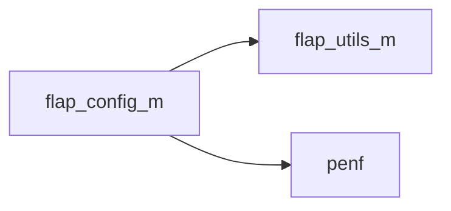
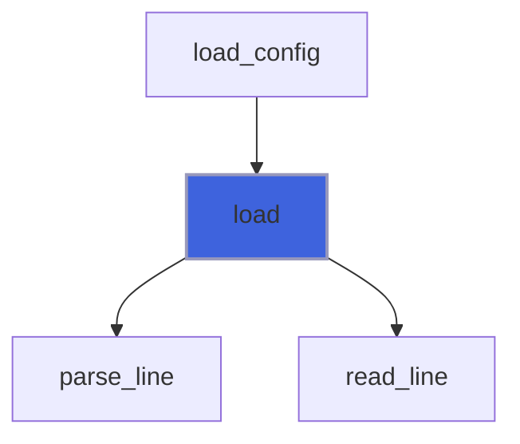
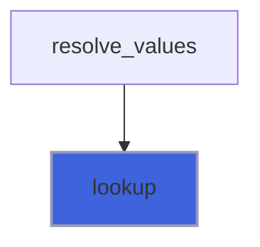

# flap_config_m

> Configuration file reader: a small INI subset, the value source below the environment (F08 of #125).

 Format: `key = value` lines; `[section]` starts a section (a group, i.e. a command; the keys before any section belong to
 the top level, section ''); blank lines and lines starting with '#' or ';' are comments; an inline comment starts at a
 '#' or ';' preceded by a blank; one pair of quotes (' or ") around a value is stripped, and a quoted value keeps its '#'
 and ';'. Lines have any length. Any other line is malformed: its number is recorded.

**Source**: `src/lib/flap_config_m.f90`

**Dependencies**



## Contents

- [config_file](#config-file)
- [load](#load)
- [lookup](#lookup)
- [tabs_to_blanks](#tabs-to-blanks)

## Derived Types

### config_file

Entries of a configuration file.

#### Components

| Name | Type | Attributes | Description |
|------|------|------------|-------------|
| `section` | type([flap_string](/api/src/lib/flap_utils_m#flap-string)) | allocatable | Section of each entry ('' for the top level). |
| `key` | type([flap_string](/api/src/lib/flap_utils_m#flap-string)) | allocatable | Key of each entry. |
| `value` | type([flap_string](/api/src/lib/flap_utils_m#flap-string)) | allocatable | Value of each entry. |
| `line` | integer(kind=[I4P](/api/src/third_party/PENF/src/lib/penf_global_parameters_variables)) | allocatable | Line number of each entry. |
| `n` | integer(kind=[I4P](/api/src/third_party/PENF/src/lib/penf_global_parameters_variables)) |  | Number of entries. |
| `bad_line` | integer(kind=[I4P](/api/src/third_party/PENF/src/lib/penf_global_parameters_variables)) |  | Line number of the first malformed line, 0 if none. |

#### Type-Bound Procedures

| Name | Attributes | Description |
|------|------------|-------------|
| `load` | pass(self) | Load a file. |
| `lookup` | pass(self) | Look up the value of a key. |

## Subroutines

### load

Load a configuration file; found is false (and nothing is loaded) when the file does not exist.

```fortran
subroutine load(self, file, found, iostat, iomsg)
```

**Arguments**

| Name | Type | Intent | Attributes | Description |
|------|------|--------|------------|-------------|
| `self` | class([config_file](/api/src/lib/flap_config_m#config-file)) | inout |  | Configuration. |
| `file` | character(len=*) | in |  | File name. |
| `found` | logical | out |  | The file exists. |
| `iostat` | integer(kind=[I4P](/api/src/third_party/PENF/src/lib/penf_global_parameters_variables)) | out |  | I/O status (0 when read, or not found). |
| `iomsg` | character(len=:) | out | allocatable | I/O message. |

**Call graph**



### lookup

Look up the value of a key in a section: the last entry wins.

**Attributes**: pure

```fortran
subroutine lookup(self, section, key, value, found)
```

**Arguments**

| Name | Type | Intent | Attributes | Description |
|------|------|--------|------------|-------------|
| `self` | class([config_file](/api/src/lib/flap_config_m#config-file)) | in |  | Configuration. |
| `section` | character(len=*) | in |  | Section ('' for the top level). |
| `key` | character(len=*) | in |  | Key. |
| `value` | character(len=:) | out | allocatable | Value ('' if not found). |
| `found` | logical | out |  | The key is in the section. |

**Call graph**



## Functions

### tabs_to_blanks

Return a string with its tabs replaced by blanks.

**Attributes**: pure

**Returns**: `character(len=len(string))`

```fortran
function tabs_to_blanks(string) result(blanked)
```

**Arguments**

| Name | Type | Intent | Attributes | Description |
|------|------|--------|------------|-------------|
| `string` | character(len=*) | in |  | String. |
