# flap_menu_t

> Interactive menus for terminal programs (F23 of #125, the wmenu plan of #78): numbered options, one answer line.

 Opt-in: the argument parser never uses this module, so parsing stays non-interactive and safe in batch and MPI jobs. A menu
 prints its options numbered from 1, then the question, reads one answer line and returns the chosen index (the indexes,
 with multiple selection); the caller dispatches with `select case`. The units are the caller's: the menu never opens nor
 closes them. At the end of the input (standard input redirected from /dev/null or closed, as in a batch job) `run`
 returns `ERROR_MENU_EOF` at once: standard Fortran cannot tell whether the input is a terminal, the end of file is the
 portable signal. `yes_no` asks the question alone (no options) and returns a logical.

**Source**: `src/lib/flap_menu_t.F90`

**Dependencies**

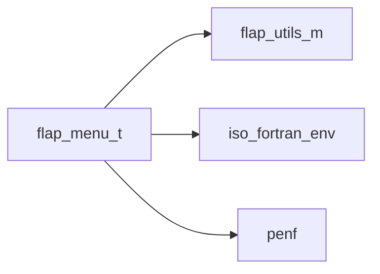

## Contents

- [menu_option](#menu-option)
- [menu](#menu)
- [init](#init)
- [add_option](#add-option)
- [free](#free)
- [ask](#ask)
- [run_multiple](#run-multiple)
- [run_single](#run-single)
- [show](#show)
- [yes_no](#yes-no)
- [evaluate](#evaluate)
- [finalize](#finalize)
- [evaluate_yes_no](#evaluate-yes-no)
- [split_fields](#split-fields)
- [default_index](#default-index)
- [raise](#raise)
- [option_index](#option-index)

## Variables

| Name | Type | Attributes | Description |
|------|------|------------|-------------|
| `ERROR_MENU_INVALID` | integer(kind=[I4P](/api/src/third_party/PENF/src/lib/penf_global_parameters_variables)) | parameter | Not a number, out of range, or an empty field. |
| `ERROR_MENU_TOO_MANY` | integer(kind=[I4P](/api/src/third_party/PENF/src/lib/penf_global_parameters_variables)) | parameter | Several answers to a single choice. |
| `ERROR_MENU_DUPLICATE` | integer(kind=[I4P](/api/src/third_party/PENF/src/lib/penf_global_parameters_variables)) | parameter | The same option chosen twice. |
| `ERROR_MENU_NO_RESPONSE` | integer(kind=[I4P](/api/src/third_party/PENF/src/lib/penf_global_parameters_variables)) | parameter | Empty answer, and no default option. |
| `ERROR_MENU_EOF` | integer(kind=[I4P](/api/src/third_party/PENF/src/lib/penf_global_parameters_variables)) | parameter | End of input: no answer can come. |
| `ERROR_MENU_DEFINITION` | integer(kind=[I4P](/api/src/third_party/PENF/src/lib/penf_global_parameters_variables)) | parameter | Invalid menu or use (no options, empty text, ...). |

## Derived Types

### menu_option

An option of a menu.

#### Components

| Name | Type | Attributes | Description |
|------|------|------------|-------------|
| `text` | character(len=:) | allocatable | Text shown. |
| `is_default` | logical |  | Chosen by an empty answer. |

### menu

Interactive menu: numbered options, a question, one answer line.

#### Components

| Name | Type | Attributes | Description |
|------|------|------------|-------------|
| `question` | character(len=:) | allocatable | Question asked after the options. |
| `options` | type([menu_option](/api/src/lib/flap_menu_t#menu-option)) | allocatable | Options; the index is the number shown. |
| `default_icon` | character(len=:) | allocatable | Mark of the default options. |
| `input_unit` | integer(kind=[I4P](/api/src/third_party/PENF/src/lib/penf_global_parameters_variables)) |  | Unit of the answers. |
| `output_unit` | integer(kind=[I4P](/api/src/third_party/PENF/src/lib/penf_global_parameters_variables)) |  | Unit of the options and the question. |
| `error_unit` | integer(kind=[I4P](/api/src/third_party/PENF/src/lib/penf_global_parameters_variables)) |  | Unit of the error messages. |
| `loop_on_invalid` | logical |  | Ask again after an invalid answer. |
| `tries` | integer(kind=[I4P](/api/src/third_party/PENF/src/lib/penf_global_parameters_variables)) |  | Attempts in total with loop_on_invalid. |
| `multiple` | logical |  | Several options can be chosen. |
| `separator` | character(len=:) | allocatable | Separator of the answers (blank: runs of blanks). |

#### Type-Bound Procedures

| Name | Attributes | Description |
|------|------------|-------------|
| `add_option` | pass(self) | Append an option. |
| `free` | pass(self) | Free dynamic memory. |
| `init` | pass(self) | Initialize the menu. |
| `run` |  | Show the menu and read the answer. |
| `yes_no` | pass(self) | Ask the question as a yes/no one. |
| `ask` | pass(self) | Show the menu and read the chosen indexes. |
| `default_index` | pass(self) | Index of the (first) default option. |
| `evaluate` | pass(self) | The indexes of an answer. |
| `raise` | pass(self) | Write an error message and return its code. |
| `run_multiple` | pass(self) | Show the menu and read the choices. |
| `run_single` | pass(self) | Show the menu and read one choice. |
| `show` | pass(self) | Write the options (unless yes/no) and the question. |

## Subroutines

### init

Initialize the menu: every previous setting and option is dropped.

```fortran
subroutine init(self, question, multiple, separator, loop_on_invalid, tries, default_icon, input_unit, output_unit, error_unit, error)
```

**Arguments**

| Name | Type | Intent | Attributes | Description |
|------|------|--------|------------|-------------|
| `self` | class([menu](/api/src/lib/flap_menu_t#menu)) | inout |  | Menu. |
| `question` | character(len=*) | in |  | Question asked after the options. |
| `multiple` | logical | in | optional | Several options can be chosen (default: no). |
| `separator` | character(len=*) | in | optional | Separator of the answers (default: blank, runs of blanks). |
| `loop_on_invalid` | logical | in | optional | Ask again after an invalid answer (default: no). |
| `tries` | integer(kind=[I4P](/api/src/third_party/PENF/src/lib/penf_global_parameters_variables)) | in | optional | Attempts in total with loop_on_invalid (default: 3). |
| `default_icon` | character(len=*) | in | optional | Mark of the default options (default: '*'). |
| `input_unit` | integer(kind=[I4P](/api/src/third_party/PENF/src/lib/penf_global_parameters_variables)) | in | optional | Unit of the answers (default: standard input). |
| `output_unit` | integer(kind=[I4P](/api/src/third_party/PENF/src/lib/penf_global_parameters_variables)) | in | optional | Unit of the options and the question (default: standard output). |
| `error_unit` | integer(kind=[I4P](/api/src/third_party/PENF/src/lib/penf_global_parameters_variables)) | in | optional | Unit of the error messages (default: standard error). |
| `error` | integer(kind=[I4P](/api/src/third_party/PENF/src/lib/penf_global_parameters_variables)) | out | optional | Error trapping flag. |

**Call graph**

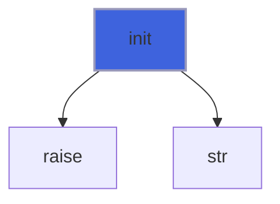

### add_option

Append an option: its index is the number shown. An empty (or blank) text, or a second default, is not added.

```fortran
subroutine add_option(self, text, is_default, error)
```

**Arguments**

| Name | Type | Intent | Attributes | Description |
|------|------|--------|------------|-------------|
| `self` | class([menu](/api/src/lib/flap_menu_t#menu)) | inout |  | Menu. |
| `text` | character(len=*) | in |  | Text shown. |
| `is_default` | logical | in | optional | Chosen by an empty answer (at most one option). |
| `error` | integer(kind=[I4P](/api/src/third_party/PENF/src/lib/penf_global_parameters_variables)) | out | optional | Error trapping flag. |

**Call graph**

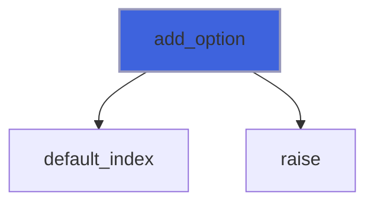

### free

Free dynamic memory and restore the default units.

**Attributes**: elemental

```fortran
subroutine free(self)
```

**Arguments**

| Name | Type | Intent | Attributes | Description |
|------|------|--------|------------|-------------|
| `self` | class([menu](/api/src/lib/flap_menu_t#menu)) | inout |  | Menu. |

### ask

Show the menu and read the chosen indexes (one without multiple selection); none on error.

 With loop_on_invalid an invalid (or empty) answer is reported with the tries left and the menu is asked again, up to
 `tries` attempts; the last error is returned. The end of the input and a read error are never retried. With yes_no
 (its default: 'Y', 'N', or ' ' for none) the question is asked alone and the index is 1 for yes, 2 for no.

```fortran
subroutine ask(self, choices, error, yes_no)
```

**Arguments**

| Name | Type | Intent | Attributes | Description |
|------|------|--------|------------|-------------|
| `self` | class([menu](/api/src/lib/flap_menu_t#menu)) | inout |  | Menu. |
| `choices` | integer(kind=[I4P](/api/src/third_party/PENF/src/lib/penf_global_parameters_variables)) | out | allocatable | Chosen indexes (none on error). |
| `error` | integer(kind=[I4P](/api/src/third_party/PENF/src/lib/penf_global_parameters_variables)) | out |  | Error trapping flag. |
| `yes_no` | character(len=1) | in | optional | Yes/no question, with its default. |

**Call graph**

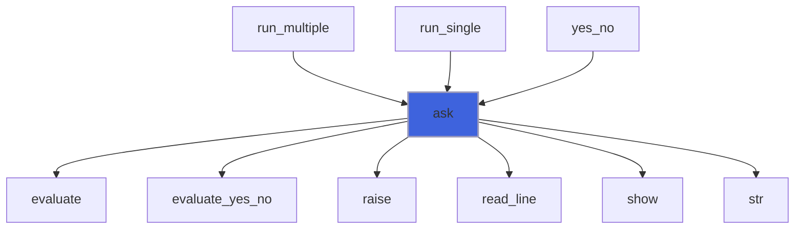

### run_multiple

Show the menu and read the choices: the indexes of the chosen options in the order typed, none on error.

 On a single-choice menu it returns one index (several answers are `ERROR_MENU_TOO_MANY`).

```fortran
subroutine run_multiple(self, choices, error)
```

**Arguments**

| Name | Type | Intent | Attributes | Description |
|------|------|--------|------------|-------------|
| `self` | class([menu](/api/src/lib/flap_menu_t#menu)) | inout |  | Menu. |
| `choices` | integer(kind=[I4P](/api/src/third_party/PENF/src/lib/penf_global_parameters_variables)) | out | allocatable | Chosen indexes (none on error). |
| `error` | integer(kind=[I4P](/api/src/third_party/PENF/src/lib/penf_global_parameters_variables)) | out | optional | Error trapping flag. |

**Call graph**

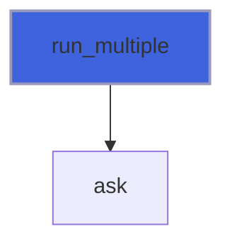

### run_single

Show the menu and read one choice: the index of the chosen option, 0 on error.

```fortran
subroutine run_single(self, choice, error)
```

**Arguments**

| Name | Type | Intent | Attributes | Description |
|------|------|--------|------------|-------------|
| `self` | class([menu](/api/src/lib/flap_menu_t#menu)) | inout |  | Menu. |
| `choice` | integer(kind=[I4P](/api/src/third_party/PENF/src/lib/penf_global_parameters_variables)) | out |  | Chosen index (0 on error). |
| `error` | integer(kind=[I4P](/api/src/third_party/PENF/src/lib/penf_global_parameters_variables)) | out | optional | Error trapping flag. |

**Call graph**

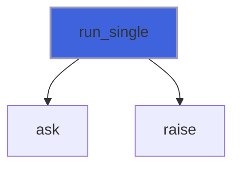

### show

Write the numbered options, then the question on the line of the answer; with a suffix (yes/no), the question alone.

```fortran
subroutine show(self, suffix)
```

**Arguments**

| Name | Type | Intent | Attributes | Description |
|------|------|--------|------------|-------------|
| `self` | class([menu](/api/src/lib/flap_menu_t#menu)) | in |  | Menu. |
| `suffix` | character(len=*) | in | optional | Suffix of the question, the options not shown. |

**Call graph**

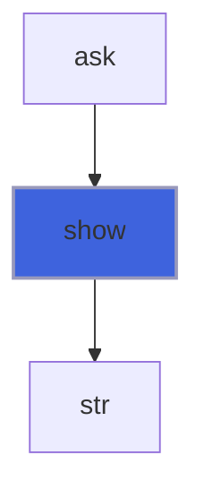

### yes_no

Ask the question as a yes/no one, without the options: y, yes, n, no in any case; an empty answer is the default.

 The prompt ends with (Y/n), (y/N) or (y/n) (no default); retries and the end of the input as `run`.

```fortran
subroutine yes_no(self, answer, default, error)
```

**Arguments**

| Name | Type | Intent | Attributes | Description |
|------|------|--------|------------|-------------|
| `self` | class([menu](/api/src/lib/flap_menu_t#menu)) | inout |  | Menu. |
| `answer` | logical | out |  | Answer (.false. on error). |
| `default` | character(len=*) | in | optional | Default answer: 'y' or 'n' (any case); none if absent. |
| `error` | integer(kind=[I4P](/api/src/third_party/PENF/src/lib/penf_global_parameters_variables)) | out | optional | Error trapping flag. |

**Call graph**

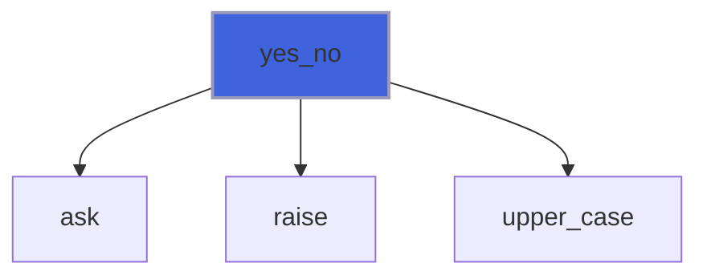

### evaluate

The indexes of an answer (no blanks around): the defaults for an empty one; none on error, with its message.

 Checked in order: several fields without multiple selection (too many), each field a number shown (invalid, also an
 empty field), an index repeated (duplicate).

**Attributes**: pure

```fortran
subroutine evaluate(self, answer, choices, error, message)
```

**Arguments**

| Name | Type | Intent | Attributes | Description |
|------|------|--------|------------|-------------|
| `self` | class([menu](/api/src/lib/flap_menu_t#menu)) | in |  | Menu. |
| `answer` | character(len=*) | in |  | Answer. |
| `choices` | integer(kind=[I4P](/api/src/third_party/PENF/src/lib/penf_global_parameters_variables)) | out | allocatable | Chosen indexes. |
| `error` | integer(kind=[I4P](/api/src/third_party/PENF/src/lib/penf_global_parameters_variables)) | out |  | Error code. |
| `message` | character(len=:) | out | allocatable | Error message. |

**Call graph**

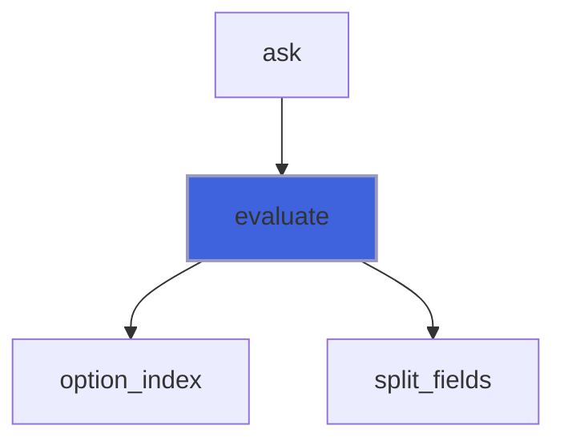

### finalize

Free dynamic memory when finalizing.

**Attributes**: elemental

```fortran
subroutine finalize(self)
```

**Arguments**

| Name | Type | Intent | Attributes | Description |
|------|------|--------|------------|-------------|
| `self` | type([menu](/api/src/lib/flap_menu_t#menu)) | inout |  | Menu. |

### evaluate_yes_no

The index of a yes/no answer (no blanks around): 1 for y/yes, 2 for n/no (any case), the default if empty.

**Attributes**: pure

```fortran
subroutine evaluate_yes_no(answer, default, choices, error, message)
```

**Arguments**

| Name | Type | Intent | Attributes | Description |
|------|------|--------|------------|-------------|
| `answer` | character(len=*) | in |  | Answer. |
| `default` | character(len=1) | in |  | Default: 'Y', 'N' or ' ' (none). |
| `choices` | integer(kind=[I4P](/api/src/third_party/PENF/src/lib/penf_global_parameters_variables)) | out | allocatable | [1] for yes, [2] for no; none on error. |
| `error` | integer(kind=[I4P](/api/src/third_party/PENF/src/lib/penf_global_parameters_variables)) | out |  | Error code. |
| `message` | character(len=:) | out | allocatable | Error message. |

**Call graph**

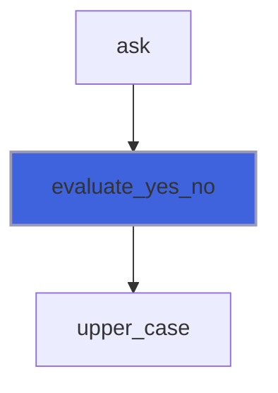

### split_fields

Split an answer into fields: a blank separator splits at runs of blanks; any other exactly, each field trimmed (so
 `1,,3` has an empty field). Not `tokenize`, whose trailing-token behaviour belongs to the parser.

**Attributes**: pure

```fortran
subroutine split_fields(answer, separator, fields)
```

**Arguments**

| Name | Type | Intent | Attributes | Description |
|------|------|--------|------------|-------------|
| `answer` | character(len=*) | in |  | Answer (no blanks around, not empty). |
| `separator` | character(len=*) | in |  | Separator. |
| `fields` | type([flap_string](/api/src/lib/flap_utils_m#flap-string)) | out | allocatable | Fields. |

**Call graph**

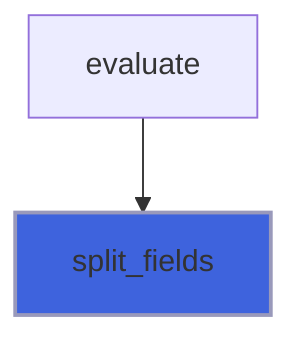

## Functions

### default_index

Index of the (first) default option, 0 if none.

**Attributes**: pure

**Returns**: integer(kind=[I4P](/api/src/third_party/PENF/src/lib/penf_global_parameters_variables))

```fortran
function default_index(self) result(i)
```

**Arguments**

| Name | Type | Intent | Attributes | Description |
|------|------|--------|------------|-------------|
| `self` | class([menu](/api/src/lib/flap_menu_t#menu)) | in |  | Menu. |

**Call graph**

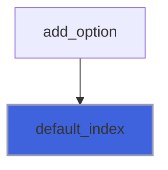

### raise

Write an error message on the error unit and return its code.

**Returns**: integer(kind=[I4P](/api/src/third_party/PENF/src/lib/penf_global_parameters_variables))

```fortran
function raise(self, code, message) result(error)
```

**Arguments**

| Name | Type | Intent | Attributes | Description |
|------|------|--------|------------|-------------|
| `self` | class([menu](/api/src/lib/flap_menu_t#menu)) | in |  | Menu. |
| `code` | integer(kind=[I4P](/api/src/third_party/PENF/src/lib/penf_global_parameters_variables)) | in |  | Error code. |
| `message` | character(len=*) | in |  | Error message. |

**Call graph**

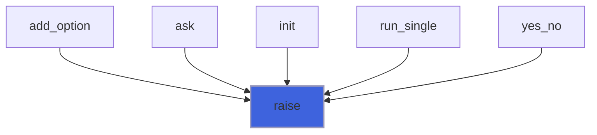

### option_index

The option number written in a field: digits only, in 1..n; 0 otherwise.

**Attributes**: pure

**Returns**: integer(kind=[I4P](/api/src/third_party/PENF/src/lib/penf_global_parameters_variables))

```fortran
function option_index(field, n) result(choice)
```

**Arguments**

| Name | Type | Intent | Attributes | Description |
|------|------|--------|------------|-------------|
| `field` | character(len=*) | in |  | Field (no blanks around). |
| `n` | integer(kind=[I4P](/api/src/third_party/PENF/src/lib/penf_global_parameters_variables)) | in |  | Number of options. |

**Call graph**

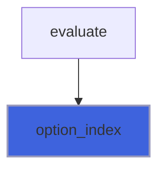
