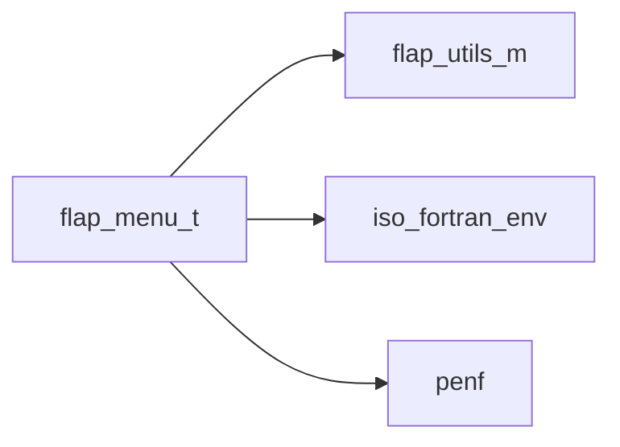
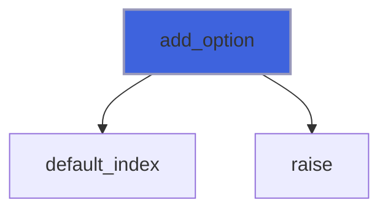
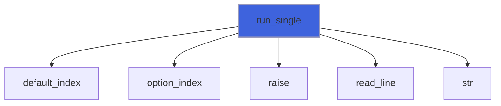
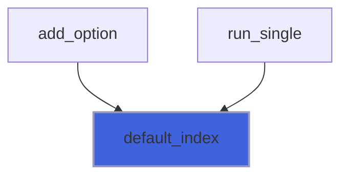
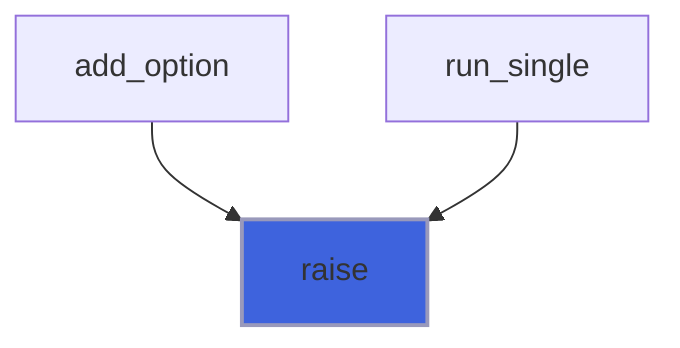
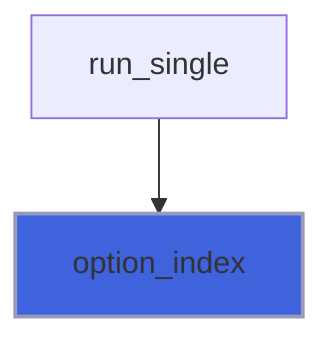

# flap_menu_t

> Interactive menus for terminal programs (F23 of #125, the wmenu plan of #78): numbered options, one answer line.

 Opt-in: the argument parser never uses this module, so parsing stays non-interactive and safe in batch and MPI jobs. A menu
 prints its options numbered from 1, then the question, reads one answer line and returns the chosen index; the caller
 dispatches with `select case`. The units are the caller's: the menu never opens nor closes them. At the end of the input
 (standard input redirected from /dev/null or closed, as in a batch job) `run` returns `ERROR_MENU_EOF` at once: standard
 Fortran cannot tell whether the input is a terminal, the end of file is the portable signal.

**Source**: `src/lib/flap_menu_t.F90`

**Dependencies**



## Contents

- [menu_option](#menu-option)
- [menu](#menu)
- [init](#init)
- [add_option](#add-option)
- [free](#free)
- [run_single](#run-single)
- [finalize](#finalize)
- [default_index](#default-index)
- [raise](#raise)
- [option_index](#option-index)

## Variables

| Name | Type | Attributes | Description |
|------|------|------------|-------------|
| `ERROR_MENU_INVALID` | integer(kind=[I4P](/api/src/third_party/PENF/src/lib/penf_global_parameters_variables)) | parameter | Not a number, or out of range. |
| `ERROR_MENU_NO_RESPONSE` | integer(kind=[I4P](/api/src/third_party/PENF/src/lib/penf_global_parameters_variables)) | parameter | Empty answer, and no default option. |
| `ERROR_MENU_EOF` | integer(kind=[I4P](/api/src/third_party/PENF/src/lib/penf_global_parameters_variables)) | parameter | End of input: no answer can come. |
| `ERROR_MENU_DEFINITION` | integer(kind=[I4P](/api/src/third_party/PENF/src/lib/penf_global_parameters_variables)) | parameter | Invalid menu: no options, empty option text, second default. |

## Derived Types

### menu_option

An option of a menu.

#### Components

| Name | Type | Attributes | Description |
|------|------|------------|-------------|
| `text` | character(len=:) | allocatable | Text shown. |
| `is_default` | logical |  | Chosen by an empty answer. |

### menu

Interactive menu: numbered options, a question, one answer line.

#### Components

| Name | Type | Attributes | Description |
|------|------|------------|-------------|
| `question` | character(len=:) | allocatable | Question asked after the options. |
| `options` | type([menu_option](/api/src/lib/flap_menu_t#menu-option)) | allocatable | Options; the index is the number shown. |
| `default_icon` | character(len=:) | allocatable | Mark of the default options. |
| `input_unit` | integer(kind=[I4P](/api/src/third_party/PENF/src/lib/penf_global_parameters_variables)) |  | Unit of the answers. |
| `output_unit` | integer(kind=[I4P](/api/src/third_party/PENF/src/lib/penf_global_parameters_variables)) |  | Unit of the options and the question. |
| `error_unit` | integer(kind=[I4P](/api/src/third_party/PENF/src/lib/penf_global_parameters_variables)) |  | Unit of the error messages. |

#### Type-Bound Procedures

| Name | Attributes | Description |
|------|------------|-------------|
| `add_option` | pass(self) | Append an option. |
| `free` | pass(self) | Free dynamic memory. |
| `init` | pass(self) | Initialize the menu. |
| `run` |  | Show the menu and read the answer. |
| `default_index` | pass(self) | Index of the default option. |
| `raise` | pass(self) | Write an error message and return its code. |
| `run_single` | pass(self) | Show the menu and read one choice. |

## Subroutines

### init

Initialize the menu: every previous setting and option is dropped.

```fortran
subroutine init(self, question, default_icon, input_unit, output_unit, error_unit)
```

**Arguments**

| Name | Type | Intent | Attributes | Description |
|------|------|--------|------------|-------------|
| `self` | class([menu](/api/src/lib/flap_menu_t#menu)) | inout |  | Menu. |
| `question` | character(len=*) | in |  | Question asked after the options. |
| `default_icon` | character(len=*) | in | optional | Mark of the default options (default: '*'). |
| `input_unit` | integer(kind=[I4P](/api/src/third_party/PENF/src/lib/penf_global_parameters_variables)) | in | optional | Unit of the answers (default: standard input). |
| `output_unit` | integer(kind=[I4P](/api/src/third_party/PENF/src/lib/penf_global_parameters_variables)) | in | optional | Unit of the options and the question (default: standard output). |
| `error_unit` | integer(kind=[I4P](/api/src/third_party/PENF/src/lib/penf_global_parameters_variables)) | in | optional | Unit of the error messages (default: standard error). |

### add_option

Append an option: its index is the number shown. An empty (or blank) text, or a second default, is not added.

```fortran
subroutine add_option(self, text, is_default, error)
```

**Arguments**

| Name | Type | Intent | Attributes | Description |
|------|------|--------|------------|-------------|
| `self` | class([menu](/api/src/lib/flap_menu_t#menu)) | inout |  | Menu. |
| `text` | character(len=*) | in |  | Text shown. |
| `is_default` | logical | in | optional | Chosen by an empty answer (at most one option). |
| `error` | integer(kind=[I4P](/api/src/third_party/PENF/src/lib/penf_global_parameters_variables)) | out | optional | Error trapping flag. |

**Call graph**



### free

Free dynamic memory and restore the default units.

**Attributes**: elemental

```fortran
subroutine free(self)
```

**Arguments**

| Name | Type | Intent | Attributes | Description |
|------|------|--------|------------|-------------|
| `self` | class([menu](/api/src/lib/flap_menu_t#menu)) | inout |  | Menu. |

### run_single

Show the menu and read one choice: the index of the chosen option, 0 on error.

```fortran
subroutine run_single(self, choice, error)
```

**Arguments**

| Name | Type | Intent | Attributes | Description |
|------|------|--------|------------|-------------|
| `self` | class([menu](/api/src/lib/flap_menu_t#menu)) | inout |  | Menu. |
| `choice` | integer(kind=[I4P](/api/src/third_party/PENF/src/lib/penf_global_parameters_variables)) | out |  | Chosen index (0 on error). |
| `error` | integer(kind=[I4P](/api/src/third_party/PENF/src/lib/penf_global_parameters_variables)) | out | optional | Error trapping flag. |

**Call graph**



### finalize

Free dynamic memory when finalizing.

**Attributes**: elemental

```fortran
subroutine finalize(self)
```

**Arguments**

| Name | Type | Intent | Attributes | Description |
|------|------|--------|------------|-------------|
| `self` | type([menu](/api/src/lib/flap_menu_t#menu)) | inout |  | Menu. |

## Functions

### default_index

Index of the default option, 0 if none.

**Attributes**: pure

**Returns**: integer(kind=[I4P](/api/src/third_party/PENF/src/lib/penf_global_parameters_variables))

```fortran
function default_index(self) result(i)
```

**Arguments**

| Name | Type | Intent | Attributes | Description |
|------|------|--------|------------|-------------|
| `self` | class([menu](/api/src/lib/flap_menu_t#menu)) | in |  | Menu. |

**Call graph**



### raise

Write an error message on the error unit and return its code.

**Returns**: integer(kind=[I4P](/api/src/third_party/PENF/src/lib/penf_global_parameters_variables))

```fortran
function raise(self, code, message) result(error)
```

**Arguments**

| Name | Type | Intent | Attributes | Description |
|------|------|--------|------------|-------------|
| `self` | class([menu](/api/src/lib/flap_menu_t#menu)) | in |  | Menu. |
| `code` | integer(kind=[I4P](/api/src/third_party/PENF/src/lib/penf_global_parameters_variables)) | in |  | Error code. |
| `message` | character(len=*) | in |  | Error message. |

**Call graph**



### option_index

The option number written in a field: digits only, in 1..n; 0 otherwise.

**Attributes**: pure

**Returns**: integer(kind=[I4P](/api/src/third_party/PENF/src/lib/penf_global_parameters_variables))

```fortran
function option_index(field, n) result(choice)
```

**Arguments**

| Name | Type | Intent | Attributes | Description |
|------|------|--------|------------|-------------|
| `field` | character(len=*) | in |  | Field (no blanks around). |
| `n` | integer(kind=[I4P](/api/src/third_party/PENF/src/lib/penf_global_parameters_variables)) | in |  | Number of options. |

**Call graph**


