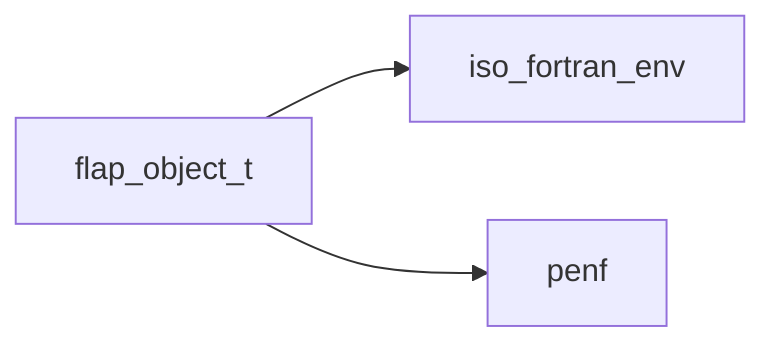
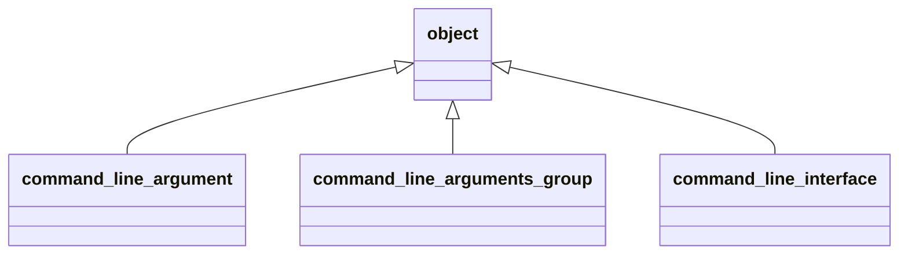
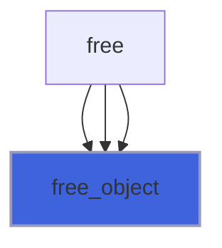
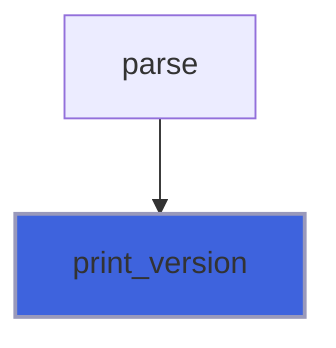
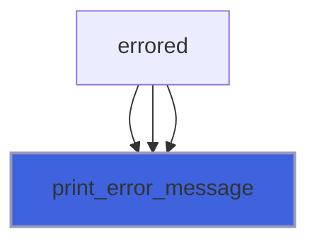
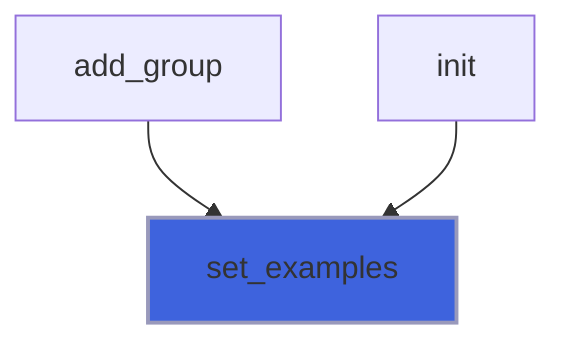
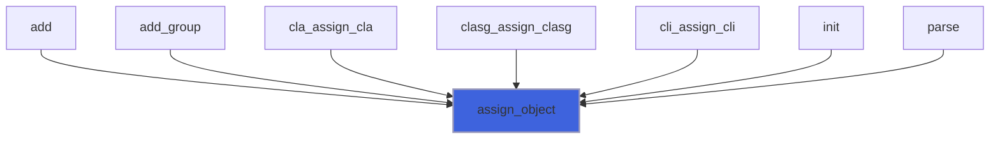

# flap_object_t

> Base (abstract) class upon which FLAP's concrete classes are built.

**Source**: `src/lib/flap_object_t.F90`

**Dependencies**



## Contents

- [object](#object)
- [free_object](#free-object)
- [print_version](#print-version)
- [print_error_message](#print-error-message)
- [set_examples](#set-examples)
- [assign_object](#assign-object)

## Derived Types

### object

Base (abstract) class upon which FLAP's concrete classes are built.

**Inheritance**



**Attributes**: abstract

#### Components

| Name | Type | Attributes | Description |
|------|------|------------|-------------|
| `progname` | character(len=:) | allocatable | Program name. |
| `version` | character(len=:) | allocatable | Program version. |
| `help` | character(len=:) | allocatable | Help message. |
| `help_color` | character(len=:) | allocatable | ANSI color of help messages. |
| `help_style` | character(len=:) | allocatable | ANSI style of help messages. |
| `help_markdown` | character(len=:) | allocatable | Longer help message, markdown formatted. |
| `description` | character(len=:) | allocatable | Detailed description. |
| `license` | character(len=:) | allocatable | License description. |
| `authors` | character(len=:) | allocatable | Authors list. |
| `epilog` | character(len=:) | allocatable | Epilogue message. |
| `m_exclude` | character(len=:) | allocatable | Mutually exclude other CLA(s group). |
| `error_message` | character(len=:) | allocatable | Meaningful error message to standard-error. |
| `error_color` | character(len=:) | allocatable | ANSI color of error messages. |
| `error_style` | character(len=:) | allocatable | ANSI style of error messages. |
| `examples` | character(len=512) | allocatable | Examples of correct usage. |
| `error` | integer(kind=[I4P](/api/src/third_party/PENF/src/lib/penf_global_parameters_variables)) |  | Error trapping flag. |
| `usage_lun` | integer(kind=[I4P](/api/src/third_party/PENF/src/lib/penf_global_parameters_variables)) |  | Output unit to print help/usage messages |
| `version_lun` | integer(kind=[I4P](/api/src/third_party/PENF/src/lib/penf_global_parameters_variables)) |  | Output unit to print version message |
| `error_lun` | integer(kind=[I4P](/api/src/third_party/PENF/src/lib/penf_global_parameters_variables)) |  | Error unit to print error messages |

#### Type-Bound Procedures

| Name | Attributes | Description |
|------|------------|-------------|
| `free_object` | pass(self) | Free dynamic memory. |
| `print_version` | pass(self) | Print version. |
| `print_error_message` | pass(self) | Print meaningful error message. |
| `set_examples` | pass(self) | Set examples of correct usage. |
| `assign_object` | pass(lhs ) | Assignment overloading. |

## Subroutines

### free_object

Free dynamic memory.

**Attributes**: elemental

```fortran
subroutine free_object(self)
```

**Arguments**

| Name | Type | Intent | Attributes | Description |
|------|------|--------|------------|-------------|
| `self` | class([object](/api/src/lib/flap_object_t#object)) | inout |  | Object data. |

**Call graph**



### print_version

Print version.

```fortran
subroutine print_version(self, pref)
```

**Arguments**

| Name | Type | Intent | Attributes | Description |
|------|------|--------|------------|-------------|
| `self` | class([object](/api/src/lib/flap_object_t#object)) | in |  | Object data. |
| `pref` | character(len=*) | in | optional | Prefixing string. |

**Call graph**



### print_error_message

Print meaningful error message to standard-error.

```fortran
subroutine print_error_message(self)
```

**Arguments**

| Name | Type | Intent | Attributes | Description |
|------|------|--------|------------|-------------|
| `self` | class([object](/api/src/lib/flap_object_t#object)) | in |  | Object data. |

**Call graph**



### set_examples

Set examples of correct usage.

```fortran
subroutine set_examples(self, examples)
```

**Arguments**

| Name | Type | Intent | Attributes | Description |
|------|------|--------|------------|-------------|
| `self` | class([object](/api/src/lib/flap_object_t#object)) | inout |  | Object data. |
| `examples` | character(len=*) | in | optional | Examples of correct usage. |

**Call graph**



### assign_object

Assign two abstract objects.

**Attributes**: elemental

```fortran
subroutine assign_object(lhs, rhs)
```

**Arguments**

| Name | Type | Intent | Attributes | Description |
|------|------|--------|------------|-------------|
| `lhs` | class([object](/api/src/lib/flap_object_t#object)) | inout |  | Left hand side. |
| `rhs` | class([object](/api/src/lib/flap_object_t#object)) | in |  | Rigth hand side. |

**Call graph**


