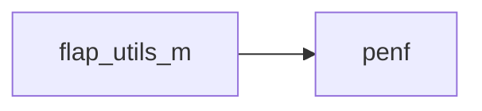
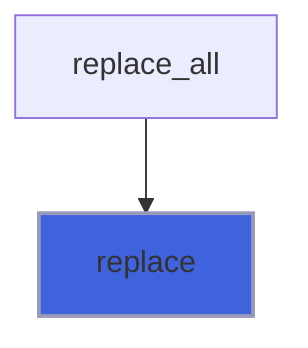
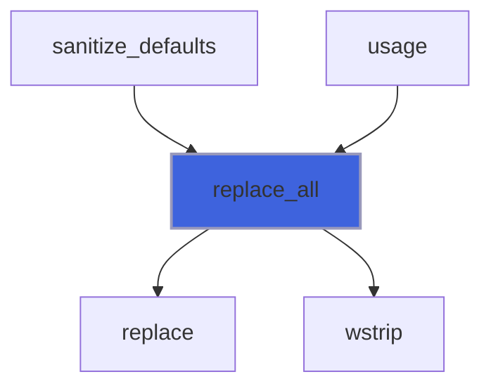
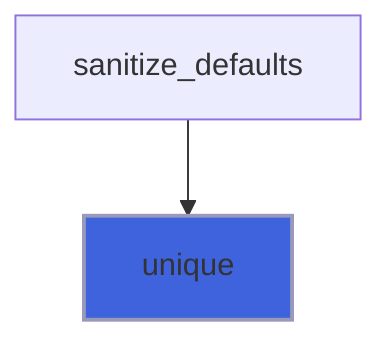
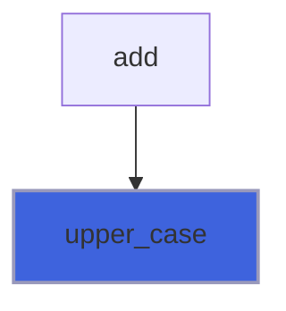
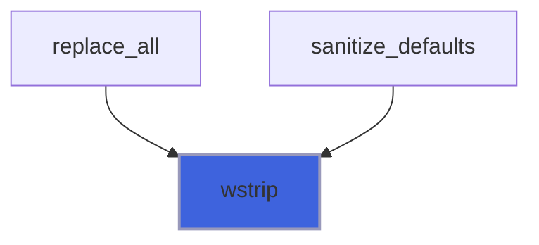

# flap_utils_m

> FLAP utils.

**Source**: `src/lib/flap_utils_m.f90`

**Dependencies**



## Contents

- [count](#count)
- [tokenize](#tokenize)
- [count_substring](#count-substring)
- [replace](#replace)
- [replace_all](#replace-all)
- [unique](#unique)
- [upper_case](#upper-case)
- [wstrip](#wstrip)

## Interfaces

### count

Overload intrinsic function count for counting substring occurences into strings.

**Module procedures**: [`count_substring`](/api/src/lib/flap_utils_m#count-substring)

## Subroutines

### tokenize

Tokenize a string in order to parse it.

 @note The dummy array containing tokens must allocatable and its character elements must have the same length of the input
 string. If the length of the delimiter is higher than the input string one then the output tokens array is allocated with
 only one element set to input string.

**Attributes**: pure

```fortran
subroutine tokenize(strin, delimiter, toks, Nt)
```

**Arguments**

| Name | Type | Intent | Attributes | Description |
|------|------|--------|------------|-------------|
| `strin` | character(len=*) | in |  | String to be tokenized. |
| `delimiter` | character(len=*) | in |  | Delimiter of tokens. |
| `toks` | character(len=len) | out | allocatable | Tokens. |
| `Nt` | integer(kind=[I4P](/api/src/third_party/PENF/src/lib/penf_global_parameters_variables)) | out | optional | Number of tokens. |

**Call graph**



```mermaid
flowchart TD
  check_choices["check_choices"] --> tokenize["tokenize"]
  get_args_from_string["get_args_from_string"] --> tokenize["tokenize"]
  get_cla_list["get_cla_list"] --> tokenize["tokenize"]
  get_cla_list_from_buffer["get_cla_list_from_buffer"] --> tokenize["tokenize"]
  get_cla_list_varying_I1P["get_cla_list_varying_I1P"] --> tokenize["tokenize"]
  get_cla_list_varying_I2P["get_cla_list_varying_I2P"] --> tokenize["tokenize"]
  get_cla_list_varying_I4P["get_cla_list_varying_I4P"] --> tokenize["tokenize"]
  get_cla_list_varying_I8P["get_cla_list_varying_I8P"] --> tokenize["tokenize"]
  get_cla_list_varying_R16P["get_cla_list_varying_R16P"] --> tokenize["tokenize"]
  get_cla_list_varying_R4P["get_cla_list_varying_R4P"] --> tokenize["tokenize"]
  get_cla_list_varying_R8P["get_cla_list_varying_R8P"] --> tokenize["tokenize"]
  get_cla_list_varying_char["get_cla_list_varying_char"] --> tokenize["tokenize"]
  get_cla_list_varying_logical["get_cla_list_varying_logical"] --> tokenize["tokenize"]
  style tokenize fill:#3e63dd,stroke:#99b,stroke-width:2px
```

## Functions

### count_substring

Count the number of occurences of a substring into a string.

**Attributes**: elemental

**Returns**: integer(kind=[I4P](/api/src/third_party/PENF/src/lib/penf_global_parameters_variables))

```fortran
function count_substring(string, substring) result(No)
```

**Arguments**

| Name | Type | Intent | Attributes | Description |
|------|------|--------|------------|-------------|
| `string` | character(len=*) | in |  | String. |
| `substring` | character(len=*) | in |  | Substring. |

### replace

Replace substring (only first occurrence) into a string.

**Attributes**: pure

**Returns**: `character(len=:)`

```fortran
function replace(string, substring, restring) result(newstring)
```

**Arguments**

| Name | Type | Intent | Attributes | Description |
|------|------|--------|------------|-------------|
| `string` | character(len=*) | in |  | String to be modified. |
| `substring` | character(len=*) | in |  | Substring to be replaced. |
| `restring` | character(len=*) | in |  | String to be inserted. |

**Call graph**



### replace_all

Replace substring (all occurrences) into a string.

 @note Leading and trailing white spaces are stripped out.

**Attributes**: pure

**Returns**: `character(len=:)`

```fortran
function replace_all(string, substring, restring) result(newstring)
```

**Arguments**

| Name | Type | Intent | Attributes | Description |
|------|------|--------|------------|-------------|
| `string` | character(len=*) | in |  | String to be modified. |
| `substring` | character(len=*) | in |  | Substring to be replaced. |
| `restring` | character(len=*) | in |  | String to be inserted. |

**Call graph**



### unique

Reduce to one (unique) multiple (sequential) occurrences of a characters substring into a string.

 For example the string ' ab-cre-cre-ab' is reduce to 'ab-cre-ab' if the substring is '-cre'.
 @note Eventual multiple trailing white space are not reduced to one occurrence.

**Attributes**: elemental

**Returns**: `character(len=len)`

```fortran
function unique(string, substring) result(uniq)
```

**Arguments**

| Name | Type | Intent | Attributes | Description |
|------|------|--------|------------|-------------|
| `string` | character(len=*) | in |  | String to be parsed. |
| `substring` | character(len=*) | in |  | Substring which multiple occurences must be reduced to one. |

**Call graph**



### upper_case

Convert the lower case characters of a string to upper case one.

**Attributes**: elemental

**Returns**: `character(len=len)`

```fortran
function upper_case(string)
```

**Arguments**

| Name | Type | Intent | Attributes | Description |
|------|------|--------|------------|-------------|
| `string` | character(len=*) | in |  | String to be converted. |

**Call graph**



### wstrip

Strip out leading and trailing white spaces from a string.

**Attributes**: pure

**Returns**: `character(len=:)`

```fortran
function wstrip(string) result(newstring)
```

**Arguments**

| Name | Type | Intent | Attributes | Description |
|------|------|--------|------------|-------------|
| `string` | character(len=*) | in |  | String to be modified. |

**Call graph**


