# flap_utils_m

> FLAP utils.

**Source**: `src/lib/flap_utils_m.f90`

**Dependencies**

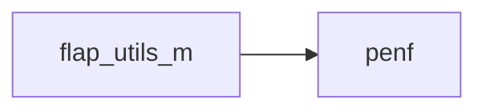
```mermaid
graph LR
  flap_utils_m["flap_utils_m"] --> penf["penf"]
```

## Contents

- [flap_string](#flap-string)
- [count](#count)
- [list_items](#list-items)
- [list_push](#list-push)
- [read_env](#read-env)
- [tokenize](#tokenize)
- [split_command_line](#split-command-line)
- [csv_split](#csv-split)
- [count_substring](#count-substring)
- [to_characters](#to-characters)
- [list_count](#list-count)
- [list_join](#list-join)
- [replace](#replace)
- [replace_all](#replace-all)
- [unique](#unique)
- [upper_case](#upper-case)
- [wstrip](#wstrip)

## Variables

| Name | Type | Attributes | Description |
|------|------|------------|-------------|
| `LIST_SEP` | character(len=*) | parameter | Separator of the items of a stored list: v1\|\|!\|\|v2\|\|!\|\|. |

## Derived Types

### flap_string

A string of any length. Arrays of it replace arrays of deferred-length strings in derived types: nvfortran 26.5
 corrupts the heap when copying a type with a `character(len=:), allocatable :: a(:)` component (B33 of #125).

#### Components

| Name | Type | Attributes | Description |
|------|------|------------|-------------|
| `s` | character(len=:) | allocatable | The string. |

## Interfaces

### count

Overload intrinsic function count for counting substring occurences into strings.

**Module procedures**: [`count_substring`](/api/src/lib/flap_utils_m#count-substring)

## Subroutines

### list_items

Return the items of a stored list, each as long as the whole list; an empty (blank) list has none.

**Attributes**: pure

```fortran
subroutine list_items(list, items, n)
```

**Arguments**

| Name | Type | Intent | Attributes | Description |
|------|------|--------|------------|-------------|
| `list` | character(len=*) | in |  | Stored list. |
| `items` | character(len=:) | out | allocatable | Items. |
| `n` | integer(kind=[I4P](/api/src/third_party/PENF/src/lib/penf_global_parameters_variables)) | out |  | Number of items. |

**Call graph**


```mermaid
flowchart TD
  check_exclusive_sets["check_exclusive_sets"] --> list_items["list_items"]
  check_paths["check_paths"] --> list_items["list_items"]
  exclusive_set_of["exclusive_set_of"] --> list_items["list_items"]
  exclusive_set_signature["exclusive_set_signature"] --> list_items["list_items"]
  get_cla_list_from_buffer["get_cla_list_from_buffer"] --> list_items["list_items"]
  get_cla_list_varying_I1P["get_cla_list_varying_I1P"] --> list_items["list_items"]
  get_cla_list_varying_I2P["get_cla_list_varying_I2P"] --> list_items["list_items"]
  get_cla_list_varying_I4P["get_cla_list_varying_I4P"] --> list_items["list_items"]
  get_cla_list_varying_I8P["get_cla_list_varying_I8P"] --> list_items["list_items"]
  get_cla_list_varying_R16P["get_cla_list_varying_R16P"] --> list_items["list_items"]
  get_cla_list_varying_R4P["get_cla_list_varying_R4P"] --> list_items["list_items"]
  get_cla_list_varying_R8P["get_cla_list_varying_R8P"] --> list_items["list_items"]
  get_cla_list_varying_char["get_cla_list_varying_char"] --> list_items["list_items"]
  get_cla_list_varying_logical["get_cla_list_varying_logical"] --> list_items["list_items"]
  list_items["list_items"] --> list_count["list_count"]
  list_items["list_items"] --> tokenize["tokenize"]
  style list_items fill:#3e63dd,stroke:#99b,stroke-width:2px
```

### list_push

Append an item to a stored list (an unallocated list is empty).

**Attributes**: pure

```fortran
subroutine list_push(list, item)
```

**Arguments**

| Name | Type | Intent | Attributes | Description |
|------|------|--------|------------|-------------|
| `list` | character(len=:) | inout | allocatable | Stored list. |
| `item` | character(len=*) | in |  | Item. |

**Call graph**

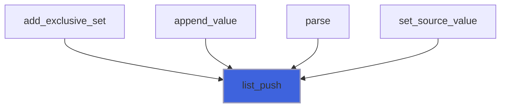
```mermaid
flowchart TD
  add_exclusive_set["add_exclusive_set"] --> list_push["list_push"]
  append_value["append_value"] --> list_push["list_push"]
  parse["parse"] --> list_push["list_push"]
  set_source_value["set_source_value"] --> list_push["list_push"]
  style list_push fill:#3e63dd,stroke:#99b,stroke-width:2px
```

### read_env

Read an environment variable, whatever the length of its value: the only environment lookup of the library.

 Every lookup goes through here (step 0.D.2 of #125), so that `ignore_env` (F20) applies to all of them.

```fortran
subroutine read_env(name, value, found, ignore)
```

**Arguments**

| Name | Type | Intent | Attributes | Description |
|------|------|--------|------------|-------------|
| `name` | character(len=*) | in |  | Name of the variable. |
| `value` | character(len=:) | out | allocatable | Value; empty when the variable is not set. |
| `found` | logical | out |  | True if the variable is set (maybe to an empty value). |
| `ignore` | logical | in | optional | Ignore the environment: never found (ignore_env). |

**Call graph**

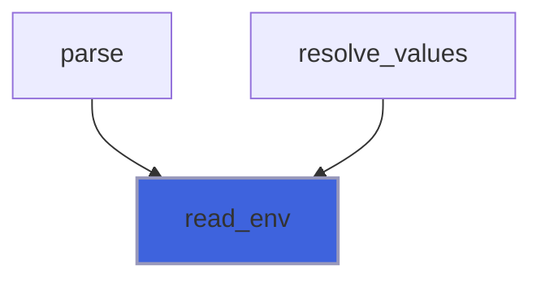
```mermaid
flowchart TD
  parse["parse"] --> read_env["read_env"]
  resolve_values["resolve_values"] --> read_env["read_env"]
  style read_env fill:#3e63dd,stroke:#99b,stroke-width:2px
```

### tokenize

Tokenize a string in order to parse it.

 @note The dummy array containing tokens must allocatable and its character elements must have the same length of the input
 string. If the length of the delimiter is higher than the input string one then the output tokens array is allocated with
 only one element set to input string.

**Attributes**: pure

```fortran
subroutine tokenize(strin, delimiter, toks, Nt)
```

**Arguments**

| Name | Type | Intent | Attributes | Description |
|------|------|--------|------------|-------------|
| `strin` | character(len=*) | in |  | String to be tokenized. |
| `delimiter` | character(len=*) | in |  | Delimiter of tokens. |
| `toks` | character(len=len) | out | allocatable | Tokens. |
| `Nt` | integer(kind=[I4P](/api/src/third_party/PENF/src/lib/penf_global_parameters_variables)) | out | optional | Number of tokens. |

**Call graph**

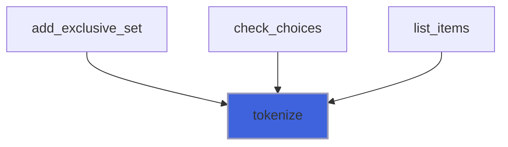
```mermaid
flowchart TD
  add_exclusive_set["add_exclusive_set"] --> tokenize["tokenize"]
  check_choices["check_choices"] --> tokenize["tokenize"]
  list_items["list_items"] --> tokenize["tokenize"]
  style tokenize fill:#3e63dd,stroke:#99b,stroke-width:2px
```

### split_command_line

Split a command line string into arguments, in one pass, with shell-like quoting.

 Blanks and tabs separate arguments outside quotes. Text inside `'...'` or `"..."` is taken literally (both kinds, a quote
 of the other kind included); a quoted part is joined to the adjacent text (`ab"c d"e` is `abc de`), and a quoted empty
 string is an empty argument. An unterminated quote extends to the end of the string. There are no escape characters.

**Attributes**: pure

```fortran
subroutine split_command_line(strin, toks, Nt)
```

**Arguments**

| Name | Type | Intent | Attributes | Description |
|------|------|--------|------------|-------------|
| `strin` | character(len=*) | in |  | Command line string. |
| `toks` | character(len=len) | out | allocatable | Arguments. |
| `Nt` | integer(kind=[I4P](/api/src/third_party/PENF/src/lib/penf_global_parameters_variables)) | out |  | Number of arguments. |

**Call graph**

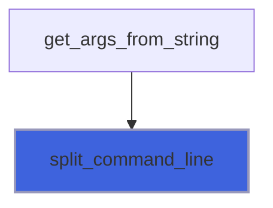
```mermaid
flowchart TD
  get_args_from_string["get_args_from_string"] --> split_command_line["split_command_line"]
  style split_command_line fill:#3e63dd,stroke:#99b,stroke-width:2px
```

### csv_split

Split one CSV record (an RFC 4180 subset), the format of list values read from the environment (F22 of #125).

 The separator is ','; a field in "..." may hold commas, and "" in it is a literal "; blanks around an unquoted field
 are trimmed, those inside quotes kept; a quote inside an unquoted field is kept; an empty or blank record has no field.
 Not to be confused with tokenize, whose trailing-token behaviour the stored lists rely on.

**Attributes**: pure

```fortran
subroutine csv_split(record, fields, nf, error)
```

**Arguments**

| Name | Type | Intent | Attributes | Description |
|------|------|--------|------------|-------------|
| `record` | character(len=*) | in |  | CSV record. |
| `fields` | type([flap_string](/api/src/lib/flap_utils_m#flap-string)) | out | allocatable | Fields, with their exact length. |
| `nf` | integer(kind=[I4P](/api/src/third_party/PENF/src/lib/penf_global_parameters_variables)) | out |  | Number of fields. |
| `error` | integer(kind=[I4P](/api/src/third_party/PENF/src/lib/penf_global_parameters_variables)) | out |  | 0, or 1 for an unterminated quote. |

**Call graph**

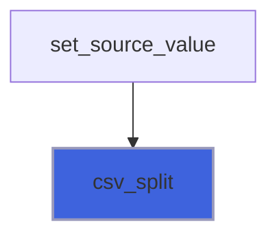
```mermaid
flowchart TD
  set_source_value["set_source_value"] --> csv_split["csv_split"]
  style csv_split fill:#3e63dd,stroke:#99b,stroke-width:2px
```

## Functions

### count_substring

Count the number of (non-overlapping) occurences of a substring into a string.

**Attributes**: elemental

**Returns**: integer(kind=[I4P](/api/src/third_party/PENF/src/lib/penf_global_parameters_variables))

```fortran
function count_substring(string, substring) result(No)
```

**Arguments**

| Name | Type | Intent | Attributes | Description |
|------|------|--------|------------|-------------|
| `string` | character(len=*) | in |  | String. |
| `substring` | character(len=*) | in |  | Substring. |

### to_characters

Return an array of strings as a character array, each element as long as the longest string.

**Attributes**: pure

**Returns**: `character(len=:)`

```fortran
function to_characters(strings) result(chars)
```

**Arguments**

| Name | Type | Intent | Attributes | Description |
|------|------|--------|------------|-------------|
| `strings` | type([flap_string](/api/src/lib/flap_utils_m#flap-string)) | in |  | Strings. |

**Call graph**

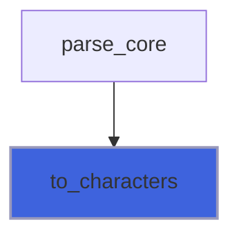
```mermaid
flowchart TD
  parse_core["parse_core"] --> to_characters["to_characters"]
  style to_characters fill:#3e63dd,stroke:#99b,stroke-width:2px
```

### list_count

Return the number of items of a stored list; an empty (blank) list has none.

**Attributes**: pure

**Returns**: integer(kind=[I4P](/api/src/third_party/PENF/src/lib/penf_global_parameters_variables))

```fortran
function list_count(list) result(n)
```

**Arguments**

| Name | Type | Intent | Attributes | Description |
|------|------|--------|------------|-------------|
| `list` | character(len=*) | in |  | Stored list. |

**Call graph**

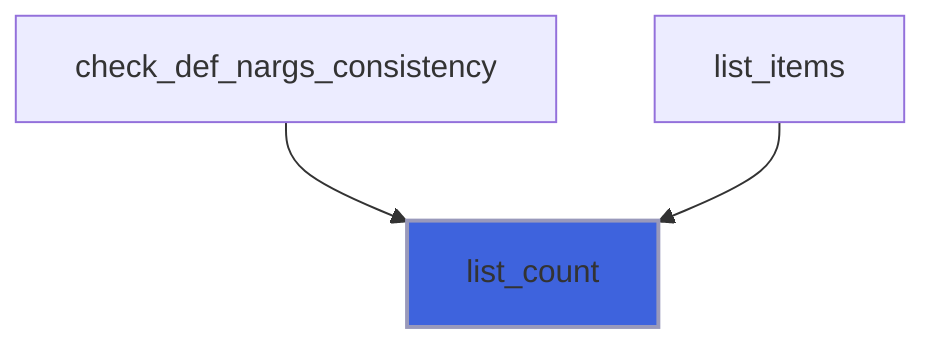
```mermaid
flowchart TD
  check_def_nargs_consistency["check_def_nargs_consistency"] --> list_count["list_count"]
  list_items["list_items"] --> list_count["list_count"]
  style list_count fill:#3e63dd,stroke:#99b,stroke-width:2px
```

### list_join

Return the items of a stored list with a separator between them.

**Attributes**: pure

**Returns**: `character(len=:)`

```fortran
function list_join(list, sep) result(joined)
```

**Arguments**

| Name | Type | Intent | Attributes | Description |
|------|------|--------|------------|-------------|
| `list` | character(len=*) | in |  | Stored list. |
| `sep` | character(len=*) | in |  | Separator. |

**Call graph**

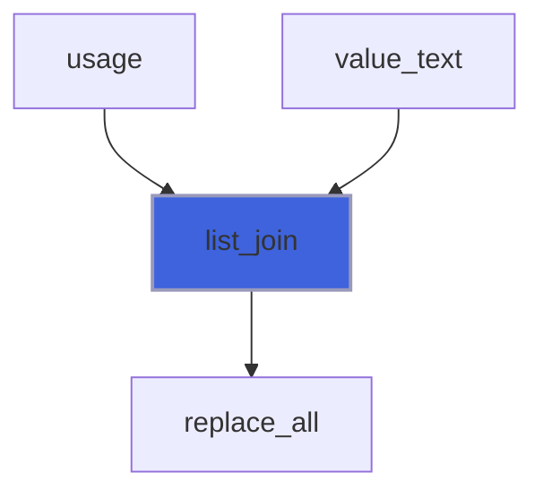
```mermaid
flowchart TD
  usage["usage"] --> list_join["list_join"]
  value_text["value_text"] --> list_join["list_join"]
  list_join["list_join"] --> replace_all["replace_all"]
  style list_join fill:#3e63dd,stroke:#99b,stroke-width:2px
```

### replace

Replace substring (only first occurrence) into a string.

**Attributes**: pure

**Returns**: `character(len=:)`

```fortran
function replace(string, substring, restring) result(newstring)
```

**Arguments**

| Name | Type | Intent | Attributes | Description |
|------|------|--------|------------|-------------|
| `string` | character(len=*) | in |  | String to be modified. |
| `substring` | character(len=*) | in |  | Substring to be replaced. |
| `restring` | character(len=*) | in |  | String to be inserted. |

### replace_all

Replace substring (all occurrences) into a string.

 The string is scanned once from left to right, so a replacement containing the substring is not replaced again.
 @note Leading and trailing white spaces are stripped out.

**Attributes**: pure

**Returns**: `character(len=:)`

```fortran
function replace_all(string, substring, restring) result(newstring)
```

**Arguments**

| Name | Type | Intent | Attributes | Description |
|------|------|--------|------------|-------------|
| `string` | character(len=*) | in |  | String to be modified. |
| `substring` | character(len=*) | in |  | Substring to be replaced. |
| `restring` | character(len=*) | in |  | String to be inserted. |

**Call graph**

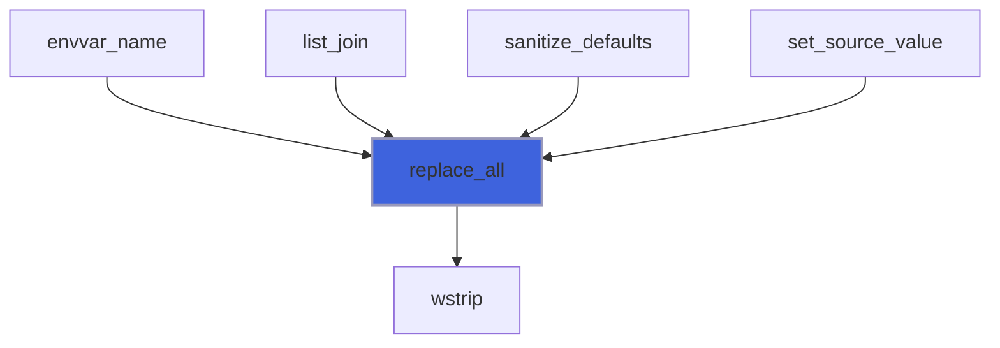
```mermaid
flowchart TD
  envvar_name["envvar_name"] --> replace_all["replace_all"]
  list_join["list_join"] --> replace_all["replace_all"]
  sanitize_defaults["sanitize_defaults"] --> replace_all["replace_all"]
  set_source_value["set_source_value"] --> replace_all["replace_all"]
  replace_all["replace_all"] --> wstrip["wstrip"]
  style replace_all fill:#3e63dd,stroke:#99b,stroke-width:2px
```

### unique

Reduce to one (unique) multiple (sequential) occurrences of a characters substring into a string.

 For example the string ' ab-cre-cre-ab' is reduce to ' ab-cre-ab' if the substring is '-cre'. The result has the length
 of the input string, padded with trailing blanks.

**Attributes**: elemental

**Returns**: `character(len=len)`

```fortran
function unique(string, substring) result(uniq)
```

**Arguments**

| Name | Type | Intent | Attributes | Description |
|------|------|--------|------------|-------------|
| `string` | character(len=*) | in |  | String to be parsed. |
| `substring` | character(len=*) | in |  | Substring which multiple occurences must be reduced to one. |

**Call graph**

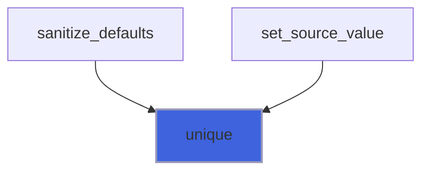
```mermaid
flowchart TD
  sanitize_defaults["sanitize_defaults"] --> unique["unique"]
  set_source_value["set_source_value"] --> unique["unique"]
  style unique fill:#3e63dd,stroke:#99b,stroke-width:2px
```

### upper_case

Convert the lower case characters of a string to upper case one.

**Attributes**: elemental

**Returns**: `character(len=len)`

```fortran
function upper_case(string)
```

**Arguments**

| Name | Type | Intent | Attributes | Description |
|------|------|--------|------------|-------------|
| `string` | character(len=*) | in |  | String to be converted. |

**Call graph**

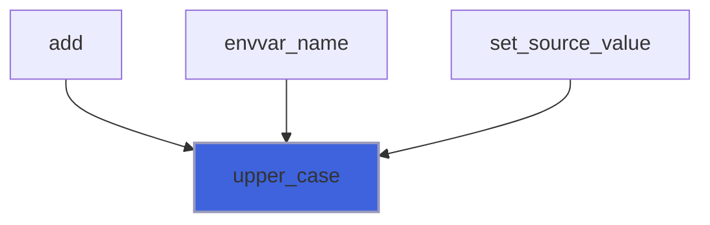
```mermaid
flowchart TD
  add["add"] --> upper_case["upper_case"]
  envvar_name["envvar_name"] --> upper_case["upper_case"]
  set_source_value["set_source_value"] --> upper_case["upper_case"]
  style upper_case fill:#3e63dd,stroke:#99b,stroke-width:2px
```

### wstrip

Strip out leading and trailing white spaces from a string.

**Attributes**: pure

**Returns**: `character(len=:)`

```fortran
function wstrip(string) result(newstring)
```

**Arguments**

| Name | Type | Intent | Attributes | Description |
|------|------|--------|------------|-------------|
| `string` | character(len=*) | in |  | String to be modified. |

**Call graph**

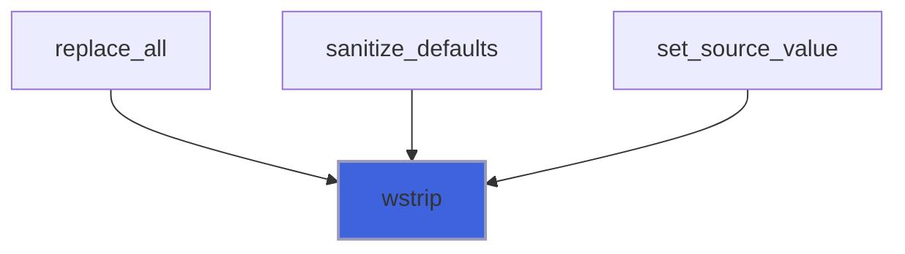
```mermaid
flowchart TD
  replace_all["replace_all"] --> wstrip["wstrip"]
  sanitize_defaults["sanitize_defaults"] --> wstrip["wstrip"]
  set_source_value["set_source_value"] --> wstrip["wstrip"]
  style wstrip fill:#3e63dd,stroke:#99b,stroke-width:2px
```
