# flap_test_utils

> Utilities for FLAP test programs: assertions, output capture and self re-invocation.

 Assertions end the program with `error stop 1` on failure, so a failed check always gives a non-zero exit status.

 Output capture: pass the unit returned by `capture_open` as `usage_lun`/`error_lun`/`version_lun` to `cli%init`, then
 `read_back` the text written to it.

 Self re-invocation: `reinvoke` runs the calling program again in a child process with `FLAP_TEST_CASE` set, so the child
 knows (via `child_case`) which scenario to run. This is how a test exercises environment variables, standard input, exit
 statuses and the paths that end the program (`--help`, `--version`). It requires a POSIX `sh` and `env`.

**Source**: `src/tests/flap_test_utils.F90`

**Dependencies**

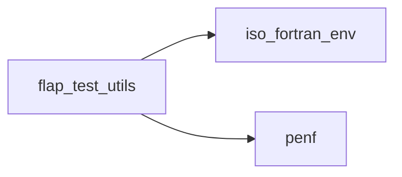

## Contents

- [assert_equal](#assert-equal)
- [assert](#assert)
- [assert_contains](#assert-contains)
- [assert_equal_character](#assert-equal-character)
- [assert_equal_logical](#assert-equal-logical)
- [assert_equal_I4P](#assert-equal-i4p)
- [assert_equal_R8P](#assert-equal-r8p)
- [assert_equal_I4P_1d](#assert-equal-i4p-1d)
- [assert_equal_R8P_1d](#assert-equal-r8p-1d)
- [capture_open](#capture-open)
- [capture_close](#capture-close)
- [write_file](#write-file)
- [delete_file](#delete-file)
- [run_command](#run-command)
- [reinvoke](#reinvoke)
- [fail](#fail)
- [read_back](#read-back)
- [read_file](#read-file)
- [scratch_file](#scratch-file)
- [child_case](#child-case)
- [read_all](#read-all)
- [integer_to_string](#integer-to-string)
- [real_to_string](#real-to-string)
- [logical_to_string](#logical-to-string)
- [reals_match](#reals-match)

## Variables

| Name | Type | Attributes | Description |
|------|------|------------|-------------|
| `CASE_ENV` | character(len=*) | parameter | Environment variable selecting the child scenario. |

## Interfaces

### assert_equal

Assert that an actual value equals the expected one.

**Module procedures**: [`assert_equal_character`](/api/src/tests/flap_test_utils#assert-equal-character), [`assert_equal_logical`](/api/src/tests/flap_test_utils#assert-equal-logical), [`assert_equal_I4P`](/api/src/tests/flap_test_utils#assert-equal-i4p), [`assert_equal_R8P`](/api/src/tests/flap_test_utils#assert-equal-r8p), [`assert_equal_I4P_1d`](/api/src/tests/flap_test_utils#assert-equal-i4p-1d), [`assert_equal_R8P_1d`](/api/src/tests/flap_test_utils#assert-equal-r8p-1d)

## Subroutines

### assert

Assert that a condition holds.

```fortran
subroutine assert(condition, message)
```

**Arguments**

| Name | Type | Intent | Attributes | Description |
|------|------|--------|------------|-------------|
| `condition` | logical | in |  | Condition to check. |
| `message` | character(len=*) | in |  | Description of the check. |

**Call graph**

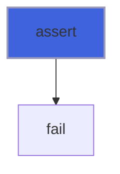

### assert_contains

Assert that a text contains a substring.

```fortran
subroutine assert_contains(text, substring, message)
```

**Arguments**

| Name | Type | Intent | Attributes | Description |
|------|------|--------|------------|-------------|
| `text` | character(len=*) | in |  | Text to search. |
| `substring` | character(len=*) | in |  | Substring expected in the text. |
| `message` | character(len=*) | in |  | Description of the check. |

**Call graph**

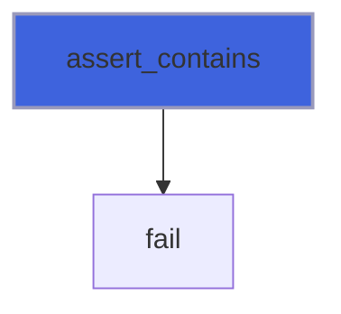

### assert_equal_character

Assert that two strings are equal (Fortran comparison: trailing blanks are not significant).

```fortran
subroutine assert_equal_character(actual, expected, message)
```

**Arguments**

| Name | Type | Intent | Attributes | Description |
|------|------|--------|------------|-------------|
| `actual` | character(len=*) | in |  | Actual value. |
| `expected` | character(len=*) | in |  | Expected value. |
| `message` | character(len=*) | in |  | Description of the check. |

**Call graph**

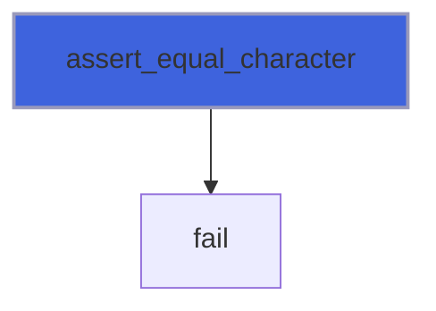

### assert_equal_logical

Assert that two logicals are equal.

```fortran
subroutine assert_equal_logical(actual, expected, message)
```

**Arguments**

| Name | Type | Intent | Attributes | Description |
|------|------|--------|------------|-------------|
| `actual` | logical | in |  | Actual value. |
| `expected` | logical | in |  | Expected value. |
| `message` | character(len=*) | in |  | Description of the check. |

**Call graph**

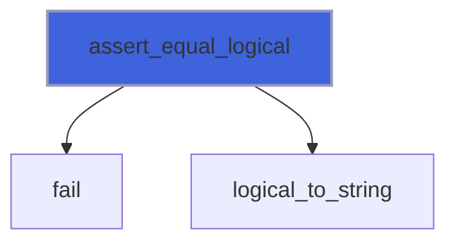

### assert_equal_I4P

Assert that two integers are equal.

```fortran
subroutine assert_equal_I4P(actual, expected, message)
```

**Arguments**

| Name | Type | Intent | Attributes | Description |
|------|------|--------|------------|-------------|
| `actual` | integer(kind=[I4P](/api/src/third_party/PENF/src/lib/penf_global_parameters_variables)) | in |  | Actual value. |
| `expected` | integer(kind=[I4P](/api/src/third_party/PENF/src/lib/penf_global_parameters_variables)) | in |  | Expected value. |
| `message` | character(len=*) | in |  | Description of the check. |

**Call graph**

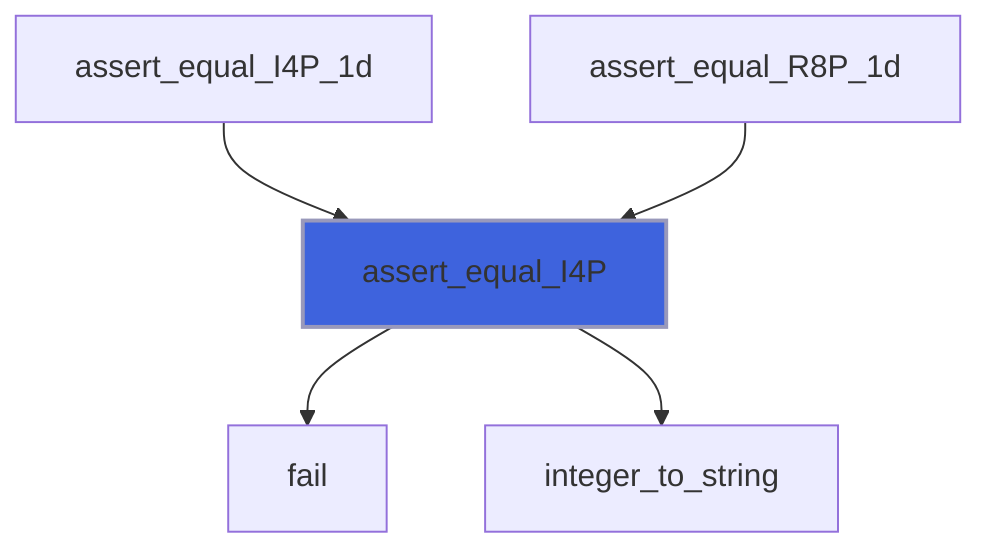

### assert_equal_R8P

Assert that two reals are equal, exactly or within an absolute tolerance.

```fortran
subroutine assert_equal_R8P(actual, expected, message, tol)
```

**Arguments**

| Name | Type | Intent | Attributes | Description |
|------|------|--------|------------|-------------|
| `actual` | real(kind=[R8P](/api/src/third_party/PENF/src/lib/penf_global_parameters_variables)) | in |  | Actual value. |
| `expected` | real(kind=[R8P](/api/src/third_party/PENF/src/lib/penf_global_parameters_variables)) | in |  | Expected value. |
| `message` | character(len=*) | in |  | Description of the check. |
| `tol` | real(kind=[R8P](/api/src/third_party/PENF/src/lib/penf_global_parameters_variables)) | in | optional | Absolute tolerance (default: exact comparison). |

**Call graph**

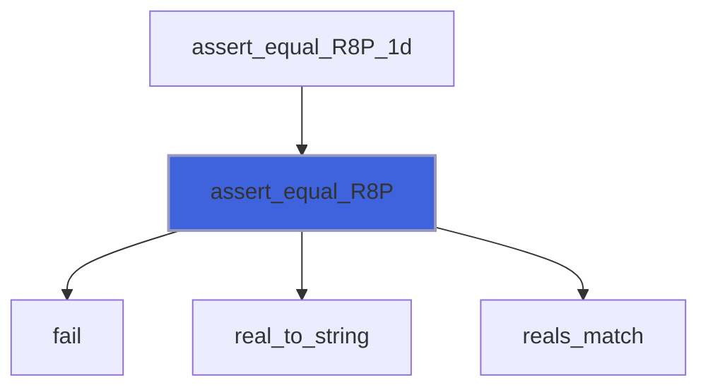

### assert_equal_I4P_1d

Assert that two integer arrays are equal.

```fortran
subroutine assert_equal_I4P_1d(actual, expected, message)
```

**Arguments**

| Name | Type | Intent | Attributes | Description |
|------|------|--------|------------|-------------|
| `actual` | integer(kind=[I4P](/api/src/third_party/PENF/src/lib/penf_global_parameters_variables)) | in |  | Actual values. |
| `expected` | integer(kind=[I4P](/api/src/third_party/PENF/src/lib/penf_global_parameters_variables)) | in |  | Expected values. |
| `message` | character(len=*) | in |  | Description of the check. |

**Call graph**

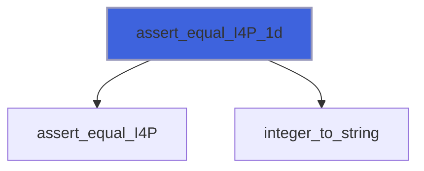

### assert_equal_R8P_1d

Assert that two real arrays are equal, exactly or within an absolute tolerance.

```fortran
subroutine assert_equal_R8P_1d(actual, expected, message, tol)
```

**Arguments**

| Name | Type | Intent | Attributes | Description |
|------|------|--------|------------|-------------|
| `actual` | real(kind=[R8P](/api/src/third_party/PENF/src/lib/penf_global_parameters_variables)) | in |  | Actual values. |
| `expected` | real(kind=[R8P](/api/src/third_party/PENF/src/lib/penf_global_parameters_variables)) | in |  | Expected values. |
| `message` | character(len=*) | in |  | Description of the check. |
| `tol` | real(kind=[R8P](/api/src/third_party/PENF/src/lib/penf_global_parameters_variables)) | in | optional | Absolute tolerance (default: exact comparison). |

**Call graph**

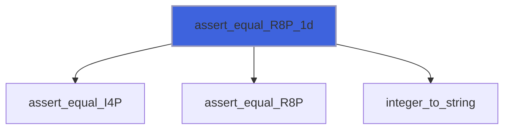

### capture_open

Open a scratch unit to capture output.

```fortran
subroutine capture_open(lun)
```

**Arguments**

| Name | Type | Intent | Attributes | Description |
|------|------|--------|------------|-------------|
| `lun` | integer(kind=[I4P](/api/src/third_party/PENF/src/lib/penf_global_parameters_variables)) | out |  | Capture unit. |

**Call graph**

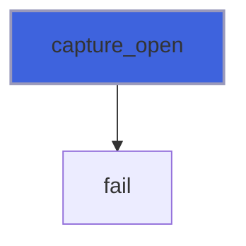

### capture_close

Close (and delete) a capture unit.

```fortran
subroutine capture_close(lun)
```

**Arguments**

| Name | Type | Intent | Attributes | Description |
|------|------|--------|------------|-------------|
| `lun` | integer(kind=[I4P](/api/src/third_party/PENF/src/lib/penf_global_parameters_variables)) | in |  | Capture unit. |

### write_file

Write a text to a new file byte by byte (no newline added), replacing any existing one.

```fortran
subroutine write_file(path, text)
```

**Arguments**

| Name | Type | Intent | Attributes | Description |
|------|------|--------|------------|-------------|
| `path` | character(len=*) | in |  | File path. |
| `text` | character(len=*) | in |  | Text to write, with its own `new_line` characters. |

**Call graph**

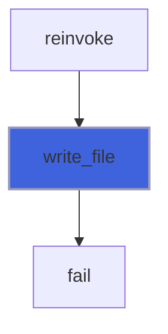

### delete_file

Delete a file.

```fortran
subroutine delete_file(path)
```

**Arguments**

| Name | Type | Intent | Attributes | Description |
|------|------|--------|------------|-------------|
| `path` | character(len=*) | in |  | File path. |

**Call graph**

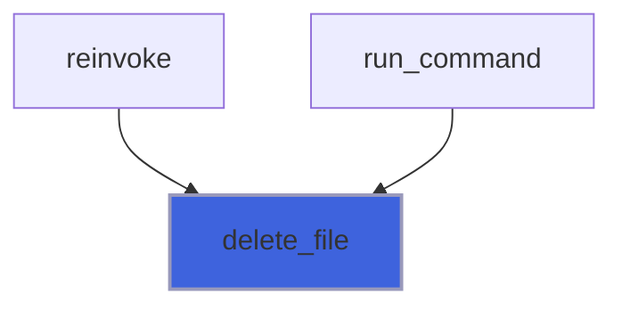

### run_command

Run a shell command (by `sh`) and return its exit status and its standard output and error, merged.

```fortran
subroutine run_command(cmd, exitstat, out)
```

**Arguments**

| Name | Type | Intent | Attributes | Description |
|------|------|--------|------------|-------------|
| `cmd` | character(len=*) | in |  | Shell command. |
| `exitstat` | integer(kind=[I4P](/api/src/third_party/PENF/src/lib/penf_global_parameters_variables)) | out |  | Exit status of the command. |
| `out` | character(len=:) | out | allocatable | Standard output and error of the command. |

**Call graph**

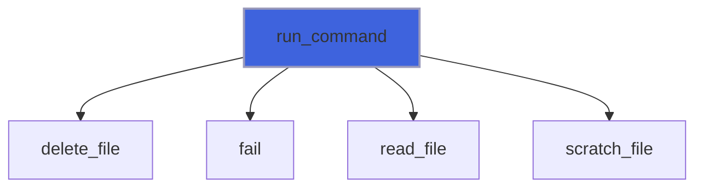

### reinvoke

Run the calling program again as a child process executing scenario `case` (read by the child with `child_case`).

 The command line is `env [env] FLAP_TEST_CASE=case 'self' [args] < stdin > out 2> err`, run by `sh`: `args` and `env` are
 passed verbatim, so shell quoting is the caller's responsibility. `env` takes `env` operands with options first, e.g.
 '-u OLD NEW=value' unsets OLD and sets NEW. Without `stdin` the child reads from `/dev/null`.

```fortran
subroutine reinvoke(case, exitstat, out, err, args, env, stdin)
```

**Arguments**

| Name | Type | Intent | Attributes | Description |
|------|------|--------|------------|-------------|
| `case` | integer(kind=[I4P](/api/src/third_party/PENF/src/lib/penf_global_parameters_variables)) | in |  | Scenario run by the child. |
| `exitstat` | integer(kind=[I4P](/api/src/third_party/PENF/src/lib/penf_global_parameters_variables)) | out |  | Exit status of the child. |
| `out` | character(len=:) | out | allocatable | Standard output of the child. |
| `err` | character(len=:) | out | allocatable | Standard error of the child. |
| `args` | character(len=*) | in | optional | Command line arguments for the child. |
| `env` | character(len=*) | in | optional | Extra `env` operands, options first: '-u OLD NEW=value'. |
| `stdin` | character(len=*) | in | optional | Standard input for the child. |

**Call graph**

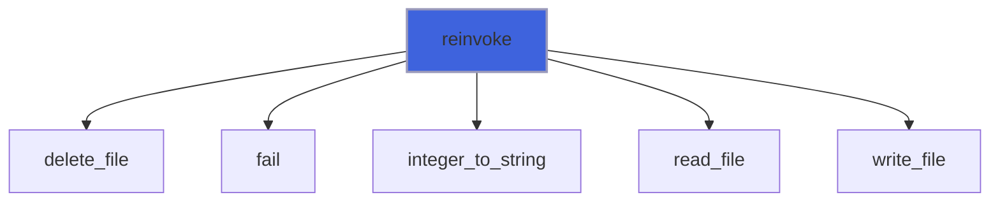

### fail

Report a failed check and end the program with a non-zero exit status.

```fortran
subroutine fail(message)
```

**Arguments**

| Name | Type | Intent | Attributes | Description |
|------|------|--------|------------|-------------|
| `message` | character(len=*) | in |  | Failure description. |

**Call graph**

```mermaid
flowchart TD
  assert["assert"] --> fail["fail"]
  assert_contains["assert_contains"] --> fail["fail"]
  assert_equal_I4P["assert_equal_I4P"] --> fail["fail"]
  assert_equal_R8P["assert_equal_R8P"] --> fail["fail"]
  assert_equal_character["assert_equal_character"] --> fail["fail"]
  assert_equal_logical["assert_equal_logical"] --> fail["fail"]
  capture_open["capture_open"] --> fail["fail"]
  child_case["child_case"] --> fail["fail"]
  read_all["read_all"] --> fail["fail"]
  read_file["read_file"] --> fail["fail"]
  reinvoke["reinvoke"] --> fail["fail"]
  run_command["run_command"] --> fail["fail"]
  write_file["write_file"] --> fail["fail"]
  style fail fill:#3e63dd,stroke:#99b,stroke-width:2px
```

## Functions

### read_back

Return the text written to a capture unit so far, then empty the unit: the next capture starts from scratch.

**Returns**: `character(len=:)`

```fortran
function read_back(lun) result(text)
```

**Arguments**

| Name | Type | Intent | Attributes | Description |
|------|------|--------|------------|-------------|
| `lun` | integer(kind=[I4P](/api/src/third_party/PENF/src/lib/penf_global_parameters_variables)) | in |  | Capture unit. |

**Call graph**

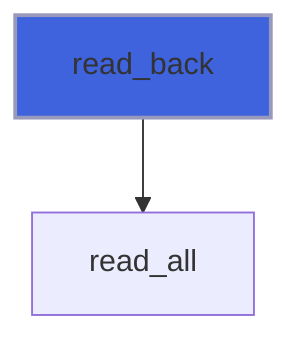

### read_file

Return the whole content of a text file.

**Returns**: `character(len=:)`

```fortran
function read_file(path) result(text)
```

**Arguments**

| Name | Type | Intent | Attributes | Description |
|------|------|--------|------------|-------------|
| `path` | character(len=*) | in |  | File path. |

**Call graph**

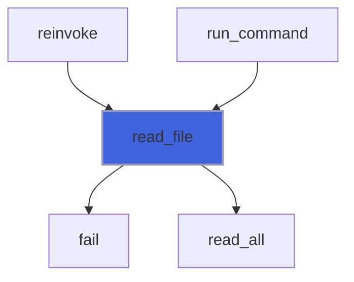

### scratch_file

Path of a scratch file next to the running executable (a build directory, never the source tree).

**Returns**: `character(len=:)`

```fortran
function scratch_file(name) result(path)
```

**Arguments**

| Name | Type | Intent | Attributes | Description |
|------|------|--------|------------|-------------|
| `name` | character(len=*) | in |  | File name suffix. |

**Call graph**

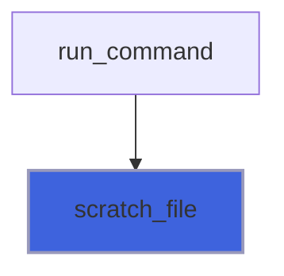

### child_case

Return the scenario requested by `reinvoke`, or 0 when the program was not re-invoked.

**Returns**: integer(kind=[I4P](/api/src/third_party/PENF/src/lib/penf_global_parameters_variables))

```fortran
function child_case() result(case)
```

**Call graph**

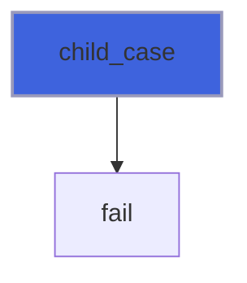

### read_all

Read a formatted unit from its current position to the end; lines of any length are supported.

**Returns**: `character(len=:)`

```fortran
function read_all(lun) result(text)
```

**Arguments**

| Name | Type | Intent | Attributes | Description |
|------|------|--------|------------|-------------|
| `lun` | integer(kind=[I4P](/api/src/third_party/PENF/src/lib/penf_global_parameters_variables)) | in |  | Unit to read. |

**Call graph**

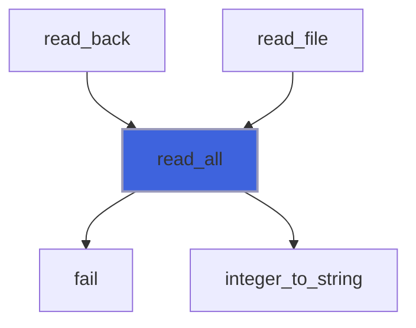

### integer_to_string

Convert an integer to a string without blanks.

**Attributes**: pure

**Returns**: `character(len=:)`

```fortran
function integer_to_string(n) result(string)
```

**Arguments**

| Name | Type | Intent | Attributes | Description |
|------|------|--------|------------|-------------|
| `n` | integer(kind=[I4P](/api/src/third_party/PENF/src/lib/penf_global_parameters_variables)) | in |  | Integer to convert. |

**Call graph**

```mermaid
flowchart TD
  assert_equal_I4P["assert_equal_I4P"] --> integer_to_string["integer_to_string"]
  assert_equal_I4P_1d["assert_equal_I4P_1d"] --> integer_to_string["integer_to_string"]
  assert_equal_R8P_1d["assert_equal_R8P_1d"] --> integer_to_string["integer_to_string"]
  read_all["read_all"] --> integer_to_string["integer_to_string"]
  reinvoke["reinvoke"] --> integer_to_string["integer_to_string"]
  style integer_to_string fill:#3e63dd,stroke:#99b,stroke-width:2px
```

### real_to_string

Convert a real to a string in scientific notation, with enough digits to tell neighbouring values apart.

**Attributes**: pure

**Returns**: `character(len=:)`

```fortran
function real_to_string(x) result(string)
```

**Arguments**

| Name | Type | Intent | Attributes | Description |
|------|------|--------|------------|-------------|
| `x` | real(kind=[R8P](/api/src/third_party/PENF/src/lib/penf_global_parameters_variables)) | in |  | Real to convert. |

**Call graph**

```mermaid
flowchart TD
  assert_equal_R8P["assert_equal_R8P"] --> real_to_string["real_to_string"]
  style real_to_string fill:#3e63dd,stroke:#99b,stroke-width:2px
```

### logical_to_string

Convert a logical to '.true.' or '.false.'.

**Attributes**: pure

**Returns**: `character(len=:)`

```fortran
function logical_to_string(l) result(string)
```

**Arguments**

| Name | Type | Intent | Attributes | Description |
|------|------|--------|------------|-------------|
| `l` | logical | in |  | Logical to convert. |

**Call graph**

```mermaid
flowchart TD
  assert_equal_logical["assert_equal_logical"] --> logical_to_string["logical_to_string"]
  style logical_to_string fill:#3e63dd,stroke:#99b,stroke-width:2px
```

### reals_match

Compare two reals, exactly or within an absolute tolerance.

**Attributes**: pure

**Returns**: `logical`

```fortran
function reals_match(actual, expected, tol) result(match)
```

**Arguments**

| Name | Type | Intent | Attributes | Description |
|------|------|--------|------------|-------------|
| `actual` | real(kind=[R8P](/api/src/third_party/PENF/src/lib/penf_global_parameters_variables)) | in |  | Actual value. |
| `expected` | real(kind=[R8P](/api/src/third_party/PENF/src/lib/penf_global_parameters_variables)) | in |  | Expected value. |
| `tol` | real(kind=[R8P](/api/src/third_party/PENF/src/lib/penf_global_parameters_variables)) | in | optional | Absolute tolerance (default: exact comparison). |

**Call graph**

```mermaid
flowchart TD
  assert_equal_R8P["assert_equal_R8P"] --> reals_match["reals_match"]
  style reals_match fill:#3e63dd,stroke:#99b,stroke-width:2px
```
