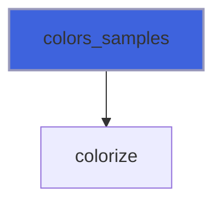
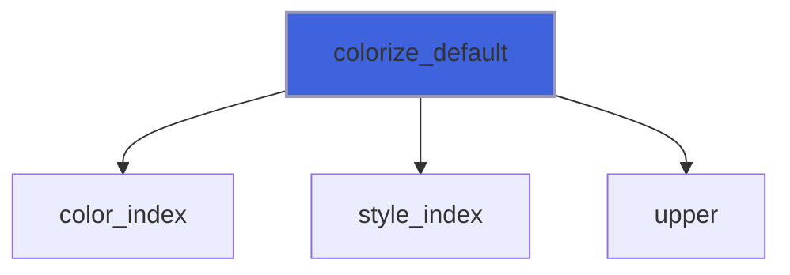
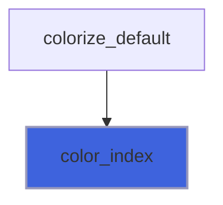
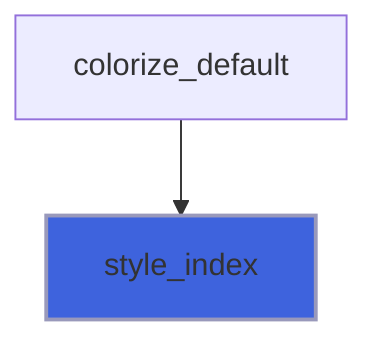
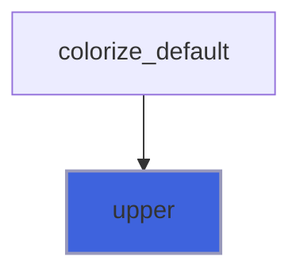

# face

> FACE, Fortran Ansi Colors Environment.

**Source**: `src/third_party/FACE/src/lib/face.F90`

**Dependencies**


## Contents

- [colorize](#colorize)
- [colors_samples](#colors-samples)
- [styles_samples](#styles-samples)
- [colorize_default](#colorize-default)
- [color_index](#color-index)
- [style_index](#style-index)
- [upper](#upper)

## Variables

| Name | Type | Attributes | Description |
|------|------|------------|-------------|
| `ASCII` | integer | parameter | ASCII character set kind. |
| `UCS4` | integer | parameter | Unicode character set kind. |
| `UPPER_ALPHABET` | character(len=26) | parameter | Upper case alphabet. |
| `LOWER_ALPHABET` | character(len=26) | parameter | Lower case alphabet. |
| `NL` | character(len=1) | parameter | New line character. |
| `ESCAPE` | character(len=1) | parameter | "\" character. |
| `CODE_START` | character(len=2) | parameter | Start ansi code, "\[". |
| `CODE_END` | character(len=1) | parameter | End ansi code, "m". |
| `CODE_CLEAR` | character(len=4) | parameter | Clear all styles, "\[0m". |
| `STYLES` | character(len=17) | parameter | Styles. |
| `COLORS_FG` | character(len=15) | parameter | Foreground colors. |
| `COLORS_BG` | character(len=15) | parameter | Background colors. |

## Interfaces

### colorize

**Module procedures**: [`colorize_default`](/api/src/third_party/FACE/src/lib/face#colorize-default)

## Subroutines

### colors_samples

Print to standard output all colors samples.

```fortran
subroutine colors_samples()
```

**Call graph**



### styles_samples

Print to standard output all styles samples.

```fortran
subroutine styles_samples()
```

**Call graph**


## Functions

### colorize_default

Colorize and stylize strings, DEFAULT kind.

**Attributes**: pure

**Returns**: `character(len=:)`

```fortran
function colorize_default(string, color_fg, color_bg, style) result(colorized)
```

**Arguments**

| Name | Type | Intent | Attributes | Description |
|------|------|--------|------------|-------------|
| `string` | character(len=*) | in |  | Input string. |
| `color_fg` | character(len=*) | in | optional | Foreground color definition. |
| `color_bg` | character(len=*) | in | optional | Background color definition. |
| `style` | character(len=*) | in | optional | Style definition. |

**Call graph**



### color_index

Return the array-index corresponding to the queried color.

 @note Because Foreground and backround colors lists share the same name, no matter what array is used to find the color index.
 Thus, the foreground array is used.

**Attributes**: elemental

**Returns**: `integer(kind=int32)`

```fortran
function color_index(color)
```

**Arguments**

| Name | Type | Intent | Attributes | Description |
|------|------|--------|------------|-------------|
| `color` | character(len=*) | in |  | Color definition. |

**Call graph**



### style_index

Return the array-index corresponding to the queried style.

**Attributes**: elemental

**Returns**: `integer(kind=int32)`

```fortran
function style_index(style)
```

**Arguments**

| Name | Type | Intent | Attributes | Description |
|------|------|--------|------------|-------------|
| `style` | character(len=*) | in |  | Style definition. |

**Call graph**



### upper

Return a string with all uppercase characters.

**Attributes**: elemental

**Returns**: `character(len=len)`

```fortran
function upper(string)
```

**Arguments**

| Name | Type | Intent | Attributes | Description |
|------|------|--------|------------|-------------|
| `string` | character(len=*) | in |  | Input string. |

**Call graph**


