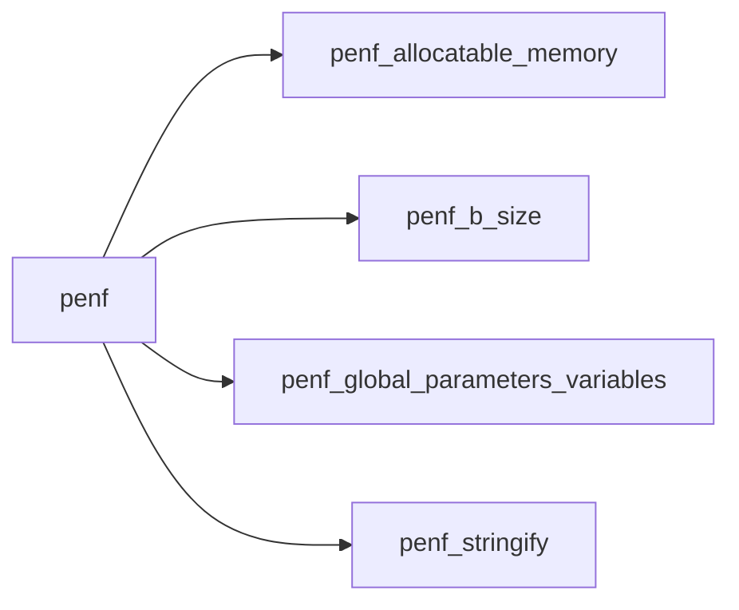
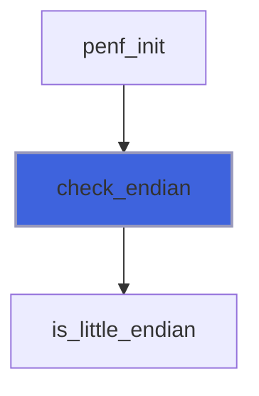
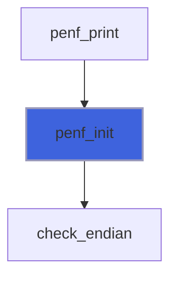
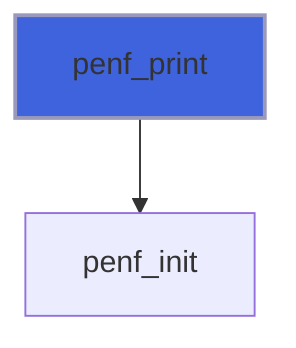

# penf

> Portability Environment for Fortran poor people.

**Source**: `src/third_party/PENF/src/lib/penf.F90`

**Dependencies**



## Contents

- [bit_size](#bit-size)
- [digit](#digit)
- [check_endian](#check-endian)
- [penf_init](#penf-init)
- [penf_print](#penf-print)
- [digit_I8](#digit-i8)
- [digit_I4](#digit-i4)
- [digit_I2](#digit-i2)
- [digit_I1](#digit-i1)

## Variables

| Name | Type | Attributes | Description |
|------|------|------------|-------------|
| `endian` | integer |  | Bit ordering: Little endian (endianL), or Big endian (endianB). |
| `is_initialized` | logical |  | Check the initialization of some variables that must be initialized. |

## Interfaces

### bit_size

Overloading of the intrinsic *bit_size* function for computing the number of bits of (also) real and character variables.

### digit

Compute the number of digits in decimal base of the input integer.

**Module procedures**: [`digit_I8`](/api/src/third_party/PENF/src/lib/penf#digit-i8), [`digit_I4`](/api/src/third_party/PENF/src/lib/penf#digit-i4), [`digit_I2`](/api/src/third_party/PENF/src/lib/penf#digit-i2), [`digit_I1`](/api/src/third_party/PENF/src/lib/penf#digit-i1)

## Subroutines

### check_endian

Check the type of bit ordering (big or little endian) of the running architecture.

 @note The result is stored into the *endian* global variable.

```fortran
 use penf
 call check_endian
 print *, endian
```

```fortran
subroutine check_endian()
```

**Call graph**



### penf_init

Initialize PENF's variables that are not initialized into the definition specification.

```fortran
 use penf
 call penf_init
 print FI1P, BYR4P
```

```fortran
subroutine penf_init()
```

**Call graph**



### penf_print

Print to the specified unit the PENF's environment data.

```fortran
 use penf
 integer :: u
 open(newunit=u, status='scratch')
 call penf_print(u)
 close(u)
 print "(A)", 'done'
```

```fortran
subroutine penf_print(unit, pref, iostat, iomsg)
```

**Arguments**

| Name | Type | Intent | Attributes | Description |
|------|------|--------|------------|-------------|
| `unit` | integer(kind=[I4P](/api/src/third_party/PENF/src/lib/penf_global_parameters_variables)) | in |  | Logic unit. |
| `pref` | character(len=*) | in | optional | Prefixing string. |
| `iostat` | integer(kind=[I4P](/api/src/third_party/PENF/src/lib/penf_global_parameters_variables)) | out | optional | IO error. |
| `iomsg` | character(len=*) | out | optional | IO error message. |

**Call graph**



## Functions

### digit_I8

Compute the number of digits in decimal base of the input integer.

```fortran
 use penf
 print FI4P, digit(100_I8P)
```

**Attributes**: elemental

**Returns**: integer(kind=[I4P](/api/src/third_party/PENF/src/lib/penf_global_parameters_variables))

```fortran
function digit_I8(n) result(digit)
```

**Arguments**

| Name | Type | Intent | Attributes | Description |
|------|------|--------|------------|-------------|
| `n` | integer(kind=[I8P](/api/src/third_party/PENF/src/lib/penf_global_parameters_variables)) | in |  | Input integer. |

### digit_I4

Compute the number of digits in decimal base of the input integer.

```fortran
 use penf
 print FI4P, digit(100_I4P)
```

**Attributes**: elemental

**Returns**: integer(kind=[I4P](/api/src/third_party/PENF/src/lib/penf_global_parameters_variables))

```fortran
function digit_I4(n) result(digit)
```

**Arguments**

| Name | Type | Intent | Attributes | Description |
|------|------|--------|------------|-------------|
| `n` | integer(kind=[I4P](/api/src/third_party/PENF/src/lib/penf_global_parameters_variables)) | in |  | Input integer. |

### digit_I2

Compute the number of digits in decimal base of the input integer.

```fortran
 use penf
 print FI4P, digit(100_I2P)
```

**Attributes**: elemental

**Returns**: integer(kind=[I4P](/api/src/third_party/PENF/src/lib/penf_global_parameters_variables))

```fortran
function digit_I2(n) result(digit)
```

**Arguments**

| Name | Type | Intent | Attributes | Description |
|------|------|--------|------------|-------------|
| `n` | integer(kind=[I2P](/api/src/third_party/PENF/src/lib/penf_global_parameters_variables)) | in |  | Input integer. |

### digit_I1

Compute the number of digits in decimal base of the input integer.

```fortran
 use penf
 print FI4P, digit(100_I1P)
```

**Attributes**: elemental

**Returns**: integer(kind=[I4P](/api/src/third_party/PENF/src/lib/penf_global_parameters_variables))

```fortran
function digit_I1(n) result(digit)
```

**Arguments**

| Name | Type | Intent | Attributes | Description |
|------|------|--------|------------|-------------|
| `n` | integer(kind=[I1P](/api/src/third_party/PENF/src/lib/penf_global_parameters_variables)) | in |  | Input integer. |
