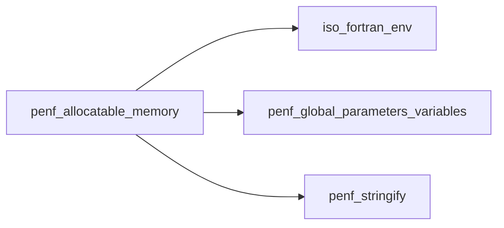
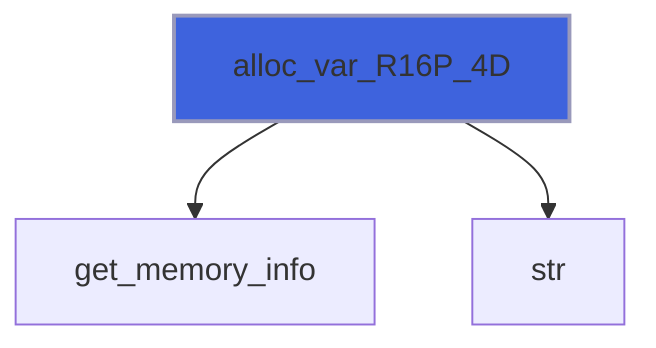
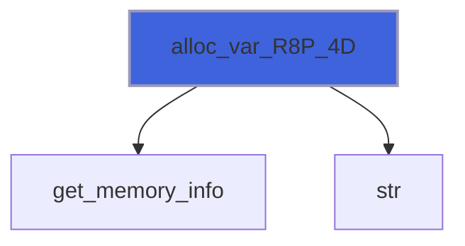

# penf_allocatable_memory

> PENF allocatable memory facility.
 Wrap allocatable arrays routines providing extra information about memory handling.

**Source**: `src/third_party/PENF/src/lib/penf_allocatable_memory.F90`

**Dependencies**



## Contents

- [allocate_variable](#allocate-variable)
- [assign_allocatable](#assign-allocatable)
- [alloc_var_R16P_1D](#alloc-var-r16p-1d)
- [alloc_var_R16P_2D](#alloc-var-r16p-2d)
- [alloc_var_R16P_3D](#alloc-var-r16p-3d)
- [alloc_var_R16P_4D](#alloc-var-r16p-4d)
- [alloc_var_R16P_5D](#alloc-var-r16p-5d)
- [alloc_var_R16P_6D](#alloc-var-r16p-6d)
- [alloc_var_R16P_7D](#alloc-var-r16p-7d)
- [alloc_var_R8P_1D](#alloc-var-r8p-1d)
- [alloc_var_R8P_2D](#alloc-var-r8p-2d)
- [alloc_var_R8P_3D](#alloc-var-r8p-3d)
- [alloc_var_R8P_4D](#alloc-var-r8p-4d)
- [alloc_var_R8P_5D](#alloc-var-r8p-5d)
- [alloc_var_R8P_6D](#alloc-var-r8p-6d)
- [alloc_var_R8P_7D](#alloc-var-r8p-7d)
- [alloc_var_R4P_1D](#alloc-var-r4p-1d)
- [alloc_var_R4P_2D](#alloc-var-r4p-2d)
- [alloc_var_R4P_3D](#alloc-var-r4p-3d)
- [alloc_var_R4P_4D](#alloc-var-r4p-4d)
- [alloc_var_R4P_5D](#alloc-var-r4p-5d)
- [alloc_var_R4P_6D](#alloc-var-r4p-6d)
- [alloc_var_R4P_7D](#alloc-var-r4p-7d)
- [alloc_var_I8P_1D](#alloc-var-i8p-1d)
- [alloc_var_I8P_2D](#alloc-var-i8p-2d)
- [alloc_var_I8P_3D](#alloc-var-i8p-3d)
- [alloc_var_I8P_4D](#alloc-var-i8p-4d)
- [alloc_var_I8P_5D](#alloc-var-i8p-5d)
- [alloc_var_I8P_6D](#alloc-var-i8p-6d)
- [alloc_var_I8P_7D](#alloc-var-i8p-7d)
- [alloc_var_I4P_1D](#alloc-var-i4p-1d)
- [alloc_var_I4P_2D](#alloc-var-i4p-2d)
- [alloc_var_I4P_3D](#alloc-var-i4p-3d)
- [alloc_var_I4P_4D](#alloc-var-i4p-4d)
- [alloc_var_I4P_5D](#alloc-var-i4p-5d)
- [alloc_var_I4P_6D](#alloc-var-i4p-6d)
- [alloc_var_I4P_7D](#alloc-var-i4p-7d)
- [alloc_var_I2P_1D](#alloc-var-i2p-1d)
- [alloc_var_I2P_2D](#alloc-var-i2p-2d)
- [alloc_var_I2P_3D](#alloc-var-i2p-3d)
- [alloc_var_I2P_4D](#alloc-var-i2p-4d)
- [alloc_var_I2P_5D](#alloc-var-i2p-5d)
- [alloc_var_I2P_6D](#alloc-var-i2p-6d)
- [alloc_var_I2P_7D](#alloc-var-i2p-7d)
- [alloc_var_I1P_1D](#alloc-var-i1p-1d)
- [alloc_var_I1P_2D](#alloc-var-i1p-2d)
- [alloc_var_I1P_3D](#alloc-var-i1p-3d)
- [alloc_var_I1P_4D](#alloc-var-i1p-4d)
- [alloc_var_I1P_5D](#alloc-var-i1p-5d)
- [alloc_var_I1P_6D](#alloc-var-i1p-6d)
- [alloc_var_I1P_7D](#alloc-var-i1p-7d)
- [assign_allocatable_R16P_1D](#assign-allocatable-r16p-1d)
- [assign_allocatable_R16P_2D](#assign-allocatable-r16p-2d)
- [assign_allocatable_R16P_3D](#assign-allocatable-r16p-3d)
- [assign_allocatable_R16P_4D](#assign-allocatable-r16p-4d)
- [assign_allocatable_R16P_5D](#assign-allocatable-r16p-5d)
- [assign_allocatable_R16P_6D](#assign-allocatable-r16p-6d)
- [assign_allocatable_R16P_7D](#assign-allocatable-r16p-7d)
- [assign_allocatable_R8P_1D](#assign-allocatable-r8p-1d)
- [assign_allocatable_R8P_2D](#assign-allocatable-r8p-2d)
- [assign_allocatable_R8P_3D](#assign-allocatable-r8p-3d)
- [assign_allocatable_R8P_4D](#assign-allocatable-r8p-4d)
- [assign_allocatable_R8P_5D](#assign-allocatable-r8p-5d)
- [assign_allocatable_R8P_6D](#assign-allocatable-r8p-6d)
- [assign_allocatable_R8P_7D](#assign-allocatable-r8p-7d)
- [assign_allocatable_R4P_1D](#assign-allocatable-r4p-1d)
- [assign_allocatable_R4P_2D](#assign-allocatable-r4p-2d)
- [assign_allocatable_R4P_3D](#assign-allocatable-r4p-3d)
- [assign_allocatable_R4P_4D](#assign-allocatable-r4p-4d)
- [assign_allocatable_R4P_5D](#assign-allocatable-r4p-5d)
- [assign_allocatable_R4P_6D](#assign-allocatable-r4p-6d)
- [assign_allocatable_R4P_7D](#assign-allocatable-r4p-7d)
- [assign_allocatable_I8P_1D](#assign-allocatable-i8p-1d)
- [assign_allocatable_I8P_2D](#assign-allocatable-i8p-2d)
- [assign_allocatable_I8P_3D](#assign-allocatable-i8p-3d)
- [assign_allocatable_I8P_4D](#assign-allocatable-i8p-4d)
- [assign_allocatable_I8P_5D](#assign-allocatable-i8p-5d)
- [assign_allocatable_I8P_6D](#assign-allocatable-i8p-6d)
- [assign_allocatable_I8P_7D](#assign-allocatable-i8p-7d)
- [assign_allocatable_I4P_1D](#assign-allocatable-i4p-1d)
- [assign_allocatable_I4P_2D](#assign-allocatable-i4p-2d)
- [assign_allocatable_I4P_3D](#assign-allocatable-i4p-3d)
- [assign_allocatable_I4P_4D](#assign-allocatable-i4p-4d)
- [assign_allocatable_I4P_5D](#assign-allocatable-i4p-5d)
- [assign_allocatable_I4P_6D](#assign-allocatable-i4p-6d)
- [assign_allocatable_I4P_7D](#assign-allocatable-i4p-7d)
- [assign_allocatable_I2P_1D](#assign-allocatable-i2p-1d)
- [assign_allocatable_I2P_2D](#assign-allocatable-i2p-2d)
- [assign_allocatable_I2P_3D](#assign-allocatable-i2p-3d)
- [assign_allocatable_I2P_4D](#assign-allocatable-i2p-4d)
- [assign_allocatable_I2P_5D](#assign-allocatable-i2p-5d)
- [assign_allocatable_I2P_6D](#assign-allocatable-i2p-6d)
- [assign_allocatable_I2P_7D](#assign-allocatable-i2p-7d)
- [assign_allocatable_I1P_1D](#assign-allocatable-i1p-1d)
- [assign_allocatable_I1P_2D](#assign-allocatable-i1p-2d)
- [assign_allocatable_I1P_3D](#assign-allocatable-i1p-3d)
- [assign_allocatable_I1P_4D](#assign-allocatable-i1p-4d)
- [assign_allocatable_I1P_5D](#assign-allocatable-i1p-5d)
- [assign_allocatable_I1P_6D](#assign-allocatable-i1p-6d)
- [assign_allocatable_I1P_7D](#assign-allocatable-i1p-7d)
- [get_memory_info](#get-memory-info)
- [save_memory_status](#save-memory-status)

## Interfaces

### allocate_variable

Allocate CPU variable with memory checking.

**Module procedures**: [`alloc_var_R8P_1D`](/api/src/third_party/PENF/src/lib/penf_allocatable_memory#alloc-var-r8p-1d), [`alloc_var_R8P_2D`](/api/src/third_party/PENF/src/lib/penf_allocatable_memory#alloc-var-r8p-2d), [`alloc_var_R8P_3D`](/api/src/third_party/PENF/src/lib/penf_allocatable_memory#alloc-var-r8p-3d), [`alloc_var_R8P_4D`](/api/src/third_party/PENF/src/lib/penf_allocatable_memory#alloc-var-r8p-4d), [`alloc_var_R8P_5D`](/api/src/third_party/PENF/src/lib/penf_allocatable_memory#alloc-var-r8p-5d), [`alloc_var_R8P_6D`](/api/src/third_party/PENF/src/lib/penf_allocatable_memory#alloc-var-r8p-6d), [`alloc_var_R8P_7D`](/api/src/third_party/PENF/src/lib/penf_allocatable_memory#alloc-var-r8p-7d), [`alloc_var_R4P_1D`](/api/src/third_party/PENF/src/lib/penf_allocatable_memory#alloc-var-r4p-1d), [`alloc_var_R4P_2D`](/api/src/third_party/PENF/src/lib/penf_allocatable_memory#alloc-var-r4p-2d), [`alloc_var_R4P_3D`](/api/src/third_party/PENF/src/lib/penf_allocatable_memory#alloc-var-r4p-3d), [`alloc_var_R4P_4D`](/api/src/third_party/PENF/src/lib/penf_allocatable_memory#alloc-var-r4p-4d), [`alloc_var_R4P_5D`](/api/src/third_party/PENF/src/lib/penf_allocatable_memory#alloc-var-r4p-5d), [`alloc_var_R4P_6D`](/api/src/third_party/PENF/src/lib/penf_allocatable_memory#alloc-var-r4p-6d), [`alloc_var_R4P_7D`](/api/src/third_party/PENF/src/lib/penf_allocatable_memory#alloc-var-r4p-7d), [`alloc_var_I8P_1D`](/api/src/third_party/PENF/src/lib/penf_allocatable_memory#alloc-var-i8p-1d), [`alloc_var_I8P_2D`](/api/src/third_party/PENF/src/lib/penf_allocatable_memory#alloc-var-i8p-2d), [`alloc_var_I8P_3D`](/api/src/third_party/PENF/src/lib/penf_allocatable_memory#alloc-var-i8p-3d), [`alloc_var_I8P_4D`](/api/src/third_party/PENF/src/lib/penf_allocatable_memory#alloc-var-i8p-4d), [`alloc_var_I8P_5D`](/api/src/third_party/PENF/src/lib/penf_allocatable_memory#alloc-var-i8p-5d), [`alloc_var_I8P_6D`](/api/src/third_party/PENF/src/lib/penf_allocatable_memory#alloc-var-i8p-6d), [`alloc_var_I8P_7D`](/api/src/third_party/PENF/src/lib/penf_allocatable_memory#alloc-var-i8p-7d), [`alloc_var_I4P_1D`](/api/src/third_party/PENF/src/lib/penf_allocatable_memory#alloc-var-i4p-1d), [`alloc_var_I4P_2D`](/api/src/third_party/PENF/src/lib/penf_allocatable_memory#alloc-var-i4p-2d), [`alloc_var_I4P_3D`](/api/src/third_party/PENF/src/lib/penf_allocatable_memory#alloc-var-i4p-3d), [`alloc_var_I4P_4D`](/api/src/third_party/PENF/src/lib/penf_allocatable_memory#alloc-var-i4p-4d), [`alloc_var_I4P_5D`](/api/src/third_party/PENF/src/lib/penf_allocatable_memory#alloc-var-i4p-5d), [`alloc_var_I4P_6D`](/api/src/third_party/PENF/src/lib/penf_allocatable_memory#alloc-var-i4p-6d), [`alloc_var_I4P_7D`](/api/src/third_party/PENF/src/lib/penf_allocatable_memory#alloc-var-i4p-7d), [`alloc_var_I2P_1D`](/api/src/third_party/PENF/src/lib/penf_allocatable_memory#alloc-var-i2p-1d), [`alloc_var_I2P_2D`](/api/src/third_party/PENF/src/lib/penf_allocatable_memory#alloc-var-i2p-2d), [`alloc_var_I2P_3D`](/api/src/third_party/PENF/src/lib/penf_allocatable_memory#alloc-var-i2p-3d), [`alloc_var_I2P_4D`](/api/src/third_party/PENF/src/lib/penf_allocatable_memory#alloc-var-i2p-4d), [`alloc_var_I2P_5D`](/api/src/third_party/PENF/src/lib/penf_allocatable_memory#alloc-var-i2p-5d), [`alloc_var_I2P_6D`](/api/src/third_party/PENF/src/lib/penf_allocatable_memory#alloc-var-i2p-6d), [`alloc_var_I2P_7D`](/api/src/third_party/PENF/src/lib/penf_allocatable_memory#alloc-var-i2p-7d), [`alloc_var_I1P_1D`](/api/src/third_party/PENF/src/lib/penf_allocatable_memory#alloc-var-i1p-1d), [`alloc_var_I1P_2D`](/api/src/third_party/PENF/src/lib/penf_allocatable_memory#alloc-var-i1p-2d), [`alloc_var_I1P_3D`](/api/src/third_party/PENF/src/lib/penf_allocatable_memory#alloc-var-i1p-3d), [`alloc_var_I1P_4D`](/api/src/third_party/PENF/src/lib/penf_allocatable_memory#alloc-var-i1p-4d), [`alloc_var_I1P_5D`](/api/src/third_party/PENF/src/lib/penf_allocatable_memory#alloc-var-i1p-5d), [`alloc_var_I1P_6D`](/api/src/third_party/PENF/src/lib/penf_allocatable_memory#alloc-var-i1p-6d), [`alloc_var_I1P_7D`](/api/src/third_party/PENF/src/lib/penf_allocatable_memory#alloc-var-i1p-7d)

### assign_allocatable

Assign CPU variable with memory checking.

**Module procedures**: [`assign_allocatable_R8P_1D`](/api/src/third_party/PENF/src/lib/penf_allocatable_memory#assign-allocatable-r8p-1d), [`assign_allocatable_R8P_2D`](/api/src/third_party/PENF/src/lib/penf_allocatable_memory#assign-allocatable-r8p-2d), [`assign_allocatable_R8P_3D`](/api/src/third_party/PENF/src/lib/penf_allocatable_memory#assign-allocatable-r8p-3d), [`assign_allocatable_R8P_4D`](/api/src/third_party/PENF/src/lib/penf_allocatable_memory#assign-allocatable-r8p-4d), [`assign_allocatable_R8P_5D`](/api/src/third_party/PENF/src/lib/penf_allocatable_memory#assign-allocatable-r8p-5d), [`assign_allocatable_R8P_6D`](/api/src/third_party/PENF/src/lib/penf_allocatable_memory#assign-allocatable-r8p-6d), [`assign_allocatable_R8P_7D`](/api/src/third_party/PENF/src/lib/penf_allocatable_memory#assign-allocatable-r8p-7d), [`assign_allocatable_R4P_1D`](/api/src/third_party/PENF/src/lib/penf_allocatable_memory#assign-allocatable-r4p-1d), [`assign_allocatable_R4P_2D`](/api/src/third_party/PENF/src/lib/penf_allocatable_memory#assign-allocatable-r4p-2d), [`assign_allocatable_R4P_3D`](/api/src/third_party/PENF/src/lib/penf_allocatable_memory#assign-allocatable-r4p-3d), [`assign_allocatable_R4P_4D`](/api/src/third_party/PENF/src/lib/penf_allocatable_memory#assign-allocatable-r4p-4d), [`assign_allocatable_R4P_5D`](/api/src/third_party/PENF/src/lib/penf_allocatable_memory#assign-allocatable-r4p-5d), [`assign_allocatable_R4P_6D`](/api/src/third_party/PENF/src/lib/penf_allocatable_memory#assign-allocatable-r4p-6d), [`assign_allocatable_R4P_7D`](/api/src/third_party/PENF/src/lib/penf_allocatable_memory#assign-allocatable-r4p-7d), [`assign_allocatable_I8P_1D`](/api/src/third_party/PENF/src/lib/penf_allocatable_memory#assign-allocatable-i8p-1d), [`assign_allocatable_I8P_2D`](/api/src/third_party/PENF/src/lib/penf_allocatable_memory#assign-allocatable-i8p-2d), [`assign_allocatable_I8P_3D`](/api/src/third_party/PENF/src/lib/penf_allocatable_memory#assign-allocatable-i8p-3d), [`assign_allocatable_I8P_4D`](/api/src/third_party/PENF/src/lib/penf_allocatable_memory#assign-allocatable-i8p-4d), [`assign_allocatable_I8P_5D`](/api/src/third_party/PENF/src/lib/penf_allocatable_memory#assign-allocatable-i8p-5d), [`assign_allocatable_I8P_6D`](/api/src/third_party/PENF/src/lib/penf_allocatable_memory#assign-allocatable-i8p-6d), [`assign_allocatable_I8P_7D`](/api/src/third_party/PENF/src/lib/penf_allocatable_memory#assign-allocatable-i8p-7d), [`assign_allocatable_I4P_1D`](/api/src/third_party/PENF/src/lib/penf_allocatable_memory#assign-allocatable-i4p-1d), [`assign_allocatable_I4P_2D`](/api/src/third_party/PENF/src/lib/penf_allocatable_memory#assign-allocatable-i4p-2d), [`assign_allocatable_I4P_3D`](/api/src/third_party/PENF/src/lib/penf_allocatable_memory#assign-allocatable-i4p-3d), [`assign_allocatable_I4P_4D`](/api/src/third_party/PENF/src/lib/penf_allocatable_memory#assign-allocatable-i4p-4d), [`assign_allocatable_I4P_5D`](/api/src/third_party/PENF/src/lib/penf_allocatable_memory#assign-allocatable-i4p-5d), [`assign_allocatable_I4P_6D`](/api/src/third_party/PENF/src/lib/penf_allocatable_memory#assign-allocatable-i4p-6d), [`assign_allocatable_I4P_7D`](/api/src/third_party/PENF/src/lib/penf_allocatable_memory#assign-allocatable-i4p-7d), [`assign_allocatable_I2P_1D`](/api/src/third_party/PENF/src/lib/penf_allocatable_memory#assign-allocatable-i2p-1d), [`assign_allocatable_I2P_2D`](/api/src/third_party/PENF/src/lib/penf_allocatable_memory#assign-allocatable-i2p-2d), [`assign_allocatable_I2P_3D`](/api/src/third_party/PENF/src/lib/penf_allocatable_memory#assign-allocatable-i2p-3d), [`assign_allocatable_I2P_4D`](/api/src/third_party/PENF/src/lib/penf_allocatable_memory#assign-allocatable-i2p-4d), [`assign_allocatable_I2P_5D`](/api/src/third_party/PENF/src/lib/penf_allocatable_memory#assign-allocatable-i2p-5d), [`assign_allocatable_I2P_6D`](/api/src/third_party/PENF/src/lib/penf_allocatable_memory#assign-allocatable-i2p-6d), [`assign_allocatable_I2P_7D`](/api/src/third_party/PENF/src/lib/penf_allocatable_memory#assign-allocatable-i2p-7d), [`assign_allocatable_I1P_1D`](/api/src/third_party/PENF/src/lib/penf_allocatable_memory#assign-allocatable-i1p-1d), [`assign_allocatable_I1P_2D`](/api/src/third_party/PENF/src/lib/penf_allocatable_memory#assign-allocatable-i1p-2d), [`assign_allocatable_I1P_3D`](/api/src/third_party/PENF/src/lib/penf_allocatable_memory#assign-allocatable-i1p-3d), [`assign_allocatable_I1P_4D`](/api/src/third_party/PENF/src/lib/penf_allocatable_memory#assign-allocatable-i1p-4d), [`assign_allocatable_I1P_5D`](/api/src/third_party/PENF/src/lib/penf_allocatable_memory#assign-allocatable-i1p-5d), [`assign_allocatable_I1P_6D`](/api/src/third_party/PENF/src/lib/penf_allocatable_memory#assign-allocatable-i1p-6d), [`assign_allocatable_I1P_7D`](/api/src/third_party/PENF/src/lib/penf_allocatable_memory#assign-allocatable-i1p-7d)

## Subroutines

### alloc_var_R16P_1D

Allocate CPU variable with memory checking (kind R16P, rank 1).

```fortran
 use penf
 real(R16P), allocatable :: a(:)
 integer(I4P)            :: ulb(2)=[1,1]
 open(unit=666, file='doctest-mem.log')
 call allocate_variable(a, ulb, file_unit=666, verbose=.true.)
 close(666, status='delete')
 print*, allocated(a)
```

```fortran
subroutine alloc_var_R16P_1D(var, ulb, file_unit, msg, verbose)
```

**Arguments**

| Name | Type | Intent | Attributes | Description |
|------|------|--------|------------|-------------|
| `var` | real(kind=[R16P](/api/src/third_party/PENF/src/lib/penf_global_parameters_variables)) | inout | allocatable | Varibale to be allocate on CPU. |
| `ulb` | integer(kind=[I4P](/api/src/third_party/PENF/src/lib/penf_global_parameters_variables)) | in |  | Upper/lower bounds of variable. |
| `file_unit` | integer(kind=[I4P](/api/src/third_party/PENF/src/lib/penf_global_parameters_variables)) | in | optional | File unit for verbose output. |
| `msg` | character(len=*) | in | optional | Message to be printed in verbose mode. |
| `verbose` | logical | in | optional | Flag to activate verbose mode. |

**Call graph**


### alloc_var_R16P_2D

Allocate CPU variable with memory checking (kind R16P, rank 2).

```fortran
 use penf
 real(R16P), allocatable :: a(:,:)
 integer(I4P)            :: ulb(2,2)=reshape([1,1, &
                                              1,2],&
                                             [2,2])
 open(unit=666, file='doctest-mem.log')
 call allocate_variable(a, ulb, file_unit=666, verbose=.true.)
 close(666, status='delete')
 print*, allocated(a)
```

```fortran
subroutine alloc_var_R16P_2D(var, ulb, file_unit, msg, verbose)
```

**Arguments**

| Name | Type | Intent | Attributes | Description |
|------|------|--------|------------|-------------|
| `var` | real(kind=[R16P](/api/src/third_party/PENF/src/lib/penf_global_parameters_variables)) | inout | allocatable | Varibale to be allocate on CPU. |
| `ulb` | integer(kind=[I4P](/api/src/third_party/PENF/src/lib/penf_global_parameters_variables)) | in |  | Upper/lower bounds of variable. |
| `file_unit` | integer(kind=[I4P](/api/src/third_party/PENF/src/lib/penf_global_parameters_variables)) | in | optional | File unit for verbose output. |
| `msg` | character(len=*) | in | optional | Message to be printed in verbose mode. |
| `verbose` | logical | in | optional | Flag to activate verbose mode. |

**Call graph**


### alloc_var_R16P_3D

Allocate CPU variable with memory checking (kind R16P, rank 3).

```fortran
 use penf
 real(R16P), allocatable :: a(:,:,:)
 integer(I4P)            :: ulb(2,3)=reshape([1,1, &
                                              1,2, &
                                              1,3],&
                                             [2,3])
 open(unit=666, file='doctest-mem.log')
 call allocate_variable(a, ulb, file_unit=666, verbose=.true.)
 close(666, status='delete')
 print*, allocated(a)
```

```fortran
subroutine alloc_var_R16P_3D(var, ulb, file_unit, msg, verbose)
```

**Arguments**

| Name | Type | Intent | Attributes | Description |
|------|------|--------|------------|-------------|
| `var` | real(kind=[R16P](/api/src/third_party/PENF/src/lib/penf_global_parameters_variables)) | inout | allocatable | Varibale to be allocate on CPU. |
| `ulb` | integer(kind=[I4P](/api/src/third_party/PENF/src/lib/penf_global_parameters_variables)) | in |  | Upper/lower bounds of variable. |
| `file_unit` | integer(kind=[I4P](/api/src/third_party/PENF/src/lib/penf_global_parameters_variables)) | in | optional | File unit for verbose output. |
| `msg` | character(len=*) | in | optional | Message to be printed in verbose mode. |
| `verbose` | logical | in | optional | Flag to activate verbose mode. |

**Call graph**


### alloc_var_R16P_4D

Allocate CPU variable with memory checking (kind R16P, rank 4).

```fortran
 use penf
 real(R16P), allocatable :: a(:,:,:,:)
 integer(I4P)            :: ulb(2,4)=reshape([1,1, &
                                              1,2, &
                                              1,3, &
                                              1,4],&
                                             [2,4])
 open(unit=666, file='doctest-mem.log')
 call allocate_variable(a, ulb, file_unit=666, verbose=.true.)
 close(666, status='delete')
 print*, allocated(a)
```

```fortran
subroutine alloc_var_R16P_4D(var, ulb, file_unit, msg, verbose)
```

**Arguments**

| Name | Type | Intent | Attributes | Description |
|------|------|--------|------------|-------------|
| `var` | real(kind=[R16P](/api/src/third_party/PENF/src/lib/penf_global_parameters_variables)) | inout | allocatable | Varibale to be allocate on CPU. |
| `ulb` | integer(kind=[I4P](/api/src/third_party/PENF/src/lib/penf_global_parameters_variables)) | in |  | Upper/lower bounds of variable. |
| `file_unit` | integer(kind=[I4P](/api/src/third_party/PENF/src/lib/penf_global_parameters_variables)) | in | optional | File unit for verbose output. |
| `msg` | character(len=*) | in | optional | Message to be printed in verbose mode. |
| `verbose` | logical | in | optional | Flag to activate verbose mode. |

**Call graph**



### alloc_var_R16P_5D

Allocate CPU variable with memory checking (kind R16P, rank 5).

```fortran
 use penf
 real(R16P), allocatable :: a(:,:,:,:,:)
 integer(I4P)            :: ulb(2,5)=reshape([1,1, &
                                              1,2, &
                                              1,3, &
                                              1,4, &
                                              1,5],&
                                             [2,5])
 open(unit=666, file='doctest-mem.log')
 call allocate_variable(a, ulb, file_unit=666, verbose=.true.)
 close(666, status='delete')
 print*, allocated(a)
```

```fortran
subroutine alloc_var_R16P_5D(var, ulb, file_unit, msg, verbose)
```

**Arguments**

| Name | Type | Intent | Attributes | Description |
|------|------|--------|------------|-------------|
| `var` | real(kind=[R16P](/api/src/third_party/PENF/src/lib/penf_global_parameters_variables)) | inout | allocatable | Varibale to be allocate on CPU. |
| `ulb` | integer(kind=[I4P](/api/src/third_party/PENF/src/lib/penf_global_parameters_variables)) | in |  | Upper/lower bounds of variable. |
| `file_unit` | integer(kind=[I4P](/api/src/third_party/PENF/src/lib/penf_global_parameters_variables)) | in | optional | File unit for verbose output. |
| `msg` | character(len=*) | in | optional | Message to be printed in verbose mode. |
| `verbose` | logical | in | optional | Flag to activate verbose mode. |

**Call graph**


### alloc_var_R16P_6D

Allocate CPU variable with memory checking (kind R16P, rank 6).

```fortran
 use penf
 real(R16P), allocatable :: a(:,:,:,:,:,:)
 integer(I4P)            :: ulb(2,6)=reshape([1,1, &
                                              1,2, &
                                              1,3, &
                                              1,4, &
                                              1,5, &
                                              1,6],&
                                             [2,6])
 open(unit=666, file='doctest-mem.log')
 call allocate_variable(a, ulb, file_unit=666, verbose=.true.)
 close(666, status='delete')
 print*, allocated(a)
```

```fortran
subroutine alloc_var_R16P_6D(var, ulb, file_unit, msg, verbose)
```

**Arguments**

| Name | Type | Intent | Attributes | Description |
|------|------|--------|------------|-------------|
| `var` | real(kind=[R16P](/api/src/third_party/PENF/src/lib/penf_global_parameters_variables)) | inout | allocatable | Varibale to be allocate on CPU. |
| `ulb` | integer(kind=[I4P](/api/src/third_party/PENF/src/lib/penf_global_parameters_variables)) | in |  | Upper/lower bounds of variable. |
| `file_unit` | integer(kind=[I4P](/api/src/third_party/PENF/src/lib/penf_global_parameters_variables)) | in | optional | File unit for verbose output. |
| `msg` | character(len=*) | in | optional | Message to be printed in verbose mode. |
| `verbose` | logical | in | optional | Flag to activate verbose mode. |

**Call graph**


### alloc_var_R16P_7D

Allocate CPU variable with memory checking (kind R16P, rank 6).

```fortran
 use penf
 real(R16P), allocatable :: a(:,:,:,:,:,:,:)
 integer(I4P)            :: ulb(2,7)=reshape([1,1, &
                                              1,2, &
                                              1,3, &
                                              1,4, &
                                              1,5, &
                                              1,6, &
                                              1,7],&
                                             [2,7])
 open(unit=666, file='doctest-mem.log')
 call allocate_variable(a, ulb, file_unit=666, verbose=.true.)
 close(666, status='delete')
 print*, allocated(a)
```

```fortran
subroutine alloc_var_R16P_7D(var, ulb, file_unit, msg, verbose)
```

**Arguments**

| Name | Type | Intent | Attributes | Description |
|------|------|--------|------------|-------------|
| `var` | real(kind=[R16P](/api/src/third_party/PENF/src/lib/penf_global_parameters_variables)) | inout | allocatable | Varibale to be allocate on CPU. |
| `ulb` | integer(kind=[I4P](/api/src/third_party/PENF/src/lib/penf_global_parameters_variables)) | in |  | Upper/lower bounds of variable. |
| `file_unit` | integer(kind=[I4P](/api/src/third_party/PENF/src/lib/penf_global_parameters_variables)) | in | optional | File unit for verbose output. |
| `msg` | character(len=*) | in | optional | Message to be printed in verbose mode. |
| `verbose` | logical | in | optional | Flag to activate verbose mode. |

**Call graph**


### alloc_var_R8P_1D

Allocate CPU variable with memory checking (kind R8P, rank 1).

```fortran
 use penf
 real(R8P), allocatable :: a(:)
 integer(I4P)           :: ulb(2)=[1,1]
 open(unit=666, file='doctest-mem.log')
 call allocate_variable(a, ulb, file_unit=666, verbose=.true.)
 close(666, status='delete')
 print*, allocated(a)
```

```fortran
subroutine alloc_var_R8P_1D(var, ulb, file_unit, msg, verbose)
```

**Arguments**

| Name | Type | Intent | Attributes | Description |
|------|------|--------|------------|-------------|
| `var` | real(kind=[R8P](/api/src/third_party/PENF/src/lib/penf_global_parameters_variables)) | inout | allocatable | Varibale to be allocate on CPU. |
| `ulb` | integer(kind=[I4P](/api/src/third_party/PENF/src/lib/penf_global_parameters_variables)) | in |  | Upper/lower bounds of variable. |
| `file_unit` | integer(kind=[I4P](/api/src/third_party/PENF/src/lib/penf_global_parameters_variables)) | in | optional | File unit for verbose output. |
| `msg` | character(len=*) | in | optional | Message to be printed in verbose mode. |
| `verbose` | logical | in | optional | Flag to activate verbose mode. |

**Call graph**


### alloc_var_R8P_2D

Allocate CPU variable with memory checking (kind R8P, rank 2).

```fortran
 use penf
 real(R8P), allocatable :: a(:,:)
 integer(I4P)           :: ulb(2,2)=reshape([1,1, &
                                             1,2],&
                                            [2,2])
 open(unit=666, file='doctest-mem.log')
 call allocate_variable(a, ulb, file_unit=666, verbose=.true.)
 close(666, status='delete')
 print*, allocated(a)
```

```fortran
subroutine alloc_var_R8P_2D(var, ulb, file_unit, msg, verbose)
```

**Arguments**

| Name | Type | Intent | Attributes | Description |
|------|------|--------|------------|-------------|
| `var` | real(kind=[R8P](/api/src/third_party/PENF/src/lib/penf_global_parameters_variables)) | inout | allocatable | Varibale to be allocate on CPU. |
| `ulb` | integer(kind=[I4P](/api/src/third_party/PENF/src/lib/penf_global_parameters_variables)) | in |  | Upper/lower bounds of variable. |
| `file_unit` | integer(kind=[I4P](/api/src/third_party/PENF/src/lib/penf_global_parameters_variables)) | in | optional | File unit for verbose output. |
| `msg` | character(len=*) | in | optional | Message to be printed in verbose mode. |
| `verbose` | logical | in | optional | Flag to activate verbose mode. |

**Call graph**


### alloc_var_R8P_3D

Allocate CPU variable with memory checking (kind R8P, rank 3).

```fortran
 use penf
 real(R8P), allocatable :: a(:,:,:)
 integer(I4P)           :: ulb(2,3)=reshape([1,1, &
                                             1,2, &
                                             1,3],&
                                            [2,3])
 open(unit=666, file='doctest-mem.log')
 call allocate_variable(a, ulb, file_unit=666, verbose=.true.)
 close(666, status='delete')
 print*, allocated(a)
```

```fortran
subroutine alloc_var_R8P_3D(var, ulb, file_unit, msg, verbose)
```

**Arguments**

| Name | Type | Intent | Attributes | Description |
|------|------|--------|------------|-------------|
| `var` | real(kind=[R8P](/api/src/third_party/PENF/src/lib/penf_global_parameters_variables)) | inout | allocatable | Varibale to be allocate on CPU. |
| `ulb` | integer(kind=[I4P](/api/src/third_party/PENF/src/lib/penf_global_parameters_variables)) | in |  | Upper/lower bounds of variable. |
| `file_unit` | integer(kind=[I4P](/api/src/third_party/PENF/src/lib/penf_global_parameters_variables)) | in | optional | File unit for verbose output. |
| `msg` | character(len=*) | in | optional | Message to be printed in verbose mode. |
| `verbose` | logical | in | optional | Flag to activate verbose mode. |

**Call graph**


### alloc_var_R8P_4D

Allocate CPU variable with memory checking (kind R8P, rank 4).

```fortran
 use penf
 real(R8P), allocatable :: a(:,:,:,:)
 integer(I4P)           :: ulb(2,4)=reshape([1,1, &
                                             1,2, &
                                             1,3, &
                                             1,4],&
                                            [2,4])
 open(unit=666, file='doctest-mem.log')
 call allocate_variable(a, ulb, file_unit=666, verbose=.true.)
 close(666, status='delete')
 print*, allocated(a)
```

```fortran
subroutine alloc_var_R8P_4D(var, ulb, file_unit, msg, verbose)
```

**Arguments**

| Name | Type | Intent | Attributes | Description |
|------|------|--------|------------|-------------|
| `var` | real(kind=[R8P](/api/src/third_party/PENF/src/lib/penf_global_parameters_variables)) | inout | allocatable | Varibale to be allocate on CPU. |
| `ulb` | integer(kind=[I4P](/api/src/third_party/PENF/src/lib/penf_global_parameters_variables)) | in |  | Upper/lower bounds of variable. |
| `file_unit` | integer(kind=[I4P](/api/src/third_party/PENF/src/lib/penf_global_parameters_variables)) | in | optional | File unit for verbose output. |
| `msg` | character(len=*) | in | optional | Message to be printed in verbose mode. |
| `verbose` | logical | in | optional | Flag to activate verbose mode. |

**Call graph**



### alloc_var_R8P_5D

Allocate CPU variable with memory checking (kind R8P, rank 5).

```fortran
 use penf
 real(R8P), allocatable :: a(:,:,:,:,:)
 integer(I4P)           :: ulb(2,5)=reshape([1,1, &
                                             1,2, &
                                             1,3, &
                                             1,4, &
                                             1,5],&
                                            [2,5])
 open(unit=666, file='doctest-mem.log')
 call allocate_variable(a, ulb, file_unit=666, verbose=.true.)
 close(666, status='delete')
 print*, allocated(a)
```

```fortran
subroutine alloc_var_R8P_5D(var, ulb, file_unit, msg, verbose)
```

**Arguments**

| Name | Type | Intent | Attributes | Description |
|------|------|--------|------------|-------------|
| `var` | real(kind=[R8P](/api/src/third_party/PENF/src/lib/penf_global_parameters_variables)) | inout | allocatable | Varibale to be allocate on CPU. |
| `ulb` | integer(kind=[I4P](/api/src/third_party/PENF/src/lib/penf_global_parameters_variables)) | in |  | Upper/lower bounds of variable. |
| `file_unit` | integer(kind=[I4P](/api/src/third_party/PENF/src/lib/penf_global_parameters_variables)) | in | optional | File unit for verbose output. |
| `msg` | character(len=*) | in | optional | Message to be printed in verbose mode. |
| `verbose` | logical | in | optional | Flag to activate verbose mode. |

**Call graph**


### alloc_var_R8P_6D

Allocate CPU variable with memory checking (kind R8P, rank 6).

```fortran
 use penf
 real(R8P), allocatable :: a(:,:,:,:,:,:)
 integer(I4P)           :: ulb(2,6)=reshape([1,1, &
                                             1,2, &
                                             1,3, &
                                             1,4, &
                                             1,5, &
                                             1,6],&
                                            [2,6])
 open(unit=666, file='doctest-mem.log')
 call allocate_variable(a, ulb, file_unit=666, verbose=.true.)
 close(666, status='delete')
 print*, allocated(a)
```

```fortran
subroutine alloc_var_R8P_6D(var, ulb, file_unit, msg, verbose)
```

**Arguments**

| Name | Type | Intent | Attributes | Description |
|------|------|--------|------------|-------------|
| `var` | real(kind=[R8P](/api/src/third_party/PENF/src/lib/penf_global_parameters_variables)) | inout | allocatable | Varibale to be allocate on CPU. |
| `ulb` | integer(kind=[I4P](/api/src/third_party/PENF/src/lib/penf_global_parameters_variables)) | in |  | Upper/lower bounds of variable. |
| `file_unit` | integer(kind=[I4P](/api/src/third_party/PENF/src/lib/penf_global_parameters_variables)) | in | optional | File unit for verbose output. |
| `msg` | character(len=*) | in | optional | Message to be printed in verbose mode. |
| `verbose` | logical | in | optional | Flag to activate verbose mode. |

**Call graph**


### alloc_var_R8P_7D

Allocate CPU variable with memory checking (kind R8P, rank 6).

```fortran
 use penf
 real(R8P), allocatable :: a(:,:,:,:,:,:,:)
 integer(I4P)           :: ulb(2,7)=reshape([1,1, &
                                             1,2, &
                                             1,3, &
                                             1,4, &
                                             1,5, &
                                             1,6, &
                                             1,7],&
                                            [2,7])
 open(unit=666, file='doctest-mem.log')
 call allocate_variable(a, ulb, file_unit=666, verbose=.true.)
 close(666, status='delete')
 print*, allocated(a)
```

```fortran
subroutine alloc_var_R8P_7D(var, ulb, file_unit, msg, verbose)
```

**Arguments**

| Name | Type | Intent | Attributes | Description |
|------|------|--------|------------|-------------|
| `var` | real(kind=[R8P](/api/src/third_party/PENF/src/lib/penf_global_parameters_variables)) | inout | allocatable | Varibale to be allocate on CPU. |
| `ulb` | integer(kind=[I4P](/api/src/third_party/PENF/src/lib/penf_global_parameters_variables)) | in |  | Upper/lower bounds of variable. |
| `file_unit` | integer(kind=[I4P](/api/src/third_party/PENF/src/lib/penf_global_parameters_variables)) | in | optional | File unit for verbose output. |
| `msg` | character(len=*) | in | optional | Message to be printed in verbose mode. |
| `verbose` | logical | in | optional | Flag to activate verbose mode. |

**Call graph**


### alloc_var_R4P_1D

Allocate CPU variable with memory checking (kind R4P, rank 1).

```fortran
 use penf
 real(R4P), allocatable :: a(:)
 integer(I4P)           :: ulb(2)=[1,1]
 open(unit=666, file='doctest-mem.log')
 call allocate_variable(a, ulb, file_unit=666, verbose=.true.)
 close(666, status='delete')
 print*, allocated(a)
```

```fortran
subroutine alloc_var_R4P_1D(var, ulb, file_unit, msg, verbose)
```

**Arguments**

| Name | Type | Intent | Attributes | Description |
|------|------|--------|------------|-------------|
| `var` | real(kind=[R4P](/api/src/third_party/PENF/src/lib/penf_global_parameters_variables)) | inout | allocatable | Varibale to be allocate on CPU. |
| `ulb` | integer(kind=[I4P](/api/src/third_party/PENF/src/lib/penf_global_parameters_variables)) | in |  | Upper/lower bounds of variable. |
| `file_unit` | integer(kind=[I4P](/api/src/third_party/PENF/src/lib/penf_global_parameters_variables)) | in | optional | File unit for verbose output. |
| `msg` | character(len=*) | in | optional | Message to be printed in verbose mode. |
| `verbose` | logical | in | optional | Flag to activate verbose mode. |

**Call graph**


### alloc_var_R4P_2D

Allocate CPU variable with memory checking (kind R4P, rank 2).

```fortran
 use penf
 real(R4P), allocatable :: a(:,:)
 integer(I4P)           :: ulb(2,2)=reshape([1,1, &
                                             1,2],&
                                            [2,2])
 open(unit=666, file='doctest-mem.log')
 call allocate_variable(a, ulb, file_unit=666, verbose=.true.)
 close(666, status='delete')
 print*, allocated(a)
```

```fortran
subroutine alloc_var_R4P_2D(var, ulb, file_unit, msg, verbose)
```

**Arguments**

| Name | Type | Intent | Attributes | Description |
|------|------|--------|------------|-------------|
| `var` | real(kind=[R4P](/api/src/third_party/PENF/src/lib/penf_global_parameters_variables)) | inout | allocatable | Varibale to be allocate on CPU. |
| `ulb` | integer(kind=[I4P](/api/src/third_party/PENF/src/lib/penf_global_parameters_variables)) | in |  | Upper/lower bounds of variable. |
| `file_unit` | integer(kind=[I4P](/api/src/third_party/PENF/src/lib/penf_global_parameters_variables)) | in | optional | File unit for verbose output. |
| `msg` | character(len=*) | in | optional | Message to be printed in verbose mode. |
| `verbose` | logical | in | optional | Flag to activate verbose mode. |

**Call graph**


### alloc_var_R4P_3D

Allocate CPU variable with memory checking (kind R4P, rank 3).

```fortran
 use penf
 real(R4P), allocatable :: a(:,:,:)
 integer(I4P)           :: ulb(2,3)=reshape([1,1, &
                                             1,2, &
                                             1,3],&
                                            [2,3])
 open(unit=666, file='doctest-mem.log')
 call allocate_variable(a, ulb, file_unit=666, verbose=.true.)
 close(666, status='delete')
 print*, allocated(a)
```

```fortran
subroutine alloc_var_R4P_3D(var, ulb, file_unit, msg, verbose)
```

**Arguments**

| Name | Type | Intent | Attributes | Description |
|------|------|--------|------------|-------------|
| `var` | real(kind=[R4P](/api/src/third_party/PENF/src/lib/penf_global_parameters_variables)) | inout | allocatable | Varibale to be allocate on CPU. |
| `ulb` | integer(kind=[I4P](/api/src/third_party/PENF/src/lib/penf_global_parameters_variables)) | in |  | Upper/lower bounds of variable. |
| `file_unit` | integer(kind=[I4P](/api/src/third_party/PENF/src/lib/penf_global_parameters_variables)) | in | optional | File unit for verbose output. |
| `msg` | character(len=*) | in | optional | Message to be printed in verbose mode. |
| `verbose` | logical | in | optional | Flag to activate verbose mode. |

**Call graph**


### alloc_var_R4P_4D

Allocate CPU variable with memory checking (kind R4P, rank 4).

```fortran
 use penf
 real(R4P), allocatable :: a(:,:,:,:)
 integer(I4P)           :: ulb(2,4)=reshape([1,1, &
                                             1,2, &
                                             1,3, &
                                             1,4],&
                                            [2,4])
 open(unit=666, file='doctest-mem.log')
 call allocate_variable(a, ulb, file_unit=666, verbose=.true.)
 close(666, status='delete')
 print*, allocated(a)
```

```fortran
subroutine alloc_var_R4P_4D(var, ulb, file_unit, msg, verbose)
```

**Arguments**

| Name | Type | Intent | Attributes | Description |
|------|------|--------|------------|-------------|
| `var` | real(kind=[R4P](/api/src/third_party/PENF/src/lib/penf_global_parameters_variables)) | inout | allocatable | Varibale to be allocate on CPU. |
| `ulb` | integer(kind=[I4P](/api/src/third_party/PENF/src/lib/penf_global_parameters_variables)) | in |  | Upper/lower bounds of variable. |
| `file_unit` | integer(kind=[I4P](/api/src/third_party/PENF/src/lib/penf_global_parameters_variables)) | in | optional | File unit for verbose output. |
| `msg` | character(len=*) | in | optional | Message to be printed in verbose mode. |
| `verbose` | logical | in | optional | Flag to activate verbose mode. |

**Call graph**


### alloc_var_R4P_5D

Allocate CPU variable with memory checking (kind R4P, rank 5).

```fortran
 use penf
 real(R4P), allocatable :: a(:,:,:,:,:)
 integer(I4P)           :: ulb(2,5)=reshape([1,1, &
                                             1,2, &
                                             1,3, &
                                             1,4, &
                                             1,5],&
                                            [2,5])
 open(unit=666, file='doctest-mem.log')
 call allocate_variable(a, ulb, file_unit=666, verbose=.true.)
 close(666, status='delete')
 print*, allocated(a)
```

```fortran
subroutine alloc_var_R4P_5D(var, ulb, file_unit, msg, verbose)
```

**Arguments**

| Name | Type | Intent | Attributes | Description |
|------|------|--------|------------|-------------|
| `var` | real(kind=[R4P](/api/src/third_party/PENF/src/lib/penf_global_parameters_variables)) | inout | allocatable | Varibale to be allocate on CPU. |
| `ulb` | integer(kind=[I4P](/api/src/third_party/PENF/src/lib/penf_global_parameters_variables)) | in |  | Upper/lower bounds of variable. |
| `file_unit` | integer(kind=[I4P](/api/src/third_party/PENF/src/lib/penf_global_parameters_variables)) | in | optional | File unit for verbose output. |
| `msg` | character(len=*) | in | optional | Message to be printed in verbose mode. |
| `verbose` | logical | in | optional | Flag to activate verbose mode. |

**Call graph**


### alloc_var_R4P_6D

Allocate CPU variable with memory checking (kind R4P, rank 6).

```fortran
 use penf
 real(R4P), allocatable :: a(:,:,:,:,:,:)
 integer(I4P)           :: ulb(2,6)=reshape([1,1, &
                                             1,2, &
                                             1,3, &
                                             1,4, &
                                             1,5, &
                                             1,6],&
                                            [2,6])
 open(unit=666, file='doctest-mem.log')
 call allocate_variable(a, ulb, file_unit=666, verbose=.true.)
 close(666, status='delete')
 print*, allocated(a)
```

```fortran
subroutine alloc_var_R4P_6D(var, ulb, file_unit, msg, verbose)
```

**Arguments**

| Name | Type | Intent | Attributes | Description |
|------|------|--------|------------|-------------|
| `var` | real(kind=[R4P](/api/src/third_party/PENF/src/lib/penf_global_parameters_variables)) | inout | allocatable | Varibale to be allocate on CPU. |
| `ulb` | integer(kind=[I4P](/api/src/third_party/PENF/src/lib/penf_global_parameters_variables)) | in |  | Upper/lower bounds of variable. |
| `file_unit` | integer(kind=[I4P](/api/src/third_party/PENF/src/lib/penf_global_parameters_variables)) | in | optional | File unit for verbose output. |
| `msg` | character(len=*) | in | optional | Message to be printed in verbose mode. |
| `verbose` | logical | in | optional | Flag to activate verbose mode. |

**Call graph**

```mermaid
flowchart TD
  alloc_var_R4P_6D["alloc_var_R4P_6D"] --> get_memory_info["get_memory_info"]
  alloc_var_R4P_6D["alloc_var_R4P_6D"] --> str["str"]
  style alloc_var_R4P_6D fill:#3e63dd,stroke:#99b,stroke-width:2px
```

### alloc_var_R4P_7D

Allocate CPU variable with memory checking (kind R4P, rank 6).

```fortran
 use penf
 real(R4P), allocatable :: a(:,:,:,:,:,:,:)
 integer(I4P)           :: ulb(2,7)=reshape([1,1, &
                                             1,2, &
                                             1,3, &
                                             1,4, &
                                             1,5, &
                                             1,6, &
                                             1,7],&
                                            [2,7])
 open(unit=666, file='doctest-mem.log')
 call allocate_variable(a, ulb, file_unit=666, verbose=.true.)
 close(666, status='delete')
 print*, allocated(a)
```

```fortran
subroutine alloc_var_R4P_7D(var, ulb, file_unit, msg, verbose)
```

**Arguments**

| Name | Type | Intent | Attributes | Description |
|------|------|--------|------------|-------------|
| `var` | real(kind=[R4P](/api/src/third_party/PENF/src/lib/penf_global_parameters_variables)) | inout | allocatable | Varibale to be allocate on CPU. |
| `ulb` | integer(kind=[I4P](/api/src/third_party/PENF/src/lib/penf_global_parameters_variables)) | in |  | Upper/lower bounds of variable. |
| `file_unit` | integer(kind=[I4P](/api/src/third_party/PENF/src/lib/penf_global_parameters_variables)) | in | optional | File unit for verbose output. |
| `msg` | character(len=*) | in | optional | Message to be printed in verbose mode. |
| `verbose` | logical | in | optional | Flag to activate verbose mode. |

**Call graph**

```mermaid
flowchart TD
  alloc_var_R4P_7D["alloc_var_R4P_7D"] --> get_memory_info["get_memory_info"]
  alloc_var_R4P_7D["alloc_var_R4P_7D"] --> str["str"]
  style alloc_var_R4P_7D fill:#3e63dd,stroke:#99b,stroke-width:2px
```

### alloc_var_I8P_1D

Allocate CPU variable with memory checking (kind I8P, rank 1).

```fortran
 use penf
 integer(I8P), allocatable :: a(:)
 integer(I4P)              :: ulb(2)=[1,1]
 open(unit=666, file='doctest-mem.log')
 call allocate_variable(a, ulb, file_unit=666, verbose=.true.)
 close(666, status='delete')
 print*, allocated(a)
```

```fortran
subroutine alloc_var_I8P_1D(var, ulb, file_unit, msg, verbose)
```

**Arguments**

| Name | Type | Intent | Attributes | Description |
|------|------|--------|------------|-------------|
| `var` | integer(kind=[I8P](/api/src/third_party/PENF/src/lib/penf_global_parameters_variables)) | inout | allocatable | Varibale to be allocate on CPU. |
| `ulb` | integer(kind=[I4P](/api/src/third_party/PENF/src/lib/penf_global_parameters_variables)) | in |  | Upper/lower bounds of variable. |
| `file_unit` | integer(kind=[I4P](/api/src/third_party/PENF/src/lib/penf_global_parameters_variables)) | in | optional | File unit for verbose output. |
| `msg` | character(len=*) | in | optional | Message to be printed in verbose mode. |
| `verbose` | logical | in | optional | Flag to activate verbose mode. |

**Call graph**

```mermaid
flowchart TD
  alloc_var_I8P_1D["alloc_var_I8P_1D"] --> get_memory_info["get_memory_info"]
  alloc_var_I8P_1D["alloc_var_I8P_1D"] --> str["str"]
  style alloc_var_I8P_1D fill:#3e63dd,stroke:#99b,stroke-width:2px
```

### alloc_var_I8P_2D

Allocate CPU variable with memory checking (kind I8P, rank 2).

```fortran
 use penf
 integer(I8P), allocatable :: a(:,:)
 integer(I4P)              :: ulb(2,2)=reshape([1,1, &
                                                1,2],&
                                               [2,2])
 open(unit=666, file='doctest-mem.log')
 call allocate_variable(a, ulb, file_unit=666, verbose=.true.)
 close(666, status='delete')
 print*, allocated(a)
```

```fortran
subroutine alloc_var_I8P_2D(var, ulb, file_unit, msg, verbose)
```

**Arguments**

| Name | Type | Intent | Attributes | Description |
|------|------|--------|------------|-------------|
| `var` | integer(kind=[I8P](/api/src/third_party/PENF/src/lib/penf_global_parameters_variables)) | inout | allocatable | Varibale to be allocate on CPU. |
| `ulb` | integer(kind=[I4P](/api/src/third_party/PENF/src/lib/penf_global_parameters_variables)) | in |  | Upper/lower bounds of variable. |
| `file_unit` | integer(kind=[I4P](/api/src/third_party/PENF/src/lib/penf_global_parameters_variables)) | in | optional | File unit for verbose output. |
| `msg` | character(len=*) | in | optional | Message to be printed in verbose mode. |
| `verbose` | logical | in | optional | Flag to activate verbose mode. |

**Call graph**

```mermaid
flowchart TD
  alloc_var_I8P_2D["alloc_var_I8P_2D"] --> get_memory_info["get_memory_info"]
  alloc_var_I8P_2D["alloc_var_I8P_2D"] --> str["str"]
  style alloc_var_I8P_2D fill:#3e63dd,stroke:#99b,stroke-width:2px
```

### alloc_var_I8P_3D

Allocate CPU variable with memory checking (kind I8P, rank 3).

```fortran
 use penf
 integer(I8P), allocatable :: a(:,:,:)
 integer(I4P)              :: ulb(2,3)=reshape([1,1, &
                                                1,2, &
                                                1,3],&
                                               [2,3])
 open(unit=666, file='doctest-mem.log')
 call allocate_variable(a, ulb, file_unit=666, verbose=.true.)
 close(666, status='delete')
 print*, allocated(a)
```

```fortran
subroutine alloc_var_I8P_3D(var, ulb, file_unit, msg, verbose)
```

**Arguments**

| Name | Type | Intent | Attributes | Description |
|------|------|--------|------------|-------------|
| `var` | integer(kind=[I8P](/api/src/third_party/PENF/src/lib/penf_global_parameters_variables)) | inout | allocatable | Varibale to be allocate on CPU. |
| `ulb` | integer(kind=[I4P](/api/src/third_party/PENF/src/lib/penf_global_parameters_variables)) | in |  | Upper/lower bounds of variable. |
| `file_unit` | integer(kind=[I4P](/api/src/third_party/PENF/src/lib/penf_global_parameters_variables)) | in | optional | File unit for verbose output. |
| `msg` | character(len=*) | in | optional | Message to be printed in verbose mode. |
| `verbose` | logical | in | optional | Flag to activate verbose mode. |

**Call graph**

```mermaid
flowchart TD
  alloc_var_I8P_3D["alloc_var_I8P_3D"] --> get_memory_info["get_memory_info"]
  alloc_var_I8P_3D["alloc_var_I8P_3D"] --> str["str"]
  style alloc_var_I8P_3D fill:#3e63dd,stroke:#99b,stroke-width:2px
```

### alloc_var_I8P_4D

Allocate CPU variable with memory checking (kind I8P, rank 4).

```fortran
 use penf
 integer(I8P), allocatable :: a(:,:,:,:)
 integer(I4P)              :: ulb(2,4)=reshape([1,1, &
                                                1,2, &
                                                1,3, &
                                                1,4],&
                                               [2,4])
 open(unit=666, file='doctest-mem.log')
 call allocate_variable(a, ulb, file_unit=666, verbose=.true.)
 close(666, status='delete')
 print*, allocated(a)
```

```fortran
subroutine alloc_var_I8P_4D(var, ulb, file_unit, msg, verbose)
```

**Arguments**

| Name | Type | Intent | Attributes | Description |
|------|------|--------|------------|-------------|
| `var` | integer(kind=[I8P](/api/src/third_party/PENF/src/lib/penf_global_parameters_variables)) | inout | allocatable | Varibale to be allocate on CPU. |
| `ulb` | integer(kind=[I4P](/api/src/third_party/PENF/src/lib/penf_global_parameters_variables)) | in |  | Upper/lower bounds of variable. |
| `file_unit` | integer(kind=[I4P](/api/src/third_party/PENF/src/lib/penf_global_parameters_variables)) | in | optional | File unit for verbose output. |
| `msg` | character(len=*) | in | optional | Message to be printed in verbose mode. |
| `verbose` | logical | in | optional | Flag to activate verbose mode. |

**Call graph**

```mermaid
flowchart TD
  alloc_var_I8P_4D["alloc_var_I8P_4D"] --> get_memory_info["get_memory_info"]
  alloc_var_I8P_4D["alloc_var_I8P_4D"] --> str["str"]
  style alloc_var_I8P_4D fill:#3e63dd,stroke:#99b,stroke-width:2px
```

### alloc_var_I8P_5D

Allocate CPU variable with memory checking (kind I8P, rank 5).

```fortran
 use penf
 integer(I8P), allocatable :: a(:,:,:,:,:)
 integer(I4P)              :: ulb(2,5)=reshape([1,1, &
                                                1,2, &
                                                1,3, &
                                                1,4, &
                                                1,5],&
                                               [2,5])
 open(unit=666, file='doctest-mem.log')
 call allocate_variable(a, ulb, file_unit=666, verbose=.true.)
 close(666, status='delete')
 print*, allocated(a)
```

```fortran
subroutine alloc_var_I8P_5D(var, ulb, file_unit, msg, verbose)
```

**Arguments**

| Name | Type | Intent | Attributes | Description |
|------|------|--------|------------|-------------|
| `var` | integer(kind=[I8P](/api/src/third_party/PENF/src/lib/penf_global_parameters_variables)) | inout | allocatable | Varibale to be allocate on CPU. |
| `ulb` | integer(kind=[I4P](/api/src/third_party/PENF/src/lib/penf_global_parameters_variables)) | in |  | Upper/lower bounds of variable. |
| `file_unit` | integer(kind=[I4P](/api/src/third_party/PENF/src/lib/penf_global_parameters_variables)) | in | optional | File unit for verbose output. |
| `msg` | character(len=*) | in | optional | Message to be printed in verbose mode. |
| `verbose` | logical | in | optional | Flag to activate verbose mode. |

**Call graph**

```mermaid
flowchart TD
  alloc_var_I8P_5D["alloc_var_I8P_5D"] --> get_memory_info["get_memory_info"]
  alloc_var_I8P_5D["alloc_var_I8P_5D"] --> str["str"]
  style alloc_var_I8P_5D fill:#3e63dd,stroke:#99b,stroke-width:2px
```

### alloc_var_I8P_6D

Allocate CPU variable with memory checking (kind I8P, rank 6).

```fortran
 use penf
 integer(I8P), allocatable :: a(:,:,:,:,:,:)
 integer(I4P)              :: ulb(2,6)=reshape([1,1, &
                                                1,2, &
                                                1,3, &
                                                1,4, &
                                                1,5, &
                                                1,6],&
                                               [2,6])
 open(unit=666, file='doctest-mem.log')
 call allocate_variable(a, ulb, file_unit=666, verbose=.true.)
 close(666, status='delete')
 print*, allocated(a)
```

```fortran
subroutine alloc_var_I8P_6D(var, ulb, file_unit, msg, verbose)
```

**Arguments**

| Name | Type | Intent | Attributes | Description |
|------|------|--------|------------|-------------|
| `var` | integer(kind=[I8P](/api/src/third_party/PENF/src/lib/penf_global_parameters_variables)) | inout | allocatable | Varibale to be allocate on CPU. |
| `ulb` | integer(kind=[I4P](/api/src/third_party/PENF/src/lib/penf_global_parameters_variables)) | in |  | Upper/lower bounds of variable. |
| `file_unit` | integer(kind=[I4P](/api/src/third_party/PENF/src/lib/penf_global_parameters_variables)) | in | optional | File unit for verbose output. |
| `msg` | character(len=*) | in | optional | Message to be printed in verbose mode. |
| `verbose` | logical | in | optional | Flag to activate verbose mode. |

**Call graph**

```mermaid
flowchart TD
  alloc_var_I8P_6D["alloc_var_I8P_6D"] --> get_memory_info["get_memory_info"]
  alloc_var_I8P_6D["alloc_var_I8P_6D"] --> str["str"]
  style alloc_var_I8P_6D fill:#3e63dd,stroke:#99b,stroke-width:2px
```

### alloc_var_I8P_7D

Allocate CPU variable with memory checking (kind I8P, rank 7).

```fortran
 use penf
 integer(I8P), allocatable :: a(:,:,:,:,:,:,:)
 integer(I4P)              :: ulb(2,7)=reshape([1,1, &
                                                1,2, &
                                                1,3, &
                                                1,4, &
                                                1,5, &
                                                1,6, &
                                                1,7],&
                                               [2,7])
 open(unit=666, file='doctest-mem.log')
 call allocate_variable(a, ulb, file_unit=666, verbose=.true.)
 close(666, status='delete')
 print*, allocated(a)
```

```fortran
subroutine alloc_var_I8P_7D(var, ulb, file_unit, msg, verbose)
```

**Arguments**

| Name | Type | Intent | Attributes | Description |
|------|------|--------|------------|-------------|
| `var` | integer(kind=[I8P](/api/src/third_party/PENF/src/lib/penf_global_parameters_variables)) | inout | allocatable | Varibale to be allocate on CPU. |
| `ulb` | integer(kind=[I4P](/api/src/third_party/PENF/src/lib/penf_global_parameters_variables)) | in |  | Upper/lower bounds of variable. |
| `file_unit` | integer(kind=[I4P](/api/src/third_party/PENF/src/lib/penf_global_parameters_variables)) | in | optional | File unit for verbose output. |
| `msg` | character(len=*) | in | optional | Message to be printed in verbose mode. |
| `verbose` | logical | in | optional | Flag to activate verbose mode. |

**Call graph**

```mermaid
flowchart TD
  alloc_var_I8P_7D["alloc_var_I8P_7D"] --> get_memory_info["get_memory_info"]
  alloc_var_I8P_7D["alloc_var_I8P_7D"] --> str["str"]
  style alloc_var_I8P_7D fill:#3e63dd,stroke:#99b,stroke-width:2px
```

### alloc_var_I4P_1D

Allocate CPU variable with memory checking (kind I4P, rank 1).

```fortran
 use penf
 integer(I4P), allocatable :: a(:)
 integer(I4P)              :: ulb(2)=[1,1]
 open(unit=666, file='doctest-mem.log')
 call allocate_variable(a, ulb, file_unit=666, verbose=.true.)
 close(666, status='delete')
 print*, allocated(a)
```

```fortran
subroutine alloc_var_I4P_1D(var, ulb, file_unit, msg, verbose)
```

**Arguments**

| Name | Type | Intent | Attributes | Description |
|------|------|--------|------------|-------------|
| `var` | integer(kind=[I4P](/api/src/third_party/PENF/src/lib/penf_global_parameters_variables)) | inout | allocatable | Varibale to be allocate on CPU. |
| `ulb` | integer(kind=[I4P](/api/src/third_party/PENF/src/lib/penf_global_parameters_variables)) | in |  | Upper/lower bounds of variable. |
| `file_unit` | integer(kind=[I4P](/api/src/third_party/PENF/src/lib/penf_global_parameters_variables)) | in | optional | File unit for verbose output. |
| `msg` | character(len=*) | in | optional | Message to be printed in verbose mode. |
| `verbose` | logical | in | optional | Flag to activate verbose mode. |

**Call graph**

```mermaid
flowchart TD
  alloc_var_I4P_1D["alloc_var_I4P_1D"] --> get_memory_info["get_memory_info"]
  alloc_var_I4P_1D["alloc_var_I4P_1D"] --> str["str"]
  style alloc_var_I4P_1D fill:#3e63dd,stroke:#99b,stroke-width:2px
```

### alloc_var_I4P_2D

Allocate CPU variable with memory checking (kind I4P, rank 2).

```fortran
 use penf
 integer(I4P), allocatable :: a(:,:)
 integer(I4P)              :: ulb(2,2)=reshape([1,1, &
                                                1,2],&
                                               [2,2])
 open(unit=666, file='doctest-mem.log')
 call allocate_variable(a, ulb, file_unit=666, verbose=.true.)
 close(666, status='delete')
 print*, allocated(a)
```

```fortran
subroutine alloc_var_I4P_2D(var, ulb, file_unit, msg, verbose)
```

**Arguments**

| Name | Type | Intent | Attributes | Description |
|------|------|--------|------------|-------------|
| `var` | integer(kind=[I4P](/api/src/third_party/PENF/src/lib/penf_global_parameters_variables)) | inout | allocatable | Varibale to be allocate on CPU. |
| `ulb` | integer(kind=[I4P](/api/src/third_party/PENF/src/lib/penf_global_parameters_variables)) | in |  | Upper/lower bounds of variable. |
| `file_unit` | integer(kind=[I4P](/api/src/third_party/PENF/src/lib/penf_global_parameters_variables)) | in | optional | File unit for verbose output. |
| `msg` | character(len=*) | in | optional | Message to be printed in verbose mode. |
| `verbose` | logical | in | optional | Flag to activate verbose mode. |

**Call graph**

```mermaid
flowchart TD
  alloc_var_I4P_2D["alloc_var_I4P_2D"] --> get_memory_info["get_memory_info"]
  alloc_var_I4P_2D["alloc_var_I4P_2D"] --> str["str"]
  style alloc_var_I4P_2D fill:#3e63dd,stroke:#99b,stroke-width:2px
```

### alloc_var_I4P_3D

Allocate CPU variable with memory checking (kind I4P, rank 3).

```fortran
 use penf
 integer(I4P), allocatable :: a(:,:,:)
 integer(I4P)              :: ulb(2,3)=reshape([1,1, &
                                                1,2, &
                                                1,3],&
                                               [2,3])
 open(unit=666, file='doctest-mem.log')
 call allocate_variable(a, ulb, file_unit=666, verbose=.true.)
 close(666, status='delete')
 print*, allocated(a)
```

```fortran
subroutine alloc_var_I4P_3D(var, ulb, file_unit, msg, verbose)
```

**Arguments**

| Name | Type | Intent | Attributes | Description |
|------|------|--------|------------|-------------|
| `var` | integer(kind=[I4P](/api/src/third_party/PENF/src/lib/penf_global_parameters_variables)) | inout | allocatable | Varibale to be allocate on CPU. |
| `ulb` | integer(kind=[I4P](/api/src/third_party/PENF/src/lib/penf_global_parameters_variables)) | in |  | Upper/lower bounds of variable. |
| `file_unit` | integer(kind=[I4P](/api/src/third_party/PENF/src/lib/penf_global_parameters_variables)) | in | optional | File unit for verbose output. |
| `msg` | character(len=*) | in | optional | Message to be printed in verbose mode. |
| `verbose` | logical | in | optional | Flag to activate verbose mode. |

**Call graph**

```mermaid
flowchart TD
  alloc_var_I4P_3D["alloc_var_I4P_3D"] --> get_memory_info["get_memory_info"]
  alloc_var_I4P_3D["alloc_var_I4P_3D"] --> str["str"]
  style alloc_var_I4P_3D fill:#3e63dd,stroke:#99b,stroke-width:2px
```

### alloc_var_I4P_4D

Allocate CPU variable with memory checking (kind I4P, rank 4).

```fortran
 use penf
 integer(I4P), allocatable :: a(:,:,:,:)
 integer(I4P)              :: ulb(2,4)=reshape([1,1, &
                                                1,2, &
                                                1,3, &
                                                1,4],&
                                               [2,4])
 open(unit=666, file='doctest-mem.log')
 call allocate_variable(a, ulb, file_unit=666, verbose=.true.)
 close(666, status='delete')
 print*, allocated(a)
```

```fortran
subroutine alloc_var_I4P_4D(var, ulb, file_unit, msg, verbose)
```

**Arguments**

| Name | Type | Intent | Attributes | Description |
|------|------|--------|------------|-------------|
| `var` | integer(kind=[I4P](/api/src/third_party/PENF/src/lib/penf_global_parameters_variables)) | inout | allocatable | Varibale to be allocate on CPU. |
| `ulb` | integer(kind=[I4P](/api/src/third_party/PENF/src/lib/penf_global_parameters_variables)) | in |  | Upper/lower bounds of variable. |
| `file_unit` | integer(kind=[I4P](/api/src/third_party/PENF/src/lib/penf_global_parameters_variables)) | in | optional | File unit for verbose output. |
| `msg` | character(len=*) | in | optional | Message to be printed in verbose mode. |
| `verbose` | logical | in | optional | Flag to activate verbose mode. |

**Call graph**

```mermaid
flowchart TD
  alloc_var_I4P_4D["alloc_var_I4P_4D"] --> get_memory_info["get_memory_info"]
  alloc_var_I4P_4D["alloc_var_I4P_4D"] --> str["str"]
  style alloc_var_I4P_4D fill:#3e63dd,stroke:#99b,stroke-width:2px
```

### alloc_var_I4P_5D

Allocate CPU variable with memory checking (kind I4P, rank 5).

```fortran
 use penf
 integer(I4P), allocatable :: a(:,:,:,:,:)
 integer(I4P)              :: ulb(2,5)=reshape([1,1, &
                                                1,2, &
                                                1,3, &
                                                1,4, &
                                                1,5],&
                                               [2,5])
 open(unit=666, file='doctest-mem.log')
 call allocate_variable(a, ulb, file_unit=666, verbose=.true.)
 close(666, status='delete')
 print*, allocated(a)
```

```fortran
subroutine alloc_var_I4P_5D(var, ulb, file_unit, msg, verbose)
```

**Arguments**

| Name | Type | Intent | Attributes | Description |
|------|------|--------|------------|-------------|
| `var` | integer(kind=[I4P](/api/src/third_party/PENF/src/lib/penf_global_parameters_variables)) | inout | allocatable | Varibale to be allocate on CPU. |
| `ulb` | integer(kind=[I4P](/api/src/third_party/PENF/src/lib/penf_global_parameters_variables)) | in |  | Upper/lower bounds of variable. |
| `file_unit` | integer(kind=[I4P](/api/src/third_party/PENF/src/lib/penf_global_parameters_variables)) | in | optional | File unit for verbose output. |
| `msg` | character(len=*) | in | optional | Message to be printed in verbose mode. |
| `verbose` | logical | in | optional | Flag to activate verbose mode. |

**Call graph**

```mermaid
flowchart TD
  alloc_var_I4P_5D["alloc_var_I4P_5D"] --> get_memory_info["get_memory_info"]
  alloc_var_I4P_5D["alloc_var_I4P_5D"] --> str["str"]
  style alloc_var_I4P_5D fill:#3e63dd,stroke:#99b,stroke-width:2px
```

### alloc_var_I4P_6D

Allocate CPU variable with memory checking (kind I4P, rank 6).

```fortran
 use penf
 integer(I4P), allocatable :: a(:,:,:,:,:,:)
 integer(I4P)              :: ulb(2,6)=reshape([1,1, &
                                                1,2, &
                                                1,3, &
                                                1,4, &
                                                1,5, &
                                                1,6],&
                                               [2,6])
 open(unit=666, file='doctest-mem.log')
 call allocate_variable(a, ulb, file_unit=666, verbose=.true.)
 close(666, status='delete')
 print*, allocated(a)
```

```fortran
subroutine alloc_var_I4P_6D(var, ulb, file_unit, msg, verbose)
```

**Arguments**

| Name | Type | Intent | Attributes | Description |
|------|------|--------|------------|-------------|
| `var` | integer(kind=[I4P](/api/src/third_party/PENF/src/lib/penf_global_parameters_variables)) | inout | allocatable | Varibale to be allocate on CPU. |
| `ulb` | integer(kind=[I4P](/api/src/third_party/PENF/src/lib/penf_global_parameters_variables)) | in |  | Upper/lower bounds of variable. |
| `file_unit` | integer(kind=[I4P](/api/src/third_party/PENF/src/lib/penf_global_parameters_variables)) | in | optional | File unit for verbose output. |
| `msg` | character(len=*) | in | optional | Message to be printed in verbose mode. |
| `verbose` | logical | in | optional | Flag to activate verbose mode. |

**Call graph**

```mermaid
flowchart TD
  alloc_var_I4P_6D["alloc_var_I4P_6D"] --> get_memory_info["get_memory_info"]
  alloc_var_I4P_6D["alloc_var_I4P_6D"] --> str["str"]
  style alloc_var_I4P_6D fill:#3e63dd,stroke:#99b,stroke-width:2px
```

### alloc_var_I4P_7D

Allocate CPU variable with memory checking (kind I4P, rank 7).

```fortran
 use penf
 integer(I4P), allocatable :: a(:,:,:,:,:,:,:)
 integer(I4P)              :: ulb(2,7)=reshape([1,1, &
                                                1,2, &
                                                1,3, &
                                                1,4, &
                                                1,5, &
                                                1,6, &
                                                1,7],&
                                               [2,7])
 open(unit=666, file='doctest-mem.log')
 call allocate_variable(a, ulb, file_unit=666, verbose=.true.)
 close(666, status='delete')
 print*, allocated(a)
```

```fortran
subroutine alloc_var_I4P_7D(var, ulb, file_unit, msg, verbose)
```

**Arguments**

| Name | Type | Intent | Attributes | Description |
|------|------|--------|------------|-------------|
| `var` | integer(kind=[I4P](/api/src/third_party/PENF/src/lib/penf_global_parameters_variables)) | inout | allocatable | Varibale to be allocate on CPU. |
| `ulb` | integer(kind=[I4P](/api/src/third_party/PENF/src/lib/penf_global_parameters_variables)) | in |  | Upper/lower bounds of variable. |
| `file_unit` | integer(kind=[I4P](/api/src/third_party/PENF/src/lib/penf_global_parameters_variables)) | in | optional | File unit for verbose output. |
| `msg` | character(len=*) | in | optional | Message to be printed in verbose mode. |
| `verbose` | logical | in | optional | Flag to activate verbose mode. |

**Call graph**

```mermaid
flowchart TD
  alloc_var_I4P_7D["alloc_var_I4P_7D"] --> get_memory_info["get_memory_info"]
  alloc_var_I4P_7D["alloc_var_I4P_7D"] --> str["str"]
  style alloc_var_I4P_7D fill:#3e63dd,stroke:#99b,stroke-width:2px
```

### alloc_var_I2P_1D

Allocate CPU variable with memory checking (kind I2P, rank 1).

```fortran
 use penf
 integer(I2P), allocatable :: a(:)
 integer(I4P)              :: ulb(2)=[1,1]
 open(unit=666, file='doctest-mem.log')
 call allocate_variable(a, ulb, file_unit=666, verbose=.true.)
 close(666, status='delete')
 print*, allocated(a)
```

```fortran
subroutine alloc_var_I2P_1D(var, ulb, file_unit, msg, verbose)
```

**Arguments**

| Name | Type | Intent | Attributes | Description |
|------|------|--------|------------|-------------|
| `var` | integer(kind=[I2P](/api/src/third_party/PENF/src/lib/penf_global_parameters_variables)) | inout | allocatable | Varibale to be allocate on CPU. |
| `ulb` | integer(kind=[I4P](/api/src/third_party/PENF/src/lib/penf_global_parameters_variables)) | in |  | Upper/lower bounds of variable. |
| `file_unit` | integer(kind=[I4P](/api/src/third_party/PENF/src/lib/penf_global_parameters_variables)) | in | optional | File unit for verbose output. |
| `msg` | character(len=*) | in | optional | Message to be printed in verbose mode. |
| `verbose` | logical | in | optional | Flag to activate verbose mode. |

**Call graph**

```mermaid
flowchart TD
  alloc_var_I2P_1D["alloc_var_I2P_1D"] --> get_memory_info["get_memory_info"]
  alloc_var_I2P_1D["alloc_var_I2P_1D"] --> str["str"]
  style alloc_var_I2P_1D fill:#3e63dd,stroke:#99b,stroke-width:2px
```

### alloc_var_I2P_2D

Allocate CPU variable with memory checking (kind I2P, rank 2).

```fortran
 use penf
 integer(I2P), allocatable :: a(:,:)
 integer(I4P)              :: ulb(2,2)=reshape([1,1, &
                                                1,2],&
                                               [2,2])
 open(unit=666, file='doctest-mem.log')
 call allocate_variable(a, ulb, file_unit=666, verbose=.true.)
 close(666, status='delete')
 print*, allocated(a)
```

```fortran
subroutine alloc_var_I2P_2D(var, ulb, file_unit, msg, verbose)
```

**Arguments**

| Name | Type | Intent | Attributes | Description |
|------|------|--------|------------|-------------|
| `var` | integer(kind=[I2P](/api/src/third_party/PENF/src/lib/penf_global_parameters_variables)) | inout | allocatable | Varibale to be allocate on CPU. |
| `ulb` | integer(kind=[I4P](/api/src/third_party/PENF/src/lib/penf_global_parameters_variables)) | in |  | Upper/lower bounds of variable. |
| `file_unit` | integer(kind=[I4P](/api/src/third_party/PENF/src/lib/penf_global_parameters_variables)) | in | optional | File unit for verbose output. |
| `msg` | character(len=*) | in | optional | Message to be printed in verbose mode. |
| `verbose` | logical | in | optional | Flag to activate verbose mode. |

**Call graph**

```mermaid
flowchart TD
  alloc_var_I2P_2D["alloc_var_I2P_2D"] --> get_memory_info["get_memory_info"]
  alloc_var_I2P_2D["alloc_var_I2P_2D"] --> str["str"]
  style alloc_var_I2P_2D fill:#3e63dd,stroke:#99b,stroke-width:2px
```

### alloc_var_I2P_3D

Allocate CPU variable with memory checking (kind I2P, rank 3).

```fortran
 use penf
 integer(I2P), allocatable :: a(:,:,:)
 integer(I4P)              :: ulb(2,3)=reshape([1,1, &
                                                1,2, &
                                                1,3],&
                                               [2,3])
 open(unit=666, file='doctest-mem.log')
 call allocate_variable(a, ulb, file_unit=666, verbose=.true.)
 close(666, status='delete')
 print*, allocated(a)
```

```fortran
subroutine alloc_var_I2P_3D(var, ulb, file_unit, msg, verbose)
```

**Arguments**

| Name | Type | Intent | Attributes | Description |
|------|------|--------|------------|-------------|
| `var` | integer(kind=[I2P](/api/src/third_party/PENF/src/lib/penf_global_parameters_variables)) | inout | allocatable | Varibale to be allocate on CPU. |
| `ulb` | integer(kind=[I4P](/api/src/third_party/PENF/src/lib/penf_global_parameters_variables)) | in |  | Upper/lower bounds of variable. |
| `file_unit` | integer(kind=[I4P](/api/src/third_party/PENF/src/lib/penf_global_parameters_variables)) | in | optional | File unit for verbose output. |
| `msg` | character(len=*) | in | optional | Message to be printed in verbose mode. |
| `verbose` | logical | in | optional | Flag to activate verbose mode. |

**Call graph**

```mermaid
flowchart TD
  alloc_var_I2P_3D["alloc_var_I2P_3D"] --> get_memory_info["get_memory_info"]
  alloc_var_I2P_3D["alloc_var_I2P_3D"] --> str["str"]
  style alloc_var_I2P_3D fill:#3e63dd,stroke:#99b,stroke-width:2px
```

### alloc_var_I2P_4D

Allocate CPU variable with memory checking (kind I2P, rank 4).

```fortran
 use penf
 integer(I2P), allocatable :: a(:,:,:,:)
 integer(I4P)              :: ulb(2,4)=reshape([1,1, &
                                                1,2, &
                                                1,3, &
                                                1,4],&
                                               [2,4])
 open(unit=666, file='doctest-mem.log')
 call allocate_variable(a, ulb, file_unit=666, verbose=.true.)
 close(666, status='delete')
 print*, allocated(a)
```

```fortran
subroutine alloc_var_I2P_4D(var, ulb, file_unit, msg, verbose)
```

**Arguments**

| Name | Type | Intent | Attributes | Description |
|------|------|--------|------------|-------------|
| `var` | integer(kind=[I2P](/api/src/third_party/PENF/src/lib/penf_global_parameters_variables)) | inout | allocatable | Varibale to be allocate on CPU. |
| `ulb` | integer(kind=[I4P](/api/src/third_party/PENF/src/lib/penf_global_parameters_variables)) | in |  | Upper/lower bounds of variable. |
| `file_unit` | integer(kind=[I4P](/api/src/third_party/PENF/src/lib/penf_global_parameters_variables)) | in | optional | File unit for verbose output. |
| `msg` | character(len=*) | in | optional | Message to be printed in verbose mode. |
| `verbose` | logical | in | optional | Flag to activate verbose mode. |

**Call graph**

```mermaid
flowchart TD
  alloc_var_I2P_4D["alloc_var_I2P_4D"] --> get_memory_info["get_memory_info"]
  alloc_var_I2P_4D["alloc_var_I2P_4D"] --> str["str"]
  style alloc_var_I2P_4D fill:#3e63dd,stroke:#99b,stroke-width:2px
```

### alloc_var_I2P_5D

Allocate CPU variable with memory checking (kind I2P, rank 5).

```fortran
 use penf
 integer(I2P), allocatable :: a(:,:,:,:,:)
 integer(I4P)              :: ulb(2,5)=reshape([1,1, &
                                                1,2, &
                                                1,3, &
                                                1,4, &
                                                1,5],&
                                               [2,5])
 open(unit=666, file='doctest-mem.log')
 call allocate_variable(a, ulb, file_unit=666, verbose=.true.)
 close(666, status='delete')
 print*, allocated(a)
```

```fortran
subroutine alloc_var_I2P_5D(var, ulb, file_unit, msg, verbose)
```

**Arguments**

| Name | Type | Intent | Attributes | Description |
|------|------|--------|------------|-------------|
| `var` | integer(kind=[I2P](/api/src/third_party/PENF/src/lib/penf_global_parameters_variables)) | inout | allocatable | Varibale to be allocate on CPU. |
| `ulb` | integer(kind=[I4P](/api/src/third_party/PENF/src/lib/penf_global_parameters_variables)) | in |  | Upper/lower bounds of variable. |
| `file_unit` | integer(kind=[I4P](/api/src/third_party/PENF/src/lib/penf_global_parameters_variables)) | in | optional | File unit for verbose output. |
| `msg` | character(len=*) | in | optional | Message to be printed in verbose mode. |
| `verbose` | logical | in | optional | Flag to activate verbose mode. |

**Call graph**

```mermaid
flowchart TD
  alloc_var_I2P_5D["alloc_var_I2P_5D"] --> get_memory_info["get_memory_info"]
  alloc_var_I2P_5D["alloc_var_I2P_5D"] --> str["str"]
  style alloc_var_I2P_5D fill:#3e63dd,stroke:#99b,stroke-width:2px
```

### alloc_var_I2P_6D

Allocate CPU variable with memory checking (kind I2P, rank 6).

```fortran
 use penf
 integer(I2P), allocatable :: a(:,:,:,:,:,:)
 integer(I4P)              :: ulb(2,6)=reshape([1,1, &
                                                1,2, &
                                                1,3, &
                                                1,4, &
                                                1,5, &
                                                1,6],&
                                               [2,6])
 open(unit=666, file='doctest-mem.log')
 call allocate_variable(a, ulb, file_unit=666, verbose=.true.)
 close(666, status='delete')
 print*, allocated(a)
```

```fortran
subroutine alloc_var_I2P_6D(var, ulb, file_unit, msg, verbose)
```

**Arguments**

| Name | Type | Intent | Attributes | Description |
|------|------|--------|------------|-------------|
| `var` | integer(kind=[I2P](/api/src/third_party/PENF/src/lib/penf_global_parameters_variables)) | inout | allocatable | Varibale to be allocate on CPU. |
| `ulb` | integer(kind=[I4P](/api/src/third_party/PENF/src/lib/penf_global_parameters_variables)) | in |  | Upper/lower bounds of variable. |
| `file_unit` | integer(kind=[I4P](/api/src/third_party/PENF/src/lib/penf_global_parameters_variables)) | in | optional | File unit for verbose output. |
| `msg` | character(len=*) | in | optional | Message to be printed in verbose mode. |
| `verbose` | logical | in | optional | Flag to activate verbose mode. |

**Call graph**

```mermaid
flowchart TD
  alloc_var_I2P_6D["alloc_var_I2P_6D"] --> get_memory_info["get_memory_info"]
  alloc_var_I2P_6D["alloc_var_I2P_6D"] --> str["str"]
  style alloc_var_I2P_6D fill:#3e63dd,stroke:#99b,stroke-width:2px
```

### alloc_var_I2P_7D

Allocate CPU variable with memory checking (kind I2P, rank 7).

```fortran
 use penf
 integer(I2P), allocatable :: a(:,:,:,:,:,:,:)
 integer(I4P)              :: ulb(2,7)=reshape([1,1, &
                                                1,2, &
                                                1,3, &
                                                1,4, &
                                                1,5, &
                                                1,6, &
                                                1,7],&
                                               [2,7])
 open(unit=666, file='doctest-mem.log')
 call allocate_variable(a, ulb, file_unit=666, verbose=.true.)
 close(666, status='delete')
 print*, allocated(a)
```

```fortran
subroutine alloc_var_I2P_7D(var, ulb, file_unit, msg, verbose)
```

**Arguments**

| Name | Type | Intent | Attributes | Description |
|------|------|--------|------------|-------------|
| `var` | integer(kind=[I2P](/api/src/third_party/PENF/src/lib/penf_global_parameters_variables)) | inout | allocatable | Varibale to be allocate on CPU. |
| `ulb` | integer(kind=[I4P](/api/src/third_party/PENF/src/lib/penf_global_parameters_variables)) | in |  | Upper/lower bounds of variable. |
| `file_unit` | integer(kind=[I4P](/api/src/third_party/PENF/src/lib/penf_global_parameters_variables)) | in | optional | File unit for verbose output. |
| `msg` | character(len=*) | in | optional | Message to be printed in verbose mode. |
| `verbose` | logical | in | optional | Flag to activate verbose mode. |

**Call graph**

```mermaid
flowchart TD
  alloc_var_I2P_7D["alloc_var_I2P_7D"] --> get_memory_info["get_memory_info"]
  alloc_var_I2P_7D["alloc_var_I2P_7D"] --> str["str"]
  style alloc_var_I2P_7D fill:#3e63dd,stroke:#99b,stroke-width:2px
```

### alloc_var_I1P_1D

Allocate CPU variable with memory checking (kind I1P, rank 1).

```fortran
 use penf
 integer(I1P), allocatable :: a(:)
 integer(I4P)              :: ulb(2)=[1,1]
 open(unit=666, file='doctest-mem.log')
 call allocate_variable(a, ulb, file_unit=666, verbose=.true.)
 close(666, status='delete')
 print*, allocated(a)
```

```fortran
subroutine alloc_var_I1P_1D(var, ulb, file_unit, msg, verbose)
```

**Arguments**

| Name | Type | Intent | Attributes | Description |
|------|------|--------|------------|-------------|
| `var` | integer(kind=[I1P](/api/src/third_party/PENF/src/lib/penf_global_parameters_variables)) | inout | allocatable | Varibale to be allocate on CPU. |
| `ulb` | integer(kind=[I4P](/api/src/third_party/PENF/src/lib/penf_global_parameters_variables)) | in |  | Upper/lower bounds of variable. |
| `file_unit` | integer(kind=[I4P](/api/src/third_party/PENF/src/lib/penf_global_parameters_variables)) | in | optional | File unit for verbose output. |
| `msg` | character(len=*) | in | optional | Message to be printed in verbose mode. |
| `verbose` | logical | in | optional | Flag to activate verbose mode. |

**Call graph**

```mermaid
flowchart TD
  alloc_var_I1P_1D["alloc_var_I1P_1D"] --> get_memory_info["get_memory_info"]
  alloc_var_I1P_1D["alloc_var_I1P_1D"] --> str["str"]
  style alloc_var_I1P_1D fill:#3e63dd,stroke:#99b,stroke-width:2px
```

### alloc_var_I1P_2D

Allocate CPU variable with memory checking (kind I1P, rank 2).

```fortran
 use penf
 integer(I1P), allocatable :: a(:,:)
 integer(I4P)              :: ulb(2,2)=reshape([1,1, &
                                                1,2],&
                                               [2,2])
 open(unit=666, file='doctest-mem.log')
 call allocate_variable(a, ulb, file_unit=666, verbose=.true.)
 close(666, status='delete')
 print*, allocated(a)
```

```fortran
subroutine alloc_var_I1P_2D(var, ulb, file_unit, msg, verbose)
```

**Arguments**

| Name | Type | Intent | Attributes | Description |
|------|------|--------|------------|-------------|
| `var` | integer(kind=[I1P](/api/src/third_party/PENF/src/lib/penf_global_parameters_variables)) | inout | allocatable | Varibale to be allocate on CPU. |
| `ulb` | integer(kind=[I4P](/api/src/third_party/PENF/src/lib/penf_global_parameters_variables)) | in |  | Upper/lower bounds of variable. |
| `file_unit` | integer(kind=[I4P](/api/src/third_party/PENF/src/lib/penf_global_parameters_variables)) | in | optional | File unit for verbose output. |
| `msg` | character(len=*) | in | optional | Message to be printed in verbose mode. |
| `verbose` | logical | in | optional | Flag to activate verbose mode. |

**Call graph**

```mermaid
flowchart TD
  alloc_var_I1P_2D["alloc_var_I1P_2D"] --> get_memory_info["get_memory_info"]
  alloc_var_I1P_2D["alloc_var_I1P_2D"] --> str["str"]
  style alloc_var_I1P_2D fill:#3e63dd,stroke:#99b,stroke-width:2px
```

### alloc_var_I1P_3D

Allocate CPU variable with memory checking (kind I1P, rank 3).

```fortran
 use penf
 integer(I1P), allocatable :: a(:,:,:)
 integer(I4P)              :: ulb(2,3)=reshape([1,1, &
                                                1,2, &
                                                1,3],&
                                               [2,3])
 open(unit=666, file='doctest-mem.log')
 call allocate_variable(a, ulb, file_unit=666, verbose=.true.)
 close(666, status='delete')
 print*, allocated(a)
```

```fortran
subroutine alloc_var_I1P_3D(var, ulb, file_unit, msg, verbose)
```

**Arguments**

| Name | Type | Intent | Attributes | Description |
|------|------|--------|------------|-------------|
| `var` | integer(kind=[I1P](/api/src/third_party/PENF/src/lib/penf_global_parameters_variables)) | inout | allocatable | Varibale to be allocate on CPU. |
| `ulb` | integer(kind=[I4P](/api/src/third_party/PENF/src/lib/penf_global_parameters_variables)) | in |  | Upper/lower bounds of variable. |
| `file_unit` | integer(kind=[I4P](/api/src/third_party/PENF/src/lib/penf_global_parameters_variables)) | in | optional | File unit for verbose output. |
| `msg` | character(len=*) | in | optional | Message to be printed in verbose mode. |
| `verbose` | logical | in | optional | Flag to activate verbose mode. |

**Call graph**

```mermaid
flowchart TD
  alloc_var_I1P_3D["alloc_var_I1P_3D"] --> get_memory_info["get_memory_info"]
  alloc_var_I1P_3D["alloc_var_I1P_3D"] --> str["str"]
  style alloc_var_I1P_3D fill:#3e63dd,stroke:#99b,stroke-width:2px
```

### alloc_var_I1P_4D

Allocate CPU variable with memory checking (kind I1P, rank 4).

```fortran
 use penf
 integer(I1P), allocatable :: a(:,:,:,:)
 integer(I4P)              :: ulb(2,4)=reshape([1,1, &
                                                1,2, &
                                                1,3, &
                                                1,4],&
                                               [2,4])
 open(unit=666, file='doctest-mem.log')
 call allocate_variable(a, ulb, file_unit=666, verbose=.true.)
 close(666, status='delete')
 print*, allocated(a)
```

```fortran
subroutine alloc_var_I1P_4D(var, ulb, file_unit, msg, verbose)
```

**Arguments**

| Name | Type | Intent | Attributes | Description |
|------|------|--------|------------|-------------|
| `var` | integer(kind=[I1P](/api/src/third_party/PENF/src/lib/penf_global_parameters_variables)) | inout | allocatable | Varibale to be allocate on CPU. |
| `ulb` | integer(kind=[I4P](/api/src/third_party/PENF/src/lib/penf_global_parameters_variables)) | in |  | Upper/lower bounds of variable. |
| `file_unit` | integer(kind=[I4P](/api/src/third_party/PENF/src/lib/penf_global_parameters_variables)) | in | optional | File unit for verbose output. |
| `msg` | character(len=*) | in | optional | Message to be printed in verbose mode. |
| `verbose` | logical | in | optional | Flag to activate verbose mode. |

**Call graph**

```mermaid
flowchart TD
  alloc_var_I1P_4D["alloc_var_I1P_4D"] --> get_memory_info["get_memory_info"]
  alloc_var_I1P_4D["alloc_var_I1P_4D"] --> str["str"]
  style alloc_var_I1P_4D fill:#3e63dd,stroke:#99b,stroke-width:2px
```

### alloc_var_I1P_5D

Allocate CPU variable with memory checking (kind I1P, rank 5).

```fortran
 use penf
 integer(I1P), allocatable :: a(:,:,:,:,:)
 integer(I4P)              :: ulb(2,5)=reshape([1,1, &
                                                1,2, &
                                                1,3, &
                                                1,4, &
                                                1,5],&
                                               [2,5])
 open(unit=666, file='doctest-mem.log')
 call allocate_variable(a, ulb, file_unit=666, verbose=.true.)
 close(666, status='delete')
 print*, allocated(a)
```

```fortran
subroutine alloc_var_I1P_5D(var, ulb, file_unit, msg, verbose)
```

**Arguments**

| Name | Type | Intent | Attributes | Description |
|------|------|--------|------------|-------------|
| `var` | integer(kind=[I1P](/api/src/third_party/PENF/src/lib/penf_global_parameters_variables)) | inout | allocatable | Varibale to be allocate on CPU. |
| `ulb` | integer(kind=[I4P](/api/src/third_party/PENF/src/lib/penf_global_parameters_variables)) | in |  | Upper/lower bounds of variable. |
| `file_unit` | integer(kind=[I4P](/api/src/third_party/PENF/src/lib/penf_global_parameters_variables)) | in | optional | File unit for verbose output. |
| `msg` | character(len=*) | in | optional | Message to be printed in verbose mode. |
| `verbose` | logical | in | optional | Flag to activate verbose mode. |

**Call graph**

```mermaid
flowchart TD
  alloc_var_I1P_5D["alloc_var_I1P_5D"] --> get_memory_info["get_memory_info"]
  alloc_var_I1P_5D["alloc_var_I1P_5D"] --> str["str"]
  style alloc_var_I1P_5D fill:#3e63dd,stroke:#99b,stroke-width:2px
```

### alloc_var_I1P_6D

Allocate CPU variable with memory checking (kind I1P, rank 6).

```fortran
 use penf
 integer(I1P), allocatable :: a(:,:,:,:,:,:)
 integer(I4P)              :: ulb(2,6)=reshape([1,1, &
                                                1,2, &
                                                1,3, &
                                                1,4, &
                                                1,5, &
                                                1,6],&
                                               [2,6])
 open(unit=666, file='doctest-mem.log')
 call allocate_variable(a, ulb, file_unit=666, verbose=.true.)
 close(666, status='delete')
 print*, allocated(a)
```

```fortran
subroutine alloc_var_I1P_6D(var, ulb, file_unit, msg, verbose)
```

**Arguments**

| Name | Type | Intent | Attributes | Description |
|------|------|--------|------------|-------------|
| `var` | integer(kind=[I1P](/api/src/third_party/PENF/src/lib/penf_global_parameters_variables)) | inout | allocatable | Varibale to be allocate on CPU. |
| `ulb` | integer(kind=[I4P](/api/src/third_party/PENF/src/lib/penf_global_parameters_variables)) | in |  | Upper/lower bounds of variable. |
| `file_unit` | integer(kind=[I4P](/api/src/third_party/PENF/src/lib/penf_global_parameters_variables)) | in | optional | File unit for verbose output. |
| `msg` | character(len=*) | in | optional | Message to be printed in verbose mode. |
| `verbose` | logical | in | optional | Flag to activate verbose mode. |

**Call graph**

```mermaid
flowchart TD
  alloc_var_I1P_6D["alloc_var_I1P_6D"] --> get_memory_info["get_memory_info"]
  alloc_var_I1P_6D["alloc_var_I1P_6D"] --> str["str"]
  style alloc_var_I1P_6D fill:#3e63dd,stroke:#99b,stroke-width:2px
```

### alloc_var_I1P_7D

Allocate CPU variable with memory checking (kind I1P, rank 7).

```fortran
 use penf
 integer(I1P), allocatable :: a(:,:,:,:,:,:,:)
 integer(I4P)              :: ulb(2,7)=reshape([1,1, &
                                                1,2, &
                                                1,3, &
                                                1,4, &
                                                1,5, &
                                                1,6, &
                                                1,7],&
                                               [2,7])
 open(unit=666, file='doctest-mem.log')
 call allocate_variable(a, ulb, file_unit=666, verbose=.true.)
 close(666, status='delete')
 print*, allocated(a)
```

```fortran
subroutine alloc_var_I1P_7D(var, ulb, file_unit, msg, verbose)
```

**Arguments**

| Name | Type | Intent | Attributes | Description |
|------|------|--------|------------|-------------|
| `var` | integer(kind=[I1P](/api/src/third_party/PENF/src/lib/penf_global_parameters_variables)) | inout | allocatable | Varibale to be allocate on CPU. |
| `ulb` | integer(kind=[I4P](/api/src/third_party/PENF/src/lib/penf_global_parameters_variables)) | in |  | Upper/lower bounds of variable. |
| `file_unit` | integer(kind=[I4P](/api/src/third_party/PENF/src/lib/penf_global_parameters_variables)) | in | optional | File unit for verbose output. |
| `msg` | character(len=*) | in | optional | Message to be printed in verbose mode. |
| `verbose` | logical | in | optional | Flag to activate verbose mode. |

**Call graph**

```mermaid
flowchart TD
  alloc_var_I1P_7D["alloc_var_I1P_7D"] --> get_memory_info["get_memory_info"]
  alloc_var_I1P_7D["alloc_var_I1P_7D"] --> str["str"]
  style alloc_var_I1P_7D fill:#3e63dd,stroke:#99b,stroke-width:2px
```

### assign_allocatable_R16P_1D

Assign CPU variable with memory checking (kind R16P, rank 1).
 Variable is returned not allocated if right hand side is not allocated.

```fortran
 use penf
 real(R16P), allocatable :: a(:), b(:)
 allocate(b(1:1))
 call assign_allocatable(a, b)
 print*, allocated(a)
```

```fortran
subroutine assign_allocatable_R16P_1D(lhs, rhs, file_unit, msg, verbose)
```

**Arguments**

| Name | Type | Intent | Attributes | Description |
|------|------|--------|------------|-------------|
| `lhs` | real(kind=[R16P](/api/src/third_party/PENF/src/lib/penf_global_parameters_variables)) | inout | allocatable | Left hand side of assignement. |
| `rhs` | real(kind=[R16P](/api/src/third_party/PENF/src/lib/penf_global_parameters_variables)) | in | allocatable | Right hand side of assignement. |
| `file_unit` | integer(kind=[I4P](/api/src/third_party/PENF/src/lib/penf_global_parameters_variables)) | in | optional | File unit for verbose output. |
| `msg` | character(len=*) | in | optional | Message to be printed in verbose mode. |
| `verbose` | logical | in | optional | Flag to activate verbose mode. |

**Call graph**

```mermaid
flowchart TD
  assign_allocatable_R16P_1D["assign_allocatable_R16P_1D"] --> allocate_variable["allocate_variable"]
  style assign_allocatable_R16P_1D fill:#3e63dd,stroke:#99b,stroke-width:2px
```

### assign_allocatable_R16P_2D

Assign CPU variable with memory checking (kind R16P, rank 2).
 Variable is returned not allocated if right hand side is not allocated.

```fortran
 use penf
 real(R16P), allocatable :: a(:,:), b(:,:)
 allocate(b(1:1,1:2))
 call assign_allocatable(a, b)
 print*, allocated(a)
```

```fortran
subroutine assign_allocatable_R16P_2D(lhs, rhs, file_unit, msg, verbose)
```

**Arguments**

| Name | Type | Intent | Attributes | Description |
|------|------|--------|------------|-------------|
| `lhs` | real(kind=[R16P](/api/src/third_party/PENF/src/lib/penf_global_parameters_variables)) | inout | allocatable | Left hand side of assignement. |
| `rhs` | real(kind=[R16P](/api/src/third_party/PENF/src/lib/penf_global_parameters_variables)) | in | allocatable | Right hand side of assignement. |
| `file_unit` | integer(kind=[I4P](/api/src/third_party/PENF/src/lib/penf_global_parameters_variables)) | in | optional | File unit for verbose output. |
| `msg` | character(len=*) | in | optional | Message to be printed in verbose mode. |
| `verbose` | logical | in | optional | Flag to activate verbose mode. |

**Call graph**

```mermaid
flowchart TD
  assign_allocatable_R16P_2D["assign_allocatable_R16P_2D"] --> allocate_variable["allocate_variable"]
  style assign_allocatable_R16P_2D fill:#3e63dd,stroke:#99b,stroke-width:2px
```

### assign_allocatable_R16P_3D

Assign CPU variable with memory checking (kind R16P, rank 3).
 Variable is returned not allocated if right hand side is not allocated.

```fortran
 use penf
 real(R16P), allocatable :: a(:,:,:), b(:,:,:)
 allocate(b(1:1,1:2,1:3))
 call assign_allocatable(a, b)
 print*, allocated(a)
```

```fortran
subroutine assign_allocatable_R16P_3D(lhs, rhs, file_unit, msg, verbose)
```

**Arguments**

| Name | Type | Intent | Attributes | Description |
|------|------|--------|------------|-------------|
| `lhs` | real(kind=[R16P](/api/src/third_party/PENF/src/lib/penf_global_parameters_variables)) | inout | allocatable | Left hand side of assignement. |
| `rhs` | real(kind=[R16P](/api/src/third_party/PENF/src/lib/penf_global_parameters_variables)) | in | allocatable | Right hand side of assignement. |
| `file_unit` | integer(kind=[I4P](/api/src/third_party/PENF/src/lib/penf_global_parameters_variables)) | in | optional | File unit for verbose output. |
| `msg` | character(len=*) | in | optional | Message to be printed in verbose mode. |
| `verbose` | logical | in | optional | Flag to activate verbose mode. |

**Call graph**

```mermaid
flowchart TD
  assign_allocatable_R16P_3D["assign_allocatable_R16P_3D"] --> allocate_variable["allocate_variable"]
  style assign_allocatable_R16P_3D fill:#3e63dd,stroke:#99b,stroke-width:2px
```

### assign_allocatable_R16P_4D

Assign CPU variable with memory checking (kind R16P, rank 4).
 Variable is returned not allocated if right hand side is not allocated.

```fortran
 use penf
 real(R16P), allocatable :: a(:,:,:,:), b(:,:,:,:)
 allocate(b(1:1,1:2,1:3,1:4))
 call assign_allocatable(a, b)
 print*, allocated(a)
```

```fortran
subroutine assign_allocatable_R16P_4D(lhs, rhs, file_unit, msg, verbose)
```

**Arguments**

| Name | Type | Intent | Attributes | Description |
|------|------|--------|------------|-------------|
| `lhs` | real(kind=[R16P](/api/src/third_party/PENF/src/lib/penf_global_parameters_variables)) | inout | allocatable | Left hand side of assignement. |
| `rhs` | real(kind=[R16P](/api/src/third_party/PENF/src/lib/penf_global_parameters_variables)) | in | allocatable | Right hand side of assignement. |
| `file_unit` | integer(kind=[I4P](/api/src/third_party/PENF/src/lib/penf_global_parameters_variables)) | in | optional | File unit for verbose output. |
| `msg` | character(len=*) | in | optional | Message to be printed in verbose mode. |
| `verbose` | logical | in | optional | Flag to activate verbose mode. |

**Call graph**

```mermaid
flowchart TD
  assign_allocatable_R16P_4D["assign_allocatable_R16P_4D"] --> allocate_variable["allocate_variable"]
  style assign_allocatable_R16P_4D fill:#3e63dd,stroke:#99b,stroke-width:2px
```

### assign_allocatable_R16P_5D

Assign CPU variable with memory checking (kind R16P, rank 5).
 Variable is returned not allocated if right hand side is not allocated.

```fortran
 use penf
 real(R16P), allocatable :: a(:,:,:,:,:), b(:,:,:,:,:)
 allocate(b(1:1,1:2,1:3,1:4,1:5))
 call assign_allocatable(a, b)
 print*, allocated(a)
```

```fortran
subroutine assign_allocatable_R16P_5D(lhs, rhs, file_unit, msg, verbose)
```

**Arguments**

| Name | Type | Intent | Attributes | Description |
|------|------|--------|------------|-------------|
| `lhs` | real(kind=[R16P](/api/src/third_party/PENF/src/lib/penf_global_parameters_variables)) | inout | allocatable | Left hand side of assignement. |
| `rhs` | real(kind=[R16P](/api/src/third_party/PENF/src/lib/penf_global_parameters_variables)) | in | allocatable | Right hand side of assignement. |
| `file_unit` | integer(kind=[I4P](/api/src/third_party/PENF/src/lib/penf_global_parameters_variables)) | in | optional | File unit for verbose output. |
| `msg` | character(len=*) | in | optional | Message to be printed in verbose mode. |
| `verbose` | logical | in | optional | Flag to activate verbose mode. |

**Call graph**

```mermaid
flowchart TD
  assign_allocatable_R16P_5D["assign_allocatable_R16P_5D"] --> allocate_variable["allocate_variable"]
  style assign_allocatable_R16P_5D fill:#3e63dd,stroke:#99b,stroke-width:2px
```

### assign_allocatable_R16P_6D

Assign CPU variable with memory checking (kind R16P, rank 6).
 Variable is returned not allocated if right hand side is not allocated.

```fortran
 use penf
 real(R16P), allocatable :: a(:,:,:,:,:,:), b(:,:,:,:,:,:)
 allocate(b(1:1,1:2,1:3,1:4,1:5,1:6))
 call assign_allocatable(a, b)
 print*, allocated(a)
```

```fortran
subroutine assign_allocatable_R16P_6D(lhs, rhs, file_unit, msg, verbose)
```

**Arguments**

| Name | Type | Intent | Attributes | Description |
|------|------|--------|------------|-------------|
| `lhs` | real(kind=[R16P](/api/src/third_party/PENF/src/lib/penf_global_parameters_variables)) | inout | allocatable | Left hand side of assignement. |
| `rhs` | real(kind=[R16P](/api/src/third_party/PENF/src/lib/penf_global_parameters_variables)) | in | allocatable | Right hand side of assignement. |
| `file_unit` | integer(kind=[I4P](/api/src/third_party/PENF/src/lib/penf_global_parameters_variables)) | in | optional | File unit for verbose output. |
| `msg` | character(len=*) | in | optional | Message to be printed in verbose mode. |
| `verbose` | logical | in | optional | Flag to activate verbose mode. |

**Call graph**

```mermaid
flowchart TD
  assign_allocatable_R16P_6D["assign_allocatable_R16P_6D"] --> allocate_variable["allocate_variable"]
  style assign_allocatable_R16P_6D fill:#3e63dd,stroke:#99b,stroke-width:2px
```

### assign_allocatable_R16P_7D

Assign CPU variable with memory checking (kind R16P, rank 7).
 Variable is returned not allocated if right hand side is not allocated.

```fortran
 use penf
 real(R16P), allocatable :: a(:,:,:,:,:,:,:), b(:,:,:,:,:,:,:)
 allocate(b(1:1,1:2,1:3,1:4,1:5,1:6,1:7))
 call assign_allocatable(a, b)
 print*, allocated(a)
```

```fortran
subroutine assign_allocatable_R16P_7D(lhs, rhs, file_unit, msg, verbose)
```

**Arguments**

| Name | Type | Intent | Attributes | Description |
|------|------|--------|------------|-------------|
| `lhs` | real(kind=[R16P](/api/src/third_party/PENF/src/lib/penf_global_parameters_variables)) | inout | allocatable | Left hand side of assignement. |
| `rhs` | real(kind=[R16P](/api/src/third_party/PENF/src/lib/penf_global_parameters_variables)) | in | allocatable | Right hand side of assignement. |
| `file_unit` | integer(kind=[I4P](/api/src/third_party/PENF/src/lib/penf_global_parameters_variables)) | in | optional | File unit for verbose output. |
| `msg` | character(len=*) | in | optional | Message to be printed in verbose mode. |
| `verbose` | logical | in | optional | Flag to activate verbose mode. |

**Call graph**

```mermaid
flowchart TD
  assign_allocatable_R16P_7D["assign_allocatable_R16P_7D"] --> allocate_variable["allocate_variable"]
  style assign_allocatable_R16P_7D fill:#3e63dd,stroke:#99b,stroke-width:2px
```

### assign_allocatable_R8P_1D

Assign CPU variable with memory checking (kind R8P, rank 1).
 Variable is returned not allocated if right hand side is not allocated.

```fortran
 use penf
 real(R8P), allocatable :: a(:), b(:)
 allocate(b(1:1))
 call assign_allocatable(a, b)
 print*, allocated(a)
```

```fortran
subroutine assign_allocatable_R8P_1D(lhs, rhs, file_unit, msg, verbose)
```

**Arguments**

| Name | Type | Intent | Attributes | Description |
|------|------|--------|------------|-------------|
| `lhs` | real(kind=[R8P](/api/src/third_party/PENF/src/lib/penf_global_parameters_variables)) | inout | allocatable | Left hand side of assignement. |
| `rhs` | real(kind=[R8P](/api/src/third_party/PENF/src/lib/penf_global_parameters_variables)) | in | allocatable | Right hand side of assignement. |
| `file_unit` | integer(kind=[I4P](/api/src/third_party/PENF/src/lib/penf_global_parameters_variables)) | in | optional | File unit for verbose output. |
| `msg` | character(len=*) | in | optional | Message to be printed in verbose mode. |
| `verbose` | logical | in | optional | Flag to activate verbose mode. |

**Call graph**

```mermaid
flowchart TD
  assign_allocatable_R8P_1D["assign_allocatable_R8P_1D"] --> allocate_variable["allocate_variable"]
  style assign_allocatable_R8P_1D fill:#3e63dd,stroke:#99b,stroke-width:2px
```

### assign_allocatable_R8P_2D

Assign CPU variable with memory checking (kind R8P, rank 2).
 Variable is returned not allocated if right hand side is not allocated.

```fortran
 use penf
 real(R8P), allocatable :: a(:,:), b(:,:)
 allocate(b(1:1,1:2))
 call assign_allocatable(a, b)
 print*, allocated(a)
```

```fortran
subroutine assign_allocatable_R8P_2D(lhs, rhs, file_unit, msg, verbose)
```

**Arguments**

| Name | Type | Intent | Attributes | Description |
|------|------|--------|------------|-------------|
| `lhs` | real(kind=[R8P](/api/src/third_party/PENF/src/lib/penf_global_parameters_variables)) | inout | allocatable | Left hand side of assignement. |
| `rhs` | real(kind=[R8P](/api/src/third_party/PENF/src/lib/penf_global_parameters_variables)) | in | allocatable | Right hand side of assignement. |
| `file_unit` | integer(kind=[I4P](/api/src/third_party/PENF/src/lib/penf_global_parameters_variables)) | in | optional | File unit for verbose output. |
| `msg` | character(len=*) | in | optional | Message to be printed in verbose mode. |
| `verbose` | logical | in | optional | Flag to activate verbose mode. |

**Call graph**

```mermaid
flowchart TD
  assign_allocatable_R8P_2D["assign_allocatable_R8P_2D"] --> allocate_variable["allocate_variable"]
  style assign_allocatable_R8P_2D fill:#3e63dd,stroke:#99b,stroke-width:2px
```

### assign_allocatable_R8P_3D

Assign CPU variable with memory checking (kind R8P, rank 3).
 Variable is returned not allocated if right hand side is not allocated.

```fortran
 use penf
 real(R8P), allocatable :: a(:,:,:), b(:,:,:)
 allocate(b(1:1,1:2,1:3))
 call assign_allocatable(a, b)
 print*, allocated(a)
```

```fortran
subroutine assign_allocatable_R8P_3D(lhs, rhs, file_unit, msg, verbose)
```

**Arguments**

| Name | Type | Intent | Attributes | Description |
|------|------|--------|------------|-------------|
| `lhs` | real(kind=[R8P](/api/src/third_party/PENF/src/lib/penf_global_parameters_variables)) | inout | allocatable | Left hand side of assignement. |
| `rhs` | real(kind=[R8P](/api/src/third_party/PENF/src/lib/penf_global_parameters_variables)) | in | allocatable | Right hand side of assignement. |
| `file_unit` | integer(kind=[I4P](/api/src/third_party/PENF/src/lib/penf_global_parameters_variables)) | in | optional | File unit for verbose output. |
| `msg` | character(len=*) | in | optional | Message to be printed in verbose mode. |
| `verbose` | logical | in | optional | Flag to activate verbose mode. |

**Call graph**

```mermaid
flowchart TD
  assign_allocatable_R8P_3D["assign_allocatable_R8P_3D"] --> allocate_variable["allocate_variable"]
  style assign_allocatable_R8P_3D fill:#3e63dd,stroke:#99b,stroke-width:2px
```

### assign_allocatable_R8P_4D

Assign CPU variable with memory checking (kind R8P, rank 4).
 Variable is returned not allocated if right hand side is not allocated.

```fortran
 use penf
 real(R8P), allocatable :: a(:,:,:,:), b(:,:,:,:)
 allocate(b(1:1,1:2,1:3,1:4))
 call assign_allocatable(a, b)
 print*, allocated(a)
```

```fortran
subroutine assign_allocatable_R8P_4D(lhs, rhs, file_unit, msg, verbose)
```

**Arguments**

| Name | Type | Intent | Attributes | Description |
|------|------|--------|------------|-------------|
| `lhs` | real(kind=[R8P](/api/src/third_party/PENF/src/lib/penf_global_parameters_variables)) | inout | allocatable | Left hand side of assignement. |
| `rhs` | real(kind=[R8P](/api/src/third_party/PENF/src/lib/penf_global_parameters_variables)) | in | allocatable | Right hand side of assignement. |
| `file_unit` | integer(kind=[I4P](/api/src/third_party/PENF/src/lib/penf_global_parameters_variables)) | in | optional | File unit for verbose output. |
| `msg` | character(len=*) | in | optional | Message to be printed in verbose mode. |
| `verbose` | logical | in | optional | Flag to activate verbose mode. |

**Call graph**

```mermaid
flowchart TD
  assign_allocatable_R8P_4D["assign_allocatable_R8P_4D"] --> allocate_variable["allocate_variable"]
  style assign_allocatable_R8P_4D fill:#3e63dd,stroke:#99b,stroke-width:2px
```

### assign_allocatable_R8P_5D

Assign CPU variable with memory checking (kind R8P, rank 5).
 Variable is returned not allocated if right hand side is not allocated.

```fortran
 use penf
 real(R8P), allocatable :: a(:,:,:,:,:), b(:,:,:,:,:)
 allocate(b(1:1,1:2,1:3,1:4,1:5))
 call assign_allocatable(a, b)
 print*, allocated(a)
```

```fortran
subroutine assign_allocatable_R8P_5D(lhs, rhs, file_unit, msg, verbose)
```

**Arguments**

| Name | Type | Intent | Attributes | Description |
|------|------|--------|------------|-------------|
| `lhs` | real(kind=[R8P](/api/src/third_party/PENF/src/lib/penf_global_parameters_variables)) | inout | allocatable | Left hand side of assignement. |
| `rhs` | real(kind=[R8P](/api/src/third_party/PENF/src/lib/penf_global_parameters_variables)) | in | allocatable | Right hand side of assignement. |
| `file_unit` | integer(kind=[I4P](/api/src/third_party/PENF/src/lib/penf_global_parameters_variables)) | in | optional | File unit for verbose output. |
| `msg` | character(len=*) | in | optional | Message to be printed in verbose mode. |
| `verbose` | logical | in | optional | Flag to activate verbose mode. |

**Call graph**

```mermaid
flowchart TD
  assign_allocatable_R8P_5D["assign_allocatable_R8P_5D"] --> allocate_variable["allocate_variable"]
  style assign_allocatable_R8P_5D fill:#3e63dd,stroke:#99b,stroke-width:2px
```

### assign_allocatable_R8P_6D

Assign CPU variable with memory checking (kind R8P, rank 6).
 Variable is returned not allocated if right hand side is not allocated.

```fortran
 use penf
 real(R8P), allocatable :: a(:,:,:,:,:,:), b(:,:,:,:,:,:)
 allocate(b(1:1,1:2,1:3,1:4,1:5,1:6))
 call assign_allocatable(a, b)
 print*, allocated(a)
```

```fortran
subroutine assign_allocatable_R8P_6D(lhs, rhs, file_unit, msg, verbose)
```

**Arguments**

| Name | Type | Intent | Attributes | Description |
|------|------|--------|------------|-------------|
| `lhs` | real(kind=[R8P](/api/src/third_party/PENF/src/lib/penf_global_parameters_variables)) | inout | allocatable | Left hand side of assignement. |
| `rhs` | real(kind=[R8P](/api/src/third_party/PENF/src/lib/penf_global_parameters_variables)) | in | allocatable | Right hand side of assignement. |
| `file_unit` | integer(kind=[I4P](/api/src/third_party/PENF/src/lib/penf_global_parameters_variables)) | in | optional | File unit for verbose output. |
| `msg` | character(len=*) | in | optional | Message to be printed in verbose mode. |
| `verbose` | logical | in | optional | Flag to activate verbose mode. |

**Call graph**

```mermaid
flowchart TD
  assign_allocatable_R8P_6D["assign_allocatable_R8P_6D"] --> allocate_variable["allocate_variable"]
  style assign_allocatable_R8P_6D fill:#3e63dd,stroke:#99b,stroke-width:2px
```

### assign_allocatable_R8P_7D

Assign CPU variable with memory checking (kind R8P, rank 7).
 Variable is returned not allocated if right hand side is not allocated.

```fortran
 use penf
 real(R8P), allocatable :: a(:,:,:,:,:,:,:), b(:,:,:,:,:,:,:)
 allocate(b(1:1,1:2,1:3,1:4,1:5,1:6,1:7))
 call assign_allocatable(a, b)
 print*, allocated(a)
```

```fortran
subroutine assign_allocatable_R8P_7D(lhs, rhs, file_unit, msg, verbose)
```

**Arguments**

| Name | Type | Intent | Attributes | Description |
|------|------|--------|------------|-------------|
| `lhs` | real(kind=[R8P](/api/src/third_party/PENF/src/lib/penf_global_parameters_variables)) | inout | allocatable | Left hand side of assignement. |
| `rhs` | real(kind=[R8P](/api/src/third_party/PENF/src/lib/penf_global_parameters_variables)) | in | allocatable | Right hand side of assignement. |
| `file_unit` | integer(kind=[I4P](/api/src/third_party/PENF/src/lib/penf_global_parameters_variables)) | in | optional | File unit for verbose output. |
| `msg` | character(len=*) | in | optional | Message to be printed in verbose mode. |
| `verbose` | logical | in | optional | Flag to activate verbose mode. |

**Call graph**

```mermaid
flowchart TD
  assign_allocatable_R8P_7D["assign_allocatable_R8P_7D"] --> allocate_variable["allocate_variable"]
  style assign_allocatable_R8P_7D fill:#3e63dd,stroke:#99b,stroke-width:2px
```

### assign_allocatable_R4P_1D

Assign CPU variable with memory checking (kind R4P, rank 1).
 Variable is returned not allocated if right hand side is not allocated.

```fortran
 use penf
 real(R4P), allocatable :: a(:), b(:)
 allocate(b(1:1))
 call assign_allocatable(a, b)
 print*, allocated(a)
```

```fortran
subroutine assign_allocatable_R4P_1D(lhs, rhs, file_unit, msg, verbose)
```

**Arguments**

| Name | Type | Intent | Attributes | Description |
|------|------|--------|------------|-------------|
| `lhs` | real(kind=[R4P](/api/src/third_party/PENF/src/lib/penf_global_parameters_variables)) | inout | allocatable | Left hand side of assignement. |
| `rhs` | real(kind=[R4P](/api/src/third_party/PENF/src/lib/penf_global_parameters_variables)) | in | allocatable | Right hand side of assignement. |
| `file_unit` | integer(kind=[I4P](/api/src/third_party/PENF/src/lib/penf_global_parameters_variables)) | in | optional | File unit for verbose output. |
| `msg` | character(len=*) | in | optional | Message to be printed in verbose mode. |
| `verbose` | logical | in | optional | Flag to activate verbose mode. |

**Call graph**

```mermaid
flowchart TD
  assign_allocatable_R4P_1D["assign_allocatable_R4P_1D"] --> allocate_variable["allocate_variable"]
  style assign_allocatable_R4P_1D fill:#3e63dd,stroke:#99b,stroke-width:2px
```

### assign_allocatable_R4P_2D

Assign CPU variable with memory checking (kind R4P, rank 2).
 Variable is returned not allocated if right hand side is not allocated.

```fortran
 use penf
 real(R4P), allocatable :: a(:,:), b(:,:)
 allocate(b(1:1,1:2))
 call assign_allocatable(a, b)
 print*, allocated(a)
```

```fortran
subroutine assign_allocatable_R4P_2D(lhs, rhs, file_unit, msg, verbose)
```

**Arguments**

| Name | Type | Intent | Attributes | Description |
|------|------|--------|------------|-------------|
| `lhs` | real(kind=[R4P](/api/src/third_party/PENF/src/lib/penf_global_parameters_variables)) | inout | allocatable | Left hand side of assignement. |
| `rhs` | real(kind=[R4P](/api/src/third_party/PENF/src/lib/penf_global_parameters_variables)) | in | allocatable | Right hand side of assignement. |
| `file_unit` | integer(kind=[I4P](/api/src/third_party/PENF/src/lib/penf_global_parameters_variables)) | in | optional | File unit for verbose output. |
| `msg` | character(len=*) | in | optional | Message to be printed in verbose mode. |
| `verbose` | logical | in | optional | Flag to activate verbose mode. |

**Call graph**

```mermaid
flowchart TD
  assign_allocatable_R4P_2D["assign_allocatable_R4P_2D"] --> allocate_variable["allocate_variable"]
  style assign_allocatable_R4P_2D fill:#3e63dd,stroke:#99b,stroke-width:2px
```

### assign_allocatable_R4P_3D

Assign CPU variable with memory checking (kind R4P, rank 3).
 Variable is returned not allocated if right hand side is not allocated.

```fortran
 use penf
 real(R4P), allocatable :: a(:,:,:), b(:,:,:)
 allocate(b(1:1,1:2,1:3))
 call assign_allocatable(a, b)
 print*, allocated(a)
```

```fortran
subroutine assign_allocatable_R4P_3D(lhs, rhs, file_unit, msg, verbose)
```

**Arguments**

| Name | Type | Intent | Attributes | Description |
|------|------|--------|------------|-------------|
| `lhs` | real(kind=[R4P](/api/src/third_party/PENF/src/lib/penf_global_parameters_variables)) | inout | allocatable | Left hand side of assignement. |
| `rhs` | real(kind=[R4P](/api/src/third_party/PENF/src/lib/penf_global_parameters_variables)) | in | allocatable | Right hand side of assignement. |
| `file_unit` | integer(kind=[I4P](/api/src/third_party/PENF/src/lib/penf_global_parameters_variables)) | in | optional | File unit for verbose output. |
| `msg` | character(len=*) | in | optional | Message to be printed in verbose mode. |
| `verbose` | logical | in | optional | Flag to activate verbose mode. |

**Call graph**

```mermaid
flowchart TD
  assign_allocatable_R4P_3D["assign_allocatable_R4P_3D"] --> allocate_variable["allocate_variable"]
  style assign_allocatable_R4P_3D fill:#3e63dd,stroke:#99b,stroke-width:2px
```

### assign_allocatable_R4P_4D

Assign CPU variable with memory checking (kind R4P, rank 4).
 Variable is returned not allocated if right hand side is not allocated.

```fortran
 use penf
 real(R4P), allocatable :: a(:,:,:,:), b(:,:,:,:)
 allocate(b(1:1,1:2,1:3,1:4))
 call assign_allocatable(a, b)
 print*, allocated(a)
```

```fortran
subroutine assign_allocatable_R4P_4D(lhs, rhs, file_unit, msg, verbose)
```

**Arguments**

| Name | Type | Intent | Attributes | Description |
|------|------|--------|------------|-------------|
| `lhs` | real(kind=[R4P](/api/src/third_party/PENF/src/lib/penf_global_parameters_variables)) | inout | allocatable | Left hand side of assignement. |
| `rhs` | real(kind=[R4P](/api/src/third_party/PENF/src/lib/penf_global_parameters_variables)) | in | allocatable | Right hand side of assignement. |
| `file_unit` | integer(kind=[I4P](/api/src/third_party/PENF/src/lib/penf_global_parameters_variables)) | in | optional | File unit for verbose output. |
| `msg` | character(len=*) | in | optional | Message to be printed in verbose mode. |
| `verbose` | logical | in | optional | Flag to activate verbose mode. |

**Call graph**

```mermaid
flowchart TD
  assign_allocatable_R4P_4D["assign_allocatable_R4P_4D"] --> allocate_variable["allocate_variable"]
  style assign_allocatable_R4P_4D fill:#3e63dd,stroke:#99b,stroke-width:2px
```

### assign_allocatable_R4P_5D

Assign CPU variable with memory checking (kind R4P, rank 5).
 Variable is returned not allocated if right hand side is not allocated.

```fortran
 use penf
 real(R4P), allocatable :: a(:,:,:,:,:), b(:,:,:,:,:)
 allocate(b(1:1,1:2,1:3,1:4,1:5))
 call assign_allocatable(a, b)
 print*, allocated(a)
```

```fortran
subroutine assign_allocatable_R4P_5D(lhs, rhs, file_unit, msg, verbose)
```

**Arguments**

| Name | Type | Intent | Attributes | Description |
|------|------|--------|------------|-------------|
| `lhs` | real(kind=[R4P](/api/src/third_party/PENF/src/lib/penf_global_parameters_variables)) | inout | allocatable | Left hand side of assignement. |
| `rhs` | real(kind=[R4P](/api/src/third_party/PENF/src/lib/penf_global_parameters_variables)) | in | allocatable | Right hand side of assignement. |
| `file_unit` | integer(kind=[I4P](/api/src/third_party/PENF/src/lib/penf_global_parameters_variables)) | in | optional | File unit for verbose output. |
| `msg` | character(len=*) | in | optional | Message to be printed in verbose mode. |
| `verbose` | logical | in | optional | Flag to activate verbose mode. |

**Call graph**

```mermaid
flowchart TD
  assign_allocatable_R4P_5D["assign_allocatable_R4P_5D"] --> allocate_variable["allocate_variable"]
  style assign_allocatable_R4P_5D fill:#3e63dd,stroke:#99b,stroke-width:2px
```

### assign_allocatable_R4P_6D

Assign CPU variable with memory checking (kind R4P, rank 6).
 Variable is returned not allocated if right hand side is not allocated.

```fortran
 use penf
 real(R4P), allocatable :: a(:,:,:,:,:,:), b(:,:,:,:,:,:)
 allocate(b(1:1,1:2,1:3,1:4,1:5,1:6))
 call assign_allocatable(a, b)
 print*, allocated(a)
```

```fortran
subroutine assign_allocatable_R4P_6D(lhs, rhs, file_unit, msg, verbose)
```

**Arguments**

| Name | Type | Intent | Attributes | Description |
|------|------|--------|------------|-------------|
| `lhs` | real(kind=[R4P](/api/src/third_party/PENF/src/lib/penf_global_parameters_variables)) | inout | allocatable | Left hand side of assignement. |
| `rhs` | real(kind=[R4P](/api/src/third_party/PENF/src/lib/penf_global_parameters_variables)) | in | allocatable | Right hand side of assignement. |
| `file_unit` | integer(kind=[I4P](/api/src/third_party/PENF/src/lib/penf_global_parameters_variables)) | in | optional | File unit for verbose output. |
| `msg` | character(len=*) | in | optional | Message to be printed in verbose mode. |
| `verbose` | logical | in | optional | Flag to activate verbose mode. |

**Call graph**

```mermaid
flowchart TD
  assign_allocatable_R4P_6D["assign_allocatable_R4P_6D"] --> allocate_variable["allocate_variable"]
  style assign_allocatable_R4P_6D fill:#3e63dd,stroke:#99b,stroke-width:2px
```

### assign_allocatable_R4P_7D

Assign CPU variable with memory checking (kind R4P, rank 7).
 Variable is returned not allocated if right hand side is not allocated.

```fortran
 use penf
 real(R4P), allocatable :: a(:,:,:,:,:,:,:), b(:,:,:,:,:,:,:)
 allocate(b(1:1,1:2,1:3,1:4,1:5,1:6,1:7))
 call assign_allocatable(a, b)
 print*, allocated(a)
```

```fortran
subroutine assign_allocatable_R4P_7D(lhs, rhs, file_unit, msg, verbose)
```

**Arguments**

| Name | Type | Intent | Attributes | Description |
|------|------|--------|------------|-------------|
| `lhs` | real(kind=[R4P](/api/src/third_party/PENF/src/lib/penf_global_parameters_variables)) | inout | allocatable | Left hand side of assignement. |
| `rhs` | real(kind=[R4P](/api/src/third_party/PENF/src/lib/penf_global_parameters_variables)) | in | allocatable | Right hand side of assignement. |
| `file_unit` | integer(kind=[I4P](/api/src/third_party/PENF/src/lib/penf_global_parameters_variables)) | in | optional | File unit for verbose output. |
| `msg` | character(len=*) | in | optional | Message to be printed in verbose mode. |
| `verbose` | logical | in | optional | Flag to activate verbose mode. |

**Call graph**

```mermaid
flowchart TD
  assign_allocatable_R4P_7D["assign_allocatable_R4P_7D"] --> allocate_variable["allocate_variable"]
  style assign_allocatable_R4P_7D fill:#3e63dd,stroke:#99b,stroke-width:2px
```

### assign_allocatable_I8P_1D

Assign CPU variable with memory checking (kind I8P, rank 1).
 Variable is returned not allocated if right hand side is not allocated.

```fortran
 use penf
 integer(I8P), allocatable :: a(:), b(:)
 allocate(b(1:1))
 call assign_allocatable(a, b)
 print*, allocated(a)
```

```fortran
subroutine assign_allocatable_I8P_1D(lhs, rhs, file_unit, msg, verbose)
```

**Arguments**

| Name | Type | Intent | Attributes | Description |
|------|------|--------|------------|-------------|
| `lhs` | integer(kind=[I8P](/api/src/third_party/PENF/src/lib/penf_global_parameters_variables)) | inout | allocatable | Left hand side of assignement. |
| `rhs` | integer(kind=[I8P](/api/src/third_party/PENF/src/lib/penf_global_parameters_variables)) | in | allocatable | Right hand side of assignement. |
| `file_unit` | integer(kind=[I4P](/api/src/third_party/PENF/src/lib/penf_global_parameters_variables)) | in | optional | File unit for verbose output. |
| `msg` | character(len=*) | in | optional | Message to be printed in verbose mode. |
| `verbose` | logical | in | optional | Flag to activate verbose mode. |

**Call graph**

```mermaid
flowchart TD
  assign_allocatable_I8P_1D["assign_allocatable_I8P_1D"] --> allocate_variable["allocate_variable"]
  style assign_allocatable_I8P_1D fill:#3e63dd,stroke:#99b,stroke-width:2px
```

### assign_allocatable_I8P_2D

Assign CPU variable with memory checking (kind I8P, rank 2).
 Variable is returned not allocated if right hand side is not allocated.

```fortran
 use penf
 integer(I8P), allocatable :: a(:,:), b(:,:)
 allocate(b(1:1,1:2))
 call assign_allocatable(a, b)
 print*, allocated(a)
```

```fortran
subroutine assign_allocatable_I8P_2D(lhs, rhs, file_unit, msg, verbose)
```

**Arguments**

| Name | Type | Intent | Attributes | Description |
|------|------|--------|------------|-------------|
| `lhs` | integer(kind=[I8P](/api/src/third_party/PENF/src/lib/penf_global_parameters_variables)) | inout | allocatable | Left hand side of assignement. |
| `rhs` | integer(kind=[I8P](/api/src/third_party/PENF/src/lib/penf_global_parameters_variables)) | in | allocatable | Right hand side of assignement. |
| `file_unit` | integer(kind=[I4P](/api/src/third_party/PENF/src/lib/penf_global_parameters_variables)) | in | optional | File unit for verbose output. |
| `msg` | character(len=*) | in | optional | Message to be printed in verbose mode. |
| `verbose` | logical | in | optional | Flag to activate verbose mode. |

**Call graph**

```mermaid
flowchart TD
  assign_allocatable_I8P_2D["assign_allocatable_I8P_2D"] --> allocate_variable["allocate_variable"]
  style assign_allocatable_I8P_2D fill:#3e63dd,stroke:#99b,stroke-width:2px
```

### assign_allocatable_I8P_3D

Assign CPU variable with memory checking (kind I8P, rank 3).
 Variable is returned not allocated if right hand side is not allocated.

```fortran
 use penf
 integer(I8P), allocatable :: a(:,:,:), b(:,:,:)
 allocate(b(1:1,1:2,1:3))
 call assign_allocatable(a, b)
 print*, allocated(a)
```

```fortran
subroutine assign_allocatable_I8P_3D(lhs, rhs, file_unit, msg, verbose)
```

**Arguments**

| Name | Type | Intent | Attributes | Description |
|------|------|--------|------------|-------------|
| `lhs` | integer(kind=[I8P](/api/src/third_party/PENF/src/lib/penf_global_parameters_variables)) | inout | allocatable | Left hand side of assignement. |
| `rhs` | integer(kind=[I8P](/api/src/third_party/PENF/src/lib/penf_global_parameters_variables)) | in | allocatable | Right hand side of assignement. |
| `file_unit` | integer(kind=[I4P](/api/src/third_party/PENF/src/lib/penf_global_parameters_variables)) | in | optional | File unit for verbose output. |
| `msg` | character(len=*) | in | optional | Message to be printed in verbose mode. |
| `verbose` | logical | in | optional | Flag to activate verbose mode. |

**Call graph**

```mermaid
flowchart TD
  assign_allocatable_I8P_3D["assign_allocatable_I8P_3D"] --> allocate_variable["allocate_variable"]
  style assign_allocatable_I8P_3D fill:#3e63dd,stroke:#99b,stroke-width:2px
```

### assign_allocatable_I8P_4D

Assign CPU variable with memory checking (kind I8P, rank 4).
 Variable is returned not allocated if right hand side is not allocated.

```fortran
 use penf
 integer(I8P), allocatable :: a(:,:,:,:), b(:,:,:,:)
 allocate(b(1:1,1:2,1:3,1:4))
 call assign_allocatable(a, b)
 print*, allocated(a)
```

```fortran
subroutine assign_allocatable_I8P_4D(lhs, rhs, file_unit, msg, verbose)
```

**Arguments**

| Name | Type | Intent | Attributes | Description |
|------|------|--------|------------|-------------|
| `lhs` | integer(kind=[I8P](/api/src/third_party/PENF/src/lib/penf_global_parameters_variables)) | inout | allocatable | Left hand side of assignement. |
| `rhs` | integer(kind=[I8P](/api/src/third_party/PENF/src/lib/penf_global_parameters_variables)) | in | allocatable | Right hand side of assignement. |
| `file_unit` | integer(kind=[I4P](/api/src/third_party/PENF/src/lib/penf_global_parameters_variables)) | in | optional | File unit for verbose output. |
| `msg` | character(len=*) | in | optional | Message to be printed in verbose mode. |
| `verbose` | logical | in | optional | Flag to activate verbose mode. |

**Call graph**

```mermaid
flowchart TD
  assign_allocatable_I8P_4D["assign_allocatable_I8P_4D"] --> allocate_variable["allocate_variable"]
  style assign_allocatable_I8P_4D fill:#3e63dd,stroke:#99b,stroke-width:2px
```

### assign_allocatable_I8P_5D

Assign CPU variable with memory checking (kind I8P, rank 5).
 Variable is returned not allocated if right hand side is not allocated.

```fortran
 use penf
 integer(I8P), allocatable :: a(:,:,:,:,:), b(:,:,:,:,:)
 allocate(b(1:1,1:2,1:3,1:4,1:5))
 call assign_allocatable(a, b)
 print*, allocated(a)
```

```fortran
subroutine assign_allocatable_I8P_5D(lhs, rhs, file_unit, msg, verbose)
```

**Arguments**

| Name | Type | Intent | Attributes | Description |
|------|------|--------|------------|-------------|
| `lhs` | integer(kind=[I8P](/api/src/third_party/PENF/src/lib/penf_global_parameters_variables)) | inout | allocatable | Left hand side of assignement. |
| `rhs` | integer(kind=[I8P](/api/src/third_party/PENF/src/lib/penf_global_parameters_variables)) | in | allocatable | Right hand side of assignement. |
| `file_unit` | integer(kind=[I4P](/api/src/third_party/PENF/src/lib/penf_global_parameters_variables)) | in | optional | File unit for verbose output. |
| `msg` | character(len=*) | in | optional | Message to be printed in verbose mode. |
| `verbose` | logical | in | optional | Flag to activate verbose mode. |

**Call graph**

```mermaid
flowchart TD
  assign_allocatable_I8P_5D["assign_allocatable_I8P_5D"] --> allocate_variable["allocate_variable"]
  style assign_allocatable_I8P_5D fill:#3e63dd,stroke:#99b,stroke-width:2px
```

### assign_allocatable_I8P_6D

Assign CPU variable with memory checking (kind I8P, rank 6).
 Variable is returned not allocated if right hand side is not allocated.

```fortran
 use penf
 integer(I8P), allocatable :: a(:,:,:,:,:,:), b(:,:,:,:,:,:)
 allocate(b(1:1,1:2,1:3,1:4,1:5,1:6))
 call assign_allocatable(a, b)
 print*, allocated(a)
```

```fortran
subroutine assign_allocatable_I8P_6D(lhs, rhs, file_unit, msg, verbose)
```

**Arguments**

| Name | Type | Intent | Attributes | Description |
|------|------|--------|------------|-------------|
| `lhs` | integer(kind=[I8P](/api/src/third_party/PENF/src/lib/penf_global_parameters_variables)) | inout | allocatable | Left hand side of assignement. |
| `rhs` | integer(kind=[I8P](/api/src/third_party/PENF/src/lib/penf_global_parameters_variables)) | in | allocatable | Right hand side of assignement. |
| `file_unit` | integer(kind=[I4P](/api/src/third_party/PENF/src/lib/penf_global_parameters_variables)) | in | optional | File unit for verbose output. |
| `msg` | character(len=*) | in | optional | Message to be printed in verbose mode. |
| `verbose` | logical | in | optional | Flag to activate verbose mode. |

**Call graph**

```mermaid
flowchart TD
  assign_allocatable_I8P_6D["assign_allocatable_I8P_6D"] --> allocate_variable["allocate_variable"]
  style assign_allocatable_I8P_6D fill:#3e63dd,stroke:#99b,stroke-width:2px
```

### assign_allocatable_I8P_7D

Assign CPU variable with memory checking (kind I8P, rank 7).
 Variable is returned not allocated if right hand side is not allocated.

```fortran
 use penf
 integer(I8P), allocatable :: a(:,:,:,:,:,:,:), b(:,:,:,:,:,:,:)
 allocate(b(1:1,1:2,1:3,1:4,1:5,1:6,1:7))
 call assign_allocatable(a, b)
 print*, allocated(a)
```

```fortran
subroutine assign_allocatable_I8P_7D(lhs, rhs, file_unit, msg, verbose)
```

**Arguments**

| Name | Type | Intent | Attributes | Description |
|------|------|--------|------------|-------------|
| `lhs` | integer(kind=[I8P](/api/src/third_party/PENF/src/lib/penf_global_parameters_variables)) | inout | allocatable | Left hand side of assignement. |
| `rhs` | integer(kind=[I8P](/api/src/third_party/PENF/src/lib/penf_global_parameters_variables)) | in | allocatable | Right hand side of assignement. |
| `file_unit` | integer(kind=[I4P](/api/src/third_party/PENF/src/lib/penf_global_parameters_variables)) | in | optional | File unit for verbose output. |
| `msg` | character(len=*) | in | optional | Message to be printed in verbose mode. |
| `verbose` | logical | in | optional | Flag to activate verbose mode. |

**Call graph**

```mermaid
flowchart TD
  assign_allocatable_I8P_7D["assign_allocatable_I8P_7D"] --> allocate_variable["allocate_variable"]
  style assign_allocatable_I8P_7D fill:#3e63dd,stroke:#99b,stroke-width:2px
```

### assign_allocatable_I4P_1D

Assign CPU variable with memory checking (kind I4P, rank 1).
 Variable is returned not allocated if right hand side is not allocated.

```fortran
 use penf
 integer(I4P), allocatable :: a(:), b(:)
 allocate(b(1:1))
 call assign_allocatable(a, b)
 print*, allocated(a)
```

```fortran
subroutine assign_allocatable_I4P_1D(lhs, rhs, file_unit, msg, verbose)
```

**Arguments**

| Name | Type | Intent | Attributes | Description |
|------|------|--------|------------|-------------|
| `lhs` | integer(kind=[I4P](/api/src/third_party/PENF/src/lib/penf_global_parameters_variables)) | inout | allocatable | Left hand side of assignement. |
| `rhs` | integer(kind=[I4P](/api/src/third_party/PENF/src/lib/penf_global_parameters_variables)) | in | allocatable | Right hand side of assignement. |
| `file_unit` | integer(kind=[I4P](/api/src/third_party/PENF/src/lib/penf_global_parameters_variables)) | in | optional | File unit for verbose output. |
| `msg` | character(len=*) | in | optional | Message to be printed in verbose mode. |
| `verbose` | logical | in | optional | Flag to activate verbose mode. |

**Call graph**

```mermaid
flowchart TD
  assign_allocatable_I4P_1D["assign_allocatable_I4P_1D"] --> allocate_variable["allocate_variable"]
  style assign_allocatable_I4P_1D fill:#3e63dd,stroke:#99b,stroke-width:2px
```

### assign_allocatable_I4P_2D

Assign CPU variable with memory checking (kind I4P, rank 2).
 Variable is returned not allocated if right hand side is not allocated.

```fortran
 use penf
 integer(I4P), allocatable :: a(:,:), b(:,:)
 allocate(b(1:1,1:2))
 call assign_allocatable(a, b)
 print*, allocated(a)
```

```fortran
subroutine assign_allocatable_I4P_2D(lhs, rhs, file_unit, msg, verbose)
```

**Arguments**

| Name | Type | Intent | Attributes | Description |
|------|------|--------|------------|-------------|
| `lhs` | integer(kind=[I4P](/api/src/third_party/PENF/src/lib/penf_global_parameters_variables)) | inout | allocatable | Left hand side of assignement. |
| `rhs` | integer(kind=[I4P](/api/src/third_party/PENF/src/lib/penf_global_parameters_variables)) | in | allocatable | Right hand side of assignement. |
| `file_unit` | integer(kind=[I4P](/api/src/third_party/PENF/src/lib/penf_global_parameters_variables)) | in | optional | File unit for verbose output. |
| `msg` | character(len=*) | in | optional | Message to be printed in verbose mode. |
| `verbose` | logical | in | optional | Flag to activate verbose mode. |

**Call graph**

```mermaid
flowchart TD
  assign_allocatable_I4P_2D["assign_allocatable_I4P_2D"] --> allocate_variable["allocate_variable"]
  style assign_allocatable_I4P_2D fill:#3e63dd,stroke:#99b,stroke-width:2px
```

### assign_allocatable_I4P_3D

Assign CPU variable with memory checking (kind I4P, rank 3).
 Variable is returned not allocated if right hand side is not allocated.

```fortran
 use penf
 integer(I4P), allocatable :: a(:,:,:), b(:,:,:)
 allocate(b(1:1,1:2,1:3))
 call assign_allocatable(a, b)
 print*, allocated(a)
```

```fortran
subroutine assign_allocatable_I4P_3D(lhs, rhs, file_unit, msg, verbose)
```

**Arguments**

| Name | Type | Intent | Attributes | Description |
|------|------|--------|------------|-------------|
| `lhs` | integer(kind=[I4P](/api/src/third_party/PENF/src/lib/penf_global_parameters_variables)) | inout | allocatable | Left hand side of assignement. |
| `rhs` | integer(kind=[I4P](/api/src/third_party/PENF/src/lib/penf_global_parameters_variables)) | in | allocatable | Right hand side of assignement. |
| `file_unit` | integer(kind=[I4P](/api/src/third_party/PENF/src/lib/penf_global_parameters_variables)) | in | optional | File unit for verbose output. |
| `msg` | character(len=*) | in | optional | Message to be printed in verbose mode. |
| `verbose` | logical | in | optional | Flag to activate verbose mode. |

**Call graph**

```mermaid
flowchart TD
  assign_allocatable_I4P_3D["assign_allocatable_I4P_3D"] --> allocate_variable["allocate_variable"]
  style assign_allocatable_I4P_3D fill:#3e63dd,stroke:#99b,stroke-width:2px
```

### assign_allocatable_I4P_4D

Assign CPU variable with memory checking (kind I4P, rank 4).
 Variable is returned not allocated if right hand side is not allocated.

```fortran
 use penf
 integer(I4P), allocatable :: a(:,:,:,:), b(:,:,:,:)
 allocate(b(1:1,1:2,1:3,1:4))
 call assign_allocatable(a, b)
 print*, allocated(a)
```

```fortran
subroutine assign_allocatable_I4P_4D(lhs, rhs, file_unit, msg, verbose)
```

**Arguments**

| Name | Type | Intent | Attributes | Description |
|------|------|--------|------------|-------------|
| `lhs` | integer(kind=[I4P](/api/src/third_party/PENF/src/lib/penf_global_parameters_variables)) | inout | allocatable | Left hand side of assignement. |
| `rhs` | integer(kind=[I4P](/api/src/third_party/PENF/src/lib/penf_global_parameters_variables)) | in | allocatable | Right hand side of assignement. |
| `file_unit` | integer(kind=[I4P](/api/src/third_party/PENF/src/lib/penf_global_parameters_variables)) | in | optional | File unit for verbose output. |
| `msg` | character(len=*) | in | optional | Message to be printed in verbose mode. |
| `verbose` | logical | in | optional | Flag to activate verbose mode. |

**Call graph**

```mermaid
flowchart TD
  assign_allocatable_I4P_4D["assign_allocatable_I4P_4D"] --> allocate_variable["allocate_variable"]
  style assign_allocatable_I4P_4D fill:#3e63dd,stroke:#99b,stroke-width:2px
```

### assign_allocatable_I4P_5D

Assign CPU variable with memory checking (kind I4P, rank 5).
 Variable is returned not allocated if right hand side is not allocated.

```fortran
 use penf
 integer(I4P), allocatable :: a(:,:,:,:,:), b(:,:,:,:,:)
 allocate(b(1:1,1:2,1:3,1:4,1:5))
 call assign_allocatable(a, b)
 print*, allocated(a)
```

```fortran
subroutine assign_allocatable_I4P_5D(lhs, rhs, file_unit, msg, verbose)
```

**Arguments**

| Name | Type | Intent | Attributes | Description |
|------|------|--------|------------|-------------|
| `lhs` | integer(kind=[I4P](/api/src/third_party/PENF/src/lib/penf_global_parameters_variables)) | inout | allocatable | Left hand side of assignement. |
| `rhs` | integer(kind=[I4P](/api/src/third_party/PENF/src/lib/penf_global_parameters_variables)) | in | allocatable | Right hand side of assignement. |
| `file_unit` | integer(kind=[I4P](/api/src/third_party/PENF/src/lib/penf_global_parameters_variables)) | in | optional | File unit for verbose output. |
| `msg` | character(len=*) | in | optional | Message to be printed in verbose mode. |
| `verbose` | logical | in | optional | Flag to activate verbose mode. |

**Call graph**

```mermaid
flowchart TD
  assign_allocatable_I4P_5D["assign_allocatable_I4P_5D"] --> allocate_variable["allocate_variable"]
  style assign_allocatable_I4P_5D fill:#3e63dd,stroke:#99b,stroke-width:2px
```

### assign_allocatable_I4P_6D

Assign CPU variable with memory checking (kind I4P, rank 6).
 Variable is returned not allocated if right hand side is not allocated.

```fortran
 use penf
 integer(I4P), allocatable :: a(:,:,:,:,:,:), b(:,:,:,:,:,:)
 allocate(b(1:1,1:2,1:3,1:4,1:5,1:6))
 call assign_allocatable(a, b)
 print*, allocated(a)
```

```fortran
subroutine assign_allocatable_I4P_6D(lhs, rhs, file_unit, msg, verbose)
```

**Arguments**

| Name | Type | Intent | Attributes | Description |
|------|------|--------|------------|-------------|
| `lhs` | integer(kind=[I4P](/api/src/third_party/PENF/src/lib/penf_global_parameters_variables)) | inout | allocatable | Left hand side of assignement. |
| `rhs` | integer(kind=[I4P](/api/src/third_party/PENF/src/lib/penf_global_parameters_variables)) | in | allocatable | Right hand side of assignement. |
| `file_unit` | integer(kind=[I4P](/api/src/third_party/PENF/src/lib/penf_global_parameters_variables)) | in | optional | File unit for verbose output. |
| `msg` | character(len=*) | in | optional | Message to be printed in verbose mode. |
| `verbose` | logical | in | optional | Flag to activate verbose mode. |

**Call graph**

```mermaid
flowchart TD
  assign_allocatable_I4P_6D["assign_allocatable_I4P_6D"] --> allocate_variable["allocate_variable"]
  style assign_allocatable_I4P_6D fill:#3e63dd,stroke:#99b,stroke-width:2px
```

### assign_allocatable_I4P_7D

Assign CPU variable with memory checking (kind I4P, rank 7).
 Variable is returned not allocated if right hand side is not allocated.

```fortran
 use penf
 integer(I4P), allocatable :: a(:,:,:,:,:,:,:), b(:,:,:,:,:,:,:)
 allocate(b(1:1,1:2,1:3,1:4,1:5,1:6,1:7))
 call assign_allocatable(a, b)
 print*, allocated(a)
```

```fortran
subroutine assign_allocatable_I4P_7D(lhs, rhs, file_unit, msg, verbose)
```

**Arguments**

| Name | Type | Intent | Attributes | Description |
|------|------|--------|------------|-------------|
| `lhs` | integer(kind=[I4P](/api/src/third_party/PENF/src/lib/penf_global_parameters_variables)) | inout | allocatable | Left hand side of assignement. |
| `rhs` | integer(kind=[I4P](/api/src/third_party/PENF/src/lib/penf_global_parameters_variables)) | in | allocatable | Right hand side of assignement. |
| `file_unit` | integer(kind=[I4P](/api/src/third_party/PENF/src/lib/penf_global_parameters_variables)) | in | optional | File unit for verbose output. |
| `msg` | character(len=*) | in | optional | Message to be printed in verbose mode. |
| `verbose` | logical | in | optional | Flag to activate verbose mode. |

**Call graph**

```mermaid
flowchart TD
  assign_allocatable_I4P_7D["assign_allocatable_I4P_7D"] --> allocate_variable["allocate_variable"]
  style assign_allocatable_I4P_7D fill:#3e63dd,stroke:#99b,stroke-width:2px
```

### assign_allocatable_I2P_1D

Assign CPU variable with memory checking (kind I2P, rank 1).
 Variable is returned not allocated if right hand side is not allocated.

```fortran
 use penf
 integer(I2P), allocatable :: a(:), b(:)
 allocate(b(1:1))
 call assign_allocatable(a, b)
 print*, allocated(a)
```

```fortran
subroutine assign_allocatable_I2P_1D(lhs, rhs, file_unit, msg, verbose)
```

**Arguments**

| Name | Type | Intent | Attributes | Description |
|------|------|--------|------------|-------------|
| `lhs` | integer(kind=[I2P](/api/src/third_party/PENF/src/lib/penf_global_parameters_variables)) | inout | allocatable | Left hand side of assignement. |
| `rhs` | integer(kind=[I2P](/api/src/third_party/PENF/src/lib/penf_global_parameters_variables)) | in | allocatable | Right hand side of assignement. |
| `file_unit` | integer(kind=[I4P](/api/src/third_party/PENF/src/lib/penf_global_parameters_variables)) | in | optional | File unit for verbose output. |
| `msg` | character(len=*) | in | optional | Message to be printed in verbose mode. |
| `verbose` | logical | in | optional | Flag to activate verbose mode. |

**Call graph**

```mermaid
flowchart TD
  assign_allocatable_I2P_1D["assign_allocatable_I2P_1D"] --> allocate_variable["allocate_variable"]
  style assign_allocatable_I2P_1D fill:#3e63dd,stroke:#99b,stroke-width:2px
```

### assign_allocatable_I2P_2D

Assign CPU variable with memory checking (kind I2P, rank 2).
 Variable is returned not allocated if right hand side is not allocated.

```fortran
 use penf
 integer(I2P), allocatable :: a(:,:), b(:,:)
 allocate(b(1:1,1:2))
 call assign_allocatable(a, b)
 print*, allocated(a)
```

```fortran
subroutine assign_allocatable_I2P_2D(lhs, rhs, file_unit, msg, verbose)
```

**Arguments**

| Name | Type | Intent | Attributes | Description |
|------|------|--------|------------|-------------|
| `lhs` | integer(kind=[I2P](/api/src/third_party/PENF/src/lib/penf_global_parameters_variables)) | inout | allocatable | Left hand side of assignement. |
| `rhs` | integer(kind=[I2P](/api/src/third_party/PENF/src/lib/penf_global_parameters_variables)) | in | allocatable | Right hand side of assignement. |
| `file_unit` | integer(kind=[I4P](/api/src/third_party/PENF/src/lib/penf_global_parameters_variables)) | in | optional | File unit for verbose output. |
| `msg` | character(len=*) | in | optional | Message to be printed in verbose mode. |
| `verbose` | logical | in | optional | Flag to activate verbose mode. |

**Call graph**

```mermaid
flowchart TD
  assign_allocatable_I2P_2D["assign_allocatable_I2P_2D"] --> allocate_variable["allocate_variable"]
  style assign_allocatable_I2P_2D fill:#3e63dd,stroke:#99b,stroke-width:2px
```

### assign_allocatable_I2P_3D

Assign CPU variable with memory checking (kind I2P, rank 3).
 Variable is returned not allocated if right hand side is not allocated.

```fortran
 use penf
 integer(I2P), allocatable :: a(:,:,:), b(:,:,:)
 allocate(b(1:1,1:2,1:3))
 call assign_allocatable(a, b)
 print*, allocated(a)
```

```fortran
subroutine assign_allocatable_I2P_3D(lhs, rhs, file_unit, msg, verbose)
```

**Arguments**

| Name | Type | Intent | Attributes | Description |
|------|------|--------|------------|-------------|
| `lhs` | integer(kind=[I2P](/api/src/third_party/PENF/src/lib/penf_global_parameters_variables)) | inout | allocatable | Left hand side of assignement. |
| `rhs` | integer(kind=[I2P](/api/src/third_party/PENF/src/lib/penf_global_parameters_variables)) | in | allocatable | Right hand side of assignement. |
| `file_unit` | integer(kind=[I4P](/api/src/third_party/PENF/src/lib/penf_global_parameters_variables)) | in | optional | File unit for verbose output. |
| `msg` | character(len=*) | in | optional | Message to be printed in verbose mode. |
| `verbose` | logical | in | optional | Flag to activate verbose mode. |

**Call graph**

```mermaid
flowchart TD
  assign_allocatable_I2P_3D["assign_allocatable_I2P_3D"] --> allocate_variable["allocate_variable"]
  style assign_allocatable_I2P_3D fill:#3e63dd,stroke:#99b,stroke-width:2px
```

### assign_allocatable_I2P_4D

Assign CPU variable with memory checking (kind I2P, rank 4).
 Variable is returned not allocated if right hand side is not allocated.

```fortran
 use penf
 integer(I2P), allocatable :: a(:,:,:,:), b(:,:,:,:)
 allocate(b(1:1,1:2,1:3,1:4))
 call assign_allocatable(a, b)
 print*, allocated(a)
```

```fortran
subroutine assign_allocatable_I2P_4D(lhs, rhs, file_unit, msg, verbose)
```

**Arguments**

| Name | Type | Intent | Attributes | Description |
|------|------|--------|------------|-------------|
| `lhs` | integer(kind=[I2P](/api/src/third_party/PENF/src/lib/penf_global_parameters_variables)) | inout | allocatable | Left hand side of assignement. |
| `rhs` | integer(kind=[I2P](/api/src/third_party/PENF/src/lib/penf_global_parameters_variables)) | in | allocatable | Right hand side of assignement. |
| `file_unit` | integer(kind=[I4P](/api/src/third_party/PENF/src/lib/penf_global_parameters_variables)) | in | optional | File unit for verbose output. |
| `msg` | character(len=*) | in | optional | Message to be printed in verbose mode. |
| `verbose` | logical | in | optional | Flag to activate verbose mode. |

**Call graph**

```mermaid
flowchart TD
  assign_allocatable_I2P_4D["assign_allocatable_I2P_4D"] --> allocate_variable["allocate_variable"]
  style assign_allocatable_I2P_4D fill:#3e63dd,stroke:#99b,stroke-width:2px
```

### assign_allocatable_I2P_5D

Assign CPU variable with memory checking (kind I2P, rank 5).
 Variable is returned not allocated if right hand side is not allocated.

```fortran
 use penf
 integer(I2P), allocatable :: a(:,:,:,:,:), b(:,:,:,:,:)
 allocate(b(1:1,1:2,1:3,1:4,1:5))
 call assign_allocatable(a, b)
 print*, allocated(a)
```

```fortran
subroutine assign_allocatable_I2P_5D(lhs, rhs, file_unit, msg, verbose)
```

**Arguments**

| Name | Type | Intent | Attributes | Description |
|------|------|--------|------------|-------------|
| `lhs` | integer(kind=[I2P](/api/src/third_party/PENF/src/lib/penf_global_parameters_variables)) | inout | allocatable | Left hand side of assignement. |
| `rhs` | integer(kind=[I2P](/api/src/third_party/PENF/src/lib/penf_global_parameters_variables)) | in | allocatable | Right hand side of assignement. |
| `file_unit` | integer(kind=[I4P](/api/src/third_party/PENF/src/lib/penf_global_parameters_variables)) | in | optional | File unit for verbose output. |
| `msg` | character(len=*) | in | optional | Message to be printed in verbose mode. |
| `verbose` | logical | in | optional | Flag to activate verbose mode. |

**Call graph**

```mermaid
flowchart TD
  assign_allocatable_I2P_5D["assign_allocatable_I2P_5D"] --> allocate_variable["allocate_variable"]
  style assign_allocatable_I2P_5D fill:#3e63dd,stroke:#99b,stroke-width:2px
```

### assign_allocatable_I2P_6D

Assign CPU variable with memory checking (kind I2P, rank 6).
 Variable is returned not allocated if right hand side is not allocated.

```fortran
 use penf
 integer(I2P), allocatable :: a(:,:,:,:,:,:), b(:,:,:,:,:,:)
 allocate(b(1:1,1:2,1:3,1:4,1:5,1:6))
 call assign_allocatable(a, b)
 print*, allocated(a)
```

```fortran
subroutine assign_allocatable_I2P_6D(lhs, rhs, file_unit, msg, verbose)
```

**Arguments**

| Name | Type | Intent | Attributes | Description |
|------|------|--------|------------|-------------|
| `lhs` | integer(kind=[I2P](/api/src/third_party/PENF/src/lib/penf_global_parameters_variables)) | inout | allocatable | Left hand side of assignement. |
| `rhs` | integer(kind=[I2P](/api/src/third_party/PENF/src/lib/penf_global_parameters_variables)) | in | allocatable | Right hand side of assignement. |
| `file_unit` | integer(kind=[I4P](/api/src/third_party/PENF/src/lib/penf_global_parameters_variables)) | in | optional | File unit for verbose output. |
| `msg` | character(len=*) | in | optional | Message to be printed in verbose mode. |
| `verbose` | logical | in | optional | Flag to activate verbose mode. |

**Call graph**

```mermaid
flowchart TD
  assign_allocatable_I2P_6D["assign_allocatable_I2P_6D"] --> allocate_variable["allocate_variable"]
  style assign_allocatable_I2P_6D fill:#3e63dd,stroke:#99b,stroke-width:2px
```

### assign_allocatable_I2P_7D

Assign CPU variable with memory checking (kind I2P, rank 7).
 Variable is returned not allocated if right hand side is not allocated.

```fortran
 use penf
 integer(I2P), allocatable :: a(:,:,:,:,:,:,:), b(:,:,:,:,:,:,:)
 allocate(b(1:1,1:2,1:3,1:4,1:5,1:6,1:7))
 call assign_allocatable(a, b)
 print*, allocated(a)
```

```fortran
subroutine assign_allocatable_I2P_7D(lhs, rhs, file_unit, msg, verbose)
```

**Arguments**

| Name | Type | Intent | Attributes | Description |
|------|------|--------|------------|-------------|
| `lhs` | integer(kind=[I2P](/api/src/third_party/PENF/src/lib/penf_global_parameters_variables)) | inout | allocatable | Left hand side of assignement. |
| `rhs` | integer(kind=[I2P](/api/src/third_party/PENF/src/lib/penf_global_parameters_variables)) | in | allocatable | Right hand side of assignement. |
| `file_unit` | integer(kind=[I4P](/api/src/third_party/PENF/src/lib/penf_global_parameters_variables)) | in | optional | File unit for verbose output. |
| `msg` | character(len=*) | in | optional | Message to be printed in verbose mode. |
| `verbose` | logical | in | optional | Flag to activate verbose mode. |

**Call graph**

```mermaid
flowchart TD
  assign_allocatable_I2P_7D["assign_allocatable_I2P_7D"] --> allocate_variable["allocate_variable"]
  style assign_allocatable_I2P_7D fill:#3e63dd,stroke:#99b,stroke-width:2px
```

### assign_allocatable_I1P_1D

Assign CPU variable with memory checking (kind I1P, rank 1).
 Variable is returned not allocated if right hand side is not allocated.

```fortran
 use penf
 integer(I1P), allocatable :: a(:), b(:)
 allocate(b(1:1))
 call assign_allocatable(a, b)
 print*, allocated(a)
```

```fortran
subroutine assign_allocatable_I1P_1D(lhs, rhs, file_unit, msg, verbose)
```

**Arguments**

| Name | Type | Intent | Attributes | Description |
|------|------|--------|------------|-------------|
| `lhs` | integer(kind=[I1P](/api/src/third_party/PENF/src/lib/penf_global_parameters_variables)) | inout | allocatable | Left hand side of assignement. |
| `rhs` | integer(kind=[I1P](/api/src/third_party/PENF/src/lib/penf_global_parameters_variables)) | in | allocatable | Right hand side of assignement. |
| `file_unit` | integer(kind=[I4P](/api/src/third_party/PENF/src/lib/penf_global_parameters_variables)) | in | optional | File unit for verbose output. |
| `msg` | character(len=*) | in | optional | Message to be printed in verbose mode. |
| `verbose` | logical | in | optional | Flag to activate verbose mode. |

**Call graph**

```mermaid
flowchart TD
  assign_allocatable_I1P_1D["assign_allocatable_I1P_1D"] --> allocate_variable["allocate_variable"]
  style assign_allocatable_I1P_1D fill:#3e63dd,stroke:#99b,stroke-width:2px
```

### assign_allocatable_I1P_2D

Assign CPU variable with memory checking (kind I1P, rank 2).
 Variable is returned not allocated if right hand side is not allocated.

```fortran
 use penf
 integer(I1P), allocatable :: a(:,:), b(:,:)
 allocate(b(1:1,1:2))
 call assign_allocatable(a, b)
 print*, allocated(a)
```

```fortran
subroutine assign_allocatable_I1P_2D(lhs, rhs, file_unit, msg, verbose)
```

**Arguments**

| Name | Type | Intent | Attributes | Description |
|------|------|--------|------------|-------------|
| `lhs` | integer(kind=[I1P](/api/src/third_party/PENF/src/lib/penf_global_parameters_variables)) | inout | allocatable | Left hand side of assignement. |
| `rhs` | integer(kind=[I1P](/api/src/third_party/PENF/src/lib/penf_global_parameters_variables)) | in | allocatable | Right hand side of assignement. |
| `file_unit` | integer(kind=[I4P](/api/src/third_party/PENF/src/lib/penf_global_parameters_variables)) | in | optional | File unit for verbose output. |
| `msg` | character(len=*) | in | optional | Message to be printed in verbose mode. |
| `verbose` | logical | in | optional | Flag to activate verbose mode. |

**Call graph**

```mermaid
flowchart TD
  assign_allocatable_I1P_2D["assign_allocatable_I1P_2D"] --> allocate_variable["allocate_variable"]
  style assign_allocatable_I1P_2D fill:#3e63dd,stroke:#99b,stroke-width:2px
```

### assign_allocatable_I1P_3D

Assign CPU variable with memory checking (kind I1P, rank 3).
 Variable is returned not allocated if right hand side is not allocated.

```fortran
 use penf
 integer(I1P), allocatable :: a(:,:,:), b(:,:,:)
 allocate(b(1:1,1:2,1:3))
 call assign_allocatable(a, b)
 print*, allocated(a)
```

```fortran
subroutine assign_allocatable_I1P_3D(lhs, rhs, file_unit, msg, verbose)
```

**Arguments**

| Name | Type | Intent | Attributes | Description |
|------|------|--------|------------|-------------|
| `lhs` | integer(kind=[I1P](/api/src/third_party/PENF/src/lib/penf_global_parameters_variables)) | inout | allocatable | Left hand side of assignement. |
| `rhs` | integer(kind=[I1P](/api/src/third_party/PENF/src/lib/penf_global_parameters_variables)) | in | allocatable | Right hand side of assignement. |
| `file_unit` | integer(kind=[I4P](/api/src/third_party/PENF/src/lib/penf_global_parameters_variables)) | in | optional | File unit for verbose output. |
| `msg` | character(len=*) | in | optional | Message to be printed in verbose mode. |
| `verbose` | logical | in | optional | Flag to activate verbose mode. |

**Call graph**

```mermaid
flowchart TD
  assign_allocatable_I1P_3D["assign_allocatable_I1P_3D"] --> allocate_variable["allocate_variable"]
  style assign_allocatable_I1P_3D fill:#3e63dd,stroke:#99b,stroke-width:2px
```

### assign_allocatable_I1P_4D

Assign CPU variable with memory checking (kind I1P, rank 4).
 Variable is returned not allocated if right hand side is not allocated.

```fortran
 use penf
 integer(I1P), allocatable :: a(:,:,:,:), b(:,:,:,:)
 allocate(b(1:1,1:2,1:3,1:4))
 call assign_allocatable(a, b)
 print*, allocated(a)
```

```fortran
subroutine assign_allocatable_I1P_4D(lhs, rhs, file_unit, msg, verbose)
```

**Arguments**

| Name | Type | Intent | Attributes | Description |
|------|------|--------|------------|-------------|
| `lhs` | integer(kind=[I1P](/api/src/third_party/PENF/src/lib/penf_global_parameters_variables)) | inout | allocatable | Left hand side of assignement. |
| `rhs` | integer(kind=[I1P](/api/src/third_party/PENF/src/lib/penf_global_parameters_variables)) | in | allocatable | Right hand side of assignement. |
| `file_unit` | integer(kind=[I4P](/api/src/third_party/PENF/src/lib/penf_global_parameters_variables)) | in | optional | File unit for verbose output. |
| `msg` | character(len=*) | in | optional | Message to be printed in verbose mode. |
| `verbose` | logical | in | optional | Flag to activate verbose mode. |

**Call graph**

```mermaid
flowchart TD
  assign_allocatable_I1P_4D["assign_allocatable_I1P_4D"] --> allocate_variable["allocate_variable"]
  style assign_allocatable_I1P_4D fill:#3e63dd,stroke:#99b,stroke-width:2px
```

### assign_allocatable_I1P_5D

Assign CPU variable with memory checking (kind I1P, rank 5).
 Variable is returned not allocated if right hand side is not allocated.

```fortran
 use penf
 integer(I1P), allocatable :: a(:,:,:,:,:), b(:,:,:,:,:)
 allocate(b(1:1,1:2,1:3,1:4,1:5))
 call assign_allocatable(a, b)
 print*, allocated(a)
```

```fortran
subroutine assign_allocatable_I1P_5D(lhs, rhs, file_unit, msg, verbose)
```

**Arguments**

| Name | Type | Intent | Attributes | Description |
|------|------|--------|------------|-------------|
| `lhs` | integer(kind=[I1P](/api/src/third_party/PENF/src/lib/penf_global_parameters_variables)) | inout | allocatable | Left hand side of assignement. |
| `rhs` | integer(kind=[I1P](/api/src/third_party/PENF/src/lib/penf_global_parameters_variables)) | in | allocatable | Right hand side of assignement. |
| `file_unit` | integer(kind=[I4P](/api/src/third_party/PENF/src/lib/penf_global_parameters_variables)) | in | optional | File unit for verbose output. |
| `msg` | character(len=*) | in | optional | Message to be printed in verbose mode. |
| `verbose` | logical | in | optional | Flag to activate verbose mode. |

**Call graph**

```mermaid
flowchart TD
  assign_allocatable_I1P_5D["assign_allocatable_I1P_5D"] --> allocate_variable["allocate_variable"]
  style assign_allocatable_I1P_5D fill:#3e63dd,stroke:#99b,stroke-width:2px
```

### assign_allocatable_I1P_6D

Assign CPU variable with memory checking (kind I1P, rank 6).
 Variable is returned not allocated if right hand side is not allocated.

```fortran
 use penf
 integer(I1P), allocatable :: a(:,:,:,:,:,:), b(:,:,:,:,:,:)
 allocate(b(1:1,1:2,1:3,1:4,1:5,1:6))
 call assign_allocatable(a, b)
 print*, allocated(a)
```

```fortran
subroutine assign_allocatable_I1P_6D(lhs, rhs, file_unit, msg, verbose)
```

**Arguments**

| Name | Type | Intent | Attributes | Description |
|------|------|--------|------------|-------------|
| `lhs` | integer(kind=[I1P](/api/src/third_party/PENF/src/lib/penf_global_parameters_variables)) | inout | allocatable | Left hand side of assignement. |
| `rhs` | integer(kind=[I1P](/api/src/third_party/PENF/src/lib/penf_global_parameters_variables)) | in | allocatable | Right hand side of assignement. |
| `file_unit` | integer(kind=[I4P](/api/src/third_party/PENF/src/lib/penf_global_parameters_variables)) | in | optional | File unit for verbose output. |
| `msg` | character(len=*) | in | optional | Message to be printed in verbose mode. |
| `verbose` | logical | in | optional | Flag to activate verbose mode. |

**Call graph**

```mermaid
flowchart TD
  assign_allocatable_I1P_6D["assign_allocatable_I1P_6D"] --> allocate_variable["allocate_variable"]
  style assign_allocatable_I1P_6D fill:#3e63dd,stroke:#99b,stroke-width:2px
```

### assign_allocatable_I1P_7D

Assign CPU variable with memory checking (kind I1P, rank 7).
 Variable is returned not allocated if right hand side is not allocated.

```fortran
 use penf
 integer(I1P), allocatable :: a(:,:,:,:,:,:,:), b(:,:,:,:,:,:,:)
 allocate(b(1:1,1:2,1:3,1:4,1:5,1:6,1:7))
 call assign_allocatable(a, b)
 print*, allocated(a)
```

```fortran
subroutine assign_allocatable_I1P_7D(lhs, rhs, file_unit, msg, verbose)
```

**Arguments**

| Name | Type | Intent | Attributes | Description |
|------|------|--------|------------|-------------|
| `lhs` | integer(kind=[I1P](/api/src/third_party/PENF/src/lib/penf_global_parameters_variables)) | inout | allocatable | Left hand side of assignement. |
| `rhs` | integer(kind=[I1P](/api/src/third_party/PENF/src/lib/penf_global_parameters_variables)) | in | allocatable | Right hand side of assignement. |
| `file_unit` | integer(kind=[I4P](/api/src/third_party/PENF/src/lib/penf_global_parameters_variables)) | in | optional | File unit for verbose output. |
| `msg` | character(len=*) | in | optional | Message to be printed in verbose mode. |
| `verbose` | logical | in | optional | Flag to activate verbose mode. |

**Call graph**

```mermaid
flowchart TD
  assign_allocatable_I1P_7D["assign_allocatable_I1P_7D"] --> allocate_variable["allocate_variable"]
  style assign_allocatable_I1P_7D fill:#3e63dd,stroke:#99b,stroke-width:2px
```

### get_memory_info

Get the current CPU-memory status.
```fortran
 use penf
 real(R8P), allocatable :: a(:,:,:)
 integer(I8P)           :: mem_free_1, mem_free_2, mem_total
 logical                :: is_present
 integer(I4P)           :: n, i, j, k
 call get_memory_info(mem_free_1, mem_total)
 inquire(file='/proc/meminfo', exist=is_present)
 if (is_present) then
    n = 800
    allocate(a(1:n,1:n,1:n))
 else
    print*, .true.
    stop
 endif
 a = 1._R8P
 do k=2, n
 do j=2, n
 do i=2, n
    a(i,j,k) = 1._R8P / 2._R8P * exp(a(i-1,j,k)) - a(i-1,j,k)
 enddo
 enddo
 enddo
 call get_memory_info(mem_free_2, mem_total)
 print*, mem_free_1 > mem_free_2
```

```fortran
subroutine get_memory_info(mem_free, mem_total)
```

**Arguments**

| Name | Type | Intent | Attributes | Description |
|------|------|--------|------------|-------------|
| `mem_free` | integer(kind=[I8P](/api/src/third_party/PENF/src/lib/penf_global_parameters_variables)) | out |  | Free memory. |
| `mem_total` | integer(kind=[I8P](/api/src/third_party/PENF/src/lib/penf_global_parameters_variables)) | out |  | Total memory. |

**Call graph**

```mermaid
flowchart TD
  alloc_var_I1P_1D["alloc_var_I1P_1D"] --> get_memory_info["get_memory_info"]
  alloc_var_I1P_2D["alloc_var_I1P_2D"] --> get_memory_info["get_memory_info"]
  alloc_var_I1P_3D["alloc_var_I1P_3D"] --> get_memory_info["get_memory_info"]
  alloc_var_I1P_4D["alloc_var_I1P_4D"] --> get_memory_info["get_memory_info"]
  alloc_var_I1P_5D["alloc_var_I1P_5D"] --> get_memory_info["get_memory_info"]
  alloc_var_I1P_6D["alloc_var_I1P_6D"] --> get_memory_info["get_memory_info"]
  alloc_var_I1P_7D["alloc_var_I1P_7D"] --> get_memory_info["get_memory_info"]
  alloc_var_I2P_1D["alloc_var_I2P_1D"] --> get_memory_info["get_memory_info"]
  alloc_var_I2P_2D["alloc_var_I2P_2D"] --> get_memory_info["get_memory_info"]
  alloc_var_I2P_3D["alloc_var_I2P_3D"] --> get_memory_info["get_memory_info"]
  alloc_var_I2P_4D["alloc_var_I2P_4D"] --> get_memory_info["get_memory_info"]
  alloc_var_I2P_5D["alloc_var_I2P_5D"] --> get_memory_info["get_memory_info"]
  alloc_var_I2P_6D["alloc_var_I2P_6D"] --> get_memory_info["get_memory_info"]
  alloc_var_I2P_7D["alloc_var_I2P_7D"] --> get_memory_info["get_memory_info"]
  alloc_var_I4P_1D["alloc_var_I4P_1D"] --> get_memory_info["get_memory_info"]
  alloc_var_I4P_2D["alloc_var_I4P_2D"] --> get_memory_info["get_memory_info"]
  alloc_var_I4P_3D["alloc_var_I4P_3D"] --> get_memory_info["get_memory_info"]
  alloc_var_I4P_4D["alloc_var_I4P_4D"] --> get_memory_info["get_memory_info"]
  alloc_var_I4P_5D["alloc_var_I4P_5D"] --> get_memory_info["get_memory_info"]
  alloc_var_I4P_6D["alloc_var_I4P_6D"] --> get_memory_info["get_memory_info"]
  alloc_var_I4P_7D["alloc_var_I4P_7D"] --> get_memory_info["get_memory_info"]
  alloc_var_I8P_1D["alloc_var_I8P_1D"] --> get_memory_info["get_memory_info"]
  alloc_var_I8P_2D["alloc_var_I8P_2D"] --> get_memory_info["get_memory_info"]
  alloc_var_I8P_3D["alloc_var_I8P_3D"] --> get_memory_info["get_memory_info"]
  alloc_var_I8P_4D["alloc_var_I8P_4D"] --> get_memory_info["get_memory_info"]
  alloc_var_I8P_5D["alloc_var_I8P_5D"] --> get_memory_info["get_memory_info"]
  alloc_var_I8P_6D["alloc_var_I8P_6D"] --> get_memory_info["get_memory_info"]
  alloc_var_I8P_7D["alloc_var_I8P_7D"] --> get_memory_info["get_memory_info"]
  alloc_var_R16P_1D["alloc_var_R16P_1D"] --> get_memory_info["get_memory_info"]
  alloc_var_R16P_2D["alloc_var_R16P_2D"] --> get_memory_info["get_memory_info"]
  alloc_var_R16P_3D["alloc_var_R16P_3D"] --> get_memory_info["get_memory_info"]
  alloc_var_R16P_4D["alloc_var_R16P_4D"] --> get_memory_info["get_memory_info"]
  alloc_var_R16P_5D["alloc_var_R16P_5D"] --> get_memory_info["get_memory_info"]
  alloc_var_R16P_6D["alloc_var_R16P_6D"] --> get_memory_info["get_memory_info"]
  alloc_var_R16P_7D["alloc_var_R16P_7D"] --> get_memory_info["get_memory_info"]
  alloc_var_R4P_1D["alloc_var_R4P_1D"] --> get_memory_info["get_memory_info"]
  alloc_var_R4P_2D["alloc_var_R4P_2D"] --> get_memory_info["get_memory_info"]
  alloc_var_R4P_3D["alloc_var_R4P_3D"] --> get_memory_info["get_memory_info"]
  alloc_var_R4P_4D["alloc_var_R4P_4D"] --> get_memory_info["get_memory_info"]
  alloc_var_R4P_5D["alloc_var_R4P_5D"] --> get_memory_info["get_memory_info"]
  alloc_var_R4P_6D["alloc_var_R4P_6D"] --> get_memory_info["get_memory_info"]
  alloc_var_R4P_7D["alloc_var_R4P_7D"] --> get_memory_info["get_memory_info"]
  alloc_var_R8P_1D["alloc_var_R8P_1D"] --> get_memory_info["get_memory_info"]
  alloc_var_R8P_2D["alloc_var_R8P_2D"] --> get_memory_info["get_memory_info"]
  alloc_var_R8P_3D["alloc_var_R8P_3D"] --> get_memory_info["get_memory_info"]
  alloc_var_R8P_4D["alloc_var_R8P_4D"] --> get_memory_info["get_memory_info"]
  alloc_var_R8P_5D["alloc_var_R8P_5D"] --> get_memory_info["get_memory_info"]
  alloc_var_R8P_6D["alloc_var_R8P_6D"] --> get_memory_info["get_memory_info"]
  alloc_var_R8P_7D["alloc_var_R8P_7D"] --> get_memory_info["get_memory_info"]
  save_memory_status["save_memory_status"] --> get_memory_info["get_memory_info"]
  get_memory_info["get_memory_info"] --> parse_line["parse_line"]
  style get_memory_info fill:#3e63dd,stroke:#99b,stroke-width:2px
```

### save_memory_status

Save the current CPU-memory status into a file.
 File is accessed in append position.

```fortran
subroutine save_memory_status(file_name, tag)
```

**Arguments**

| Name | Type | Intent | Attributes | Description |
|------|------|--------|------------|-------------|
| `file_name` | character(len=*) | in |  | File name. |
| `tag` | character(len=*) | in | optional | Tag of current status. |

**Call graph**

```mermaid
flowchart TD
  save_memory_status["save_memory_status"] --> get_memory_info["get_memory_info"]
  style save_memory_status fill:#3e63dd,stroke:#99b,stroke-width:2px
```
