# penf_stringify

> PENF string-to-number (and viceversa) facility.

**Source**: `src/third_party/PENF/src/lib/penf_stringify.F90`

**Dependencies**

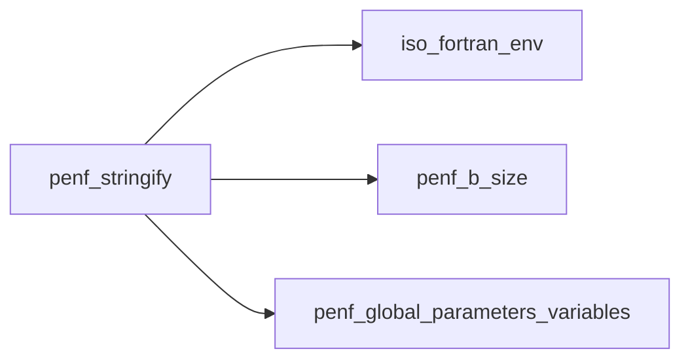

## Contents

- [str_ascii](#str-ascii)
- [str_ucs4](#str-ucs4)
- [str](#str)
- [strz](#strz)
- [cton](#cton)
- [bstr](#bstr)
- [bcton](#bcton)
- [compact_real_string](#compact-real-string)
- [str_ascii_default](#str-ascii-default)
- [str_ascii_ascii](#str-ascii-ascii)
- [str_ascii_ucs4](#str-ascii-ucs4)
- [str_ucs4_default](#str-ucs4-default)
- [str_ucs4_ascii](#str-ucs4-ascii)
- [str_ucs4_ucs4](#str-ucs4-ucs4)
- [strf_R16P](#strf-r16p)
- [strf_R8P](#strf-r8p)
- [strf_R4P](#strf-r4p)
- [strf_I8P](#strf-i8p)
- [strf_I4P](#strf-i4p)
- [strf_I2P](#strf-i2p)
- [strf_I1P](#strf-i1p)
- [str_R16P](#str-r16p)
- [str_R8P](#str-r8p)
- [str_R4P](#str-r4p)
- [str_I8P](#str-i8p)
- [str_I4P](#str-i4p)
- [str_I2P](#str-i2p)
- [str_I1P](#str-i1p)
- [str_bol](#str-bol)
- [str_a_R16P](#str-a-r16p)
- [str_a_R8P](#str-a-r8p)
- [str_a_R4P](#str-a-r4p)
- [str_a_I8P](#str-a-i8p)
- [str_a_I4P](#str-a-i4p)
- [str_a_I2P](#str-a-i2p)
- [str_a_I1P](#str-a-i1p)
- [strz_I8P](#strz-i8p)
- [strz_I4P](#strz-i4p)
- [strz_I2P](#strz-i2p)
- [strz_I1P](#strz-i1p)
- [ctor_R16P](#ctor-r16p)
- [ctor_R8P](#ctor-r8p)
- [ctor_R4P](#ctor-r4p)
- [ctoi_I8P](#ctoi-i8p)
- [ctoi_I4P](#ctoi-i4p)
- [ctoi_I2P](#ctoi-i2p)
- [ctoi_I1P](#ctoi-i1p)
- [bstr_R16P](#bstr-r16p)
- [bstr_R8P](#bstr-r8p)
- [bstr_R4P](#bstr-r4p)
- [bstr_I8P](#bstr-i8p)
- [bstr_I4P](#bstr-i4p)
- [bstr_I2P](#bstr-i2p)
- [bstr_I1P](#bstr-i1p)
- [bctor_R16P](#bctor-r16p)
- [bctor_R8P](#bctor-r8p)
- [bctor_R4P](#bctor-r4p)
- [bctoi_I8P](#bctoi-i8p)
- [bctoi_I4P](#bctoi-i4p)
- [bctoi_I2P](#bctoi-i2p)
- [bctoi_I1P](#bctoi-i1p)

## Interfaces

### str_ascii

Convert string of any kind to ASCII string.

**Module procedures**: [`str_ascii_default`](/api/src/third_party/PENF/src/lib/penf_stringify#str-ascii-default)

### str_ucs4

Convert string of any kind to UCS4 string.

**Module procedures**: [`str_ucs4_default`](/api/src/third_party/PENF/src/lib/penf_stringify#str-ucs4-default)

### str

Convert number (real and integer) to string (number to string type casting).

**Module procedures**: [`strf_R8P`](/api/src/third_party/PENF/src/lib/penf_stringify#strf-r8p), [`str_R8P`](/api/src/third_party/PENF/src/lib/penf_stringify#str-r8p), [`strf_R4P`](/api/src/third_party/PENF/src/lib/penf_stringify#strf-r4p), [`str_R4P`](/api/src/third_party/PENF/src/lib/penf_stringify#str-r4p), [`strf_I8P`](/api/src/third_party/PENF/src/lib/penf_stringify#strf-i8p), [`str_I8P`](/api/src/third_party/PENF/src/lib/penf_stringify#str-i8p), [`strf_I4P`](/api/src/third_party/PENF/src/lib/penf_stringify#strf-i4p), [`str_I4P`](/api/src/third_party/PENF/src/lib/penf_stringify#str-i4p), [`strf_I2P`](/api/src/third_party/PENF/src/lib/penf_stringify#strf-i2p), [`str_I2P`](/api/src/third_party/PENF/src/lib/penf_stringify#str-i2p), [`strf_I1P`](/api/src/third_party/PENF/src/lib/penf_stringify#strf-i1p), [`str_I1P`](/api/src/third_party/PENF/src/lib/penf_stringify#str-i1p), [`str_bol`](/api/src/third_party/PENF/src/lib/penf_stringify#str-bol), [`str_a_R8P`](/api/src/third_party/PENF/src/lib/penf_stringify#str-a-r8p), [`str_a_R4P`](/api/src/third_party/PENF/src/lib/penf_stringify#str-a-r4p), [`str_a_I8P`](/api/src/third_party/PENF/src/lib/penf_stringify#str-a-i8p), [`str_a_I4P`](/api/src/third_party/PENF/src/lib/penf_stringify#str-a-i4p), [`str_a_I2P`](/api/src/third_party/PENF/src/lib/penf_stringify#str-a-i2p), [`str_a_I1P`](/api/src/third_party/PENF/src/lib/penf_stringify#str-a-i1p)

### strz

Convert integer, to string, prefixing with the right number of zeros (integer to string type casting with zero padding).

**Module procedures**: [`strz_I8P`](/api/src/third_party/PENF/src/lib/penf_stringify#strz-i8p), [`strz_I4P`](/api/src/third_party/PENF/src/lib/penf_stringify#strz-i4p), [`strz_I2P`](/api/src/third_party/PENF/src/lib/penf_stringify#strz-i2p), [`strz_I1P`](/api/src/third_party/PENF/src/lib/penf_stringify#strz-i1p)

### cton

Convert string to number (real and integer, string to number type casting).

**Module procedures**: [`ctor_R8P`](/api/src/third_party/PENF/src/lib/penf_stringify#ctor-r8p), [`ctor_R4P`](/api/src/third_party/PENF/src/lib/penf_stringify#ctor-r4p), [`ctoi_I8P`](/api/src/third_party/PENF/src/lib/penf_stringify#ctoi-i8p), [`ctoi_I4P`](/api/src/third_party/PENF/src/lib/penf_stringify#ctoi-i4p), [`ctoi_I2P`](/api/src/third_party/PENF/src/lib/penf_stringify#ctoi-i2p), [`ctoi_I1P`](/api/src/third_party/PENF/src/lib/penf_stringify#ctoi-i1p)

### bstr

Convert number (real and integer) to bit-string (number to bit-string type casting).

**Module procedures**: [`bstr_R8P`](/api/src/third_party/PENF/src/lib/penf_stringify#bstr-r8p), [`bstr_R4P`](/api/src/third_party/PENF/src/lib/penf_stringify#bstr-r4p), [`bstr_I8P`](/api/src/third_party/PENF/src/lib/penf_stringify#bstr-i8p), [`bstr_I4P`](/api/src/third_party/PENF/src/lib/penf_stringify#bstr-i4p), [`bstr_I2P`](/api/src/third_party/PENF/src/lib/penf_stringify#bstr-i2p), [`bstr_I1P`](/api/src/third_party/PENF/src/lib/penf_stringify#bstr-i1p)

### bcton

Convert bit-string to number (real and integer, bit-string to number type casting).

**Module procedures**: [`bctor_R8P`](/api/src/third_party/PENF/src/lib/penf_stringify#bctor-r8p), [`bctor_R4P`](/api/src/third_party/PENF/src/lib/penf_stringify#bctor-r4p), [`bctoi_I8P`](/api/src/third_party/PENF/src/lib/penf_stringify#bctoi-i8p), [`bctoi_I4P`](/api/src/third_party/PENF/src/lib/penf_stringify#bctoi-i4p), [`bctoi_I2P`](/api/src/third_party/PENF/src/lib/penf_stringify#bctoi-i2p), [`bctoi_I1P`](/api/src/third_party/PENF/src/lib/penf_stringify#bctoi-i1p)

## Subroutines

### compact_real_string

Compact a string representing a real number, so that the same value is displayed with fewer characters.

 @note No need to add doctest: this is tested by a lot of doctests of other TBPs.

**Attributes**: pure

```fortran
subroutine compact_real_string(string)
```

**Arguments**

| Name | Type | Intent | Attributes | Description |
|------|------|--------|------------|-------------|
| `string` | character(len=*) | inout |  | string representation of a real number. |

**Call graph**

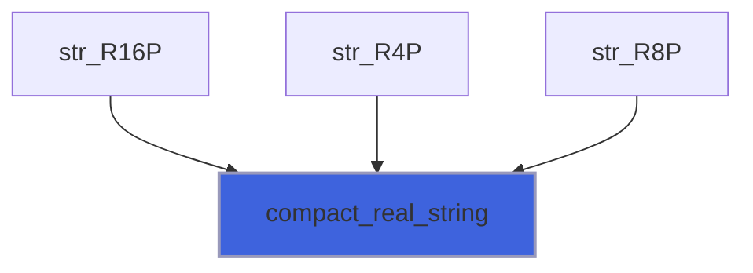

## Functions

### str_ascii_default

Convert string of default kind to ASCII string.

```fortran
 use penf
 character(len=:, kind=ASCII), allocatable :: string
 string = str_ascii('I was DEFAULT kind, but now I am ASCII')
 print "(A)", string
```

**Attributes**: pure

**Returns**: character(kind=[ASCII](/api/src/third_party/PENF/src/lib/penf_global_parameters_variables), len=:)

```fortran
function str_ascii_default(input) result(output)
```

**Arguments**

| Name | Type | Intent | Attributes | Description |
|------|------|--------|------------|-------------|
| `input` | character(len=*) | in |  | Input string of default kind. |

### str_ascii_ascii

Convert string of ASCII kind to ASCII string, just for convenience in sanitize strings.

```fortran
 use penf
 character(len=:, kind=ASCII), allocatable :: string
 string = str_ascii('I was ASCII kind and I am still ASCII')
 print "(A)", string
```

**Attributes**: pure

**Returns**: character(kind=[ASCII](/api/src/third_party/PENF/src/lib/penf_global_parameters_variables), len=:)

```fortran
function str_ascii_ascii(input) result(output)
```

**Arguments**

| Name | Type | Intent | Attributes | Description |
|------|------|--------|------------|-------------|
| `input` | character(kind=[ASCII](/api/src/third_party/PENF/src/lib/penf_global_parameters_variables), len=*) | in |  | Input string of ASCII kind. |

### str_ascii_ucs4

Convert string of UCS4 kind to ASCII string.

```fortran
 use penf
 character(len=:, kind=ASCII), allocatable :: string
 string = str_ascii(UCS4_'I was UCS4 kind, but now I am ASCII')
 print "(A)", string
```

**Attributes**: pure

**Returns**: character(kind=[ASCII](/api/src/third_party/PENF/src/lib/penf_global_parameters_variables), len=:)

```fortran
function str_ascii_ucs4(input) result(output)
```

**Arguments**

| Name | Type | Intent | Attributes | Description |
|------|------|--------|------------|-------------|
| `input` | character(kind=[UCS4](/api/src/third_party/PENF/src/lib/penf_global_parameters_variables), len=*) | in |  | Input string of UCS4 kind. |

### str_ucs4_default

Convert string of default kind to UCS4 string.

```fortran
 use penf
 character(len=:, kind=UCS4), allocatable :: string
 string = str_ascii('I was DEFAULT kind, but now I am UCS4')
 print "(A)", string
```

**Attributes**: pure

**Returns**: character(kind=[UCS4](/api/src/third_party/PENF/src/lib/penf_global_parameters_variables), len=:)

```fortran
function str_ucs4_default(input) result(output)
```

**Arguments**

| Name | Type | Intent | Attributes | Description |
|------|------|--------|------------|-------------|
| `input` | character(len=*) | in |  | Input string of default kind. |

### str_ucs4_ascii

Convert string of ASCII kind to UCS4 string.

```fortran
 use penf
 character(len=:, kind=UCS4), allocatable :: string
 string = str_ascii(ASCII_'I was ASCII kind, but now I am UCS4')
 print "(A)", string
```

**Attributes**: pure

**Returns**: character(kind=[UCS4](/api/src/third_party/PENF/src/lib/penf_global_parameters_variables), len=:)

```fortran
function str_ucs4_ascii(input) result(output)
```

**Arguments**

| Name | Type | Intent | Attributes | Description |
|------|------|--------|------------|-------------|
| `input` | character(kind=[ASCII](/api/src/third_party/PENF/src/lib/penf_global_parameters_variables), len=*) | in |  | Input string of ASCII kind. |

### str_ucs4_ucs4

Convert string of UCS4 kind to UCS4 string, just for convenience in sanitize strings.

```fortran
 use penf
 character(len=:, kind=UCS4), allocatable :: string
 string = str_ascii(UCS4_'I was UCS4 kind and I am still UCS4')
 print "(A)", string
```

**Attributes**: pure

**Returns**: character(kind=[UCS4](/api/src/third_party/PENF/src/lib/penf_global_parameters_variables), len=:)

```fortran
function str_ucs4_ucs4(input) result(output)
```

**Arguments**

| Name | Type | Intent | Attributes | Description |
|------|------|--------|------------|-------------|
| `input` | character(kind=[UCS4](/api/src/third_party/PENF/src/lib/penf_global_parameters_variables), len=*) | in |  | Input string of UCS4 kind. |

### strf_R16P

Convert real to string.

```fortran
 use penf
 print "(A)", str(fm=FR16P, n=1._R16P)
```

**Attributes**: elemental

**Returns**: `character(len=DR16P)`

```fortran
function strf_R16P(fm, n) result(str)
```

**Arguments**

| Name | Type | Intent | Attributes | Description |
|------|------|--------|------------|-------------|
| `fm` | character(len=*) | in |  | Format different from the standard for the kind. |
| `n` | real(kind=[R16P](/api/src/third_party/PENF/src/lib/penf_global_parameters_variables)) | in |  | Real to be converted. |

### strf_R8P

Convert real to string.

```fortran
 use penf
 print "(A)", str(fm=FR8P, n=1._R8P)
```

**Attributes**: elemental

**Returns**: `character(len=DR8P)`

```fortran
function strf_R8P(fm, n) result(str)
```

**Arguments**

| Name | Type | Intent | Attributes | Description |
|------|------|--------|------------|-------------|
| `fm` | character(len=*) | in |  | Format different from the standard for the kind. |
| `n` | real(kind=[R8P](/api/src/third_party/PENF/src/lib/penf_global_parameters_variables)) | in |  | Real to be converted. |

### strf_R4P

Convert real to string.

```fortran
 use penf
 print "(A)", str(fm=FR4P, n=1._R4P)
```

**Attributes**: elemental

**Returns**: `character(len=DR4P)`

```fortran
function strf_R4P(fm, n) result(str)
```

**Arguments**

| Name | Type | Intent | Attributes | Description |
|------|------|--------|------------|-------------|
| `fm` | character(len=*) | in |  | Format different from the standard for the kind. |
| `n` | real(kind=[R4P](/api/src/third_party/PENF/src/lib/penf_global_parameters_variables)) | in |  | Real to be converted. |

### strf_I8P

Convert integer to string.

```fortran
 use penf
 print "(A)", str(fm=FI8P, n=1_I8P)
```

**Attributes**: elemental

**Returns**: `character(len=DI8P)`

```fortran
function strf_I8P(fm, n) result(str)
```

**Arguments**

| Name | Type | Intent | Attributes | Description |
|------|------|--------|------------|-------------|
| `fm` | character(len=*) | in |  | Format different from the standard for the kind. |
| `n` | integer(kind=[I8P](/api/src/third_party/PENF/src/lib/penf_global_parameters_variables)) | in |  | Integer to be converted. |

### strf_I4P

Convert integer to string.

```fortran
 use penf
 print "(A)", str(fm=FI4P, n=1_I4P)
```

**Attributes**: elemental

**Returns**: `character(len=DI4P)`

```fortran
function strf_I4P(fm, n) result(str)
```

**Arguments**

| Name | Type | Intent | Attributes | Description |
|------|------|--------|------------|-------------|
| `fm` | character(len=*) | in |  | Format different from the standard for the kind. |
| `n` | integer(kind=[I4P](/api/src/third_party/PENF/src/lib/penf_global_parameters_variables)) | in |  | Integer to be converted. |

### strf_I2P

Convert integer to string.

```fortran
 use penf
 print "(A)", str(fm=FI2P, n=1_I2P)
```

**Attributes**: elemental

**Returns**: `character(len=DI2P)`

```fortran
function strf_I2P(fm, n) result(str)
```

**Arguments**

| Name | Type | Intent | Attributes | Description |
|------|------|--------|------------|-------------|
| `fm` | character(len=*) | in |  | Format different from the standard for the kind. |
| `n` | integer(kind=[I2P](/api/src/third_party/PENF/src/lib/penf_global_parameters_variables)) | in |  | Integer to be converted. |

### strf_I1P

Convert integer to string.

```fortran
 use penf
 print "(A)", str(fm=FI1P, n=1_I1P)
```

**Attributes**: elemental

**Returns**: `character(len=DI1P)`

```fortran
function strf_I1P(fm, n) result(str)
```

**Arguments**

| Name | Type | Intent | Attributes | Description |
|------|------|--------|------------|-------------|
| `fm` | character(len=*) | in |  | Format different from the standard for the kind. |
| `n` | integer(kind=[I1P](/api/src/third_party/PENF/src/lib/penf_global_parameters_variables)) | in |  | Integer to be converted. |

### str_R16P

Convert real to string.

```fortran
 use penf
 print "(A)", str(n=-1._R16P)
```


```fortran
 use penf
 print "(A)", str(n=-1._R16P, no_sign=.true.)
```


```fortran
 use penf
 print "(A)", str(n=-1._R16P, compact=.true.)
```

**Attributes**: elemental

**Returns**: `character(len=DR16P)`

```fortran
function str_R16P(n, no_sign, compact) result(str)
```

**Arguments**

| Name | Type | Intent | Attributes | Description |
|------|------|--------|------------|-------------|
| `n` | real(kind=[R16P](/api/src/third_party/PENF/src/lib/penf_global_parameters_variables)) | in |  | Real to be converted. |
| `no_sign` | logical | in | optional | Flag for leaving out the sign. |
| `compact` | logical | in | optional | Flag for *compacting* string encoding. |

**Call graph**

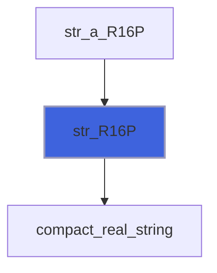

### str_R8P

Convert real to string.

```fortran
 use penf
 print "(A)", str(n=-1._R8P)
```


```fortran
 use penf
 print "(A)", str(n=-1._R8P, no_sign=.true.)
```


```fortran
 use penf
 print "(A)", str(n=-1._R8P, compact=.true.)
```

**Attributes**: elemental

**Returns**: `character(len=DR8P)`

```fortran
function str_R8P(n, no_sign, compact) result(str)
```

**Arguments**

| Name | Type | Intent | Attributes | Description |
|------|------|--------|------------|-------------|
| `n` | real(kind=[R8P](/api/src/third_party/PENF/src/lib/penf_global_parameters_variables)) | in |  | Real to be converted. |
| `no_sign` | logical | in | optional | Flag for leaving out the sign. |
| `compact` | logical | in | optional | Flag for *compacting* string encoding. |

**Call graph**

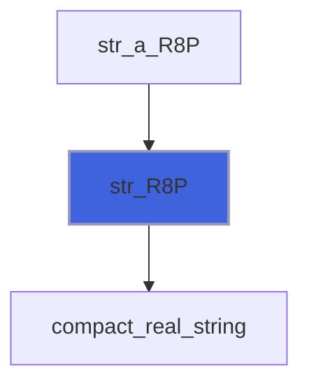

### str_R4P

Convert real to string.

```fortran
 use penf
 print "(A)", str(n=-1._R4P)
```


```fortran
 use penf
 print "(A)", str(n=-1._R4P, no_sign=.true.)
```


```fortran
 use penf
 print "(A)", str(n=-1._R4P, compact=.true.)
```

**Attributes**: elemental

**Returns**: `character(len=DR4P)`

```fortran
function str_R4P(n, no_sign, compact) result(str)
```

**Arguments**

| Name | Type | Intent | Attributes | Description |
|------|------|--------|------------|-------------|
| `n` | real(kind=[R4P](/api/src/third_party/PENF/src/lib/penf_global_parameters_variables)) | in |  | Real to be converted. |
| `no_sign` | logical | in | optional | Flag for leaving out the sign. |
| `compact` | logical | in | optional | Flag for *compacting* string encoding. |

**Call graph**

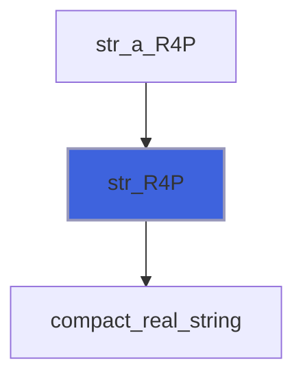

### str_I8P

Convert integer to string.

```fortran
 use penf
 print "(A)", str(n=-1_I8P)
```


```fortran
 use penf
 print "(A)", str(n=-1_I8P, no_sign=.true.)
```

**Attributes**: elemental

**Returns**: `character(len=DI8P)`

```fortran
function str_I8P(n, no_sign) result(str)
```

**Arguments**

| Name | Type | Intent | Attributes | Description |
|------|------|--------|------------|-------------|
| `n` | integer(kind=[I8P](/api/src/third_party/PENF/src/lib/penf_global_parameters_variables)) | in |  | Integer to be converted. |
| `no_sign` | logical | in | optional | Flag for leaving out the sign. |

**Call graph**

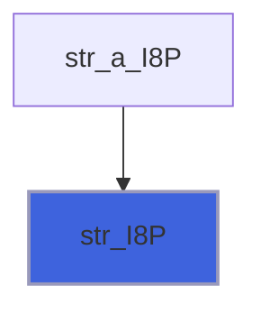

### str_I4P

Converting integer to string.

```fortran
 use penf
 print "(A)", str(n=-1_I4P)
```


```fortran
 use penf
 print "(A)", str(n=-1_I4P, no_sign=.true.)
```

**Attributes**: elemental

**Returns**: `character(len=DI4P)`

```fortran
function str_I4P(n, no_sign) result(str)
```

**Arguments**

| Name | Type | Intent | Attributes | Description |
|------|------|--------|------------|-------------|
| `n` | integer(kind=[I4P](/api/src/third_party/PENF/src/lib/penf_global_parameters_variables)) | in |  | Integer to be converted. |
| `no_sign` | logical | in | optional | Flag for leaving out the sign. |

**Call graph**

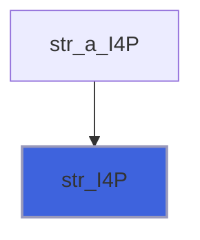

### str_I2P

Convert integer to string.

```fortran
 use penf
 print "(A)", str(n=-1_I2P)
```


```fortran
 use penf
 print "(A)", str(n=-1_I2P, no_sign=.true.)
```

**Attributes**: elemental

**Returns**: `character(len=DI2P)`

```fortran
function str_I2P(n, no_sign) result(str)
```

**Arguments**

| Name | Type | Intent | Attributes | Description |
|------|------|--------|------------|-------------|
| `n` | integer(kind=[I2P](/api/src/third_party/PENF/src/lib/penf_global_parameters_variables)) | in |  | Integer to be converted. |
| `no_sign` | logical | in | optional | Flag for leaving out the sign. |

**Call graph**

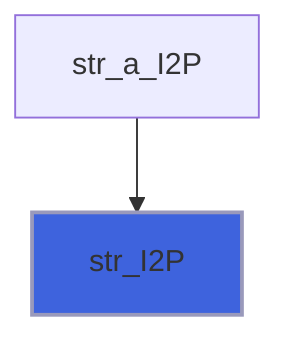

### str_I1P

Convert integer to string.

```fortran
 use penf
 print "(A)", str(n=-1_I1P)
```


```fortran
 use penf
 print "(A)", str(n=-1_I1P, no_sign=.true.)
```

**Attributes**: elemental

**Returns**: `character(len=DI1P)`

```fortran
function str_I1P(n, no_sign) result(str)
```

**Arguments**

| Name | Type | Intent | Attributes | Description |
|------|------|--------|------------|-------------|
| `n` | integer(kind=[I1P](/api/src/third_party/PENF/src/lib/penf_global_parameters_variables)) | in |  | Integer to be converted. |
| `no_sign` | logical | in | optional | Flag for leaving out the sign. |

**Call graph**

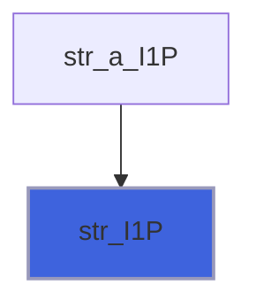

### str_bol

Convert logical to string.

```fortran
 use penf
 print "(A)", str(n=.true.)
```

**Attributes**: elemental

**Returns**: `character(len=1)`

```fortran
function str_bol(n) result(str)
```

**Arguments**

| Name | Type | Intent | Attributes | Description |
|------|------|--------|------------|-------------|
| `n` | logical | in |  | Logical to be converted. |

### str_a_R16P

Converting real array to string.

```fortran
 use penf
 print "(A)", str(n=[1._R16P, -2._R16P])
```


```fortran
 use penf
 print "(A)", str(n=[1._R16P, 2._R16P], no_sign=.true.)
```


```fortran
 use penf
 print "(A)", str(n=[1._R16P, -2._R16P], separator='|')
```


```fortran
 use penf
 print "(A)", str(n=[1._R16P, -3._R16P], delimiters=['(', ')'])
```


```fortran
 use penf
 print "(A)", str(n=[1._R16P, -2._R16P], compact=.true.)
```

**Attributes**: pure

**Returns**: `character(len=:)`

```fortran
function str_a_R16P(n, no_sign, separator, delimiters, compact) result(str)
```

**Arguments**

| Name | Type | Intent | Attributes | Description |
|------|------|--------|------------|-------------|
| `n` | real(kind=[R16P](/api/src/third_party/PENF/src/lib/penf_global_parameters_variables)) | in |  | Real array to be converted. |
| `no_sign` | logical | in | optional | Flag for leaving out the sign. |
| `separator` | character(len=1) | in | optional | Eventual separator of array values. |
| `delimiters` | character(len=*) | in | optional | Eventual delimiters of array values. |
| `compact` | logical | in | optional | Flag for *compacting* string encoding. |

**Call graph**

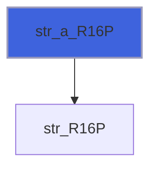

### str_a_R8P

Convert real array to string.

```fortran
 use penf
 print "(A)", str(n=[1._R8P, -2._R8P])
```


```fortran
 use penf
 print "(A)", str(n=[1._R8P, 2._R8P], no_sign=.true.)
```


```fortran
 use penf
 print "(A)", str(n=[1._R8P, -2._R8P], separator='|')
```


```fortran
 use penf
 print "(A)", str(n=[1._R8P, -2._R8P], delimiters=['(', ')'])
```


```fortran
 use penf
 print "(A)", str(n=[1._R8P, -2._R8P], compact=.true.)
```

**Attributes**: pure

**Returns**: `character(len=:)`

```fortran
function str_a_R8P(n, no_sign, separator, delimiters, compact) result(str)
```

**Arguments**

| Name | Type | Intent | Attributes | Description |
|------|------|--------|------------|-------------|
| `n` | real(kind=[R8P](/api/src/third_party/PENF/src/lib/penf_global_parameters_variables)) | in |  | Real array to be converted. |
| `no_sign` | logical | in | optional | Flag for leaving out the sign. |
| `separator` | character(len=1) | in | optional | Eventual separator of array values. |
| `delimiters` | character(len=*) | in | optional | Eventual delimiters of array values. |
| `compact` | logical | in | optional | Flag for *compacting* string encoding. |

**Call graph**

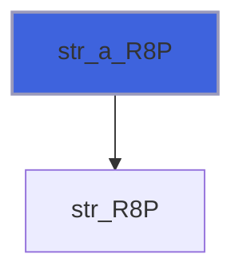

### str_a_R4P

Convert real array to string.

```fortran
 use penf
 print "(A)", str(n=[1._R4P, -2._R4P])
```


```fortran
 use penf
 print "(A)", str(n=[1._R4P, 2._R4P], no_sign=.true.)
```


```fortran
 use penf
 print "(A)", str(n=[1._R4P, -2._R4P], separator='|')
```


```fortran
 use penf
 print "(A)", str(n=[1._R4P, -2._R4P], delimiters=['(', ')'])
```


```fortran
 use penf
 print "(A)", str(n=[1._R4P, -2._R4P], compact=.true.)
```

**Attributes**: pure

**Returns**: `character(len=:)`

```fortran
function str_a_R4P(n, no_sign, separator, delimiters, compact) result(str)
```

**Arguments**

| Name | Type | Intent | Attributes | Description |
|------|------|--------|------------|-------------|
| `n` | real(kind=[R4P](/api/src/third_party/PENF/src/lib/penf_global_parameters_variables)) | in |  | Real array to be converted. |
| `no_sign` | logical | in | optional | Flag for leaving out the sign. |
| `separator` | character(len=1) | in | optional | Eventual separator of array values. |
| `delimiters` | character(len=*) | in | optional | Eventual delimiters of array values. |
| `compact` | logical | in | optional | Flag for *compacting* string encoding. |

**Call graph**


### str_a_I8P

Convert integer array to string.

```fortran
 use penf
 print "(A)", str(n=[1_I8P, -2_I8P])
```


```fortran
 use penf
 print "(A)", str(n=[1_I8P, 2_I8P], no_sign=.true.)
```


```fortran
 use penf
 print "(A)", str(n=[1_I8P, -2_I8P], separator='|')
```


```fortran
 use penf
 print "(A)", str(n=[1_I8P, -2_I8P], delimiters=['(', ')'])
```

**Attributes**: pure

**Returns**: `character(len=:)`

```fortran
function str_a_I8P(n, no_sign, separator, delimiters) result(str)
```

**Arguments**

| Name | Type | Intent | Attributes | Description |
|------|------|--------|------------|-------------|
| `n` | integer(kind=[I8P](/api/src/third_party/PENF/src/lib/penf_global_parameters_variables)) | in |  | Integer array to be converted. |
| `no_sign` | logical | in | optional | Flag for leaving out the sign. |
| `separator` | character(len=1) | in | optional | Eventual separator of array values. |
| `delimiters` | character(len=*) | in | optional | Eventual delimiters of array values. |

**Call graph**


### str_a_I4P

Convert integer array to string.

```fortran
 use penf
 print "(A)", str(n=[1_I4P, -2_I4P])
```


```fortran
 use penf
 print "(A)", str(n=[1_I4P, 2_I4P], no_sign=.true.)
```


```fortran
 use penf
 print "(A)", str(n=[1_I4P, -2_I4P], separator='|')
```


```fortran
 use penf
 print "(A)", str(n=[1_I4P, -2_I4P], delimiters=['(', ')'])
```

**Attributes**: pure

**Returns**: `character(len=:)`

```fortran
function str_a_I4P(n, no_sign, separator, delimiters) result(str)
```

**Arguments**

| Name | Type | Intent | Attributes | Description |
|------|------|--------|------------|-------------|
| `n` | integer(kind=[I4P](/api/src/third_party/PENF/src/lib/penf_global_parameters_variables)) | in |  | Integer array to be converted. |
| `no_sign` | logical | in | optional | Flag for leaving out the sign. |
| `separator` | character(len=1) | in | optional | Eventual separator of array values. |
| `delimiters` | character(len=*) | in | optional | Eventual delimiters of array values. |

**Call graph**


### str_a_I2P

Convert integer array to string.

```fortran
 use penf
 print "(A)", str(n=[1_I2P, -2_I2P])
```


```fortran
 use penf
 print "(A)", str(n=[1_I2P, 2_I2P], no_sign=.true.)
```


```fortran
 use penf
 print "(A)", str(n=[1_I2P, -2_I2P], separator='|')
```


```fortran
 use penf
 print "(A)", str(n=[1_I2P, -2_I2P], delimiters=['(', ')'])
```

**Attributes**: pure

**Returns**: `character(len=:)`

```fortran
function str_a_I2P(n, no_sign, separator, delimiters) result(str)
```

**Arguments**

| Name | Type | Intent | Attributes | Description |
|------|------|--------|------------|-------------|
| `n` | integer(kind=[I2P](/api/src/third_party/PENF/src/lib/penf_global_parameters_variables)) | in |  | Integer array to be converted. |
| `no_sign` | logical | in | optional | Flag for leaving out the sign. |
| `separator` | character(len=1) | in | optional | Eventual separator of array values. |
| `delimiters` | character(len=*) | in | optional | Eventual delimiters of array values. |

**Call graph**

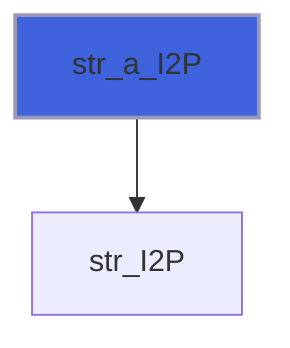

### str_a_I1P

Convert integer array to string.

```fortran
 use penf
 print "(A)", str(n=[1_I1P, -2_I1P])
```


```fortran
 use penf
 print "(A)", str(n=[1_I1P, 2_I1P], no_sign=.true.)
```


```fortran
 use penf
 print "(A)", str(n=[1_I1P, -2_I1P], separator='|')
```


```fortran
 use penf
 print "(A)", str(n=[1_I1P, -2_I1P], delimiters=['(', ')'])
```

**Attributes**: pure

**Returns**: `character(len=:)`

```fortran
function str_a_I1P(n, no_sign, separator, delimiters) result(str)
```

**Arguments**

| Name | Type | Intent | Attributes | Description |
|------|------|--------|------------|-------------|
| `n` | integer(kind=[I1P](/api/src/third_party/PENF/src/lib/penf_global_parameters_variables)) | in |  | Integer array to be converted. |
| `no_sign` | logical | in | optional | Flag for leaving out the sign. |
| `separator` | character(len=1) | in | optional | Eventual separator of array values. |
| `delimiters` | character(len=*) | in | optional | Eventual delimiters of array values. |

**Call graph**


### strz_I8P

Converting integer to string, prefixing with the right number of zeros.

```fortran
 use penf
 print "(A)", strz(n=1_I8P)
```


```fortran
 use penf
 print "(A)", strz(n=1_I8P, nz_pad=5)
```

**Attributes**: elemental

**Returns**: `character(len=DI8P)`

```fortran
function strz_I8P(n, nz_pad) result(str)
```

**Arguments**

| Name | Type | Intent | Attributes | Description |
|------|------|--------|------------|-------------|
| `n` | integer(kind=[I8P](/api/src/third_party/PENF/src/lib/penf_global_parameters_variables)) | in |  | Integer to be converted. |
| `nz_pad` | integer(kind=[I4P](/api/src/third_party/PENF/src/lib/penf_global_parameters_variables)) | in | optional | Number of zeros padding. |

### strz_I4P

Convert integer to string, prefixing with the right number of zeros.

```fortran
 use penf
 print "(A)", strz(n=1_I4P)
```


```fortran
 use penf
 print "(A)", strz(n=1_I4P, nz_pad=5)
```

**Attributes**: elemental

**Returns**: `character(len=DI4P)`

```fortran
function strz_I4P(n, nz_pad) result(str)
```

**Arguments**

| Name | Type | Intent | Attributes | Description |
|------|------|--------|------------|-------------|
| `n` | integer(kind=[I4P](/api/src/third_party/PENF/src/lib/penf_global_parameters_variables)) | in |  | Integer to be converted. |
| `nz_pad` | integer(kind=[I4P](/api/src/third_party/PENF/src/lib/penf_global_parameters_variables)) | in | optional | Number of zeros padding. |

### strz_I2P

Convert integer to string, prefixing with the right number of zeros.

```fortran
 use penf
 print "(A)", strz(n=1_I2P)
```


```fortran
 use penf
 print "(A)", strz(n=1_I2P, nz_pad=3)
```

**Attributes**: elemental

**Returns**: `character(len=DI2P)`

```fortran
function strz_I2P(n, nz_pad) result(str)
```

**Arguments**

| Name | Type | Intent | Attributes | Description |
|------|------|--------|------------|-------------|
| `n` | integer(kind=[I2P](/api/src/third_party/PENF/src/lib/penf_global_parameters_variables)) | in |  | Integer to be converted. |
| `nz_pad` | integer(kind=[I4P](/api/src/third_party/PENF/src/lib/penf_global_parameters_variables)) | in | optional | Number of zeros padding. |

### strz_I1P

Convert integer to string, prefixing with the right number of zeros.

```fortran
 use penf
 print "(A)", strz(n=1_I1P)
```


```fortran
 use penf
 print "(A)", strz(n=1_I1P, nz_pad=3)
```

**Attributes**: elemental

**Returns**: `character(len=DI1P)`

```fortran
function strz_I1P(n, nz_pad) result(str)
```

**Arguments**

| Name | Type | Intent | Attributes | Description |
|------|------|--------|------------|-------------|
| `n` | integer(kind=[I1P](/api/src/third_party/PENF/src/lib/penf_global_parameters_variables)) | in |  | Integer to be converted. |
| `nz_pad` | integer(kind=[I4P](/api/src/third_party/PENF/src/lib/penf_global_parameters_variables)) | in | optional | Number of zeros padding. |

### ctor_R16P

Convert string to real.

```fortran
 use penf
 print FR16P, cton(str='-1.0', knd=1._R16P)
```

**Returns**: real(kind=[R16P](/api/src/third_party/PENF/src/lib/penf_global_parameters_variables))

```fortran
function ctor_R16P(str, knd, pref, error) result(n)
```

**Arguments**

| Name | Type | Intent | Attributes | Description |
|------|------|--------|------------|-------------|
| `str` | character(len=*) | in |  | String containing input number. |
| `knd` | real(kind=[R16P](/api/src/third_party/PENF/src/lib/penf_global_parameters_variables)) | in |  | Number kind. |
| `pref` | character(len=*) | in | optional | Prefixing string. |
| `error` | integer(kind=[I4P](/api/src/third_party/PENF/src/lib/penf_global_parameters_variables)) | out | optional | Error trapping flag: 0 no errors, >0 error occurs. |

### ctor_R8P

Convert string to real.

```fortran
 use penf
 print FR8P, cton(str='-1.0', knd=1._R8P)
```

**Returns**: real(kind=[R8P](/api/src/third_party/PENF/src/lib/penf_global_parameters_variables))

```fortran
function ctor_R8P(str, knd, pref, error) result(n)
```

**Arguments**

| Name | Type | Intent | Attributes | Description |
|------|------|--------|------------|-------------|
| `str` | character(len=*) | in |  | String containing input number. |
| `knd` | real(kind=[R8P](/api/src/third_party/PENF/src/lib/penf_global_parameters_variables)) | in |  | Number kind. |
| `pref` | character(len=*) | in | optional | Prefixing string. |
| `error` | integer(kind=[I4P](/api/src/third_party/PENF/src/lib/penf_global_parameters_variables)) | out | optional | Error trapping flag: 0 no errors, >0 error occurs. |

### ctor_R4P

Convert string to real.

```fortran
 use penf
 print FR4P, cton(str='-1.0', knd=1._R4P)
```

**Returns**: real(kind=[R4P](/api/src/third_party/PENF/src/lib/penf_global_parameters_variables))

```fortran
function ctor_R4P(str, knd, pref, error) result(n)
```

**Arguments**

| Name | Type | Intent | Attributes | Description |
|------|------|--------|------------|-------------|
| `str` | character(len=*) | in |  | String containing input number. |
| `knd` | real(kind=[R4P](/api/src/third_party/PENF/src/lib/penf_global_parameters_variables)) | in |  | Number kind. |
| `pref` | character(len=*) | in | optional | Prefixing string. |
| `error` | integer(kind=[I4P](/api/src/third_party/PENF/src/lib/penf_global_parameters_variables)) | out | optional | Error trapping flag: 0 no errors, >0 error occurs. |

### ctoi_I8P

Convert string to integer.

```fortran
 use penf
 print FI8P, cton(str='-1', knd=1_I8P)
```

**Returns**: integer(kind=[I8P](/api/src/third_party/PENF/src/lib/penf_global_parameters_variables))

```fortran
function ctoi_I8P(str, knd, pref, error) result(n)
```

**Arguments**

| Name | Type | Intent | Attributes | Description |
|------|------|--------|------------|-------------|
| `str` | character(len=*) | in |  | String containing input number. |
| `knd` | integer(kind=[I8P](/api/src/third_party/PENF/src/lib/penf_global_parameters_variables)) | in |  | Number kind. |
| `pref` | character(len=*) | in | optional | Prefixing string. |
| `error` | integer(kind=[I4P](/api/src/third_party/PENF/src/lib/penf_global_parameters_variables)) | out | optional | Error trapping flag: 0 no errors, >0 error occurs. |

### ctoi_I4P

Convert string to integer.

```fortran
 use penf
 print FI4P, cton(str='-1', knd=1_I4P)
```

**Returns**: integer(kind=[I4P](/api/src/third_party/PENF/src/lib/penf_global_parameters_variables))

```fortran
function ctoi_I4P(str, knd, pref, error) result(n)
```

**Arguments**

| Name | Type | Intent | Attributes | Description |
|------|------|--------|------------|-------------|
| `str` | character(len=*) | in |  | String containing input number. |
| `knd` | integer(kind=[I4P](/api/src/third_party/PENF/src/lib/penf_global_parameters_variables)) | in |  | Number kind. |
| `pref` | character(len=*) | in | optional | Prefixing string. |
| `error` | integer(kind=[I4P](/api/src/third_party/PENF/src/lib/penf_global_parameters_variables)) | out | optional | Error trapping flag: 0 no errors, >0 error occurs. |

### ctoi_I2P

Convert string to integer.

```fortran
 use penf
 print FI2P, cton(str='-1', knd=1_I2P)
```

**Returns**: integer(kind=[I2P](/api/src/third_party/PENF/src/lib/penf_global_parameters_variables))

```fortran
function ctoi_I2P(str, knd, pref, error) result(n)
```

**Arguments**

| Name | Type | Intent | Attributes | Description |
|------|------|--------|------------|-------------|
| `str` | character(len=*) | in |  | String containing input number. |
| `knd` | integer(kind=[I2P](/api/src/third_party/PENF/src/lib/penf_global_parameters_variables)) | in |  | Number kind. |
| `pref` | character(len=*) | in | optional | Prefixing string. |
| `error` | integer(kind=[I4P](/api/src/third_party/PENF/src/lib/penf_global_parameters_variables)) | out | optional | Error trapping flag: 0 no errors, >0 error occurs. |

### ctoi_I1P

Convert string to integer.

```fortran
 use penf
 print FI1P, cton(str='-1', knd=1_I1P)
```

**Returns**: integer(kind=[I1P](/api/src/third_party/PENF/src/lib/penf_global_parameters_variables))

```fortran
function ctoi_I1P(str, knd, pref, error) result(n)
```

**Arguments**

| Name | Type | Intent | Attributes | Description |
|------|------|--------|------------|-------------|
| `str` | character(len=*) | in |  | String containing input number. |
| `knd` | integer(kind=[I1P](/api/src/third_party/PENF/src/lib/penf_global_parameters_variables)) | in |  | Number kind. |
| `pref` | character(len=*) | in | optional | Prefixing string. |
| `error` | integer(kind=[I4P](/api/src/third_party/PENF/src/lib/penf_global_parameters_variables)) | out | optional | Error trapping flag: 0 no errors, >0 error occurs. |

### bstr_R16P

Convert real to string of bits.

 @note It is assumed that R16P is represented by means of 128 bits, but this is not ensured in all architectures.

```fortran
 use penf
 character(128) :: b
 b = bstr(n=1._R16P)
 print "(A)", b(17:)
```

**Attributes**: elemental

**Returns**: `character(len=128)`

```fortran
function bstr_R16P(n) result(bstr)
```

**Arguments**

| Name | Type | Intent | Attributes | Description |
|------|------|--------|------------|-------------|
| `n` | real(kind=[R16P](/api/src/third_party/PENF/src/lib/penf_global_parameters_variables)) | in |  | Real to be converted. |

### bstr_R8P

Convert real to string of bits.

 @note It is assumed that R8P is represented by means of 64 bits, but this is not ensured in all architectures.

```fortran
 use penf
 print "(A)", bstr(n=1._R8P)
```

**Attributes**: elemental

**Returns**: `character(len=64)`

```fortran
function bstr_R8P(n) result(bstr)
```

**Arguments**

| Name | Type | Intent | Attributes | Description |
|------|------|--------|------------|-------------|
| `n` | real(kind=[R8P](/api/src/third_party/PENF/src/lib/penf_global_parameters_variables)) | in |  | Real to be converted. |

### bstr_R4P

Convert real to string of bits.

 @note It is assumed that R4P is represented by means of 32 bits, but this is not ensured in all architectures.

```fortran
 use penf
 print "(A)", bstr(n=1._R4P)
```

**Attributes**: elemental

**Returns**: `character(len=32)`

```fortran
function bstr_R4P(n) result(bstr)
```

**Arguments**

| Name | Type | Intent | Attributes | Description |
|------|------|--------|------------|-------------|
| `n` | real(kind=[R4P](/api/src/third_party/PENF/src/lib/penf_global_parameters_variables)) | in |  | Real to be converted. |

### bstr_I8P

Convert integer to string of bits.

 @note It is assumed that I8P is represented by means of 64 bits, but this is not ensured in all architectures.

```fortran
 use penf
 print "(A)", bstr(n=1_I8P)
```

**Attributes**: elemental

**Returns**: `character(len=64)`

```fortran
function bstr_I8P(n) result(bstr)
```

**Arguments**

| Name | Type | Intent | Attributes | Description |
|------|------|--------|------------|-------------|
| `n` | integer(kind=[I8P](/api/src/third_party/PENF/src/lib/penf_global_parameters_variables)) | in |  | Real to be converted. |

### bstr_I4P

Convert integer to string of bits.

 @note It is assumed that I4P is represented by means of 32 bits, but this is not ensured in all architectures.

```fortran
 use penf
 print "(A)", bstr(n=1_I4P)
```

**Attributes**: elemental

**Returns**: `character(len=32)`

```fortran
function bstr_I4P(n) result(bstr)
```

**Arguments**

| Name | Type | Intent | Attributes | Description |
|------|------|--------|------------|-------------|
| `n` | integer(kind=[I4P](/api/src/third_party/PENF/src/lib/penf_global_parameters_variables)) | in |  | Real to be converted. |

### bstr_I2P

Convert integer to string of bits.

 @note It is assumed that I2P is represented by means of 16 bits, but this is not ensured in all architectures.

```fortran
 use penf
 print "(A)", bstr(n=1_I2P)
```

**Attributes**: elemental

**Returns**: `character(len=16)`

```fortran
function bstr_I2P(n) result(bstr)
```

**Arguments**

| Name | Type | Intent | Attributes | Description |
|------|------|--------|------------|-------------|
| `n` | integer(kind=[I2P](/api/src/third_party/PENF/src/lib/penf_global_parameters_variables)) | in |  | Real to be converted. |

### bstr_I1P

Convert integer to string of bits.

 @note It is assumed that I1P is represented by means of 8 bits, but this is not ensured in all architectures.

```fortran
 use penf
 print "(A)", bstr(n=1_I1P)
```

**Attributes**: elemental

**Returns**: `character(len=8)`

```fortran
function bstr_I1P(n) result(bstr)
```

**Arguments**

| Name | Type | Intent | Attributes | Description |
|------|------|--------|------------|-------------|
| `n` | integer(kind=[I1P](/api/src/third_party/PENF/src/lib/penf_global_parameters_variables)) | in |  | Real to be converted. |

### bctor_R16P

Convert bit-string to real.

```fortran
 use penf
 print FR16P, bcton('00000000000000000000000000000000000000000000000000000000000000000000000000000'//&
                    '000000000000000000000000000000000001111111100111111', knd=1._R16P)
```

**Attributes**: elemental

**Returns**: real(kind=[R16P](/api/src/third_party/PENF/src/lib/penf_global_parameters_variables))

```fortran
function bctor_R16P(bstr, knd) result(n)
```

**Arguments**

| Name | Type | Intent | Attributes | Description |
|------|------|--------|------------|-------------|
| `bstr` | character(len=*) | in |  | String containing input number. |
| `knd` | real(kind=[R16P](/api/src/third_party/PENF/src/lib/penf_global_parameters_variables)) | in |  | Number kind. |

### bctor_R8P

Convert bit-string to real.

```fortran
 use penf
 print FR8P, bcton('0000000000000000000000000000000000000000000000001111000000111111', knd=1._R8P)
```

**Attributes**: elemental

**Returns**: real(kind=[R8P](/api/src/third_party/PENF/src/lib/penf_global_parameters_variables))

```fortran
function bctor_R8P(bstr, knd) result(n)
```

**Arguments**

| Name | Type | Intent | Attributes | Description |
|------|------|--------|------------|-------------|
| `bstr` | character(len=*) | in |  | String containing input number. |
| `knd` | real(kind=[R8P](/api/src/third_party/PENF/src/lib/penf_global_parameters_variables)) | in |  | Number kind. |

### bctor_R4P

Convert bit-string to real.

```fortran
 use penf
 print FR4P, bcton('00000000000000001000000000111111', knd=1._R4P)
```

**Attributes**: elemental

**Returns**: real(kind=[R4P](/api/src/third_party/PENF/src/lib/penf_global_parameters_variables))

```fortran
function bctor_R4P(bstr, knd) result(n)
```

**Arguments**

| Name | Type | Intent | Attributes | Description |
|------|------|--------|------------|-------------|
| `bstr` | character(len=*) | in |  | String containing input number. |
| `knd` | real(kind=[R4P](/api/src/third_party/PENF/src/lib/penf_global_parameters_variables)) | in |  | Number kind. |

### bctoi_I8P

Convert bit-string to integer.

```fortran
 use penf
 print FI8P, bcton('0000000000000000000000000000000000000000000000000000000000000001', knd=1_I8P)
```

**Attributes**: elemental

**Returns**: integer(kind=[I8P](/api/src/third_party/PENF/src/lib/penf_global_parameters_variables))

```fortran
function bctoi_I8P(bstr, knd) result(n)
```

**Arguments**

| Name | Type | Intent | Attributes | Description |
|------|------|--------|------------|-------------|
| `bstr` | character(len=*) | in |  | String containing input number. |
| `knd` | integer(kind=[I8P](/api/src/third_party/PENF/src/lib/penf_global_parameters_variables)) | in |  | Number kind. |

**Call graph**


### bctoi_I4P

Convert bit-string to integer.

```fortran
 use penf
 print FI4P, bcton('00000000000000000000000000000001', knd=1_I4P)
```

**Attributes**: elemental

**Returns**: integer(kind=[I4P](/api/src/third_party/PENF/src/lib/penf_global_parameters_variables))

```fortran
function bctoi_I4P(bstr, knd) result(n)
```

**Arguments**

| Name | Type | Intent | Attributes | Description |
|------|------|--------|------------|-------------|
| `bstr` | character(len=*) | in |  | String containing input number. |
| `knd` | integer(kind=[I4P](/api/src/third_party/PENF/src/lib/penf_global_parameters_variables)) | in |  | Number kind. |

**Call graph**

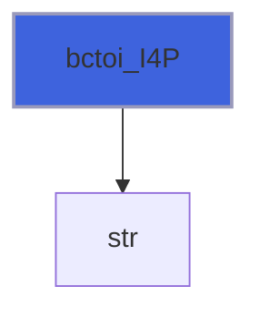

### bctoi_I2P

Convert bit-string to integer.

```fortran
 use penf
 print FI2P, bcton('0000000000000001', knd=1_I2P)
```

**Attributes**: elemental

**Returns**: integer(kind=[I2P](/api/src/third_party/PENF/src/lib/penf_global_parameters_variables))

```fortran
function bctoi_I2P(bstr, knd) result(n)
```

**Arguments**

| Name | Type | Intent | Attributes | Description |
|------|------|--------|------------|-------------|
| `bstr` | character(len=*) | in |  | String containing input number. |
| `knd` | integer(kind=[I2P](/api/src/third_party/PENF/src/lib/penf_global_parameters_variables)) | in |  | Number kind. |

**Call graph**


### bctoi_I1P

Convert bit-string to integer.

```fortran
 use penf
 print FI1P, bcton('00000001', knd=1_I1P)
```

**Attributes**: elemental

**Returns**: integer(kind=[I1P](/api/src/third_party/PENF/src/lib/penf_global_parameters_variables))

```fortran
function bctoi_I1P(bstr, knd) result(n)
```

**Arguments**

| Name | Type | Intent | Attributes | Description |
|------|------|--------|------------|-------------|
| `bstr` | character(len=*) | in |  | String containing input number. |
| `knd` | integer(kind=[I1P](/api/src/third_party/PENF/src/lib/penf_global_parameters_variables)) | in |  | Number kind. |

**Call graph**


