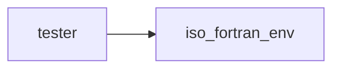

# tester

> Routines to test Fortran programs

**Source**: `src/third_party/fortran_tester/src/tester.f90`

**Dependencies**



## Contents

- [tester_t](#tester-t)
- [init](#init)
- [print](#print)
- [assert_equal_i8](#assert-equal-i8)
- [assert_equal_i16](#assert-equal-i16)
- [assert_equal_i32](#assert-equal-i32)
- [assert_equal_i64](#assert-equal-i64)
- [assert_equal_r32](#assert-equal-r32)
- [assert_equal_r64](#assert-equal-r64)
- [assert_equal_c32](#assert-equal-c32)
- [assert_equal_c64](#assert-equal-c64)
- [assert_equal_l](#assert-equal-l)
- [assert_equal_i8_1](#assert-equal-i8-1)
- [assert_equal_i16_1](#assert-equal-i16-1)
- [assert_equal_i32_1](#assert-equal-i32-1)
- [assert_equal_i64_1](#assert-equal-i64-1)
- [assert_equal_r32_1](#assert-equal-r32-1)
- [assert_equal_r64_1](#assert-equal-r64-1)
- [assert_equal_c32_1](#assert-equal-c32-1)
- [assert_equal_c64_1](#assert-equal-c64-1)
- [assert_equal_l_1](#assert-equal-l-1)
- [assert_positive_i8](#assert-positive-i8)
- [assert_positive_i16](#assert-positive-i16)
- [assert_positive_i32](#assert-positive-i32)
- [assert_positive_i64](#assert-positive-i64)
- [assert_positive_r32](#assert-positive-r32)
- [assert_positive_r64](#assert-positive-r64)
- [assert_positive_i8_1](#assert-positive-i8-1)
- [assert_positive_i16_1](#assert-positive-i16-1)
- [assert_positive_i32_1](#assert-positive-i32-1)
- [assert_positive_i64_1](#assert-positive-i64-1)
- [assert_positive_r32_1](#assert-positive-r32-1)
- [assert_positive_r64_1](#assert-positive-r64-1)
- [assert_close_r32](#assert-close-r32)
- [assert_close_r64](#assert-close-r64)
- [assert_close_r32_1](#assert-close-r32-1)
- [assert_close_r64_1](#assert-close-r64-1)
- [assert_close_c32](#assert-close-c32)
- [assert_close_c64](#assert-close-c64)
- [assert_close_c32_1](#assert-close-c32-1)
- [assert_close_c64_1](#assert-close-c64-1)

## Derived Types

### tester_t

The main **tester** class.

#### Components

| Name | Type | Attributes | Description |
|------|------|------------|-------------|
| `n_errors` | integer(kind=int32) |  | Number of errors. |
| `n_tests` | integer(kind=int32) |  | Number of tests. |
| `tolerance32` | real(kind=real32) |  | Real tolerance, 32 bits. |
| `tolerance64` | real(kind=real64) |  | Real tolerance, 64 bits. |

#### Type-Bound Procedures

| Name | Attributes | Description |
|------|------------|-------------|
| `init` |  | Initialize the tester. |
| `print` |  | Print tests results. |
| `assert_equal` |  | Check if two values (integer, real, complex or logical) are equal. |
| `assert_equal_i8` |  | Check if two integers (8  bits) are equal. |
| `assert_equal_i16` |  | Check if two integers (16 bits) are equal. |
| `assert_equal_i32` |  | Check if two integers (32 bits) are equal. |
| `assert_equal_i64` |  | Check if two integers (64 bits) are equal. |
| `assert_equal_r32` |  | Check if two reals (32 bits) are equal. |
| `assert_equal_r64` |  | Check if two reals (64 bits) are equal. |
| `assert_equal_c32` |  | Check if two complex numbers (32 bits) are equal. |
| `assert_equal_c64` |  | Check if two complex numbers (64 bits) are equal. |
| `assert_equal_l` |  | Check if two logicals are equal. |
| `assert_equal_i8_1` |  | Check if two integer (8  bits) arrays (rank 1) are equal. |
| `assert_equal_i16_1` |  | Check if two integer (16 bits) arrays (rank 1) are equal. |
| `assert_equal_i32_1` |  | Check if two integer (32 bits) arrays (rank 1) are equal. |
| `assert_equal_i64_1` |  | Check if two integer (64 bits) arrays (rank 1) are equal. |
| `assert_equal_r32_1` |  | Check if two real (32 bits) arrays (rank 1) are equal. |
| `assert_equal_r64_1` |  | Check if two real (64 bits) arrays (rank 1) are equal. |
| `assert_equal_c32_1` |  | Check if two complex (32 bits) arrays (rank 1) are equal. |
| `assert_equal_c64_1` |  | Check if two complex (64 bits) arrays (rank 1) are equal. |
| `assert_equal_l_1` |  | Check if two logical arrays (rank 1) are equal. |
| `assert_positive` |  | Check if a number (integer or real) is positive. |
| `assert_positive_i8` |  | Check if a integer (8  bits) is positive. |
| `assert_positive_i16` |  | Check if a integer (16 bits) is positive. |
| `assert_positive_i32` |  | Check if a integer (32 bits) is positive. |
| `assert_positive_i64` |  | Check if a integer (64 bits) is positive. |
| `assert_positive_r32` |  | Check if a real (32 bits) is positive. |
| `assert_positive_r64` |  | Check if a real (64 bits) is positive. |
| `assert_positive_i8_1` |  | Check if a integer (8  bits) array (rank 1) is positive. |
| `assert_positive_i16_1` |  | Check if a integer (16 bits) array (rank 1) is positive. |
| `assert_positive_i32_1` |  | Check if a integer (32 bits) array (rank 1) is positive. |
| `assert_positive_i64_1` |  | Check if a integer (64 bits) array (rank 1) is positive. |
| `assert_positive_r32_1` |  | Check if a real (32 bits) array (rank 1) is positive. |
| `assert_positive_r64_1` |  | Check if a real (64 bits) array (rank 1) is positive. |
| `assert_close` |  | Check if two values (real or complex) are close with respect a tolerance. |
| `assert_close_r32` |  | Check if two reals (32 bits) are close with respect a tolerance. |
| `assert_close_r64` |  | Check if two reals (64 bits) are close with respect a tolerance. |
| `assert_close_c32` |  | Check if two complex numbers (32 bits) are close with respect a tolerance. |
| `assert_close_c64` |  | Check if two complex numbers (64 bits) are close with respect a tolerance. |
| `assert_close_r32_1` |  | Check if two real (32 bits) arrays (rank 1) are close with respect a tolerance. |
| `assert_close_r64_1` |  | Check if two real (64 bits) arrays (rank 1) are close with respect a tolerance. |
| `assert_close_c32_1` |  | Check if two complex (32 bits) arrays (rank 1) are close with respect a tolerance. |
| `assert_close_c64_1` |  | Check if two complex (64 bits) arrays (rank 1) are close with respect a tolerance. |

## Subroutines

### init

Initialize the tester.

```fortran
subroutine init(this, tolerance32, tolerance64)
```

**Arguments**

| Name | Type | Intent | Attributes | Description |
|------|------|--------|------------|-------------|
| `this` | class([tester_t](/api/src/third_party/fortran_tester/src/tester#tester-t)) | out |  | The tester. |
| `tolerance32` | real(kind=real32) | in | optional | Real tolerance, 32 bits. |
| `tolerance64` | real(kind=real64) | in | optional | Real tolerance, 64 bits. |

### print

Print tests results.

```fortran
subroutine print(this, errorstop)
```

**Arguments**

| Name | Type | Intent | Attributes | Description |
|------|------|--------|------------|-------------|
| `this` | class([tester_t](/api/src/third_party/fortran_tester/src/tester#tester-t)) | in |  | The tester. |
| `errorstop` | logical | in | optional | Flag to activate error stop if one test fails. |

### assert_equal_i8

Check if two integers (8 bits) are equal.

```fortran
subroutine assert_equal_i8(this, i1, i2)
```

**Arguments**

| Name | Type | Intent | Attributes | Description |
|------|------|--------|------------|-------------|
| `this` | class([tester_t](/api/src/third_party/fortran_tester/src/tester#tester-t)) | inout |  | The tester. |
| `i1` | integer(kind=int8) | in |  | Value to compare. |
| `i2` | integer(kind=int8) | in |  | Value to compare. |

### assert_equal_i16

Check if two integers (16 bits) are equal.

```fortran
subroutine assert_equal_i16(this, i1, i2)
```

**Arguments**

| Name | Type | Intent | Attributes | Description |
|------|------|--------|------------|-------------|
| `this` | class([tester_t](/api/src/third_party/fortran_tester/src/tester#tester-t)) | inout |  | The tester. |
| `i1` | integer(kind=int16) | in |  | Value to compare. |
| `i2` | integer(kind=int16) | in |  | Value to compare. |

### assert_equal_i32

Check if two integers (32 bits) are equal.

```fortran
subroutine assert_equal_i32(this, i1, i2)
```

**Arguments**

| Name | Type | Intent | Attributes | Description |
|------|------|--------|------------|-------------|
| `this` | class([tester_t](/api/src/third_party/fortran_tester/src/tester#tester-t)) | inout |  | The tester. |
| `i1` | integer(kind=int32) | in |  | Value to compare. |
| `i2` | integer(kind=int32) | in |  | Value to compare. |

### assert_equal_i64

Check if two integers (64 bits) are equal.

```fortran
subroutine assert_equal_i64(this, i1, i2)
```

**Arguments**

| Name | Type | Intent | Attributes | Description |
|------|------|--------|------------|-------------|
| `this` | class([tester_t](/api/src/third_party/fortran_tester/src/tester#tester-t)) | inout |  | The tester. |
| `i1` | integer(kind=int64) | in |  | Value to compare. |
| `i2` | integer(kind=int64) | in |  | Value to compare. |

### assert_equal_r32

Check if two reals (32 bits) are equal.

```fortran
subroutine assert_equal_r32(this, r1, r2)
```

**Arguments**

| Name | Type | Intent | Attributes | Description |
|------|------|--------|------------|-------------|
| `this` | class([tester_t](/api/src/third_party/fortran_tester/src/tester#tester-t)) | inout |  | The tester. |
| `r1` | real(kind=real32) | in |  | Value to compare. |
| `r2` | real(kind=real32) | in |  | Value to compare. |

### assert_equal_r64

Check if two reals (64 bits) are equal.

```fortran
subroutine assert_equal_r64(this, r1, r2)
```

**Arguments**

| Name | Type | Intent | Attributes | Description |
|------|------|--------|------------|-------------|
| `this` | class([tester_t](/api/src/third_party/fortran_tester/src/tester#tester-t)) | inout |  | The tester. |
| `r1` | real(kind=real64) | in |  | Value to compare. |
| `r2` | real(kind=real64) | in |  | Value to compare. |

### assert_equal_c32

Check if two complex numbers (32 bits) are equal.

```fortran
subroutine assert_equal_c32(this, c1, c2)
```

**Arguments**

| Name | Type | Intent | Attributes | Description |
|------|------|--------|------------|-------------|
| `this` | class([tester_t](/api/src/third_party/fortran_tester/src/tester#tester-t)) | inout |  | The tester. |
| `c1` | complex(kind=real32) | in |  | Value to compare. |
| `c2` | complex(kind=real32) | in |  | Value to compare. |

### assert_equal_c64

Check if two complex numbers (64 bits) are equal.

```fortran
subroutine assert_equal_c64(this, c1, c2)
```

**Arguments**

| Name | Type | Intent | Attributes | Description |
|------|------|--------|------------|-------------|
| `this` | class([tester_t](/api/src/third_party/fortran_tester/src/tester#tester-t)) | inout |  | The tester. |
| `c1` | complex(kind=real64) | in |  | Value to compare. |
| `c2` | complex(kind=real64) | in |  | Value to compare. |

### assert_equal_l

Check if two logicals are equal.

```fortran
subroutine assert_equal_l(this, l1, l2)
```

**Arguments**

| Name | Type | Intent | Attributes | Description |
|------|------|--------|------------|-------------|
| `this` | class([tester_t](/api/src/third_party/fortran_tester/src/tester#tester-t)) | inout |  | The tester. |
| `l1` | logical | in |  | Value to compare. |
| `l2` | logical | in |  | Value to compare. |

### assert_equal_i8_1

Check if two integer (8 bits) arrays (rank 1) are equal.

```fortran
subroutine assert_equal_i8_1(this, i1, i2)
```

**Arguments**

| Name | Type | Intent | Attributes | Description |
|------|------|--------|------------|-------------|
| `this` | class([tester_t](/api/src/third_party/fortran_tester/src/tester#tester-t)) | inout |  | The tester. |
| `i1` | integer(kind=int8) | in | dimension(:) | Value to compare. |
| `i2` | integer(kind=int8) | in | dimension(:) | Value to compare. |

### assert_equal_i16_1

Check if two integer (16 bits) arrays (rank 1) are equal.

```fortran
subroutine assert_equal_i16_1(this, i1, i2)
```

**Arguments**

| Name | Type | Intent | Attributes | Description |
|------|------|--------|------------|-------------|
| `this` | class([tester_t](/api/src/third_party/fortran_tester/src/tester#tester-t)) | inout |  | The tester. |
| `i1` | integer(kind=int16) | in | dimension(:) | Value to compare. |
| `i2` | integer(kind=int16) | in | dimension(:) | Value to compare. |

### assert_equal_i32_1

Check if two integer (32 bits) arrays (rank 1) are equal.

```fortran
subroutine assert_equal_i32_1(this, i1, i2)
```

**Arguments**

| Name | Type | Intent | Attributes | Description |
|------|------|--------|------------|-------------|
| `this` | class([tester_t](/api/src/third_party/fortran_tester/src/tester#tester-t)) | inout |  | The tester. |
| `i1` | integer(kind=int32) | in | dimension(:) | Value to compare. |
| `i2` | integer(kind=int32) | in | dimension(:) | Value to compare. |

### assert_equal_i64_1

Check if two integer (64 bits) arrays (rank 1) are equal.

```fortran
subroutine assert_equal_i64_1(this, i1, i2)
```

**Arguments**

| Name | Type | Intent | Attributes | Description |
|------|------|--------|------------|-------------|
| `this` | class([tester_t](/api/src/third_party/fortran_tester/src/tester#tester-t)) | inout |  | The tester. |
| `i1` | integer(kind=int64) | in | dimension(:) | Value to compare. |
| `i2` | integer(kind=int64) | in | dimension(:) | Value to compare. |

### assert_equal_r32_1

Check if two real (32 bits) arrays (rank 1) are equal.

```fortran
subroutine assert_equal_r32_1(this, r1, r2)
```

**Arguments**

| Name | Type | Intent | Attributes | Description |
|------|------|--------|------------|-------------|
| `this` | class([tester_t](/api/src/third_party/fortran_tester/src/tester#tester-t)) | inout |  | The tester. |
| `r1` | real(kind=real32) | in | dimension(:) | Value to compare. |
| `r2` | real(kind=real32) | in | dimension(:) | Value to compare. |

### assert_equal_r64_1

Check if two real (64 bits) arrays (rank 1) are equal.

```fortran
subroutine assert_equal_r64_1(this, r1, r2)
```

**Arguments**

| Name | Type | Intent | Attributes | Description |
|------|------|--------|------------|-------------|
| `this` | class([tester_t](/api/src/third_party/fortran_tester/src/tester#tester-t)) | inout |  | The tester. |
| `r1` | real(kind=real64) | in | dimension(:) | Value to compare. |
| `r2` | real(kind=real64) | in | dimension(:) | Value to compare. |

### assert_equal_c32_1

Check if two complex (32 bits) arrays (rank 1) are equal.

```fortran
subroutine assert_equal_c32_1(this, c1, c2)
```

**Arguments**

| Name | Type | Intent | Attributes | Description |
|------|------|--------|------------|-------------|
| `this` | class([tester_t](/api/src/third_party/fortran_tester/src/tester#tester-t)) | inout |  | The tester. |
| `c1` | complex(kind=real32) | in | dimension(:) | Value to compare. |
| `c2` | complex(kind=real32) | in | dimension(:) | Value to compare. |

### assert_equal_c64_1

Check if two complex (64 bits) arrays (rank 1) are equal.

```fortran
subroutine assert_equal_c64_1(this, c1, c2)
```

**Arguments**

| Name | Type | Intent | Attributes | Description |
|------|------|--------|------------|-------------|
| `this` | class([tester_t](/api/src/third_party/fortran_tester/src/tester#tester-t)) | inout |  | The tester. |
| `c1` | complex(kind=real64) | in | dimension(:) | Value to compare. |
| `c2` | complex(kind=real64) | in | dimension(:) | Value to compare. |

### assert_equal_l_1

Check if two logical arrays (rank 1) are equal.

```fortran
subroutine assert_equal_l_1(this, l1, l2)
```

**Arguments**

| Name | Type | Intent | Attributes | Description |
|------|------|--------|------------|-------------|
| `this` | class([tester_t](/api/src/third_party/fortran_tester/src/tester#tester-t)) | inout |  | The tester. |
| `l1` | logical | in | dimension(:) | Value to compare. |
| `l2` | logical | in | dimension(:) | Value to compare. |

### assert_positive_i8

Check if a integer (32 bits) is positive.

```fortran
subroutine assert_positive_i8(this, i)
```

**Arguments**

| Name | Type | Intent | Attributes | Description |
|------|------|--------|------------|-------------|
| `this` | class([tester_t](/api/src/third_party/fortran_tester/src/tester#tester-t)) | inout |  | The tester. |
| `i` | integer(kind=int8) | in |  | Value to check. |

### assert_positive_i16

Check if a integer (16 bits) is positive.

```fortran
subroutine assert_positive_i16(this, i)
```

**Arguments**

| Name | Type | Intent | Attributes | Description |
|------|------|--------|------------|-------------|
| `this` | class([tester_t](/api/src/third_party/fortran_tester/src/tester#tester-t)) | inout |  | The tester. |
| `i` | integer(kind=int16) | in |  | Value to check. |

### assert_positive_i32

Check if a integer (32 bits) is positive.

```fortran
subroutine assert_positive_i32(this, i)
```

**Arguments**

| Name | Type | Intent | Attributes | Description |
|------|------|--------|------------|-------------|
| `this` | class([tester_t](/api/src/third_party/fortran_tester/src/tester#tester-t)) | inout |  | The tester. |
| `i` | integer(kind=int32) | in |  | Value to check. |

### assert_positive_i64

Check if a integer (32 bits) is positive.

```fortran
subroutine assert_positive_i64(this, i)
```

**Arguments**

| Name | Type | Intent | Attributes | Description |
|------|------|--------|------------|-------------|
| `this` | class([tester_t](/api/src/third_party/fortran_tester/src/tester#tester-t)) | inout |  | The tester. |
| `i` | integer(kind=int64) | in |  | Value to check. |

### assert_positive_r32

Check if a real (32 bits) is positive.

```fortran
subroutine assert_positive_r32(this, r)
```

**Arguments**

| Name | Type | Intent | Attributes | Description |
|------|------|--------|------------|-------------|
| `this` | class([tester_t](/api/src/third_party/fortran_tester/src/tester#tester-t)) | inout |  | The tester. |
| `r` | real(kind=real32) | in |  | Value to check. |

### assert_positive_r64

Check if a real (64 bits) is positive.

```fortran
subroutine assert_positive_r64(this, r)
```

**Arguments**

| Name | Type | Intent | Attributes | Description |
|------|------|--------|------------|-------------|
| `this` | class([tester_t](/api/src/third_party/fortran_tester/src/tester#tester-t)) | inout |  | The tester. |
| `r` | real(kind=real64) | in |  | Value to check. |

### assert_positive_i8_1

Check if a integer (8 bits) array (rank 1) is positive.

```fortran
subroutine assert_positive_i8_1(this, i)
```

**Arguments**

| Name | Type | Intent | Attributes | Description |
|------|------|--------|------------|-------------|
| `this` | class([tester_t](/api/src/third_party/fortran_tester/src/tester#tester-t)) | inout |  | The tester. |
| `i` | integer(kind=int8) | in | dimension(:) | Value to check. |

### assert_positive_i16_1

Check if a integer (16 bits) array (rank 1) is positive.

```fortran
subroutine assert_positive_i16_1(this, i)
```

**Arguments**

| Name | Type | Intent | Attributes | Description |
|------|------|--------|------------|-------------|
| `this` | class([tester_t](/api/src/third_party/fortran_tester/src/tester#tester-t)) | inout |  | The tester. |
| `i` | integer(kind=int16) | in | dimension(:) | Value to check. |

### assert_positive_i32_1

Check if a integer (32 bits) array (rank 1) is positive.

```fortran
subroutine assert_positive_i32_1(this, i)
```

**Arguments**

| Name | Type | Intent | Attributes | Description |
|------|------|--------|------------|-------------|
| `this` | class([tester_t](/api/src/third_party/fortran_tester/src/tester#tester-t)) | inout |  | The tester. |
| `i` | integer(kind=int32) | in | dimension(:) | Value to check. |

### assert_positive_i64_1

Check if a integer (64 bits) array (rank 1) is positive.

```fortran
subroutine assert_positive_i64_1(this, i)
```

**Arguments**

| Name | Type | Intent | Attributes | Description |
|------|------|--------|------------|-------------|
| `this` | class([tester_t](/api/src/third_party/fortran_tester/src/tester#tester-t)) | inout |  | The tester. |
| `i` | integer(kind=int64) | in | dimension(:) | Value to check. |

### assert_positive_r32_1

Check if a real (32 bits) array (rank 1) is positive.

```fortran
subroutine assert_positive_r32_1(this, r)
```

**Arguments**

| Name | Type | Intent | Attributes | Description |
|------|------|--------|------------|-------------|
| `this` | class([tester_t](/api/src/third_party/fortran_tester/src/tester#tester-t)) | inout |  | The tester. |
| `r` | real(kind=real32) | in | dimension(:) | Value to check. |

### assert_positive_r64_1

Check if a real (64 bits) array (rank 1) is positive.

```fortran
subroutine assert_positive_r64_1(this, r)
```

**Arguments**

| Name | Type | Intent | Attributes | Description |
|------|------|--------|------------|-------------|
| `this` | class([tester_t](/api/src/third_party/fortran_tester/src/tester#tester-t)) | inout |  | The tester. |
| `r` | real(kind=real64) | in | dimension(:) | Value to check. |

### assert_close_r32

Check if two reals (32 bits) are close with respect a tolerance.

```fortran
subroutine assert_close_r32(this, r1, r2)
```

**Arguments**

| Name | Type | Intent | Attributes | Description |
|------|------|--------|------------|-------------|
| `this` | class([tester_t](/api/src/third_party/fortran_tester/src/tester#tester-t)) | inout |  | The tester. |
| `r1` | real(kind=real32) | in |  | Value to compare. |
| `r2` | real(kind=real32) | in |  | Value to compare. |

### assert_close_r64

Check if two reals (64 bits) are close with respect a tolerance.

```fortran
subroutine assert_close_r64(this, r1, r2)
```

**Arguments**

| Name | Type | Intent | Attributes | Description |
|------|------|--------|------------|-------------|
| `this` | class([tester_t](/api/src/third_party/fortran_tester/src/tester#tester-t)) | inout |  | The tester. |
| `r1` | real(kind=real64) | in |  | Value to compare. |
| `r2` | real(kind=real64) | in |  | Value to compare. |

### assert_close_r32_1

Check if two real (32 bits) arrays (rank 1) are close with respect a tolerance.

```fortran
subroutine assert_close_r32_1(this, r1, r2)
```

**Arguments**

| Name | Type | Intent | Attributes | Description |
|------|------|--------|------------|-------------|
| `this` | class([tester_t](/api/src/third_party/fortran_tester/src/tester#tester-t)) | inout |  | The tester. |
| `r1` | real(kind=real32) | in | dimension(:) | Value to compare. |
| `r2` | real(kind=real32) | in | dimension(:) | Value to compare. |

### assert_close_r64_1

Check if two real (64 bits) arrays (rank 1) are close with respect a tolerance.

```fortran
subroutine assert_close_r64_1(this, r1, r2)
```

**Arguments**

| Name | Type | Intent | Attributes | Description |
|------|------|--------|------------|-------------|
| `this` | class([tester_t](/api/src/third_party/fortran_tester/src/tester#tester-t)) | inout |  | The tester. |
| `r1` | real(kind=real64) | in | dimension(:) | Value to compare. |
| `r2` | real(kind=real64) | in | dimension(:) | Value to compare. |

### assert_close_c32

Check if two complex numbers (32 bits) are close with respect a tolerance.

```fortran
subroutine assert_close_c32(this, c1, c2)
```

**Arguments**

| Name | Type | Intent | Attributes | Description |
|------|------|--------|------------|-------------|
| `this` | class([tester_t](/api/src/third_party/fortran_tester/src/tester#tester-t)) | inout |  | The tester. |
| `c1` | complex(kind=real32) | in |  | Value to compare. |
| `c2` | complex(kind=real32) | in |  | Value to compare. |

### assert_close_c64

Check if two complex numbers (64 bits) are close with respect a tolerance.

```fortran
subroutine assert_close_c64(this, r1, c2)
```

**Arguments**

| Name | Type | Intent | Attributes | Description |
|------|------|--------|------------|-------------|
| `this` | class([tester_t](/api/src/third_party/fortran_tester/src/tester#tester-t)) | inout |  | The tester. |
| `r1` | complex(kind=real64) | in |  | Value to compare. |
| `c2` | complex(kind=real64) | in |  | Value to compare. |

### assert_close_c32_1

Check if two complex (32 bits) arrays (rank 1) are close with respect a tolerance.

```fortran
subroutine assert_close_c32_1(this, c1, c2)
```

**Arguments**

| Name | Type | Intent | Attributes | Description |
|------|------|--------|------------|-------------|
| `this` | class([tester_t](/api/src/third_party/fortran_tester/src/tester#tester-t)) | inout |  | The tester. |
| `c1` | complex(kind=real32) | in | dimension(:) | Value to compare. |
| `c2` | complex(kind=real32) | in | dimension(:) | Value to compare. |

### assert_close_c64_1

Check if two real (64 bits) arrays (rank 1) are close with respect a tolerance.

```fortran
subroutine assert_close_c64_1(this, c1, c2)
```

**Arguments**

| Name | Type | Intent | Attributes | Description |
|------|------|--------|------------|-------------|
| `this` | class([tester_t](/api/src/third_party/fortran_tester/src/tester#tester-t)) | inout |  | The tester. |
| `c1` | complex(kind=real64) | in | dimension(:) | Value to compare. |
| `c2` | complex(kind=real64) | in | dimension(:) | Value to compare. |
