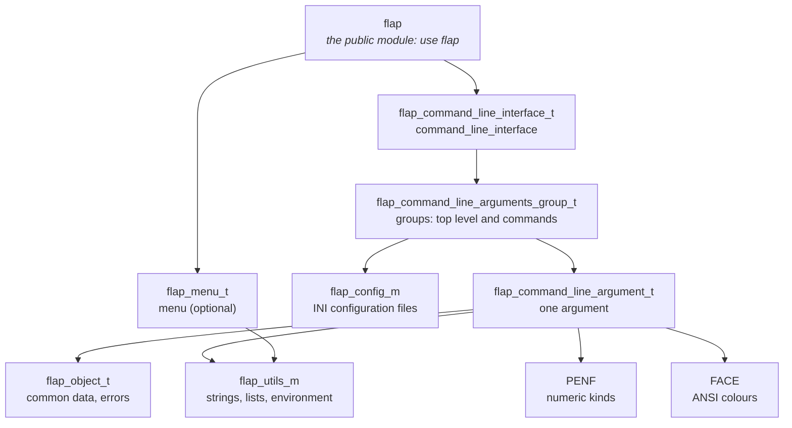

# Features

## The four steps

Every FLAP program follows the same four steps: initialise the CLI, define the arguments, parse, get the values.

```fortran
program myprogram
use flap
implicit none
type(command_line_interface) :: cli
character(256)               :: outfile
integer                      :: error

call cli%init(progname='myprogram', description='Does something useful')              ! 1. initialise
call cli%add(switch='--output', switch_ab='-o', help='Output file', required=.true., &
             act='store', error=error)                                                 ! 2. define
call cli%parse(error=error)                                                            ! 3. parse
if (error /= 0) stop 1, quiet=.true.
call cli%get(switch='-o', val=outfile, error=error)                                    ! 4. get
endprogram myprogram
```

## Feature map

| Area | Features | Where |
|---|---|---|
| **Arguments** | named switches with abbreviations; positionals; flags (`store_true`/`store_false`) and flag pairs `--x/--no-x`; counters (`-vvv`); repeatable options (`append`); optional values (`store*`); hidden arguments; value placeholders (`metavar`) | [Defining Arguments](./arguments) |
| **Values** | typed `get` into any integer, real, logical or character kind; fixed-size lists (`nargs='N'`) and runtime-sized ones (`'+'`, `'*'`, `get_varying`); `KEY=VALUE` maps; inline values `--opt=value`; shell-like splitting of `parse(args=...)` | [Arguments](./arguments#list-valued-arguments-nargs), [Parsing](./parsing) |
| **Sources** | environment variables (explicit or generated names, comma-separated lists, flag words); INI configuration files; the source of every value (`get_source`, `provenance`); `ignore_env` for reproducible runs | [Advanced](./advanced#value-sources) |
| **Validation** | required options; choices (also case-insensitive); numeric ranges with open bounds or clamping; path checks (exist, readable, writable, `-`); mutually exclusive pairs, sets and commands; deprecated options and commands; application errors in FLAP's style (`raise_error`) | [Arguments](./arguments), [Advanced](./advanced), [Errors](./errors) |
| **Commands** | git-style commands, each with its options and help; aliases; option sets copied between commands; several commands per command line | [Subcommands](./subcommands) |
| **Help and errors** | help and usage generated from the definitions; "did you mean" suggestions; a hint line after an error; a shorter output after an error (`usage_on_error`); colours; case-insensitive switches and commands; alternate actions (`--list-models`) | [Output](./output), [Errors](./errors) |
| **Generated files** | man page (`--man`), Markdown (`--markdown`), completion scripts for bash, zsh, fish and PowerShell, printed or installed by the program itself (`--show-completion`, `--install-completion`) | [Output Formats](./output) |
| **Testing** | parse a string (`parse(args=...)`), parse again (`reset_parse`), statuses returned instead of stopping (`standalone=.false.`), output units of your choice | [Parsing](./parsing), [Errors](./errors#handling-status-codes) |
| **Menus** | interactive numbered menus: single or multiple choice, defaults, yes/no questions, retries; safe in batch jobs | [Interactive Menus](./menu) |

Every error and status has a named constant exported by the `flap` module (see [Error Codes](./errors)).

## Module architecture



Use only the `flap` module: it exports the types, the error codes, the statuses and the source constants.

Any feature request is welcome: open an issue on [GitHub](https://github.com/szaghi/FLAP/issues).
