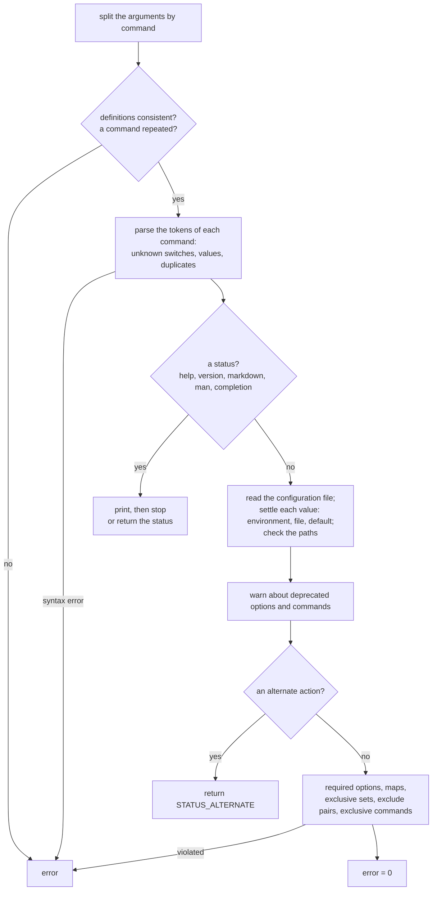

# Parsing & Getting Values

After defining the arguments, a program parses the command line and reads the values into its variables.

## Parsing — `cli%parse`

```fortran
call cli%parse(pref, args, error)
```

| Argument | Type | Purpose |
|---|---|---|
| `pref` | `character(*)`, optional | Prefix of the error messages |
| `args` | `character(*)`, optional | Parse this string instead of the real command line |
| `error` | `integer`, optional | 0 on success, a positive error code, or a negative status (see [Error Codes](./errors)) |

```fortran
call cli%parse(error=error)
if (error /= 0) stop 1, quiet=.true.
```

FLAP has already printed the message of an error: the program only has to end with a non-zero exit status.
(`stop code, quiet=.true.` is Fortran 2018; nvfortran 26.5 rejects `quiet=`, use `call exit(1)` there.)

In standalone mode (the default), `--help`, `--version`, `--markdown`, `--man` and the completion builtins end the
program inside `parse`, with exit status 0; with `init(standalone=.false.)` `parse` returns their status instead.

`parse` is optional: the first `get` parses the real command line if `parse` has not been called. An explicit call
checks the whole command line at once, before any value is used.

### What `parse` does, in order



A syntax error anywhere on the command line wins over `--help`; `--help` wins over `--version`, which wins over
`--markdown`, `--man` and the completion builtins. Choices and ranges are checked later, by `get`.

### Testing with a fake command line

`args` parses a string instead of the real command line, for tests and examples:

```fortran
call cli%parse(args='--level 3 --verbose', error=error)
```

The string is split the way a shell splits a command line:

- blanks and tabs separate arguments outside quotes;
- text inside `'...'` or `"..."` is taken literally, so a value can contain blanks and quotes of the other kind
  (`--msg "it's done"`);
- a quoted part is joined to the adjacent text (`a"b c"d` is the single argument `ab cd`);
- a quoted empty string (`''`) is an empty argument;
- there are no escape characters, and an unterminated quote extends to the end of the string.

As with the real command line, blanks around each argument are removed.

### Inline values: `--option=value`

A value can be attached to its switch with `=`, in both forms of the switch (`--format=json`, `-f=json`). The argument is
split at the **first** `=` (`--out=a=b` gives `a=b`), only when the part before it is a switch of the command being
parsed: `a=b` stays a positional value and `--unknown=3` an unknown switch. Only options storing a single value take
one: `--flag=yes` is `ERROR_INLINE_VALUE_NOT_ALLOWED` (25), a list (`nargs`) is `ERROR_INLINE_VALUE_NARGS` (26); a map
takes one pair (`--set=cfl=0.5`). An empty inline value (`--out=`) is the empty string, as `--out ""` is.

### Values that start with a dash

An option taking a value takes the next argument unless it is a switch of the command being parsed: `--pattern -x`
gives `-x`, `--shift -3.5` gives `-3.5`. A positional value is stricter: an argument starting with a dash followed by
anything but a digit or a dot is never a positional value, so `-3.5` and `-` are values while `--bogus` is an unknown
switch.

After the hidden builtin `--`, the arguments are not parsed: they are collected, as they are, in the list of `--`
itself, which the program can read with `cli%get_varying(switch='--', val=rest)` (to pass them to another program, for
instance).

### Parsing more than once

`parse` works once: after a successful parse, further calls return at once (`error = 0`) and keep the first result. To
parse another command line with the same definitions, call `reset_parse` first:

```fortran
call cli%parse(args='--level 3', error=error)
! ...
call cli%reset_parse                            ! forget values, passed flags, called commands and errors
call cli%parse(args='--level 5', error=error)   ! parsed again
```

A parse that fails does not count as done: the next `get` parses again, and without `args` it parses the **real**
command line. Call `reset_parse` before trying another string. `cli%is_parsed()` tells whether the CLI has been parsed.

---

## Retrieving values — `cli%get`

```fortran
call cli%get(val, switch, position, group, args, pref, error)
```

| Argument | Type | Purpose |
|---|---|---|
| `val` | scalar or array | The variable to fill, of any supported type |
| `switch` | `character(*)`, optional | Switch name (long, abbreviated, or the negation of a flag) |
| `position` | `integer`, optional | Position of a positional argument |
| `group` | `character(*)`, optional | Command (name or alias) the argument belongs to |
| `args` | `character(*)`, optional | Parsed first if the CLI has not been parsed yet |
| `pref` | `character(*)`, optional | Prefix of the error messages |
| `error` | `integer`, optional | Error code |

`val` can be an `integer` of any PENF kind (`I1P`, `I2P`, `I4P`, `I8P`), a `real` (`R4P`, `R8P`, and `R16P` when built
with `-DPENF_R16P`), a `logical` or a `character`, scalar or a fixed-size array. The value is converted to the type of
`val`; `choices` and numeric ranges are checked at this point. A type FLAP cannot fill (e.g. `complex`) is
`ERROR_UNSUPPORTED_TYPE` (46).

<<< @/examples/snippets/myapp-get.f90

<<< @/examples/output/myapp.ansi{ansi}

- A **fixed-size array** reads a list with `nargs='N'`: it must have exactly as many elements as the values (passed or
  default), otherwise `get` returns `ERROR_LIST_SIZE` (47) and leaves the array untouched.
- A `character` variable receives the value truncated or padded to its length.
- A `count` option reads into an integer; a flag into a logical.
- An option of a command is read with `group=`: `cli%get(group='commit', switch='-m', val=message)`.

---

## Runtime-sized lists — `cli%get_varying`

`nargs='+'`, `nargs='*'` and `act='append'` give lists whose length is known only at run time: read them into an
allocatable array, which `get_varying` allocates to the exact size (a size-0 array for an empty list):

```fortran
call cli%get_varying(val, switch, position, group, args, pref, error)
```

<<< @/examples/snippets/lists-get.f90

<<< @/examples/output/lists.ansi{ansi}

`choices` and ranges are checked on every value of the list.

---

## Checking whether an argument was passed — `cli%is_passed`

```fortran
logical :: was_passed

was_passed = cli%is_passed(switch='--output')
was_passed = cli%is_passed(switch='-o')                  ! abbreviated form
was_passed = cli%is_passed(position=1)                   ! positional
was_passed = cli%is_passed(group='commit', switch='-m')  ! in a command
```

`is_passed` means "seen on the command line". A value can also come from an environment variable or a configuration
file: `get` returns it, and it satisfies a required option, but `is_passed` stays `.false.`. To know where a value comes
from, use `get_source`.

---

## Where a value comes from

Every value has a source, one of `SOURCE_COMMANDLINE`, `SOURCE_ENVIRONMENT`, `SOURCE_CONFIG`, `SOURCE_DEFAULT` or
`SOURCE_NONE` (ordered from the most to the least explicit):

```fortran
if (cli%get_source(switch='--cfl') < SOURCE_DEFAULT) then
  ! given by the user: command line, environment or configuration file
end if
```

`provenance` returns one line per visible option of the top level and of the called commands, for the log of a run,
where it matters for reproducibility:

<<< @/examples/snippets/config-provenance.f90

<<< @/examples/output/config-override.ansi{ansi}

Both parse first if `parse` has not been called; an undefined option makes `get_source` return `SOURCE_NONE` with
`ERROR_MISSING_CLA` (1000). Hidden options and the builtins are not reported.

## Checking whether an argument is defined — `cli%is_defined`

```fortran
defined = cli%is_defined(switch='--output')
defined = cli%is_defined(switch='-o', group='commit')
defined = cli%is_defined_group(group='commit')        ! a command (name or alias)
```

`is_defined` tells whether a switch has been **registered** (not whether it was passed), for code that works on a CLI
it did not build itself.

---

## Freeing and redefining the CLI — `cli%free`

`cli%free()` destroys every definition and value, back to the default-initialised state; `init` calls it too. The CLI
is also freed automatically when it goes out of scope.

---

## Complete example

<<< @/examples/snippets/myapp.f90

<<< @/examples/output/myapp-help.ansi{ansi}
