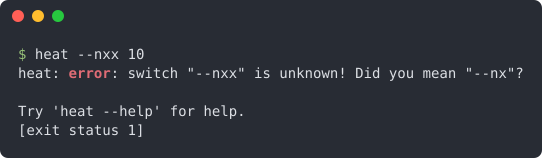

## Quick start

A real session with a FLAP program: the help, the values and the errors all come from FLAP.

This is the whole program, in four steps: initialise, define, parse, get.

<<< @/examples/snippets/quickstart.f90

## Grows with your program

The same calls scale to commands, configuration files, a man page and shell completion. This help is generated from
the definitions of the `heat` solver that the [tutorial](/manual/tutorial/07-shipping) builds step by step; the colours
are two keywords.

Learn FLAP step by step in the [tutorial](/manual/tutorial/01-first-cli), find quick answers in the [cookbook](/manual/cookbook), look up every detail in the [reference](/guide/features#feature-map). Upgrading from v1.x? Read [Upgrading](/guide/migration).

## Authors

- Stefano Zaghi — [@szaghi](https://github.com/szaghi)

Contributions are welcome — see the [Contributing](/guide/contributing) page.

## Copyrights

This project is distributed under a multi-licensing system:

- **FOSS projects**: [GPL v3](http://www.gnu.org/licenses/gpl-3.0.html)
- **Closed source / commercial**: [BSD 2-Clause](http://opensource.org/licenses/BSD-2-Clause), [BSD 3-Clause](http://opensource.org/licenses/BSD-3-Clause), or [MIT](http://opensource.org/licenses/MIT)

> Anyone interested in using, developing, or contributing to this project is welcome — pick the license that best fits your needs.
