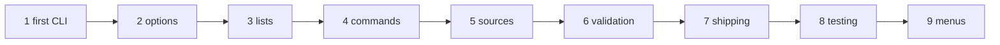

# The tutorial

The tutorial teaches FLAP by building one program, step by step. The [cookbook](./cookbook) then collects short recipes
for everyday tasks, and the [reference](/guide/features#feature-map) has every keyword, every rule, every error code.

## The chapters

The tutorial builds the command line of `heat`, a (pretend) solver of the 2D heat equation, from three options to a
polished, tested program with commands, configuration files and shell completion. Each chapter is a complete program
that you can compile and run; every output shown is the real output of that program.

| Chapter | You learn |
|---|---|
| [1. A first command line](./tutorial/01-first-cli) | `init`, `add`, `parse`, `get`; the free `--help` and `--version`; errors and exit statuses |
| [2. Options of every kind](./tutorial/02-options) | types, choices, ranges, counters, flags, optional values, placeholders |
| [3. Lists and parameters](./tutorial/03-lists) | fixed and variable lists, `KEY=VALUE` maps |
| [4. Commands](./tutorial/04-commands) | `run`, `post`, `info`: commands with their own options, aliases, shared options |
| [5. Values from everywhere](./tutorial/05-sources) | environment variables, a configuration file, the provenance of every value |
| [6. Validation](./tutorial/06-validation) | exclusive options, file checks, deprecations, auxiliary actions, the program's own checks |
| [7. Shipping it](./tutorial/07-shipping) | a polished help, colours, man page, Markdown, shell completion |
| [8. Testing the command line](./tutorial/08-testing) | parsing strings, statuses instead of stops, capturing the messages |
| [9. Asking the user](./tutorial/09-asking) | an interactive menu, only when a value is missing |



## The cookbook

[The cookbook](./cookbook) answers "how do I ...?" in a few lines each: a verbose flag, a list of files, an option that
reads an environment variable, a subcommand, a test of the command line, ...

## Building the examples

Every program of the tutorial and of the cookbook is in [`docs/examples/src`](https://github.com/szaghi/FLAP/tree/master/docs/examples/src).
With FLAP built by FoBiS (`fobis build --mode static-gnu`, see [Installation](/guide/install)):

```bash
gfortran -I static/mod docs/examples/src/heat_1.f90 static/libflap.a -o heat
./heat --help
```

`bash scripts/docs_examples.sh` builds and runs all of them, regenerating the outputs shown in these pages.

The examples end on an error with `stop 1, quiet=.true.`: FLAP has already printed the message, the program only sets
the exit status (Fortran 2018; with nvfortran 26.5, which rejects `quiet=`, use `call exit(1)`).
