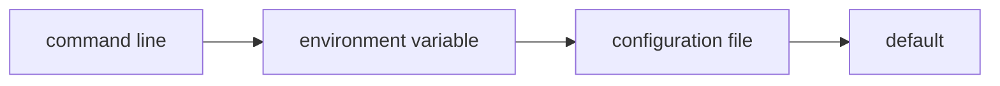

# 5. Values from everywhere

On a cluster, `heat` runs from a batch script: some values belong to the environment of the job, others to a
configuration file shared by a whole study. FLAP reads both, with a fixed precedence:

<<< @/examples/snippets/heat_5-define.f90

- `auto_envvar_prefix='HEAT'` gives every option a variable: `HEAT_THREADS`, and `HEAT_RUN_NX`, `HEAT_RUN_CFL` for the
  options of `run`. The help shows them.
- `act='config'` makes `--config` the name of a configuration file, `heat.ini` by default (a missing default file is
  simply skipped):

<<< @/examples/files/heat.ini{ini}

The keys are the long switches without the dashes; a `[section]` holds the options of a command.

## Where does each value come from?

For a simulation, the parameters of a run matter as much as its results. `provenance` reports every value with its
source, ready for the header of a log file:

<<< @/examples/snippets/heat_5-log.f90

<<< @/examples/output/heat_5.ansi{ansi}

<<< @/examples/output/heat_5-env.ansi{ansi}

<<< @/examples/output/heat_5-config.ansi{ansi}

<<< @/examples/output/heat_5-help.ansi{ansi}

For one option, `cli%get_source(switch=...)` returns the source as a constant (`SOURCE_COMMANDLINE`,
`SOURCE_ENVIRONMENT`, `SOURCE_CONFIG`, `SOURCE_DEFAULT`). To make a run immune to the environment, use
`init(ignore_env=.true.)`.

::: tip What you learned
Generated environment variables, configuration files, the precedence of the sources, `provenance`.
Reference: [Advanced Features](/guide/advanced#value-sources).
:::

Next: [6. Validation](./06-validation).
